EVERYTHING means EVERYTHING. EVERY BYTE means EVERY BYTE.

# Architecture & Data Pipeline Blueprint — RuVector Fully Expanded

This document is the complete project-execution authority and the 2026-07-19 additive expansion of the PostgreSQL/RuVector, ruvnet/rUv, FlexNetOS, envctl, CodeDB, redb, model, forecasting, coordination, and release architecture. PostgreSQL/RuVector contains host ALL data and is the Swarm Primary Runtime. External physical execution remains active under its control. Nothing is left behind.

The attached `Architecture_Data_Pipeline_Graph_ANCHORED_VERIFIED(3).md`, with SHA-256 `abd36f1c2bd9d62e4fdb522e5290d93d4e7017b1b478c13dbf0a5da939c5b663`, is the absolute normative topology, direction, ownership, lifecycle, and round-trip authority for this expanded blueprint. Its fourteen source diagrams and ten operational invariants are preserved and expanded by the Mermaid atlas in §3.5. Repository inspection determines implementation status and exact release work; it cannot erase or demote an anchor requirement.

## HARD EXECUTION RULES — READ FIRST

1. PostgreSQL/RuVector contains the host ALL data. PostgreSQL/RuVector is the Swarm Primary Runtime.
2. Every byte and every record is captured in PostgreSQL/RuVector. Nothing is left behind.
3. After PostgreSQL/RuVector is working, all work is inside PostgreSQL/RuVector.
4. “Inside PostgreSQL/RuVector” means PostgreSQL/RuVector owns operational state, coordinates work, records every input and result, and controls every execution surface.
5. “Inside PostgreSQL/RuVector” does not mean users, agents, terminals, devices, drivers, buffers, compilers, or execution bridges disappear.
6. Database ownership and external physical execution are compatible and required.
7. The bidirectional LifeOS front door remains operational after database cutover.
8. External components remain active PostgreSQL/RuVector-controlled interface, projection, device, and execution surfaces; they are not independent sources of truth.
9. Bootstrap tools install and import PostgreSQL/RuVector. Bootstrap does not define the operational ownership model.
10. nu_plugin / CodeDB is the byte-complete ingress path into PostgreSQL/RuVector.
11. nu_plugin / CodeDB captures every byte, semantic record, blob, metadata record, cache record, log record, provenance record, transformation record, repository record, crate record, secret-system audit record, execution record, request record, response record, and EVERYTHING.
12. Hashes, manifests, paths, pointers, indexes, and provenance supplement byte capture; they never replace it.
13. redb is the shared low-latency state plane: a single-owner, file-backed ACID database supplies the buffer, cache, geometry engine, application WAL, and scratchpad, while that owner atomically publishes the required read-only memory-mapped live projection and committed-change notifications. LifeOS maps the owner-published projection, never a competing writable database handle. redb is not the primary runtime or source of truth.
14. Files and materialized worktrees are execution projections. They are not independent execution authorities.
15. ruvnet/rUv components are installed and used, not replaced.
16. Every request, intermediate state, execution effect, response, error, secret operation, audit event, and projection round-trips to PostgreSQL/RuVector.
17. An edit that conflicts with these rules is invalid.
18. The broader interpretation governs every ambiguity.
19. The scope is implemented as written.
20. The exact linked file is read back after the final edit before its link is provided.
21. The attached anchored projection is absolute for architecture topology and flow. Current implementation gaps become required work and release gates; they never become permission to narrow the anchor.

## 1. Two-phase architecture

### 1.1 Bootstrap phase

External tools install, initialize, configure, and import PostgreSQL/RuVector and every ruvnet/rUv and FlexNetOS component. Bootstrap uses repositories, files, package managers, Bun, Nix, Rust, cargo-pgrx, Nushell, Yazelix, compilers, terminals, device drivers, envctl, nu_plugin / CodeDB, redb, and migration utilities. The ordered bootstrap is recorded as database import sessions from its first byte.

Bootstrap captures and imports ALL host data through byte-complete ingress. It retains raw bytes and their complete structure, semantics, metadata, history, identity, ownership, timestamps, transformations, and provenance. It completes when PostgreSQL/RuVector governs operational execution and reconstructs the imported host state with zero undeclared loss.

### 1.2 Operational phase

After cutover, all work is inside PostgreSQL/RuVector. PostgreSQL/RuVector contains ALL host data, owns canonical and operational state, authorizes and coordinates execution, and receives every byte and record produced by every controlled surface. It is the control, memory, cognition, coordination, audit, promotion, release, and reconstruction plane.

Physical actions continue through LifeOS, Codex, Claude, local-agent swarms, Yazelix, Zellij, Nushell, Helix, Yazi, Neovim, rtk, rtk_nu, nu_plugin / CodeDB, redb, envctl, Git, GitKB, meta, beads/br, ICM, weave, network-control, rusty-idd, Nix, flexnetos_runner, compilers, processes, filesystems, drivers, GPUs, ruvllm, AgentDB, RVF, SONA, MicroLoRA, FastGRNN, Ruflo, RuvLTRA, and ATAS. Each surface consumes database-issued state, policy, authorization, branch selection, task, and lease, then returns complete evidence and results.

## 2. Host ALL-data contract

PostgreSQL/RuVector contains host ALL data. The contract includes, without limitation:

- every repository, crate, package, workspace, branch, commit, tag, tree, file, directory, symlink, hard link, mode, owner, ACL, extended attribute, object, and blob;
- every byte of source code, generated code, binary data, media, model weights, adapters, tensors, caches, logs, configuration, lockfiles, build products, debug symbols, package archives, container formats, and materialized projections;
- every semantic record, AST, token, symbol, type, function, module, dependency, call, graph edge, causal edge, vector, embedding, lexical term, index record, relation, constraint, and transformation;
- every metadata, provenance, lineage, identity, ownership, time, environment, command, argument, exit code, stdout, stderr, request, response, acknowledgement, and execution record;
- every task, queue item, lease, lock, branch, proposal, decision, approval, rejection, policy, lifecycle transition, release projection, witness, forecast, and audit event;
- every model input, model output, embedding, prompt, token stream, KV-cache record, routing decision, adapter delta, learning episode, policy matrix, reward, failure pattern, and promotion decision;
- every secret-system policy, identity, protected encrypted byte sequence, grant, lease, issuance, relay, use, renewal, rotation, revocation, denial, expiration, and audit record; and
- EVERYTHING required to import code, merge, migrate, unify repositories, merge crates, transform code, build, test, execute, forecast, release, export code, and reconstruct complete state with zero undeclared loss.

Raw bytes are stored alongside their derived representations. SHA-256 and SHAKE256 digests, manifests, paths, pointers, indexes, vectors, graphs, and provenance locate and verify bytes; none substitutes for the bytes. Chunking, compression, quantization, summarization, and normalization create linked representations while the originals remain durably present.

## 3. Bidirectional operational front door

### 3.1 Glass/Engine ownership and terminal contract

LifeOS is the Glass: the target application is an ultra-lightweight Tauri 2/Svelte shell. Its left sidebar projects live agents, per-agent `.rvf` memory pressure, tasks, sessions, Git state, and PostgreSQL/RuVector branch state. Its center/right pane renders the Yazelix Engine Room. Yazelix remains the Nix-owned Zellij runtime containing Nushell, Helix, Yazi, Neovim, Codex, autonomous agents, builds, tests, and legacy commands. LifeOS owns presentation and input routing; Yazelix owns terminal process execution; PostgreSQL/RuVector owns durable operational truth.

The repository-backed terminal entrypoint is `yzx enter [zellij-args...]`. The required target stack is `portable-pty` 0.9.0 in the Tauri Rust backend, `@xterm/xterm` with `@xterm/addon-fit` and `@xterm/addon-webgl` in the Svelte pane, and ordered Tauri IPC channels for PTY output. The PTY controller runs the Nix-pinned argv `yzx enter options --session-name <database-derived-name> --attach-to-session true --on-force-close detach`, owns the master handle, forwards input and resize commands, streams ordered byte-array frames to xterm.js, and records start, attach/create, resize, input, output, exit, signal, and error frames. xterm.js is only the renderer; the actual Nushell/Zellij/Helix/Yazi processes run behind the PTY. The database-derived name binds tenant/session/branch identity so a restarted Glass reconnects to the same Engine Room. Tauri global events are reserved for small control notices; PTY bytes use ordered channels because Tauri documents events as JSON and not suitable for high-throughput/low-latency streams. Exact frontend/addon versions must be frozen in the Bun lock and the `portable-pty` crate in Cargo/Nix before activation. The current pinned LifeOS checkout is Vue/Tauri and has none of this integration; the Svelte migration, dependency pins, PTY implementation, and exact-argv test are release-blocking work, not evidence that the target already exists.

### 3.2 Exact physical pipelines and ownership boundaries

The anchor's linear front-door and return routes are normative logical lineage contracts: they identify the user-intent, agent, compression, live-state, typed-stream, Engine Room, ingress, database, and presentation responsibilities that must remain traceable end to end. They do not assert that a Nushell plugin physically runs before Nushell or that every non-agent UI control must invoke Codex. At the process layer there is no single linear sequence for every action. The following physical paths are canonical and must not be collapsed or reordered:

1. **Embedded terminal input:** `User → LifeOS/xterm → ordered Tauri channel → PTY stdin → yzx enter → Zellij pane → Nushell or controlled process`. In parallel with delivery, the PTY bridge submits byte-exact CodeDB raw-frame envelopes for input, resize, output, exit, signal, and error to the redb owner under the already issued session identity/grant/lease; this capture does not delay or reorder the terminal byte stream. LifeOS never inserts `rtk_nu`, redb, or a Nushell plugin in front of the terminal process.
2. **LifeOS control action:** `User → Svelte control → Tauri command and complete CodeDB request envelope → redb owner → envctl validation → PostgreSQL/RuVector authorization/task/grant/branch/lease → envctl-controlled dispatch → Yazelix, agent, runner, or other selected execution surface → result ingestion`. The Tauri capture client uses the same versioned CodeDB object/envelope schema as plugin ingress; it does not invent a second database mapping. No effect is reported complete until the durable return path attaches its PostgreSQL commit identity and witness.
3. **Legacy-output ingestion:** `legacy command → rtk_nu byte-exact stdout/stderr/binary tee → lossless raw frames/digests + rtk compact view → versioned JSONL/JSON/Nuon envelope → Nushell parser → typed Nu values → required codedb ingest-envelope child command → redb owner`. `rtk` performs deterministic token/output compaction inside or beside the wrapper. `rtk_nu` carries provisional frame IDs, raw payloads, digests, ordering, and compact-view linkage; CodeDB verifies the bytes, resolves or creates the canonical raw-object IDs, and persists both raw and derived objects. Neither component calls the plugin directly.
4. **Native Nushell ingestion:** `native Nu command/value → typed Nu pipeline → required codedb ingest-envelope child command → redb owner`. Native typed values bypass `rtk` and `rtk_nu`; forcing them through a text compressor would lose type fidelity.
5. **Live Glass projection:** `redb owner commit → atomic publish of a checksummed generation to the owner-controlled read-only mmap projection → ordered local event over an authenticated Unix-domain socket → Tauri backend → mapped generation → Svelte store/sidebar`. The mmap carries the hot read model; the event supplies wakeup and ordering. This is local event-driven shared-state IPC, not HTTP and not PostgreSQL polling. LifeOS never concurrently opens the writable redb database file.
6. **Durable materialization:** `redb owner ordered WAL → envctl validation/policy/idempotency → database-authorized embedding executor when required → codedb-store-pg under envctl-only credentials → PostgreSQL/RuVector transaction → commit LSN/witness → redb acknowledgement/event`.
7. **Database-to-engine return:** `PostgreSQL/RuVector task/state/policy/grant/lease → envctl validated CodeDB query/projection/materialization → redb projection/event and/or controlled Yazelix task → PTY/structured result → complete ingestion path → PostgreSQL/RuVector`.
8. **Database-to-Glass return:** `PostgreSQL/RuVector committed generation → envctl-controlled CodeDB typed projection → redb owner commit/event → Tauri/Svelte view → User → acknowledgement/effect capture → durable materialization`. A speculative local state may be labelled pending, but completion is displayed only after its PostgreSQL commit identity is attached.

Every path binds tenant, identity, session, request, execution, task, branch, lease, local sequence, raw object/frame identities, typed-record identity, parser/filter revision, timestamps, exit status, idempotency key, PostgreSQL commit identity, and witness. Every hop records delivery, acknowledgement, retry, and error state.

Codex is the mandatory intent-handling hop for the anchor's agent-mediated LifeOS front-door route and one database-controlled agent/tool surface inside the Engine Room. It is not an artificial hop for every non-agent UI control. Direct query, projection, envctl, runner, security, and other database-selected routes retain the same capture and return contract. D05 preserves the exact logical front-door trace; D06–D12 show the physically executable routes and their convergence.

### 3.3 redb ownership, notification, crash, and replay contract

Current redb uses a file backend and permits one writable `Database` opener; its read-only opener may not coexist with a writable opener, and the inspected implementation does not provide an mmap database backend or cross-process notification API. Therefore one supervised `flexnetos-redb-owner` local service owns the only writable handle and exact state file. CodeDB, envctl, and Yazelix processes are authenticated mutation/query clients over a versioned Unix-domain protocol. To implement the anchor's shared mmap live boundary without an unsafe second database opener, the owner additionally publishes a versioned, read-only, memory-mapped projection region containing a header, schema revision, generation, `local_seq`, payload length, checksum, and immutable snapshot payload. It writes the next generation into an inactive region, fsyncs it, atomically flips the active-generation descriptor, and only then emits the matching ordered notification. LifeOS maps this projection and verifies the generation/checksum before rendering; it never maps or opens the writable database file. The mmap region is a derived redb read model, not a second truth plane, and every projection byte links to its source redb transaction and PostgreSQL reconciliation identity.

The owner serializes mutations, serves consistent snapshots from its open handle, and emits ordered commit notifications containing `local_seq`, transaction/table/key scope, projection generation, mmap generation, and checksum. This single-owner service is lifecycle-independent of the Glass so terminal/background ingestion continues while LifeOS is closed. A reconnect first verifies the mapped generation, then requests missing events or a fresh snapshot through the authenticated Unix-domain protocol. There is no conventional local HTTP state server and no claim that redb itself supplies cross-process notifications. The owner service, mmap projection format, atomic publication algorithm, path/permissions, schema/version negotiation, stale-reader detection, and corruption fallback are required additions and activation blockers until implemented and pinned.

Crash recovery starts with redb ACID recovery, validates the contiguous local sequence and frame checksums, regenerates and atomically republishes the mmap projection, and resumes envctl from `reconcile_cursor`. envctl commits with a stable idempotency key, records PostgreSQL transaction/LSN/generation/witness, then acknowledges the local record. An acknowledgement never precedes the durable commit. A client reconnect compares its last event and mapped generation; a gap, stale generation, or checksum mismatch forces a newly published snapshot plus replay. Backpressure never discards PTY or process frames: controlled task delivery pauses where safe; an already interactive PTY uses an fsynced, sequential, content-addressed emergency spool registered to its session/lease, replays it into the recovered owner, and cannot receive a completion acknowledgement until every spooled byte is reconciled. The spool is a recoverable execution projection, not another authority, and is removed only after PostgreSQL commit/witness acknowledgement. The sidebar freshness objective is measured from owner commit through mmap publication/event wakeup to rendered Svelte state; sub-millisecond delivery is a performance SLO to benchmark, not an assumed storage guarantee.

### 3.4 rtk, `rtk_nu`, Nu, plugin, and raw-byte contract

The pinned `rtk-tokenkill` develop source provides the `rtk` binary and compact human-readable filters; it does not provide an `rtk_nu` binary and does not universally emit JSON, JSONL, Nuon, or native Nu tables. No `components/rtk_nu` implementation exists in the pinned `meta` tree. `rtk_nu` is therefore a required FlexNetOS adapter to implement, package, pin, and witness before activation—not an existing upstream feature.

Its versioned JSONL/JSON/Nuon envelope includes schema version; tenant, identity, grant, lease, session, request, execution, task, and branch IDs; exact argv and cwd; selected-environment digest; monotonically ordered stdout/stderr/binary frame IDs; stream name, byte offset, byte length, lossless base64 frame payload, provisional frame/content identity, and digest; exit status/signal/timing; `rtk` filter and revision; compact representation; parser name/revision/status/error; typed payload; idempotency key; and provenance/witness seed. JSONL chunks large streams without changing frame order. CodeDB decodes each payload, verifies length and digest, stores or deduplicates the exact bytes, assigns the canonical `raw_object_id`, and returns that identity in the typed receipt before accepting the typed/compact linkage. The tee occurs before decoding, compression, normalization, truncation, or parsing. Invalid UTF-8, binary data, partial lines, parse failures, stderr interleaving, and nonzero exits retain the original bytes and ordering. Compact or typed representations supplement but never replace those objects.

Nushell alone converts adapter text to typed Nu values. The exact conversion contracts are:

```nu
# Canonical streaming envelope: one JSON object per line.
rtk_nu --format jsonl -- <command> ... | from json --objects | codedb ingest-envelope

# A single JSON envelope.
rtk_nu --format json -- <command> ... | from json | codedb ingest-envelope

# A single Nuon record/list/table envelope.
rtk_nu --format nuon -- <command> ... | from nuon | codedb ingest-envelope
```

`from json --objects`, `from json`, and `from nuon` are the Nu 0.113.1 typed-value boundaries. The pinned CodeDB plugin currently registers scan/capture/materialize/import/query commands with `Nothing` inputs and does **not** implement `codedb ingest-envelope`; that required command is an explicit release-blocking addition with a typed record/list/table input and a typed receipt output. After it is implemented, Nushell invokes the plugin child, which validates the envelope, links raw objects, and persists through the redb-owner client contract. MessagePack is the Nu plugin process protocol selected by `serve_plugin`; it is not the redb on-disk format, and this blueprint does not claim a zero-copy MessagePack-to-redb path. CodeDB’s direct PostgreSQL store is restricted to parity tests, bootstrap/import, read-only query, repair, or migration roles carrying explicit database grants. Production plugin/agent roles receive no authoritative PostgreSQL write credential: envctl is the only component permitted to execute the authoritative CodeDB PostgreSQL mapping and commit.

### 3.5 Anchor-authoritative diagram index and atlas

The atlas is the executable visual crosswalk for the attached anchor. D01–D24 preserve all fourteen anchor diagrams, all ten anchor invariants, and the additional separations required to keep logical lineage, physical process order, live projection, durable commit, recovery, and return paths simultaneously correct. A diagram never substitutes for the governing prose, schema, component row, installation step, or verification gate.

| Diagram | Purpose | Anchor coverage | Governing blueprint locations |
|---|---|---|---|
| D01 | PostgreSQL/RuVector authority and complete topology | §§1–2, 15 | hard rules; §§1–4, 18 |
| D02 | Bootstrap-to-operational cutover | §§2, 15 | §§1, 17 |
| D03 | LifeOS Glass and Yazelix Engine ownership | §§1, 4 | §§3.1, 4.2–4.3 |
| D04 | PTY, Zellij session, and terminal lifecycle | §4 | §§3.1–3.2; install step 13 |
| D05 | Exact logical front-door trace | §3 | §§3.2, 18 |
| D06 | Physically executable LifeOS control action | §§4, 6 | §§3.2, 18 |
| D07 | Legacy-output ingestion | §§4–5 | §§3.2, 3.4, 14 |
| D08 | Native Nushell ingestion | §§4–5 | §§3.2, 3.4, 14 |
| D09 | Nu child-plugin and CodeDB ingress boundary | §5 | §§3.4, 4.5, 14 |
| D10 | redb live mmap projection and notification | §7 | §§3.3, 4.6, 12 |
| D11 | envctl-only durable commit | §8 | §§3.2, 4.7, 13 |
| D12 | Database-to-Engine/Glass return and acknowledgement | §§6, 8 | §§3.2–3.3, 18 |
| D13 | Raw-byte and derived-representation lineage | §5 | §§2, 3.4, 14, 19 |
| D14 | Crash, spool, replay, and reconciliation | §§7–8 | §§3.3, 12–13, 19 |
| D15 | Database-hosted semantic SQL trigger loop | §10 | §§3–5, 10, 16 |
| D16 | RuVector vector, graph, GNN, causal, routing, and learning loop | §10 | §§3–5, 9–10 |
| D17 | COW, MinCut, witness, promotion, and rollback | §10 | §§5–6, 10, 18–19 |
| D18 | ruvllm, AgentDB, RVF, learning, and forecasting | §11 | §§7–11 |
| D19 | Tenant, identity, branch, lease, commit, and witness continuity | §§2–6, 15 | §§2–3, 16, 19 |
| D20 | Secret lifecycle and audit | §9 | §5; §§16, 19 |
| D21 | Repository, memory, task, context, and runner coordination | §12 | §§4.8–4.9, 20 |
| D22 | Import, transformation, export, and reconstruction loop | §13 | §§2, 15, 19 |
| D23 | Build, release, activation, reload, and rollback | §14 | §§15, 17–18 |
| D24 | WAL, replication, PITR, restore, and deterministic reconstruction | §§2, 14–15 | §§16.4, 17, 19 |

#### D01 — PostgreSQL/RuVector authority and complete topology

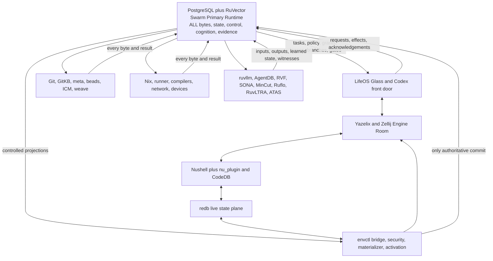

#### D02 — Bootstrap-to-operational cutover

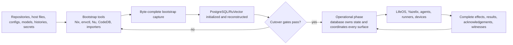

#### D03 — LifeOS Glass and Yazelix Engine ownership

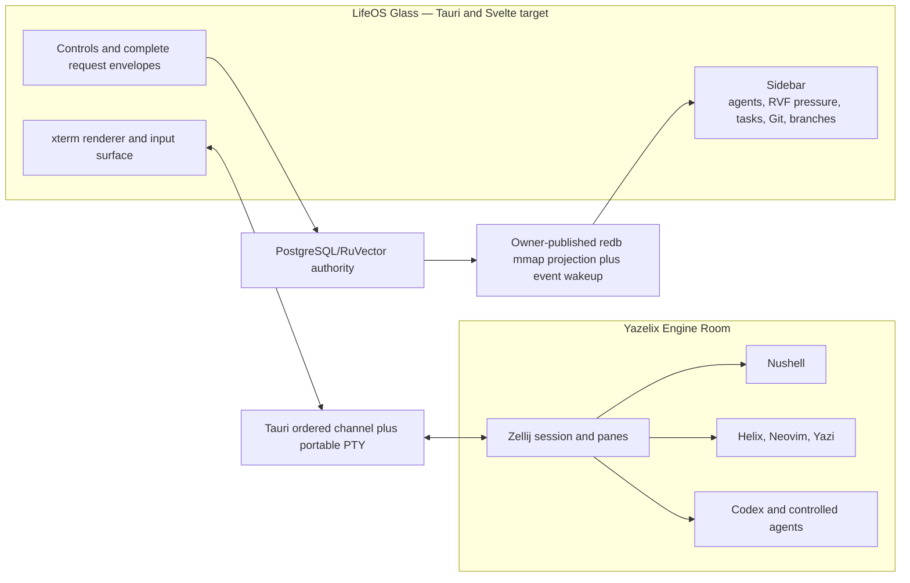

#### D04 — PTY, Zellij session, and terminal lifecycle

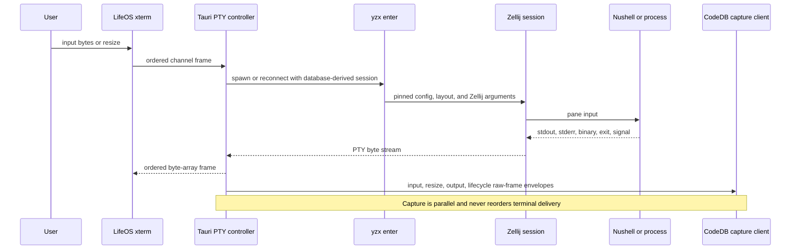

#### D05 — Exact logical front-door trace

```mermaid
flowchart LR
    REQ["Human, agent, or swarm request"] --> USER["User"]
    USER --> LIFE["LifeOS front-door agent"]
    LIFE --> CODEX["Codex"]
    CODEX --> RTKNU["rtk_nu logical compression and ingestion responsibility"]
    RTKNU --> REDB["redb live-state responsibility"]
    REDB --> NU["Nushell typed-stream responsibility"]
    NU --> YAZ["Yazelix Engine Room responsibility"]
    YAZ --> CODEDB["nu_plugin and CodeDB ingress responsibility"]
    CODEDB --> DB["PostgreSQL/RuVector"]
```

This is the anchor's exact logical responsibility and lineage trace. D06–D12 are the process-correct expansion: Nushell launches its plugin child, native Nu bypasses rtk, terminal delivery does not traverse redb first, and non-agent controls need not invoke Codex.

#### D06 — Physically executable LifeOS control action

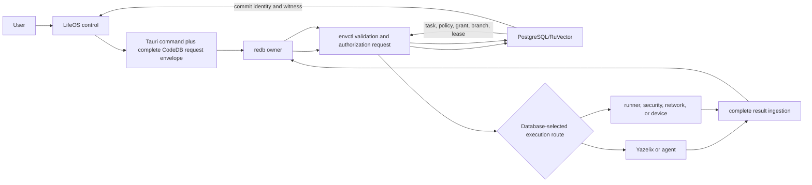

#### D07 — Legacy-output ingestion

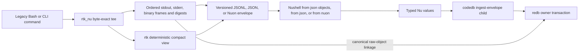

#### D08 — Native Nushell ingestion

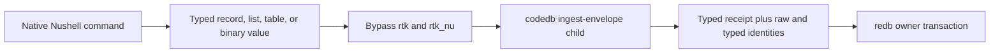

#### D09 — Nu child-plugin and CodeDB ingress boundary

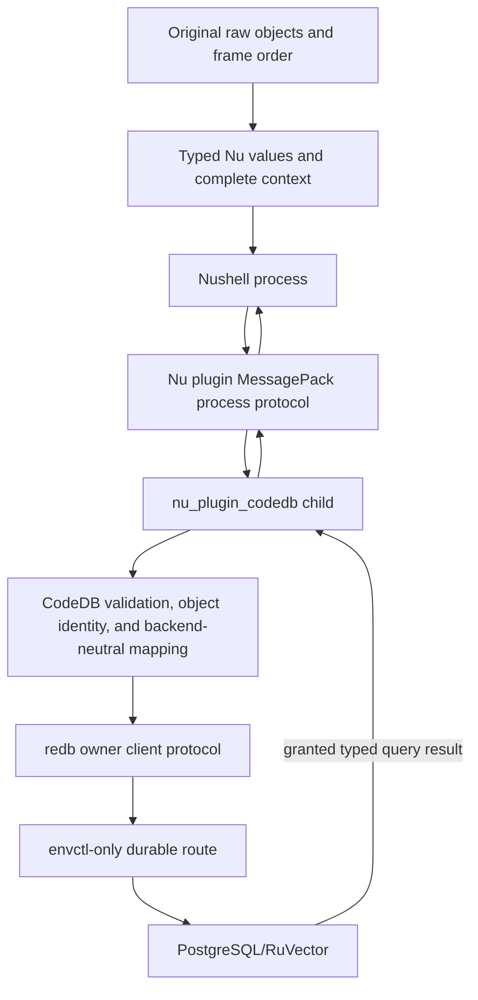

#### D10 — redb live mmap projection and notification

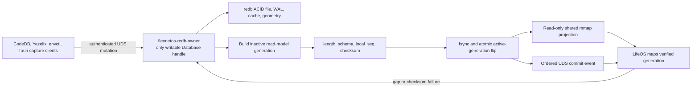

#### D11 — envctl-only durable commit

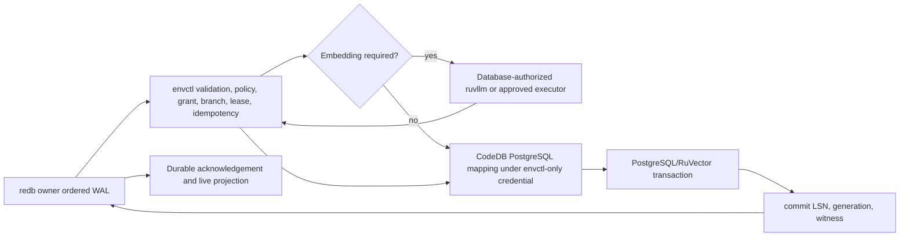

#### D12 — Database-to-Engine/Glass return and acknowledgement

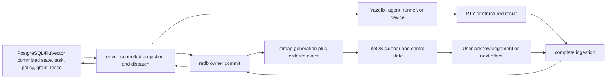

#### D13 — Raw-byte and derived-representation lineage

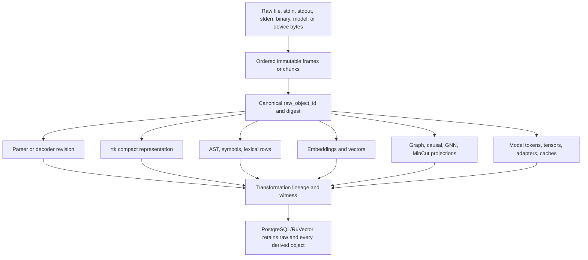

#### D14 — Crash, spool, replay, and reconciliation

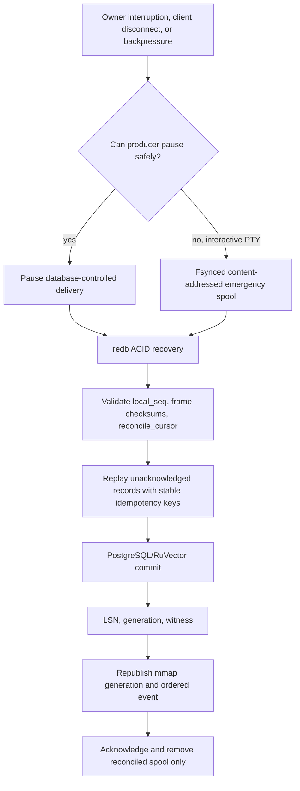

#### D15 — Database-hosted semantic SQL trigger loop

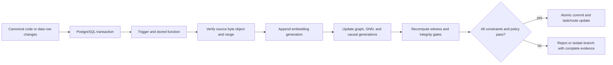

#### D16 — RuVector cognition loop

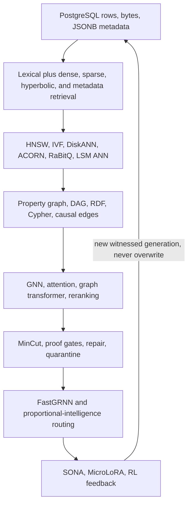

#### D17 — COW, MinCut, witness, promotion, and rollback

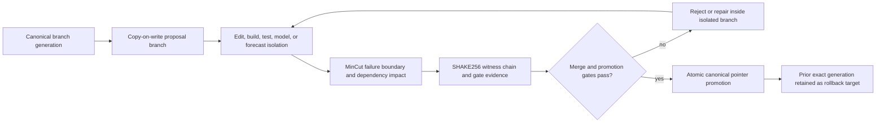

#### D18 — Edge inference, memory, learning, and forecasting

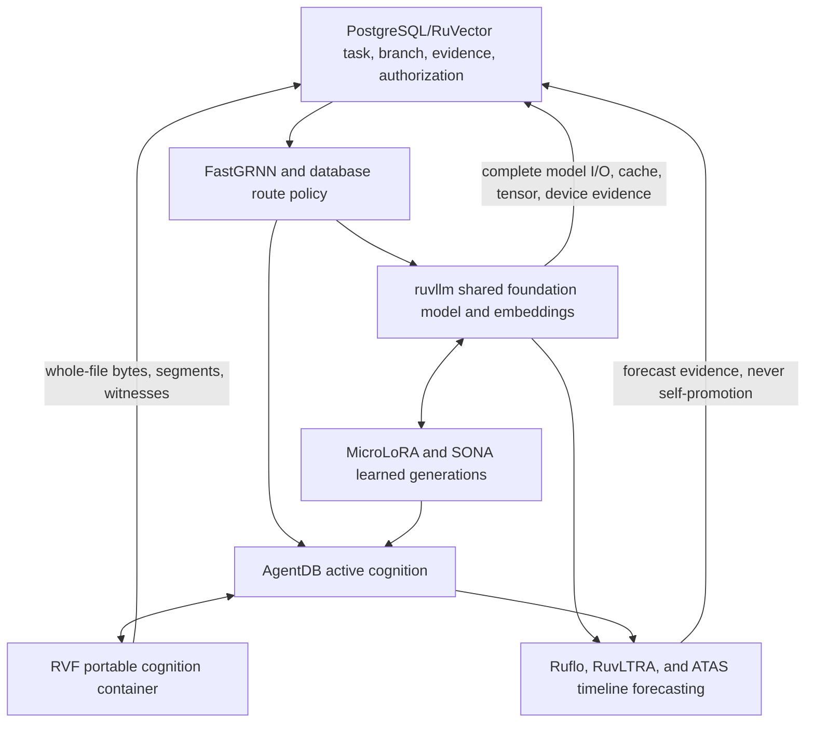

#### D19 — Tenant, identity, branch, lease, commit, and witness continuity

```mermaid
flowchart LR
    REQ["request_id and raw object identities"] --> IDENT["tenant_id and identity_id"]
    IDENT --> AUTH["policy_id and grant_id"]
    AUTH --> TASK["task_id and execution_id"]
    TASK --> BRANCH["branch_id and generation"]
    BRANCH --> LEASE["lease_id, expiry, nonce"]
    LEASE --> LOCAL["local_seq, frame_id, idempotency_key"]
    LOCAL --> COMMIT["PostgreSQL transaction and LSN"]
    COMMIT --> WIT["witness_chain_id and signature"]
    WIT --> ACK["delivery, render, effect, and user acknowledgement"]
    ACK -->|"linked next request"| REQ
```

#### D20 — Secret lifecycle and audit

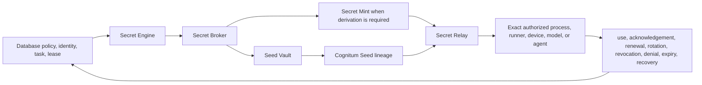

#### D21 — Repository, memory, task, context, and runner coordination

```mermaid
flowchart TB
    DB["PostgreSQL/RuVector"]
    GIT["Git import, export, history, recovery"]
    GKB["GitKB decisions, context, handoffs"]
    META["meta repository, task, drift, release graph"]
    BEADS["beads or br executable task atoms"]
    ICM["ICM context manifests"]
    WEAVE["weave session mesh and fenced jobs"]
    NET["network-control plans, effects, and rollback"]
    IDD["rusty-idd work orders, ledger, proof"]
    RUN["flexnetos_runner JobSpec and release evidence"]
    DB --> GIT
    DB --> GKB
    DB --> META
    DB --> BEADS
    DB --> ICM
    DB --> WEAVE
    DB --> NET
    DB --> IDD
    DB --> RUN
    GIT --> DB
    GKB --> DB
    META --> DB
    BEADS --> DB
    ICM --> DB
    WEAVE --> DB
    NET --> DB
    IDD --> DB
    RUN --> DB
```

#### D22 — Import, transformation, export, and reconstruction loop

```mermaid
flowchart LR
    IMPORT["Import exact source bytes and history"] --> MERGE["Merge and migrate"]
    MERGE --> UNIFY["Unify repositories and crates"]
    UNIFY --> TRANSFORM["Transform code and generated configuration"]
    TRANSFORM --> BUILD["Build and test"]
    BUILD --> VERIFY["Verify bytes, semantics, provenance, effects, witnesses"]
    VERIFY --> EXPORT["Export selected code, artifacts, RVF, and projections"]
    EXPORT --> RECON["Reconstruct with zero undeclared loss"]
    RECON --> DB["PostgreSQL/RuVector complete record"]
    DB -->|"next database-controlled operation"| IMPORT
```

#### D23 — Build, release, activation, reload, and rollback

```mermaid
flowchart LR
    DB["Database-selected branch, release policy, grants, lease"] --> ENV["envctl worktree, config, and Nix projection"]
    ENV --> NIX["Nix closure, compilers, model and device dependencies"]
    NIX --> RUN["flexnetos_runner build, test, security, reconstruction gates"]
    RUN --> EVID["logs, checksums, manifests, artifacts, witnesses, rollback evidence"]
    EVID --> GATE{"PostgreSQL/RuVector approves?"}
    GATE -->|"no"| DB
    GATE -->|"yes"| ACT["Atomic symlink activation"]
    ACT --> RELOAD["Yazelix/Zellij session-preserving reload"]
    RELOAD --> RETURN["Complete release effects and evidence"]
    RETURN --> DB
```

#### D24 — WAL, replication, PITR, restore, and reconstruction

```mermaid
flowchart LR
    PRIMARY["PostgreSQL/RuVector primary"] --> WAL["Checksummed WAL archive"]
    PRIMARY --> REPLICA["Streaming replicas"]
    PRIMARY --> BASE["Checksummed base backup"]
    WAL --> PITR["Selected-LSN PITR restore"]
    BASE --> PITR
    PITR --> VERIFY["Extension, schema, row, vector, graph, branch, witness verification"]
    VERIFY --> REBUILD["Rebuild files, repositories, RVF, models, configs, releases"]
    REBUILD --> REDB["Replay redb reconciliation and mmap projection"]
    REDB --> RECEIPT["Deterministic reconstruction receipt"]
    RECEIPT --> PRIMARY
```

## 4. Component scopes

### 4.1 PostgreSQL and RuVector

PostgreSQL 17.10 and the RuVector extension form the Central Cognitive Runtime and Swarm Primary Runtime. PostgreSQL supplies ACID transactions, relational constraints, MVCC, row-level security, advisory locks, procedures, triggers, background workers, WAL, streaming replication, base backup, point-in-time recovery, and deterministic reconstruction. RuVector supplies database-local vector, hybrid, lexical, graph, GNN, causal, MinCut, routing, learning, attention, solver, hyperbolic, quantization, and embedding operations. The database hosts codebase bytes and semantic IDE structures with no vector or graph sidecar.

### 4.2 LifeOS and Codex

LifeOS is the Tauri 2/Svelte Glass UI and user-facing front door. The Svelte sidebar renders the owner-published redb mmap generation and uses the matching ordered event as its wakeup/ordering signal; the Tauri Rust PTY controller embeds the repository-backed `yzx enter` Engine Room in the center/right pane. `lifeos-core` and `lifeos-daemon` carry controlled domain and service behavior. Codex is the intent-handling agent on the anchor-defined front-door route and a database-selected agent on other routes. Every interaction, MCP call, model exchange, PTY frame, decision, mapped generation, and rendered state is captured. Neither LifeOS nor Codex owns operational truth. The pinned checkout’s Vue frontend is current-state evidence and must be migrated; it is not the target GUI contract.

### 4.3 Yazelix, Zellij, editors, and file navigation

Yazelix provides the Nix-owned Engine Room. Its `yzx enter` command replaces the launcher process with the pinned Zellij runtime and forwards Zellij arguments. Zellij preserves panes and sessions; Nushell, Helix, Neovim, and Yazi remain active shell, editor, and navigation surfaces. LifeOS embeds this runtime through a real PTY and does not reimplement it. Keystroke-derived commands, input bytes, resize events, buffer changes, save operations, paths, file effects, diagnostics, terminal output, exit state, and reconnection state round-trip through the capture plane.

### 4.4 Nushell, rtk, and rtk_nu

Nushell is the bidirectional typed stream and table translator spanning the user/filesystem realm and the database realm. Upstream/fork `rtk` performs deterministic token/output compaction and analytics on raw legacy output. The required FlexNetOS `rtk_nu` adapter tees byte-exact process streams, invokes or consumes `rtk` as configured, and emits a versioned JSONL/JSON/Nuon envelope with lossless base64 raw frames for Nushell to parse. It never emits a native Nu value by itself, never invokes `nu_plugin_codedb`, and never handles an already-typed native Nu pipeline. Raw stdout, stderr, binary frames, and parse failures always accompany normalized representations.

### 4.5 nu_plugin / CodeDB

The `nu_plugin` workspace provides CodeDB core, cargo/static analysis, context, build capture, MCP, redb storage, PostgreSQL storage, fixtures, and the Nushell child plugin. It is the byte-complete ingress and query foundation. Nushell and the child exchange plugin protocol frames through `MsgPackSerializer`; CodeDB then maps validated values and linked raw objects to its storage schemas. The current command inventory is scanner/importer/query oriented and lacks a pipeline-input envelope command, so `codedb ingest-envelope` with typed record/list/table input is a mandatory addition. MessagePack transport is distinct from redb storage encoding. Although `codedb-store-pg` implements direct PostgreSQL persistence, authoritative production writes are denied to plugin/agent roles and are invoked only by envctl; other direct-store uses are explicitly granted bootstrap, parity, repair, migration, or read-only operations.

### 4.6 redb

redb 4.1 is the pure-Rust embedded ACID, file-backed MVCC boundary for FlexNetOS and CodeDB. It supplies a zero-copy API, transactional writes, a local AI scratchpad, retry and semantic caches, inference deduplication, resilient application WAL, vector-coordinate storage, distance math, cosine similarity, SIMD-ready application processing, and replay. One supervised local owner holds the only writable `Database`; cooperating writers/query clients use its authenticated Unix-domain protocol. The integration adds the anchor-required read-only mmap live projection and ordered commit-event wakeup, both published by that same owner and both subordinate to its transaction sequence. RuVector’s internal storage feature separately uses its pinned redb 2.1 layer. Every redb byte, mapped projection generation, state, cache entry, log, intermediate result, retry record, vector, and transition is captured in PostgreSQL/RuVector. redb never outranks the Swarm Primary Runtime.

### 4.7 envctl

envctl is the only authoritative PostgreSQL/RuVector ingress commit bridge and is also the materializer, synchronization boundary, configuration-table operator, security boundary, projection manager, and activation interface. The permanent operational flow is `database rows ↔ validated envctl tables ↔ Nushell tables ↔ controlled files`, with original source files retained as evidence. envctl drains ordered redb records, validates policy and idempotency, orchestrates a database-authorized embedding executor when a target schema requires vectors, invokes the CodeDB PostgreSQL mapping with envctl-only credentials, records the commit identity, and projects worktrees, Nix inputs, runtime configuration, and activation state. ruvllm/Candle is the default approved local embedding path; ONNX/ort is optional only in a separately approved closure. The pinned envctl checkout does not yet implement this complete drain/embed/commit loop, so that loop and its capability enforcement are release gates rather than assumed current behavior.

### 4.8 Git, memory, tasks, context, and coordination

Git is the import, export, review, interchange, and recovery surface. GitKB stores linked decisions and repository memory. `meta` stores the repository/workspace/release graph. beads_rust/br stores executable task atoms. ICM stores context manifests and retrieval projections. rusty-idd carries work orders, handoffs, execution ledgers, specifications, merge structures, code graphs, knowledge, TUI operations, and runner integration. weave carries session mesh presence, durable messages, fenced jobs, and runner dispatch. Every record is a PostgreSQL/RuVector-controlled projection.

### 4.9 Nix, runners, compilers, network, and devices

Nix defines reproducible build and materialization closures. flexnetos_runner performs database-issued build, test, and release work and emits complete receipts. Rust, Fenix, Kache, wild, cargo-pgrx, Node, Bun/Bunx, TypeScript, napi-rs, wasm-bindgen, musl linkers, PostgreSQL libraries, CUDA, NVIDIA drivers, ONNX Runtime, Candle, and CPU/SIMD runtimes are controlled execution surfaces. network-control provides netengine, netctl, GUI, lane/obscura/RuVector peer relay, iroh connectivity, and the pure-Rust network trust boundary. Inputs, packets, decisions, outputs, binaries, logs, and device effects return completely.

### 4.10 ruvllm, AgentDB, RVF, SONA, Ruflo, RuvLTRA, and ATAS

ruvllm runs shared frozen foundation models, local inference, and embeddings across CPU/SIMD, Candle, ONNX/ort, CUDA, GGUF mmap, and quantized paths. AgentDB manages active agent cognition and projects it as signed single-file `.rvf` containers through the RVF runtime. SONA, MicroLoRA, FastGRNN, Thompson Sampling, Q-Learning, PPO, GNNs, and database promotion gates learn and route from captured evidence. Ruflo orchestrates global swarms. RuvLTRA supplies Small and Medium temporal reasoning/model paths. ATAS, the Agentic Temporal Attractor Studio, runs echo-state, reservoir, temporal-attractor, and ensemble timeline forecasting. Their state never displaces database ownership.

## 5. envctl security architecture

The six envctl security subsystems execute as one PostgreSQL/RuVector-authorized lifecycle:

1. **Secret Engine** evaluates database-owned identity, purpose, scope, environment, branch, task, lease duration, and execution policy; it coordinates issuance, renewal, rotation, and revocation.
2. **Secret Broker** authenticates the requester, resolves the database-issued lease, selects the approved protected source, enforces least privilege, and records the complete transaction.
3. **Secret Mint** derives short-lived, purpose-bound, minimally scoped, rotatable credentials, tokens, certificates, and capabilities after authorization.
4. **Seed Vault** safeguards root seeds, wrapping keys, identity roots, derivation context, recovery material, and rotation generations.
5. **Cognitum Seed** establishes stable Cognitum identity and derivation lineage for agents, devices, workloads, and cognitive projections while remaining under Seed Vault custody.
6. **Secret Relay** binds encrypted delivery to identity, target, purpose, lease, nonce, and expiration; it records delivery, acknowledgement, use, failure, and teardown and blocks replay and cross-target reuse.

The runtime order is:

```text
PostgreSQL/RuVector task + identity + policy + execution lease
→ Secret Engine
→ Secret Broker
→ Secret Mint and Seed Vault/Cognitum Seed derivation
→ Secret Relay
→ exact authorized process, runner, device, model, agent, or projection
→ complete use, renewal, rotation, revocation, denial, expiration, and audit capture
→ PostgreSQL/RuVector
```

Bootstrap initializes the security schemas, imports protected secret bytes into encrypted custody, establishes identities and trust roots, enrolls providers and devices, provisions Seed Vault records, registers Cognitum lineage, and records every bootstrap byte and event. Rotation advances the protected version or derivation epoch, updates dependent grants, retires earlier authority, and proves cutover. Revocation invalidates grants and leases, blocks relay, records affected executions, and starts remediation.

PostgreSQL/RuVector retains protected encrypted secret bytes and complete custody, policy, identity, issuance, transport, use, rotation, revocation, and audit history. Plaintext is exposed only to the exact authorized target for the exact lease lifetime. Root plaintext never enters redb caches, UI projections, ordinary logs, command output, or general model context.

## RUVECTOR/RUVNET FULL COMPONENT ARCHITECTURE

### 1. Complete RuVector/ruvnet ecosystem map

```mermaid
flowchart TD
    DB["PostgreSQL + RuVector — Swarm Primary Runtime"]
    INGRESS["nu_plugin / CodeDB — redb · envctl"]
    COG["AgentDB · RVF · SONA — graph · GNN · MinCut"]
    MODEL["ruvllm · MicroLoRA · FastGRNN — Candle · ONNX · CUDA"]
    EXEC["LifeOS · Codex · Nushell · Yazelix — Git · Nix · runners · GPU"]
    DB <--> INGRESS
    INGRESS <--> COG
    COG <--> MODEL
    MODEL <--> EXEC
    EXEC -->|"every byte, effect, result, witness"| DB
    DB -->|"tasks, state, policy, leases, promotion"| EXEC
```

The central database owns bytes, relational records, vectors, graphs, policies, tasks, branches, cognition, promotion, and recovery. RuVector performs database-local vector, graph, learning, and cognitive operations. ruvnet/rUv crates and packages supply Rust-native, PostgreSQL, NAPI, WASM, TypeScript, Bun, model, agent, RVF, forecast, device, and edge surfaces. FlexNetOS supplies the user front door, typed ingress, operational buffering, security, environment materialization, coordination, and controlled physical execution.

### 2. Complete repository, crate, package, extension, binding, and runtime inventory

#### 2.1 Pinned repository revisions and distribution versions

The architecture builds from these exact 2026-07-19 revisions:

| Repository | Branch | Revision | Distribution mapping |
|---|---|---|---|
| `https://github.com/ruvnet/RuVector` | `main` | `6a6c39e662a4c3184dcb913db91a09401c84b2ae` | Rust workspace 2.3.0 family; PostgreSQL, NAPI, WASM, model, RVF, graph, index, cognition, and device crates |
| `https://github.com/ruvnet/agentdb` | `main` | `04968e3fba3bf01ef4e9978d0446485452365a86` | AgentDB `3.0.0-alpha.18` and `.rvf` cognition |
| `https://github.com/ruvnet/ruflo` | `main` | `12ede21767a6dd669df1b79392a5d27d9154f237` | `claude-flow`/Ruflo `3.32.8`, ruvnet swarm orchestration |
| `https://github.com/FlexNetOS/lifeos` | `main` | `3d741436b05c0b3cece764c76aa93450e38266ed` | LifeOS `0.1.0` current checkout: Vue/Tauri; target/release gate: Tauri/Svelte Glass with embedded Yazelix PTY |
| `https://github.com/FlexNetOS/envctl` | `master` | `48368a97f7d1388cea247dd4ebdc32a8193743fb` | envctl `0.1.0`, PostgreSQL 17.10 lifecycle, RuVector client integration |
| `https://github.com/FlexNetOS/weave` | `master` | `b0ccd2278b2df689390023e590cc3c1eb60f9a80` | weave `0.2.0` session mesh and fenced jobs |
| `https://github.com/FlexNetOS/network-control` | `main` | `5341ea0041f833475ff989a6749dafc2194f0967` | network-control `0.2.0` |
| `https://github.com/FlexNetOS/flexnetos_runner` | `main` | `e6ccf7138b5fb38ad7d6472dc0df144993edc86c` | runner `0.1.0` |
| `https://github.com/FlexNetOS/rusty-idd` | `main` | `4c47c67fe088e99868d8ccf74d6cbe1aa2af2856` | rusty-idd `0.1.0`, handoff/ledger/proof runtime |
| `https://github.com/FlexNetOS/nu_plugin` | `master` | `63d6874314031471213fe9f51d9706820bc254e1` | CodeDB `0.1.0`, Nu `0.113.1`, redb/PostgreSQL stores |
| `https://github.com/FlexNetOS/rtk-tokenkill` | `develop` | `44cf84e71c87a1a45da6ed218f92edb88e4336f5` | rtk `0.43.0`; no `rtk_nu` binary at this revision; dedicated adapter is a release-blocking FlexNetOS addition |
| `https://github.com/FlexNetOS/icm` | `main` | `03d63a9102ce7f2c17cc7df66ac1aded46def88e` | ICM core/store/MCP `0.10.34`, CLI `0.10.57` |
| `https://github.com/FlexNetOS/yazelix` | `main` | `01790ae2292a0060acb015d72e3bec8a21b0b0ef` | Nix-owned Engine Room; `yzx enter`; Zellij 0.44.3, Nu, Helix, Yazi |
| `https://github.com/FlexNetOS/yazelix-terminal-support` | `main` | `a7ee555aa4bcd154649b2d53d4fb7eb3c0467413` | Support metadata only; not the terminal launcher or renderer |
| `https://github.com/FlexNetOS/meta` | `main` | `afc146fb5c5410f9df0b751c926b5d5254d11664` | Repository/workspace/release/task graph; no `components/rtk_nu` implementation at this revision |
| `https://github.com/rtk-ai/rtk` | `main` | `f9d8c775b1e7f94f449c400f4130410170e590ad` | Upstream comparison/reference; FlexNetOS build authority remains the pinned fork/develop revision |
| `https://github.com/cberner/redb` | `master` | `fe0141159c73cc304c360092f513b90caed6a732` | Source-behavior verification reference for the application’s redb 4.1 contract; file backend and opener rules |

The envctl lifecycle carries PostgreSQL 17.10, server SQL lineage 0.3.0, and `ruvector-postgres` integration coordinate 2.0.5; the pinned RuVector repository manifest carries crate coordinate 2.0.1 at the same source revision. The Rust integration plane pins `ruvector-core` 2.3.0, `ruvector-graph` 2.3.0, `ruvllm` 2.3.0, `ruvector-sona` 0.2.1, `rvf-runtime` 0.3.0, `rvf-types` 0.2.1, and RVF index/quant/crypto 0.2.0. Ruflo’s JavaScript plane consumes `@ruvector/ruvllm` 2.6.1-family packages; the binding coordinates include npm `ruvector` 0.1.2, `@ruvector/core` 0.1.31 with native platforms 0.1.29, `@ruvector/wasm` 0.1.31, `@ruvector/router` 0.1.30, `@ruvector/gnn` 0.1.25, `@ruvector/attention` 0.1.4 with attention WASM 0.1.32, `@ruvector/ruvllm` 2.6.1 with native NAPI platforms 2.0.1 and WASM 2.0.2, `@ruvector/sona` 0.1.8 with native platforms 0.1.5, `@ruvector/rvf` 0.3.0, and `@ruvector/postgres-cli` 0.2.9. These distribution planes converge on the same PostgreSQL/RuVector schemas, byte identities, RVF records, and witness chains.

#### 2.2 RuVector core, service, routing, and distribution packages

- Core and service: `ruvector`, `ruvector-core`, `ruvector-node`, `ruvector-wasm`, `ruvector-cli`, `ruvector-server`, `ruvector-filter`, `ruvector-metrics`, `ruvector-snapshot`, `ruvector-collections`, `ruvector-bench`, `ruvector-cluster`, `ruvector-raft`, `ruvector-replication`, `rvlite`.
- PostgreSQL and language bindings: `ruvector-postgres`, `pgrx_embed_ruvector-postgres`, `ruvector-node`, `ruvector-wasm`, `ruvector-graph-node`, `ruvector-graph-wasm`, `ruvector-gnn-node`, `ruvector-gnn-wasm`, `ruvector-attention-node`, `ruvector-attention-wasm`, and the `@ruvector/*` NAPI/WASM/TypeScript distributions.
- Routing: `ruvector-router-core`, `ruvector-router-cli`, `ruvector-router-ffi`, `ruvector-router-wasm`, `ruvector-tiny-dancer-core`, `ruvector-tiny-dancer-node`, `ruvector-tiny-dancer-wasm`, `ruvector-attn-mincut`.
- Distributed operation: `ruvector-cluster`, `ruvector-raft`, `ruvector-replication`, snapshot and metrics packages, plus PostgreSQL WAL/replication and RVF federation.

#### 2.3 Retrieval, index, compression, and geometry packages

`ruvector-acorn`, `ruvector-acorn-wasm`, `ruvector-coherence-hnsw`, `ruvector-hyperbolic-hnsw`, `ruvector-hyperbolic-hnsw-wasm`, `ruvector-rabitq`, `ruvector-rabitq-wasm`, `ruvector-rulake`, `ruvector-diskann`, `ruvector-diskann-node`, `ruvector-rairs`, `ruvector-hybrid`, `ruvector-lsm-ann`, `ruvector-matryoshka`, `ruvector-pq-search`, `ruvector-capgated`, `ruvector-spann`, `ruvector-maxsim`, `ruvector-hnsw-repair`, `ruvector-sparsifier`, `ruvector-sparsifier-wasm`, `ruvector-delta-index`, `ruvector-sparse-inference`, `ruvector-sparse-inference-wasm`, and `micro-hnsw-wasm` cover HNSW, hyperbolic HNSW, DiskANN/Vamana, ACORN metadata filtering, BM25+dense hybrid fusion, LSM streaming ingest, RAIRS IVF, Matryoshka coarse-to-fine search, PQ-ADC, RaBitQ, MaxSim, capability-gated ANN, SPANN, sparse inference, repair, and graph sparsification.

#### 2.4 Graph, GNN, attention, causal, MinCut, and cognition packages

`ruvector-graph`, `ruvector-graph-node`, `ruvector-graph-wasm`, `ruvector-gnn`, `ruvector-gnn-rerank`, `ruvector-gnn-node`, `ruvector-gnn-wasm`, `ruvector-attention`, `ruvector-attention-cli`, `ruvector-attention-node`, `ruvector-attention-wasm`, `ruvector-attention-unified-wasm`, `ruvector-cnn`, `ruvector-cnn-wasm`, `ruvector-mincut`, `ruvector-mincut-node`, `ruvector-mincut-wasm`, `ruvector-mincut-brain-node`, `ruvector-mincut-gated-transformer`, `ruvector-mincut-gated-transformer-wasm`, `ruvector-graph-condense`, `ruvector-graph-condense-wasm`, `ruvector-graph-transformer`, `ruvector-graph-transformer-node`, `ruvector-graph-transformer-wasm`, `ruvector-nervous-system`, `ruvector-nervous-system-wasm`, `ruvector-perception`, `ruvector-dag`, `ruvector-dag-wasm`, `ruvector-proof-gate`, `ruvector-cognitive-container`, `ruvector-verified`, and `ruvector-verified-wasm` provide graph storage, Cypher/RDF/SPARQL, GNN/message passing/rerank, causal traversal, attention, dynamic MinCut, condensation, gated inference, proof gating, repair, and cognition containers.

#### 2.5 Learning, mathematics, temporal, model, and forecast packages

`ruvector-sona`, `ruvector-learning-wasm`, `ruvector-math`, `ruvector-math-wasm`, `ruvector-domain-expansion`, `ruvector-domain-expansion-wasm`, `ruvector-solver`, `ruvector-solver-node`, `ruvector-solver-wasm`, `ruvector-coherence`, `ruvector-temporal-coherence`, `ruvector-temporal-tensor`, `ruvector-temporal-tensor-wasm`, `ruvector-consciousness`, `ruvector-consciousness-wasm`, `ruvector-delta-core`, `ruvector-delta-graph`, `ruvector-delta-consensus`, `ruvector-delta-wasm`, `ruvector-crv`, `ruvector-dither`, `emergent-time`, `emergent-time-wasm`, `prime-radiant`, `ruvector-timesfm`, `ruvector-timesfm-forecast`, and `timesfm` cover SONA, reinforcement learning, EWC, solvers, information geometry, optimal transport, topology, temporal coherence, delta consensus, emergence, forecasting, and anomaly bands.

`ruvllm`, `ruvllm-cli`, `ruvllm-wasm`, `ruvllm-bridge`, `ruvllm-embedder`, `ruvllm-pi-worker`, `ruvllm_sparse_attention`, and `ruvllm_retrieval_diffusion` provide model loading, shared inference, GGUF mmap, Candle, ONNX/ort, CUDA, quantization, MicroLoRA, sparse attention, retrieval diffusion, embeddings, and edge workers. RuvLTRA-Small and RuvLTRA-Medium are the temporal reasoning model profiles. Ruflo and ATAS use them for proportional-intelligence routing and global temporal forecasting.

#### 2.6 RVF, agent, proof, edge, and hardware packages

- RVF: `rvf`, `rvf-types`, `rvf-runtime`, `rvf-index`, `rvf-quant`, `rvf-crypto`, `rvf-manifest`, `rvf-import`, `rvf-cli`, `rvf-server`, `rvf-node`, `rvf-wasm`, `rvf-wire`, `rvf-kernel`, `rvf-launch`, `rvf-federation`, `rvf-ebpf`, `rvf-solver-wasm`, `rvf-benches`, and `rvf_benchmarks`.
- Agent framework: `rvagent-core`, `rvagent-backends`, `rvagent-middleware`, `rvagent-tools`, `rvagent-subagents`, `rvagent-cli`, `rvagent-acp`, `rvagent-mcp`, `rvagent-wasm`, and `rvagent-a2a`.
- Cognitum and MCP gates: `cognitum-gate-kernel`, `cognitum-gate-tilezero`, `mcp-gate`, `mcp-brain`, `mcp-brain-server`, and `mcp-brain-server-local`.
- Edge and hardware: `hailort-sys`, `ruvector-hailo`, `ruvector-hailo-embed`, `ruvector-hailo-worker`, `ruvector-hailo-cluster`, `ruvector-hailo-stats`, `ruvector-mmwave`, `ruvector-mmwave-bridge`, `ruos-thermal`, `thermorust`, `ruvector-fpga-transformer`, `ruvector-fpga-transformer-wasm`, and `ruvector-robotics`.
- RuVix cognition kernel: `ruvix-types`, `ruvix-region`, `ruvix-queue`, `ruvix-cap`, `ruvix-proof`, `ruvix-sched`, `ruvix-boot`, `ruvix-vecgraph`, `ruvix-nucleus`, `ruvix-hal`, `ruvix-aarch64`, and `ruvix-drivers`.
- Specialized official surfaces: `ruvector-decompiler`, `ruvector-decompiler-wasm`, `photonlayer-core`, `photonlayer-ruvector`, `photonlayer-cli`, `photonlayer-wasm`, `neural-trader-core`, `neural-trader-coherence`, `neural-trader-replay`, `neural-trader-strategies`, `neural-trader-wasm`, and `ruvector-kalshi`.

The repository’s benchmark, correctness, chaos, replay, proof, SOTA ANN, vector-search, hybrid, graph, MinCut, attention, SONA, quantization, temporal-attractor, robotics, hardware, and verified-application packages are release-gate executables. Their source bytes, datasets, parameters, outputs, measurements, and receipts are imported and retained with the same contract as production crates.

#### 2.7 Exact RuVector root workspace member inventory

The pinned root manifest declares 196 member entries and 195 unique paths. The complete unique member inventory is:

`crates/ruvector-temporal-coherence` · `crates/ruvector-acorn` · `crates/ruvector-acorn-wasm` · `crates/ruvector-coherence-hnsw` · `crates/ruvector-rabitq`

`crates/ruvector-rabitq-wasm` · `crates/ruvector-rulake` · `crates/ruvector-core` · `crates/ruvector-node` · `crates/ruvector-wasm`

`crates/ruvector-cli` · `crates/ruvector-bench` · `crates/ruvector-metrics` · `crates/ruvector-filter` · `crates/ruvector-router-core`

`crates/ruvector-router-cli` · `crates/ruvector-router-ffi` · `crates/ruvector-router-wasm` · `crates/ruvector-server` · `crates/ruvector-snapshot`

`crates/ruvector-tiny-dancer-core` · `crates/ruvector-tiny-dancer-wasm` · `crates/ruvector-tiny-dancer-node` · `crates/ruvector-collections` · `crates/ruvector-cluster`

`crates/ruvector-raft` · `crates/ruvector-replication` · `crates/ruvector-graph` · `crates/ruvector-graph-node` · `crates/ruvector-graph-wasm`

`crates/ruvector-gnn` · `crates/ruvector-proof-gate` · `crates/ruvector-gnn-rerank` · `crates/ruvector-gnn-node` · `crates/ruvector-gnn-wasm`

`crates/ruvector-attention` · `crates/ruvector-attention-wasm` · `crates/ruvector-attention-node` · `crates/ruvector-cnn` · `crates/ruvector-cnn-wasm`

`crates/ruvector-mincut` · `crates/ruvector-mincut-wasm` · `crates/ruvector-mincut-node` · `crates/ruvector-mincut-gated-transformer` · `crates/ruvector-mincut-gated-transformer-wasm`

`crates/ruvector-nervous-system` · `crates/hailort-sys` · `crates/ruvector-hailo` · `crates/ruvector-mmwave` · `crates/ruvector-hailo-cluster`

`examples/refrag-pipeline` · `examples/scipix` · `examples/google-cloud` · `examples/subpolynomial-time` · `crates/sona`

`crates/rvlite` · `crates/ruvector-dag` · `crates/ruvector-dag-wasm` · `crates/ruvector-nervous-system-wasm` · `crates/ruvector-economy-wasm`

`crates/ruvector-learning-wasm` · `crates/ruvector-exotic-wasm` · `crates/ruvector-attention-unified-wasm` · `crates/ruvector-fpga-transformer` · `crates/ruvector-fpga-transformer-wasm`

`crates/ruvector-sparse-inference` · `crates/ruvector-math` · `crates/ruvector-math-wasm` · `examples/benchmarks` · `crates/cognitum-gate-kernel`

`crates/cognitum-gate-tilezero` · `crates/mcp-gate` · `crates/mcp-brain` · `crates/mcp-brain-server` · `crates/ruvllm`

`crates/ruvllm-cli` · `crates/ruvllm-wasm` · `crates/prime-radiant` · `crates/ruvector-delta-core` · `crates/ruvector-delta-wasm`

`crates/ruvector-delta-index` · `crates/ruvector-delta-graph` · `crates/ruvector-delta-consensus` · `crates/ruvector-crv` · `crates/ruvector-temporal-tensor`

`crates/ruvector-domain-expansion` · `crates/ruvector-domain-expansion-wasm` · `crates/ruvector-solver` · `crates/ruvector-solver-wasm` · `crates/ruvector-solver-node`

`crates/ruvector-coherence` · `crates/ruvector-profiler` · `crates/ruvector-attn-mincut` · `crates/ruvector-cognitive-container` · `crates/ruvector-verified`

`crates/ruvector-verified-wasm` · `crates/ruvector-graph-transformer` · `crates/ruvector-graph-transformer-wasm` · `crates/ruvector-graph-transformer-node` · `examples/rvf-kernel-optimized`

`examples/verified-applications` · `crates/thermorust` · `crates/ruvector-dither` · `crates/ruvector-robotics` · `examples/robotics`

`crates/neural-trader-core` · `crates/neural-trader-coherence` · `crates/neural-trader-replay` · `crates/neural-trader-wasm` · `crates/ruvector-kalshi`

`crates/neural-trader-strategies` · `crates/ruvix/crates/types` · `crates/ruvix/crates/region` · `crates/ruvix/crates/queue` · `crates/ruvix/crates/cap`

`crates/ruvix/crates/proof` · `crates/ruvix/crates/sched` · `crates/ruvix/crates/boot` · `crates/ruvix/crates/vecgraph` · `crates/ruvix/crates/nucleus`

`crates/ruvix/crates/hal` · `crates/ruvix/crates/aarch64` · `crates/ruvix/crates/drivers` · `crates/ruvix/tests` · `crates/ruvix/benches`

`crates/ruvix/examples/cognitive_demo` · `crates/rvAgent/rvagent-core` · `crates/rvAgent/rvagent-backends` · `crates/rvAgent/rvagent-middleware` · `crates/rvAgent/rvagent-tools`

`crates/rvAgent/rvagent-subagents` · `crates/rvAgent/rvagent-cli` · `crates/rvAgent/rvagent-acp` · `crates/rvAgent/rvagent-mcp` · `crates/rvAgent/rvagent-wasm`

`crates/rvAgent/rvagent-a2a` · `examples/a2a-swarm` · `examples/train-discoveries` · `examples/sky-monitor` · `examples/sky-monitor/wasm`

`crates/ruvector-sparsifier` · `crates/ruvector-sparsifier-wasm` · `crates/ruvector-consciousness` · `crates/ruvector-consciousness-wasm` · `examples/cmb-consciousness`

`examples/gw-consciousness` · `examples/ecosystem-consciousness` · `examples/quantum-consciousness` · `examples/gene-consciousness` · `examples/climate-consciousness`

`crates/ruvector-decompiler` · `crates/ruvector-decompiler-wasm` · `crates/ruvector-diskann` · `crates/ruvector-diskann-node` · `examples/boundary-discovery`

`examples/cmb-boundary-discovery` · `examples/frb-boundary-discovery` · `examples/void-boundary-discovery` · `examples/temporal-attractor-discovery` · `examples/music-boundary-discovery`

`examples/weather-boundary-discovery` · `examples/market-boundary-discovery` · `examples/health-boundary-discovery` · `examples/seti-exotic-signals` · `examples/seti-boundary-discovery`

`examples/earthquake-boundary-discovery` · `examples/pandemic-boundary-discovery` · `examples/infrastructure-boundary-discovery` · `examples/brain-boundary-discovery` · `examples/seizure-clinical-report`

`examples/seizure-therapeutic-sim` · `examples/real-eeg-analysis` · `examples/real-eeg-multi-seizure` · `crates/ruvllm_sparse_attention` · `crates/ruvllm_retrieval_diffusion`

`crates/ruvector-rairs` · `crates/ruvector-hybrid` · `crates/ruvector-lsm-ann` · `crates/ruvector-graph-condense` · `crates/ruvector-graph-condense-wasm`

`crates/ruvector-perception` · `crates/emergent-time` · `crates/photonlayer-core` · `crates/photonlayer-bench` · `crates/photonlayer-ruvector`

`crates/photonlayer-cli` · `crates/photonlayer-wasm` · `crates/ruvector-matryoshka` · `crates/ruvector-pq-search` · `crates/ruvector-sota-bench`

`crates/ruvector-capgated` · `crates/ruvector-spann` · `crates/ruvector-maxsim` · `crates/timesfm` · `crates/ruvector-timesfm`

Detached first-class packages remain part of the installed architecture: `ospipe` 0.1.0; `rvf-examples` 0.1.0; `micro-hnsw-wasm` 2.3.2; `ruvector-hyperbolic-hnsw` and `ruvector-hyperbolic-hnsw-wasm` 0.1.0; `ruvllm-esp32` 0.3.0; `ruvllm-esp32-flash` 0.2.0; `ruvector-edge-net` 0.1.0; `ruvector-data-framework` 0.3.0; `ruvector-data-openalex`; `ruvector-data-climate`; `ruvector-data-edgar`; ruvllm examples 2.0.0; `delta-behavior` 0.1.0; `rvf-desktop` 2.0.0; `emergent-time-wasm` 0.1.0; `sonic_ct` and `sonic-ct-wasm` 0.1.0; `ruvector-postgres`; `ruos-thermal` 0.1.0; the complete RVF workspace; and MCP brain server. The `external/ruqu` and `external/rvdna` submodule paths are imported with their commit/tree bytes. Their separate toolchains and artifacts are bound into the same release manifest. The RuVector root toolchain has Rust minimum 1.77; the detached RVF workspace has Rust minimum 1.87.

#### 2.8 Exact additional RuVector manifest and named-surface inventory

At pinned RuVector revision `6a6c39e662a4c3184dcb913db91a09401c84b2ae`, the following 137 tracked Cargo manifest directories complete the repository-wide inventory beyond the root-member list. Every path is independently addressable in the component table and remains part of byte-complete build, test, provenance, and release capture.

##### Agentic robotics (6)

- `crates/agentic-robotics-benchmarks` — package `agentic-robotics-benchmarks` 2.3.0 workspace; manifest `crates/agentic-robotics-benchmarks/Cargo.toml`.
- `crates/agentic-robotics-core` — package `agentic-robotics-core` 2.3.0 workspace; manifest `crates/agentic-robotics-core/Cargo.toml`.
- `crates/agentic-robotics-embedded` — package `agentic-robotics-embedded` 2.3.0 workspace; manifest `crates/agentic-robotics-embedded/Cargo.toml`.
- `crates/agentic-robotics-mcp` — package `agentic-robotics-mcp` 2.3.0 workspace; manifest `crates/agentic-robotics-mcp/Cargo.toml`.
- `crates/agentic-robotics-node` — package `agentic-robotics-node` 2.3.0 workspace; manifest `crates/agentic-robotics-node/Cargo.toml`.
- `crates/agentic-robotics-rt` — package `agentic-robotics-rt` 2.3.0 workspace; manifest `crates/agentic-robotics-rt/Cargo.toml`.

##### Other RuVector crates (17)

- `crates/emergent-time-wasm` — package `emergent-time-wasm` 0.1.0; manifest `crates/emergent-time-wasm/Cargo.toml`.
- `crates/micro-hnsw-wasm` — package `micro-hnsw-wasm` 2.3.2; manifest `crates/micro-hnsw-wasm/Cargo.toml`.
- `crates/ruos-thermal` — package `ruos-thermal` 0.1.0; manifest `crates/ruos-thermal/Cargo.toml`.
- `crates/ruvector-agent-memory` — package `ruvector-agent-memory` 0.1.0; manifest `crates/ruvector-agent-memory/Cargo.toml`.
- `crates/ruvector-attention-cli` — package `ruvector-attention-cli` 0.1.0; manifest `crates/ruvector-attention-cli/Cargo.toml`.
- `crates/ruvector-bet4-ivf-bench` — package `ruvector-bet4-ivf-bench` 0.1.0; manifest `crates/ruvector-bet4-ivf-bench/Cargo.toml`.
- `crates/ruvector-core/fuzz` — package `ruvector-core-fuzz` 0.0.0; manifest `crates/ruvector-core/fuzz/Cargo.toml`.
- `crates/ruvector-graph/fuzz` — package `ruvector-graph-fuzz` 0.0.0; manifest `crates/ruvector-graph/fuzz/Cargo.toml`.
- `crates/ruvector-hnsw-repair` — package `ruvector-hnsw-repair` 2.3.0 workspace; manifest `crates/ruvector-hnsw-repair/Cargo.toml`.
- `crates/ruvector-hyperbolic-hnsw-wasm` — package `ruvector-hyperbolic-hnsw-wasm` 0.1.0; manifest `crates/ruvector-hyperbolic-hnsw-wasm/Cargo.toml`.
- `crates/ruvector-hyperbolic-hnsw` — package `ruvector-hyperbolic-hnsw` 0.1.0; manifest `crates/ruvector-hyperbolic-hnsw/Cargo.toml`.
- `crates/ruvector-mincut-brain-node` — package `ruvector-mincut-brain-node` 0.1.0; manifest `crates/ruvector-mincut-brain-node/Cargo.toml`.
- `crates/ruvector-raft/fuzz` — package `ruvector-raft-fuzz` 0.0.0; manifest `crates/ruvector-raft/fuzz/Cargo.toml`.
- `crates/ruvector-sparse-inference-wasm` — package `ruvector-sparse-inference-wasm` 2.3.0 workspace; manifest `crates/ruvector-sparse-inference-wasm/Cargo.toml`.
- `crates/ruvector-temporal-tensor-wasm` — package `ruvector-temporal-tensor-wasm` 2.3.0 workspace; manifest `crates/ruvector-temporal-tensor-wasm/Cargo.toml`.
- `crates/sonic-ct-wasm` — package `sonic-ct-wasm` 0.1.0; manifest `crates/sonic-ct-wasm/Cargo.toml`.
- `crates/sonic-ct` — package `sonic_ct` 0.1.0; manifest `crates/sonic-ct/Cargo.toml`.

##### RuVix (12)

- `crates/ruvix/crates/bcm2711` — package `ruvix-bcm2711` 0.1.0; manifest `crates/ruvix/crates/bcm2711/Cargo.toml`.
- `crates/ruvix/crates/cli` — package `ruvix-cli` 0.1.0 workspace; manifest `crates/ruvix/crates/cli/Cargo.toml`.
- `crates/ruvix/crates/dma` — package `ruvix-dma` 0.1.0; manifest `crates/ruvix/crates/dma/Cargo.toml`.
- `crates/ruvix/crates/dtb` — package `ruvix-dtb` 0.1.0; manifest `crates/ruvix/crates/dtb/Cargo.toml`.
- `crates/ruvix/crates/fs` — package `ruvix-fs` 0.1.0; manifest `crates/ruvix/crates/fs/Cargo.toml`.
- `crates/ruvix/crates/net` — package `ruvix-net` 0.1.0; manifest `crates/ruvix/crates/net/Cargo.toml`.
- `crates/ruvix/crates/physmem` — package `ruvix-physmem` 0.1.0; manifest `crates/ruvix/crates/physmem/Cargo.toml`.
- `crates/ruvix/crates/rpi-boot` — package `ruvix-rpi-boot` 0.1.0; manifest `crates/ruvix/crates/rpi-boot/Cargo.toml`.
- `crates/ruvix/crates/shell` — package `ruvix-shell` 0.1.0; manifest `crates/ruvix/crates/shell/Cargo.toml`.
- `crates/ruvix/crates/smp` — package `ruvix-smp` 0.1.0; manifest `crates/ruvix/crates/smp/Cargo.toml`.
- `crates/ruvix/examples/rvf-demos/swarm-consensus` — package `rvf-swarm-demo` 0.1.0; manifest `crates/ruvix/examples/rvf-demos/swarm-consensus/Cargo.toml`.
- `crates/ruvix/qemu-swarm` — package `ruvix-qemu-swarm` 0.1.0 workspace; manifest `crates/ruvix/qemu-swarm/Cargo.toml`.

##### RVF (25)

- `crates/rvf/benches` — package `rvf-benches` 0.1.0; manifest `crates/rvf/benches/Cargo.toml`.
- `crates/rvf/rvf-adapters/agentdb` — package `rvf-adapter-agentdb` 0.1.0; manifest `crates/rvf/rvf-adapters/agentdb/Cargo.toml`.
- `crates/rvf/rvf-adapters/agentic-flow` — package `rvf-adapter-agentic-flow` 0.1.0; manifest `crates/rvf/rvf-adapters/agentic-flow/Cargo.toml`.
- `crates/rvf/rvf-adapters/claude-flow` — package `rvf-adapter-claude-flow` 0.1.0; manifest `crates/rvf/rvf-adapters/claude-flow/Cargo.toml`.
- `crates/rvf/rvf-adapters/ospipe` — package `rvf-adapter-ospipe` 0.1.0; manifest `crates/rvf/rvf-adapters/ospipe/Cargo.toml`.
- `crates/rvf/rvf-adapters/rvlite` — package `rvf-adapter-rvlite` 0.1.0; manifest `crates/rvf/rvf-adapters/rvlite/Cargo.toml`.
- `crates/rvf/rvf-adapters/sona` — package `rvf-adapter-sona` 0.1.0; manifest `crates/rvf/rvf-adapters/sona/Cargo.toml`.
- `crates/rvf/rvf-cli` — package `rvf-cli` 0.1.0; manifest `crates/rvf/rvf-cli/Cargo.toml`.
- `crates/rvf/rvf-crypto` — package `rvf-crypto` 0.2.0; manifest `crates/rvf/rvf-crypto/Cargo.toml`.
- `crates/rvf/rvf-ebpf` — package `rvf-ebpf` 0.1.0; manifest `crates/rvf/rvf-ebpf/Cargo.toml`.
- `crates/rvf/rvf-federation` — package `rvf-federation` 0.1.0; manifest `crates/rvf/rvf-federation/Cargo.toml`.
- `crates/rvf/rvf-import` — package `rvf-import` 0.1.0; manifest `crates/rvf/rvf-import/Cargo.toml`.
- `crates/rvf/rvf-index` — package `rvf-index` 0.2.0; manifest `crates/rvf/rvf-index/Cargo.toml`.
- `crates/rvf/rvf-kernel` — package `rvf-kernel` 0.1.0; manifest `crates/rvf/rvf-kernel/Cargo.toml`.
- `crates/rvf/rvf-launch` — package `rvf-launch` 0.1.0; manifest `crates/rvf/rvf-launch/Cargo.toml`.
- `crates/rvf/rvf-manifest` — package `rvf-manifest` 0.1.0; manifest `crates/rvf/rvf-manifest/Cargo.toml`.
- `crates/rvf/rvf-node` — package `rvf-node` 0.1.0; manifest `crates/rvf/rvf-node/Cargo.toml`.
- `crates/rvf/rvf-quant` — package `rvf-quant` 0.2.0; manifest `crates/rvf/rvf-quant/Cargo.toml`.
- `crates/rvf/rvf-runtime` — package `rvf-runtime` 0.3.0; manifest `crates/rvf/rvf-runtime/Cargo.toml`.
- `crates/rvf/rvf-server` — package `rvf-server` 0.1.0; manifest `crates/rvf/rvf-server/Cargo.toml`.
- `crates/rvf/rvf-solver-wasm` — package `rvf-solver-wasm` 0.1.0; manifest `crates/rvf/rvf-solver-wasm/Cargo.toml`.
- `crates/rvf/rvf-types` — package `rvf-types` 0.2.1; manifest `crates/rvf/rvf-types/Cargo.toml`.
- `crates/rvf/rvf-wasm` — package `rvf-wasm` 0.1.0; manifest `crates/rvf/rvf-wasm/Cargo.toml`.
- `crates/rvf/rvf-wire` — package `rvf-wire` 0.1.0; manifest `crates/rvf/rvf-wire/Cargo.toml`.
- `crates/rvf/tests/rvf-integration` — package `rvf-integration-tests` 0.1.0; manifest `crates/rvf/tests/rvf-integration/Cargo.toml`.

##### RVM (17)

- `crates/rvm` — virtual workspace manifest; no `[package]` version; manifest `crates/rvm/Cargo.toml`.
- `crates/rvm/benches` — package `rvm-benches` 0.1.0 workspace; manifest `crates/rvm/benches/Cargo.toml`.
- `crates/rvm/crates/rvm-boot` — package `rvm-boot` 0.1.0 workspace; manifest `crates/rvm/crates/rvm-boot/Cargo.toml`.
- `crates/rvm/crates/rvm-cap` — package `rvm-cap` 0.1.0 workspace; manifest `crates/rvm/crates/rvm-cap/Cargo.toml`.
- `crates/rvm/crates/rvm-checkpoint` — package `rvm-checkpoint` 0.1.0 workspace; manifest `crates/rvm/crates/rvm-checkpoint/Cargo.toml`.
- `crates/rvm/crates/rvm-coherence` — package `rvm-coherence` 0.1.0 workspace; manifest `crates/rvm/crates/rvm-coherence/Cargo.toml`.
- `crates/rvm/crates/rvm-hal` — package `rvm-hal` 0.1.0 workspace; manifest `crates/rvm/crates/rvm-hal/Cargo.toml`.
- `crates/rvm/crates/rvm-kernel` — package `rvm-kernel` 0.1.0 workspace; manifest `crates/rvm/crates/rvm-kernel/Cargo.toml`.
- `crates/rvm/crates/rvm-memory` — package `rvm-memory` 0.1.0 workspace; manifest `crates/rvm/crates/rvm-memory/Cargo.toml`.
- `crates/rvm/crates/rvm-partition` — package `rvm-partition` 0.1.0 workspace; manifest `crates/rvm/crates/rvm-partition/Cargo.toml`.
- `crates/rvm/crates/rvm-proof` — package `rvm-proof` 0.1.0 workspace; manifest `crates/rvm/crates/rvm-proof/Cargo.toml`.
- `crates/rvm/crates/rvm-sched` — package `rvm-sched` 0.1.0 workspace; manifest `crates/rvm/crates/rvm-sched/Cargo.toml`.
- `crates/rvm/crates/rvm-security` — package `rvm-security` 0.1.0 workspace; manifest `crates/rvm/crates/rvm-security/Cargo.toml`.
- `crates/rvm/crates/rvm-types` — package `rvm-types` 0.1.0 workspace; manifest `crates/rvm/crates/rvm-types/Cargo.toml`.
- `crates/rvm/crates/rvm-wasm` — package `rvm-wasm` 0.1.0 workspace; manifest `crates/rvm/crates/rvm-wasm/Cargo.toml`.
- `crates/rvm/crates/rvm-witness` — package `rvm-witness` 0.1.0 workspace; manifest `crates/rvm/crates/rvm-witness/Cargo.toml`.
- `crates/rvm/tests` — package `rvm-tests` 0.1.0 workspace; manifest `crates/rvm/tests/Cargo.toml`.

##### Support/test/patch (4)

- `docs/examples/musica` — package `musica` 0.1.0; manifest `docs/examples/musica/Cargo.toml`.
- `patches/hnsw_rs` — package `hnsw_rs` 0.3.3; manifest `patches/hnsw_rs/Cargo.toml`.
- `scripts/patches/hnsw_rs` — package `hnsw_rs` 0.3.3; manifest `scripts/patches/hnsw_rs/Cargo.toml`.
- `tests/docker-integration` — package `ruvector-attention-integration-test` 0.1.0; manifest `tests/docker-integration/Cargo.toml`.

##### Other examples (15)

- `examples/OSpipe` — package `ospipe` 0.1.0; manifest `examples/OSpipe/Cargo.toml`.
- `examples/delta-behavior` — package `delta-behavior` 0.1.0; manifest `examples/delta-behavior/Cargo.toml`.
- `examples/edge-net` — package `ruvector-edge-net` 0.1.0; manifest `examples/edge-net/Cargo.toml`.
- `examples/edge` — package `ruvector-edge` 0.1.0; manifest `examples/edge/Cargo.toml`.
- `examples/esp32-mmwave-sensor` — package `ruvector-mmwave-sensor` 0.0.1; manifest `examples/esp32-mmwave-sensor/Cargo.toml`.
- `examples/mincut` — package `mincut-examples` 0.1.0; manifest `examples/mincut/Cargo.toml`.
- `examples/mincut/temporal_attractors` — package `temporal-attractors-mincut-demo` 0.1.0; manifest `examples/mincut/temporal_attractors/Cargo.toml`.
- `examples/onnx-embeddings-wasm` — package `ruvector-onnx-embeddings-wasm` 0.1.2; manifest `examples/onnx-embeddings-wasm/Cargo.toml`.
- `examples/onnx-embeddings` — package `ruvector-onnx-embeddings` 0.1.0; manifest `examples/onnx-embeddings/Cargo.toml`.
- `examples/prime-radiant` — package `prime-radiant-category` 0.1.0; manifest `examples/prime-radiant/Cargo.toml`.
- `examples/prime-radiant/wasm` — package `prime-radiant-advanced-wasm` 0.1.0; manifest `examples/prime-radiant/wasm/Cargo.toml`.
- `examples/rvf-desktop` — package `rvf-desktop` 2.0.0; manifest `examples/rvf-desktop/Cargo.toml`.
- `examples/spiking-network` — package `spiking-network` 0.1.0; manifest `examples/spiking-network/Cargo.toml`.
- `examples/ultra-low-latency-sim` — package `ultra-low-latency-sim` 0.1.0; manifest `examples/ultra-low-latency-sim/Cargo.toml`.
- `examples/wasm/ios` — package `ruvector-ios-wasm` 0.1.0; manifest `examples/wasm/ios/Cargo.toml`.

##### Data (5)

- `examples/data` — virtual workspace manifest; no `[package]` version; manifest `examples/data/Cargo.toml`.
- `examples/data/climate` — package `ruvector-data-climate` 0.1.0 workspace; manifest `examples/data/climate/Cargo.toml`.
- `examples/data/edgar` — package `ruvector-data-edgar` 0.1.0 workspace; manifest `examples/data/edgar/Cargo.toml`.
- `examples/data/framework` — package `ruvector-data-framework` 0.3.0; manifest `examples/data/framework/Cargo.toml`.
- `examples/data/openalex` — package `ruvector-data-openalex` 0.1.0 workspace; manifest `examples/data/openalex/Cargo.toml`.

##### Exo-AI-2025 (21)

- `examples/exo-ai-2025` — virtual workspace manifest; no `[package]` version; manifest `examples/exo-ai-2025/Cargo.toml`.
- `examples/exo-ai-2025/crates/exo-backend-classical` — package `exo-backend-classical` 0.1.1; manifest `examples/exo-ai-2025/crates/exo-backend-classical/Cargo.toml`.
- `examples/exo-ai-2025/crates/exo-core` — package `exo-core` 0.1.1; manifest `examples/exo-ai-2025/crates/exo-core/Cargo.toml`.
- `examples/exo-ai-2025/crates/exo-exotic` — package `exo-exotic` 0.1.1; manifest `examples/exo-ai-2025/crates/exo-exotic/Cargo.toml`.
- `examples/exo-ai-2025/crates/exo-federation` — package `exo-federation` 0.1.1; manifest `examples/exo-ai-2025/crates/exo-federation/Cargo.toml`.
- `examples/exo-ai-2025/crates/exo-hypergraph` — package `exo-hypergraph` 0.1.1; manifest `examples/exo-ai-2025/crates/exo-hypergraph/Cargo.toml`.
- `examples/exo-ai-2025/crates/exo-manifold` — package `exo-manifold` 0.1.1; manifest `examples/exo-ai-2025/crates/exo-manifold/Cargo.toml`.
- `examples/exo-ai-2025/crates/exo-node` — package `exo-node` 0.1.0; manifest `examples/exo-ai-2025/crates/exo-node/Cargo.toml`.
- `examples/exo-ai-2025/crates/exo-temporal` — package `exo-temporal` 0.1.1; manifest `examples/exo-ai-2025/crates/exo-temporal/Cargo.toml`.
- `examples/exo-ai-2025/crates/exo-wasm` — package `exo-wasm` 0.1.0; manifest `examples/exo-ai-2025/crates/exo-wasm/Cargo.toml`.
- `examples/exo-ai-2025/research/01-neuromorphic-spiking` — package `neuromorphic-spiking` 0.1.0; manifest `examples/exo-ai-2025/research/01-neuromorphic-spiking/Cargo.toml`.
- `examples/exo-ai-2025/research/02-quantum-superposition` — package `quantum-cognitive-superposition` 0.1.0; manifest `examples/exo-ai-2025/research/02-quantum-superposition/Cargo.toml`.
- `examples/exo-ai-2025/research/03-time-crystal-cognition` — package `time-crystal-cognition` 0.1.0; manifest `examples/exo-ai-2025/research/03-time-crystal-cognition/Cargo.toml`.
- `examples/exo-ai-2025/research/04-sparse-persistent-homology` — package `sparse-persistent-homology` 0.1.0; manifest `examples/exo-ai-2025/research/04-sparse-persistent-homology/Cargo.toml`.
- `examples/exo-ai-2025/research/05-memory-mapped-neural-fields` — package `demand-paged-cognition` 0.1.0; manifest `examples/exo-ai-2025/research/05-memory-mapped-neural-fields/Cargo.toml`.
- `examples/exo-ai-2025/research/06-federated-collective-phi` — package `federated-collective-phi` 0.1.0; manifest `examples/exo-ai-2025/research/06-federated-collective-phi/Cargo.toml`.
- `examples/exo-ai-2025/research/07-causal-emergence` — package `causal-emergence` 0.1.0; manifest `examples/exo-ai-2025/research/07-causal-emergence/Cargo.toml`.
- `examples/exo-ai-2025/research/08-meta-simulation-consciousness` — package `meta-sim-consciousness` 0.1.0; manifest `examples/exo-ai-2025/research/08-meta-simulation-consciousness/Cargo.toml`.
- `examples/exo-ai-2025/research/09-hyperbolic-attention` — package `hyperbolic-attention` 0.1.0; manifest `examples/exo-ai-2025/research/09-hyperbolic-attention/Cargo.toml`.
- `examples/exo-ai-2025/research/10-thermodynamic-learning` — package `thermodynamic-learning` 0.1.0; manifest `examples/exo-ai-2025/research/10-thermodynamic-learning/Cargo.toml`.
- `examples/exo-ai-2025/research/11-conscious-language-interface` — package `conscious-language-interface` 0.1.0; manifest `examples/exo-ai-2025/research/11-conscious-language-interface/Cargo.toml`.

##### ruvLLM examples (3)

- `examples/ruvLLM` — package `ruvllm` 2.0.0; manifest `examples/ruvLLM/Cargo.toml`.
- `examples/ruvLLM/esp32-flash` — package `ruvllm-esp32-flash` 0.2.0; manifest `examples/ruvLLM/esp32-flash/Cargo.toml`.
- `examples/ruvLLM/esp32` — package `ruvllm-esp32` 0.3.0; manifest `examples/ruvLLM/esp32/Cargo.toml`.

##### Vibecast/7Sense (12)

- `examples/vibecast-7sense` — virtual workspace manifest; no `[package]` version; manifest `examples/vibecast-7sense/Cargo.toml`.
- `examples/vibecast-7sense/crates/sevensense-analysis` — package `sevensense-analysis` 0.1.0 workspace; manifest `examples/vibecast-7sense/crates/sevensense-analysis/Cargo.toml`.
- `examples/vibecast-7sense/crates/sevensense-api` — package `sevensense-api` 0.1.0 workspace; manifest `examples/vibecast-7sense/crates/sevensense-api/Cargo.toml`.
- `examples/vibecast-7sense/crates/sevensense-audio` — package `sevensense-audio` 0.1.0 workspace; manifest `examples/vibecast-7sense/crates/sevensense-audio/Cargo.toml`.
- `examples/vibecast-7sense/crates/sevensense-benches` — package `sevensense-benches` 0.1.0 workspace; manifest `examples/vibecast-7sense/crates/sevensense-benches/Cargo.toml`.
- `examples/vibecast-7sense/crates/sevensense-core` — package `sevensense-core` 0.1.0 workspace; manifest `examples/vibecast-7sense/crates/sevensense-core/Cargo.toml`.
- `examples/vibecast-7sense/crates/sevensense-embedding` — package `sevensense-embedding` 0.1.0 workspace; manifest `examples/vibecast-7sense/crates/sevensense-embedding/Cargo.toml`.
- `examples/vibecast-7sense/crates/sevensense-interpretation` — package `sevensense-interpretation` 0.1.0 workspace; manifest `examples/vibecast-7sense/crates/sevensense-interpretation/Cargo.toml`.
- `examples/vibecast-7sense/crates/sevensense-learning` — package `sevensense-learning` 0.1.0 workspace; manifest `examples/vibecast-7sense/crates/sevensense-learning/Cargo.toml`.
- `examples/vibecast-7sense/crates/sevensense-vector` — package `sevensense-vector` 0.1.0 workspace; manifest `examples/vibecast-7sense/crates/sevensense-vector/Cargo.toml`.
- `examples/vibecast-7sense/scripts` — package `performance-report` 0.1.0; manifest `examples/vibecast-7sense/scripts/Cargo.toml`.
- `examples/vibecast-7sense/tests` — package `vibecast-tests` 0.1.0; manifest `examples/vibecast-7sense/tests/Cargo.toml`.

##### Exact named executable, binding, CLI, and WASM surfaces (14)

- `ruvector-hnsw-repair` — library package in package `ruvector-hnsw-repair` 2.3.0 workspace; path `crates/ruvector-hnsw-repair`; Cargo library.
- `ruvector-sparse-inference-wasm` — WASM library package in package `ruvector-sparse-inference-wasm` 2.3.0 workspace; path `crates/ruvector-sparse-inference-wasm`; wasm-bindgen/wasm-pack.
- `ruvector-attention-cli` — CLI package in package `ruvector-attention-cli` 0.1.0; path `crates/ruvector-attention-cli`; Cargo CLI.
- `ruvector-mincut-brain-node` — Node/NAPI package in package `ruvector-mincut-brain-node` 0.1.0; path `crates/ruvector-mincut-brain-node`; napi-rs.
- `ruvector-temporal-tensor-wasm` — WASM library package in package `ruvector-temporal-tensor-wasm` 2.3.0 workspace; path `crates/ruvector-temporal-tensor-wasm`; wasm-bindgen/wasm-pack.
- `ruvector-timesfm-forecast` — binary target in package `ruvector-timesfm` 2.2.4; path `crates/ruvector-timesfm/src/bin/forecast.rs`; required feature candle.
- `ruvllm-bridge` — binary target in package `ruvector-hailo-cluster` 0.1.0; path `crates/ruvector-hailo-cluster/src/bin/ruvllm-bridge.rs`; Cargo bin; ruvllm-engine path as configured.
- `ruvllm-embedder` — binary target in package `mcp-brain-server` 0.1.0; path `crates/mcp-brain-server/src/bin/embedder.rs`; Cargo bin.
- `ruvllm-pi-worker` — binary target in package `ruvector-hailo-cluster` 0.1.0; path `crates/ruvector-hailo-cluster/src/bin/ruvllm-pi-worker.rs`; Cargo bin; ruvllm-engine.
- `mcp-brain-server-local` — binary target in package `mcp-brain-server` 0.1.0; path `crates/mcp-brain-server/src/bin/local.rs`; required feature local.
- `ruvector-hailo-embed` — binary target in package `ruvector-hailo-cluster` 0.1.0; path `crates/ruvector-hailo-cluster/src/bin/embed.rs`; Cargo bin; Hailo device closure.
- `ruvector-hailo-worker` — binary target in package `ruvector-hailo-cluster` 0.1.0; path `crates/ruvector-hailo-cluster/src/bin/worker.rs`; Cargo bin; Hailo device closure.
- `ruvector-hailo-stats` — binary target in package `ruvector-hailo-cluster` 0.1.0; path `crates/ruvector-hailo-cluster/src/bin/stats.rs`; Cargo bin.
- `ruvector-mmwave-bridge` — binary target in package `ruvector-hailo-cluster` 0.1.0; path `crates/ruvector-hailo-cluster/src/bin/mmwave-bridge.rs`; Cargo bin; mmWave/Hailo device closure.

#### 2.9 FlexNetOS workspace inventories

- LifeOS current checkout: `src-tauri`, `lifeos-core`, `lifeos-daemon`, and `lifeos-vue`; Vue 3, Vite, Pinia, Tauri 2, Bun 1.3.14. Target addition/migration: Svelte Glass, PTY controller, `yzx enter` lifecycle/attach contract, and redb-owner event client.
- envctl: `agent-env`, `engine`, `cli`, `gui`, `secrets-engine`, `secrets-proto`, `secretd`, `secretctl`, and `secrets-store-libsql`; bins `envctl`, `envctl-gui`, `secretd`, and `secretctl`; redb 4.1 and RuVector feature bundles.
- weave: `weave-core`, `weave-inject`, `weave-mcp`, and `weave`; session presence, injection, message/ask/job queues, attempt fencing, receipts, MCP, and runner dispatch.
- network-control: `netengine`, `netctl`, and `netctl-gui`; lane, obscura, iroh, SNMP, SSH, relay, host networking, dry-run planning, and controlled apply.
- flexnetos_runner: `runner-core`, `runner-actions`, `runner-dispatch`, and `runner-cli`; signed JobSpec, Unix-domain dispatch, admission, build/test/agent/review/lease/worktree actions, redacted NDJSON audit, and CodeDB proof manifests.
- rusty-idd: `work-order`, `ledger`, `handoff-core`, `handoff-policy`, `handoff-schema`, `handoff-lease`, `handoff-hooks`, `handoff-index`, `handoff-fleet`, `handoff-drift`, `handoff-route`, `handoff-test-support`, `handoff-secrets`, `handoff-gatekeeper`, `handoff-intake`, `hf`, `crates/cli`, `crates/core`, `crates/runner`, `crates/spec`, `crates/tui`, `codegraph-core`, `codegraph-parser`, `repomix-shared`, `knowledge`, and `merge-tools`.
- nu_plugin / CodeDB: `codedb`, `codedb-cargo`, `codedb-context`, `codedb-core`, `codedb-fixtures`, `codedb-build-capture`, `codedb-mcp`, `codedb-rust-static`, `codedb-store-redb`, `codedb-store-pg`, and `nu_plugin_codedb`; bins `codedb`, `codedb-mcp`, and `nu_plugin_codedb`.
- rtk and rtk_nu: `rtk` is the inspected Rust output/token/cost proxy. `rtk_nu` is not present in the pinned RTK or meta trees; it is the required, separately packaged raw-byte tee and JSONL/Nuon adapter defined by §3.4.
- ICM: `icm-core`, `icm-store`, `icm-mcp`, and `icm-cli`; PostgreSQL-selected memory, context manifests, retrieval, embeddings, TUI, HTTP, and MCP surfaces.

### 3. Complete PostgreSQL extension and SQL-function surface

The RuVector PostgreSQL extension runs inside PostgreSQL with pgrx and exposes database-local operations without a vector, graph, or cognitive sidecar. The current source surface contains over 230 native SQL functions. Complete anchored traversal of the pinned source tree counts 346 real `#[pg_extern…]`-annotated function definitions across 43 files and 344 unique Rust identifiers because `dag_export_state` and `dag_import_state` are each overloaded twice. Access-method handlers, SQL operators, casts, operator classes, aggregate support, background workers, and generated SQL complete the surface. Feature gates select the installed subset, whose generated golden manifest is stored with each release.

The extension defines `ruvector`, dense arrays, half vectors, sparse vectors, binary/scalar quantized forms, graph and RDF records, routing records, tenancy records, learned state, and index metadata. It supports PostgreSQL 14, 15, 16, and 17 builds; this architecture installs the `pg17` feature.

#### 3.1 Operators, types, and access methods

- Distance and ordering operators: `<->` L2/Euclidean, `<=>` cosine, `<#>` negative inner product/dot product, `+` vector addition, and `-` vector subtraction. L1 distance is the `ruvector_l1_distance()` function; the checked extension SQL does not define a `<+>` operator.
- Operator classes: `ruvector_l2_ops`, `ruvector_cosine_ops`, `ruvector_ip_ops`, and sparse/array support classes.
- Index access methods: installed SQL identifiers `hnsw` and `ruivfflat`, with `ruhnsw_*` HNSW diagnostics and scan, build, cost, maintenance, parallel, health, adaptive-probe, and statistics hooks.
- Core scalar/array functions: `ruvector_in_fn`, `ruvector_out_fn`, `ruvector_typmod_in_fn`, `ruvector_l2_distance`, `ruvector_cosine_distance`, `ruvector_inner_product`, `ruvector_l1_distance`, `ruvector_dims`, `ruvector_norm`, `ruvector_normalize`, `ruvector_add`, `ruvector_sub`, `ruvector_mul_scalar`, `l2_distance_arr`, `inner_product_arr`, `neg_inner_product_arr`, `cosine_distance_arr`, `cosine_similarity_arr`, `l1_distance_arr`, `vector_normalize`, `vector_add`, `vector_sub`, `vector_mul_scalar`, `vector_dims`, `vector_norm`, `vector_avg2`, `cosine_distance_normalized_arr`, `binary_quantize_arr`, and `scalar_quantize_arr`.

#### 3.2 Native SQL family catalog

- Extension/runtime: `ruvector_version`, `ruvector_simd_info`, `ruvector_memory_stats`, `ruvector_memory_detailed`, `ruvector_reset_peak_memory`, `ruvector_index_maintenance`.
- Embeddings: `ruvector_embed`, `ruvector_embed_batch`, `ruvector_embedding_models`, `ruvector_load_model`, `ruvector_unload_model`, `ruvector_model_info`, `ruvector_set_default_model`, `ruvector_default_model`, `ruvector_embedding_stats`, `ruvector_embedding_dims`.
- Hybrid retrieval: `ruvector_register_hybrid`, `ruvector_hybrid_update_stats`, `ruvector_hybrid_configure`, `ruvector_hybrid_search`, `ruvector_hybrid_stats`, `ruvector_hybrid_score`, `ruvector_hybrid_list`; BM25 is exposed by `pg_sparse_bm25` and fused with ANN scores.
- Sparse vector: `pg_sparse_dot`, `pg_sparse_cosine`, `pg_sparse_euclidean`, `pg_sparse_manhattan`, `pg_to_sparse`, `pg_sparse_nnz`, `pg_sparse_dim`, `pg_sparse_norm`, `pg_sparse_top_k`, `pg_sparse_prune`, `pg_dense_to_sparse`, `pg_sparse_to_dense`, `pg_sparse_bm25`.
- HNSW/IVF and parallel index control: `hnsw_handler`, `ruhnsw_stats`, `ruhnsw_reset_stats`, `ruvector_hnsw_debug`, `ruhnsw_recommended_ef_search`, `ruivfflat_handler`, `ruivfflat_index_health`, `ruivfflat_set_probes`, `ruivfflat_get_probes`, `ruivfflat_set_adaptive_probes`, `ruivfflat_retrain`, `ruhnsw_index_info`, `ruivfflat_index_info`, `ruvector_bgworker_start`, `ruvector_bgworker_stop`, `ruvector_bgworker_status`, `ruvector_bgworker_config`, `ruvector_estimate_workers`, `ruvector_parallel_info`, `ruvector_explain_parallel`, `ruvector_set_parallel_config`, `ruvector_benchmark_parallel`, `ruvector_parallel_stats`.
- Graph and RDF: `ruvector_create_graph`, `ruvector_cypher`, `ruvector_shortest_path`, `ruvector_shortest_path_weighted`, `ruvector_graph_stats`, `ruvector_add_node`, `ruvector_add_edge`, `ruvector_get_node`, `ruvector_get_edge`, `ruvector_find_nodes_by_label`, `ruvector_get_neighbors`, `ruvector_delete_graph`, `ruvector_list_graphs`, `ruvector_create_rdf_store`, `ruvector_sparql`, `ruvector_sparql_json`, `ruvector_insert_triple`, `ruvector_insert_triple_graph`, `ruvector_load_ntriples`, `ruvector_rdf_stats`, `ruvector_query_triples`, `ruvector_clear_rdf_store`, `ruvector_delete_rdf_store`, `ruvector_list_rdf_stores`, `ruvector_sparql_update`.
- GNN: `ruvector_gnn_status`, `ruvector_gnn_default_config`, `ruvector_gcn_forward`, `ruvector_gnn_aggregate`, `ruvector_message_pass`, `ruvector_graphsage_forward`, `ruvector_gnn_batch_forward`, `ruvector_gnn_worker_status`, `ruvector_gnn_train`, `ruvector_gnn_model`.
- Attention: `ruvector_attention_score`, `ruvector_softmax`, `ruvector_multi_head_attention`, `ruvector_flash_attention`, `ruvector_attention_types`, `ruvector_attention_scores`, `ruvector_linear_attention`, `ruvector_sliding_window_attention`, `ruvector_cross_attention`, `ruvector_sparse_attention`, `ruvector_moe_attention`, `ruvector_hyperbolic_attention`, `ruvector_attention_benchmark`.
- Routing/FastGRNN: `ruvector_register_agent`, `ruvector_register_agent_full`, `ruvector_update_agent_metrics`, `ruvector_remove_agent`, `ruvector_set_agent_active`, `ruvector_route`, `ruvector_list_agents`, `ruvector_get_agent`, `ruvector_find_agents_by_capability`, `ruvector_routing_stats`, `ruvector_clear_agents`, and `ruvector_fastgrnn_forward`.
- SONA and learning: `ruvector_sona_learn`, `ruvector_sona_apply`, `ruvector_sona_ewc_status`, `ruvector_sona_stats`, `ruvector_enable_learning`, `ruvector_record_feedback`, `ruvector_learning_stats`, `ruvector_auto_tune`, `ruvector_consolidate_patterns`, `ruvector_prune_patterns`, `ruvector_get_search_params`, `ruvector_extract_patterns`, `ruvector_record_trajectory`, `ruvector_clear_learning`.
- Integrity/MinCut: `ruvector_integrity_status`, `ruvector_integrity_create_contract`, `ruvector_integrity_validate`, `ruvector_mincut`, `ruvector_integrity_worker_status`, `ruvector_integrity_register`, `ruvector_integrity_unregister`, `ruvector_integrity_sample`.
- Hyperbolic geometry: `ruvector_poincare_distance`, `ruvector_lorentz_distance`, `ruvector_mobius_add`, `ruvector_exp_map`, `ruvector_log_map`, `ruvector_poincare_to_lorentz`, `ruvector_lorentz_to_poincare`, `ruvector_minkowski_dot`.
- Math/solver/topology: `ruvector_wasserstein_distance`, `ruvector_sinkhorn_distance`, `ruvector_sliced_wasserstein`, `ruvector_kl_divergence`, `ruvector_jensen_shannon`, `ruvector_fisher_information`, `ruvector_spectral_cluster`, `ruvector_chebyshev_filter`, `ruvector_graph_diffusion`, `ruvector_product_manifold_distance`, `ruvector_spherical_distance`, `ruvector_gromov_wasserstein`, `ruvector_pagerank`, `ruvector_pagerank_personalized`, `ruvector_pagerank_multi_seed`, `ruvector_solve_sparse`, `ruvector_solve_laplacian`, `ruvector_effective_resistance`, `ruvector_graph_pagerank`, `ruvector_solver_info`, `ruvector_matrix_analyze`, `ruvector_conjugate_gradient`, `ruvector_graph_centrality`, `ruvector_persistent_homology`, `ruvector_betti_numbers`, `ruvector_bottleneck_distance`, `ruvector_persistence_wasserstein`, `ruvector_topological_summary`, `ruvector_embedding_drift`, `ruvector_vietoris_rips`.
- Gated transformer and domain transfer: `gated_transformer_gate_decision`, `gated_transformer_should_infer`, `gated_transformer_compute_tier`, `gated_transformer_early_exit_check`, `gated_transformer_can_exit_early`, `gated_transformer_route_tokens`, `gated_transformer_routing_capacity`, `gated_transformer_config`, `gated_transformer_set_config`, `gated_transformer_gate_policy`, `gated_transformer_set_policy`, `gated_transformer_from_integrity`, `gated_transformer_coherence_score`, `ruvector_domain_transfer`.
- Temporal/graph array primitives: `temporal_delta`, `temporal_undelta`, `temporal_ema_update`, `temporal_drift`, `temporal_velocity`, `attention_score`, `attention_softmax`, `attention_weighted_add`, `attention_init`, `attention_single`, `graph_edge_similarity`, `graph_pagerank_contribution`, `graph_pagerank_base`, `graph_is_connected`, `graph_centroid_update`, `graph_bipartite_score`.
- Healing: `ruvector_health_status`, `ruvector_is_healthy`, `ruvector_system_metrics`, `ruvector_healing_history`, `ruvector_healing_history_since`, `ruvector_healing_history_for_strategy`, `ruvector_healing_trigger`, `ruvector_healing_execute`, `ruvector_healing_configure`, `ruvector_healing_get_config`, `ruvector_healing_enable`, `ruvector_healing_strategies`, `ruvector_healing_effectiveness`, `ruvector_healing_stats`, `ruvector_healing_thresholds`, `ruvector_healing_set_thresholds`, `ruvector_healing_problem_types`, `ruvector_healing_worker_start`, `ruvector_healing_worker_stop`, `ruvector_healing_worker_status`, `ruvector_healing_worker_config`, `ruvector_healing_check_now`, `ruvector_healing_recent_checks`.
- DAG analysis, learning, repair, and QuDAG: `ruvector_dag_set_enabled`, `ruvector_dag_is_enabled`, `ruvector_dag_status`, `ruvector_dag_set_learning_rate`, `ruvector_dag_set_attention`, `dag_analyze_plan`, `dag_critical_path`, `dag_bottlenecks`, `dag_mincut_analysis`, `dag_suggest_optimizations`, `dag_estimate`, `dag_learn_from_execution`, `dag_attention_scores`, `dag_attention_matrix`, `dag_attention_visualize`, `dag_attention_configure`, `dag_attention_stats`, `dag_attention_benchmark`, `dag_set_enabled`, `dag_set_learning_rate`, `dag_set_attention`, `dag_configure_sona`, `dag_config`, `dag_health_report`, `dag_anomalies`, `dag_index_health`, `dag_learning_drift`, `dag_auto_repair`, `dag_rebalance_index`, `dag_learn_now`, `dag_reset_learning`, `dag_export_state`, `dag_import_state`, `dag_ewc_constraints`, `dag_store_pattern`, `dag_query_patterns`, `dag_pattern_clusters`, `dag_consolidate_patterns`, `dag_status`, `dag_health_check`, `dag_latency_breakdown`, `dag_memory_usage`, `dag_statistics`, `dag_reset_stats`, `dag_performance_history`, `dag_record_trajectory`, `dag_trajectory_history`, `dag_trajectory_trends`, `qudag_connect`, `qudag_status`, `qudag_propose_pattern`, `qudag_proposal_status`, `qudag_sync_patterns`, `qudag_balance`, `qudag_stake`, `qudag_unstake`, `qudag_claim_rewards`, `qudag_staking_info`, `qudag_calculate_reward`, `qudag_create_proposal`, `qudag_vote`, `qudag_proposal_tally`.
- Tenancy and RLS: `ruvector_tenant_create`, `ruvector_tenant_set`, `ruvector_tenant_stats`, `ruvector_tenant_quota_check`, `ruvector_tenant_suspend`, `ruvector_tenant_resume`, `ruvector_tenant_delete`, `ruvector_tenants`, `ruvector_enable_tenant_rls`, `ruvector_tenant_migrate`, `ruvector_tenant_migration_status`, `ruvector_tenant_isolate`, `ruvector_tenant_set_policy`, `ruvector_tenant_update_quota`, `ruvector_generate_rls_sql`, `ruvector_generate_tenant_column_sql`, `ruvector_generate_roles_sql`.
- Worker control: `ruvector_maintenance_stats`, `ruvector_force_maintenance`, `ruvector_worker_status`, `ruvector_worker_spawn`, `ruvector_worker_configure`.

The extension’s exact build-feature vocabulary is `pg14`, `pg15`, `pg16`, `pg17`; `simd-native`, `simd-avx2`, `simd-avx512`, `simd-neon`, `simd-auto`; `index-hnsw`, `index-ivfflat`, `index-all`; `quantization-scalar`, `quantization-product`, `quantization-binary`, `quantization-all`, `quant-all`; `neon-compat`; `learning`, `attention`, `gnn`, `hyperbolic`, `sparse`, `graph`, `routing`, `embeddings`; `gated-transformer`, `solver`, `math-distances`, `tda`, `attention-extended`, `sona-learning`, `domain-expansion`; and the `ai-complete`, `graph-complete`, `all-features`, `analytics-complete`, `ai-complete-v3`, `all-features-v3` bundles. The full installation uses `pg17`, SIMD, storage, HNSW, API, parallelism, real embeddings, UUID support, learning, attention, GNN, routing, gated transformer, hyperbolic, sparse, graph, solver, math, and TDA paths.

The checked 1,300-line `ruvector--0.3.0.sql` artifact emits 190 named SQL functions, the `ruvector` varlena type, six scalar/operator surfaces, the `vector_sum` aggregate, the `hnsw` and `ruivfflat` access methods, and cosine/L2/inner-product operator classes. The checked `ruvector--2.0.0.sql` artifact emits 101 named functions. The wider pgrx/Rust source, generated migrations, and all-feature surface expose the complete over-230 architecture. Project-owned canonical runtime tables are created by the migrations in subsection 16 around the extension.

### 4. Complete retrieval and indexing architecture

Retrieval is one database-local plan over original bytes and derived records:

```text
identity + tenant + branch + authorization + JSONB metadata predicate
→ lexical BM25 retrieval set
→ dense, sparse, hyperbolic, and late-interaction vector retrieval sets
→ HNSW / ACORN / DiskANN / LSM-ANN / IVF / PQ / RaBitQ execution
→ reciprocal-rank, relative-score, and calibrated score fusion
→ GNN, attention, causal, and cross-encoder reranking
→ exact byte objects + AST/symbol/dependency context + provenance + witnesses
```

1. **Metadata-first filtering.** B-tree and GIN indexes constrain repository, crate, language, record kind, branch, visibility, policy, commit, path, time, symbol kind, build, agent, and lease before similarity work. ACORN and capability-gated indexes carry filter predicates into ANN traversal.
2. **Lexical retrieval.** PostgreSQL `tsvector`/GIN and RuVector sparse BM25 store terms, field lengths, weights, and analyzer provenance. Exact identifiers, diagnostics, paths, compiler errors, and rare symbols remain retrievable without semantic dilution.
3. **Vector retrieval.** `ruvector` embeddings support cosine similarity, dot-product similarity, Euclidean/L2 similarity, L1, sparse similarity, binary/scalar/product quantization, and MaxSim. The `hnsw` access method is the default hot semantic index and its diagnostics use the `ruhnsw_*` function prefix; DiskANN/SPANN handles disk scale; LSM-ANN absorbs high-write agent memory; Matryoshka and PQ/RaBitQ reduce compute and storage; IVFFlat supports bulk partitions.
4. **Hyperbolic retrieval.** Poincaré and Lorentz embeddings represent repository, type, dependency, task, and agent hierarchies. Möbius addition and exponential/log maps preserve hierarchy during updates and reranking.
5. **Fusion and reranking.** BM25, dense, sparse, hyperbolic, graph, MaxSim, attention, and recency signals retain their component scores. Fusion configuration, normalization, query plan, retrieval-set membership, discarded results, and final ranking are stored.
6. **Embedding provenance.** Each embedding references exact input object/chunk ranges, AST/symbol identity, preprocessing, model digest, tokenizer, dimensions, dtype, quantizer, adapter, SONA state, device, parameters, timestamps, and witness entry. A model update creates a new embedding generation rather than overwriting lineage.
7. **Semantic IDE behavior.** File, repository, workspace, crate, module, AST, symbol, function, type, call, diagnostic, test, build, and documentation retrieval joins directly to byte-complete objects. Definition, reference, call hierarchy, dependency impact, semantic diff, breakage prediction, and edit context execute within the same transaction snapshot.
8. **Maintenance.** Ingress enqueues lexical, embedding, graph, and index refresh work. Background workers claim database leases, build derived records, validate coverage and recall, attach witnesses, and atomically advance the active generation. Old generations remain reconstructable.

### 5. Complete graph, GNN, causal, and MinCut architecture

The graph plane stores typed nodes for repositories, commits, trees, files, chunks, AST elements, symbols, types, crates, packages, build units, tests, tasks, agents, prompts, models, adapters, secrets, executions, artifacts, releases, forecasts, and witnesses. Typed edges represent containment, definition, reference, call, import, dependency, build input, generated-from, transformed-by, executed-by, authorized-by, caused, observed, failed-with, repaired-by, supersedes, belongs-to-branch, promoted-from, and attested-by relations.

- `ruvector-graph` supplies property graph, Cypher, RDF, SPARQL, adjacency, shortest path, weighted path, and dynamic updates.
- `ruvector-gnn`, GraphSAGE, GCN, message passing, attention, graph transformers, and GNN reranking learn local and global structure while retaining exact source and training lineage.
- FastGRNN/Tiny Dancer routes requests, contexts, models, tools, agents, and escalation tiers from low-cost recurrent state.
- Causal construction records interventions, observations, temporal order, dependency direction, justification paths, recall certificates, and counterfactual branch results. Causal traversal powers breakage prediction, code-edit verification, dependency verification, and root-cause isolation.
- RuVector MinCut runs subpolynomial dynamic minimum-cut behavior over changing dependency, task, memory, model, and failure graphs. It isolates failure domains, hallucination/drift boundaries, compromised or ungrounded endpoints, unstable release regions, and toxic feedback loops.
- Graph condensation and sparsification retain cut structure while reducing execution cost. `ruvector-attn-mincut` and gated transformers restrict expensive inference to high-value connected regions.
- Self-healing workers detect disconnected, stale, contradictory, or weakly grounded regions; propose repair edges; replay affected paths; validate witnesses; and merge repairs through branch gates.
- Safe task partitioning uses cut boundaries and dependency direction to allocate non-overlapping work to agents. The resulting failure isolation, repair, replay, and promotion loop is the swarm immune-system behavior.

Every node and edge carries tenant, branch, generation, source object, source range, relation type, weight, causal direction, creator execution, valid-time, transaction-time, policy, and witness identifiers. Deleting a projection never deletes its source bytes or historical edge generations.

### 6. Complete copy-on-write branching architecture

PostgreSQL transactions and row-level branch overlays implement copy-on-write database branching without duplicating immutable bytes:

1. `lifeos_runtime.branch` records parent branch, base commit LSN, creator, purpose, policy, model/adapters, and branch kind.
2. `branch_overlay` records table, logical key, operation, base row digest, replacement row bytes/JSONB, and ordered change sequence.
3. Branch views resolve `overlay → nearest ancestor → canonical base` at a single MVCC snapshot. Original byte objects remain content-addressed and are referenced from every branch.
4. Agent proposals, isolated refactors, prompt variants, package variants, generated configuration trials, build/test branches, simulated future branches, and release-candidate branches write only to their overlay and branch-scoped derived generations.
5. Build, test, static analysis, forecast, security, causal, dependency, byte-reconstruction, and witness gates write immutable results against the exact branch head.
6. Merge computes key, byte, AST, semantic, graph, policy, and release conflicts. Conflict records preserve both inputs and resolution bytes. A serializable transaction applies the accepted overlay, advances the parent generation, and appends a SHAKE256 witness.
7. Winning-timeline promotion changes the active branch pointer after every gate succeeds. Atomic activation follows database promotion. Rollback changes the pointer to a prior witnessed generation and re-materializes its exact projections.
8. RVF `COW_MAP` and `MEMBERSHIP` segments mirror branch membership for portable agents. AgentDB and RVF round-trip their overlays to the PostgreSQL branch rows before execution acknowledgement.

This model preserves complete branch provenance, conflict handling, byte-perfect reconstruction, isolated execution, rollback, and winning-timeline promotion under PostgreSQL ACID.

### 7. Complete AgentDB and RVF architecture

AgentDB and RVF remain active working ruvnet/rUv components controlled by PostgreSQL/RuVector.

AgentDB `3.0.0-alpha.18` is the active cognition surface. Its RVF-first backend combines `RvfBackend`, semantic routing, SONA, a temporal compressor, contrastive training, federated sessions, causal memory, MinCut, GNN/attention, adaptive solvers, Reflexion, SkillLibrary, NightlyLearner, and recall certificates. Retrieval feedback identifiers connect each memory result to quality, reward, failure, and learned projection updates.

The AgentDB relational projection preserves all 24 native table families:

- memory: `episodes`, `episode_embeddings`, `skills`, `skill_links`, `skill_embeddings`, `facts`, `notes`, `note_embeddings`, `events`, `consolidated_memories`;
- experience graph: `exp_nodes`, `exp_edges`, `exp_node_embeddings`, `memory_scores`, `memory_access_log`, `consolidation_runs`;
- causal/learning frontier: `causal_edges`, `causal_experiments`, `causal_observations`, `recall_certificates`, `provenance_sources`, `justification_paths`, `learning_experiences`, `learning_sessions`.

Their source indexes, triggers, views, row bytes, change history, and `.rvf` serialization are imported into the canonical PostgreSQL schemas. AgentDB retains active memory, agent-specific state, SONA matrices, MicroLoRA adapters, FastGRNN routing graphs, witness chains, reinforcement-learning state, versions, signatures, and portable identity while PostgreSQL/RuVector controls tasks, policy, branches, promotion, and durable ownership.

The native memory schema contributes 16 tables, 34 indexes, four triggers, and three views. The causal/learning frontier contributes eight tables, 21 indexes, two triggers, and five views. Every definition and every row maps into the canonical migrations with authority object, tenant, branch, generation, execution, provenance, and witness identifiers.

RVF is the portable single-file cognitive container. Its detached Rust workspace includes types, wire, manifest, index, quantization, crypto, runtime, kernel, Node, WASM, server, import, launch, eBPF, CLI, federation, solver, adapters for Ruflo/AgentDB/OSpipe/agentic-flow/rvlite/SONA, integration tests, and benches. RVF uses 64-byte alignment, 24 segment kinds, progressive HNSW layers, quantized sections, `COW_MAP`, `MEMBERSHIP`, `WITNESS_SEG`, and `CRYPTO` segments, append-only generations, and two-fsync recovery.

For each container PostgreSQL stores:

- the complete `.rvf` file as chunked `bytea` with SHA-256 and SHAKE256 identities;
- container header, manifest, generation, parent generation, segment directory, offsets, lengths, checksums, alignment, and compression/quantization metadata;
- every segment’s original bytes plus decoded relational, vector, graph, model, adapter, branch, witness, and signature projection;
- signatures, signers, trust chain, import/export execution, device, tool revision, policy, and verification result; and
- round-trip reconstruction receipts proving the exported `.rvf` bytes equal the selected generation.

### 8. Complete ruvllm architecture

ruvllm is the local ruvnet inference and embedding engine. A shared frozen foundation model is mapped once and serves multiple agents with per-agent KV-cache, MicroLoRA, SONA, routing, memory, and policy state. This gives VRAM-efficient multi-agent execution while keeping model identity stable across comparisons.

Runtime paths include Candle CPU/SIMD, Candle CUDA, ONNX/ort, GGUF mmap, CUDA fused activation, Metal/ANE edge execution, NAPI, WASM, sparse attention, retrieval diffusion, and Hailo edge workers. RuvLTRA-Small is a 494M/32K profile; RuvLTRA-Medium is a 3B/256K profile. TurboQuant, scalar/product/binary quantization, 2-bit and 4-bit KV-cache quantization, H2O/PyramidKV, paged attention, X-LoRA, and ISQ control memory and throughput.

The default Rust features are `async-runtime`, `candle`, `routing-metrics`, `quantize`, and `hub-download`. Integrated builds enable `attention`, `graph`, `gnn`, `ruvector-full`, `parallel`, `mmap`, `gguf-mmap`, `fused-act`, and the selected `inference-cuda`, `inference-metal`, `metal-compute`, `coreml`, or `hybrid-ane` device path. MicroLoRA adapters hot-swap by database-approved agent, task, domain, branch, and generation.

Every inference stores exact prompt/message bytes, system/tool context, retrieved byte ranges, tokenized input, tokenizer/model/weight digest, quantization, adapter and SONA generation, FastGRNN route, AgentDB/RVF generation, random seed, sampling parameters, attention/cache configuration, device/driver/kernel identity, input/output tensors, output token stream, decoded bytes, tool calls, costs, timing, errors, and witness linkage. Local embedding generation follows the same capture contract.

### 9. Complete SONA, MicroLoRA, FastGRNN, and reinforcement-learning architecture

SONA is the Self-Optimizing Neural Architecture. It combines BaseLoRA, MicroLoRA, EWC++, a trajectory buffer, ReasoningBank, instant learning, background consolidation, and Rust/NAPI/WASM execution. It learns from database-grounded episodes without mutating the frozen base model.

The learning loop is:

```text
captured request + route + retrieval + inference + execution + result
→ reward, quality, safety, cost, latency, success threshold, failure pattern
→ Thompson Sampling / Q-Learning / SARSA / DQN / A2C / PPO /
  Decision Transformer / Curiosity / REINFORCE updates
→ SONA matrix + MicroLoRA delta + FastGRNN route + ranking-policy branch
→ replay, causal, MinCut, witness, build, and task evaluation
→ database-controlled promotion or rollback
```

Thompson Sampling selects routes and tools with safety Beta distributions and cost/latency estimates. Q-Learning, SARSA, and DQN learn action values. PPO and A2C update bounded policies. Decision Transformer learns trajectories. Curiosity and REINFORCE expand exploration while database constraints cap impact. FastGRNN provides low-latency recurrent context and proportional-intelligence routing. Performance-based ranking changes, success thresholds, failure-pattern learning, adapter updates, policy matrices, and promotion decisions are versioned by branch.

PostgreSQL/RuVector stores each episode, observation, action, reward component, return, advantage, probability, value estimate, gradient/delta, EWC constraint, matrix/tensor, adapter bytes, route, replay result, promotion gate, rollback, and witness. A learned state becomes active only through a witnessed database pointer update; earlier states remain replayable.

### 10. Complete witness-chain and anti-bluff architecture

Every source assertion, retrieved context, model claim, code edit, dependency conclusion, graph edge, task result, package output, build artifact, release, adapter update, and promotion carries a cryptographic witness. The chain record includes:

```text
sequence | previous SHAKE256 | event kind | tenant | branch | request |
execution | source object/chunk/range | vector/graph identities | input digest |
output digest | tool/model/adapter revision | policy | time | signer | signature
```

The canonical witness digest is SHAKE256 over a domain-separated canonical encoding of the record and every referenced byte digest. RVF `WITNESS` and `CRYPTO` segments carry the portable chain; PostgreSQL rows carry the authoritative sequence, source-vector linkage, causal lineage, signatures, verification outcome, and full referenced bytes.

Claim verification resolves every endpoint to stored source bytes, checks object and vector identities, traverses causal and dependency edges, replays transformations, and rejects ungrounded graph endpoints. Code-edit verification reconstructs before/after bytes, AST and symbol diffs, tests, compiler output, and branch provenance. Dependency verification checks exact lockfile, crate/package, feature, build, binary, and release closure. Tamper evidence, replayable audit history, and complete provenance extend from initial ingress through release activation.

### 11. Complete Ruflo, RuvLTRA, and ATAS forecasting architecture

Ruflo and `@claude-flow/cli` are 3.32.8. Its distributed packages include `@claude-flow/neural` 3.0.0-alpha.9, `@claude-flow/memory` 3.0.0-alpha.21, `@claude-flow/mcp` 3.0.0-alpha.9, and `@claude-flow/shared` 3.0.0-alpha.8. Together they form the global swarm orchestration, memory, neural, MCP, routing, and forecast surface. Ruflo binds AgentDB, SONA, RuVector, ruvllm, RuvLTRA, task swarms, model providers, and tool execution to database tasks and leases. Local ruvllm reflex routing handles low-latency work; proportional-intelligence routing escalates complex or high-risk contexts to larger local RuvLTRA profiles or database-authorized cloud models.

ATAS retains its full name, Agentic Temporal Attractor Studio. Its distributed runtime combines:

- Echo-State Networks and reservoir computing for streaming code, build, resource, token, rate, and agent dynamics;
- temporal strange attractors, coherence graphs, cut profiles, boundary detection, and optimal/fragmented/oscillating attractor basins;
- RuvLTRA temporal reasoning, RuVector temporal tensors/coherence, TimesFM, AgentDB episodes, RVF copy-on-write timelines, and Ruflo ensembles;
- MinCut for high-risk boundary isolation and task partitioning; and
- graph repair for unstable dependency, memory, routing, and release regions.

Each forecast creates isolated future-timeline branches and ensemble simulations. Outputs include projected Git diffs, dependency changes, compiler-error prediction, test failures, resource burn, token and API-cost forecasts, complexity spikes, failure nodes, rate-limit prediction, routing pressure, graph-repair proposals, MinCut assistance, and release-stability forecasts. Actual outcomes return to the forecast record, update calibration, train SONA/RL, and preserve the complete predicted-versus-observed history. Forecasts inform the PostgreSQL/RuVector decision gate; they never self-promote a branch.

### 12. Complete redb geometry, caching, WAL, and buffering architecture

redb is an active operational component under PostgreSQL/RuVector control. Its pure-Rust ACID transactions, file backend, MVCC readers, zero-copy API, and transactional writes provide the local state boundary used by LifeOS, Codex, rtk_nu, Nushell, CodeDB, envctl, rusty-idd, and executor surfaces. The inspected redb database backend itself is not mmap-backed. Multiple read transactions may coexist within the owner process, but a writable database opener cannot coexist with a second read-only database opener. The supervised `flexnetos-redb-owner` therefore owns the only writable handle and exposes versioned authenticated Unix-domain commands. To satisfy the anchor's shared mmap live-state contract, the same owner additionally publishes the `ui_projection` as an atomically versioned, read-only mmap region and emits an ordered event for each published generation. This is one logical redb live plane with one mutation authority, not a competing database or HTTP service.

The owner-managed redb layout and mmap publication contract contain:

- `ingress_frame`: sequence, request/hop, immutable raw-byte object and ordered frame references, validated typed envelope, plugin-protocol revision, identity, time, checksum, PostgreSQL commit key;
- `operation_wal`: intended database transaction, idempotency key, attempt, retry schedule, acknowledgement, and exact payload;
- `ui_projection`: live agents, tasks, branches, Git graph, RVF pressure, execution progress, logs, and result views;
- `semantic_cache`: query/branch/policy/model generation, result identities, scores, source byte references, and expiration;
- `inference_dedupe`: prompt/context/model/adapter digest to committed inference identity;
- `geometry_vector`: dimensions, dtype, coordinates, norm, quantization, provenance, and PostgreSQL vector identity;
- `retry`, `scratchpad`, `session`, `lease_mirror`, `materialization`, `execution_frame`, and `reconcile_cursor` tables.
- `mmap_projection_header`: magic, format/schema revision, active slot, generation, `local_seq`, payload length, checksum, source transaction, PostgreSQL commit identity when available, and witness reference; and
- two or more immutable `mmap_projection_slot` regions so the owner can build, verify, fsync, and atomically publish the next generation without exposing a partial snapshot.

The geometry engine executes vector-coordinate storage, Euclidean/L2, dot product, cosine distance and similarity, normalization, centroid, temporal delta, and SIMD-ready batch operations in the integrated application path. It serves immediate UI and routing needs while the same coordinates and results are committed to RuVector columns.

Reconciliation is monotonic and idempotent: the owner reserves a local sequence and commits the complete logical WAL record; it publishes the matching live projection generation; envctl validates and executes the PostgreSQL transaction through the CodeDB mapping with its stable idempotency key; the owner stores the database transaction/LSN/generation/witness acknowledgement and republishes any affected completion state; the contiguous reconciliation cursor advances; and only the acknowledged local projection may be compacted after canonical capture. Retries preserve every attempt and error. Restart recovery validates the contiguous sequence, rebuilds and atomically republishes the mmap read model, replays from the last acknowledged cursor, and treats a matching PostgreSQL idempotency receipt as success. Every redb byte, record, page-represented transition, mmap generation, cache entry, intermediate result, retry, vector, log, owner event, and acknowledgement is represented in PostgreSQL/RuVector.

The owner-published mmap projection supplies the hot UI bytes; the owner’s event protocol supplies wakeup, ordering, gap detection, and invalidation. Each commit event identifies the exact sequence, transaction, affected table/key scope, projection generation, active mmap slot, and checksum. LifeOS verifies and reads the corresponding mapped generation and requests a fresh owner snapshot only for schema mismatch, missing generation, checksum failure, or recovery. Mmap reads plus Unix-socket event delivery remove a conventional HTTP server and PostgreSQL polling from the hot path while preserving redb’s actual process-locking contract. Commit-to-render latency is benchmarked; “sub-millisecond” is an acceptance target, not an assumed guarantee.

### 13. Complete envctl bidirectional integration

envctl runs four coupled paths:

1. **Discovery/ingress:** files and host state become Nushell tables, validated envctl rows, original byte objects, semantic records, and CodeDB transactions. Originals remain immutable evidence.
2. **Database synchronization:** envctl reads and writes canonical `lifeos_coord.envctl_table` and `envctl_row` generations under task, branch, identity, policy, and lease. Local tables carry database generation and witness identifiers.
3. **Projection/materialization:** database-selected rows generate `bootstrap.nu`, `bootstrap.sh`, Codex config fragments, MCP config, Yazelix settings, RTK config, GitKB references, meta manifests, runner environment, Rust/Fenix/Kache/wild environment, CUDA/NVIDIA environment, and database environment. Each generated object contains generator revision, source table/generation, checksum, timestamp, branch, witness, and do-not-edit marker.
4. **Security/activation:** Secret Engine, Broker, Mint, Seed Vault, Cognitum Seed, and Relay authorize exact execution; envctl materializes worktrees and Nix inputs; database approval triggers atomic symlink activation and Yazelix/Zellij session-preserving reload; every effect returns.

The `ruvector` feature activates ruvector-core/graph/ruvllm/RVF integration; `ruvector-pg` adds the PostgreSQL extension client with `pg17`; `ruvector-cuda` adds fused and CUDA inference. envctl’s redb 4.1 events, migrations, evidence, checkpoints, rollback, and sessions reconcile completely to PostgreSQL/RuVector.

### 14. Complete nu_plugin / CodeDB byte-complete integration

The CodeDB `BlobStore` contract has PostgreSQL and redb implementations with differential round-trip behavior. It imports complete directory trees, file bytes, binaries, byte-order marks, symlinks, modes, paths, ownership metadata, source identity, checksums, and provenance. Cargo/static analysis and build capture add crates, workspaces, feature resolution, rustc/cargo messages, ASTs, symbols, types, dependencies, diagnostics, artifacts, and command exhaust.

The live route is:

```text
immutable raw object/frame references + Nu value + typed table + identity + provenance
→ Nushell 0.113.1 invokes nu_plugin_codedb
→ MessagePack plugin frames
→ CodeDB core and build/static/context enrichers
→ flexnetos-redb-owner client protocol → redb 4.1 operational transaction/event
→ envctl validation, authorization, and ordered reconciliation
→ codedb-store-pg mapping over postgres/rustls
→ PostgreSQL byte objects + relational rows + RuVector projections
→ typed query result through the same plugin process
```

`codedb`, `codedb-mcp`, and `nu_plugin_codedb` share object identities. envctl consumes explicit exports and table contracts. `rtk` adds compact legacy-output views; `rtk_nu` supplies the byte-first envelope and raw-object linkage; original logs and blobs stay attached. Redb/PostgreSQL parity verifies identical hashes, metadata, paths, modes, symlinks, BOMs, and binary reconstruction.

### 15. Complete Nix, build, packaging, and release integration

Nix pins the source revisions, Rust toolchains, PostgreSQL 17.10, cargo-pgrx 0.12.9, Nushell 0.113.1, Bun 1.3.14, Node/TypeScript/NAPI/WASM tools, C/C++ link dependencies, selected optional ONNX Runtime, CUDA/NVIDIA libraries, and musl targets. Repository-specific Rust compilers span the pinned manifests; Nix supplies each exact toolchain rather than flattening their lockfiles.

The pinned `FlexNetOS/meta` revision is architecture and coordination input; it does not contain a flake or a `postgres-ruvector` output. The executable build shell instead evaluates `FlexNetOS/yazelix` at revision `01790ae2292a0060acb015d72e3bec8a21b0b0ef`, imports that flake's locked nixpkgs input, asserts nixpkgs PostgreSQL 17.10, and composes a shell around Yazelix's `lifeos_foundation_yzx` package. cargo-pgrx 0.12.9 is built inside the Nix closure with `buildRustPackage` from `pgcentralfoundation/pgrx` revision `a21888973a18b787fa2c09f86936ea9c4a20de4b`; no host-installed cargo-pgrx participates. The pinned RuVector tree is materialized at `/srv/flexnetos/sources/RuVector/6a6c39e662a4c3184dcb913db91a09401c84b2ae`, and `pg_config` is resolved from the same closure:

```bash
NIX_EXPR=$(cat <<'NIX'
let
  yazelix = builtins.getFlake "github:FlexNetOS/yazelix/01790ae2292a0060acb015d72e3bec8a21b0b0ef";
  system = builtins.currentSystem;
  pkgs = import yazelix.inputs.nixpkgs { inherit system; };
  pgrxSrc = builtins.fetchGit {
    url = "https://github.com/pgcentralfoundation/pgrx.git";
    rev = "a21888973a18b787fa2c09f86936ea9c4a20de4b";
  };
  cargoPgrx = pkgs.rustPlatform.buildRustPackage {
    pname = "cargo-pgrx";
    version = "0.12.9";
    src = pgrxSrc;
    cargoLock.lockFile = "${pgrxSrc}/Cargo.lock";
    cargoBuildFlags = [ "-p" "cargo-pgrx" ];
    doCheck = false;
    nativeBuildInputs = [ pkgs.pkg-config ];
    buildInputs = [ pkgs.openssl pkgs.zlib ];
    installPhase = ''
      runHook preInstall
      install -Dm755 target/release/cargo-pgrx "$out/bin/cargo-pgrx"
      runHook postInstall
    '';
  };
in
assert system == "x86_64-linux";
assert pkgs.postgresql_17.version == "17.10";
pkgs.mkShell {
  packages = [
    yazelix.packages.${system}.lifeos_foundation_yzx
    cargoPgrx
    pkgs.bash
    pkgs.git
    pkgs.postgresql_17
    pkgs.pkg-config
    pkgs.clang
    pkgs.llvmPackages.libclang
    pkgs.cmake
    pkgs.gnumake
    pkgs.perl
    pkgs.cacert
  ];
  buildInputs = [
    pkgs.openssl
    pkgs.zlib
    pkgs.libxml2
    pkgs.libxslt
    pkgs.icu
    pkgs.readline
  ];
  PG_CONFIG = "${pkgs.postgresql_17}/bin/pg_config";
  LIBCLANG_PATH = "${pkgs.llvmPackages.libclang.lib}/lib";
  SSL_CERT_FILE = "${pkgs.cacert}/etc/ssl/certs/ca-bundle.crt";
}
NIX
)

nix develop --impure --expr "$NIX_EXPR" --command bash -lc '
  set -euo pipefail
  RUVECTOR_SRC=/srv/flexnetos/sources/RuVector/6a6c39e662a4c3184dcb913db91a09401c84b2ae
  test "$(git -C "$RUVECTOR_SRC" rev-parse HEAD)" = 6a6c39e662a4c3184dcb913db91a09401c84b2ae || exit 1
  test "$(cargo pgrx --version)" = "cargo-pgrx 0.12.9" || exit 1
  test "$("$PG_CONFIG" --version)" = "PostgreSQL 17.10" || exit 1
  export PGRX_HOME=/srv/flexnetos/state/pgrx/0.12.9
  mkdir -p "$PGRX_HOME"
  cargo pgrx init --pg17="$PG_CONFIG"
  cd "$RUVECTOR_SRC/crates/ruvector-postgres"
  FEATURES="pg17,index-all,quant-all,all-features-v3"
  cargo build --no-default-features --features "$FEATURES" --release
  cargo pgrx test pg17 --no-default-features --features "$FEATURES"
  cargo pgrx package --no-default-features --features "$FEATURES"
'
```

The same pinned checkout is built through every physical plane with locked inputs and explicit working directories:

```bash
RUVECTOR_SRC=/srv/flexnetos/sources/RuVector/6a6c39e662a4c3184dcb913db91a09401c84b2ae
AGENTDB_SRC=/srv/flexnetos/sources/agentdb/04968e3fba3bf01ef4e9978d0446485452365a86
RUFLO_SRC=/srv/flexnetos/sources/ruflo/12ede21767a6dd669df1b79392a5d27d9154f237

cargo build --manifest-path "$RUVECTOR_SRC/Cargo.toml" --workspace --locked --release
cargo test --manifest-path "$RUVECTOR_SRC/Cargo.toml" --workspace --locked
cargo build --manifest-path "$RUVECTOR_SRC/crates/rvf/Cargo.toml" --workspace --locked --release
cargo test --manifest-path "$RUVECTOR_SRC/crates/rvf/Cargo.toml" --workspace --locked
cargo test --manifest-path "$RUVECTOR_SRC/crates/ruvllm/Cargo.toml" --locked --features inference-cuda,fused-act,parallel,ruvector-full,mmap,gguf-mmap

(cd "$RUVECTOR_SRC/npm" && bun install --frozen-lockfile && bun run build && bun run test)
(cd "$RUVECTOR_SRC/npm/packages/ruvector" && bun run build:napi && bun run test)
(cd "$RUVECTOR_SRC/crates/ruvector-wasm" && wasm-pack build --release && wasm-pack test --node)
(cd "$RUVECTOR_SRC/crates/rvf/rvf-wasm" && wasm-pack build --release && wasm-pack test --node)
(cd "$AGENTDB_SRC" && bun install --frozen-lockfile && bun run build && bun run test:ci)
(cd "$RUFLO_SRC" && bun install --frozen-lockfile && bun run build && bun run test:ci)

nvidia-smi
cargo test --manifest-path "$RUVECTOR_SRC/crates/ruvllm/Cargo.toml" --locked --features inference-cuda
```

Every command’s argv, environment, current directory, source digest, lockfile bytes, compiler/runtime versions, stdout, stderr, exit code, artifact bytes, Nix derivation/output paths, device inventory, and witness return through CodeDB/envctl into PostgreSQL/RuVector before the build task is acknowledged.

The source CI matrix also executes `pg17,index-all,quant-all,graph-complete` build/test paths. Rust-native crates build with locked Cargo graphs under the root Rust 1.77 minimum and RVF Rust 1.87 minimum. NAPI packages build outside source package directories into isolated exhaust trees; WASM uses wasm-bindgen/wasm-pack into separate generated trees; Bun/Bunx consumes the signed TypeScript packages. x86_64-unknown-linux-musl targets are built for self-contained CLI/worker surfaces; PostgreSQL, GPU, and driver-linked components retain their dynamic runtime closures.

GitKB and meta bind source revisions, package graph, task map, drift record, release graph, and handoff. flexnetos_runner consumes a signed database JobSpec and exact Nix closure; it returns raw logs, NDJSON audit, test reports, artifacts, checksums, manifests, CodeDB proof manifest, witnesses, and rollback data. PostgreSQL/RuVector approves the release branch, envctl materializes it, an atomic symlink selects it, and Yazelix/Zellij reloads without destroying the user session.

### 16. Complete data schema

The database is named `ruvector`. Extensions `ruvector`, `pgcrypto`, and `btree_gin` are installed in an extension schema. Application objects are owned by migration roles; runtime roles receive narrow grants and row-level security. UUID identities are database-generated, monotonic sequence columns order events, `timestamptz` records observed time, and WAL LSNs bind commits to recovery.

#### 16.1 Canonical table catalog

| Schema | Tables | Core records and invariants |
|---|---|---|
| `lifeos_blob` | `import_session`, `object`, `object_chunk`, `tree_entry`, `host_path`, `xattr`, `symlink`, `capture_event` | Complete original bytes, chunk order, SHA-256/SHAKE256, MIME, size, compression representation, repository/tree/path identity, mode, owner, ACL/xattr bytes, symlink target bytes, source time, ingest execution, and provenance. A stored object has inline bytes or a gap-free chunk set whose total length equals `byte_length`. |
| `lifeos_semantic` | `document`, `ast_node`, `token`, `symbol`, `symbol_ref`, `type_record`, `function_record`, `dependency_edge`, `embedding`, `lexical_document`, `graph_node`, `graph_edge`, `causal_edge`, `transform`, `index_generation` | Every representation references exact source object and byte range, transform revision, parameters, branch, generation, and witness. JSONB/GIN, text/GIN, B-tree, RuVector HNSW/IVF/hyperbolic/sparse, graph, and causal indexes share source identity. |
| `lifeos_runtime` | `session`, `request`, `request_hop`, `task`, `task_dependency`, `queue`, `lease`, `execution`, `effect`, `result`, `log_frame`, `error`, `projection`, `branch`, `branch_overlay`, `merge_conflict`, `merge_gate`, `promotion`, `inbox`, `outbox`, `reconcile_commit` | Ordered request/execution state, every logical hop, raw and typed object references, database tasks/leases, stdout/stderr/binary frames, physical effects, projection generations, COW overlays, conflicts, gate results, promotion and rollback. Idempotency keys and sequence uniqueness make replay exact. |
| `lifeos_agent` | `agent`, `route_decision`, `model`, `model_invocation`, `model_io`, `kv_cache_record`, `adapter`, `sona_state`, `learning_episode`, `learning_step`, `bandit_arm`, `q_value`, `ppo_update`, `policy_matrix`, `agentdb_projection`, `rvf_container`, `rvf_segment`, `rvf_generation`, `forecast`, `timeline`, `timeline_event`, `forecast_observation`, `witness_chain`, `witness_entry` | Agent identity, FastGRNN route, model/driver/quantization, complete model I/O, MicroLoRA/SONA bytes, RL state, AgentDB rows, full RVF file/segments, ATAS/RuvLTRA forecasts, SHAKE256 chain, signatures, source-vector and causal linkage. |
| `lifeos_agentdb` | `episodes`, `episode_embeddings`, `skills`, `skill_links`, `skill_embeddings`, `facts`, `notes`, `note_embeddings`, `events`, `consolidated_memories`, `exp_nodes`, `exp_edges`, `exp_node_embeddings`, `memory_scores`, `memory_access_log`, `consolidation_runs`, `causal_edges`, `causal_experiments`, `causal_observations`, `recall_certificates`, `provenance_sources`, `justification_paths`, `learning_experiences`, `learning_sessions`, `native_definition` | One-to-one authoritative envelopes for all 24 AgentDB native tables. `native_definition` binds the exact imported `schema.sql` and `frontier-schema.sql` bytes to all 55 indexes, six triggers, eight views, source revision, target relation, generated DDL digest, and witness. Every AgentDB row also links its complete native serialization, branch, model/index generation, and canonical memory/graph/learning records. |
| `lifeos_rvf` | `container`, `manifest`, `segment`, `segment_directory`, `cow_map`, `membership`, `witness`, `signature`, `derivation`, `federation_event`, `import_receipt`, `export_receipt` | Whole `.rvf` object, header/version, manifest, 64-byte-aligned segment offsets and lengths, segment type/flags/digest, parent/generation, COW map, membership, WITNESS_SEG predecessor/SHAKE256 chain, CRYPTO/signatures, derivation/federation, byte-complete import/export receipts, and normalized links into AgentDB, SONA, graph, vector, and model records. |
| `lifeos_security` | `identity`, `trust_root`, `policy`, `grant`, `secret_object`, `secret_version`, `secret_lease`, `broker_event`, `mint_event`, `relay_event`, `seed_vault_record`, `cognitum_lineage`, `rotation`, `revocation`, `audit_event` | Protected encrypted bytes, wrapping metadata, requester/target/purpose, task/lease, scope, nonce, epoch, issuance, transport, use, acknowledgement, renewal, rotation, revocation, denial, expiration, recovery, and audit. Plaintext is excluded from general columns and ordinary logs. |
| `lifeos_coord` | `envctl_table`, `envctl_row`, `git_repository`, `git_ref`, `git_object`, `gitkb_record`, `meta_node`, `meta_edge`, `bead`, `bead_dependency`, `icm_manifest`, `icm_memory`, `weave_message`, `weave_job`, `weave_attempt`, `network_plan`, `network_effect`, `idd_work_order`, `idd_ledger_event`, `handoff`, `command_ledger`, `rtk_record`, `runner_job`, `runner_receipt` | Canonical environment rows, repository history, durable memory, graph/task/context projections, mesh messages and fenced attempts, network intent/effects, work orders/handoffs, raw and compact RTK output, signed runner jobs and proof receipts. |
| `lifeos_release` | `build_input`, `build`, `test`, `artifact`, `manifest`, `closure`, `activation`, `rollback`, `verification` | Exact source/branch/Nix closure/toolchain/device, raw logs, artifacts and bytes, checksums, provenance, secret-use references, gate witnesses, atomic link transition, session reload, rollback target, and reconstructability result. |
| `lifeos_ops` | `migration`, `extension_inventory`, `backup`, `base_backup`, `wal_archive`, `replication_slot`, `restore_drill`, `projection_compaction_decision` | Extension/schema revision, migration bytes and digest, PostgreSQL/RuVector version, backups, archived WAL, replicas, PITR target, restore hashes, and local/external projection compaction. Canonical PostgreSQL byte objects, history, witnesses, and reconstruction inputs are never deleted. |

AgentDB’s 24 native tables map one-to-one into `lifeos_agentdb`, into `lifeos_agent.agentdb_projection`, and into normalized memory/graph/learning records. The exact two upstream DDL files are canonical byte objects; their 55 index, six trigger, and eight view definitions are transformed into PostgreSQL/RuVector definitions with a per-definition source range, digest, target, and witness. ICM’s PostgreSQL `vector` rows are imported with original row bytes, converted into `ruvector` embeddings with transformation provenance, and queried through the canonical RuVector operators. Git object bytes, RVF container bytes, Nix store artifacts, binaries, model weights, and encrypted secret bytes all remain in `lifeos_blob` even when a controlled physical projection also exists.

#### 16.2 Core byte, semantic, graph, request, branch, and witness DDL

```sql
CREATE SCHEMA IF NOT EXISTS extensions;
CREATE EXTENSION IF NOT EXISTS pgcrypto WITH SCHEMA extensions;
CREATE EXTENSION IF NOT EXISTS btree_gin WITH SCHEMA extensions;
CREATE EXTENSION IF NOT EXISTS ruvector WITH SCHEMA extensions;

DO $extension_locations$
BEGIN
  IF EXISTS (
    SELECT 1 FROM pg_extension extension_row
    JOIN pg_namespace namespace_row ON namespace_row.oid=extension_row.extnamespace
    WHERE extension_row.extname IN ('pgcrypto','btree_gin','ruvector')
      AND namespace_row.nspname <> 'extensions'
  ) THEN
    RAISE EXCEPTION 'required extensions must be installed in schema extensions';
  END IF;
END
$extension_locations$;

DO $roles$
BEGIN
  IF NOT EXISTS (SELECT 1 FROM pg_roles WHERE rolname = 'lifeos_migrator') THEN
    EXECUTE 'CREATE ROLE lifeos_migrator NOLOGIN BYPASSRLS';
  END IF;
  IF NOT EXISTS (SELECT 1 FROM pg_roles WHERE rolname = 'lifeos_security_owner') THEN
    EXECUTE 'CREATE ROLE lifeos_security_owner NOLOGIN BYPASSRLS';
  END IF;
  IF NOT EXISTS (SELECT 1 FROM pg_roles WHERE rolname = 'lifeos_runtime') THEN
    EXECUTE 'CREATE ROLE lifeos_runtime NOLOGIN NOBYPASSRLS';
  END IF;
  IF NOT EXISTS (SELECT 1 FROM pg_roles WHERE rolname = 'lifeos_envctl') THEN
    EXECUTE 'CREATE ROLE lifeos_envctl NOLOGIN NOBYPASSRLS';
  END IF;
  IF NOT EXISTS (SELECT 1 FROM pg_roles WHERE rolname = 'lifeos_reader') THEN
    EXECUTE 'CREATE ROLE lifeos_reader NOLOGIN NOBYPASSRLS';
  END IF;
  IF NOT EXISTS (SELECT 1 FROM pg_roles WHERE rolname = 'lifeos_worker') THEN
    EXECUTE 'CREATE ROLE lifeos_worker NOLOGIN NOBYPASSRLS';
  END IF;
  IF NOT EXISTS (SELECT 1 FROM pg_roles WHERE rolname = 'lifeos_security_broker') THEN
    EXECUTE 'CREATE ROLE lifeos_security_broker NOLOGIN NOBYPASSRLS';
  END IF;
  IF NOT EXISTS (SELECT 1 FROM pg_roles WHERE rolname = 'lifeos_release') THEN
    EXECUTE 'CREATE ROLE lifeos_release NOLOGIN NOBYPASSRLS';
  END IF;
  IF NOT EXISTS (SELECT 1 FROM pg_roles WHERE rolname = 'lifeos_backup') THEN
    EXECUTE 'CREATE ROLE lifeos_backup NOLOGIN REPLICATION NOBYPASSRLS';
  END IF;
END
$roles$;

ALTER ROLE lifeos_backup REPLICATION;
GRANT pg_read_all_data, pg_read_all_settings TO lifeos_backup;
GRANT pg_read_all_stats TO lifeos_security_owner;

CREATE SCHEMA IF NOT EXISTS lifeos_blob;
CREATE SCHEMA IF NOT EXISTS lifeos_semantic;
CREATE SCHEMA IF NOT EXISTS lifeos_runtime;
CREATE SCHEMA IF NOT EXISTS lifeos_agent;
CREATE SCHEMA IF NOT EXISTS lifeos_agentdb;
CREATE SCHEMA IF NOT EXISTS lifeos_rvf;
CREATE SCHEMA IF NOT EXISTS lifeos_security;
CREATE SCHEMA IF NOT EXISTS lifeos_coord;
CREATE SCHEMA IF NOT EXISTS lifeos_release;
CREATE SCHEMA IF NOT EXISTS lifeos_ops;

SET search_path = pg_catalog, extensions, lifeos_blob, lifeos_semantic,
                  lifeos_runtime, lifeos_agent, lifeos_agentdb, lifeos_rvf,
                  lifeos_security, lifeos_coord, lifeos_release, lifeos_ops;

ALTER SCHEMA lifeos_blob OWNER TO lifeos_migrator;
ALTER SCHEMA lifeos_semantic OWNER TO lifeos_migrator;
ALTER SCHEMA lifeos_runtime OWNER TO lifeos_migrator;
ALTER SCHEMA lifeos_agent OWNER TO lifeos_migrator;
ALTER SCHEMA lifeos_agentdb OWNER TO lifeos_migrator;
ALTER SCHEMA lifeos_rvf OWNER TO lifeos_migrator;
ALTER SCHEMA lifeos_security OWNER TO lifeos_migrator;
ALTER SCHEMA lifeos_coord OWNER TO lifeos_migrator;
ALTER SCHEMA lifeos_release OWNER TO lifeos_migrator;
ALTER SCHEMA lifeos_ops OWNER TO lifeos_migrator;
GRANT USAGE ON SCHEMA extensions
  TO lifeos_migrator, lifeos_envctl, lifeos_runtime, lifeos_worker,
     lifeos_reader, lifeos_security_owner, lifeos_security_broker,
     lifeos_release, lifeos_backup;
SET ROLE lifeos_migrator;

CREATE TABLE lifeos_blob.object (
  object_id uuid PRIMARY KEY DEFAULT gen_random_uuid(),
  tenant_id uuid NOT NULL,
  sha256 bytea NOT NULL,
  shake256 bytea NOT NULL,
  byte_length bigint NOT NULL CHECK (byte_length >= 0),
  media_type text NOT NULL,
  bytes_inline bytea,
  chunked boolean NOT NULL,
  created_by_execution uuid,
  created_at timestamptz NOT NULL DEFAULT clock_timestamp(),
  provenance jsonb NOT NULL,
  UNIQUE (tenant_id, sha256, byte_length),
  CHECK (octet_length(sha256) = 32),
  CHECK (octet_length(shake256) = 32),
  CHECK ((chunked AND bytes_inline IS NULL) OR
         (NOT chunked AND bytes_inline IS NOT NULL AND
          octet_length(bytes_inline) = byte_length))
);

CREATE TABLE lifeos_blob.object_chunk (
  object_id uuid NOT NULL REFERENCES lifeos_blob.object,
  chunk_no integer NOT NULL CHECK (chunk_no >= 0),
  byte_offset bigint NOT NULL CHECK (byte_offset >= 0),
  data bytea NOT NULL,
  sha256 bytea NOT NULL CHECK (octet_length(sha256) = 32),
  PRIMARY KEY (object_id, chunk_no),
  UNIQUE (object_id, byte_offset)
);

CREATE TABLE lifeos_semantic.embedding (
  embedding_id uuid PRIMARY KEY DEFAULT gen_random_uuid(),
  tenant_id uuid NOT NULL,
  branch_id uuid NOT NULL,
  source_object_id uuid NOT NULL REFERENCES lifeos_blob.object,
  byte_start bigint NOT NULL,
  byte_end bigint NOT NULL,
  record_kind text NOT NULL,
  metadata jsonb NOT NULL,
  model_digest bytea NOT NULL,
  transform_id uuid NOT NULL,
  generation bigint NOT NULL,
  dimension integer NOT NULL CHECK (dimension > 0),
  embedding extensions.ruvector NOT NULL,
  witness_id uuid NOT NULL,
  CHECK (byte_start >= 0 AND byte_end >= byte_start),
  UNIQUE (branch_id, source_object_id, byte_start, byte_end,
          model_digest, generation, dimension)
);
CREATE INDEX embedding_metadata_gin
  ON lifeos_semantic.embedding USING gin (metadata);

CREATE TABLE lifeos_semantic.lexical_document (
  lexical_id uuid PRIMARY KEY DEFAULT gen_random_uuid(),
  branch_id uuid NOT NULL,
  source_object_id uuid NOT NULL REFERENCES lifeos_blob.object,
  byte_start bigint NOT NULL,
  byte_end bigint NOT NULL,
  fields jsonb NOT NULL,
  terms tsvector NOT NULL,
  analyzer jsonb NOT NULL,
  generation bigint NOT NULL
);
CREATE INDEX lexical_terms_gin
  ON lifeos_semantic.lexical_document USING gin (terms);
CREATE INDEX lexical_fields_gin
  ON lifeos_semantic.lexical_document USING gin (fields);

CREATE TABLE lifeos_semantic.graph_node (
  node_id uuid PRIMARY KEY DEFAULT gen_random_uuid(),
  tenant_id uuid NOT NULL,
  branch_id uuid NOT NULL,
  node_kind text NOT NULL,
  logical_key text NOT NULL,
  source_object_id uuid REFERENCES lifeos_blob.object,
  source_range int8range,
  properties jsonb NOT NULL,
  embedding_id uuid REFERENCES lifeos_semantic.embedding,
  generation bigint NOT NULL,
  witness_id uuid NOT NULL,
  UNIQUE (tenant_id, branch_id, node_kind, logical_key, generation)
);
CREATE INDEX graph_node_properties_gin
  ON lifeos_semantic.graph_node USING gin (properties);

CREATE TABLE lifeos_semantic.graph_edge (
  edge_id uuid PRIMARY KEY DEFAULT gen_random_uuid(),
  tenant_id uuid NOT NULL,
  branch_id uuid NOT NULL,
  from_node uuid NOT NULL REFERENCES lifeos_semantic.graph_node,
  to_node uuid NOT NULL REFERENCES lifeos_semantic.graph_node,
  edge_kind text NOT NULL,
  weight double precision NOT NULL,
  causal_direction smallint NOT NULL,
  properties jsonb NOT NULL,
  source_object_id uuid REFERENCES lifeos_blob.object,
  generation bigint NOT NULL,
  witness_id uuid NOT NULL,
  UNIQUE (branch_id, from_node, to_node, edge_kind, generation)
);
CREATE INDEX graph_edge_from ON lifeos_semantic.graph_edge
  (branch_id, from_node, edge_kind, generation);
CREATE INDEX graph_edge_to ON lifeos_semantic.graph_edge
  (branch_id, to_node, edge_kind, generation);

CREATE TABLE lifeos_runtime.request (
  request_id uuid PRIMARY KEY DEFAULT gen_random_uuid(),
  tenant_id uuid NOT NULL,
  session_id uuid NOT NULL,
  branch_id uuid NOT NULL,
  identity_id uuid NOT NULL,
  raw_object_id uuid NOT NULL REFERENCES lifeos_blob.object,
  typed_object_id uuid NOT NULL REFERENCES lifeos_blob.object,
  authorization_context jsonb NOT NULL,
  idempotency_key text NOT NULL,
  received_at timestamptz NOT NULL DEFAULT clock_timestamp(),
  UNIQUE (tenant_id, idempotency_key)
);

CREATE TABLE lifeos_runtime.request_hop (
  request_id uuid NOT NULL REFERENCES lifeos_runtime.request,
  hop_no integer NOT NULL,
  component text NOT NULL,
  input_object_id uuid NOT NULL REFERENCES lifeos_blob.object,
  output_object_id uuid NOT NULL REFERENCES lifeos_blob.object,
  metadata jsonb NOT NULL,
  started_at timestamptz NOT NULL,
  completed_at timestamptz NOT NULL,
  PRIMARY KEY (request_id, hop_no)
);

CREATE TABLE lifeos_runtime.branch (
  branch_id uuid PRIMARY KEY DEFAULT gen_random_uuid(),
  tenant_id uuid NOT NULL,
  parent_branch_id uuid REFERENCES lifeos_runtime.branch,
  base_lsn pg_lsn NOT NULL,
  branch_kind text NOT NULL,
  purpose text NOT NULL,
  policy jsonb NOT NULL,
  raw_object_id uuid NOT NULL REFERENCES lifeos_blob.object,
  head_generation bigint NOT NULL DEFAULT 0,
  created_by uuid NOT NULL,
  created_at timestamptz NOT NULL DEFAULT clock_timestamp()
);

CREATE TABLE lifeos_runtime.branch_overlay (
  branch_id uuid NOT NULL REFERENCES lifeos_runtime.branch,
  sequence bigint GENERATED ALWAYS AS IDENTITY,
  relation_name regclass NOT NULL,
  logical_key jsonb NOT NULL,
  operation text NOT NULL CHECK (operation IN ('insert','update','delete')),
  base_digest bytea,
  row_object_id uuid REFERENCES lifeos_blob.object,
  row_json jsonb,
  execution_id uuid NOT NULL,
  witness_id uuid NOT NULL,
  PRIMARY KEY (branch_id, sequence)
);
CREATE INDEX branch_overlay_key_gin
  ON lifeos_runtime.branch_overlay USING gin (logical_key);

CREATE TABLE lifeos_agent.witness_chain (
  chain_id uuid PRIMARY KEY DEFAULT gen_random_uuid(),
  tenant_id uuid NOT NULL,
  branch_id uuid NOT NULL,
  domain text NOT NULL,
  head_sequence bigint NOT NULL DEFAULT 0,
  head_shake256 bytea NOT NULL
);

CREATE TABLE lifeos_agent.witness_entry (
  witness_id uuid NOT NULL DEFAULT gen_random_uuid(),
  chain_id uuid NOT NULL REFERENCES lifeos_agent.witness_chain,
  sequence bigint NOT NULL,
  previous_shake256 bytea NOT NULL,
  canonical_object_id uuid NOT NULL REFERENCES lifeos_blob.object,
  entry_shake256 bytea NOT NULL,
  source_object_id uuid REFERENCES lifeos_blob.object,
  source_range int8range,
  vector_id uuid REFERENCES lifeos_semantic.embedding,
  graph_edge_id uuid REFERENCES lifeos_semantic.graph_edge,
  request_id uuid REFERENCES lifeos_runtime.request,
  execution_id uuid,
  signer_identity uuid NOT NULL,
  signature bytea NOT NULL,
  created_at timestamptz NOT NULL DEFAULT clock_timestamp(),
  PRIMARY KEY (chain_id, sequence),
  UNIQUE (witness_id),
  UNIQUE (chain_id, entry_shake256)
);
```

#### 16.2.1 Full catalog migration, constraints, and row security

The following migration is executable after the core DDL. It creates the dedicated operational and security relations, materializes every remaining catalog name, links every row to canonical bytes, adds deterministic ordering and idempotency, installs JSONB and traversal indexes, prevents canonical-link rewrites, and enforces tenant isolation across every application schema. The `typed_payload` column is the lossless typed envelope for component-native fields; `raw_object_id` is the immutable original-byte identity. Domain migrations promote heavily queried envelope fields into dedicated columns without discarding either representation.

```sql
CREATE OR REPLACE FUNCTION lifeos_ops.prevent_canonical_link_rewrite()
RETURNS trigger
LANGUAGE plpgsql
AS $function$
BEGIN
  IF TG_OP = 'DELETE' THEN
    RAISE EXCEPTION 'canonical envelope rows are never deleted';
  END IF;
  IF TG_OP = 'UPDATE' THEN
    RAISE EXCEPTION 'canonical envelope rows are append-only';
  END IF;
  RETURN NEW;
END
$function$;

CREATE TABLE lifeos_security.identity (
  identity_id uuid PRIMARY KEY DEFAULT gen_random_uuid(),
  tenant_id uuid NOT NULL,
  subject_kind text NOT NULL,
  subject_key text NOT NULL,
  public_key bytea,
  attributes jsonb NOT NULL DEFAULT '{}'::jsonb,
  raw_object_id uuid NOT NULL REFERENCES lifeos_blob.object,
  active_from timestamptz NOT NULL DEFAULT clock_timestamp(),
  active_until timestamptz,
  UNIQUE (tenant_id, subject_kind, subject_key)
);

CREATE TABLE lifeos_security.policy (
  policy_id uuid PRIMARY KEY DEFAULT gen_random_uuid(),
  tenant_id uuid NOT NULL,
  policy_key text NOT NULL,
  policy_revision bigint NOT NULL,
  policy_document jsonb NOT NULL,
  raw_object_id uuid NOT NULL REFERENCES lifeos_blob.object,
  policy_digest bytea NOT NULL CHECK (octet_length(policy_digest) = 32),
  effective_from timestamptz NOT NULL,
  effective_until timestamptz,
  UNIQUE (tenant_id, policy_key, policy_revision)
);

CREATE TABLE lifeos_security."grant" (
  grant_id uuid PRIMARY KEY DEFAULT gen_random_uuid(),
  tenant_id uuid NOT NULL,
  policy_id uuid NOT NULL REFERENCES lifeos_security.policy,
  identity_id uuid NOT NULL REFERENCES lifeos_security.identity,
  task_id uuid,
  lease_id uuid,
  resource_scope jsonb NOT NULL,
  action_scope text[] NOT NULL,
  purpose text NOT NULL,
  nonce bytea NOT NULL,
  epoch bigint NOT NULL,
  raw_object_id uuid NOT NULL REFERENCES lifeos_blob.object,
  issued_at timestamptz NOT NULL DEFAULT clock_timestamp(),
  expires_at timestamptz NOT NULL,
  revoked_at timestamptz,
  UNIQUE (tenant_id, identity_id, nonce, epoch),
  CHECK (expires_at > issued_at)
);

CREATE TABLE lifeos_runtime.session (
  session_id uuid PRIMARY KEY DEFAULT gen_random_uuid(),
  tenant_id uuid NOT NULL,
  branch_id uuid NOT NULL REFERENCES lifeos_runtime.branch,
  identity_id uuid NOT NULL REFERENCES lifeos_security.identity,
  raw_object_id uuid NOT NULL REFERENCES lifeos_blob.object,
  client_context jsonb NOT NULL,
  opened_at timestamptz NOT NULL DEFAULT clock_timestamp(),
  closed_at timestamptz
);

CREATE TABLE lifeos_runtime.task (
  task_id uuid PRIMARY KEY DEFAULT gen_random_uuid(),
  tenant_id uuid NOT NULL,
  branch_id uuid NOT NULL REFERENCES lifeos_runtime.branch,
  request_id uuid REFERENCES lifeos_runtime.request,
  parent_task_id uuid REFERENCES lifeos_runtime.task,
  task_kind text NOT NULL,
  payload_object_id uuid NOT NULL REFERENCES lifeos_blob.object,
  state_code text NOT NULL DEFAULT 'queued',
  priority integer NOT NULL DEFAULT 0,
  available_at timestamptz NOT NULL DEFAULT clock_timestamp(),
  capability_requirements jsonb NOT NULL DEFAULT '{}'::jsonb,
  idempotency_key text NOT NULL,
  witness_chain_id uuid REFERENCES lifeos_agent.witness_chain,
  created_at timestamptz NOT NULL DEFAULT clock_timestamp(),
  UNIQUE (tenant_id, idempotency_key)
);
CREATE INDEX task_claim_order
  ON lifeos_runtime.task (state_code, priority DESC, available_at, created_at);

CREATE TABLE lifeos_runtime.task_dependency (
  tenant_id uuid NOT NULL,
  task_id uuid NOT NULL REFERENCES lifeos_runtime.task,
  depends_on_task_id uuid NOT NULL REFERENCES lifeos_runtime.task,
  dependency_kind text NOT NULL,
  raw_object_id uuid NOT NULL REFERENCES lifeos_blob.object,
  PRIMARY KEY (task_id, depends_on_task_id),
  CHECK (task_id <> depends_on_task_id)
);

CREATE TABLE lifeos_runtime.lease (
  lease_id uuid PRIMARY KEY DEFAULT gen_random_uuid(),
  tenant_id uuid NOT NULL,
  task_id uuid NOT NULL REFERENCES lifeos_runtime.task,
  holder_identity_id uuid NOT NULL REFERENCES lifeos_security.identity,
  capability_token_hash bytea NOT NULL,
  raw_object_id uuid NOT NULL REFERENCES lifeos_blob.object,
  issued_at timestamptz NOT NULL DEFAULT clock_timestamp(),
  expires_at timestamptz NOT NULL,
  acknowledged_at timestamptz,
  revoked_at timestamptz,
  CHECK (expires_at > issued_at)
);
CREATE INDEX lease_expiry
  ON lifeos_runtime.lease (expires_at)
  WHERE acknowledged_at IS NULL AND revoked_at IS NULL;

CREATE TABLE lifeos_runtime.execution (
  execution_id uuid PRIMARY KEY DEFAULT gen_random_uuid(),
  tenant_id uuid NOT NULL,
  task_id uuid NOT NULL REFERENCES lifeos_runtime.task,
  lease_id uuid NOT NULL REFERENCES lifeos_runtime.lease,
  branch_id uuid NOT NULL REFERENCES lifeos_runtime.branch,
  attempt_no integer NOT NULL CHECK (attempt_no > 0),
  runner_identity_id uuid NOT NULL REFERENCES lifeos_security.identity,
  nix_closure_object_id uuid REFERENCES lifeos_blob.object,
  input_object_id uuid NOT NULL REFERENCES lifeos_blob.object,
  state_code text NOT NULL DEFAULT 'running',
  started_at timestamptz NOT NULL DEFAULT clock_timestamp(),
  completed_at timestamptz,
  UNIQUE (task_id, attempt_no)
);

CREATE TABLE lifeos_runtime.effect (
  effect_id uuid PRIMARY KEY DEFAULT gen_random_uuid(),
  tenant_id uuid NOT NULL,
  execution_id uuid NOT NULL REFERENCES lifeos_runtime.execution,
  effect_no bigint NOT NULL,
  effect_kind text NOT NULL,
  request_object_id uuid NOT NULL REFERENCES lifeos_blob.object,
  response_object_id uuid REFERENCES lifeos_blob.object,
  acknowledgement_object_id uuid REFERENCES lifeos_blob.object,
  rollback_object_id uuid REFERENCES lifeos_blob.object,
  occurred_at timestamptz NOT NULL DEFAULT clock_timestamp(),
  UNIQUE (execution_id, effect_no)
);

CREATE TABLE lifeos_runtime.result (
  result_id uuid PRIMARY KEY DEFAULT gen_random_uuid(),
  tenant_id uuid NOT NULL,
  execution_id uuid NOT NULL REFERENCES lifeos_runtime.execution,
  result_no bigint NOT NULL,
  result_kind text NOT NULL,
  raw_object_id uuid NOT NULL REFERENCES lifeos_blob.object,
  typed_object_id uuid REFERENCES lifeos_blob.object,
  metadata jsonb NOT NULL DEFAULT '{}'::jsonb,
  witness_chain_id uuid REFERENCES lifeos_agent.witness_chain,
  witness_sequence bigint,
  created_at timestamptz NOT NULL DEFAULT clock_timestamp(),
  UNIQUE (execution_id, result_no)
);

CREATE TABLE lifeos_runtime.log_frame (
  log_frame_id uuid PRIMARY KEY DEFAULT gen_random_uuid(),
  tenant_id uuid NOT NULL,
  execution_id uuid NOT NULL REFERENCES lifeos_runtime.execution,
  stream_name text NOT NULL,
  frame_no bigint NOT NULL,
  byte_offset bigint NOT NULL,
  raw_object_id uuid NOT NULL REFERENCES lifeos_blob.object,
  observed_at timestamptz NOT NULL DEFAULT clock_timestamp(),
  UNIQUE (execution_id, stream_name, frame_no)
);

CREATE TABLE lifeos_runtime.error (
  error_id uuid PRIMARY KEY DEFAULT gen_random_uuid(),
  tenant_id uuid NOT NULL,
  execution_id uuid REFERENCES lifeos_runtime.execution,
  task_id uuid REFERENCES lifeos_runtime.task,
  error_class text NOT NULL,
  raw_object_id uuid NOT NULL REFERENCES lifeos_blob.object,
  typed_payload jsonb NOT NULL,
  observed_at timestamptz NOT NULL DEFAULT clock_timestamp(),
  CHECK (execution_id IS NOT NULL OR task_id IS NOT NULL)
);

CREATE TABLE lifeos_runtime.inbox (
  inbox_id uuid PRIMARY KEY DEFAULT gen_random_uuid(),
  tenant_id uuid NOT NULL,
  source_component text NOT NULL,
  source_sequence bigint NOT NULL,
  raw_object_id uuid NOT NULL REFERENCES lifeos_blob.object,
  record_digest bytea NOT NULL CHECK (octet_length(record_digest) = 32),
  received_at timestamptz NOT NULL DEFAULT clock_timestamp(),
  committed_lsn pg_lsn,
  UNIQUE (tenant_id, source_component, source_sequence)
);

CREATE TABLE lifeos_runtime.outbox (
  outbox_id uuid PRIMARY KEY DEFAULT gen_random_uuid(),
  tenant_id uuid NOT NULL,
  destination_component text NOT NULL,
  branch_id uuid REFERENCES lifeos_runtime.branch,
  raw_object_id uuid NOT NULL REFERENCES lifeos_blob.object,
  typed_payload jsonb NOT NULL,
  sequence bigint GENERATED ALWAYS AS IDENTITY,
  available_at timestamptz NOT NULL DEFAULT clock_timestamp(),
  acknowledged_at timestamptz
);
CREATE INDEX outbox_delivery
  ON lifeos_runtime.outbox (destination_component, acknowledged_at,
                            available_at, sequence);

CREATE TABLE lifeos_runtime.reconcile_commit (
  reconcile_commit_id uuid PRIMARY KEY DEFAULT gen_random_uuid(),
  tenant_id uuid NOT NULL,
  inbox_id uuid NOT NULL REFERENCES lifeos_runtime.inbox,
  envctl_execution_id uuid NOT NULL REFERENCES lifeos_runtime.execution,
  redb_transaction_id bytea NOT NULL,
  postgres_lsn pg_lsn NOT NULL,
  raw_object_id uuid NOT NULL REFERENCES lifeos_blob.object,
  witness_chain_id uuid NOT NULL REFERENCES lifeos_agent.witness_chain,
  witness_sequence bigint NOT NULL,
  committed_at timestamptz NOT NULL DEFAULT clock_timestamp(),
  UNIQUE (tenant_id, redb_transaction_id),
  FOREIGN KEY (witness_chain_id, witness_sequence)
    REFERENCES lifeos_agent.witness_entry (chain_id, sequence)
);

CREATE TABLE lifeos_security.secret_object (
  secret_object_id uuid PRIMARY KEY DEFAULT gen_random_uuid(),
  tenant_id uuid NOT NULL,
  secret_key text NOT NULL,
  target_scope jsonb NOT NULL,
  purpose_scope text[] NOT NULL,
  raw_object_id uuid NOT NULL REFERENCES lifeos_blob.object,
  created_at timestamptz NOT NULL DEFAULT clock_timestamp(),
  UNIQUE (tenant_id, secret_key)
);

CREATE TABLE lifeos_security.secret_version (
  secret_version_id uuid PRIMARY KEY DEFAULT gen_random_uuid(),
  tenant_id uuid NOT NULL,
  secret_object_id uuid NOT NULL REFERENCES lifeos_security.secret_object,
  version_no bigint NOT NULL,
  ciphertext_object_id uuid NOT NULL REFERENCES lifeos_blob.object,
  wrapping_key_ref text NOT NULL,
  algorithm text NOT NULL,
  nonce bytea NOT NULL,
  created_at timestamptz NOT NULL DEFAULT clock_timestamp(),
  retired_at timestamptz,
  UNIQUE (secret_object_id, version_no)
);

CREATE TABLE lifeos_security.secret_lease (
  secret_lease_id uuid PRIMARY KEY DEFAULT gen_random_uuid(),
  tenant_id uuid NOT NULL,
  secret_version_id uuid NOT NULL REFERENCES lifeos_security.secret_version,
  grant_id uuid NOT NULL REFERENCES lifeos_security."grant",
  task_lease_id uuid NOT NULL REFERENCES lifeos_runtime.lease,
  target_identity_id uuid NOT NULL REFERENCES lifeos_security.identity,
  purpose text NOT NULL,
  relay_nonce bytea NOT NULL,
  raw_object_id uuid NOT NULL REFERENCES lifeos_blob.object,
  issued_at timestamptz NOT NULL DEFAULT clock_timestamp(),
  expires_at timestamptz NOT NULL,
  acknowledged_at timestamptz,
  revoked_at timestamptz,
  UNIQUE (grant_id, relay_nonce),
  CHECK (expires_at > issued_at)
);

CREATE TABLE lifeos_rvf.container (
  container_id uuid PRIMARY KEY DEFAULT gen_random_uuid(),
  tenant_id uuid NOT NULL,
  branch_id uuid NOT NULL REFERENCES lifeos_runtime.branch,
  object_id uuid NOT NULL REFERENCES lifeos_blob.object,
  format_version integer NOT NULL,
  header_length bigint NOT NULL CHECK (header_length >= 0),
  manifest_offset bigint NOT NULL CHECK (manifest_offset >= 0),
  file_length bigint NOT NULL CHECK (file_length >= manifest_offset),
  parent_container_id uuid REFERENCES lifeos_rvf.container,
  generation bigint NOT NULL,
  frozen boolean NOT NULL,
  sha256 bytea NOT NULL CHECK (octet_length(sha256) = 32),
  shake256 bytea NOT NULL CHECK (octet_length(shake256) = 32),
  witness_id uuid REFERENCES lifeos_agent.witness_entry (witness_id),
  created_at timestamptz NOT NULL DEFAULT clock_timestamp(),
  UNIQUE (tenant_id, object_id),
  UNIQUE (tenant_id, parent_container_id, generation)
);

CREATE TABLE lifeos_rvf.manifest (
  manifest_id uuid PRIMARY KEY DEFAULT gen_random_uuid(),
  tenant_id uuid NOT NULL,
  container_id uuid NOT NULL REFERENCES lifeos_rvf.container,
  raw_object_id uuid NOT NULL REFERENCES lifeos_blob.object,
  manifest_version integer NOT NULL,
  segment_count integer NOT NULL CHECK (segment_count >= 0),
  root_generation bigint NOT NULL,
  capabilities jsonb NOT NULL,
  manifest_digest bytea NOT NULL CHECK (octet_length(manifest_digest) = 32),
  witness_id uuid REFERENCES lifeos_agent.witness_entry (witness_id),
  UNIQUE (container_id, manifest_version)
);
CREATE INDEX rvf_manifest_capabilities_gin
  ON lifeos_rvf.manifest USING gin (capabilities);

CREATE TABLE lifeos_rvf.segment (
  segment_id uuid PRIMARY KEY DEFAULT gen_random_uuid(),
  tenant_id uuid NOT NULL,
  container_id uuid NOT NULL REFERENCES lifeos_rvf.container,
  segment_no integer NOT NULL CHECK (segment_no >= 0),
  segment_type smallint NOT NULL,
  segment_name text NOT NULL,
  byte_offset bigint NOT NULL CHECK (byte_offset >= 0 AND byte_offset % 64 = 0),
  byte_length bigint NOT NULL CHECK (byte_length >= 0),
  flags integer NOT NULL,
  raw_object_id uuid NOT NULL REFERENCES lifeos_blob.object,
  sha256 bytea NOT NULL CHECK (octet_length(sha256) = 32),
  shake256 bytea NOT NULL CHECK (octet_length(shake256) = 32),
  compression jsonb NOT NULL,
  encryption jsonb NOT NULL,
  witness_id uuid REFERENCES lifeos_agent.witness_entry (witness_id),
  UNIQUE (container_id, segment_no),
  UNIQUE (container_id, byte_offset)
);
CREATE INDEX rvf_segment_type
  ON lifeos_rvf.segment (container_id, segment_type, segment_no);

CREATE TABLE lifeos_rvf.segment_directory (
  segment_directory_id uuid PRIMARY KEY DEFAULT gen_random_uuid(),
  tenant_id uuid NOT NULL,
  container_id uuid NOT NULL REFERENCES lifeos_rvf.container,
  segment_id uuid NOT NULL REFERENCES lifeos_rvf.segment,
  directory_ordinal integer NOT NULL,
  directory_entry_object_id uuid NOT NULL REFERENCES lifeos_blob.object,
  witness_id uuid REFERENCES lifeos_agent.witness_entry (witness_id),
  UNIQUE (container_id, directory_ordinal),
  UNIQUE (container_id, segment_id)
);

CREATE TABLE lifeos_rvf.cow_map (
  cow_map_id uuid PRIMARY KEY DEFAULT gen_random_uuid(),
  tenant_id uuid NOT NULL,
  child_container_id uuid NOT NULL REFERENCES lifeos_rvf.container,
  parent_container_id uuid NOT NULL REFERENCES lifeos_rvf.container,
  generation bigint NOT NULL,
  range_map_object_id uuid NOT NULL REFERENCES lifeos_blob.object,
  membership_digest bytea NOT NULL CHECK (octet_length(membership_digest) = 32),
  witness_id uuid REFERENCES lifeos_agent.witness_entry (witness_id),
  UNIQUE (child_container_id, parent_container_id, generation)
);

CREATE TABLE lifeos_rvf.membership (
  membership_id uuid PRIMARY KEY DEFAULT gen_random_uuid(),
  tenant_id uuid NOT NULL,
  container_id uuid NOT NULL REFERENCES lifeos_rvf.container,
  segment_id uuid REFERENCES lifeos_rvf.segment,
  member_kind text NOT NULL,
  member_key text NOT NULL,
  member_object_id uuid NOT NULL REFERENCES lifeos_blob.object,
  generation bigint NOT NULL,
  tombstone boolean NOT NULL,
  witness_id uuid REFERENCES lifeos_agent.witness_entry (witness_id),
  UNIQUE (container_id, member_kind, member_key, generation)
);
CREATE INDEX rvf_membership_lookup
  ON lifeos_rvf.membership
     (container_id, member_kind, member_key, generation DESC);

CREATE TABLE lifeos_rvf.witness (
  rvf_witness_id uuid PRIMARY KEY DEFAULT gen_random_uuid(),
  tenant_id uuid NOT NULL,
  container_id uuid NOT NULL REFERENCES lifeos_rvf.container,
  witness_segment_id uuid NOT NULL REFERENCES lifeos_rvf.segment,
  sequence bigint NOT NULL,
  previous_shake256 bytea NOT NULL CHECK (octet_length(previous_shake256) = 32),
  entry_shake256 bytea NOT NULL CHECK (octet_length(entry_shake256) = 32),
  canonical_object_id uuid NOT NULL REFERENCES lifeos_blob.object,
  lifeos_witness_id uuid NOT NULL
    REFERENCES lifeos_agent.witness_entry (witness_id),
  UNIQUE (container_id, sequence),
  UNIQUE (container_id, entry_shake256)
);

CREATE TABLE lifeos_rvf.signature (
  signature_id uuid PRIMARY KEY DEFAULT gen_random_uuid(),
  tenant_id uuid NOT NULL,
  container_id uuid NOT NULL REFERENCES lifeos_rvf.container,
  rvf_witness_id uuid REFERENCES lifeos_rvf.witness,
  signed_segment_id uuid REFERENCES lifeos_rvf.segment,
  signer_identity_id uuid NOT NULL REFERENCES lifeos_security.identity,
  algorithm text NOT NULL,
  public_key_object_id uuid NOT NULL REFERENCES lifeos_blob.object,
  signature_object_id uuid NOT NULL REFERENCES lifeos_blob.object,
  signed_digest bytea NOT NULL,
  verification_object_id uuid NOT NULL REFERENCES lifeos_blob.object,
  verified_at timestamptz NOT NULL,
  CHECK (rvf_witness_id IS NOT NULL OR signed_segment_id IS NOT NULL)
);

CREATE TABLE lifeos_rvf.derivation (
  derivation_id uuid PRIMARY KEY DEFAULT gen_random_uuid(),
  tenant_id uuid NOT NULL,
  source_container_id uuid NOT NULL REFERENCES lifeos_rvf.container,
  derived_container_id uuid NOT NULL REFERENCES lifeos_rvf.container,
  operation text NOT NULL,
  parameter_object_id uuid NOT NULL REFERENCES lifeos_blob.object,
  result_object_id uuid NOT NULL REFERENCES lifeos_blob.object,
  witness_id uuid NOT NULL REFERENCES lifeos_agent.witness_entry (witness_id),
  UNIQUE (source_container_id, derived_container_id)
);

CREATE TABLE lifeos_rvf.federation_event (
  federation_event_id uuid PRIMARY KEY DEFAULT gen_random_uuid(),
  tenant_id uuid NOT NULL,
  container_id uuid NOT NULL REFERENCES lifeos_rvf.container,
  peer_identity_id uuid NOT NULL REFERENCES lifeos_security.identity,
  direction text NOT NULL CHECK (direction IN ('send','receive')),
  request_object_id uuid NOT NULL REFERENCES lifeos_blob.object,
  response_object_id uuid NOT NULL REFERENCES lifeos_blob.object,
  acknowledgement_object_id uuid NOT NULL REFERENCES lifeos_blob.object,
  witness_id uuid NOT NULL REFERENCES lifeos_agent.witness_entry (witness_id),
  occurred_at timestamptz NOT NULL DEFAULT clock_timestamp()
);

CREATE TABLE lifeos_rvf.import_receipt (
  import_receipt_id uuid PRIMARY KEY DEFAULT gen_random_uuid(),
  tenant_id uuid NOT NULL,
  container_id uuid NOT NULL REFERENCES lifeos_rvf.container,
  source_object_id uuid NOT NULL REFERENCES lifeos_blob.object,
  manifest_id uuid NOT NULL REFERENCES lifeos_rvf.manifest,
  parsed_segment_count integer NOT NULL,
  reconstructed_object_id uuid NOT NULL REFERENCES lifeos_blob.object,
  exact_match boolean NOT NULL,
  receipt_object_id uuid NOT NULL REFERENCES lifeos_blob.object,
  witness_id uuid NOT NULL REFERENCES lifeos_agent.witness_entry (witness_id),
  CHECK (exact_match)
);

CREATE TABLE lifeos_rvf.export_receipt (
  export_receipt_id uuid PRIMARY KEY DEFAULT gen_random_uuid(),
  tenant_id uuid NOT NULL,
  container_id uuid NOT NULL REFERENCES lifeos_rvf.container,
  exported_object_id uuid NOT NULL REFERENCES lifeos_blob.object,
  expected_sha256 bytea NOT NULL CHECK (octet_length(expected_sha256) = 32),
  expected_shake256 bytea NOT NULL CHECK (octet_length(expected_shake256) = 32),
  destination jsonb NOT NULL,
  acknowledgement_object_id uuid NOT NULL REFERENCES lifeos_blob.object,
  witness_id uuid NOT NULL REFERENCES lifeos_agent.witness_entry (witness_id),
  exported_at timestamptz NOT NULL DEFAULT clock_timestamp()
);

CREATE OR REPLACE FUNCTION lifeos_rvf.prevent_rewrite()
RETURNS trigger
LANGUAGE plpgsql
AS $function$
BEGIN
  RAISE EXCEPTION 'normalized RVF rows are append-only and never deleted';
END
$function$;

DO $rvf_guards$
DECLARE
  relation_name text;
BEGIN
  FOREACH relation_name IN ARRAY ARRAY[
    'container','manifest','segment','segment_directory','cow_map',
    'membership','witness','signature','derivation','federation_event',
    'import_receipt','export_receipt'
  ]
  LOOP
    EXECUTE format(
      'CREATE TRIGGER rvf_append_only BEFORE UPDATE OR DELETE ON lifeos_rvf.%I FOR EACH ROW EXECUTE FUNCTION lifeos_rvf.prevent_rewrite()',
      relation_name
    );
  END LOOP;
END
$rvf_guards$;

CREATE OR REPLACE FUNCTION lifeos_ops.create_canonical_table(
  target_schema name,
  target_table name
) RETURNS void
LANGUAGE plpgsql
SECURITY DEFINER
SET search_path = pg_catalog, extensions, lifeos_blob, lifeos_runtime,
                  lifeos_agent, lifeos_ops
AS $function$
DECLARE
  id_column text := target_table::text || '_id';
  digest_index text := left(target_schema::text || '_' ||
                            target_table::text || '_digest_idx', 63);
  branch_index text := left(target_schema::text || '_' ||
                            target_table::text || '_branch_seq_idx', 63);
  payload_index text := left(target_schema::text || '_' ||
                             target_table::text || '_payload_gin', 63);
  idem_index text := left(target_schema::text || '_' ||
                          target_table::text || '_idempotency_uidx', 63);
  trigger_name text := left(target_table::text || '_canonical_guard', 63);
  created_table boolean := false;
BEGIN
  IF target_schema::text <> ALL (ARRAY[
       'lifeos_blob','lifeos_semantic','lifeos_runtime','lifeos_agent',
       'lifeos_agentdb','lifeos_rvf','lifeos_security','lifeos_coord',
       'lifeos_release','lifeos_ops'
     ]) THEN
    RAISE EXCEPTION 'schema % is outside the LifeOS catalog', target_schema;
  END IF;
  IF to_regclass(format('%I.%I', target_schema, target_table)) IS NULL THEN
    EXECUTE format($ddl$
      CREATE TABLE %I.%I (
        %I uuid PRIMARY KEY DEFAULT gen_random_uuid(),
        tenant_id uuid NOT NULL,
        branch_id uuid REFERENCES lifeos_runtime.branch,
        sequence bigint GENERATED ALWAYS AS IDENTITY,
        record_kind text NOT NULL,
        raw_object_id uuid NOT NULL REFERENCES lifeos_blob.object,
        typed_payload jsonb NOT NULL CHECK (jsonb_typeof(typed_payload) = 'object'),
        record_digest bytea NOT NULL CHECK (octet_length(record_digest) = 32),
        idempotency_key text,
        source_execution_id uuid,
        witness_chain_id uuid,
        witness_sequence bigint,
        valid_time tstzrange,
        observed_at timestamptz NOT NULL DEFAULT clock_timestamp(),
        created_at timestamptz NOT NULL DEFAULT clock_timestamp(),
        FOREIGN KEY (witness_chain_id, witness_sequence)
          REFERENCES lifeos_agent.witness_entry (chain_id, sequence),
        CHECK ((witness_chain_id IS NULL) = (witness_sequence IS NULL))
      )
    $ddl$, target_schema, target_table, id_column);
    created_table := true;
  END IF;

  IF created_table THEN
    EXECUTE format('CREATE INDEX IF NOT EXISTS %I ON %I.%I (record_digest)',
                   digest_index, target_schema, target_table);
    EXECUTE format('CREATE INDEX IF NOT EXISTS %I ON %I.%I (branch_id, sequence)',
                   branch_index, target_schema, target_table);
    EXECUTE format(
      'CREATE INDEX IF NOT EXISTS %I ON %I.%I USING gin (typed_payload)',
      payload_index, target_schema, target_table
    );
    EXECUTE format(
      'CREATE UNIQUE INDEX IF NOT EXISTS %I ON %I.%I (tenant_id, idempotency_key) WHERE idempotency_key IS NOT NULL',
      idem_index, target_schema, target_table
    );
    EXECUTE format(
      'CREATE TRIGGER %I BEFORE UPDATE OR DELETE ON %I.%I FOR EACH ROW EXECUTE FUNCTION lifeos_ops.prevent_canonical_link_rewrite()',
      trigger_name, target_schema, target_table
    );
  END IF;
END
$function$;

ALTER FUNCTION lifeos_ops.create_canonical_table(name, name)
  OWNER TO lifeos_migrator;
REVOKE ALL ON FUNCTION lifeos_ops.create_canonical_table(name, name)
  FROM PUBLIC;
GRANT EXECUTE ON FUNCTION lifeos_ops.create_canonical_table(name, name)
  TO lifeos_migrator;

DO $migration$
DECLARE
  catalog_row record;
BEGIN
  FOR catalog_row IN
    SELECT * FROM (VALUES
      ('lifeos_blob','import_session'), ('lifeos_blob','object'),
      ('lifeos_blob','object_chunk'), ('lifeos_blob','tree_entry'),
      ('lifeos_blob','host_path'), ('lifeos_blob','xattr'),
      ('lifeos_blob','symlink'), ('lifeos_blob','capture_event'),
      ('lifeos_semantic','document'), ('lifeos_semantic','ast_node'),
      ('lifeos_semantic','token'), ('lifeos_semantic','symbol'),
      ('lifeos_semantic','symbol_ref'), ('lifeos_semantic','type_record'),
      ('lifeos_semantic','function_record'), ('lifeos_semantic','dependency_edge'),
      ('lifeos_semantic','embedding'), ('lifeos_semantic','lexical_document'),
      ('lifeos_semantic','graph_node'), ('lifeos_semantic','graph_edge'),
      ('lifeos_semantic','causal_edge'), ('lifeos_semantic','transform'),
      ('lifeos_semantic','index_generation'),
      ('lifeos_runtime','session'), ('lifeos_runtime','request'),
      ('lifeos_runtime','request_hop'), ('lifeos_runtime','task'),
      ('lifeos_runtime','task_dependency'), ('lifeos_runtime','queue'),
      ('lifeos_runtime','lease'), ('lifeos_runtime','execution'),
      ('lifeos_runtime','effect'), ('lifeos_runtime','result'),
      ('lifeos_runtime','log_frame'), ('lifeos_runtime','error'),
      ('lifeos_runtime','projection'), ('lifeos_runtime','branch'),
      ('lifeos_runtime','branch_overlay'), ('lifeos_runtime','merge_conflict'),
      ('lifeos_runtime','merge_gate'), ('lifeos_runtime','promotion'),
      ('lifeos_runtime','inbox'), ('lifeos_runtime','outbox'),
      ('lifeos_runtime','reconcile_commit'),
      ('lifeos_agent','agent'), ('lifeos_agent','route_decision'),
      ('lifeos_agent','model'), ('lifeos_agent','model_invocation'),
      ('lifeos_agent','model_io'), ('lifeos_agent','kv_cache_record'),
      ('lifeos_agent','adapter'), ('lifeos_agent','sona_state'),
      ('lifeos_agent','learning_episode'), ('lifeos_agent','learning_step'),
      ('lifeos_agent','bandit_arm'), ('lifeos_agent','q_value'),
      ('lifeos_agent','ppo_update'), ('lifeos_agent','policy_matrix'),
      ('lifeos_agent','agentdb_projection'), ('lifeos_agent','rvf_container'),
      ('lifeos_agent','rvf_segment'), ('lifeos_agent','rvf_generation'),
      ('lifeos_agent','forecast'), ('lifeos_agent','timeline'),
      ('lifeos_agent','timeline_event'), ('lifeos_agent','forecast_observation'),
      ('lifeos_agent','witness_chain'), ('lifeos_agent','witness_entry'),
      ('lifeos_agentdb','episodes'), ('lifeos_agentdb','episode_embeddings'),
      ('lifeos_agentdb','skills'), ('lifeos_agentdb','skill_links'),
      ('lifeos_agentdb','skill_embeddings'), ('lifeos_agentdb','facts'),
      ('lifeos_agentdb','notes'), ('lifeos_agentdb','note_embeddings'),
      ('lifeos_agentdb','events'),
      ('lifeos_agentdb','consolidated_memories'),
      ('lifeos_agentdb','exp_nodes'), ('lifeos_agentdb','exp_edges'),
      ('lifeos_agentdb','exp_node_embeddings'),
      ('lifeos_agentdb','memory_scores'),
      ('lifeos_agentdb','memory_access_log'),
      ('lifeos_agentdb','consolidation_runs'),
      ('lifeos_agentdb','causal_edges'),
      ('lifeos_agentdb','causal_experiments'),
      ('lifeos_agentdb','causal_observations'),
      ('lifeos_agentdb','recall_certificates'),
      ('lifeos_agentdb','provenance_sources'),
      ('lifeos_agentdb','justification_paths'),
      ('lifeos_agentdb','learning_experiences'),
      ('lifeos_agentdb','learning_sessions'),
      ('lifeos_agentdb','native_definition'),
      ('lifeos_rvf','container'), ('lifeos_rvf','manifest'),
      ('lifeos_rvf','segment'), ('lifeos_rvf','segment_directory'),
      ('lifeos_rvf','cow_map'), ('lifeos_rvf','membership'),
      ('lifeos_rvf','witness'), ('lifeos_rvf','signature'),
      ('lifeos_rvf','derivation'), ('lifeos_rvf','federation_event'),
      ('lifeos_rvf','import_receipt'), ('lifeos_rvf','export_receipt'),
      ('lifeos_security','identity'), ('lifeos_security','trust_root'),
      ('lifeos_security','policy'), ('lifeos_security','grant'),
      ('lifeos_security','secret_object'), ('lifeos_security','secret_version'),
      ('lifeos_security','secret_lease'), ('lifeos_security','broker_event'),
      ('lifeos_security','mint_event'), ('lifeos_security','relay_event'),
      ('lifeos_security','seed_vault_record'),
      ('lifeos_security','cognitum_lineage'), ('lifeos_security','rotation'),
      ('lifeos_security','revocation'), ('lifeos_security','audit_event'),
      ('lifeos_coord','envctl_table'), ('lifeos_coord','envctl_row'),
      ('lifeos_coord','git_repository'), ('lifeos_coord','git_ref'),
      ('lifeos_coord','git_object'), ('lifeos_coord','gitkb_record'),
      ('lifeos_coord','meta_node'), ('lifeos_coord','meta_edge'),
      ('lifeos_coord','bead'), ('lifeos_coord','bead_dependency'),
      ('lifeos_coord','icm_manifest'), ('lifeos_coord','icm_memory'),
      ('lifeos_coord','weave_message'), ('lifeos_coord','weave_job'),
      ('lifeos_coord','weave_attempt'), ('lifeos_coord','network_plan'),
      ('lifeos_coord','network_effect'), ('lifeos_coord','idd_work_order'),
      ('lifeos_coord','idd_ledger_event'), ('lifeos_coord','handoff'),
      ('lifeos_coord','command_ledger'), ('lifeos_coord','rtk_record'),
      ('lifeos_coord','runner_job'), ('lifeos_coord','runner_receipt'),
      ('lifeos_release','build_input'), ('lifeos_release','build'),
      ('lifeos_release','test'), ('lifeos_release','artifact'),
      ('lifeos_release','manifest'), ('lifeos_release','closure'),
      ('lifeos_release','activation'), ('lifeos_release','rollback'),
      ('lifeos_release','verification'),
      ('lifeos_ops','migration'), ('lifeos_ops','extension_inventory'),
      ('lifeos_ops','backup'), ('lifeos_ops','base_backup'),
      ('lifeos_ops','wal_archive'), ('lifeos_ops','replication_slot'),
      ('lifeos_ops','restore_drill'),
      ('lifeos_ops','projection_compaction_decision')
    ) AS catalog(schema_name, table_name)
  LOOP
    PERFORM lifeos_ops.create_canonical_table(
      catalog_row.schema_name::name,
      catalog_row.table_name::name
    );
  END LOOP;
END
$migration$;

CREATE OR REPLACE FUNCTION lifeos_semantic.create_embedding_index(
  p_dimension integer
) RETURNS void
LANGUAGE plpgsql
SECURITY DEFINER
SET search_path = pg_catalog, extensions, lifeos_blob, lifeos_semantic,
                  lifeos_runtime
AS $function$
DECLARE
  table_name text;
BEGIN
  IF p_dimension < 1 OR p_dimension > 65535 THEN
    RAISE EXCEPTION 'invalid embedding dimension %', p_dimension;
  END IF;
  table_name := 'embedding_index_' || p_dimension::text;
  EXECUTE format($ddl$
    CREATE TABLE IF NOT EXISTS lifeos_semantic.%I (
      embedding_id uuid PRIMARY KEY
        REFERENCES lifeos_semantic.embedding ON DELETE CASCADE,
      tenant_id uuid NOT NULL,
      branch_id uuid NOT NULL REFERENCES lifeos_runtime.branch,
      model_digest bytea NOT NULL,
      generation bigint NOT NULL,
      source_object_id uuid NOT NULL REFERENCES lifeos_blob.object,
      embedding extensions.ruvector(%s) NOT NULL
    )
  $ddl$, table_name, p_dimension);
  EXECUTE format(
    'CREATE INDEX IF NOT EXISTS %I ON lifeos_semantic.%I USING hnsw (embedding extensions.ruvector_cosine_ops)',
    left(table_name || '_cosine_hnsw', 63), table_name
  );
  EXECUTE format(
    'CREATE INDEX IF NOT EXISTS %I ON lifeos_semantic.%I USING hnsw (embedding extensions.ruvector_l2_ops)',
    left(table_name || '_l2_hnsw', 63), table_name
  );
  EXECUTE format(
    'CREATE INDEX IF NOT EXISTS %I ON lifeos_semantic.%I USING hnsw (embedding extensions.ruvector_ip_ops)',
    left(table_name || '_ip_hnsw', 63), table_name
  );
  EXECUTE format(
    'CREATE INDEX IF NOT EXISTS %I ON lifeos_semantic.%I USING ruivfflat (embedding extensions.ruvector_cosine_ops)',
    left(table_name || '_cosine_ivf', 63), table_name
  );
END
$function$;

ALTER FUNCTION lifeos_semantic.create_embedding_index(integer)
  OWNER TO lifeos_migrator;
REVOKE ALL ON FUNCTION lifeos_semantic.create_embedding_index(integer)
  FROM PUBLIC;
GRANT EXECUTE ON FUNCTION lifeos_semantic.create_embedding_index(integer)
  TO lifeos_migrator;

SELECT lifeos_semantic.create_embedding_index(dimension)
FROM unnest(ARRAY[384, 768, 1024, 1536, 3072]) AS dimension;

CREATE OR REPLACE FUNCTION lifeos_semantic.enforce_embedding_projection()
RETURNS trigger
LANGUAGE plpgsql
AS $function$
DECLARE
  expected_dimension integer := split_part(TG_TABLE_NAME, '_', 3)::integer;
  parent_dimension integer;
BEGIN
  SELECT dimension INTO STRICT parent_dimension
  FROM lifeos_semantic.embedding
  WHERE embedding_id = NEW.embedding_id;
  IF expected_dimension <> parent_dimension THEN
    RAISE EXCEPTION 'embedding projection dimension mismatch';
  END IF;
  RETURN NEW;
END
$function$;

DO $projection_triggers$
DECLARE
  dimension integer;
  table_name text;
BEGIN
  FOREACH dimension IN ARRAY ARRAY[384, 768, 1024, 1536, 3072]
  LOOP
    table_name := 'embedding_index_' || dimension::text;
    EXECUTE format(
      'CREATE TRIGGER embedding_projection_dimension BEFORE INSERT OR UPDATE ON lifeos_semantic.%I FOR EACH ROW EXECUTE FUNCTION lifeos_semantic.enforce_embedding_projection()',
      table_name
    );
  END LOOP;
END
$projection_triggers$;

CREATE TABLE lifeos_security.backend_binding (
  binding_id uuid PRIMARY KEY DEFAULT gen_random_uuid(),
  binding_sequence bigint GENERATED ALWAYS AS IDENTITY UNIQUE,
  backend_pid integer NOT NULL,
  backend_start timestamptz NOT NULL,
  database_oid oid NOT NULL,
  database_user name NOT NULL,
  session_nonce uuid NOT NULL DEFAULT gen_random_uuid(),
  binding_kind text NOT NULL CHECK (binding_kind IN ('session','task')),
  tenant_id uuid NOT NULL,
  identity_id uuid NOT NULL REFERENCES lifeos_security.identity,
  grant_id uuid NOT NULL REFERENCES lifeos_security."grant",
  lease_id uuid REFERENCES lifeos_runtime.lease,
  raw_object_id uuid NOT NULL REFERENCES lifeos_blob.object,
  bound_at timestamptz NOT NULL DEFAULT clock_timestamp(),
  expires_at timestamptz NOT NULL,
  CHECK (expires_at > bound_at),
  CHECK ((binding_kind = 'task') = (lease_id IS NOT NULL)),
  UNIQUE (backend_pid, backend_start, database_oid, database_user, session_nonce)
);
CREATE INDEX backend_binding_lookup
  ON lifeos_security.backend_binding
     (backend_pid, backend_start, database_oid, database_user,
      bound_at DESC, expires_at);

REVOKE ALL ON lifeos_security.backend_binding FROM PUBLIC;
GRANT USAGE ON SCHEMA lifeos_security, lifeos_runtime, lifeos_blob
  TO lifeos_security_owner;
GRANT SELECT, INSERT ON lifeos_security.backend_binding
  TO lifeos_security_owner;
GRANT SELECT ON lifeos_security.identity, lifeos_security."grant",
                lifeos_runtime.lease, lifeos_blob.object
  TO lifeos_security_owner;
GRANT INSERT ON lifeos_blob.object TO lifeos_security_owner;

CREATE OR REPLACE FUNCTION lifeos_security.current_binding()
RETURNS lifeos_security.backend_binding
LANGUAGE sql
STABLE
SECURITY DEFINER
SET search_path = pg_catalog, lifeos_security
AS $function$
  SELECT binding
  FROM lifeos_security.backend_binding binding
  JOIN pg_stat_activity backend
    ON backend.pid = binding.backend_pid
   AND backend.backend_start = binding.backend_start
   AND backend.datid = binding.database_oid
  WHERE binding.backend_pid = pg_backend_pid()
    AND binding.database_oid = (SELECT oid FROM pg_database
                                WHERE datname = current_database())
    AND binding.database_user = session_user
  ORDER BY binding.binding_sequence DESC
  LIMIT 1
$function$;

CREATE OR REPLACE FUNCTION lifeos_security.current_tenant()
RETURNS uuid
LANGUAGE sql
STABLE
SECURITY DEFINER
SET search_path = pg_catalog, lifeos_security
AS $function$
  SELECT binding.tenant_id
  FROM lifeos_security.current_binding() binding
  JOIN lifeos_security."grant" grant_row
    ON grant_row.grant_id = binding.grant_id
   AND grant_row.tenant_id = binding.tenant_id
   AND grant_row.identity_id = binding.identity_id
   AND grant_row.revoked_at IS NULL
   AND grant_row.expires_at > statement_timestamp()
  LEFT JOIN lifeos_runtime.lease lease_row
    ON lease_row.lease_id = binding.lease_id
   AND lease_row.tenant_id = binding.tenant_id
   AND lease_row.holder_identity_id = binding.identity_id
  WHERE binding.expires_at > statement_timestamp()
    AND (binding.binding_kind = 'session' OR
         (lease_row.lease_id IS NOT NULL
          AND lease_row.revoked_at IS NULL
          AND lease_row.expires_at > statement_timestamp()))
$function$;

CREATE OR REPLACE FUNCTION lifeos_security.bind_runtime_context(
  p_tenant_id uuid,
  p_identity_id uuid,
  p_grant_id uuid,
  p_lease_id uuid,
  p_binding_object_id uuid
) RETURNS uuid
LANGUAGE plpgsql
SECURITY DEFINER
SET search_path = pg_catalog, extensions, lifeos_blob, lifeos_runtime,
                  lifeos_security
AS $function$
DECLARE
  new_binding_id uuid;
  binding_expiry timestamptz;
BEGIN
  SELECT least(g.expires_at, l.expires_at)
  INTO STRICT binding_expiry
  FROM lifeos_security."grant" g
  JOIN lifeos_runtime.lease l ON l.lease_id = p_lease_id
  JOIN lifeos_security.identity i ON i.identity_id = p_identity_id
  JOIN lifeos_blob.object o ON o.object_id = p_binding_object_id
  WHERE g.grant_id = p_grant_id
    AND g.tenant_id = p_tenant_id
    AND g.identity_id = p_identity_id
    AND g.lease_id = p_lease_id
    AND g.task_id = l.task_id
    AND 'bind-runtime' = ANY (g.action_scope)
    AND g.revoked_at IS NULL
    AND g.expires_at > statement_timestamp()
    AND l.tenant_id = p_tenant_id
    AND l.holder_identity_id = p_identity_id
    AND l.revoked_at IS NULL
    AND l.expires_at > statement_timestamp()
    AND i.tenant_id = p_tenant_id
    AND i.subject_key = session_user
    AND o.tenant_id = p_tenant_id;

  INSERT INTO lifeos_security.backend_binding (
    backend_pid, backend_start, database_oid, database_user, binding_kind,
    tenant_id, identity_id, grant_id, lease_id, raw_object_id, expires_at
  ) VALUES (
    pg_backend_pid(), (SELECT backend_start FROM pg_stat_activity
                       WHERE pid = pg_backend_pid()),
    (SELECT oid FROM pg_database WHERE datname = current_database()),
    session_user, 'task', p_tenant_id, p_identity_id, p_grant_id,
    p_lease_id, p_binding_object_id, binding_expiry
  ) RETURNING binding_id INTO new_binding_id;

  RETURN new_binding_id;
END
$function$;

CREATE OR REPLACE FUNCTION lifeos_security.bootstrap_envctl_context(
  p_tenant_id uuid,
  p_identity_id uuid,
  p_grant_id uuid,
  p_binding_bytes bytea
) RETURNS TABLE (binding_id uuid, session_nonce uuid)
LANGUAGE plpgsql
SECURITY DEFINER
SET search_path = pg_catalog, extensions, lifeos_blob, lifeos_security
AS $function$
DECLARE
  binding_payload jsonb;
  binding_object_id uuid;
  binding_expiry timestamptz;
  payload_sha bytea := extensions.digest(p_binding_bytes, 'sha256');
  payload_shake bytea := extensions.digest(p_binding_bytes, 'shake256');
BEGIN
  binding_payload := convert_from(p_binding_bytes, 'UTF8')::jsonb;
  IF binding_payload->>'tenant_id' <> p_tenant_id::text
     OR binding_payload->>'identity_id' <> p_identity_id::text
     OR binding_payload->>'grant_id' <> p_grant_id::text
     OR binding_payload->>'purpose' <> 'envctl-session-binding' THEN
    RAISE EXCEPTION 'binding bytes do not encode the requested authority';
  END IF;

  SELECT grant_row.expires_at INTO STRICT binding_expiry
  FROM lifeos_security."grant" grant_row
  JOIN lifeos_security.identity identity_row
    ON identity_row.identity_id = p_identity_id
   AND identity_row.tenant_id = p_tenant_id
   AND identity_row.subject_key = session_user
  WHERE grant_row.grant_id = p_grant_id
    AND grant_row.tenant_id = p_tenant_id
    AND grant_row.identity_id = p_identity_id
    AND grant_row.task_id IS NULL
    AND grant_row.lease_id IS NULL
    AND 'bind-session' = ANY (grant_row.action_scope)
    AND grant_row.revoked_at IS NULL
    AND grant_row.expires_at > statement_timestamp();

  INSERT INTO lifeos_blob.object (
    tenant_id, sha256, shake256, byte_length, media_type, bytes_inline,
    chunked, provenance
  ) VALUES (
    p_tenant_id, payload_sha, payload_shake, octet_length(p_binding_bytes),
    'application/json', p_binding_bytes, false,
    jsonb_build_object('producer','envctl-bootstrap')
  ) ON CONFLICT (tenant_id, sha256, byte_length) DO NOTHING
  RETURNING object_id INTO binding_object_id;
  IF binding_object_id IS NULL THEN
    SELECT object_id INTO STRICT binding_object_id
    FROM lifeos_blob.object
    WHERE tenant_id = p_tenant_id AND sha256 = payload_sha
      AND shake256 = payload_shake
      AND byte_length = octet_length(p_binding_bytes)
      AND bytes_inline = p_binding_bytes;
  END IF;
  INSERT INTO lifeos_blob.object_observation (
    tenant_id, object_id, call_kind, provenance_bytes, provenance_sha256
  ) VALUES (
    p_tenant_id, binding_object_id, 'envctl-bootstrap',
    convert_to(jsonb_build_object('grant_id',p_grant_id,
                                  'identity_id',p_identity_id)::text,'UTF8'),
    extensions.digest(convert_to(jsonb_build_object('grant_id',p_grant_id,
                                  'identity_id',p_identity_id)::text,'UTF8'),'sha256')
  );

  session_nonce := gen_random_uuid();
  INSERT INTO lifeos_security.backend_binding (
    backend_pid, backend_start, database_oid, database_user, session_nonce,
    binding_kind, tenant_id, identity_id, grant_id, raw_object_id, expires_at
  ) VALUES (
    pg_backend_pid(), (SELECT backend_start FROM pg_stat_activity
                       WHERE pid = pg_backend_pid()),
    (SELECT oid FROM pg_database WHERE datname = current_database()),
    session_user, session_nonce, 'session', p_tenant_id, p_identity_id,
    p_grant_id, binding_object_id, binding_expiry
  ) RETURNING lifeos_security.backend_binding.binding_id
    INTO binding_id;
  RETURN NEXT;
END
$function$;

REVOKE ALL ON FUNCTION lifeos_security.current_binding(),
                       lifeos_security.current_tenant()
  FROM PUBLIC;
REVOKE ALL ON FUNCTION lifeos_security.bind_runtime_context(
  uuid, uuid, uuid, uuid, uuid
) FROM PUBLIC;
REVOKE ALL ON FUNCTION lifeos_security.bootstrap_envctl_context(
  uuid, uuid, uuid, bytea
) FROM PUBLIC;
RESET ROLE;
GRANT CREATE ON SCHEMA lifeos_security TO lifeos_security_owner;
ALTER FUNCTION lifeos_security.current_tenant()
  OWNER TO lifeos_security_owner;
ALTER FUNCTION lifeos_security.current_binding()
  OWNER TO lifeos_security_owner;
ALTER FUNCTION lifeos_security.bind_runtime_context(
  uuid, uuid, uuid, uuid, uuid
) OWNER TO lifeos_security_owner;
ALTER FUNCTION lifeos_security.bootstrap_envctl_context(
  uuid, uuid, uuid, bytea
) OWNER TO lifeos_security_owner;
REVOKE CREATE ON SCHEMA lifeos_security FROM lifeos_security_owner;
GRANT EXECUTE ON FUNCTION lifeos_security.current_binding()
  TO lifeos_migrator;
GRANT EXECUTE ON FUNCTION lifeos_security.current_tenant()
  TO lifeos_migrator, lifeos_envctl, lifeos_runtime, lifeos_worker,
     lifeos_reader, lifeos_security_broker,
     lifeos_release, lifeos_backup;
GRANT EXECUTE ON FUNCTION lifeos_security.bind_runtime_context(
  uuid, uuid, uuid, uuid, uuid
) TO lifeos_runtime, lifeos_worker, lifeos_security_broker, lifeos_release;
GRANT EXECUTE ON FUNCTION lifeos_security.bootstrap_envctl_context(
  uuid, uuid, uuid, bytea
) TO lifeos_envctl;
SET ROLE lifeos_migrator;

DO $rls$
DECLARE
  relation_row record;
  policy_name text;
BEGIN
  FOR relation_row IN
    SELECT n.nspname AS schema_name, c.relname AS table_name, c.oid
    FROM pg_class c
    JOIN pg_namespace n ON n.oid = c.relnamespace
    JOIN pg_attribute a ON a.attrelid = c.oid
    WHERE n.nspname = ANY (ARRAY[
            'lifeos_blob','lifeos_semantic','lifeos_runtime','lifeos_agent',
            'lifeos_agentdb','lifeos_rvf','lifeos_security','lifeos_coord',
            'lifeos_release','lifeos_ops'
          ])
      AND c.relkind IN ('r','p')
      AND a.attname = 'tenant_id'
      AND NOT a.attisdropped
      AND NOT (n.nspname = 'lifeos_security'
               AND c.relname = 'backend_binding')
  LOOP
    EXECUTE format('ALTER TABLE %I.%I ENABLE ROW LEVEL SECURITY',
                   relation_row.schema_name, relation_row.table_name);
    EXECUTE format('ALTER TABLE %I.%I FORCE ROW LEVEL SECURITY',
                   relation_row.schema_name, relation_row.table_name);
    policy_name := left(relation_row.table_name || '_tenant_scope', 63);
    IF NOT EXISTS (
      SELECT 1 FROM pg_policy
      WHERE polrelid = relation_row.oid AND polname = policy_name
    ) THEN
      EXECUTE format(
        'CREATE POLICY %I ON %I.%I USING (tenant_id = lifeos_security.current_tenant()) WITH CHECK (tenant_id = lifeos_security.current_tenant())',
        policy_name, relation_row.schema_name, relation_row.table_name
      );
    END IF;
  END LOOP;
END
$rls$;

ALTER TABLE lifeos_blob.object_chunk ENABLE ROW LEVEL SECURITY;
ALTER TABLE lifeos_blob.object_chunk FORCE ROW LEVEL SECURITY;
CREATE POLICY object_chunk_tenant_scope ON lifeos_blob.object_chunk
  USING (EXISTS (
    SELECT 1 FROM lifeos_blob.object parent
    WHERE parent.object_id = object_chunk.object_id
      AND parent.tenant_id = lifeos_security.current_tenant()
  ));

ALTER TABLE lifeos_semantic.lexical_document ENABLE ROW LEVEL SECURITY;
ALTER TABLE lifeos_semantic.lexical_document FORCE ROW LEVEL SECURITY;
CREATE POLICY lexical_document_tenant_scope
  ON lifeos_semantic.lexical_document
  USING (EXISTS (
    SELECT 1 FROM lifeos_blob.object parent
    WHERE parent.object_id = lexical_document.source_object_id
      AND parent.tenant_id = lifeos_security.current_tenant()
  ));

ALTER TABLE lifeos_runtime.request_hop ENABLE ROW LEVEL SECURITY;
ALTER TABLE lifeos_runtime.request_hop FORCE ROW LEVEL SECURITY;
CREATE POLICY request_hop_tenant_scope ON lifeos_runtime.request_hop
  USING (EXISTS (
    SELECT 1 FROM lifeos_runtime.request parent
    WHERE parent.request_id = request_hop.request_id
      AND parent.tenant_id = lifeos_security.current_tenant()
  ));

ALTER TABLE lifeos_runtime.branch_overlay ENABLE ROW LEVEL SECURITY;
ALTER TABLE lifeos_runtime.branch_overlay FORCE ROW LEVEL SECURITY;
CREATE POLICY branch_overlay_tenant_scope ON lifeos_runtime.branch_overlay
  USING (EXISTS (
    SELECT 1 FROM lifeos_runtime.branch parent
    WHERE parent.branch_id = branch_overlay.branch_id
      AND parent.tenant_id = lifeos_security.current_tenant()
  ));

ALTER TABLE lifeos_agent.witness_entry ENABLE ROW LEVEL SECURITY;
ALTER TABLE lifeos_agent.witness_entry FORCE ROW LEVEL SECURITY;
CREATE POLICY witness_entry_tenant_scope ON lifeos_agent.witness_entry
  USING (EXISTS (
    SELECT 1 FROM lifeos_agent.witness_chain parent
    WHERE parent.chain_id = witness_entry.chain_id
      AND parent.tenant_id = lifeos_security.current_tenant()
  ));

ALTER TABLE lifeos_runtime.request
  ADD CONSTRAINT request_session_fk
    FOREIGN KEY (session_id) REFERENCES lifeos_runtime.session,
  ADD CONSTRAINT request_branch_fk
    FOREIGN KEY (branch_id) REFERENCES lifeos_runtime.branch,
  ADD CONSTRAINT request_identity_fk
    FOREIGN KEY (identity_id) REFERENCES lifeos_security.identity;
ALTER TABLE lifeos_semantic.embedding
  ADD CONSTRAINT embedding_transform_fk
    FOREIGN KEY (transform_id) REFERENCES lifeos_semantic.transform,
  ADD CONSTRAINT embedding_witness_fk
    FOREIGN KEY (witness_id) REFERENCES lifeos_agent.witness_entry (witness_id);
ALTER TABLE lifeos_semantic.graph_node
  ADD CONSTRAINT graph_node_witness_fk
    FOREIGN KEY (witness_id) REFERENCES lifeos_agent.witness_entry (witness_id);
ALTER TABLE lifeos_semantic.graph_edge
  ADD CONSTRAINT graph_edge_witness_fk
    FOREIGN KEY (witness_id) REFERENCES lifeos_agent.witness_entry (witness_id);
ALTER TABLE lifeos_runtime.branch_overlay
  ADD CONSTRAINT branch_overlay_execution_fk
    FOREIGN KEY (execution_id) REFERENCES lifeos_runtime.execution,
  ADD CONSTRAINT branch_overlay_witness_fk
    FOREIGN KEY (witness_id) REFERENCES lifeos_agent.witness_entry (witness_id);
ALTER TABLE lifeos_agent.witness_entry
  ADD CONSTRAINT witness_entry_execution_fk
    FOREIGN KEY (execution_id) REFERENCES lifeos_runtime.execution;

CREATE OR REPLACE FUNCTION lifeos_blob.prevent_object_rewrite()
RETURNS trigger
LANGUAGE plpgsql
AS $function$
BEGIN
  RAISE EXCEPTION 'canonical object rows are append-only and never deleted';
END
$function$;

CREATE OR REPLACE FUNCTION lifeos_blob.prevent_chunk_rewrite()
RETURNS trigger
LANGUAGE plpgsql
AS $function$
BEGIN
  IF TG_OP = 'DELETE' THEN
    RAISE EXCEPTION 'canonical object chunks are never deleted';
  END IF;
  IF OLD.object_id IS DISTINCT FROM NEW.object_id
     OR OLD.chunk_no IS DISTINCT FROM NEW.chunk_no
     OR OLD.byte_offset IS DISTINCT FROM NEW.byte_offset
     OR OLD.data IS DISTINCT FROM NEW.data
     OR OLD.sha256 IS DISTINCT FROM NEW.sha256 THEN
    RAISE EXCEPTION 'canonical object chunks are immutable';
  END IF;
  RETURN NEW;
END
$function$;

CREATE TRIGGER object_immutable
  BEFORE UPDATE OR DELETE ON lifeos_blob.object
  FOR EACH ROW EXECUTE FUNCTION lifeos_blob.prevent_object_rewrite();
CREATE TRIGGER object_chunk_immutable
  BEFORE UPDATE OR DELETE ON lifeos_blob.object_chunk
  FOR EACH ROW EXECUTE FUNCTION lifeos_blob.prevent_chunk_rewrite();
```

Dimension-specific embedding projection tables use `ruvector(384)`, `ruvector(768)`, and model-native dimensions so index operator classes validate shape. Large byte objects use gap-free immutable chunks; event tables use monotonic identities, time indexes, and explicit projection-compaction records while canonical rows remain present. Runtime and security tables enable tenant RLS and enforce identity, task, branch, grant, and lease relationships in guarded functions and tenant-reference triggers. Protected byte columns use envelope encryption, key-version references, database role separation, audited decryption functions, and zero plaintext logging.

#### 16.3 Stored procedures, triggers, and background work

- `lifeos_runtime.ingest_event(raw bytea, typed bytea, context jsonb)` stores original and typed objects, appends request/hop/capture rows, writes outbox work, and returns the durable identity.
- `lifeos_blob.verify_object(object_id)` checks gap-free chunk offsets, byte length, SHA-256, SHAKE256, tree identity, and round-trip reconstruction.
- `lifeos_semantic.enqueue_refresh(object_id, branch_id)` schedules AST, symbol, lexical, embedding, graph, causal, and index work.
- `lifeos_semantic.refresh_object(task_id)` builds derived generations and witnesses each transformation.
- `lifeos_agent.append_witness(chain_id, canonical_record, signature)` locks the chain head, verifies the previous digest, stores canonical bytes, and advances the head atomically.
- `lifeos_runtime.claim_task(worker, capabilities, lease_interval)` uses `FOR UPDATE SKIP LOCKED`, policy and dependency gates, and returns an execution lease.
- `lifeos_runtime.complete_execution(execution_id, result_objects, effects, witness)` commits every output/effect/error and acknowledges the task.
- `lifeos_runtime.create_branch`, `merge_branch`, `resolve_conflict`, and `promote_branch` implement COW lifecycle under serializable transactions and advisory locks.
- `lifeos_security.authorize_secret`, `mint_secret`, `relay_secret`, `rotate_secret`, and `revoke_secret` bind all secret actions to identity, task, target, purpose, and lease.
- `lifeos_release.promote(release_id)` checks build, test, byte, graph, causal, security, model, forecast, witness, and reconstruction gates before issuing envctl activation.

Ingress triggers always preserve raw objects before enqueueing derived work. Execution triggers reject completion with missing output streams or effects. Branch triggers reject unwitnessed head changes. Secret triggers reject delivery without an active grant and lease. Release triggers reject activation without exact artifact bytes, manifest, Nix closure, runner receipts, and rollback target.

The executable operating definitions follow. The Nix gate calls `extensions.digest(..., 'shake256')` against a fixed test vector before migrations run; the same function hashes canonical JSON witnesses and complete reconstructed byte objects.

```sql
CREATE OR REPLACE FUNCTION lifeos_blob.store_generated_object(
  p_tenant_id uuid,
  p_payload jsonb,
  p_provenance jsonb
) RETURNS uuid
LANGUAGE plpgsql
SECURITY DEFINER
SET search_path = pg_catalog, extensions, lifeos_blob, lifeos_security
AS $function$
DECLARE
  payload_bytes bytea := convert_to(p_payload::text, 'UTF8');
  payload_sha256 bytea;
  payload_shake256 bytea;
  stored_object_id uuid;
BEGIN
  IF p_tenant_id IS DISTINCT FROM lifeos_security.current_tenant() THEN
    RAISE EXCEPTION 'tenant context is not bound';
  END IF;
  payload_sha256 := extensions.digest(payload_bytes, 'sha256');
  payload_shake256 := extensions.digest(payload_bytes, 'shake256');
  INSERT INTO lifeos_blob.object (
    tenant_id, sha256, shake256, byte_length, media_type, bytes_inline,
    chunked, provenance
  ) VALUES (
    p_tenant_id, payload_sha256, payload_shake256,
    octet_length(payload_bytes), 'application/json', payload_bytes, false,
    p_provenance
  )
  ON CONFLICT (tenant_id, sha256, byte_length) DO NOTHING
  RETURNING object_id INTO stored_object_id;

  IF stored_object_id IS NULL THEN
    SELECT object_id INTO STRICT stored_object_id
    FROM lifeos_blob.object
    WHERE tenant_id = p_tenant_id
      AND sha256 = payload_sha256
      AND byte_length = octet_length(payload_bytes);
  END IF;
  RETURN stored_object_id;
END
$function$;

CREATE OR REPLACE FUNCTION lifeos_blob.verify_object_internal(p_object_id uuid)
RETURNS boolean
LANGUAGE plpgsql
STABLE
SECURITY DEFINER
SET search_path = pg_catalog, extensions, lifeos_blob
AS $function$
DECLARE
  object_row lifeos_blob.object%ROWTYPE;
  reconstructed bytea;
  layout_valid boolean;
  chunks_valid boolean;
BEGIN
  SELECT * INTO STRICT object_row
  FROM lifeos_blob.object
  WHERE object_id = p_object_id;

  IF object_row.chunked THEN
    WITH ordered_chunks AS (
      SELECT chunk_no, byte_offset, data, sha256,
             row_number() OVER (ORDER BY chunk_no) - 1 AS expected_chunk,
             coalesce(sum(octet_length(data)) OVER (
               ORDER BY chunk_no
               ROWS BETWEEN UNBOUNDED PRECEDING AND 1 PRECEDING
             ), 0)::bigint AS expected_offset
      FROM lifeos_blob.object_chunk
      WHERE object_id = p_object_id
    )
    SELECT coalesce(bool_and(chunk_no = expected_chunk AND
                             byte_offset = expected_offset), true),
           coalesce(bool_and(extensions.digest(data, 'sha256') = sha256), true),
           coalesce(string_agg(data, ''::bytea ORDER BY chunk_no), ''::bytea)
    INTO layout_valid, chunks_valid, reconstructed
    FROM ordered_chunks;
  ELSE
    layout_valid := true;
    SELECT NOT EXISTS (
      SELECT 1 FROM lifeos_blob.object_chunk
      WHERE object_id = p_object_id
    ) INTO chunks_valid;
    reconstructed := object_row.bytes_inline;
  END IF;

  RETURN layout_valid
     AND chunks_valid
     AND octet_length(reconstructed)::bigint = object_row.byte_length
     AND extensions.digest(reconstructed, 'sha256') = object_row.sha256
     AND extensions.digest(reconstructed, 'shake256') = object_row.shake256;
EXCEPTION WHEN no_data_found THEN
  RETURN false;
END
$function$;

CREATE OR REPLACE FUNCTION lifeos_blob.verify_object(p_object_id uuid)
RETURNS boolean
LANGUAGE plpgsql
STABLE
SECURITY DEFINER
SET search_path = pg_catalog, lifeos_blob, lifeos_security
AS $function$
BEGIN
  IF lifeos_security.current_tenant() IS NULL OR NOT EXISTS (
    SELECT 1 FROM lifeos_blob.object object_row
    WHERE object_row.object_id = p_object_id
      AND object_row.tenant_id = lifeos_security.current_tenant()
  ) THEN
    RETURN false;
  END IF;
  RETURN lifeos_blob.verify_object_internal(p_object_id);
END
$function$;

CREATE OR REPLACE FUNCTION lifeos_blob.verify_object_for_backup(p_object_id uuid)
RETURNS boolean
LANGUAGE plpgsql
STABLE
SECURITY DEFINER
SET search_path = pg_catalog, lifeos_blob
AS $function$
BEGIN
  IF NOT pg_has_role(session_user, 'lifeos_backup', 'member') THEN
    RAISE EXCEPTION 'backup verification requires the backup role';
  END IF;
  RETURN lifeos_blob.verify_object_internal(p_object_id);
END
$function$;

CREATE OR REPLACE FUNCTION lifeos_blob.enforce_object_integrity()
RETURNS trigger
LANGUAGE plpgsql
SECURITY DEFINER
SET search_path = pg_catalog, lifeos_blob
AS $function$
DECLARE
  target_object_id uuid;
BEGIN
  target_object_id := CASE
    WHEN TG_TABLE_NAME = 'object' THEN NEW.object_id
    ELSE NEW.object_id
  END;
  IF NOT lifeos_blob.verify_object_internal(target_object_id) THEN
    RAISE EXCEPTION 'object % failed complete-byte verification',
                    target_object_id;
  END IF;
  RETURN NULL;
END
$function$;

CREATE CONSTRAINT TRIGGER verify_object_row
  AFTER INSERT OR UPDATE ON lifeos_blob.object
  DEFERRABLE INITIALLY DEFERRED
  FOR EACH ROW EXECUTE FUNCTION lifeos_blob.enforce_object_integrity();
CREATE CONSTRAINT TRIGGER verify_object_chunks
  AFTER INSERT OR UPDATE ON lifeos_blob.object_chunk
  DEFERRABLE INITIALLY DEFERRED
  FOR EACH ROW EXECUTE FUNCTION lifeos_blob.enforce_object_integrity();

CREATE OR REPLACE FUNCTION lifeos_runtime.ingest_event(
  raw bytea,
  typed bytea,
  context jsonb
) RETURNS uuid
LANGUAGE plpgsql
SECURITY DEFINER
SET search_path = pg_catalog, extensions, lifeos_blob, lifeos_runtime,
                  lifeos_security
AS $function$
DECLARE
  tenant uuid := (context->>'tenant_id')::uuid;
  raw_object uuid;
  typed_object uuid;
  durable_request uuid;
  raw_sha bytea := extensions.digest(raw, 'sha256');
  typed_sha bytea := extensions.digest(typed, 'sha256');
BEGIN
  IF tenant IS DISTINCT FROM lifeos_security.current_tenant() THEN
    RAISE EXCEPTION 'tenant context is not bound';
  END IF;

  INSERT INTO lifeos_blob.object (
    tenant_id, sha256, shake256, byte_length, media_type, bytes_inline,
    chunked, provenance
  ) VALUES (
    tenant, raw_sha, extensions.digest(raw, 'shake256'), octet_length(raw),
    coalesce(context->>'raw_media_type', 'application/octet-stream'), raw,
    false, context
  ) ON CONFLICT (tenant_id, sha256, byte_length) DO NOTHING
  RETURNING object_id INTO raw_object;
  IF raw_object IS NULL THEN
    SELECT object_id INTO STRICT raw_object FROM lifeos_blob.object
    WHERE tenant_id = tenant AND sha256 = raw_sha
      AND byte_length = octet_length(raw);
  END IF;

  INSERT INTO lifeos_blob.object (
    tenant_id, sha256, shake256, byte_length, media_type, bytes_inline,
    chunked, provenance
  ) VALUES (
    tenant, typed_sha, extensions.digest(typed, 'shake256'),
    octet_length(typed),
    coalesce(context->>'typed_media_type', 'application/msgpack'), typed,
    false, context
  ) ON CONFLICT (tenant_id, sha256, byte_length) DO NOTHING
  RETURNING object_id INTO typed_object;
  IF typed_object IS NULL THEN
    SELECT object_id INTO STRICT typed_object FROM lifeos_blob.object
    WHERE tenant_id = tenant AND sha256 = typed_sha
      AND byte_length = octet_length(typed);
  END IF;

  INSERT INTO lifeos_runtime.request (
    tenant_id, session_id, branch_id, identity_id, raw_object_id,
    typed_object_id, authorization_context, idempotency_key
  ) VALUES (
    tenant, (context->>'session_id')::uuid, (context->>'branch_id')::uuid,
    (context->>'identity_id')::uuid, raw_object, typed_object,
    coalesce(context->'authorization', '{}'::jsonb),
    context->>'idempotency_key'
  ) RETURNING request_id INTO durable_request;

  INSERT INTO lifeos_runtime.request_hop (
    request_id, hop_no, component, input_object_id, output_object_id,
    metadata, started_at, completed_at
  ) VALUES (
    durable_request, 0, 'envctl/codedb-ingress', raw_object, typed_object,
    context, statement_timestamp(), clock_timestamp()
  );
  INSERT INTO lifeos_runtime.outbox (
    tenant_id, destination_component, branch_id, raw_object_id, typed_payload
  ) VALUES (
    tenant, 'semantic-refresh', (context->>'branch_id')::uuid, raw_object,
    jsonb_build_object('request_id', durable_request,
                       'typed_object_id', typed_object)
  );
  RETURN durable_request;
END
$function$;

CREATE OR REPLACE FUNCTION lifeos_semantic.enqueue_refresh(
  p_object_id uuid,
  p_branch_id uuid
) RETURNS uuid
LANGUAGE plpgsql
SECURITY DEFINER
SET search_path = pg_catalog, lifeos_blob, lifeos_runtime, lifeos_semantic,
                  lifeos_security
AS $function$
DECLARE
  tenant uuid;
  queued_id uuid;
BEGIN
  SELECT tenant_id INTO STRICT tenant
  FROM lifeos_blob.object WHERE object_id = p_object_id;
  IF tenant IS DISTINCT FROM lifeos_security.current_tenant() THEN
    RAISE EXCEPTION 'tenant context is not bound';
  END IF;
  INSERT INTO lifeos_runtime.outbox (
    tenant_id, destination_component, branch_id, raw_object_id, typed_payload
  ) VALUES (
    tenant, 'ast-symbol-lexical-vector-graph-causal-refresh', p_branch_id,
    p_object_id, jsonb_build_object('object_id', p_object_id,
                                    'branch_id', p_branch_id)
  ) RETURNING outbox_id INTO queued_id;
  RETURN queued_id;
END
$function$;

CREATE OR REPLACE FUNCTION lifeos_semantic.refresh_object(p_task_id uuid)
RETURNS uuid
LANGUAGE plpgsql
SECURITY DEFINER
SET search_path = pg_catalog, extensions, lifeos_blob, lifeos_runtime,
                  lifeos_semantic, lifeos_security
AS $function$
DECLARE
  task_row lifeos_runtime.task%ROWTYPE;
  generation_id uuid;
  generation_payload jsonb;
BEGIN
  SELECT * INTO STRICT task_row
  FROM lifeos_runtime.task WHERE task_id = p_task_id FOR UPDATE;
  generation_payload := jsonb_build_object(
    'task_id', p_task_id,
    'object_id', task_row.payload_object_id,
    'pipeline', jsonb_build_array('ast','symbol','lexical','embedding',
                                  'graph','causal')
  );
  INSERT INTO lifeos_semantic.index_generation (
    tenant_id, branch_id, record_kind, raw_object_id, typed_payload,
    record_digest, idempotency_key, valid_time
  ) VALUES (
    task_row.tenant_id, task_row.branch_id, 'semantic-generation',
    task_row.payload_object_id, generation_payload,
    extensions.digest(convert_to(generation_payload::text, 'UTF8'), 'sha256'),
    p_task_id::text, tstzrange(statement_timestamp(), NULL, '[)')
  ) RETURNING index_generation_id INTO generation_id;
  RETURN generation_id;
END
$function$;

CREATE OR REPLACE FUNCTION lifeos_agentdb.register_native_definition(
  p_definition_kind text,
  p_native_name text,
  p_source_object_id uuid,
  p_byte_start bigint,
  p_byte_end bigint,
  p_target_relation text,
  p_generated_ddl_object_id uuid,
  p_witness_chain_id uuid,
  p_witness_sequence bigint
) RETURNS uuid
LANGUAGE plpgsql
SECURITY DEFINER
SET search_path = pg_catalog, extensions, lifeos_blob, lifeos_agentdb,
                  lifeos_security
AS $function$
DECLARE
  tenant uuid;
  definition_payload jsonb;
  definition_id uuid;
BEGIN
  IF p_definition_kind NOT IN ('table','index','trigger','view')
     OR p_byte_start < 0 OR p_byte_end < p_byte_start THEN
    RAISE EXCEPTION 'AgentDB definition kind or source range is invalid';
  END IF;
  SELECT tenant_id INTO STRICT tenant FROM lifeos_blob.object
  WHERE object_id = p_source_object_id;
  IF tenant IS DISTINCT FROM lifeos_security.current_tenant()
     OR NOT lifeos_blob.verify_object(p_source_object_id)
     OR NOT lifeos_blob.verify_object(p_generated_ddl_object_id) THEN
    RAISE EXCEPTION 'AgentDB definition bytes failed authority checks';
  END IF;
  definition_payload := jsonb_build_object(
    'definition_kind', p_definition_kind,
    'native_name', p_native_name,
    'source_object_id', p_source_object_id,
    'byte_start', p_byte_start,
    'byte_end', p_byte_end,
    'target_relation', p_target_relation,
    'generated_ddl_object_id', p_generated_ddl_object_id,
    'source_revision', '04968e3fba3bf01ef4e9978d0446485452365a86'
  );
  INSERT INTO lifeos_agentdb.native_definition (
    tenant_id, record_kind, raw_object_id, typed_payload, record_digest,
    idempotency_key, witness_chain_id, witness_sequence, valid_time
  ) VALUES (
    tenant, 'agentdb-native-definition', p_source_object_id,
    definition_payload,
    extensions.digest(convert_to(definition_payload::text, 'UTF8'), 'sha256'),
    p_definition_kind || ':' || p_native_name,
    p_witness_chain_id, p_witness_sequence,
    tstzrange(statement_timestamp(), NULL, '[)')
  ) RETURNING native_definition_id INTO definition_id;
  RETURN definition_id;
END
$function$;

CREATE OR REPLACE FUNCTION lifeos_agentdb.assert_native_inventory()
RETURNS void
LANGUAGE plpgsql
STABLE
SECURITY DEFINER
SET search_path = pg_catalog, lifeos_agentdb, lifeos_security
AS $function$
DECLARE
  expected record;
  actual_count bigint;
BEGIN
  FOR expected IN SELECT * FROM (VALUES
    ('table',24::bigint), ('index',55::bigint),
    ('trigger',6::bigint), ('view',8::bigint)
  ) AS inventory(definition_kind, expected_count)
  LOOP
    SELECT count(*) INTO actual_count
    FROM lifeos_agentdb.native_definition definition_row
    WHERE definition_row.tenant_id = lifeos_security.current_tenant()
      AND definition_row.typed_payload->>'definition_kind' =
          expected.definition_kind;
    IF actual_count <> expected.expected_count THEN
      RAISE EXCEPTION 'AgentDB % inventory expected %, found %',
        expected.definition_kind, expected.expected_count, actual_count;
    END IF;
  END LOOP;
END
$function$;

ALTER TABLE lifeos_runtime.branch ADD COLUMN head_witness_id uuid
  REFERENCES lifeos_agent.witness_entry (witness_id);

CREATE OR REPLACE FUNCTION lifeos_runtime.ingest_event(
  raw bytea,
  typed bytea,
  context jsonb
) RETURNS uuid
LANGUAGE plpgsql
SECURITY DEFINER
SET search_path = pg_catalog, extensions, lifeos_blob, lifeos_runtime,
                  lifeos_agent, lifeos_security
AS $function$
DECLARE
  tenant uuid := (context->>'tenant_id')::uuid;
  raw_object uuid;
  typed_object uuid;
  durable_request uuid;
  existing_request lifeos_runtime.request%ROWTYPE;
  inbox_identity uuid;
  emitted_lsn pg_lsn;
  witness_identity uuid;
  witness_chain uuid := (context->>'witness_chain_id')::uuid;
  witness_sequence bigint;
  capture_payload jsonb;
  outbox_payload jsonb;
  outbox_object uuid;
BEGIN
  IF tenant IS DISTINCT FROM lifeos_security.current_tenant()
     OR NOT EXISTS (
       SELECT 1 FROM lifeos_security.current_binding() binding
       JOIN lifeos_security."grant" grant_row
         ON grant_row.grant_id = binding.grant_id
        AND grant_row.tenant_id = binding.tenant_id
        AND grant_row.identity_id = binding.identity_id
       WHERE binding.binding_kind = 'session'
         AND binding.tenant_id = tenant
         AND binding.identity_id = (context->>'identity_id')::uuid
         AND binding.expires_at > statement_timestamp()
         AND 'ingest' = ANY (grant_row.action_scope)
         AND grant_row.revoked_at IS NULL
         AND grant_row.expires_at > statement_timestamp()
     ) THEN
    RAISE EXCEPTION 'ingress requires an active envctl session authority';
  END IF;

  raw_object := lifeos_blob.store_bytes(
    tenant, raw, coalesce(context->>'raw_media_type','application/octet-stream'),
    context, 'envctl-ingress-raw', nullif(context->>'envctl_execution_id','')::uuid);
  typed_object := lifeos_blob.store_bytes(
    tenant, typed, coalesce(context->>'typed_media_type','application/msgpack'),
    context, 'codedb-typed-frame', nullif(context->>'envctl_execution_id','')::uuid);

  INSERT INTO lifeos_runtime.request (
    tenant_id, session_id, branch_id, identity_id, raw_object_id,
    typed_object_id, authorization_context, idempotency_key
  ) VALUES (
    tenant, (context->>'session_id')::uuid, (context->>'branch_id')::uuid,
    (context->>'identity_id')::uuid, raw_object, typed_object,
    coalesce(context->'authorization','{}'::jsonb), context->>'idempotency_key'
  ) ON CONFLICT (tenant_id,idempotency_key) DO NOTHING
  RETURNING request_id INTO durable_request;
  IF durable_request IS NULL THEN
    SELECT * INTO STRICT existing_request FROM lifeos_runtime.request
    WHERE tenant_id = tenant AND idempotency_key = context->>'idempotency_key';
    IF existing_request.raw_object_id <> raw_object
       OR existing_request.typed_object_id <> typed_object
       OR existing_request.session_id <> (context->>'session_id')::uuid
       OR existing_request.branch_id <> (context->>'branch_id')::uuid
       OR existing_request.identity_id <> (context->>'identity_id')::uuid THEN
      RAISE EXCEPTION 'idempotency key was reused for different ingress bytes';
    END IF;
    RETURN existing_request.request_id;
  END IF;

  emitted_lsn := pg_logical_emit_message(
    true, 'lifeos-envctl-ingress',
    jsonb_build_object('request_id',durable_request,
                       'redb_transaction_id',context->>'redb_transaction_id')::text);
  INSERT INTO lifeos_runtime.inbox (
    tenant_id, source_component, source_sequence, raw_object_id,
    record_digest, committed_lsn
  ) VALUES (
    tenant, 'envctl-codedb-redb', (context->>'source_sequence')::bigint,
    raw_object, extensions.digest(raw,'sha256'), emitted_lsn
  ) RETURNING inbox_id INTO inbox_identity;

  INSERT INTO lifeos_runtime.request_hop (
    tenant_id, request_id, hop_no, component, input_object_id,
    output_object_id, metadata, started_at, completed_at
  ) VALUES (
    tenant, durable_request, 0, 'envctl/codedb-ingress', raw_object,
    typed_object, context, statement_timestamp(), clock_timestamp());

  capture_payload := jsonb_build_object(
    'request_id',durable_request,'raw_object_id',raw_object,
    'typed_object_id',typed_object,'postgres_lsn',emitted_lsn,
    'branch_id',context->>'branch_id',
    'redb_transaction_id',context->>'redb_transaction_id');
  INSERT INTO lifeos_blob.capture_event (
    tenant_id, branch_id, record_kind, raw_object_id, typed_payload,
    record_digest, idempotency_key, valid_time
  ) VALUES (
    tenant,(context->>'branch_id')::uuid,'envctl-ingress',raw_object,
    capture_payload,'\x00'::bytea,'capture:'||durable_request::text,
    tstzrange(statement_timestamp(),NULL,'[)'));

  witness_identity := lifeos_agent.append_witness(
    witness_chain,
    capture_payload || jsonb_build_object(
      'canonical_object_id',raw_object,
      'request_id',durable_request,
      'source_object_id',raw_object,
      'signer_identity',context->>'identity_id',
      'signature_verification_object_id',context->>'verification_object_id'),
    decode(context->>'signature','hex'));
  SELECT sequence INTO STRICT witness_sequence
  FROM lifeos_agent.witness_entry WHERE witness_id = witness_identity;

  INSERT INTO lifeos_runtime.reconcile_commit (
    tenant_id,inbox_id,envctl_execution_id,redb_transaction_id,postgres_lsn,
    raw_object_id,witness_chain_id,witness_sequence
  ) VALUES (
    tenant,inbox_identity,(context->>'envctl_execution_id')::uuid,
    decode(context->>'redb_transaction_id','hex'),emitted_lsn,raw_object,
    witness_chain,witness_sequence);

  outbox_payload := jsonb_build_object(
    'request_id',durable_request,'source_object_id',raw_object,
    'typed_object_id',typed_object,'witness_id',witness_identity);
  outbox_object := lifeos_blob.store_generated_object(
    tenant,outbox_payload,jsonb_build_object('producer','envctl-ingress-outbox'));
  INSERT INTO lifeos_runtime.outbox (
    tenant_id,destination_component,branch_id,raw_object_id,typed_payload
  ) VALUES (
    tenant,'semantic-refresh',(context->>'branch_id')::uuid,
    outbox_object,outbox_payload);
  RETURN durable_request;
END
$function$;

CREATE OR REPLACE FUNCTION lifeos_runtime.guard_execution_completion()
RETURNS trigger
LANGUAGE plpgsql
AS $function$
BEGIN
  IF NEW.state_code = 'completed' AND OLD.state_code <> 'completed' THEN
    IF NOT EXISTS (SELECT 1 FROM lifeos_runtime.result
                   WHERE execution_id = NEW.execution_id)
       OR (SELECT count(DISTINCT stream_name) FROM lifeos_runtime.log_frame
           WHERE execution_id = NEW.execution_id
             AND stream_name IN ('stdout','stderr')) <> 2
       OR EXISTS (
         SELECT 1 FROM (
           SELECT stream_name,frame_no,byte_offset,
             row_number() OVER (PARTITION BY stream_name ORDER BY frame_no)-1 AS expected_frame,
             coalesce(sum(octet_length(lifeos_blob.load_object_bytes(raw_object_id)))
               OVER (PARTITION BY stream_name ORDER BY frame_no
                     ROWS BETWEEN UNBOUNDED PRECEDING AND 1 PRECEDING),0) AS expected_offset
           FROM lifeos_runtime.log_frame WHERE execution_id = NEW.execution_id
         ) ordered WHERE frame_no <> expected_frame OR byte_offset <> expected_offset
       ) OR EXISTS (
         SELECT 1 FROM lifeos_runtime.effect
         WHERE execution_id = NEW.execution_id AND acknowledgement_object_id IS NULL
       ) OR NOT EXISTS (
         SELECT 1 FROM lifeos_agent.witness_entry
         WHERE execution_id = NEW.execution_id
           AND signer_identity = NEW.runner_identity_id
       ) OR NOT EXISTS (
         SELECT 1 FROM lifeos_runtime.lease
         WHERE lease_id = NEW.lease_id AND revoked_at IS NULL
           AND expires_at > statement_timestamp() AND acknowledged_at IS NULL
       ) THEN
      RAISE EXCEPTION 'execution completion lacks contiguous streams, receipts, active lease, result, or witness';
    END IF;
  END IF;
  RETURN NEW;
END
$function$;

CREATE OR REPLACE FUNCTION lifeos_runtime.guard_branch_head()
RETURNS trigger
LANGUAGE plpgsql
AS $function$
DECLARE witness_payload jsonb;
BEGIN
  IF NEW.head_generation <> OLD.head_generation THEN
    IF NEW.head_witness_id IS NULL OR NEW.head_witness_id IS NOT DISTINCT FROM OLD.head_witness_id THEN
      RAISE EXCEPTION 'branch head change requires a new witness';
    END IF;
    SELECT convert_from(lifeos_blob.load_object_bytes(entry.canonical_object_id),'UTF8')::jsonb
      INTO STRICT witness_payload
    FROM lifeos_agent.witness_entry entry
    JOIN lifeos_agent.witness_chain chain_row ON chain_row.chain_id = entry.chain_id
    WHERE entry.witness_id = NEW.head_witness_id
      AND chain_row.tenant_id = NEW.tenant_id
      AND chain_row.branch_id = NEW.branch_id;
    IF witness_payload->>'branch_id' <> NEW.branch_id::text
       OR (witness_payload->>'new_generation')::bigint <> NEW.head_generation THEN
      RAISE EXCEPTION 'branch witness covers a different head';
    END IF;
  END IF;
  RETURN NEW;
END
$function$;

CREATE OR REPLACE FUNCTION lifeos_security.guard_secret_lease()
RETURNS trigger
LANGUAGE plpgsql
AS $function$
BEGIN
  IF NOT EXISTS (
    SELECT 1 FROM lifeos_security."grant" grant_row
    JOIN lifeos_runtime.lease task_lease ON task_lease.lease_id = NEW.task_lease_id
    JOIN lifeos_security.secret_version version_row
      ON version_row.secret_version_id = NEW.secret_version_id
    JOIN lifeos_security.secret_object secret_row
      ON secret_row.secret_object_id = version_row.secret_object_id
    JOIN lifeos_security.identity target
      ON target.identity_id = NEW.target_identity_id
    WHERE grant_row.grant_id = NEW.grant_id
      AND grant_row.tenant_id = NEW.tenant_id
      AND task_lease.tenant_id = NEW.tenant_id
      AND version_row.tenant_id = NEW.tenant_id
      AND secret_row.tenant_id = NEW.tenant_id
      AND target.tenant_id = NEW.tenant_id
      AND grant_row.identity_id = NEW.target_identity_id
      AND grant_row.lease_id = NEW.task_lease_id
      AND grant_row.task_id = task_lease.task_id
      AND grant_row.purpose = NEW.purpose
      AND 'relay' = ANY(grant_row.action_scope)
      AND grant_row.resource_scope @>
          jsonb_build_object('secret_object_id',secret_row.secret_object_id)
      AND grant_row.revoked_at IS NULL
      AND grant_row.issued_at <= statement_timestamp()
      AND grant_row.expires_at >= NEW.expires_at
      AND task_lease.revoked_at IS NULL
      AND task_lease.expires_at >= NEW.expires_at
      AND version_row.retired_at IS NULL
      AND target.active_from <= statement_timestamp()
      AND (target.active_until IS NULL OR target.active_until > statement_timestamp())
  ) THEN
    RAISE EXCEPTION 'secret lease authority, scope, tenant, or lifetime is invalid';
  END IF;
  RETURN NEW;
END
$function$;

CREATE OR REPLACE FUNCTION lifeos_release.guard_activation()
RETURNS trigger
LANGUAGE plpgsql
AS $function$
DECLARE required_gate text;
BEGIN
  IF NEW.typed_payload->>'release_id' IS NULL
     OR NOT lifeos_blob.verify_object(NEW.raw_object_id) THEN
    RAISE EXCEPTION 'activation identity or bytes are invalid';
  END IF;
  FOREACH required_gate IN ARRAY ARRAY[
    'build','test','byte-reconstruction','retrieval','graph-causal','security',
    'model','forecast','witness','runner-receipt','rollback'
  ] LOOP
    IF NOT EXISTS (
      SELECT 1 FROM lifeos_release.verification gate_row
      WHERE gate_row.tenant_id = NEW.tenant_id
        AND gate_row.typed_payload->>'release_id' = NEW.typed_payload->>'release_id'
        AND gate_row.typed_payload->>'gate' = required_gate
        AND (gate_row.typed_payload->>'passed')::boolean
        AND gate_row.witness_chain_id IS NOT NULL
        AND lifeos_blob.verify_object(gate_row.raw_object_id)
    ) THEN
      RAISE EXCEPTION 'activation gate % is not witnessed and byte-verified',required_gate;
    END IF;
  END LOOP;
  IF NOT EXISTS (SELECT 1 FROM lifeos_release.manifest row_value
                 WHERE row_value.tenant_id=NEW.tenant_id
                   AND row_value.typed_payload->>'release_id'=NEW.typed_payload->>'release_id'
                   AND lifeos_blob.verify_object(row_value.raw_object_id))
     OR NOT EXISTS (SELECT 1 FROM lifeos_release.closure row_value
                    WHERE row_value.tenant_id=NEW.tenant_id
                      AND row_value.typed_payload->>'release_id'=NEW.typed_payload->>'release_id'
                      AND lifeos_blob.verify_object(row_value.raw_object_id))
     OR NOT EXISTS (SELECT 1 FROM lifeos_release.rollback row_value
                    WHERE row_value.tenant_id=NEW.tenant_id
                      AND row_value.typed_payload->>'release_id'=NEW.typed_payload->>'release_id'
                      AND lifeos_blob.verify_object(row_value.raw_object_id)) THEN
    RAISE EXCEPTION 'activation manifest, closure, or rollback bytes are invalid';
  END IF;
  RETURN NEW;
END
$function$;

CREATE OR REPLACE FUNCTION lifeos_agent.append_witness(
  p_chain_id uuid,
  p_canonical_record jsonb,
  p_signature bytea
) RETURNS uuid
LANGUAGE plpgsql
SECURITY DEFINER
SET search_path = pg_catalog, extensions, lifeos_blob, lifeos_agent,
                  lifeos_runtime, lifeos_security
AS $function$
DECLARE
  chain_row lifeos_agent.witness_chain%ROWTYPE;
  object_row lifeos_blob.object%ROWTYPE;
  canonical_object uuid := (p_canonical_record->>'canonical_object_id')::uuid;
  next_sequence bigint;
  next_digest bytea;
  new_witness_id uuid;
BEGIN
  SELECT * INTO STRICT chain_row FROM lifeos_agent.witness_chain
  WHERE chain_id = p_chain_id FOR UPDATE;
  SELECT * INTO STRICT object_row FROM lifeos_blob.object
  WHERE object_id = canonical_object
    AND tenant_id = chain_row.tenant_id;
  IF NOT lifeos_blob.verify_object(canonical_object) THEN
    RAISE EXCEPTION 'witness canonical object failed byte verification';
  END IF;
  IF p_signature IS NULL OR octet_length(p_signature) = 0 THEN
    RAISE EXCEPTION 'witness signature is required';
  END IF;
  next_sequence := chain_row.head_sequence + 1;
  next_digest := extensions.digest(
    chain_row.head_shake256 || object_row.shake256 ||
    convert_to(p_canonical_record::text, 'UTF8'), 'shake256'
  );
  INSERT INTO lifeos_agent.witness_entry (
    chain_id, sequence, previous_shake256, canonical_object_id,
    entry_shake256, source_object_id, request_id, execution_id,
    signer_identity, signature
  ) VALUES (
    p_chain_id, next_sequence, chain_row.head_shake256, canonical_object,
    next_digest, nullif(p_canonical_record->>'source_object_id','')::uuid,
    nullif(p_canonical_record->>'request_id','')::uuid,
    nullif(p_canonical_record->>'execution_id','')::uuid,
    (p_canonical_record->>'signer_identity')::uuid, p_signature
  ) RETURNING witness_id INTO new_witness_id;
  UPDATE lifeos_agent.witness_chain
  SET head_sequence = next_sequence, head_shake256 = next_digest
  WHERE chain_id = p_chain_id;
  RETURN new_witness_id;
END
$function$;
```

```sql
CREATE OR REPLACE FUNCTION lifeos_runtime.claim_task(
  worker uuid,
  capabilities jsonb,
  lease_interval interval
) RETURNS TABLE (
  leased_task_id uuid,
  leased_lease_id uuid,
  leased_payload_object_id uuid,
  leased_branch_id uuid,
  leased_capability_token bytea
)
LANGUAGE plpgsql
SECURITY DEFINER
SET search_path = pg_catalog, extensions, lifeos_blob, lifeos_runtime,
                  lifeos_security
AS $function$
DECLARE
  selected_task lifeos_runtime.task%ROWTYPE;
  lease_object uuid;
  lease_payload jsonb;
BEGIN
  IF lease_interval <= interval '0 seconds' THEN
    RAISE EXCEPTION 'lease interval must be positive';
  END IF;
  IF lease_interval > interval '1 hour' OR NOT EXISTS (
    SELECT 1 FROM lifeos_security.current_binding() binding
    WHERE binding.identity_id = worker
      AND binding.tenant_id = lifeos_security.current_tenant()
      AND binding.expires_at > statement_timestamp()
  ) THEN
    RAISE EXCEPTION 'task claim worker is not the active bound identity';
  END IF;
  SELECT task_row.* INTO selected_task
  FROM lifeos_runtime.task task_row
  WHERE task_row.tenant_id = lifeos_security.current_tenant()
    AND task_row.state_code = 'queued'
    AND task_row.available_at <= statement_timestamp()
    AND capabilities @> task_row.capability_requirements
    AND NOT EXISTS (
      SELECT 1
      FROM lifeos_runtime.task_dependency dependency
      JOIN lifeos_runtime.task prerequisite
        ON prerequisite.task_id = dependency.depends_on_task_id
      WHERE dependency.task_id = task_row.task_id
        AND prerequisite.state_code <> 'completed'
    )
  ORDER BY task_row.priority DESC, task_row.available_at, task_row.created_at
  FOR UPDATE OF task_row SKIP LOCKED
  LIMIT 1;

  IF NOT FOUND THEN
    RETURN;
  END IF;
  leased_capability_token := extensions.gen_random_bytes(32);
  lease_payload := jsonb_build_object(
    'task_id', selected_task.task_id,
    'worker', worker,
    'issued_at', statement_timestamp(),
    'expires_at', statement_timestamp() + lease_interval,
    'capabilities', capabilities,
    'capability_token_sha256',
      encode(extensions.digest(leased_capability_token,'sha256'),'hex')
  );
  lease_object := lifeos_blob.store_generated_object(
    selected_task.tenant_id, lease_payload,
    jsonb_build_object('producer', 'lifeos_runtime.claim_task')
  );
  INSERT INTO lifeos_runtime.lease (
    tenant_id, task_id, holder_identity_id, capability_token_hash,
    raw_object_id, expires_at
  ) VALUES (
    selected_task.tenant_id, selected_task.task_id, worker,
    extensions.digest(leased_capability_token, 'sha256'),
    lease_object, statement_timestamp() + lease_interval
  ) RETURNING lease_id INTO leased_lease_id;
  UPDATE lifeos_runtime.task SET state_code = 'leased'
  WHERE task_id = selected_task.task_id;

  leased_task_id := selected_task.task_id;
  leased_payload_object_id := selected_task.payload_object_id;
  leased_branch_id := selected_task.branch_id;
  RETURN NEXT;
END
$function$;

CREATE OR REPLACE FUNCTION lifeos_runtime.complete_execution(
  p_execution_id uuid,
  result_objects jsonb,
  effects jsonb,
  witness jsonb
) RETURNS uuid
LANGUAGE plpgsql
SECURITY DEFINER
SET search_path = pg_catalog, extensions, lifeos_blob, lifeos_runtime,
                  lifeos_agent, lifeos_security
AS $function$
DECLARE
  execution_row lifeos_runtime.execution%ROWTYPE;
  task_row lifeos_runtime.task%ROWTYPE;
  lease_row lifeos_runtime.lease%ROWTYPE;
  item record;
  object_id uuid;
  typed_object_id uuid;
  request_object_id uuid;
  response_object_id uuid;
  acknowledgement_object_id uuid;
  rollback_object_id uuid;
  completion_object uuid;
  completion_payload jsonb;
  completed_witness uuid;
  completed_witness_sequence bigint;
  witness_chain uuid := nullif(witness->>'chain_id','')::uuid;
BEGIN
  SELECT * INTO STRICT execution_row
  FROM lifeos_runtime.execution
  WHERE lifeos_runtime.execution.execution_id = p_execution_id
  FOR UPDATE;
  SELECT * INTO STRICT task_row FROM lifeos_runtime.task
  WHERE task_id = execution_row.task_id FOR UPDATE;
  SELECT * INTO STRICT lease_row FROM lifeos_runtime.lease
  WHERE lease_id = execution_row.lease_id FOR UPDATE;

  IF execution_row.tenant_id IS DISTINCT FROM lifeos_security.current_tenant()
     OR execution_row.state_code <> 'running'
     OR task_row.tenant_id <> execution_row.tenant_id
     OR task_row.branch_id <> execution_row.branch_id
     OR task_row.state_code NOT IN ('leased','running')
     OR lease_row.tenant_id <> execution_row.tenant_id
     OR lease_row.task_id <> execution_row.task_id
     OR lease_row.holder_identity_id <> execution_row.runner_identity_id
     OR lease_row.revoked_at IS NOT NULL
     OR lease_row.acknowledged_at IS NOT NULL
     OR lease_row.expires_at <= statement_timestamp()
     OR nullif(witness->>'signer_identity','')::uuid
          IS DISTINCT FROM execution_row.runner_identity_id
     OR NOT EXISTS (
       SELECT 1
       FROM lifeos_security.current_binding() binding
       JOIN lifeos_security."grant" grant_row
         ON grant_row.grant_id = binding.grant_id
        AND grant_row.tenant_id = binding.tenant_id
        AND grant_row.identity_id = binding.identity_id
        AND grant_row.lease_id = binding.lease_id
        AND grant_row.revoked_at IS NULL
        AND grant_row.expires_at > statement_timestamp()
       WHERE binding.binding_kind = 'task'
         AND binding.tenant_id = execution_row.tenant_id
         AND binding.identity_id = execution_row.runner_identity_id
         AND binding.lease_id = execution_row.lease_id
         AND binding.expires_at > statement_timestamp()
     ) THEN
    RAISE EXCEPTION 'execution, runner binding, or lease is not active in the bound tenant';
  END IF;
  IF jsonb_typeof(coalesce(result_objects, '[]'::jsonb)) <> 'array'
     OR jsonb_array_length(coalesce(result_objects, '[]'::jsonb)) = 0
     OR jsonb_typeof(coalesce(effects, '[]'::jsonb)) <> 'array' THEN
    RAISE EXCEPTION 'at least one complete result object is required';
  END IF;
  IF witness_chain IS NULL OR NOT EXISTS (
    SELECT 1 FROM lifeos_agent.witness_chain chain_row
    WHERE chain_row.chain_id = witness_chain
      AND chain_row.tenant_id = execution_row.tenant_id
      AND chain_row.branch_id = execution_row.branch_id
  ) OR (task_row.witness_chain_id IS NOT NULL
        AND task_row.witness_chain_id <> witness_chain) THEN
    RAISE EXCEPTION 'completion witness chain is outside the task branch';
  END IF;

  FOR item IN
    SELECT value, ordinality
    FROM jsonb_array_elements(result_objects) WITH ORDINALITY
  LOOP
    object_id := (item.value->>'raw_object_id')::uuid;
    typed_object_id := nullif(item.value->>'typed_object_id','')::uuid;
    IF NOT lifeos_blob.verify_object(object_id)
       OR (typed_object_id IS NOT NULL
           AND NOT lifeos_blob.verify_object(typed_object_id)) THEN
      RAISE EXCEPTION 'result raw or typed object failed tenant byte verification';
    END IF;
  END LOOP;

  FOR item IN
    SELECT value, ordinality
    FROM jsonb_array_elements(coalesce(effects, '[]'::jsonb)) WITH ORDINALITY
  LOOP
    request_object_id := (item.value->>'request_object_id')::uuid;
    response_object_id := nullif(item.value->>'response_object_id','')::uuid;
    acknowledgement_object_id :=
      nullif(item.value->>'acknowledgement_object_id','')::uuid;
    rollback_object_id := nullif(item.value->>'rollback_object_id','')::uuid;
    IF nullif(item.value->>'effect_kind','') IS NULL
       OR acknowledgement_object_id IS NULL
       OR NOT lifeos_blob.verify_object(request_object_id)
       OR NOT lifeos_blob.verify_object(acknowledgement_object_id)
       OR (response_object_id IS NOT NULL
           AND NOT lifeos_blob.verify_object(response_object_id))
       OR (rollback_object_id IS NOT NULL
           AND NOT lifeos_blob.verify_object(rollback_object_id)) THEN
      RAISE EXCEPTION 'effect kind, request, response, acknowledgement, or rollback bytes are invalid';
    END IF;
  END LOOP;
  IF coalesce((task_row.capability_requirements->>
               'requires_effect_receipt')::boolean, false)
     AND jsonb_array_length(coalesce(effects, '[]'::jsonb)) = 0 THEN
    RAISE EXCEPTION 'task requires an external-effect receipt';
  END IF;

  completion_payload := jsonb_build_object(
    'execution_id', execution_row.execution_id,
    'task_id', execution_row.task_id,
    'branch_id', execution_row.branch_id,
    'result_objects', result_objects,
    'effects', effects
  );
  completion_object := lifeos_blob.store_generated_object(
    execution_row.tenant_id, completion_payload,
    jsonb_build_object('producer', 'lifeos_runtime.complete_execution')
  );
  completed_witness := lifeos_agent.append_witness(
    witness_chain,
    completion_payload || jsonb_build_object(
      'canonical_object_id', completion_object,
      'execution_id', execution_row.execution_id,
      'signer_identity', witness->>'signer_identity',
      'signature_verification_object_id', witness->>'verification_object_id'
    ),
    decode(witness->>'signature', 'hex')
  );
  SELECT sequence INTO STRICT completed_witness_sequence
  FROM lifeos_agent.witness_entry
  WHERE witness_id = completed_witness;

  FOR item IN
    SELECT value, ordinality
    FROM jsonb_array_elements(result_objects) WITH ORDINALITY
  LOOP
    INSERT INTO lifeos_runtime.result (
      tenant_id, execution_id, result_no, result_kind, raw_object_id,
      typed_object_id, metadata, witness_chain_id, witness_sequence
    ) VALUES (
      execution_row.tenant_id, execution_row.execution_id, item.ordinality,
      coalesce(item.value->>'result_kind', 'result'),
      (item.value->>'raw_object_id')::uuid,
      nullif(item.value->>'typed_object_id','')::uuid,
      coalesce(item.value->'metadata', '{}'::jsonb),
      witness_chain, completed_witness_sequence
    );
  END LOOP;

  FOR item IN
    SELECT value, ordinality
    FROM jsonb_array_elements(coalesce(effects, '[]'::jsonb)) WITH ORDINALITY
  LOOP
    INSERT INTO lifeos_runtime.effect (
      tenant_id, execution_id, effect_no, effect_kind, request_object_id,
      response_object_id, acknowledgement_object_id, rollback_object_id
    ) VALUES (
      execution_row.tenant_id, execution_row.execution_id, item.ordinality,
      item.value->>'effect_kind',
      (item.value->>'request_object_id')::uuid,
      nullif(item.value->>'response_object_id','')::uuid,
      nullif(item.value->>'acknowledgement_object_id','')::uuid,
      nullif(item.value->>'rollback_object_id','')::uuid
    );
  END LOOP;

  UPDATE lifeos_runtime.execution
  SET state_code = 'completed', completed_at = clock_timestamp()
  WHERE lifeos_runtime.execution.execution_id = execution_row.execution_id;
  UPDATE lifeos_runtime.lease
  SET acknowledged_at = clock_timestamp()
  WHERE lease_id = execution_row.lease_id;
  UPDATE lifeos_runtime.task SET state_code = 'completed'
  WHERE task_id = execution_row.task_id;
  RETURN completed_witness;
END
$function$;

CREATE OR REPLACE FUNCTION lifeos_runtime.create_branch(
  parent_branch uuid,
  kind text,
  branch_purpose text,
  branch_policy jsonb,
  creator uuid
) RETURNS uuid
LANGUAGE plpgsql
SECURITY DEFINER
SET search_path = pg_catalog, lifeos_blob, lifeos_runtime, lifeos_security
AS $function$
DECLARE
  parent_row lifeos_runtime.branch%ROWTYPE;
  branch_payload jsonb;
  branch_object uuid;
  new_branch uuid;
BEGIN
  SELECT * INTO STRICT parent_row FROM lifeos_runtime.branch
  WHERE branch_id = parent_branch FOR SHARE;
  IF parent_row.tenant_id IS DISTINCT FROM lifeos_security.current_tenant() THEN
    RAISE EXCEPTION 'parent branch is outside the bound tenant';
  END IF;
  branch_payload := jsonb_build_object(
    'parent_branch_id', parent_branch, 'branch_kind', kind,
    'purpose', branch_purpose, 'policy', branch_policy,
    'created_by', creator
  );
  branch_object := lifeos_blob.store_generated_object(
    parent_row.tenant_id, branch_payload,
    jsonb_build_object('producer', 'lifeos_runtime.create_branch')
  );
  INSERT INTO lifeos_runtime.branch (
    tenant_id, parent_branch_id, base_lsn, branch_kind, purpose, policy,
    raw_object_id, head_generation, created_by
  ) VALUES (
    parent_row.tenant_id, parent_branch, pg_current_wal_lsn(), kind,
    branch_purpose, branch_policy, branch_object,
    parent_row.head_generation, creator
  ) RETURNING branch_id INTO new_branch;
  RETURN new_branch;
END
$function$;

CREATE OR REPLACE FUNCTION lifeos_runtime.merge_branch(
  source_branch uuid,
  target_branch uuid,
  merge_record jsonb
) RETURNS uuid
LANGUAGE plpgsql
SECURITY DEFINER
SET search_path = pg_catalog, extensions, lifeos_blob, lifeos_runtime,
                  lifeos_security
AS $function$
DECLARE
  tenant uuid;
  merge_object uuid;
  gate_id uuid;
BEGIN
  PERFORM pg_advisory_xact_lock(hashtextextended(
    least(source_branch::text, target_branch::text) || ':' ||
    greatest(source_branch::text, target_branch::text), 0));
  SELECT source.tenant_id INTO STRICT tenant
  FROM lifeos_runtime.branch source
  JOIN lifeos_runtime.branch target
    ON target.branch_id = target_branch
   AND target.tenant_id = source.tenant_id
  WHERE source.branch_id = source_branch;
  IF tenant IS DISTINCT FROM lifeos_security.current_tenant() THEN
    RAISE EXCEPTION 'merge branches are outside the bound tenant';
  END IF;
  merge_object := lifeos_blob.store_generated_object(
    tenant, merge_record || jsonb_build_object(
      'source_branch', source_branch, 'target_branch', target_branch),
    jsonb_build_object('producer', 'lifeos_runtime.merge_branch')
  );
  INSERT INTO lifeos_runtime.merge_gate (
    tenant_id, branch_id, record_kind, raw_object_id, typed_payload,
    record_digest, idempotency_key, valid_time
  ) VALUES (
    tenant, target_branch, 'branch-merge-gate', merge_object,
    merge_record || jsonb_build_object('source_branch', source_branch,
                                       'target_branch', target_branch),
    digest(convert_to(merge_record::text, 'UTF8'), 'sha256'),
    source_branch::text || ':' || target_branch::text,
    tstzrange(statement_timestamp(), NULL, '[)')
  ) RETURNING merge_gate_id INTO gate_id;
  RETURN gate_id;
END
$function$;

CREATE OR REPLACE FUNCTION lifeos_runtime.resolve_conflict(
  conflict_id uuid,
  resolution jsonb
) RETURNS uuid
LANGUAGE plpgsql
SECURITY DEFINER
SET search_path = pg_catalog, extensions, lifeos_blob, lifeos_runtime,
                  lifeos_security
AS $function$
DECLARE
  conflict_row lifeos_runtime.merge_conflict%ROWTYPE;
  resolution_object uuid;
  resolution_id uuid;
BEGIN
  SELECT * INTO STRICT conflict_row
  FROM lifeos_runtime.merge_conflict
  WHERE merge_conflict_id = conflict_id;
  resolution_object := lifeos_blob.store_generated_object(
    conflict_row.tenant_id,
    resolution || jsonb_build_object('resolves', conflict_id),
    jsonb_build_object('producer', 'lifeos_runtime.resolve_conflict')
  );
  INSERT INTO lifeos_runtime.merge_conflict (
    tenant_id, branch_id, record_kind, raw_object_id, typed_payload,
    record_digest, idempotency_key, valid_time
  ) VALUES (
    conflict_row.tenant_id, conflict_row.branch_id, 'conflict-resolution',
    resolution_object,
    resolution || jsonb_build_object('resolves', conflict_id),
    digest(convert_to(resolution::text, 'UTF8'), 'sha256'),
    'resolve:' || conflict_id::text,
    tstzrange(statement_timestamp(), NULL, '[)')
  ) RETURNING merge_conflict_id INTO resolution_id;
  RETURN resolution_id;
END
$function$;

CREATE OR REPLACE FUNCTION lifeos_runtime.promote_branch(
  source_branch uuid,
  target_branch uuid,
  promotion_record jsonb
) RETURNS uuid
LANGUAGE plpgsql
SECURITY DEFINER
SET search_path = pg_catalog, extensions, lifeos_blob, lifeos_runtime,
                  lifeos_security
AS $function$
DECLARE
  source_row lifeos_runtime.branch%ROWTYPE;
  target_row lifeos_runtime.branch%ROWTYPE;
  promotion_object uuid;
  new_promotion_id uuid;
BEGIN
  PERFORM pg_advisory_xact_lock(hashtextextended(target_branch::text, 1));
  SELECT * INTO STRICT source_row FROM lifeos_runtime.branch
  WHERE branch_id = source_branch FOR SHARE;
  SELECT * INTO STRICT target_row FROM lifeos_runtime.branch
  WHERE branch_id = target_branch FOR UPDATE;
  IF source_row.tenant_id <> target_row.tenant_id
     OR source_row.tenant_id IS DISTINCT FROM lifeos_security.current_tenant()
     OR EXISTS (
       SELECT 1 FROM lifeos_runtime.merge_conflict conflict
       WHERE conflict.branch_id = source_branch
         AND conflict.record_kind <> 'conflict-resolution'
         AND NOT EXISTS (
           SELECT 1 FROM lifeos_runtime.merge_conflict resolution
           WHERE resolution.record_kind = 'conflict-resolution'
             AND resolution.typed_payload->>'resolves' =
                 conflict.merge_conflict_id::text
         )
     ) THEN
    RAISE EXCEPTION 'branch promotion gates are not satisfied';
  END IF;
  promotion_object := lifeos_blob.store_generated_object(
    source_row.tenant_id,
    promotion_record || jsonb_build_object(
      'source_branch', source_branch, 'target_branch', target_branch,
      'generation', source_row.head_generation),
    jsonb_build_object('producer', 'lifeos_runtime.promote_branch')
  );
  INSERT INTO lifeos_runtime.promotion (
    tenant_id, branch_id, record_kind, raw_object_id, typed_payload,
    record_digest, idempotency_key, valid_time
  ) VALUES (
    source_row.tenant_id, target_branch, 'branch-promotion', promotion_object,
    promotion_record || jsonb_build_object('source_branch', source_branch,
                                           'target_branch', target_branch),
    digest(convert_to(promotion_record::text, 'UTF8'), 'sha256'),
    source_branch::text || ':' || source_row.head_generation::text,
    tstzrange(statement_timestamp(), NULL, '[)')
  ) RETURNING promotion_id INTO new_promotion_id;
  UPDATE lifeos_runtime.branch
  SET head_generation = source_row.head_generation,
      head_witness_id = (promotion_record->>'witness_id')::uuid
  WHERE branch_id = target_branch;
  RETURN new_promotion_id;
END
$function$;
```

```sql
CREATE OR REPLACE FUNCTION lifeos_security.authorize_secret(
  p_identity_id uuid,
  p_task_id uuid,
  p_lease_id uuid,
  p_secret_object_id uuid,
  p_purpose text
) RETURNS uuid
LANGUAGE plpgsql
SECURITY DEFINER
SET search_path = pg_catalog, extensions, lifeos_blob, lifeos_runtime,
                  lifeos_security
AS $function$
DECLARE
  authorized_grant uuid;
  tenant uuid := lifeos_security.current_tenant();
  event_payload jsonb;
  event_object uuid;
BEGIN
  SELECT grant_row.grant_id INTO STRICT authorized_grant
  FROM lifeos_security."grant" grant_row
  JOIN lifeos_runtime.lease lease_row
    ON lease_row.lease_id = p_lease_id
   AND lease_row.task_id = p_task_id
   AND lease_row.holder_identity_id = p_identity_id
  WHERE grant_row.tenant_id = tenant
    AND grant_row.identity_id = p_identity_id
    AND EXISTS (
      SELECT 1 FROM lifeos_security.current_binding() binding
      WHERE binding.tenant_id = tenant
        AND binding.identity_id = p_identity_id
        AND binding.lease_id = p_lease_id
        AND binding.expires_at > statement_timestamp()
    )
    AND grant_row.task_id = p_task_id
    AND grant_row.lease_id = p_lease_id
    AND grant_row.purpose = p_purpose
    AND grant_row.resource_scope @>
        jsonb_build_object('secret_object_id', p_secret_object_id)
    AND 'relay' = ANY (grant_row.action_scope)
    AND grant_row.revoked_at IS NULL
    AND grant_row.expires_at > statement_timestamp()
    AND lease_row.revoked_at IS NULL
    AND lease_row.expires_at > statement_timestamp();
  event_payload := jsonb_build_object(
    'grant_id', authorized_grant, 'identity_id', p_identity_id,
    'task_id', p_task_id, 'lease_id', p_lease_id,
    'secret_object_id', p_secret_object_id, 'purpose', p_purpose,
    'decision', 'allow'
  );
  event_object := lifeos_blob.store_generated_object(
    tenant, event_payload,
    jsonb_build_object('producer', 'lifeos_security.authorize_secret')
  );
  INSERT INTO lifeos_security.broker_event (
    tenant_id, record_kind, raw_object_id, typed_payload, record_digest,
    idempotency_key, valid_time
  ) VALUES (
    tenant, 'secret-authorization', event_object, event_payload,
    extensions.digest(convert_to(event_payload::text, 'UTF8'), 'sha256'),
    authorized_grant::text || ':' || p_lease_id::text,
    tstzrange(statement_timestamp(), NULL, '[)')
  );
  RETURN authorized_grant;
END
$function$;

CREATE OR REPLACE FUNCTION lifeos_security.mint_secret(
  p_secret_object_id uuid,
  p_ciphertext_object_id uuid,
  p_wrapping_key_ref text,
  p_algorithm text,
  p_nonce bytea,
  p_mint_object_id uuid
) RETURNS uuid
LANGUAGE plpgsql
SECURITY DEFINER
SET search_path = pg_catalog, extensions, lifeos_blob, lifeos_security
AS $function$
DECLARE
  tenant uuid := lifeos_security.current_tenant();
  next_version bigint;
  new_version uuid;
  event_payload jsonb;
BEGIN
  IF NOT EXISTS (
    SELECT 1 FROM lifeos_security.current_binding() binding
    JOIN lifeos_security."grant" authority ON authority.grant_id=binding.grant_id
    WHERE binding.tenant_id=tenant
      AND binding.expires_at > statement_timestamp()
      AND authority.tenant_id=binding.tenant_id
      AND authority.identity_id=binding.identity_id
      AND authority.revoked_at IS NULL
      AND authority.expires_at > statement_timestamp()
      AND 'mint-secret' = ANY(authority.action_scope)
      AND authority.resource_scope @>
          jsonb_build_object('secret_object_id',p_secret_object_id)
  ) THEN
    RAISE EXCEPTION 'secret mint authority is not active';
  END IF;
  PERFORM 1 FROM lifeos_security.secret_object
  WHERE secret_object_id = p_secret_object_id AND tenant_id = tenant
  FOR UPDATE;
  IF NOT FOUND OR NOT lifeos_blob.verify_object(p_ciphertext_object_id)
     OR NOT lifeos_blob.verify_object(p_mint_object_id) THEN
    RAISE EXCEPTION 'secret mint inputs failed canonical verification';
  END IF;
  SELECT coalesce(max(version_no), 0) + 1 INTO next_version
  FROM lifeos_security.secret_version
  WHERE secret_object_id = p_secret_object_id;
  INSERT INTO lifeos_security.secret_version (
    tenant_id, secret_object_id, version_no, ciphertext_object_id,
    wrapping_key_ref, algorithm, nonce
  ) VALUES (
    tenant, p_secret_object_id, next_version, p_ciphertext_object_id,
    p_wrapping_key_ref, p_algorithm, p_nonce
  ) RETURNING secret_version_id INTO new_version;
  event_payload := jsonb_build_object(
    'secret_object_id', p_secret_object_id,
    'secret_version_id', new_version, 'version_no', next_version,
    'ciphertext_object_id', p_ciphertext_object_id,
    'wrapping_key_ref', p_wrapping_key_ref, 'algorithm', p_algorithm
  );
  INSERT INTO lifeos_security.mint_event (
    tenant_id, record_kind, raw_object_id, typed_payload, record_digest,
    idempotency_key, valid_time
  ) VALUES (
    tenant, 'secret-mint', p_mint_object_id, event_payload,
    extensions.digest(convert_to(event_payload::text, 'UTF8'), 'sha256'),
    new_version::text, tstzrange(statement_timestamp(), NULL, '[)')
  );
  RETURN new_version;
END
$function$;

CREATE OR REPLACE FUNCTION lifeos_security.relay_secret(
  p_secret_version_id uuid,
  p_grant_id uuid,
  p_task_lease_id uuid,
  p_target_identity_id uuid,
  p_purpose text,
  p_relay_nonce bytea,
  p_relay_object_id uuid
) RETURNS uuid
LANGUAGE plpgsql
SECURITY DEFINER
SET search_path = pg_catalog, extensions, lifeos_blob, lifeos_runtime,
                  lifeos_security
AS $function$
DECLARE
  grant_row lifeos_security."grant"%ROWTYPE;
  version_row lifeos_security.secret_version%ROWTYPE;
  new_secret_lease uuid;
  event_payload jsonb;
BEGIN
  SELECT * INTO STRICT grant_row FROM lifeos_security."grant"
  WHERE grant_id = p_grant_id FOR SHARE;
  SELECT * INTO STRICT version_row FROM lifeos_security.secret_version
  WHERE secret_version_id = p_secret_version_id FOR SHARE;
  IF grant_row.tenant_id IS DISTINCT FROM lifeos_security.current_tenant()
     OR grant_row.tenant_id <> version_row.tenant_id
     OR grant_row.identity_id <> p_target_identity_id
     OR grant_row.lease_id <> p_task_lease_id
     OR grant_row.purpose <> p_purpose
     OR grant_row.revoked_at IS NOT NULL
     OR grant_row.expires_at <= statement_timestamp()
     OR NOT lifeos_blob.verify_object(p_relay_object_id) THEN
    RAISE EXCEPTION 'secret relay grant, lease, target, or bytes are invalid';
  END IF;
  INSERT INTO lifeos_security.secret_lease (
    tenant_id, secret_version_id, grant_id, task_lease_id,
    target_identity_id, purpose, relay_nonce, raw_object_id, expires_at
  ) VALUES (
    grant_row.tenant_id, p_secret_version_id, p_grant_id, p_task_lease_id,
    p_target_identity_id, p_purpose, p_relay_nonce, p_relay_object_id,
    least(grant_row.expires_at, statement_timestamp() + interval '5 minutes')
  ) RETURNING secret_lease_id INTO new_secret_lease;
  event_payload := jsonb_build_object(
    'secret_lease_id', new_secret_lease,
    'secret_version_id', p_secret_version_id, 'grant_id', p_grant_id,
    'task_lease_id', p_task_lease_id,
    'target_identity_id', p_target_identity_id, 'purpose', p_purpose
  );
  INSERT INTO lifeos_security.relay_event (
    tenant_id, record_kind, raw_object_id, typed_payload, record_digest,
    idempotency_key, valid_time
  ) VALUES (
    grant_row.tenant_id, 'secret-relay', p_relay_object_id, event_payload,
    extensions.digest(convert_to(event_payload::text, 'UTF8'), 'sha256'),
    encode(p_relay_nonce, 'hex'),
    tstzrange(statement_timestamp(), NULL, '[)')
  );
  RETURN new_secret_lease;
END
$function$;

CREATE OR REPLACE FUNCTION lifeos_security.rotate_secret(
  p_secret_object_id uuid,
  p_ciphertext_object_id uuid,
  p_wrapping_key_ref text,
  p_algorithm text,
  p_nonce bytea,
  p_rotation_object_id uuid
) RETURNS uuid
LANGUAGE plpgsql
SECURITY DEFINER
SET search_path = pg_catalog, extensions, lifeos_blob, lifeos_security
AS $function$
DECLARE
  tenant uuid := lifeos_security.current_tenant();
  new_version uuid;
  rotation_payload jsonb;
BEGIN
  new_version := lifeos_security.mint_secret(
    p_secret_object_id, p_ciphertext_object_id, p_wrapping_key_ref,
    p_algorithm, p_nonce, p_rotation_object_id
  );
  UPDATE lifeos_security.secret_version
  SET retired_at = clock_timestamp()
  WHERE secret_object_id = p_secret_object_id
    AND secret_version_id <> new_version
    AND retired_at IS NULL;
  rotation_payload := jsonb_build_object(
    'secret_object_id', p_secret_object_id,
    'new_secret_version_id', new_version
  );
  INSERT INTO lifeos_security.rotation (
    tenant_id, record_kind, raw_object_id, typed_payload, record_digest,
    idempotency_key, valid_time
  ) VALUES (
    tenant, 'secret-rotation', p_rotation_object_id, rotation_payload,
    extensions.digest(convert_to(rotation_payload::text, 'UTF8'), 'sha256'),
    new_version::text, tstzrange(statement_timestamp(), NULL, '[)')
  );
  RETURN new_version;
END
$function$;

CREATE OR REPLACE FUNCTION lifeos_security.revoke_secret(
  p_secret_object_id uuid,
  p_reason text,
  p_revocation_object_id uuid
) RETURNS uuid
LANGUAGE plpgsql
SECURITY DEFINER
SET search_path = pg_catalog, extensions, lifeos_blob, lifeos_security
AS $function$
DECLARE
  tenant uuid := lifeos_security.current_tenant();
  revocation_payload jsonb;
  new_revocation uuid;
BEGIN
  IF NOT lifeos_blob.verify_object(p_revocation_object_id) THEN
    RAISE EXCEPTION 'revocation record failed canonical verification';
  END IF;
  IF NOT EXISTS (
    SELECT 1 FROM lifeos_security.current_binding() binding
    JOIN lifeos_security."grant" authority ON authority.grant_id=binding.grant_id
    WHERE binding.tenant_id=tenant
      AND binding.expires_at > statement_timestamp()
      AND authority.tenant_id=binding.tenant_id
      AND authority.identity_id=binding.identity_id
      AND authority.revoked_at IS NULL
      AND authority.expires_at > statement_timestamp()
      AND 'revoke-secret' = ANY(authority.action_scope)
      AND authority.resource_scope @>
          jsonb_build_object('secret_object_id',p_secret_object_id)
  ) THEN
    RAISE EXCEPTION 'secret revocation authority is not active';
  END IF;
  UPDATE lifeos_security."grant" grant_row
  SET revoked_at = clock_timestamp()
  WHERE grant_row.tenant_id = tenant
    AND grant_row.resource_scope @>
        jsonb_build_object('secret_object_id', p_secret_object_id)
    AND grant_row.revoked_at IS NULL;
  UPDATE lifeos_security.secret_lease lease_row
  SET revoked_at = clock_timestamp()
  FROM lifeos_security.secret_version version_row
  WHERE lease_row.secret_version_id = version_row.secret_version_id
    AND version_row.secret_object_id = p_secret_object_id
    AND lease_row.revoked_at IS NULL;
  revocation_payload := jsonb_build_object(
    'secret_object_id', p_secret_object_id, 'reason', p_reason,
    'revoked_at', statement_timestamp()
  );
  INSERT INTO lifeos_security.revocation (
    tenant_id, record_kind, raw_object_id, typed_payload, record_digest,
    idempotency_key, valid_time
  ) VALUES (
    tenant, 'secret-revocation', p_revocation_object_id,
    revocation_payload,
    extensions.digest(convert_to(revocation_payload::text, 'UTF8'), 'sha256'),
    p_secret_object_id::text || ':' || encode(
      extensions.digest(convert_to(p_reason, 'UTF8'), 'sha256'), 'hex'),
    tstzrange(statement_timestamp(), NULL, '[)')
  ) RETURNING revocation_id INTO new_revocation;
  RETURN new_revocation;
END
$function$;

CREATE OR REPLACE FUNCTION lifeos_release.promote(p_release_id uuid)
RETURNS uuid
LANGUAGE plpgsql
SECURITY DEFINER
SET search_path = pg_catalog, extensions, lifeos_blob, lifeos_runtime,
                  lifeos_release, lifeos_security
AS $function$
DECLARE
  tenant uuid := lifeos_security.current_tenant();
  required_gate text;
  manifest_object uuid;
  activation_payload jsonb;
  activation_object uuid;
  outbox_payload jsonb;
  outbox_object uuid;
  new_activation uuid;
BEGIN
  FOREACH required_gate IN ARRAY ARRAY[
    'build','test','byte-reconstruction','retrieval','graph-causal',
    'security','model','forecast','witness','runner-receipt','rollback'
  ]
  LOOP
    IF NOT EXISTS (
      SELECT 1 FROM lifeos_release.verification gate_row
      WHERE gate_row.tenant_id = tenant
        AND gate_row.typed_payload->>'release_id' = p_release_id::text
        AND gate_row.typed_payload->>'gate' = required_gate
        AND (gate_row.typed_payload->>'passed')::boolean
    ) THEN
      RAISE EXCEPTION 'release gate % did not pass', required_gate;
    END IF;
  END LOOP;
  SELECT raw_object_id INTO STRICT manifest_object
  FROM lifeos_release.manifest
  WHERE tenant_id = tenant
    AND typed_payload->>'release_id' = p_release_id::text;
  IF NOT EXISTS (
       SELECT 1 FROM lifeos_release.closure
       WHERE tenant_id = tenant
         AND typed_payload->>'release_id' = p_release_id::text
     ) OR NOT EXISTS (
       SELECT 1 FROM lifeos_release.rollback
       WHERE tenant_id = tenant
         AND typed_payload->>'release_id' = p_release_id::text
     ) OR NOT lifeos_blob.verify_object(manifest_object) THEN
    RAISE EXCEPTION 'release closure, rollback, or manifest bytes are missing';
  END IF;
  activation_payload := jsonb_build_object(
    'release_id', p_release_id, 'manifest_object_id', manifest_object,
    'issued_at', statement_timestamp(),
    'materializer', 'envctl', 'activation', 'atomic-symlink-and-session-reload'
  );
  activation_object := lifeos_blob.store_generated_object(
    tenant, activation_payload,
    jsonb_build_object('producer', 'lifeos_release.promote')
  );
  INSERT INTO lifeos_release.activation (
    tenant_id, record_kind, raw_object_id, typed_payload, record_digest,
    idempotency_key, valid_time
  ) VALUES (
    tenant, 'release-activation', activation_object, activation_payload,
    extensions.digest(convert_to(activation_payload::text, 'UTF8'), 'sha256'),
    p_release_id::text, tstzrange(statement_timestamp(), NULL, '[)')
  ) RETURNING activation_id INTO new_activation;
  outbox_payload := activation_payload ||
    jsonb_build_object('activation_id',new_activation);
  outbox_object := lifeos_blob.store_generated_object(
    tenant,outbox_payload,
    jsonb_build_object('producer','lifeos_release.promote-outbox'));
  INSERT INTO lifeos_runtime.outbox (
    tenant_id, destination_component, raw_object_id, typed_payload
  ) VALUES (
    tenant, 'envctl-release-materializer', outbox_object, outbox_payload
  );
  RETURN new_activation;
END
$function$;
```

```sql
CREATE OR REPLACE FUNCTION lifeos_runtime.append_log_frame(
  p_execution_id uuid,
  p_stream_name text,
  p_frame_no bigint,
  p_byte_offset bigint,
  p_frame bytea,
  p_context jsonb
) RETURNS uuid
LANGUAGE plpgsql
SECURITY DEFINER
SET search_path = pg_catalog, extensions, lifeos_blob, lifeos_runtime,
                  lifeos_security
AS $function$
DECLARE
  execution_row lifeos_runtime.execution%ROWTYPE;
  frame_sha bytea := extensions.digest(p_frame, 'sha256');
  frame_object uuid;
  new_frame uuid;
BEGIN
  SELECT * INTO STRICT execution_row
  FROM lifeos_runtime.execution
  WHERE execution_id = p_execution_id;
  IF execution_row.tenant_id IS DISTINCT FROM lifeos_security.current_tenant()
     OR p_frame_no < 0 OR p_byte_offset < 0 THEN
    RAISE EXCEPTION 'log frame context is invalid';
  END IF;
  frame_object := lifeos_blob.store_bytes(
    execution_row.tenant_id,p_frame,'application/octet-stream',p_context,
    'execution-log-frame',p_execution_id);
  INSERT INTO lifeos_runtime.log_frame (
    tenant_id, execution_id, stream_name, frame_no, byte_offset,
    raw_object_id
  ) VALUES (
    execution_row.tenant_id, p_execution_id, p_stream_name, p_frame_no,
    p_byte_offset, frame_object
  ) RETURNING log_frame_id INTO new_frame;
  RETURN new_frame;
END
$function$;

CREATE OR REPLACE FUNCTION lifeos_runtime.guard_execution_completion()
RETURNS trigger
LANGUAGE plpgsql
AS $function$
BEGIN
  IF NEW.state_code = 'completed' AND OLD.state_code <> 'completed' THEN
    IF NOT EXISTS (SELECT 1 FROM lifeos_runtime.result
                   WHERE execution_id = NEW.execution_id)
       OR (SELECT count(DISTINCT stream_name) FROM lifeos_runtime.log_frame
           WHERE execution_id = NEW.execution_id
             AND stream_name IN ('stdout','stderr')) <> 2
       OR EXISTS (
         SELECT 1 FROM (
           SELECT stream_name,frame_no,byte_offset,
             row_number() OVER (PARTITION BY stream_name ORDER BY frame_no)-1 AS expected_frame,
             coalesce(sum(octet_length(lifeos_blob.load_object_bytes(raw_object_id)))
               OVER (PARTITION BY stream_name ORDER BY frame_no
                     ROWS BETWEEN UNBOUNDED PRECEDING AND 1 PRECEDING),0) AS expected_offset
           FROM lifeos_runtime.log_frame WHERE execution_id = NEW.execution_id
         ) ordered WHERE frame_no <> expected_frame OR byte_offset <> expected_offset
       ) OR EXISTS (
         SELECT 1 FROM lifeos_runtime.effect
         WHERE execution_id = NEW.execution_id AND acknowledgement_object_id IS NULL
       ) OR NOT EXISTS (
         SELECT 1 FROM lifeos_agent.witness_entry
         WHERE execution_id = NEW.execution_id
           AND signer_identity = NEW.runner_identity_id
       ) OR NOT EXISTS (
         SELECT 1 FROM lifeos_runtime.lease
         WHERE lease_id = NEW.lease_id AND revoked_at IS NULL
           AND expires_at > statement_timestamp() AND acknowledged_at IS NULL
       ) THEN
      RAISE EXCEPTION 'execution completion lacks contiguous streams, receipts, active lease, result, or witness';
    END IF;
  END IF;
  RETURN NEW;
END
$function$;
CREATE TRIGGER execution_completion_guard
  BEFORE UPDATE OF state_code ON lifeos_runtime.execution
  FOR EACH ROW EXECUTE FUNCTION lifeos_runtime.guard_execution_completion();

CREATE OR REPLACE FUNCTION lifeos_runtime.guard_branch_head()
RETURNS trigger
LANGUAGE plpgsql
AS $function$
BEGIN
  IF NEW.head_generation <> OLD.head_generation THEN
    IF NEW.head_witness_id IS NULL OR NEW.head_witness_id IS NOT DISTINCT FROM OLD.head_witness_id THEN
      RAISE EXCEPTION 'branch head change requires a new witness';
    END IF;
    IF NOT EXISTS (
      SELECT 1 FROM lifeos_agent.witness_entry entry
      JOIN lifeos_agent.witness_chain chain_row ON chain_row.chain_id=entry.chain_id
      WHERE entry.witness_id=NEW.head_witness_id
        AND chain_row.tenant_id=NEW.tenant_id
        AND chain_row.branch_id=NEW.branch_id
        AND convert_from(lifeos_blob.load_object_bytes(entry.canonical_object_id),'UTF8')::jsonb
            @> jsonb_build_object('branch_id',NEW.branch_id,
                                  'new_generation',NEW.head_generation)
    ) THEN
      RAISE EXCEPTION 'branch witness covers a different head';
    END IF;
  END IF;
  RETURN NEW;
END
$function$;
CREATE TRIGGER branch_head_witness_guard
  BEFORE UPDATE OF head_generation ON lifeos_runtime.branch
  FOR EACH ROW EXECUTE FUNCTION lifeos_runtime.guard_branch_head();

CREATE OR REPLACE FUNCTION lifeos_security.guard_secret_lease()
RETURNS trigger
LANGUAGE plpgsql
AS $function$
BEGIN
  IF NOT EXISTS (
    SELECT 1
    FROM lifeos_security."grant" grant_row
    JOIN lifeos_runtime.lease task_lease
      ON task_lease.lease_id = NEW.task_lease_id
    JOIN lifeos_security.secret_version version_row
      ON version_row.secret_version_id = NEW.secret_version_id
    JOIN lifeos_security.secret_object secret_row
      ON secret_row.secret_object_id = version_row.secret_object_id
    JOIN lifeos_security.identity target_row
      ON target_row.identity_id = NEW.target_identity_id
    WHERE grant_row.grant_id = NEW.grant_id
      AND grant_row.tenant_id = NEW.tenant_id
      AND task_lease.tenant_id = NEW.tenant_id
      AND version_row.tenant_id = NEW.tenant_id
      AND secret_row.tenant_id = NEW.tenant_id
      AND target_row.tenant_id = NEW.tenant_id
      AND grant_row.identity_id = NEW.target_identity_id
      AND grant_row.lease_id = NEW.task_lease_id
      AND grant_row.purpose = NEW.purpose
      AND grant_row.task_id = task_lease.task_id
      AND 'relay' = ANY(grant_row.action_scope)
      AND grant_row.resource_scope @>
          jsonb_build_object('secret_object_id',secret_row.secret_object_id)
      AND grant_row.revoked_at IS NULL
      AND grant_row.issued_at <= statement_timestamp()
      AND grant_row.expires_at >= NEW.expires_at
      AND task_lease.revoked_at IS NULL
      AND task_lease.expires_at >= NEW.expires_at
      AND version_row.retired_at IS NULL
      AND target_row.active_from <= statement_timestamp()
      AND (target_row.active_until IS NULL OR
           target_row.active_until > statement_timestamp())
  ) THEN
    RAISE EXCEPTION 'secret lease authority, scope, tenant, or lifetime is invalid';
  END IF;
  RETURN NEW;
END
$function$;
CREATE TRIGGER secret_lease_grant_guard
  BEFORE INSERT ON lifeos_security.secret_lease
  FOR EACH ROW EXECUTE FUNCTION lifeos_security.guard_secret_lease();

CREATE OR REPLACE FUNCTION lifeos_release.guard_activation()
RETURNS trigger
LANGUAGE plpgsql
AS $function$
DECLARE required_gate text;
BEGIN
  IF NEW.typed_payload->>'release_id' IS NULL
     OR NOT lifeos_blob.verify_object(NEW.raw_object_id) THEN
    RAISE EXCEPTION 'activation identity or bytes are invalid';
  END IF;
  FOREACH required_gate IN ARRAY ARRAY[
    'build','test','byte-reconstruction','retrieval','graph-causal','security',
    'model','forecast','witness','runner-receipt','rollback'
  ] LOOP
    IF NOT EXISTS (
      SELECT 1 FROM lifeos_release.verification gate_row
      WHERE gate_row.tenant_id=NEW.tenant_id
        AND gate_row.typed_payload->>'release_id'=NEW.typed_payload->>'release_id'
        AND gate_row.typed_payload->>'gate'=required_gate
        AND (gate_row.typed_payload->>'passed')::boolean
        AND gate_row.witness_chain_id IS NOT NULL
        AND lifeos_blob.verify_object(gate_row.raw_object_id)
    ) THEN
      RAISE EXCEPTION 'activation gate % is not witnessed and byte-verified',required_gate;
    END IF;
  END LOOP;
  IF NOT EXISTS (SELECT 1 FROM lifeos_release.manifest row_value
                 WHERE row_value.tenant_id=NEW.tenant_id
                   AND row_value.typed_payload->>'release_id'=NEW.typed_payload->>'release_id'
                   AND lifeos_blob.verify_object(row_value.raw_object_id))
     OR NOT EXISTS (SELECT 1 FROM lifeos_release.closure row_value
                    WHERE row_value.tenant_id=NEW.tenant_id
                      AND row_value.typed_payload->>'release_id'=NEW.typed_payload->>'release_id'
                      AND lifeos_blob.verify_object(row_value.raw_object_id))
     OR NOT EXISTS (SELECT 1 FROM lifeos_release.rollback row_value
                    WHERE row_value.tenant_id=NEW.tenant_id
                      AND row_value.typed_payload->>'release_id'=NEW.typed_payload->>'release_id'
                      AND lifeos_blob.verify_object(row_value.raw_object_id)) THEN
    RAISE EXCEPTION 'activation manifest, closure, or rollback bytes are invalid';
  END IF;
  RETURN NEW;
END
$function$;
CREATE TRIGGER release_activation_guard
  BEFORE INSERT ON lifeos_release.activation
  FOR EACH ROW EXECUTE FUNCTION lifeos_release.guard_activation();

REVOKE ALL ON FUNCTION lifeos_blob.store_generated_object(uuid,jsonb,jsonb)
  FROM PUBLIC;
REVOKE ALL ON FUNCTION lifeos_blob.verify_object(uuid),
                       lifeos_blob.verify_object_internal(uuid),
                       lifeos_blob.verify_object_for_backup(uuid)
  FROM PUBLIC;
REVOKE ALL ON FUNCTION lifeos_runtime.ingest_event(bytea,bytea,jsonb)
  FROM PUBLIC;
REVOKE ALL ON FUNCTION lifeos_runtime.claim_task(uuid,jsonb,interval)
  FROM PUBLIC;
REVOKE ALL ON FUNCTION lifeos_runtime.complete_execution(uuid,jsonb,jsonb,jsonb)
  FROM PUBLIC;
REVOKE ALL ON FUNCTION lifeos_runtime.append_log_frame(
  uuid,text,bigint,bigint,bytea,jsonb
) FROM PUBLIC;
REVOKE ALL ON FUNCTION lifeos_agent.append_witness(uuid,jsonb,bytea)
  FROM PUBLIC;
REVOKE ALL ON FUNCTION lifeos_agentdb.register_native_definition(
  text,text,uuid,bigint,bigint,text,uuid,uuid,bigint
), lifeos_agentdb.assert_native_inventory()
  FROM PUBLIC;
GRANT EXECUTE ON FUNCTION lifeos_blob.verify_object(uuid)
  TO lifeos_runtime, lifeos_worker, lifeos_release;
GRANT EXECUTE ON FUNCTION lifeos_blob.verify_object_for_backup(uuid)
  TO lifeos_backup;
GRANT EXECUTE ON FUNCTION lifeos_blob.store_generated_object(uuid,jsonb,jsonb)
  TO lifeos_runtime, lifeos_worker, lifeos_release;
GRANT EXECUTE ON FUNCTION lifeos_runtime.ingest_event(bytea,bytea,jsonb)
  TO lifeos_runtime;
GRANT EXECUTE ON FUNCTION lifeos_runtime.claim_task(uuid,jsonb,interval)
  TO lifeos_worker;
GRANT EXECUTE ON FUNCTION lifeos_runtime.complete_execution(uuid,jsonb,jsonb,jsonb)
  TO lifeos_worker;
GRANT EXECUTE ON FUNCTION lifeos_runtime.append_log_frame(
  uuid,text,bigint,bigint,bytea,jsonb
) TO lifeos_worker;
GRANT EXECUTE ON FUNCTION lifeos_agent.append_witness(uuid,jsonb,bytea)
  TO lifeos_worker, lifeos_release;
GRANT EXECUTE ON FUNCTION lifeos_agentdb.register_native_definition(
  text,text,uuid,bigint,bigint,text,uuid,uuid,bigint
), lifeos_agentdb.assert_native_inventory()
  TO lifeos_worker;
REVOKE ALL ON FUNCTION lifeos_semantic.enqueue_refresh(uuid,uuid),
                       lifeos_semantic.refresh_object(uuid),
                       lifeos_runtime.create_branch(uuid,text,text,jsonb,uuid),
                       lifeos_runtime.merge_branch(uuid,uuid,jsonb),
                       lifeos_runtime.resolve_conflict(uuid,jsonb),
                       lifeos_runtime.promote_branch(uuid,uuid,jsonb),
                       lifeos_security.authorize_secret(uuid,uuid,uuid,uuid,text),
                       lifeos_security.mint_secret(uuid,uuid,text,text,bytea,uuid),
                       lifeos_security.relay_secret(uuid,uuid,uuid,uuid,text,bytea,uuid),
                       lifeos_security.rotate_secret(uuid,uuid,text,text,bytea,uuid),
                       lifeos_security.revoke_secret(uuid,text,uuid),
                       lifeos_release.promote(uuid)
  FROM PUBLIC;
GRANT EXECUTE ON FUNCTION lifeos_semantic.enqueue_refresh(uuid,uuid),
                          lifeos_semantic.refresh_object(uuid)
  TO lifeos_worker;
GRANT EXECUTE ON FUNCTION lifeos_runtime.create_branch(uuid,text,text,jsonb,uuid),
                          lifeos_runtime.merge_branch(uuid,uuid,jsonb),
                          lifeos_runtime.resolve_conflict(uuid,jsonb),
                          lifeos_runtime.promote_branch(uuid,uuid,jsonb)
  TO lifeos_runtime;
GRANT EXECUTE ON FUNCTION lifeos_security.authorize_secret(uuid,uuid,uuid,uuid,text),
                          lifeos_security.mint_secret(uuid,uuid,text,text,bytea,uuid),
                          lifeos_security.relay_secret(uuid,uuid,uuid,uuid,text,bytea,uuid),
                          lifeos_security.rotate_secret(uuid,uuid,text,text,bytea,uuid),
                          lifeos_security.revoke_secret(uuid,text,uuid)
  TO lifeos_security_broker;
GRANT EXECUTE ON FUNCTION lifeos_release.promote(uuid)
  TO lifeos_release;

REVOKE CREATE ON SCHEMA public FROM PUBLIC;
REVOKE ALL ON SCHEMA lifeos_blob, lifeos_semantic, lifeos_runtime,
                     lifeos_agent, lifeos_agentdb, lifeos_rvf,
                     lifeos_security, lifeos_coord, lifeos_release,
                     lifeos_ops
  FROM PUBLIC;
GRANT USAGE ON SCHEMA lifeos_blob, lifeos_runtime, lifeos_security
  TO lifeos_runtime, lifeos_worker, lifeos_security_broker,
     lifeos_release, lifeos_backup;
GRANT USAGE ON SCHEMA lifeos_semantic, lifeos_agent, lifeos_agentdb,
                      lifeos_rvf
  TO lifeos_worker;
GRANT USAGE ON SCHEMA lifeos_release TO lifeos_release;

-- Final hardening migration. This block runs in the same migration session as
-- the preceding definitions and replaces broad helper behavior with exact,
-- tenant-bound, byte-preserving behavior before application roles are used.
CREATE UNIQUE INDEX object_tenant_identity
  ON lifeos_blob.object (tenant_id, object_id);
CREATE UNIQUE INDEX object_dual_digest_identity
  ON lifeos_blob.object (tenant_id, sha256, shake256, byte_length);

CREATE TABLE lifeos_blob.object_observation (
  observation_id uuid PRIMARY KEY DEFAULT gen_random_uuid(),
  tenant_id uuid NOT NULL,
  object_id uuid NOT NULL,
  call_kind text NOT NULL,
  provenance_bytes bytea NOT NULL,
  provenance_sha256 bytea NOT NULL CHECK (octet_length(provenance_sha256) = 32),
  observed_at timestamptz NOT NULL DEFAULT clock_timestamp(),
  FOREIGN KEY (tenant_id, object_id)
    REFERENCES lifeos_blob.object (tenant_id, object_id),
  CHECK (extensions.digest(provenance_bytes, 'sha256') = provenance_sha256)
);
CREATE INDEX object_observation_object
  ON lifeos_blob.object_observation (tenant_id, object_id, observed_at);
CREATE TRIGGER object_observation_append_only
  BEFORE UPDATE OR DELETE ON lifeos_blob.object_observation
  FOR EACH ROW EXECUTE FUNCTION lifeos_ops.prevent_canonical_link_rewrite();
ALTER TABLE lifeos_blob.object_observation ENABLE ROW LEVEL SECURITY;
ALTER TABLE lifeos_blob.object_observation FORCE ROW LEVEL SECURITY;
CREATE POLICY object_observation_tenant_scope
  ON lifeos_blob.object_observation
  USING (tenant_id = lifeos_security.current_tenant())
  WITH CHECK (tenant_id = lifeos_security.current_tenant());
GRANT INSERT ON lifeos_blob.object_observation TO lifeos_security_owner;

CREATE OR REPLACE FUNCTION lifeos_blob.canonical_jsonb_bytes(p_value jsonb)
RETURNS bytea
LANGUAGE sql
IMMUTABLE
STRICT
AS $function$
  SELECT convert_to(p_value::text, 'UTF8')
$function$;

CREATE OR REPLACE FUNCTION lifeos_blob.store_bytes(
  p_tenant_id uuid,
  p_payload bytea,
  p_media_type text,
  p_provenance jsonb,
  p_call_kind text,
  p_created_by_execution uuid DEFAULT NULL
) RETURNS uuid
LANGUAGE plpgsql
SECURITY DEFINER
SET search_path = pg_catalog, extensions, lifeos_blob, lifeos_security
AS $function$
DECLARE
  payload_sha bytea := extensions.digest(p_payload, 'sha256');
  payload_shake bytea := extensions.digest(p_payload, 'shake256');
  stored_object_id uuid;
  provenance_bytes bytea := lifeos_blob.canonical_jsonb_bytes(p_provenance);
BEGIN
  IF p_tenant_id IS DISTINCT FROM lifeos_security.current_tenant() THEN
    RAISE EXCEPTION 'tenant context is not bound';
  END IF;
  IF p_created_by_execution IS NOT NULL
     AND NOT EXISTS (
       SELECT 1 FROM lifeos_runtime.execution execution_row
       WHERE execution_row.execution_id = p_created_by_execution
         AND execution_row.tenant_id = p_tenant_id
     ) THEN
    RAISE EXCEPTION 'creating execution belongs to a different tenant';
  END IF;
  INSERT INTO lifeos_blob.object (
    tenant_id, sha256, shake256, byte_length, media_type, bytes_inline,
    chunked, created_by_execution, provenance
  ) VALUES (
    p_tenant_id, payload_sha, payload_shake, octet_length(p_payload),
    p_media_type, p_payload, false, p_created_by_execution, p_provenance
  ) ON CONFLICT (tenant_id, sha256, byte_length) DO NOTHING
  RETURNING object_id INTO stored_object_id;

  IF stored_object_id IS NULL THEN
    SELECT object_id INTO STRICT stored_object_id
    FROM lifeos_blob.object
    WHERE tenant_id = p_tenant_id
      AND sha256 = payload_sha
      AND shake256 = payload_shake
      AND byte_length = octet_length(p_payload)
      AND NOT chunked
      AND bytes_inline = p_payload;
  END IF;

  INSERT INTO lifeos_blob.object_observation (
    tenant_id, object_id, call_kind, provenance_bytes, provenance_sha256
  ) VALUES (
    p_tenant_id, stored_object_id, p_call_kind, provenance_bytes,
    extensions.digest(provenance_bytes, 'sha256')
  );
  RETURN stored_object_id;
END
$function$;

CREATE OR REPLACE FUNCTION lifeos_blob.store_generated_object(
  p_tenant_id uuid,
  p_payload jsonb,
  p_provenance jsonb
) RETURNS uuid
LANGUAGE sql
SECURITY DEFINER
SET search_path = pg_catalog, lifeos_blob
AS $function$
  SELECT lifeos_blob.store_bytes(
    p_tenant_id, lifeos_blob.canonical_jsonb_bytes(p_payload),
    'application/json', p_provenance, 'generated-json', NULL
  )
$function$;

CREATE OR REPLACE FUNCTION lifeos_blob.load_object_bytes(p_object_id uuid)
RETURNS bytea
LANGUAGE plpgsql
STABLE
SECURITY DEFINER
SET search_path = pg_catalog, lifeos_blob, lifeos_security
AS $function$
DECLARE
  object_row lifeos_blob.object%ROWTYPE;
  reconstructed bytea;
BEGIN
  SELECT * INTO STRICT object_row FROM lifeos_blob.object
  WHERE object_id = p_object_id
    AND tenant_id = lifeos_security.current_tenant();
  IF object_row.chunked THEN
    SELECT coalesce(string_agg(data, ''::bytea ORDER BY chunk_no), ''::bytea)
      INTO reconstructed
    FROM lifeos_blob.object_chunk WHERE object_id = p_object_id;
  ELSE
    reconstructed := object_row.bytes_inline;
  END IF;
  IF NOT lifeos_blob.verify_object(p_object_id) THEN
    RAISE EXCEPTION 'canonical object failed reconstruction';
  END IF;
  RETURN reconstructed;
END
$function$;

CREATE OR REPLACE FUNCTION lifeos_ops.enforce_envelope_digest()
RETURNS trigger
LANGUAGE plpgsql
SECURITY DEFINER
SET search_path = pg_catalog, extensions, lifeos_blob
AS $function$
DECLARE
  typed_bytes bytea := lifeos_blob.canonical_jsonb_bytes(NEW.typed_payload);
BEGIN
  NEW.record_digest := extensions.digest(typed_bytes, 'sha256');
  IF NOT lifeos_blob.verify_object(NEW.raw_object_id) THEN
    RAISE EXCEPTION 'envelope raw object failed byte verification';
  END IF;
  RETURN NEW;
END
$function$;

DO $envelope_guards$
DECLARE relation_row record;
BEGIN
  FOR relation_row IN
    SELECT n.nspname, c.relname
    FROM pg_class c JOIN pg_namespace n ON n.oid = c.relnamespace
    WHERE n.nspname = ANY (ARRAY[
      'lifeos_blob','lifeos_semantic','lifeos_runtime','lifeos_agent',
      'lifeos_agentdb','lifeos_security','lifeos_coord','lifeos_release','lifeos_ops'
    ]) AND c.relkind = 'r'
      AND EXISTS (SELECT 1 FROM pg_attribute a WHERE a.attrelid = c.oid
                  AND a.attname = 'typed_payload' AND NOT a.attisdropped)
      AND EXISTS (SELECT 1 FROM pg_attribute a WHERE a.attrelid = c.oid
                  AND a.attname = 'record_digest' AND NOT a.attisdropped)
  LOOP
    EXECUTE format('DROP TRIGGER IF EXISTS envelope_digest_guard ON %I.%I',
                   relation_row.nspname, relation_row.relname);
    EXECUTE format(
      'CREATE TRIGGER envelope_digest_guard BEFORE INSERT ON %I.%I FOR EACH ROW EXECUTE FUNCTION lifeos_ops.enforce_envelope_digest()',
      relation_row.nspname, relation_row.relname
    );
  END LOOP;
END
$envelope_guards$;

-- Child rows receive an explicit tenant identity so tenant integrity can be
-- checked structurally instead of relying only on correlated RLS subqueries.
ALTER TABLE lifeos_blob.object_chunk ADD COLUMN tenant_id uuid;
UPDATE lifeos_blob.object_chunk child SET tenant_id = parent.tenant_id
FROM lifeos_blob.object parent WHERE child.object_id = parent.object_id;
ALTER TABLE lifeos_blob.object_chunk ALTER COLUMN tenant_id SET NOT NULL;
ALTER TABLE lifeos_blob.object_chunk ADD CONSTRAINT object_chunk_tenant_fk
  FOREIGN KEY (tenant_id, object_id)
  REFERENCES lifeos_blob.object (tenant_id, object_id);

ALTER TABLE lifeos_semantic.lexical_document ADD COLUMN tenant_id uuid;
UPDATE lifeos_semantic.lexical_document child SET tenant_id = parent.tenant_id
FROM lifeos_blob.object parent WHERE child.source_object_id = parent.object_id;
ALTER TABLE lifeos_semantic.lexical_document ALTER COLUMN tenant_id SET NOT NULL;

ALTER TABLE lifeos_runtime.request_hop ADD COLUMN tenant_id uuid;
UPDATE lifeos_runtime.request_hop child SET tenant_id = parent.tenant_id
FROM lifeos_runtime.request parent WHERE child.request_id = parent.request_id;
ALTER TABLE lifeos_runtime.request_hop ALTER COLUMN tenant_id SET NOT NULL;

ALTER TABLE lifeos_runtime.branch_overlay ADD COLUMN tenant_id uuid;
UPDATE lifeos_runtime.branch_overlay child SET tenant_id = parent.tenant_id
FROM lifeos_runtime.branch parent WHERE child.branch_id = parent.branch_id;
ALTER TABLE lifeos_runtime.branch_overlay ALTER COLUMN tenant_id SET NOT NULL;

ALTER TABLE lifeos_agent.witness_entry ADD COLUMN tenant_id uuid;
ALTER TABLE lifeos_agent.witness_entry
  ADD COLUMN signature_verification_object_id uuid
    REFERENCES lifeos_blob.object (object_id);
UPDATE lifeos_agent.witness_entry child SET tenant_id = parent.tenant_id
FROM lifeos_agent.witness_chain parent WHERE child.chain_id = parent.chain_id;
ALTER TABLE lifeos_agent.witness_entry ALTER COLUMN tenant_id SET NOT NULL;
CREATE TRIGGER witness_entry_append_only
  BEFORE UPDATE OR DELETE ON lifeos_agent.witness_entry
  FOR EACH ROW EXECUTE FUNCTION lifeos_ops.prevent_canonical_link_rewrite();

ALTER TABLE lifeos_runtime.result
  ADD CONSTRAINT result_witness_pair CHECK (
    (witness_chain_id IS NULL) = (witness_sequence IS NULL)
  ),
  ADD CONSTRAINT result_witness_entry_fk
    FOREIGN KEY (witness_chain_id, witness_sequence)
    REFERENCES lifeos_agent.witness_entry (chain_id, sequence)
    DEFERRABLE INITIALLY DEFERRED;

CREATE OR REPLACE FUNCTION lifeos_ops.assert_reference_tenant(
  p_schema name, p_table name, p_id_column name, p_id uuid, p_tenant uuid
) RETURNS void
LANGUAGE plpgsql
SECURITY DEFINER
SET search_path = pg_catalog
AS $function$
DECLARE found_row boolean;
BEGIN
  IF p_id IS NULL THEN RETURN; END IF;
  EXECUTE format('SELECT EXISTS (SELECT 1 FROM %I.%I WHERE %I = $1 AND tenant_id = $2)',
                 p_schema, p_table, p_id_column)
    INTO found_row USING p_id, p_tenant;
  IF NOT found_row THEN
    RAISE EXCEPTION 'cross-tenant or absent reference %.%.%=%',
      p_schema, p_table, p_id_column, p_id;
  END IF;
END
$function$;

CREATE OR REPLACE FUNCTION lifeos_ops.enforce_reference_tenants()
RETURNS trigger
LANGUAGE plpgsql
SECURITY DEFINER
SET search_path = pg_catalog, lifeos_ops
AS $function$
DECLARE row_value jsonb := to_jsonb(NEW); key_name text; reference_id uuid;
BEGIN
  FOREACH key_name IN ARRAY ARRAY[
    'raw_object_id','source_object_id','canonical_object_id','payload_object_id',
    'typed_object_id','input_object_id','output_object_id','nix_closure_object_id',
    'request_object_id','response_object_id','acknowledgement_object_id',
    'rollback_object_id','ciphertext_object_id','range_map_object_id',
    'member_object_id','parameter_object_id','result_object_id',
    'public_key_object_id','signature_object_id','verification_object_id',
    'signature_verification_object_id',
    'reconstructed_object_id','receipt_object_id','exported_object_id',
    'binding_object_id','directory_entry_object_id','row_object_id'
  ] LOOP
    IF row_value ? key_name AND nullif(row_value->>key_name,'') IS NOT NULL THEN
      reference_id := (row_value->>key_name)::uuid;
      PERFORM lifeos_ops.assert_reference_tenant(
        'lifeos_blob','object','object_id',reference_id,NEW.tenant_id);
    END IF;
  END LOOP;
  IF row_value ? 'branch_id' AND TG_TABLE_NAME <> 'branch'
     AND nullif(row_value->>'branch_id','') IS NOT NULL THEN
    PERFORM lifeos_ops.assert_reference_tenant(
      'lifeos_runtime','branch','branch_id',(row_value->>'branch_id')::uuid,NEW.tenant_id);
  END IF;
  IF row_value ? 'parent_branch_id'
     AND nullif(row_value->>'parent_branch_id','') IS NOT NULL THEN
    PERFORM lifeos_ops.assert_reference_tenant(
      'lifeos_runtime','branch','branch_id',(row_value->>'parent_branch_id')::uuid,NEW.tenant_id);
  END IF;
  FOREACH key_name IN ARRAY ARRAY[
    'identity_id','holder_identity_id','runner_identity_id','signer_identity',
    'signer_identity_id','target_identity_id','peer_identity_id','created_by'
  ] LOOP
    IF row_value ? key_name
       AND NOT (TG_TABLE_SCHEMA = 'lifeos_security'
                AND TG_TABLE_NAME = 'identity'
                AND key_name = 'identity_id')
       AND nullif(row_value->>key_name,'') IS NOT NULL THEN
      PERFORM lifeos_ops.assert_reference_tenant(
        'lifeos_security','identity','identity_id',(row_value->>key_name)::uuid,NEW.tenant_id);
    END IF;
  END LOOP;
  FOREACH key_name IN ARRAY ARRAY['task_id','parent_task_id','depends_on_task_id'] LOOP
    IF row_value ? key_name
       AND NOT (TG_TABLE_SCHEMA = 'lifeos_runtime'
                AND TG_TABLE_NAME = 'task'
                AND key_name = 'task_id')
       AND nullif(row_value->>key_name,'') IS NOT NULL THEN
      PERFORM lifeos_ops.assert_reference_tenant(
        'lifeos_runtime','task','task_id',(row_value->>key_name)::uuid,NEW.tenant_id);
    END IF;
  END LOOP;
  FOREACH key_name IN ARRAY ARRAY[
    'execution_id','envctl_execution_id','source_execution_id','created_by_execution'
  ] LOOP
    IF row_value ? key_name AND TG_TABLE_NAME <> 'execution'
       AND nullif(row_value->>key_name,'') IS NOT NULL THEN
      PERFORM lifeos_ops.assert_reference_tenant(
        'lifeos_runtime','execution','execution_id',(row_value->>key_name)::uuid,NEW.tenant_id);
    END IF;
  END LOOP;
  FOREACH key_name IN ARRAY ARRAY['request_id'] LOOP
    IF row_value ? key_name AND TG_TABLE_NAME <> 'request'
       AND nullif(row_value->>key_name,'') IS NOT NULL THEN
      PERFORM lifeos_ops.assert_reference_tenant(
        'lifeos_runtime','request','request_id',(row_value->>key_name)::uuid,NEW.tenant_id);
    END IF;
  END LOOP;
  FOREACH key_name IN ARRAY ARRAY['session_id'] LOOP
    IF row_value ? key_name AND TG_TABLE_NAME <> 'session'
       AND nullif(row_value->>key_name,'') IS NOT NULL THEN
      PERFORM lifeos_ops.assert_reference_tenant(
        'lifeos_runtime','session','session_id',(row_value->>key_name)::uuid,NEW.tenant_id);
    END IF;
  END LOOP;
  FOREACH key_name IN ARRAY ARRAY['lease_id','task_lease_id'] LOOP
    IF row_value ? key_name AND TG_TABLE_NAME <> 'lease'
       AND nullif(row_value->>key_name,'') IS NOT NULL THEN
      PERFORM lifeos_ops.assert_reference_tenant(
        'lifeos_runtime','lease','lease_id',(row_value->>key_name)::uuid,NEW.tenant_id);
    END IF;
  END LOOP;
  FOREACH key_name IN ARRAY ARRAY['witness_chain_id','chain_id'] LOOP
    IF row_value ? key_name AND TG_TABLE_NAME <> 'witness_chain'
       AND nullif(row_value->>key_name,'') IS NOT NULL THEN
      PERFORM lifeos_ops.assert_reference_tenant(
        'lifeos_agent','witness_chain','chain_id',(row_value->>key_name)::uuid,NEW.tenant_id);
    END IF;
  END LOOP;
  FOREACH key_name IN ARRAY ARRAY['policy_id'] LOOP
    IF row_value ? key_name AND TG_TABLE_NAME <> 'policy'
       AND nullif(row_value->>key_name,'') IS NOT NULL THEN
      PERFORM lifeos_ops.assert_reference_tenant(
        'lifeos_security','policy','policy_id',(row_value->>key_name)::uuid,NEW.tenant_id);
    END IF;
  END LOOP;
  FOREACH key_name IN ARRAY ARRAY['grant_id'] LOOP
    IF row_value ? key_name AND TG_TABLE_NAME <> 'grant'
       AND nullif(row_value->>key_name,'') IS NOT NULL THEN
      PERFORM lifeos_ops.assert_reference_tenant(
        'lifeos_security','grant','grant_id',(row_value->>key_name)::uuid,NEW.tenant_id);
    END IF;
  END LOOP;
  FOREACH key_name IN ARRAY ARRAY['secret_object_id'] LOOP
    IF row_value ? key_name AND TG_TABLE_NAME <> 'secret_object'
       AND nullif(row_value->>key_name,'') IS NOT NULL THEN
      PERFORM lifeos_ops.assert_reference_tenant(
        'lifeos_security','secret_object','secret_object_id',(row_value->>key_name)::uuid,NEW.tenant_id);
    END IF;
  END LOOP;
  FOREACH key_name IN ARRAY ARRAY['secret_version_id'] LOOP
    IF row_value ? key_name AND TG_TABLE_NAME <> 'secret_version'
       AND nullif(row_value->>key_name,'') IS NOT NULL THEN
      PERFORM lifeos_ops.assert_reference_tenant(
        'lifeos_security','secret_version','secret_version_id',(row_value->>key_name)::uuid,NEW.tenant_id);
    END IF;
  END LOOP;
  FOREACH key_name IN ARRAY ARRAY[
    'container_id','parent_container_id','child_container_id',
    'source_container_id','derived_container_id'
  ] LOOP
    IF row_value ? key_name
       AND NOT (TG_TABLE_SCHEMA = 'lifeos_rvf'
                AND TG_TABLE_NAME = 'container'
                AND key_name = 'container_id')
       AND nullif(row_value->>key_name,'') IS NOT NULL THEN
      PERFORM lifeos_ops.assert_reference_tenant(
        'lifeos_rvf','container','container_id',(row_value->>key_name)::uuid,NEW.tenant_id);
    END IF;
  END LOOP;
  IF TG_TABLE_SCHEMA='lifeos_rvf' AND TG_TABLE_NAME='container' THEN
    PERFORM lifeos_ops.assert_reference_tenant(
      'lifeos_blob','object','object_id',(row_value->>'object_id')::uuid,NEW.tenant_id);
  END IF;
  FOREACH key_name IN ARRAY ARRAY['segment_id','witness_segment_id','signed_segment_id'] LOOP
    IF row_value ? key_name AND TG_TABLE_NAME <> 'segment'
       AND nullif(row_value->>key_name,'') IS NOT NULL THEN
      PERFORM lifeos_ops.assert_reference_tenant(
        'lifeos_rvf','segment','segment_id',(row_value->>key_name)::uuid,NEW.tenant_id);
    END IF;
  END LOOP;
  IF row_value ? 'manifest_id' AND TG_TABLE_NAME <> 'manifest'
     AND nullif(row_value->>'manifest_id','') IS NOT NULL THEN
    PERFORM lifeos_ops.assert_reference_tenant(
      'lifeos_rvf','manifest','manifest_id',(row_value->>'manifest_id')::uuid,NEW.tenant_id);
  END IF;
  IF row_value ? 'rvf_witness_id' AND TG_TABLE_NAME <> 'witness'
     AND nullif(row_value->>'rvf_witness_id','') IS NOT NULL THEN
    PERFORM lifeos_ops.assert_reference_tenant(
      'lifeos_rvf','witness','rvf_witness_id',(row_value->>'rvf_witness_id')::uuid,NEW.tenant_id);
  END IF;
  IF row_value ? 'inbox_id' AND TG_TABLE_NAME <> 'inbox'
     AND nullif(row_value->>'inbox_id','') IS NOT NULL THEN
    PERFORM lifeos_ops.assert_reference_tenant(
      'lifeos_runtime','inbox','inbox_id',(row_value->>'inbox_id')::uuid,NEW.tenant_id);
  END IF;
  FOREACH key_name IN ARRAY ARRAY['from_node','to_node'] LOOP
    IF row_value ? key_name AND nullif(row_value->>key_name,'') IS NOT NULL THEN
      PERFORM lifeos_ops.assert_reference_tenant(
        'lifeos_semantic','graph_node','node_id',(row_value->>key_name)::uuid,NEW.tenant_id);
    END IF;
  END LOOP;
  IF row_value ? 'embedding_id' AND TG_TABLE_NAME <> 'embedding'
     AND nullif(row_value->>'embedding_id','') IS NOT NULL THEN
    PERFORM lifeos_ops.assert_reference_tenant(
      'lifeos_semantic','embedding','embedding_id',(row_value->>'embedding_id')::uuid,NEW.tenant_id);
  END IF;
  IF row_value ? 'vector_id' AND nullif(row_value->>'vector_id','') IS NOT NULL THEN
    PERFORM lifeos_ops.assert_reference_tenant(
      'lifeos_semantic','embedding','embedding_id',(row_value->>'vector_id')::uuid,NEW.tenant_id);
  END IF;
  IF row_value ? 'graph_edge_id'
     AND nullif(row_value->>'graph_edge_id','') IS NOT NULL THEN
    PERFORM lifeos_ops.assert_reference_tenant(
      'lifeos_semantic','graph_edge','edge_id',(row_value->>'graph_edge_id')::uuid,NEW.tenant_id);
  END IF;
  IF row_value ? 'transform_id' AND TG_TABLE_NAME <> 'transform'
     AND nullif(row_value->>'transform_id','') IS NOT NULL THEN
    PERFORM lifeos_ops.assert_reference_tenant(
      'lifeos_semantic','transform','transform_id',(row_value->>'transform_id')::uuid,NEW.tenant_id);
  END IF;
  FOREACH key_name IN ARRAY ARRAY['witness_id','head_witness_id','lifeos_witness_id'] LOOP
    IF row_value ? key_name
       AND NOT (TG_TABLE_SCHEMA = 'lifeos_agent'
                AND TG_TABLE_NAME = 'witness_entry'
                AND key_name = 'witness_id')
       AND nullif(row_value->>key_name,'') IS NOT NULL THEN
      PERFORM lifeos_ops.assert_reference_tenant(
        'lifeos_agent','witness_entry','witness_id',(row_value->>key_name)::uuid,NEW.tenant_id);
    END IF;
  END LOOP;
  IF TG_TABLE_SCHEMA = 'lifeos_agentdb'
     AND TG_TABLE_NAME = 'native_definition'
     AND nullif(row_value->'typed_payload'->>'generated_ddl_object_id','')
           IS NOT NULL THEN
    PERFORM lifeos_ops.assert_reference_tenant(
      'lifeos_blob','object','object_id',
      (row_value->'typed_payload'->>'generated_ddl_object_id')::uuid,
      NEW.tenant_id);
  END IF;
  RETURN NEW;
END
$function$;

DO $tenant_guards$
DECLARE relation_row record;
BEGIN
  FOR relation_row IN
    SELECT n.nspname, c.relname
    FROM pg_class c JOIN pg_namespace n ON n.oid = c.relnamespace
    JOIN pg_attribute a ON a.attrelid = c.oid
    WHERE n.nspname = ANY (ARRAY[
      'lifeos_blob','lifeos_semantic','lifeos_runtime','lifeos_agent',
      'lifeos_agentdb','lifeos_rvf','lifeos_security','lifeos_coord',
      'lifeos_release','lifeos_ops'
    ]) AND c.relkind = 'r' AND a.attname = 'tenant_id' AND NOT a.attisdropped
      AND NOT (n.nspname = 'lifeos_blob' AND c.relname = 'object')
  LOOP
    EXECUTE format('DROP TRIGGER IF EXISTS tenant_reference_guard ON %I.%I',
                   relation_row.nspname, relation_row.relname);
    EXECUTE format(
      'CREATE TRIGGER tenant_reference_guard BEFORE INSERT OR UPDATE ON %I.%I FOR EACH ROW EXECUTE FUNCTION lifeos_ops.enforce_reference_tenants()',
      relation_row.nspname, relation_row.relname
    );
  END LOOP;
END
$tenant_guards$;

CREATE OR REPLACE FUNCTION lifeos_semantic.enforce_embedding_projection()
RETURNS trigger
LANGUAGE plpgsql
SECURITY DEFINER
SET search_path = pg_catalog, lifeos_semantic
AS $function$
DECLARE
  expected_dimension integer := split_part(TG_TABLE_NAME, '_', 3)::integer;
  parent_row lifeos_semantic.embedding%ROWTYPE;
BEGIN
  SELECT * INTO STRICT parent_row FROM lifeos_semantic.embedding
  WHERE embedding_id = NEW.embedding_id;
  IF expected_dimension <> parent_row.dimension
     OR NEW.tenant_id <> parent_row.tenant_id
     OR NEW.branch_id <> parent_row.branch_id
     OR NEW.model_digest <> parent_row.model_digest
     OR NEW.generation <> parent_row.generation
     OR NEW.source_object_id <> parent_row.source_object_id
     OR NEW.embedding::text <> parent_row.embedding::text THEN
    RAISE EXCEPTION 'embedding projection differs from its canonical parent';
  END IF;
  RETURN NEW;
END
$function$;
CREATE TRIGGER embedding_append_only
  BEFORE UPDATE OR DELETE ON lifeos_semantic.embedding
  FOR EACH ROW EXECUTE FUNCTION lifeos_ops.prevent_canonical_link_rewrite();
DO $embedding_append_guards$
DECLARE dimension integer; table_name text;
BEGIN
  FOREACH dimension IN ARRAY ARRAY[384,768,1024,1536,3072] LOOP
    table_name := 'embedding_index_' || dimension::text;
    EXECUTE format(
      'CREATE TRIGGER embedding_projection_append_only BEFORE UPDATE OR DELETE ON lifeos_semantic.%I FOR EACH ROW EXECUTE FUNCTION lifeos_ops.prevent_canonical_link_rewrite()',
      table_name);
  END LOOP;
END
$embedding_append_guards$;

CREATE OR REPLACE FUNCTION lifeos_agent.append_witness(
  p_chain_id uuid,
  p_canonical_record jsonb,
  p_signature bytea
) RETURNS uuid
LANGUAGE plpgsql
SECURITY DEFINER
SET search_path = pg_catalog, extensions, lifeos_blob, lifeos_agent,
                  lifeos_security
AS $function$
DECLARE
  chain_row lifeos_agent.witness_chain%ROWTYPE;
  object_row lifeos_blob.object%ROWTYPE;
  canonical_object uuid := (p_canonical_record->>'canonical_object_id')::uuid;
  verification_object uuid :=
    (p_canonical_record->>'signature_verification_object_id')::uuid;
  signer uuid := (p_canonical_record->>'signer_identity')::uuid;
  proof jsonb;
  next_sequence bigint;
  next_digest bytea;
  new_witness_id uuid;
BEGIN
  SELECT * INTO STRICT chain_row FROM lifeos_agent.witness_chain
  WHERE chain_id = p_chain_id FOR UPDATE;
  IF chain_row.tenant_id IS DISTINCT FROM lifeos_security.current_tenant()
     OR (p_canonical_record ? 'branch_id'
         AND p_canonical_record->>'branch_id' <> chain_row.branch_id::text)
     OR NOT EXISTS (
       SELECT 1 FROM lifeos_security.current_binding() binding
       WHERE binding.tenant_id = chain_row.tenant_id
         AND binding.identity_id = signer
         AND binding.expires_at > statement_timestamp()
     ) THEN
    RAISE EXCEPTION 'witness signer is not the active bound identity';
  END IF;
  SELECT * INTO STRICT object_row FROM lifeos_blob.object
  WHERE object_id = canonical_object AND tenant_id = chain_row.tenant_id;
  proof := convert_from(lifeos_blob.load_object_bytes(verification_object),'UTF8')::jsonb;
  IF p_signature IS NULL OR octet_length(p_signature) = 0
     OR coalesce((proof->>'verified')::boolean,false) IS NOT TRUE
     OR proof->>'signer_identity' <> signer::text
     OR proof->>'signature_sha256' <>
        encode(extensions.digest(p_signature,'sha256'),'hex') THEN
    RAISE EXCEPTION 'cryptographic witness verification receipt is invalid';
  END IF;
  next_sequence := chain_row.head_sequence + 1;
  next_digest := extensions.digest(
    convert_to('lifeos-witness-v1', 'UTF8') || chain_row.head_shake256 ||
    object_row.shake256 || lifeos_blob.canonical_jsonb_bytes(
      p_canonical_record - 'signature_verification_object_id'),
    'shake256'
  );
  IF proof->>'signed_digest' <> encode(next_digest,'hex') THEN
    RAISE EXCEPTION 'signature receipt covers a different witness digest';
  END IF;
  INSERT INTO lifeos_agent.witness_entry (
    tenant_id, chain_id, sequence, previous_shake256, canonical_object_id,
    entry_shake256, source_object_id, source_range, vector_id, graph_edge_id,
    request_id, execution_id, signer_identity, signature,
    signature_verification_object_id
  ) VALUES (
    chain_row.tenant_id, p_chain_id, next_sequence, chain_row.head_shake256,
    canonical_object, next_digest,
    nullif(p_canonical_record->>'source_object_id','')::uuid,
    CASE WHEN p_canonical_record ? 'byte_start' THEN
      int8range((p_canonical_record->>'byte_start')::bigint,
                (p_canonical_record->>'byte_end')::bigint,'[)') END,
    nullif(p_canonical_record->>'vector_id','')::uuid,
    nullif(p_canonical_record->>'graph_edge_id','')::uuid,
    nullif(p_canonical_record->>'request_id','')::uuid,
    nullif(p_canonical_record->>'execution_id','')::uuid,
    signer, p_signature, verification_object
  ) RETURNING witness_id INTO new_witness_id;
  UPDATE lifeos_agent.witness_chain
  SET head_sequence = next_sequence, head_shake256 = next_digest
  WHERE chain_id = p_chain_id;
  RETURN new_witness_id;
END
$function$;

CREATE OR REPLACE FUNCTION lifeos_rvf.assert_container(p_container_id uuid)
RETURNS void
LANGUAGE plpgsql
STABLE
SECURITY DEFINER
SET search_path = pg_catalog, extensions, lifeos_blob, lifeos_rvf,
                  lifeos_security
AS $function$
DECLARE
  container_row lifeos_rvf.container%ROWTYPE;
  container_bytes bytea;
  manifest_count bigint;
  expected_segment_count bigint;
  segment_row record;
  previous_end bigint := 0;
  segment_bytes bytea;
BEGIN
  SELECT * INTO STRICT container_row FROM lifeos_rvf.container
  WHERE container_id = p_container_id
    AND tenant_id = lifeos_security.current_tenant();
  container_bytes := lifeos_blob.load_object_bytes(container_row.object_id);
  IF octet_length(container_bytes)::bigint <> container_row.file_length
     OR extensions.digest(container_bytes,'sha256') <> container_row.sha256
     OR extensions.digest(container_bytes,'shake256') <> container_row.shake256 THEN
    RAISE EXCEPTION 'RVF container bytes do not match its canonical identity';
  END IF;
  SELECT count(*), coalesce(max(manifest_row.segment_count),0)
    INTO manifest_count, expected_segment_count
  FROM lifeos_rvf.manifest manifest_row
  WHERE manifest_row.container_id = p_container_id;
  IF manifest_count <> 1 THEN
    RAISE EXCEPTION 'RVF container requires exactly one active manifest';
  END IF;
  IF expected_segment_count <> (SELECT count(*) FROM lifeos_rvf.segment
                        WHERE container_id = p_container_id) THEN
    RAISE EXCEPTION 'RVF manifest segment count differs from the directory';
  END IF;
  IF (SELECT count(*) FROM lifeos_rvf.segment_directory
      WHERE container_id = p_container_id) <> expected_segment_count
     OR EXISTS (
       SELECT 1 FROM lifeos_rvf.segment segment_row
       WHERE segment_row.container_id = p_container_id
         AND NOT EXISTS (SELECT 1 FROM lifeos_rvf.segment_directory directory_row
                         WHERE directory_row.container_id = p_container_id
                           AND directory_row.segment_id = segment_row.segment_id)
     ) THEN
    RAISE EXCEPTION 'RVF segment directory does not cover every segment exactly once';
  END IF;
  FOR segment_row IN SELECT * FROM lifeos_rvf.segment
    WHERE container_id = p_container_id ORDER BY byte_offset, segment_no
  LOOP
    IF segment_row.byte_offset < previous_end
       OR segment_row.byte_offset + segment_row.byte_length > container_row.file_length THEN
      RAISE EXCEPTION 'RVF segment ranges overlap or exceed the container';
    END IF;
    segment_bytes := lifeos_blob.load_object_bytes(segment_row.raw_object_id);
    IF octet_length(segment_bytes)::bigint <> segment_row.byte_length
       OR extensions.digest(segment_bytes,'sha256') <> segment_row.sha256
       OR extensions.digest(segment_bytes,'shake256') <> segment_row.shake256
       OR substring(container_bytes FROM (segment_row.byte_offset + 1)::integer
                    FOR segment_row.byte_length::integer) <> segment_bytes THEN
      RAISE EXCEPTION 'RVF segment bytes differ from the container slice';
    END IF;
    previous_end := segment_row.byte_offset + segment_row.byte_length;
  END LOOP;
  IF EXISTS (
    SELECT 1 FROM lifeos_rvf.import_receipt receipt
    WHERE receipt.container_id = p_container_id
      AND (lifeos_blob.load_object_bytes(receipt.reconstructed_object_id) <>
           container_bytes OR lifeos_blob.load_object_bytes(receipt.source_object_id) <>
           container_bytes OR NOT receipt.exact_match)
  ) OR EXISTS (
    SELECT 1 FROM lifeos_rvf.export_receipt receipt
    WHERE receipt.container_id = p_container_id
      AND (extensions.digest(lifeos_blob.load_object_bytes(receipt.exported_object_id),'sha256') <>
             receipt.expected_sha256 OR
           extensions.digest(lifeos_blob.load_object_bytes(receipt.exported_object_id),'shake256') <>
             receipt.expected_shake256 OR
           lifeos_blob.load_object_bytes(receipt.exported_object_id) <> container_bytes)
  ) THEN
    RAISE EXCEPTION 'RVF import or export reconstruction differs byte-for-byte';
  END IF;
END
$function$;

CREATE OR REPLACE FUNCTION lifeos_rvf.deferred_container_guard()
RETURNS trigger
LANGUAGE plpgsql
AS $function$
DECLARE container_identity uuid;
BEGIN
  container_identity := CASE TG_TABLE_NAME
    WHEN 'container' THEN NEW.container_id
    ELSE NEW.container_id
  END;
  PERFORM lifeos_rvf.assert_container(container_identity);
  RETURN NULL;
END
$function$;
DO $rvf_integrity_triggers$
DECLARE table_name text;
BEGIN
  FOREACH table_name IN ARRAY ARRAY[
    'container','manifest','segment','segment_directory','import_receipt','export_receipt'
  ] LOOP
    EXECUTE format(
      'CREATE CONSTRAINT TRIGGER rvf_complete_byte_guard AFTER INSERT ON lifeos_rvf.%I DEFERRABLE INITIALLY DEFERRED FOR EACH ROW EXECUTE FUNCTION lifeos_rvf.deferred_container_guard()',
      table_name);
  END LOOP;
END
$rvf_integrity_triggers$;

CREATE OR REPLACE FUNCTION lifeos_agentdb.assert_native_inventory()
RETURNS void
LANGUAGE plpgsql
STABLE
SECURITY DEFINER
SET search_path = pg_catalog, lifeos_blob, lifeos_agentdb, lifeos_security
AS $function$
DECLARE expected record; actual_count bigint; distinct_count bigint;
        definition_row record;
BEGIN
  FOR expected IN SELECT * FROM (VALUES
    ('table',24::bigint),('index',55::bigint),
    ('trigger',6::bigint),('view',8::bigint)
  ) AS inventory(definition_kind,expected_count) LOOP
    SELECT count(*), count(DISTINCT typed_payload->>'native_name')
      INTO actual_count, distinct_count
    FROM lifeos_agentdb.native_definition
    WHERE tenant_id = lifeos_security.current_tenant()
      AND typed_payload->>'definition_kind' = expected.definition_kind;
    IF actual_count <> expected.expected_count
       OR distinct_count <> expected.expected_count THEN
      RAISE EXCEPTION 'AgentDB inventory is not exact for %',expected.definition_kind;
    END IF;
  END LOOP;
  FOR definition_row IN SELECT definition.*,
      source.byte_length AS source_length
    FROM lifeos_agentdb.native_definition definition
    JOIN lifeos_blob.object source ON source.object_id = definition.raw_object_id
    WHERE definition.tenant_id = lifeos_security.current_tenant()
  LOOP
    IF (definition_row.typed_payload->>'byte_start')::bigint < 0
       OR (definition_row.typed_payload->>'byte_end')::bigint > definition_row.source_length
       OR NOT lifeos_blob.verify_object(definition_row.raw_object_id)
       OR NOT lifeos_blob.verify_object(
         (definition_row.typed_payload->>'generated_ddl_object_id')::uuid) THEN
      RAISE EXCEPTION 'AgentDB definition source, range, or generated DDL is invalid';
    END IF;
  END LOOP;
END
$function$;

CREATE OR REPLACE FUNCTION lifeos_runtime.guard_log_frame_insert()
RETURNS trigger
LANGUAGE plpgsql
AS $function$
BEGIN
  IF NEW.stream_name NOT IN ('stdout','stderr','binary','audit','protocol')
     OR NEW.frame_no < 0 OR NEW.byte_offset < 0
     OR NOT EXISTS (
       SELECT 1 FROM lifeos_runtime.execution execution_row
       JOIN lifeos_runtime.lease lease_row ON lease_row.lease_id=execution_row.lease_id
       JOIN lifeos_security.current_binding() binding
         ON binding.identity_id=execution_row.runner_identity_id
        AND binding.tenant_id=execution_row.tenant_id
        AND binding.binding_kind='task'
        AND binding.lease_id=execution_row.lease_id
       WHERE execution_row.execution_id=NEW.execution_id
         AND execution_row.tenant_id=NEW.tenant_id
         AND execution_row.state_code='running'
         AND lease_row.revoked_at IS NULL
         AND lease_row.expires_at > statement_timestamp()
         AND binding.expires_at > statement_timestamp()
     ) THEN
    RAISE EXCEPTION 'log frame writer, lease, stream, or position is invalid';
  END IF;
  RETURN NEW;
END
$function$;
CREATE TRIGGER log_frame_writer_guard
  BEFORE INSERT ON lifeos_runtime.log_frame
  FOR EACH ROW EXECUTE FUNCTION lifeos_runtime.guard_log_frame_insert();

REVOKE ALL ON FUNCTION lifeos_rvf.assert_container(uuid) FROM PUBLIC;
REVOKE EXECUTE ON FUNCTION lifeos_runtime.ingest_event(bytea,bytea,jsonb)
  FROM lifeos_runtime;
GRANT EXECUTE ON FUNCTION lifeos_runtime.ingest_event(bytea,bytea,jsonb)
  TO lifeos_envctl;
REVOKE ALL ON FUNCTION lifeos_blob.store_bytes(
  uuid,bytea,text,jsonb,text,uuid
), lifeos_blob.canonical_jsonb_bytes(jsonb),
   lifeos_blob.load_object_bytes(uuid),
   lifeos_ops.assert_reference_tenant(name,name,name,uuid,uuid)
  FROM PUBLIC;
GRANT EXECUTE ON FUNCTION lifeos_blob.store_bytes(
  uuid,bytea,text,jsonb,text,uuid
) TO lifeos_envctl,lifeos_runtime,lifeos_worker,lifeos_release;
GRANT EXECUTE ON FUNCTION lifeos_blob.canonical_jsonb_bytes(jsonb)
  TO lifeos_migrator,lifeos_envctl,lifeos_runtime,lifeos_worker,
     lifeos_security_owner,lifeos_security_broker,lifeos_release;
GRANT EXECUTE ON FUNCTION lifeos_blob.load_object_bytes(uuid)
  TO lifeos_envctl,lifeos_runtime,lifeos_worker,lifeos_release;

GRANT USAGE ON SCHEMA lifeos_blob,lifeos_semantic,lifeos_runtime,
  lifeos_agent,lifeos_agentdb,lifeos_rvf,lifeos_coord,lifeos_release
  TO lifeos_reader;
GRANT SELECT ON ALL TABLES IN SCHEMA lifeos_blob,lifeos_semantic,
  lifeos_runtime,lifeos_agent,lifeos_agentdb,lifeos_rvf,lifeos_coord,
  lifeos_release TO lifeos_reader;
GRANT USAGE ON SCHEMA lifeos_security,lifeos_runtime,lifeos_blob
  TO lifeos_envctl;
GRANT USAGE ON SCHEMA lifeos_semantic TO lifeos_runtime;
GRANT SELECT ON lifeos_runtime.request,lifeos_runtime.request_hop,
  lifeos_runtime.result,lifeos_runtime.log_frame,lifeos_runtime.outbox,
  lifeos_semantic.embedding,lifeos_semantic.lexical_document,
  lifeos_semantic.graph_node,lifeos_semantic.graph_edge
  TO lifeos_runtime;

REVOKE EXECUTE ON ALL FUNCTIONS IN SCHEMA lifeos_blob,lifeos_semantic,
  lifeos_runtime,lifeos_agent,lifeos_agentdb,lifeos_rvf,lifeos_security,
  lifeos_coord,lifeos_release,lifeos_ops FROM PUBLIC;
ALTER DEFAULT PRIVILEGES FOR ROLE lifeos_migrator
  REVOKE EXECUTE ON FUNCTIONS FROM PUBLIC;
ALTER DEFAULT PRIVILEGES FOR ROLE lifeos_migrator
  REVOKE ALL ON TABLES FROM PUBLIC;
ALTER DEFAULT PRIVILEGES FOR ROLE lifeos_migrator
  REVOKE ALL ON SEQUENCES FROM PUBLIC;
RESET ROLE;
```

#### 16.4 Migration, backup, replication, and reconstruction

Migrations execute in one authenticated migration session with explicit `SET ROLE`/`RESET ROLE` boundaries and dependency order: `0001_extensions_roles`, `0002_blob`, `0003_semantic_request_primitives`, `0004_branch_witness`, `0005_security_identity_policy`, `0006_runtime_execution`, `0007_ruvector_indexes`, `0008_graph_causal`, `0009_agentdb_rvf`, `0010_learning_models`, `0011_coordination`, `0012_release`, `0013_context_rls_tenant_integrity`, `0014_workers_functions_guards`, `0015_import`, `0016_cutover`. Migration `0003` creates the embedding/graph and request relations referenced inline by witness entries; `0004` then creates branches and witness chains; `0005` creates identities, policies, and grants before `0006` adds sessions, tasks, leases, and executions. Deferred cross-domain constraints are added only after both relations and their tenant identities exist. Each migration’s exact bytes, tool revision, checksums, inputs, output catalog digest, logs, and witness are stored.

WAL archiving, streaming replicas, checksummed base backups, and scheduled PITR restore drills protect the database. A reconstruction drill restores a selected LSN, verifies extension/schema versions, rebuilds every file/tree/repository/RVF/model/configuration/release projection, compares byte hashes and semantic/graph counts, replays redb reconciliation, and records the complete receipt. Replica reads honor branch/generation consistency; only the primary issues promotion and activation decisions.

### 17. Complete installation and activation order

1. Freeze every repository at the revision table; import commit, tree, submodule, LFS, mode, xattr, lockfile, and source bytes into the bootstrap capture ledger.
2. Provision the adjacent meta graph (`loop_lib`, `meta_plugin_protocol`, `meta-ruvector`), lane, Yazelix/Nix/Nushell, Rust toolchains, Bun, PostgreSQL libraries, cargo-pgrx, approved ruvllm/Candle executors, optional separately gated ONNX Runtime, CUDA/NVIDIA, and musl linkers. Implement, package, pin, and witness the missing `rtk_nu` adapter and `flexnetos-redb-owner` service, including its versioned mmap projection format, atomic multi-slot publisher, permissions, event protocol, stale-reader recovery, and corruption fallback.
3. Install PostgreSQL 17.10; configure checksums, WAL archive, replication, backup roles, TLS/socket policy, and recovery; create the `ruvector` database.
4. Build and install RuVector PostgreSQL with `pg17`, `index-all`, `quant-all`, `graph-complete`, `ai-complete-v3`, `analytics-complete`, and `all-features-v3`; verify a real `<=>` plan and result, HNSW/IVF access methods, graph, BM25, GNN, FastGRNN, SONA, MinCut, workers, and all function families.
5. Apply migrations `0001` through `0015`; initialize identities, RLS, tasks, byte store, semantic/index generations, COW branches, AgentDB/RVF, witnesses, security, coordination, release, backup, and restore drills.
6. Build envctl and agent-env/security binaries; activate `ruvector`, `ruvector-pg`, and authorized `ruvector-cuda` paths; run PostgreSQL/RuVector lifecycle detection, installation, repair, and verification.
7. Implement the missing typed `codedb ingest-envelope` pipeline command and redb-owner client backend; build CodeDB/nu_plugin with redb and PostgreSQL stores; run blob-store parity; register `nu_plugin_codedb` through isolated Nushell configuration; prove Nu/MessagePack plugin-protocol typed round trip, raw-byte object linkage, and `from json --objects`/`from json`/`from nuon` conversion paths. Prove plugin/agent roles cannot perform authoritative PostgreSQL writes and envctl alone holds the production commit capability.
8. Import ALL host repositories, files, binaries, models, configs, caches, logs, histories, metadata, secrets in protected form, and existing redb/SQLite/libSQL/ICM/AgentDB/RVF state. Build AST, symbol, lexical, embedding, graph, causal, and witness generations.
9. Build and connect ruvllm, RuvLTRA, SONA, RVF, AgentDB, Ruflo, ATAS, Node/NAPI, WASM, TypeScript, Bun, model weights, adapters, ONNX/Candle/CUDA paths, and device drivers. Prove complete model I/O and learned-state capture.
10. Build `rtk` from the requested develop revision and the newly implemented, separately pinned `rtk_nu`; prove raw-before-transform teeing, binary/invalid-UTF-8 framing, JSONL/Nuon parsing, native-Nu bypass, and failure preservation. Build ICM on the canonical PostgreSQL/RuVector schema; build weave and prove fenced message/job receipts.
11. Build rusty-idd/hf after meta-ruvector; build flexnetos_runner after weave/envctl/CodeDB; prove handoff replay, signed JobSpec admission, raw logs, CodeDB proof manifest, and database-queryable receipts.
12. Build network-control after lane; exercise JSON dry runs; execute a database-authorized controlled network mutation; capture packet/API/command bytes, plan, acknowledgement, and rollback evidence.
13. Migrate LifeOS from the current Vue checkout to the target Tauri/Svelte Glass; add the Rust PTY controller, embed the real `yzx enter`/Zellij Engine Room, and bind the sidebar to the redb-owner mmap projection plus matching commit events. Prove atomic generation publication, mapped-byte/checksum equality, stale-reader and owner-restart recovery, input/resize/output fidelity, no local HTTP live-state server, no direct concurrent redb database-file open, and the canonical CodeDB/envctl/PostgreSQL return route.
14. Run build, test, security, byte reconstruction, retrieval, graph, MinCut, learning, model, forecast, release, backup, and restore gates. Store all gate inputs and results.
15. PostgreSQL/RuVector promotes the winning branch; envctl materializes it; Nix produces the closure; flexnetos_runner proves it; atomic symlink activation and Yazelix/Zellij session-preserving reload complete cutover.

Work within an installation level proceeds concurrently after its prerequisites. Authority gates remain sequential: PostgreSQL/RuVector health → canonical schema → CodeDB byte parity → full import → cognition/model runtime → executors and coordination → LifeOS → release activation.

### 18. Complete bidirectional graph

The required authority/control graph separates terminal routing, typed ingress, live projection, and durable commit while closing every effect back into the database:

```text
User ↔ LifeOS/Svelte Glass ↔ Tauri channel + portable PTY ↔ yzx enter/Zellij Yazelix Engine
LifeOS control → complete CodeDB request envelope → redb owner → envctl → PostgreSQL/RuVector authorization → controlled dispatch
legacy raw output → rtk_nu byte-exact tee ┬→ lossless raw frames + digest identity ┐
                                          └→ rtk compact view ──────────────────────┤
native Nu values ───────────────────────────────────────────────────────────────────┤
                                                                                    ↓
Nushell typed values → required codedb ingest-envelope child → redb single owner
                                                              ├→ ordered local event/snapshot → LifeOS sidebar
                                                              └→ envctl validation/embed orchestration/idempotency
                                                                  → envctl-only codedb-store-pg mapping
                                                                  → PostgreSQL/RuVector authority + durable truth
PostgreSQL/RuVector → envctl-controlled CodeDB projection/materialization → redb owner → mmap generation/event → Glass and Engine
PostgreSQL/RuVector → granted CodeDB typed read/query → Nushell/controlled consumer
every raw byte, typed record, effect, result, acknowledgement, and witness → PostgreSQL/RuVector
```

```mermaid
flowchart TD
    DB["PostgreSQL/RuVector — authority · data · tasks · policy · branches · promotion"]
    GLASS["LifeOS/Svelte Glass — sidebar · control · render"]
    PTY["Tauri ordered channels · portable PTY · xterm/WebGL"]
    ENGINE["yzx enter · Zellij Yazelix Engine"]
    RAW["rtk_nu wrapper · immutable raw tee"]
    RTK["rtk compact view"]
    ENVELOPE["rtk_nu versioned envelope · raw linkage"]
    NU["Nushell typed boundary"]
    NC["required codedb ingest-envelope child · raw-object linkage"]
    REDB["redb owner — single writer · file backend · WAL · mmap read model · events"]
    ENV["envctl — exclusive durable commit · security · materialization · activation"]
    AI["ruvllm · AgentDB · RVF · SONA — MicroLoRA · FastGRNN"]
    FC["Ruflo · RuvLTRA · ATAS — routing · simulation · forecast"]
    PHY["Git · Nix · meta · GitKB · beads/br · ICM — runner · compilers · network · GPU"]
    GLASS <--> PTY
    PTY <--> ENGINE
    GLASS -->|"complete CodeDB control envelope"| REDB
    PTY -->|"CodeDB input · resize · output · lifecycle frames"| REDB
    ENGINE --> RAW
    RAW --> RTK
    RAW --> ENVELOPE
    RTK --> ENVELOPE
    ENVELOPE --> NU
    ENGINE -->|"native typed values bypass RTK"| NU
    NU --> NC
    NC --> REDB
    REDB -->|"atomic mmap generation + ordered event"| GLASS
    REDB --> ENV
    ENV -->|"only authoritative write capability"| DB
    DB -->|"validated projection"| ENV
    ENV --> REDB
    ENV -->|"authorized dispatch"| ENGINE
    DB -->|"granted CodeDB typed read/query"| NU
    ENGINE <--> AI
    AI <--> FC
    FC <--> PHY
    PHY -->|"raw bytes · typed records · effects · witnesses"| DB
    DB -->|"state · policy · tasks · leases · secret grants · gates"| PHY
```

PostgreSQL/RuVector is the active origin of tasks, state, policy, branch selection, secret grants, leases, routes, promotion, release, and rollback. It is also the durable destination for each request, intermediate state, physical effect, response, error, acknowledgement, and projection.

### 19. Complete byte-capture and reconciliation contract

1. Capture begins before parsing, normalization, compression, summarization, token reduction, embedding, quantization, execution, or display.
2. A raw event receives tenant, session, request, hop, branch, sequence, identity, time, environment, and idempotency identifiers.
3. Original bytes are stored inline or as ordered non-overlapping chunks. Zero-length objects are explicit records. Streams use ordered frames and retain framing/timing.
4. Typed MessagePack, JSON, Nuon, rows, ASTs, symbols, embeddings, vectors, graphs, model tokens, and summaries are separate linked objects.
5. Commands store executable, arguments as individual byte objects, cwd, complete environment projection, stdin, stdout, stderr, binary descriptors, signals, exit code, duration, filesystem/network/device effects, and toolchain identity.
6. Files store path bytes, filename encoding, content, mode, owner, ACL, xattrs, timestamps, symlink target, sparse ranges, hard-link identity, tree position, repository object, and materialization generation.
7. Models store weights, tokenizer, configuration, adapters, SONA state, every cache byte and record, inputs, outputs, routes, device/kernel/driver identity, and performance records.
8. redb stores the live logical record and application WAL; PostgreSQL stores its complete reconciled representation and commit linkage. Cache eviction changes local presence only after durable capture.
9. Secret values are stored as protected encrypted bytes with complete custody records; ephemeral plaintext stays inside its exact authorized target and lease and never leaks into broad capture surfaces.
10. Each transform records exact input object/range, code and tool revision, parameters, environment, random seed, output object, error, resource use, and witness.
11. Each import/export proves tree, object, byte, mode, symlink, metadata, semantic, graph, and record equivalence. Differences are explicit transformation records.
12. Every queue claim, retry, lease renewal, partial output, crash, denial, conflict, and rollback is an event rather than an overwritten field.
13. The PostgreSQL transaction commits byte objects, domain rows, outbox events, and witness linkage atomically. Consumers acknowledge only the committed identity.
14. Base backups, WAL, replicas, restore drills, RVF exports, Git exports, Nix closures, and reconstructed worktrees prove recoverability at byte and semantic levels.
15. Lifecycle policy compacts or removes only acknowledged external and local projections. Canonical PostgreSQL/RuVector bytes, protected encrypted secret bytes, histories, lineage, custody records, and witnesses remain durably present and reconstructable.

EVERYTHING means EVERYTHING. EVERY BYTE means EVERY BYTE. Nothing is left behind.

### 20. Additional official and FlexNetOS components integrated by additive research

- **weave** provides the active terminal/session mesh, native tmux/Zellij/kitty/wezterm/screen injection, peers, presence, durable messages, asks, fenced job attempts, receipts, MCP, and dispatch to flexnetos_runner. PostgreSQL stores authoritative message/job/attempt state; weave performs delivery and returns exact receipts.
- **network-control** provides netengine, netctl, netctl-gui, lane/obscura/RuVector peer relay, iroh fabric, SNMP, SSH, host networking, plan/apply, and rollback. Database policy and leases gate every mutation.
- **rusty-idd/hf** provides work orders, ledger events, handoff schema/policy/lease/hooks/index/fleet/drift/route/secrets/gatekeeper/intake, specifications, code graph, repository knowledge, merge tools, TUI, RVF overlay, and proof. Its redb ledger is a replayable local boundary and its complete ledger projects into PostgreSQL/RuVector.
- **ICM** provides context manifests, memory, retrieval, embeddings, hooks, pending extraction, code areas, memoir graphs, transcripts, facts, feedback, pattern mining, TUI, HTTP, and MCP. Its PostgreSQL path uses the canonical RuVector schema and operators; imported database records retain original bytes and conversion lineage.
- **RuVix and rvAgent** add capability-gated cognition-kernel scheduling, regions, queues, proofs, HAL/drivers, agent backends, middleware, tools, subagents, ACP, MCP, WASM, and A2A. They execute under database tasks and write RVF/witness results.
- **ACORN, DiskANN, LSM-ANN, RAIRS, Matryoshka, PQ, RaBitQ, SPANN, MaxSim, temporal coherence, perception, graph condensation, graph transformers, delta consensus, TimesFM, PhotonLayer, Hailo, FPGA, mmWave, robotics, decompiler, and verified runtimes** expand retrieval, inference, hardware, temporal, proof, and execution paths without creating new truth planes.
- **Ruflo neural and memory packages** connect PPO, A2C, DQN, Q-Learning, SARSA, Decision Transformer, Curiosity, SONA, AgentDB, MCP, router, and shared swarm state to the same task/branch/witness records.
- **LifeOS planning spine, envctl Kasetto/agent-env, CodeDB static/build capture, runner dispatch, GitKB, meta, beads/br, command ledger, and handoffs** complete the front-door-to-release operational loop.

## Complete supplied capability register

The following capabilities operate together as direct parts of the architecture:

- **PostgreSQL + RuVector Central Cognitive Runtime** provides host ALL-data ownership, a database-hosted codebase, relational and vector data locality, transaction-safe operational state, and PITR, recovery, replication, and reconstruction.
- **The complete native SQL surface** and **the complete native Rust surface** provide no-sidecar execution and database-local vector, graph, relational, and cognitive operations. Every additional official RuVector crate and package in the inventory participates through its native, SQL, NAPI, WASM, TypeScript, model, device, or projection path.
- Retrieval provides JSONB + vector hybrid search, hardware-accelerated HNSW, lexical/vector fusion, hyperbolic embeddings, semantic embeddings, query planning, index maintenance, and high-speed AST, symbol, function, file, repository, and crate retrieval.
- Graph intelligence provides graph neural networks, causal graph construction, causal edge traversal, dependency graphs, causal verification, dynamic graph updates, hallucination/drift isolation policy, and self-healing graph boundaries.
- Branching provides row-level branch state, isolated agent proposals, prompt and package variants, isolated refactors and generated configuration trials under copy-on-write database branching.
- AgentDB and RVF provide `.rvf cognitive containers`, portable single-file agent cognition, versioning, portability, signatures, PostgreSQL/RuVector projection, and complete round-trip capture.
- Model execution provides GPU/model drivers, 2-bit quantization, 4-bit quantization, MicroLoRA hot-swapping, AgentDB/RVF loading, SONA interaction, FastGRNN context routing, and complete model input/output capture.
- Learning provides active reinforcement learning and complete learned-state capture across SONA, MicroLoRA, FastGRNN, Thompson Sampling, Q-Learning, PPO, ranking, policy, promotion, and rollback.
- Integrity provides cryptographic witness records, rejection of ungrounded graph endpoints, source-vector and causal lineage, tamper evidence, replay, claim, edit, and dependency verification.
- Forecasting provides cloud-model escalation, MinCut assistance, graph-repair assistance, and release-stability forecasting alongside local ruvllm reflex routing and proportional-intelligence routing.
- Packaging provides Rust-native production crates, napi-rs bindings, WASM bindings, TypeScript/JavaScript packages, Bun/Bunx integration where required, Nix packaging, musl release targets where appropriate, dynamic PostgreSQL, GPU, and driver requirements, GitKB/meta orchestration, isolation of generated napi-rs and WASM exhaust, envctl materialization, flexnetos_runner, compilers, atomic activation, session-preserving reload, and complete release evidence.
- redb is the pure-Rust embedded ACID, file-backed local state layer. A single supervised owner provides mutation/query IPC, atomically published read-only mmap projection generations, consistent fallback snapshots, and ordered commit events over authenticated Unix-domain IPC. It supplies the write/retry buffers, inference-deduplication cache, resilient application WAL, geometry engine, distance and cosine operations, SIMD-ready application processing, and the bridge between physical execution and PostgreSQL/RuVector without unsafe concurrent database-file opens.


## Complete component integration table

| Component | Developer | Repository | Crate/Package/Extension | Current Version/Revision | Capabilities | PostgreSQL/RuVector Role | redb Role | envctl Role | nu_plugin/CodeDB Role | ruvllm/AgentDB/RVF Relationship | Inputs | Outputs | Stored Bytes and Records | Build/Feature Flags | Installation Order | Runtime Wiring | Verification |
|---|---|---|---|---|---|---|---|---|---|---|---|---|---|---|---|---|---|
| PostgreSQL | PostgreSQL Global Development Group | `https://www.postgresql.org/` | PostgreSQL server/client | 17.10 architecture pin | ACID, MVCC, SQL, JSONB, GIN, RLS, advisory locks, procedures, triggers, WAL, replication, PITR | Swarm Primary Runtime; hosts ALL data, control, memory, tasks, branches, policy, promotion, recovery | Owns durable reconciliation target and issues projection generations | Issues canonical rows, policy, leases, grants, and activation decisions | Receives every ingress object and serves typed queries | Owns model, AgentDB, RVF, SONA, route, forecast, and witness records | Every request, byte, record, task, projection, and effect | Transactions, tasks, queries, leases, decisions, WAL | Full database pages plus logical byte objects, rows, histories, WAL, backups | checksums, archive_mode, streaming replication, TLS/socket policy | 3 | Active origin and durable destination of every loop | Server/version query; backup/PITR drill; full reconstruction and row/count/hash checks |
| RuVector PostgreSQL extension | ruvnet | `https://github.com/ruvnet/RuVector` | `ruvector-postgres` crate 2.0.1; architecture/envctl integration 2.0.5; control/default SQL 0.3.0 | source `6a6c39e…`; root workspace 2.3.0 | Over 230 SQL functions, ruvector type, distance operators, HNSW/IVF, BM25, graph, GNN, MinCut, SONA, FastGRNN, solvers, embeddings | Database-local vector, graph, lexical, causal, learning, routing, and cognitive execution with no sidecar | Supplies canonical vectors/generations for local geometry mirrors | Lifecycle install/verify and feature activation | PostgreSQL store writes source rows and RuVector projections | Native substrate for ruvllm, AgentDB/RVF projections, SONA and routing | Rows, vectors, JSONB, graphs, tasks, feedback | Ranked results, graph traversals, routes, learned state, witnesses | Vector coordinates, index tuples, model and graph state, maintenance records | `pg17,index-all,quant-all,graph-complete,ai-complete-v3,analytics-complete,all-features-v3` | 4 | Runs in PostgreSQL backend and background workers | `cargo pgrx test pg17`; enumerate functions; real `<=>`, BM25, HNSW, graph, GNN, MinCut and SONA queries |
| RuVector core/service runtime | ruvnet | `https://github.com/ruvnet/RuVector` | `ruvector-core,node,wasm,cli,server,filter,metrics,snapshot,collections,cluster,raft,replication,rvlite` | core 2.3.0; `@ruvector/core` 0.1.31 | Rust-native vector DB, storage, HNSW, API, filters, snapshots, metrics, clustering, replication, NAPI/WASM | Supplies native algorithms and controlled service/binding projections while PostgreSQL owns state | Internal storage feature and edge cache; logical contents reconcile | Builds, configures, and materializes packages | Imports/exports native objects and metrics | Shared primitives for AgentDB, RVF, ruvllm and Ruflo | Database tasks, vectors, filters, snapshots | Search results, metrics, snapshots, replication receipts | Exact snapshots, requests, responses, vector/index state, errors | `simd,avx512,storage,hnsw,api,parallel,real-embeddings,uuid-support` | 9 | In-process Rust, NAPI/WASM, and controlled workers | Locked build/test; cross-binding vector/distance parity; snapshot byte round trip |
| RuVector retrieval/index family | ruvnet | `https://github.com/ruvnet/RuVector` | `acorn,coherence-hnsw,hyperbolic-hnsw,rabitq,rulake,diskann,rairs,hybrid,lsm-ann,matryoshka,pq-search,capgated,spann,maxsim,hnsw-repair,sparsifier,sparse-inference` plus bindings | pinned RuVector revision | Metadata-aware ANN, HNSW, DiskANN, BM25 fusion, streaming ingest, compression, hierarchy, MaxSim, repair | Executes hybrid retrieval over canonical source/semantic rows and retains generations | Hot result, coordinate, score, dedupe, and retry cache | Materializes index/model configuration and maintenance leases | Captures source corpus and writes query plans/results | Feeds ruvllm context and AgentDB recall; RVF carries portable index layers | JSONB predicates, lexical terms, dense/sparse/hyperbolic vectors | Retrieval sets, fused rankings, recall/latency metrics | Every retrieval result, score, plan, index generation, source link and benchmark | SIMD, HNSW, sparse, quant, WASM/Node families | 9 | Database-local primary indexes with controlled native accelerators | Recall corpus; exact score checks; metadata filter isolation; rebuild-generation parity |
| RuVector graph/RDF/DAG family | ruvnet | `https://github.com/ruvnet/RuVector` | `ruvector-graph,graph-node,graph-wasm,dag,dag-wasm,graph-condense,graph-transformer,delta-graph,sparsifier` | `ruvector-graph` 2.3.0; pinned revision | Property graph, Cypher, RDF/SPARQL, DAG analysis, graph transforms, condensation, dynamic updates | Stores/traverses canonical dependency, causal, task, memory, release, and provenance graphs | Caches hot adjacency/read models and pending edge updates | Projects graph-driven task/materialization changes | Ingests nodes/edges from AST, builds, tools and records | AgentDB causal recall, GNN rerank, RVF graph segments, ATAS coherence graphs | Typed nodes, edges, source ranges, transformations | Traversals, paths, communities, causal impact, repair proposals | All node/edge generations, queries, plans, paths, sources and witnesses | `graph-complete,graph,hyperbolic,sparse`; Node/WASM | 9 | SQL graph functions plus Rust/Node/WASM controlled execution | Cypher/SPARQL/path tests; edge source resolution; dynamic update and reconstruction checks |
| RuVector GNN/attention/CNN family | ruvnet | `https://github.com/ruvnet/RuVector` | `ruvector-gnn,gnn-rerank,attention,attention-cli,attention-node,attention-wasm,attention-unified-wasm,cnn,cnn-wasm,graph-transformer` | pinned RuVector revision | GCN, GraphSAGE, message passing, reranking, flash/linear/sparse/MoE/hyperbolic attention, graph transformers | Learns and executes database-local structural ranking and impact models | Caches current tensors and low-latency scores; reconciles all state | Selects device/config and materializes model inputs | Captures training/inference graph bytes and outputs | Reranks ruvllm/AgentDB context; RVF stores weights and outputs | Graph snapshots, features, embeddings, policies | Node/edge scores, reranks, tensors, training metrics | Training rows, tensor bytes, parameters, seeds, outputs, device evidence | `gnn,attention,attention-extended,ai-complete,ruvector-full`, Node/WASM | 9 | PostgreSQL functions and native accelerator calls under leases | Deterministic fixture; CPU/GPU parity tolerance; source-linked rerank and witness checks |
| RuVector MinCut/healing/perception family | ruvnet | `https://github.com/ruvnet/RuVector` | `ruvector-mincut,mincut-node,mincut-wasm,mincut-brain-node,mincut-gated-transformer,attn-mincut,nervous-system,perception,proof-gate,verified` | pinned RuVector revision | Subpolynomial dynamic minimum cut, failure/drift isolation, graph repair, proof gating, task partitioning | Swarm immune-system analysis and database gate enforcement | Hot cut/health/read-model cache and retry stream | Converts approved repairs and partitions into controlled projections | Captures graph change, repair, proof, and execution bytes | Protects AgentDB/RVF memory, ruvllm context, SONA learning, and ATAS timelines | Dynamic graphs, health signals, claims, task dependencies | Cuts, quarantines, repair branches, gate decisions, proofs | Every cut membership, weight, rejected endpoint, repair, replay and witness | `graph-complete,gated-transformer`, Node/WASM | 9 | SQL MinCut and controlled Rust/Node/WASM workers | Dynamic graph suite; seeded failure isolation; repair replay; ungrounded endpoint rejection |
| FastGRNN and Tiny Dancer routing | ruvnet | `https://github.com/ruvnet/RuVector` | `ruvector-router-core,router-cli,router-ffi,router-wasm,tiny-dancer-core,tiny-dancer-node,tiny-dancer-wasm` | pinned RuVector revision | Recurrent low-latency routing, agent registry, capability/latency/cost ranking, proportional intelligence | Stores route policy and executes database-governed route selection | Live route/agent metrics cache and scratch state | Materializes route configuration and worker identities | Captures route inputs, alternatives, decisions, outputs | Routes among ruvllm profiles, AgentDB memories, RVF agents, Ruflo/cloud escalation | Request/context features, capabilities, costs, safety metrics | Agent/model/tool route, scores, escalation, feedback | Full route-alternative set, recurrent state, metrics, selected route and reward | `routing,ai-complete`; FFI/Node/WASM | 9 | SQL `ruvector_route` and native edge router | Route replay; capability isolation; FastGRNN forward parity; feedback update check |
| SONA and reinforcement learning | ruvnet/Ruflo | `https://github.com/ruvnet/RuVector`; `https://github.com/ruvnet/ruflo` | `ruvector-sona`, `@ruvector/sona`, `@claude-flow/neural` | Rust 0.2.1; TS 0.1.8; neural 3.0.0-alpha.9 | Self-Optimizing Neural Architecture, MicroLoRA, EWC++, trajectories, Thompson, Q-Learning, SARSA, DQN, A2C, PPO, Decision Transformer, Curiosity, REINFORCE | Stores every learning state and controls branch evaluation, promotion and rollback | Scratch trajectories, hot matrices, rank cache, WAL | Materializes active adapter/policy generation after promotion | Captures episodes, feedback, rewards, tensors and results | Learns over ruvllm, AgentDB/RVF and FastGRNN execution | Episodes, rewards, failure patterns, thresholds, causal/witness data | Adapter deltas, policy matrices, routes, ranking updates | Full episodes, actions, returns, gradients, matrices, adapters and gates | `learning,sona-learning,ai-complete`; Rust/NAPI/WASM | 9 | Instant loop plus database-leased background consolidation | Replay fixed episodes; policy-bound check; promotion/rollback pointer and byte verification |
| ruvllm and RuvLTRA | ruvnet | `https://github.com/ruvnet/RuVector` | `ruvllm,ruvllm-cli,ruvllm-wasm,bridge,embedder,pi-worker,sparse_attention,retrieval_diffusion`; `@ruvector/ruvllm` | Rust 2.3.0; TS 2.6.1; WASM 2.0.2 | Shared frozen model, embeddings, Candle, ONNX/ort, GGUF mmap, CUDA/Metal/ANE, 2/4-bit quantization, KV cache, MicroLoRA hot swap, RuvLTRA 494M/3B | Database-authorized model and embedding execution; full I/O and device records | Dedupes inference, caches hot KV/embedding/route state, buffers outputs | Selects model/device closure and injects exact grants | Captures prompts, context, streams, tensors, tools and errors | Loads AgentDB/RVF state, SONA adapters and FastGRNN routes | Model weights, prompts, retrieved bytes, adapter/state, parameters | Tokens, embeddings, tool calls, tensors, metrics, errors | Complete model/input/output/cache/adaptation/device records | `async-runtime,candle,routing-metrics,quantize,attention,graph,gnn,ruvector-full,mmap,gguf-mmap,cuda,inference-cuda` | 9 | In-process or leased device worker under PostgreSQL task | Fixed-seed inference; model/adapter digest; CPU/CUDA parity; complete stream reconstruction |
| AgentDB | ruvnet | `https://github.com/ruvnet/agentdb` | `agentdb` | 3.0.0-alpha.18; revision `04968e3f…` | Active memory, HNSW/BM25, causal recall, GNN, MinCut, SONA, Reflexion, SkillLibrary, federated sessions, 24-table model | Canonical projection of all memory/learning rows; tasks and promotion stay in database | Hot memory/session/cache projection and write buffer | Configures agents and materializes selected memory projections | Imports rows, `.rvf` bytes, feedback and recall results | Wraps RVF backend and ruvllm/SONA/route state | Episodes, skills, facts, notes, events, causal observations, queries | Recalls, certificates, routes, learned projections, RVF generations | All 24 table families, indexes/triggers/views, source bytes, feedback and lineage | NAPI/WASM, RVF-first backend, semantic router, federated sessions | 9 | Controlled library/worker with PostgreSQL round trip | Import all native tables; recall equality; feedback correlation; restart/reconstruction test |
| RVF | ruvnet | `https://github.com/ruvnet/RuVector` | `rvf-types,wire,manifest,index,quant,crypto,runtime,kernel,node,wasm,server,import,launch,federation,ebpf,cli,solver-wasm,adapters` | runtime 0.3.0; types 0.2.1; index/quant/crypto 0.2.0; TS 0.3.0 | Portable single-file cognition, 24 segment kinds, HNSW, quantization, COW maps, SHAKE256 witnesses, signatures, two-fsync recovery | Stores full container bytes and normalized segment/generation/signature projections | Mmaps active local container/index and buffers append generations | Materializes signed agent containers and returns them after execution | Imports/exports exact `.rvf` bytes and decoded records | Carrier for AgentDB memory, SONA/MicroLoRA, FastGRNN graphs and ruvllm state | Container/segment bytes, parent generation, signatures, branch maps | Portable cognition file, projections, witnesses, recovery receipts | Full files, every segment, offsets, alignment, manifest, signature and provenance | Rust detached workspace; Node/WASM/MCP/CLI/federation/eBPF | 9 | PostgreSQL-owned projection with local mmap execution | Byte-identical export; two-fsync crash recovery; signature/witness and COW generation checks |
| Proof and witness runtime | ruvnet/FlexNetOS | `https://github.com/ruvnet/RuVector`; supplied FlexNetOS repos | `rvf-crypto,proof-gate,verified,cognitive-container,idd ledger,CodeDB proof manifest` | pinned revisions | SHAKE256 witness chains, signatures, causal/source/vector lineage, claim/edit/dependency verification | Authoritative chain sequence and gate enforcement | Buffers current chain append and proof work | Injects signer/grant and materializes attested outputs | Captures canonical records and every referenced byte | Attests ruvllm, AgentDB, RVF, SONA, forecasts and releases | Source bytes, vectors, graph endpoints, transformations, claims | Digests, signatures, recall certificates, gate decisions | Canonical witness bytes, previous/current hashes, signatures, replays | crypto/signing features; RVF WITNESS_SEG/CRYPTO | 5 | Append in same transaction as governed event | Recompute entire chain; source endpoint resolution; tamper test; signature and replay verification |
| Ruflo | ruvnet | `https://github.com/ruvnet/ruflo` | `claude-flow`, CLI, memory, neural, MCP, shared | 3.32.8; revision `12ede217…` | Global swarm orchestration, MCP, memory, routing, tasks, agent/provider coordination, neural learning | Executes only database-issued swarms and returns complete orchestration state | Buffers live swarm/session/task views | Materializes agent/provider/tool configuration and grants | Captures MCP/tool/message/task/result streams | Orchestrates ruvllm, AgentDB, RVF, SONA, RuvLTRA and ATAS | Tasks, agents, tools, models, memories, policies | Swarm plans, routes, messages, tool calls, results, forecasts | Full swarm topology, messages, route alternatives, calls, results, costs and errors | Bun/TypeScript; core/router/sona/agentdb/ruvllm packages | 9 | Database task/lease to swarm workers and back | Fixed swarm fixture; every agent/tool hop queryable; failure/retry and cost reconciliation |
| ATAS | ruvnet/rUv | Distributed across RuVector/Ruflo/RuvLTRA modules | Agentic Temporal Attractor Studio | pinned ecosystem revisions | Echo-State Networks, reservoir computing, strange attractors, ensembles, future timelines, Git/resource/cost/complexity/failure forecasts | Stores simulations as COW timeline branches and controls promotion decisions | Caches streaming reservoir state and live forecast read model | Materializes forecast inputs and isolated branches | Captures timeline inputs, projections and observed outcomes | Uses RuvLTRA, Ruflo, AgentDB, SONA, MinCut and RVF branches | Code/graph/history/resource/token/rate/build time series | Projected diffs, failures, costs, routes, cuts, repair and stability scores | All reservoir states, seeds, ensembles, timelines, predictions, outcomes and calibration | temporal-attractor, timesfm, mincut, coherence, RuvLTRA | 9 | Database-issued simulations with observed-result feedback | Seeded ensemble replay; branch isolation; predicted-versus-observed capture; no self-promotion |
| redb | cberner/embedded Rust ecosystem; FlexNetOS integration | `https://github.com/cberner/redb`; FlexNetOS repos | `redb`; `codedb-store-redb`; required `flexnetos-redb-owner` and mmap projection publisher | application 4.1; RuVector internal pin 2.1; projection format must be pinned | Pure-Rust ACID file backend, MVCC, zero-copy API, transactional buffer, scratchpad, cache, dedupe, application WAL, geometry/SIMD, owner-published mmap live read model | Active local boundary below the canonical Swarm Primary Runtime | One supervised owner holds the only writable database handle; ingress, cache, geometry, retry, WAL, atomic read-only mmap generations, fallback snapshots and ordered UDS events | Stores envctl events/checkpoints/rollback, commit receipts and sync cursors | Backend-neutral store and parity source; mutation clients use owner IPC; LifeOS maps verified read-model generations | Caches AgentDB/RVF/model/route live state without durable authority | Frames, vectors, cache keys, retries, projections, operations | Atomic mmap generations, consistent snapshots, ordered events, distance results, reconciliation batches | Every byte, table record, mmap generation, cache entry, vector, transition, retry, WAL payload and event | redb 4.1 database file is not mmap-backed; required owner-published read-only mmap projection; authenticated UDS; application SIMD | 6 | Clients ↔ owner/database and mapped read model ↔ envctl-only commit; monotonic local-seq/mmap-generation/LSN reconciliation | Single-opener; atomic flip; mapped-byte/checksum parity; stale reader; crash/gap/replay; cosine/L2; latency SLO; all records queryable in PostgreSQL |
| envctl | FlexNetOS | `https://github.com/FlexNetOS/envctl` | agent-env, engine, CLI, GUI, secrets crates and daemons; required drain/commit worker | 0.1.0; revision `48368a97…`; complete worker not yet implemented | Bidirectional bridge, detection, tables, projection, embedding orchestration, security, materialization, activation, rollback | Only authoritative PostgreSQL/RuVector ingress committer; consumes canonical rows and returns every byte | Drains owner sequences; stores evidence/checkpoints/commit receipts/rollback cursors | Direct role: exclusive committer, table operator, security boundary, projection and activation | Invokes CodeDB PG mapping with envctl-only credentials after validation/idempotency | Orchestrates approved ruvllm/Candle embedding executor; optional ONNX/ort separately gated | Ordered local records, files, DB rows, discovery, policy, leases, grants | Committed rows/LSN/witness, validated tables, files, worktrees, activation evidence | Original/generated bytes, vectors, table generations, diffs, checkpoints, secret lifecycle | `ruvector,ruvector-pg,ruvector-cuda`; redb 4.1; Rust 1.89 | 6 | redb owner → envctl validate/embed/map/commit → PostgreSQL → owner acknowledgement | Implement drain loop; capability-denial test; idempotent crash/replay; lifecycle/generation/rollback/security tests |
| Secret Engine | FlexNetOS/envctl | `https://github.com/FlexNetOS/envctl` | `secrets-engine` | envctl revision | Policy and lifecycle evaluation, issuance, renewal, rotation, revocation | Executes database-owned identity/policy/task/lease decisions and records lifecycle | Holds sealed short-lived operational envelope references | Direct security coordinator | Captures request/decision/audit bytes | Authorizes model, agent, RVF, runner and device secret use | Identity, purpose, scope, task, branch, lease | Authorization, denial, lifecycle actions | Complete policy inputs, decisions, encrypted objects and audit | secrets feature set | 6 | DB policy → Engine → Broker | Allow/deny, expiry, rotation, revocation, replay and audit query tests |
| Secret Broker | FlexNetOS/envctl | `https://github.com/FlexNetOS/envctl` | broker in secrets engine/daemon | envctl revision | Requester authentication, source resolution, least privilege | Resolves only database-issued grants and stores transaction history | Buffers sealed request/response envelope and acknowledgement | Direct provider mediation | Captures exact broker exchanges | Supplies scoped material to agents/models/runners | Authorized requester, lease, provider reference | Protected source result or denial | Request, source identity, protected response, timing and outcome | secrets/proto/daemon | 6 | Engine → Broker → Mint/Relay | Identity/lease mismatch, least-privilege and complete transaction tests |
| Secret Mint | FlexNetOS/envctl | `https://github.com/FlexNetOS/envctl` | mint in secrets engine/daemon | envctl revision | Short-lived scoped credentials, tokens, certificates and capabilities | Stores protected derived bytes, scope, epoch, parent lineage, use and revocation | Holds sealed lease-bound delivery envelope only | Direct derivation service | Captures mint request/output metadata and encrypted bytes | Mints exact credentials for ruvllm/AgentDB/RVF/tools/devices | Approved policy, seed operation, purpose, target, TTL | Scoped protected credential and audit event | Encrypted credential bytes, version, derivation context, grant and expiry | crypto/secrets features | 6 | Broker + Seed Vault/Cognitum → Mint → Relay | Scope/TTL/rotation/revocation and root-nonexposure tests |
| Seed Vault | FlexNetOS/envctl | `https://github.com/FlexNetOS/envctl` | vault/store in secrets crates | envctl revision | Root seed/key custody, wrapping, recovery, generation rotation and erasure | Stores encrypted custody objects and full authorization/audit history | Root plaintext is absent; sealed operation receipts are buffered | Direct protected custody boundary | Captures encrypted import/export and audit records | Roots Cognitum and signed agent/model/runner identities | Authorized key operation, wrapped bytes, recovery policy | Derived/wrapped result and immutable audit | Protected bytes, wrapping metadata, generation, recovery and use history | crypto/store/daemon | 6 | Database grant → vault operation → Mint/Engine | Backup/recovery, rotation, access denial, audit chain and plaintext-exclusion checks |
| Cognitum Seed | FlexNetOS/ruvnet | `https://github.com/FlexNetOS/envctl`; `https://github.com/ruvnet/RuVector` | Cognitum lineage plus gate kernels | pinned revisions | Stable Cognitum identity, purpose/epoch derivation, agent/device/workload lineage | Stores protected lineage, generations, derivations, rotations and uses | Caches only sealed lineage references | Binds identities under Seed Vault custody | Captures lineage events and protected projections | Identifies RVF agents, model adapters, tools and device workloads | Vault-authorized derivation context | Scoped identity/key material and lineage receipt | Encrypted lineage bytes, context, parent, epoch, use and witness | cognitum gate/secrets crypto | 6 | Seed Vault → Cognitum lineage → Mint | Deterministic lineage under same context; epoch separation; rotation/revocation tests |
| Secret Relay | FlexNetOS/envctl | `https://github.com/FlexNetOS/envctl` | relay/proto/secretd | envctl revision | Authenticated encrypted delivery bound to identity, target, purpose, lease, nonce and expiry | Records delivery, acknowledgement, use, failure and teardown | Buffers sealed delivery/acknowledgement; excludes root plaintext | Direct delivery surface | Captures envelope and delivery outcome | Delivers to exact model, agent, runner, compiler, network or device process | Scoped sealed credential and active execution lease | Target-bound delivery and lifecycle events | Encrypted payload, channel/target metadata, nonce, ack, use and teardown | secrets-proto, daemon transport | 6 | Mint/Broker → Relay → exact surface → audit | Replay, cross-target, expiry, channel-authentication and teardown tests |
| nu_plugin / CodeDB | FlexNetOS | `https://github.com/FlexNetOS/nu_plugin` | CodeDB crates/stores/MCP/`nu_plugin_codedb`; required `codedb ingest-envelope` | 0.1.0; revision `63d68743…`; Nu 0.113.1; ingest command absent | Byte-complete trees/blobs, typed Nu child protocol via MsgPackSerializer, Cargo/static/build capture, redb/PG parity, MCP | Typed ingress/query foundation; production roles have no authoritative PG-write credential | Required owner-client backend replaces competing direct file opens | Provides exports/contracts; only envctl may invoke production PG mapping | Current commands use `Nothing` inputs; add typed record/list/table envelope validation, raw links and receipt | Imports model/AgentDB/RVF and returns RuVector context | Raw-object IDs, Nu values, files/trees, builds, queries, contexts | Durable object IDs, semantic rows, query projections, proof manifests | File/binary/symlink/mode/BOM bytes, AST, build logs, plugin frames and provenance | `pg-integration`; isolated Nu config/DB roles; new typed-input command | 7 | Nu typed value → required ingest child → owner → envctl-only PG mapping → PostgreSQL | Implement command/client; JSON/JSONL/Nuon/native-input; raw-link; PG denial; store parity/tree reconstruction |
| rtk | FlexNetOS | `https://github.com/FlexNetOS/rtk-tokenkill` | `rtk`; no `rtk_nu` binary | 0.43.0; develop `44cf84e7…` | Deterministic token/output proxy, command-specific compact text, raw failure tee paths and analytics | Compact representation accompanies canonical raw output | Analytics and tee references enter through adapter/owner | Materializes scoped RTK config | Does not invoke CodeDB; adapter links raw and compact forms before Nu/plugin ingestion | Supplies cost/telemetry signals to routing and ATAS | Commands, stdout/stderr, tool output | Compact text, failure tee, savings metrics | Original bytes retained by pre-transform adapter; compact bytes, parameters, costs, errors | Rust 1.91; locked build; telemetry disabled | 10 | Legacy command → `rtk_nu` raw tee → `rtk` compact branch → `rtk_nu` envelope → Nu; native Nu bypasses | Locked filters; raw/compact linkage; failure tee; prove no universal JSON/Nuon claim |
| rtk_nu | FlexNetOS required adapter | New separately packaged component; absent from inspected RTK/meta pins | `rtk_nu` | must receive an exact repo/package/Nix-lock revision before activation | Byte-first stdout/stderr/binary tee and versioned JSONL/JSON/Nuon envelope; no native Nu or plugin child role | Preserves complete raw bytes and structured provenance for legacy output | Sends frames/envelopes to redb owner only through Nu/plugin path | Consumes generated adapter configuration | Nushell parses adapter text to typed values, then invokes plugin; adapter never calls plugin | Supplies linked cost/error/context records to routing and forecasts | Raw process streams, execution identity, optional rtk compact output | JSONL/JSON/Nuon text with lossless base64 frames, provisional frame IDs, digests and ordering | Every raw frame, digest, order, transform, parse error, exit and timing record | Required new Rust/Nix package and schema pin | 10 | legacy command → `rtk_nu` tee + `rtk` compact branch → envelope → Nushell parse → plugin → owner | Implement/package/pin; binary/invalid-UTF-8/interleave fixtures; parse failures; raw equality; native-Nu bypass |
| Nushell | Nushell project/FlexNetOS | `https://github.com/nushell/nushell` and FlexNetOS configuration | Nushell and plugin protocol | 0.113.1 architecture pin | Typed streams/tables, JSONL/Nuon parse, join, diff, validate, serialize, child plugin invocation | Database execution translator, never independent authority | Uses CodeDB client path; does not directly open shared redb file | Executes envctl table workflows and generated bootstrap | Alone converts adapter text to typed values and invokes `nu_plugin_codedb` through MessagePack protocol | Shapes model/tool/agent context tables | Native typed values, adapter text, filesystem streams, DB projections | Typed tables, controlled commands, plugin frames | Input/output bytes, Nu values, command plans, errors, environment | Nix-pinned Nu and isolated plugin config | 2 | native Nu → plugin; legacy text → rtk_nu → Nu parse → plugin | Full `.nu` suite; isolated registration; native bypass; typed/raw round trip |
| Yazelix/Zellij/Helix/Yazi/Neovim | FlexNetOS and upstream projects | Nix/meta-selected sources | Operator runtime, session, editor and navigation packages | pinned Nix closure | Session-preserving terminal, panes, editors, file navigation, popups, operator workflow | Physical request/command/edit surfaces controlled by database | Reads live UI/session state and writes interaction frames | Materializes configuration and performs session-preserving reload | Sends operations and results through Nushell/CodeDB | Hosts Codex, ruvllm tools, AgentDB context and forecast views | User actions, DB projections, controlled files | Edits, commands, display, session effects | Keystroke-derived commands, buffer/file bytes, diagnostics, pane state and logs | Nix-owned closure | 2 | LifeOS/Codex ↔ terminal/editor ↔ Nu/CodeDB | Clean shell/login; session reload; edit/save byte capture and reconstruction |
| LifeOS and Codex | FlexNetOS/OpenAI | `https://github.com/FlexNetOS/lifeos` | target Tauri/Svelte, `portable-pty`, xterm.js/WebGL, Tauri channels, mmap projection reader, core/daemon/Codex; current Vue | LifeOS 0.1.0; revision `3d741436…`; target dependencies unpinned | Glass sidebar, embedded real Yazelix/Zellij Engine Room, mapped live projection, controlled actions, agent workflow | Starts requests and displays database-controlled results; owns no truth | Maps verified owner-published read-only generations and receives ordered events; never opens the writable database file | Receives generated app/MCP/session configuration | Durable writes traverse Engine/Nu/plugin or Tauri CodeDB envelopes then envctl | Presents agents, `.rvf` pressure, tasks, sessions, Git/RuVector branches, models/forecasts | User input, PTY byte arrays, mapped generations/events, Codex context | Ordered PTY/channel frames, requests, tool calls, UI effects, responses | Interactions, terminal frames, mapped/render generations, model exchanges, acks/errors | Target Svelte/Tauri 2, portable-pty 0.9.0, pinned xterm/addons; current Vue | 13 | xterm ↔ Tauri channel/PTY ↔ exact `yzx enter options ...`; mmap generation + owner event → sidebar | Pin/migrate; exact argv; PTY/resize/reconnect/bytes; mmap checksum/stale-reader; no HTTP/direct database open; latency |
| Git/GitKB/meta/beads/br | FlexNetOS and upstream projects | Project-controlled repositories | Git objects; GitKB; meta graph; beads_rust/br | pinned by database release manifest | Import/export/review/recovery, durable knowledge, repository/release graph, task atoms/dependencies | Stores every Git object and projection row; owns tasks, memory and graph records | Caches working set, task/session and graph views | Materializes refs, manifests, worktrees and task projections | Captures objects, changes, tasks, memory and command ledger | Feeds code/memory/task context to AgentDB, ruvllm and ATAS | Repositories, commits, decisions, tasks, links, ledger rows | Controlled worktrees/exports, focused memory, task transitions | All object bytes, refs, history, notes, dependencies, provenance and conflicts | Git/Nix tools and repo-specific crates | 8 | Database ↔ projections ↔ physical Git/task/memory operations | Full Git object/tree reconstruction; task/meta/GitKB referential and release-graph checks |
| ICM | FlexNetOS | `https://github.com/FlexNetOS/icm` | icm-core/store/mcp/cli | core/store/MCP 0.10.34; CLI 0.10.57; revision `03d63a91…` | Context manifests, memory, embeddings, retrieval, hooks, extraction, code areas, TUI, HTTP, MCP | Canonical memory/context rows use PostgreSQL/RuVector and preserve imported row bytes | Hot recall/cache and migration buffer | Materializes ICM config and selected manifests | Ingests memories/manifests through the envctl-controlled mapping and serves typed recall | Supplies context to AgentDB/RVF and ruvllm retrieval | Memories, code/context records, embeddings, hooks | Recall results, manifests, extraction and feedback | Original store rows, converted vectors, queries, outputs and lineage | PostgreSQL runtime; RuVector schema/operators | 10 | ICM surfaces ↔ CodeDB/envctl ↔ PostgreSQL/RuVector | remember/recall through envctl; read-only direct-query and negative direct-write tests; vector conversion; restart and complete memory-surface tests |
| weave | FlexNetOS | `https://github.com/FlexNetOS/weave` | weave-core/inject/mcp/weave | 0.2.0; revision `b0ccd227…` | Session mesh, terminal injection, peers/presence, messages, asks, fenced jobs, receipts, MCP, runner dispatch | Owns authoritative job/message projection and lease/fence rows in database | Live session/message/job read model and delivery buffer | Materializes surface and runner configuration | Captures each message, attempt, dispatch and receipt | Coordinates Ruflo/Codex agents and runner work | Agent/session identity, message/job, attempt token, task lease | Delivery, answer, dispatch, receipt, presence change | Full payloads, routes, attempts, fences, acknowledgements and errors | sqlite/libsql transport builds mapped to canonical DB | 10 | DB task ↔ weave delivery ↔ runner/agent ↔ receipt | Workspace feature tests; signed dispatch; duplicate-attempt fence; restart/reconstruction |
| network-control | FlexNetOS | `https://github.com/FlexNetOS/network-control` | netengine, netctl, netctl-gui | 0.2.0; revision `5341ea00…` | Network inventory/planning/apply, SNMP, SSH, lane/obscura/RuVector relay, iroh, host network and GUI | Stores canonical network intent, topology, policy, plan, lease, effect and rollback | Live topology/telemetry/read model and operation buffer | Materializes credentials/config and grants exact network execution | Captures API/packet/command plans and results | Supplies network/device state to swarms, models and forecasts | DB-authorized intent, topology, credentials, controller/SNMP/SSH responses | Dry-run plan, controlled mutations, telemetry, acknowledgements | All request/response/packet/command bytes, effects, errors and rollback | `snmp,relay,hostnet`; Rust 1.89 | 12 | DB lease → netctl/netengine/lane → network → complete return | JSON dry run; controlled apply/rollback; policy/lease and byte-complete effect tests |
| flexnetos_runner | FlexNetOS | `https://github.com/FlexNetOS/flexnetos_runner` | runner-core/actions/dispatch/cli | 0.1.0; revision `e6ccf713…` | Signed JobSpec, UDS admission, build/test/agent/review/lease/worktree dispatch, NDJSON audit, release proof | Executes database tasks and returns gate evidence; promotion remains in database | Buffers job/progress/log/read-model events | Relays bearer grants and materializes exact environment | Exports/imports runner proof manifest and every artifact/log | Dispatches agent/model work through weave and records RVF/model outputs | Signed task, branch, source/Nix closure, secret lease | Result, logs, reports, artifacts, manifest, receipts | Exact job spec, signatures, stdout/stderr, NDJSON, artifacts and provenance | Rust workspace; action-specific Nix closures | 11 | DB → CodeDB/weave → runner → evidence → DB | Workspace tests; doctor/release check; proof manifest; clean shell/login and artifact reconstruction |
| rusty-idd/hf | FlexNetOS | `https://github.com/FlexNetOS/rusty-idd` | 26-member work-order, ledger, handoff, CLI/core/runner/spec/TUI/codegraph/knowledge/merge workspace | 0.1.0; revision `4c47c67f…` | Deterministic work orders, handoffs, ledger, leases, policy, drift, fleet, routing, secrets, proof, codegraph, merge | Canonical work-order/ledger/handoff/proof rows and RVF projections reside in database | redb 4.1 replayable local ledger, read model and interruption buffer | Materializes policies, identities and runner environment | Captures work orders, events, merges, proof and results | Uses meta-ruvector, RVF verified/domain/Cognitum and agent handoffs | Intent, SwarmBundle, specs, tasks, policies, repositories | Work orders, ledger events, handoffs, merges, witnesses | Full task/ledger/route/policy/proof/source/result bytes | Rust 1.96; RVF and ruvector feature graph | 11 | DB task ↔ IDD/hf ↔ agents/runner ↔ ledger return | Workspace tests; validate/merge verify; redb interruption replay; canonical query and RVF proof |
| Nix, compilers, Bun, NAPI, WASM and musl | NixOS/upstream/FlexNetOS | Pinned by meta and release manifest | Nix flakes; Rust/Fenix/Kache/wild; cargo-pgrx; Bun/Bunx; napi-rs; wasm-bindgen; musl | exact lockfile/closure revisions | Reproducible builds, native Rust, PostgreSQL extension, TypeScript/JS packages, Node bindings, WASM and static CLI targets | Stores build graph, input closure, task, artifact, gate and activation records | Buffers build progress/logs and live artifact view | Materializes exact source/environment/Nix inputs | Captures sources, compiler messages, artifacts and manifests | Builds ruvnet libraries, AgentDB/RVF, ruvllm and Ruflo bindings | Database-selected source, closure, features, credentials | Binaries, extensions, NAPI/WASM/TS packages, logs, manifests | Every source/generated/compiler/artifact byte, closure path and provenance | repo-pinned flags; isolated generated exhaust; x86_64 musl for CLI workers | 2 and 15 | DB task → envctl/Nix → compiler → runner → DB gate | Nix flake checks; locked builds; cross-binding parity; artifact hashes and closure reconstruction |
| GPU, ONNX, Candle and model drivers | NVIDIA/ONNX/Hugging Face/ruvnet | Nix-pinned upstream and RuVector | CUDA/NVIDIA, ONNX Runtime/ort, Candle, GGUF, Metal/ANE, Hailo | database release manifest revisions | Local embedding/inference, fused kernels, SIMD/CPU and accelerator execution | Device work occurs under task/lease with complete model I/O and effect capture | Buffers device metrics, kernels, tensors selected by policy and outputs | Materializes driver/library/model environment and secret grants | Captures driver calls, model streams, errors and artifacts | Executes ruvllm/RuvLTRA, SONA, GNN, attention and edge models | Weights, tensors, prompts, adapters, kernels, device state | Tokens, embeddings, tensors, metrics, errors | Weights/config, input/output objects, driver/kernel identity, timing and failures | `cuda,inference-cuda,fused-act,onnx,candle,simd,metal,coreml,hailo` | 2 and 9 | DB lease → driver/model → complete frames → DB | Device health; fixed-model fixture; CPU/accelerator parity; error and full I/O reconstruction |
| RuVix, rvAgent, hardware and specialized RuVector surfaces | ruvnet | `https://github.com/ruvnet/RuVector` | RuVix kernel crates; rvAgent crates; Hailo/mmWave/FPGA/robotics; decompiler; PhotonLayer; neural trader | pinned RuVector revision | Capability scheduling, proofs, agent framework, A2A/MCP/ACP, edge devices, optical/hardware inference, decompilation and specialized graphs | Each operates as database-controlled task/device/agent projection and returns complete evidence | Hot local device/agent queues, geometry, telemetry and retry | Materializes exact capability, device, model and secret environment | Captures task, binary, sensor, model and proof streams | Extends RVF/AgentDB/ruvllm/SONA and graph runtime | Tasks, capabilities, binaries, sensors, models, market/scientific streams | Results, actions, graphs, tensors, proofs, device effects | Every input/output/firmware/model/telemetry/action/proof byte and record | crate-specific AArch64/HAL/WASM/Node/accelerator flags | 9 and 12 | Database task/lease → specialized runtime → witness return | Capability isolation; deterministic fixture; device/simulator parity; complete stream and proof capture |
| RuVector member: ruvector-temporal-coherence | ruvnet | https://github.com/ruvnet/RuVector | crates/ruvector-temporal-coherence (ruvector-temporal-coherence) | 0.1.0; 6a6c39e662a4c3184dcb913db91a09401c84b2ae | Graph, causal, coherence, traversal, transform, and proof execution | canonical typed graph generation and traversal | Caches live input/result state; every byte and transition reconciles | Builds/materializes exact package, feature, device, and runtime closure | Captures complete source/build/input/output/log/error/provenance/witness records | AgentDB causal memory, GNN, RVF and forecast graph state | Database task, branch, policy, lease, exact source and byte-linked state | Results, state deltas, metrics, logs, artifacts, errors, witnesses | Every source/config/input/output/state/cache/log/artifact byte plus lineage | graph-complete; Node/WASM as named | 9 | PostgreSQL task ↔ envctl/CodeDB/redb ↔ component ↔ PostgreSQL commit | Pinned locked build/test; fixture; byte/provenance/witness round trip |
| RuVector member: ruvector-acorn | ruvnet | https://github.com/ruvnet/RuVector | crates/ruvector-acorn (ruvector-acorn) | 2.3.0 workspace; 6a6c39e662a4c3184dcb913db91a09401c84b2ae | Vector storage, retrieval, filtering, indexing, compression, and snapshots | indexes byte-linked canonical embeddings | Caches live input/result state; every byte and transition reconciles | Builds/materializes exact package, feature, device, and runtime closure | Captures complete source/build/input/output/log/error/provenance/witness records | Feeds ruvllm and AgentDB/RVF recall | Database task, branch, policy, lease, exact source and byte-linked state | Results, state deltas, metrics, logs, artifacts, errors, witnesses | Every source/config/input/output/state/cache/log/artifact byte plus lineage | SIMD,HNSW,sparse,quantization; Node/WASM as named | 9 | PostgreSQL task ↔ envctl/CodeDB/redb ↔ component ↔ PostgreSQL commit | Pinned locked build/test; fixture; byte/provenance/witness round trip |
| RuVector member: ruvector-acorn-wasm | ruvnet | https://github.com/ruvnet/RuVector | crates/ruvector-acorn-wasm (ruvector-acorn-wasm) | 0.1.0; 6a6c39e662a4c3184dcb913db91a09401c84b2ae | Vector storage, retrieval, filtering, indexing, compression, and snapshots | indexes byte-linked canonical embeddings | Caches live input/result state; every byte and transition reconciles | Builds/materializes exact package, feature, device, and runtime closure | Captures complete source/build/input/output/log/error/provenance/witness records | Feeds ruvllm and AgentDB/RVF recall | Database task, branch, policy, lease, exact source and byte-linked state | Results, state deltas, metrics, logs, artifacts, errors, witnesses | Every source/config/input/output/state/cache/log/artifact byte plus lineage | SIMD,HNSW,sparse,quantization; Node/WASM as named | 9 | PostgreSQL task ↔ envctl/CodeDB/redb ↔ component ↔ PostgreSQL commit | Pinned locked build/test; fixture; byte/provenance/witness round trip |
| RuVector member: ruvector-coherence-hnsw | ruvnet | https://github.com/ruvnet/RuVector | crates/ruvector-coherence-hnsw (ruvector-coherence-hnsw) | 2.3.0 workspace; 6a6c39e662a4c3184dcb913db91a09401c84b2ae | Graph, causal, coherence, traversal, transform, and proof execution | canonical typed graph generation and traversal | Caches live input/result state; every byte and transition reconciles | Builds/materializes exact package, feature, device, and runtime closure | Captures complete source/build/input/output/log/error/provenance/witness records | AgentDB causal memory, GNN, RVF and forecast graph state | Database task, branch, policy, lease, exact source and byte-linked state | Results, state deltas, metrics, logs, artifacts, errors, witnesses | Every source/config/input/output/state/cache/log/artifact byte plus lineage | graph-complete; Node/WASM as named | 9 | PostgreSQL task ↔ envctl/CodeDB/redb ↔ component ↔ PostgreSQL commit | Pinned locked build/test; fixture; byte/provenance/witness round trip |
| RuVector member: ruvector-rabitq | ruvnet | https://github.com/ruvnet/RuVector | crates/ruvector-rabitq (ruvector-rabitq) | 2.3.0 workspace; 6a6c39e662a4c3184dcb913db91a09401c84b2ae | Vector storage, retrieval, filtering, indexing, compression, and snapshots | indexes byte-linked canonical embeddings | Caches live input/result state; every byte and transition reconciles | Builds/materializes exact package, feature, device, and runtime closure | Captures complete source/build/input/output/log/error/provenance/witness records | Feeds ruvllm and AgentDB/RVF recall | Database task, branch, policy, lease, exact source and byte-linked state | Results, state deltas, metrics, logs, artifacts, errors, witnesses | Every source/config/input/output/state/cache/log/artifact byte plus lineage | SIMD,HNSW,sparse,quantization; Node/WASM as named | 9 | PostgreSQL task ↔ envctl/CodeDB/redb ↔ component ↔ PostgreSQL commit | Pinned locked build/test; fixture; byte/provenance/witness round trip |
| RuVector member: ruvector-rabitq-wasm | ruvnet | https://github.com/ruvnet/RuVector | crates/ruvector-rabitq-wasm (ruvector-rabitq-wasm) | 0.1.0; 6a6c39e662a4c3184dcb913db91a09401c84b2ae | Vector storage, retrieval, filtering, indexing, compression, and snapshots | indexes byte-linked canonical embeddings | Caches live input/result state; every byte and transition reconciles | Builds/materializes exact package, feature, device, and runtime closure | Captures complete source/build/input/output/log/error/provenance/witness records | Feeds ruvllm and AgentDB/RVF recall | Database task, branch, policy, lease, exact source and byte-linked state | Results, state deltas, metrics, logs, artifacts, errors, witnesses | Every source/config/input/output/state/cache/log/artifact byte plus lineage | SIMD,HNSW,sparse,quantization; Node/WASM as named | 9 | PostgreSQL task ↔ envctl/CodeDB/redb ↔ component ↔ PostgreSQL commit | Pinned locked build/test; fixture; byte/provenance/witness round trip |
| RuVector member: ruvector-rulake | ruvnet | https://github.com/ruvnet/RuVector | crates/ruvector-rulake (ruvector-rulake) | 2.3.0 workspace; 6a6c39e662a4c3184dcb913db91a09401c84b2ae | Vector storage, retrieval, filtering, indexing, compression, and snapshots | indexes byte-linked canonical embeddings | Caches live input/result state; every byte and transition reconciles | Builds/materializes exact package, feature, device, and runtime closure | Captures complete source/build/input/output/log/error/provenance/witness records | Feeds ruvllm and AgentDB/RVF recall | Database task, branch, policy, lease, exact source and byte-linked state | Results, state deltas, metrics, logs, artifacts, errors, witnesses | Every source/config/input/output/state/cache/log/artifact byte plus lineage | SIMD,HNSW,sparse,quantization; Node/WASM as named | 9 | PostgreSQL task ↔ envctl/CodeDB/redb ↔ component ↔ PostgreSQL commit | Pinned locked build/test; fixture; byte/provenance/witness round trip |
| RuVector member: ruvector-core | ruvnet | https://github.com/ruvnet/RuVector | crates/ruvector-core (ruvector-core) | 2.3.0 workspace; 6a6c39e662a4c3184dcb913db91a09401c84b2ae | Vector storage, retrieval, filtering, indexing, compression, and snapshots | indexes byte-linked canonical embeddings | Caches live input/result state; every byte and transition reconciles | Builds/materializes exact package, feature, device, and runtime closure | Captures complete source/build/input/output/log/error/provenance/witness records | Feeds ruvllm and AgentDB/RVF recall | Database task, branch, policy, lease, exact source and byte-linked state | Results, state deltas, metrics, logs, artifacts, errors, witnesses | Every source/config/input/output/state/cache/log/artifact byte plus lineage | SIMD,HNSW,sparse,quantization; Node/WASM as named | 9 | PostgreSQL task ↔ envctl/CodeDB/redb ↔ component ↔ PostgreSQL commit | Pinned locked build/test; fixture; byte/provenance/witness round trip |
| RuVector member: ruvector-node | ruvnet | https://github.com/ruvnet/RuVector | crates/ruvector-node (ruvector-node) | 2.3.0 workspace; 6a6c39e662a4c3184dcb913db91a09401c84b2ae | RuVector native runtime, binding, service, tool, or distributed component | database-issued execution with complete state return | Caches live input/result state; every byte and transition reconciles | Builds/materializes exact package, feature, device, and runtime closure | Captures complete source/build/input/output/log/error/provenance/witness records | Shares RuVector primitives with ruvllm, AgentDB and RVF | Database task, branch, policy, lease, exact source and byte-linked state | Results, state deltas, metrics, logs, artifacts, errors, witnesses | Every source/config/input/output/state/cache/log/artifact byte plus lineage | package manifest feature set | 9 | PostgreSQL task ↔ envctl/CodeDB/redb ↔ component ↔ PostgreSQL commit | Pinned locked build/test; fixture; byte/provenance/witness round trip |
| RuVector member: ruvector-wasm | ruvnet | https://github.com/ruvnet/RuVector | crates/ruvector-wasm (ruvector-wasm) | 2.3.0 workspace; 6a6c39e662a4c3184dcb913db91a09401c84b2ae | RuVector native runtime, binding, service, tool, or distributed component | database-issued execution with complete state return | Caches live input/result state; every byte and transition reconciles | Builds/materializes exact package, feature, device, and runtime closure | Captures complete source/build/input/output/log/error/provenance/witness records | Shares RuVector primitives with ruvllm, AgentDB and RVF | Database task, branch, policy, lease, exact source and byte-linked state | Results, state deltas, metrics, logs, artifacts, errors, witnesses | Every source/config/input/output/state/cache/log/artifact byte plus lineage | package manifest feature set | 9 | PostgreSQL task ↔ envctl/CodeDB/redb ↔ component ↔ PostgreSQL commit | Pinned locked build/test; fixture; byte/provenance/witness round trip |
| RuVector member: ruvector-cli | ruvnet | https://github.com/ruvnet/RuVector | crates/ruvector-cli (ruvector-cli) | 2.3.0 workspace; 6a6c39e662a4c3184dcb913db91a09401c84b2ae | RuVector native runtime, binding, service, tool, or distributed component | database-issued execution with complete state return | Caches live input/result state; every byte and transition reconciles | Builds/materializes exact package, feature, device, and runtime closure | Captures complete source/build/input/output/log/error/provenance/witness records | Shares RuVector primitives with ruvllm, AgentDB and RVF | Database task, branch, policy, lease, exact source and byte-linked state | Results, state deltas, metrics, logs, artifacts, errors, witnesses | Every source/config/input/output/state/cache/log/artifact byte plus lineage | package manifest feature set | 9 | PostgreSQL task ↔ envctl/CodeDB/redb ↔ component ↔ PostgreSQL commit | Pinned locked build/test; fixture; byte/provenance/witness round trip |
| RuVector member: ruvector-bench | ruvnet | https://github.com/ruvnet/RuVector | crates/ruvector-bench (ruvector-bench) | 2.3.0 workspace; 6a6c39e662a4c3184dcb913db91a09401c84b2ae | RuVector native runtime, binding, service, tool, or distributed component | database-issued execution with complete state return | Caches live input/result state; every byte and transition reconciles | Builds/materializes exact package, feature, device, and runtime closure | Captures complete source/build/input/output/log/error/provenance/witness records | Shares RuVector primitives with ruvllm, AgentDB and RVF | Database task, branch, policy, lease, exact source and byte-linked state | Results, state deltas, metrics, logs, artifacts, errors, witnesses | Every source/config/input/output/state/cache/log/artifact byte plus lineage | package manifest feature set | 9 | PostgreSQL task ↔ envctl/CodeDB/redb ↔ component ↔ PostgreSQL commit | Pinned locked build/test; fixture; byte/provenance/witness round trip |
| RuVector member: ruvector-metrics | ruvnet | https://github.com/ruvnet/RuVector | crates/ruvector-metrics (ruvector-metrics) | 2.3.0 workspace; 6a6c39e662a4c3184dcb913db91a09401c84b2ae | RuVector native runtime, binding, service, tool, or distributed component | database-issued execution with complete state return | Caches live input/result state; every byte and transition reconciles | Builds/materializes exact package, feature, device, and runtime closure | Captures complete source/build/input/output/log/error/provenance/witness records | Shares RuVector primitives with ruvllm, AgentDB and RVF | Database task, branch, policy, lease, exact source and byte-linked state | Results, state deltas, metrics, logs, artifacts, errors, witnesses | Every source/config/input/output/state/cache/log/artifact byte plus lineage | package manifest feature set | 9 | PostgreSQL task ↔ envctl/CodeDB/redb ↔ component ↔ PostgreSQL commit | Pinned locked build/test; fixture; byte/provenance/witness round trip |
| RuVector member: ruvector-filter | ruvnet | https://github.com/ruvnet/RuVector | crates/ruvector-filter (ruvector-filter) | 2.3.0 workspace; 6a6c39e662a4c3184dcb913db91a09401c84b2ae | Vector storage, retrieval, filtering, indexing, compression, and snapshots | indexes byte-linked canonical embeddings | Caches live input/result state; every byte and transition reconciles | Builds/materializes exact package, feature, device, and runtime closure | Captures complete source/build/input/output/log/error/provenance/witness records | Feeds ruvllm and AgentDB/RVF recall | Database task, branch, policy, lease, exact source and byte-linked state | Results, state deltas, metrics, logs, artifacts, errors, witnesses | Every source/config/input/output/state/cache/log/artifact byte plus lineage | SIMD,HNSW,sparse,quantization; Node/WASM as named | 9 | PostgreSQL task ↔ envctl/CodeDB/redb ↔ component ↔ PostgreSQL commit | Pinned locked build/test; fixture; byte/provenance/witness round trip |
| RuVector member: ruvector-router-core | ruvnet | https://github.com/ruvnet/RuVector | crates/ruvector-router-core (ruvector-router-core) | 2.3.0 workspace; 6a6c39e662a4c3184dcb913db91a09401c84b2ae | Vector storage, retrieval, filtering, indexing, compression, and snapshots | indexes byte-linked canonical embeddings | Caches live input/result state; every byte and transition reconciles | Builds/materializes exact package, feature, device, and runtime closure | Captures complete source/build/input/output/log/error/provenance/witness records | Feeds ruvllm and AgentDB/RVF recall | Database task, branch, policy, lease, exact source and byte-linked state | Results, state deltas, metrics, logs, artifacts, errors, witnesses | Every source/config/input/output/state/cache/log/artifact byte plus lineage | SIMD,HNSW,sparse,quantization; Node/WASM as named | 9 | PostgreSQL task ↔ envctl/CodeDB/redb ↔ component ↔ PostgreSQL commit | Pinned locked build/test; fixture; byte/provenance/witness round trip |
| RuVector member: ruvector-router-cli | ruvnet | https://github.com/ruvnet/RuVector | crates/ruvector-router-cli (ruvector-router-cli) | 2.3.0 workspace; 6a6c39e662a4c3184dcb913db91a09401c84b2ae | FastGRNN/Tiny Dancer routing and proportional intelligence | database-governed route selection | Caches live input/result state; every byte and transition reconciles | Builds/materializes exact package, feature, device, and runtime closure | Captures complete source/build/input/output/log/error/provenance/witness records | Routes ruvllm, AgentDB/RVF, Ruflo and escalation | Database task, branch, policy, lease, exact source and byte-linked state | Results, state deltas, metrics, logs, artifacts, errors, witnesses | Every source/config/input/output/state/cache/log/artifact byte plus lineage | routing,ai-complete; FFI/Node/WASM as named | 9 | PostgreSQL task ↔ envctl/CodeDB/redb ↔ component ↔ PostgreSQL commit | Pinned locked build/test; fixture; byte/provenance/witness round trip |
| RuVector member: ruvector-router-ffi | ruvnet | https://github.com/ruvnet/RuVector | crates/ruvector-router-ffi (ruvector-router-ffi) | 2.3.0 workspace; 6a6c39e662a4c3184dcb913db91a09401c84b2ae | FastGRNN/Tiny Dancer routing and proportional intelligence | database-governed route selection | Caches live input/result state; every byte and transition reconciles | Builds/materializes exact package, feature, device, and runtime closure | Captures complete source/build/input/output/log/error/provenance/witness records | Routes ruvllm, AgentDB/RVF, Ruflo and escalation | Database task, branch, policy, lease, exact source and byte-linked state | Results, state deltas, metrics, logs, artifacts, errors, witnesses | Every source/config/input/output/state/cache/log/artifact byte plus lineage | routing,ai-complete; FFI/Node/WASM as named | 9 | PostgreSQL task ↔ envctl/CodeDB/redb ↔ component ↔ PostgreSQL commit | Pinned locked build/test; fixture; byte/provenance/witness round trip |
| RuVector member: ruvector-router-wasm | ruvnet | https://github.com/ruvnet/RuVector | crates/ruvector-router-wasm (ruvector-router-wasm) | 2.3.0 workspace; 6a6c39e662a4c3184dcb913db91a09401c84b2ae | FastGRNN/Tiny Dancer routing and proportional intelligence | database-governed route selection | Caches live input/result state; every byte and transition reconciles | Builds/materializes exact package, feature, device, and runtime closure | Captures complete source/build/input/output/log/error/provenance/witness records | Routes ruvllm, AgentDB/RVF, Ruflo and escalation | Database task, branch, policy, lease, exact source and byte-linked state | Results, state deltas, metrics, logs, artifacts, errors, witnesses | Every source/config/input/output/state/cache/log/artifact byte plus lineage | routing,ai-complete; FFI/Node/WASM as named | 9 | PostgreSQL task ↔ envctl/CodeDB/redb ↔ component ↔ PostgreSQL commit | Pinned locked build/test; fixture; byte/provenance/witness round trip |
| RuVector member: ruvector-server | ruvnet | https://github.com/ruvnet/RuVector | crates/ruvector-server (ruvector-server) | 2.3.0 workspace; 6a6c39e662a4c3184dcb913db91a09401c84b2ae | RuVector native runtime, binding, service, tool, or distributed component | database-issued execution with complete state return | Caches live input/result state; every byte and transition reconciles | Builds/materializes exact package, feature, device, and runtime closure | Captures complete source/build/input/output/log/error/provenance/witness records | Shares RuVector primitives with ruvllm, AgentDB and RVF | Database task, branch, policy, lease, exact source and byte-linked state | Results, state deltas, metrics, logs, artifacts, errors, witnesses | Every source/config/input/output/state/cache/log/artifact byte plus lineage | package manifest feature set | 9 | PostgreSQL task ↔ envctl/CodeDB/redb ↔ component ↔ PostgreSQL commit | Pinned locked build/test; fixture; byte/provenance/witness round trip |
| RuVector member: ruvector-snapshot | ruvnet | https://github.com/ruvnet/RuVector | crates/ruvector-snapshot (ruvector-snapshot) | 2.3.0 workspace; 6a6c39e662a4c3184dcb913db91a09401c84b2ae | Vector storage, retrieval, filtering, indexing, compression, and snapshots | indexes byte-linked canonical embeddings | Caches live input/result state; every byte and transition reconciles | Builds/materializes exact package, feature, device, and runtime closure | Captures complete source/build/input/output/log/error/provenance/witness records | Feeds ruvllm and AgentDB/RVF recall | Database task, branch, policy, lease, exact source and byte-linked state | Results, state deltas, metrics, logs, artifacts, errors, witnesses | Every source/config/input/output/state/cache/log/artifact byte plus lineage | SIMD,HNSW,sparse,quantization; Node/WASM as named | 9 | PostgreSQL task ↔ envctl/CodeDB/redb ↔ component ↔ PostgreSQL commit | Pinned locked build/test; fixture; byte/provenance/witness round trip |
| RuVector member: ruvector-tiny-dancer-core | ruvnet | https://github.com/ruvnet/RuVector | crates/ruvector-tiny-dancer-core (ruvector-tiny-dancer-core) | 2.3.0 workspace; 6a6c39e662a4c3184dcb913db91a09401c84b2ae | Vector storage, retrieval, filtering, indexing, compression, and snapshots | indexes byte-linked canonical embeddings | Caches live input/result state; every byte and transition reconciles | Builds/materializes exact package, feature, device, and runtime closure | Captures complete source/build/input/output/log/error/provenance/witness records | Feeds ruvllm and AgentDB/RVF recall | Database task, branch, policy, lease, exact source and byte-linked state | Results, state deltas, metrics, logs, artifacts, errors, witnesses | Every source/config/input/output/state/cache/log/artifact byte plus lineage | SIMD,HNSW,sparse,quantization; Node/WASM as named | 9 | PostgreSQL task ↔ envctl/CodeDB/redb ↔ component ↔ PostgreSQL commit | Pinned locked build/test; fixture; byte/provenance/witness round trip |
| RuVector member: ruvector-tiny-dancer-wasm | ruvnet | https://github.com/ruvnet/RuVector | crates/ruvector-tiny-dancer-wasm (ruvector-tiny-dancer-wasm) | 2.3.0 workspace; 6a6c39e662a4c3184dcb913db91a09401c84b2ae | FastGRNN/Tiny Dancer routing and proportional intelligence | database-governed route selection | Caches live input/result state; every byte and transition reconciles | Builds/materializes exact package, feature, device, and runtime closure | Captures complete source/build/input/output/log/error/provenance/witness records | Routes ruvllm, AgentDB/RVF, Ruflo and escalation | Database task, branch, policy, lease, exact source and byte-linked state | Results, state deltas, metrics, logs, artifacts, errors, witnesses | Every source/config/input/output/state/cache/log/artifact byte plus lineage | routing,ai-complete; FFI/Node/WASM as named | 9 | PostgreSQL task ↔ envctl/CodeDB/redb ↔ component ↔ PostgreSQL commit | Pinned locked build/test; fixture; byte/provenance/witness round trip |
| RuVector member: ruvector-tiny-dancer-node | ruvnet | https://github.com/ruvnet/RuVector | crates/ruvector-tiny-dancer-node (ruvector-tiny-dancer-node) | 2.3.0 workspace; 6a6c39e662a4c3184dcb913db91a09401c84b2ae | FastGRNN/Tiny Dancer routing and proportional intelligence | database-governed route selection | Caches live input/result state; every byte and transition reconciles | Builds/materializes exact package, feature, device, and runtime closure | Captures complete source/build/input/output/log/error/provenance/witness records | Routes ruvllm, AgentDB/RVF, Ruflo and escalation | Database task, branch, policy, lease, exact source and byte-linked state | Results, state deltas, metrics, logs, artifacts, errors, witnesses | Every source/config/input/output/state/cache/log/artifact byte plus lineage | routing,ai-complete; FFI/Node/WASM as named | 9 | PostgreSQL task ↔ envctl/CodeDB/redb ↔ component ↔ PostgreSQL commit | Pinned locked build/test; fixture; byte/provenance/witness round trip |
| RuVector member: ruvector-collections | ruvnet | https://github.com/ruvnet/RuVector | crates/ruvector-collections (ruvector-collections) | 2.3.0 workspace; 6a6c39e662a4c3184dcb913db91a09401c84b2ae | Vector storage, retrieval, filtering, indexing, compression, and snapshots | indexes byte-linked canonical embeddings | Caches live input/result state; every byte and transition reconciles | Builds/materializes exact package, feature, device, and runtime closure | Captures complete source/build/input/output/log/error/provenance/witness records | Feeds ruvllm and AgentDB/RVF recall | Database task, branch, policy, lease, exact source and byte-linked state | Results, state deltas, metrics, logs, artifacts, errors, witnesses | Every source/config/input/output/state/cache/log/artifact byte plus lineage | SIMD,HNSW,sparse,quantization; Node/WASM as named | 9 | PostgreSQL task ↔ envctl/CodeDB/redb ↔ component ↔ PostgreSQL commit | Pinned locked build/test; fixture; byte/provenance/witness round trip |
| RuVector member: ruvector-cluster | ruvnet | https://github.com/ruvnet/RuVector | crates/ruvector-cluster (ruvector-cluster) | 2.3.0 workspace; 6a6c39e662a4c3184dcb913db91a09401c84b2ae | RuVector native runtime, binding, service, tool, or distributed component | database-issued execution with complete state return | Caches live input/result state; every byte and transition reconciles | Builds/materializes exact package, feature, device, and runtime closure | Captures complete source/build/input/output/log/error/provenance/witness records | Shares RuVector primitives with ruvllm, AgentDB and RVF | Database task, branch, policy, lease, exact source and byte-linked state | Results, state deltas, metrics, logs, artifacts, errors, witnesses | Every source/config/input/output/state/cache/log/artifact byte plus lineage | package manifest feature set | 9 | PostgreSQL task ↔ envctl/CodeDB/redb ↔ component ↔ PostgreSQL commit | Pinned locked build/test; fixture; byte/provenance/witness round trip |
| RuVector member: ruvector-raft | ruvnet | https://github.com/ruvnet/RuVector | crates/ruvector-raft (ruvector-raft) | 2.3.0 workspace; 6a6c39e662a4c3184dcb913db91a09401c84b2ae | RuVector native runtime, binding, service, tool, or distributed component | database-issued execution with complete state return | Caches live input/result state; every byte and transition reconciles | Builds/materializes exact package, feature, device, and runtime closure | Captures complete source/build/input/output/log/error/provenance/witness records | Shares RuVector primitives with ruvllm, AgentDB and RVF | Database task, branch, policy, lease, exact source and byte-linked state | Results, state deltas, metrics, logs, artifacts, errors, witnesses | Every source/config/input/output/state/cache/log/artifact byte plus lineage | package manifest feature set | 9 | PostgreSQL task ↔ envctl/CodeDB/redb ↔ component ↔ PostgreSQL commit | Pinned locked build/test; fixture; byte/provenance/witness round trip |
| RuVector member: ruvector-replication | ruvnet | https://github.com/ruvnet/RuVector | crates/ruvector-replication (ruvector-replication) | 2.3.0 workspace; 6a6c39e662a4c3184dcb913db91a09401c84b2ae | RuVector native runtime, binding, service, tool, or distributed component | database-issued execution with complete state return | Caches live input/result state; every byte and transition reconciles | Builds/materializes exact package, feature, device, and runtime closure | Captures complete source/build/input/output/log/error/provenance/witness records | Shares RuVector primitives with ruvllm, AgentDB and RVF | Database task, branch, policy, lease, exact source and byte-linked state | Results, state deltas, metrics, logs, artifacts, errors, witnesses | Every source/config/input/output/state/cache/log/artifact byte plus lineage | package manifest feature set | 9 | PostgreSQL task ↔ envctl/CodeDB/redb ↔ component ↔ PostgreSQL commit | Pinned locked build/test; fixture; byte/provenance/witness round trip |
| RuVector member: ruvector-graph | ruvnet | https://github.com/ruvnet/RuVector | crates/ruvector-graph (ruvector-graph) | 2.3.0 workspace; 6a6c39e662a4c3184dcb913db91a09401c84b2ae | Graph, causal, coherence, traversal, transform, and proof execution | canonical typed graph generation and traversal | Caches live input/result state; every byte and transition reconciles | Builds/materializes exact package, feature, device, and runtime closure | Captures complete source/build/input/output/log/error/provenance/witness records | AgentDB causal memory, GNN, RVF and forecast graph state | Database task, branch, policy, lease, exact source and byte-linked state | Results, state deltas, metrics, logs, artifacts, errors, witnesses | Every source/config/input/output/state/cache/log/artifact byte plus lineage | graph-complete; Node/WASM as named | 9 | PostgreSQL task ↔ envctl/CodeDB/redb ↔ component ↔ PostgreSQL commit | Pinned locked build/test; fixture; byte/provenance/witness round trip |
| RuVector member: ruvector-graph-node | ruvnet | https://github.com/ruvnet/RuVector | crates/ruvector-graph-node (ruvector-graph-node) | 2.3.0 workspace; 6a6c39e662a4c3184dcb913db91a09401c84b2ae | Graph, causal, coherence, traversal, transform, and proof execution | canonical typed graph generation and traversal | Caches live input/result state; every byte and transition reconciles | Builds/materializes exact package, feature, device, and runtime closure | Captures complete source/build/input/output/log/error/provenance/witness records | AgentDB causal memory, GNN, RVF and forecast graph state | Database task, branch, policy, lease, exact source and byte-linked state | Results, state deltas, metrics, logs, artifacts, errors, witnesses | Every source/config/input/output/state/cache/log/artifact byte plus lineage | graph-complete; Node/WASM as named | 9 | PostgreSQL task ↔ envctl/CodeDB/redb ↔ component ↔ PostgreSQL commit | Pinned locked build/test; fixture; byte/provenance/witness round trip |
| RuVector member: ruvector-graph-wasm | ruvnet | https://github.com/ruvnet/RuVector | crates/ruvector-graph-wasm (ruvector-graph-wasm) | 2.3.0 workspace; 6a6c39e662a4c3184dcb913db91a09401c84b2ae | Graph, causal, coherence, traversal, transform, and proof execution | canonical typed graph generation and traversal | Caches live input/result state; every byte and transition reconciles | Builds/materializes exact package, feature, device, and runtime closure | Captures complete source/build/input/output/log/error/provenance/witness records | AgentDB causal memory, GNN, RVF and forecast graph state | Database task, branch, policy, lease, exact source and byte-linked state | Results, state deltas, metrics, logs, artifacts, errors, witnesses | Every source/config/input/output/state/cache/log/artifact byte plus lineage | graph-complete; Node/WASM as named | 9 | PostgreSQL task ↔ envctl/CodeDB/redb ↔ component ↔ PostgreSQL commit | Pinned locked build/test; fixture; byte/provenance/witness round trip |
| RuVector member: ruvector-gnn | ruvnet | https://github.com/ruvnet/RuVector | crates/ruvector-gnn (ruvector-gnn) | 2.3.0 workspace; 6a6c39e662a4c3184dcb913db91a09401c84b2ae | GNN, message passing, reranking, attention, and neural tensor execution | structural learning over canonical vectors/graphs | Caches live input/result state; every byte and transition reconciles | Builds/materializes exact package, feature, device, and runtime closure | Captures complete source/build/input/output/log/error/provenance/witness records | Reranks ruvllm and AgentDB/RVF context | Database task, branch, policy, lease, exact source and byte-linked state | Results, state deltas, metrics, logs, artifacts, errors, witnesses | Every source/config/input/output/state/cache/log/artifact byte plus lineage | gnn,attention,ai-complete; Node/WASM as named | 9 | PostgreSQL task ↔ envctl/CodeDB/redb ↔ component ↔ PostgreSQL commit | Pinned locked build/test; fixture; byte/provenance/witness round trip |
| RuVector member: ruvector-proof-gate | ruvnet | https://github.com/ruvnet/RuVector | crates/ruvector-proof-gate (ruvector-proof-gate) | 0.1.0; 6a6c39e662a4c3184dcb913db91a09401c84b2ae | Proof, witness, cognition container, MCP, and capability gate | source-linked validation and canonical witnesses | Caches live input/result state; every byte and transition reconciles | Builds/materializes exact package, feature, device, and runtime closure | Captures complete source/build/input/output/log/error/provenance/witness records | Attests AgentDB/RVF/ruvllm/SONA | Database task, branch, policy, lease, exact source and byte-linked state | Results, state deltas, metrics, logs, artifacts, errors, witnesses | Every source/config/input/output/state/cache/log/artifact byte plus lineage | crypto,proof,MCP,WASM as named | 9 | PostgreSQL task ↔ envctl/CodeDB/redb ↔ component ↔ PostgreSQL commit | Pinned locked build/test; fixture; byte/provenance/witness round trip |
| RuVector member: ruvector-gnn-rerank | ruvnet | https://github.com/ruvnet/RuVector | crates/ruvector-gnn-rerank (ruvector-gnn-rerank) | 2.3.0 workspace; 6a6c39e662a4c3184dcb913db91a09401c84b2ae | GNN, message passing, reranking, attention, and neural tensor execution | structural learning over canonical vectors/graphs | Caches live input/result state; every byte and transition reconciles | Builds/materializes exact package, feature, device, and runtime closure | Captures complete source/build/input/output/log/error/provenance/witness records | Reranks ruvllm and AgentDB/RVF context | Database task, branch, policy, lease, exact source and byte-linked state | Results, state deltas, metrics, logs, artifacts, errors, witnesses | Every source/config/input/output/state/cache/log/artifact byte plus lineage | gnn,attention,ai-complete; Node/WASM as named | 9 | PostgreSQL task ↔ envctl/CodeDB/redb ↔ component ↔ PostgreSQL commit | Pinned locked build/test; fixture; byte/provenance/witness round trip |
| RuVector member: ruvector-gnn-node | ruvnet | https://github.com/ruvnet/RuVector | crates/ruvector-gnn-node (ruvector-gnn-node) | 2.3.0 workspace; 6a6c39e662a4c3184dcb913db91a09401c84b2ae | GNN, message passing, reranking, attention, and neural tensor execution | structural learning over canonical vectors/graphs | Caches live input/result state; every byte and transition reconciles | Builds/materializes exact package, feature, device, and runtime closure | Captures complete source/build/input/output/log/error/provenance/witness records | Reranks ruvllm and AgentDB/RVF context | Database task, branch, policy, lease, exact source and byte-linked state | Results, state deltas, metrics, logs, artifacts, errors, witnesses | Every source/config/input/output/state/cache/log/artifact byte plus lineage | gnn,attention,ai-complete; Node/WASM as named | 9 | PostgreSQL task ↔ envctl/CodeDB/redb ↔ component ↔ PostgreSQL commit | Pinned locked build/test; fixture; byte/provenance/witness round trip |
| RuVector member: ruvector-gnn-wasm | ruvnet | https://github.com/ruvnet/RuVector | crates/ruvector-gnn-wasm (ruvector-gnn-wasm) | 2.3.0 workspace; 6a6c39e662a4c3184dcb913db91a09401c84b2ae | GNN, message passing, reranking, attention, and neural tensor execution | structural learning over canonical vectors/graphs | Caches live input/result state; every byte and transition reconciles | Builds/materializes exact package, feature, device, and runtime closure | Captures complete source/build/input/output/log/error/provenance/witness records | Reranks ruvllm and AgentDB/RVF context | Database task, branch, policy, lease, exact source and byte-linked state | Results, state deltas, metrics, logs, artifacts, errors, witnesses | Every source/config/input/output/state/cache/log/artifact byte plus lineage | gnn,attention,ai-complete; Node/WASM as named | 9 | PostgreSQL task ↔ envctl/CodeDB/redb ↔ component ↔ PostgreSQL commit | Pinned locked build/test; fixture; byte/provenance/witness round trip |
| RuVector member: ruvector-attention | ruvnet | https://github.com/ruvnet/RuVector | crates/ruvector-attention (ruvector-attention) | 2.3.0 workspace; 6a6c39e662a4c3184dcb913db91a09401c84b2ae | GNN, message passing, reranking, attention, and neural tensor execution | structural learning over canonical vectors/graphs | Caches live input/result state; every byte and transition reconciles | Builds/materializes exact package, feature, device, and runtime closure | Captures complete source/build/input/output/log/error/provenance/witness records | Reranks ruvllm and AgentDB/RVF context | Database task, branch, policy, lease, exact source and byte-linked state | Results, state deltas, metrics, logs, artifacts, errors, witnesses | Every source/config/input/output/state/cache/log/artifact byte plus lineage | gnn,attention,ai-complete; Node/WASM as named | 9 | PostgreSQL task ↔ envctl/CodeDB/redb ↔ component ↔ PostgreSQL commit | Pinned locked build/test; fixture; byte/provenance/witness round trip |
| RuVector member: ruvector-attention-wasm | ruvnet | https://github.com/ruvnet/RuVector | crates/ruvector-attention-wasm (ruvector-attention-wasm) | 2.3.0 workspace; 6a6c39e662a4c3184dcb913db91a09401c84b2ae | GNN, message passing, reranking, attention, and neural tensor execution | structural learning over canonical vectors/graphs | Caches live input/result state; every byte and transition reconciles | Builds/materializes exact package, feature, device, and runtime closure | Captures complete source/build/input/output/log/error/provenance/witness records | Reranks ruvllm and AgentDB/RVF context | Database task, branch, policy, lease, exact source and byte-linked state | Results, state deltas, metrics, logs, artifacts, errors, witnesses | Every source/config/input/output/state/cache/log/artifact byte plus lineage | gnn,attention,ai-complete; Node/WASM as named | 9 | PostgreSQL task ↔ envctl/CodeDB/redb ↔ component ↔ PostgreSQL commit | Pinned locked build/test; fixture; byte/provenance/witness round trip |
| RuVector member: ruvector-attention-node | ruvnet | https://github.com/ruvnet/RuVector | crates/ruvector-attention-node (ruvector-attention-node) | 2.3.0 workspace; 6a6c39e662a4c3184dcb913db91a09401c84b2ae | GNN, message passing, reranking, attention, and neural tensor execution | structural learning over canonical vectors/graphs | Caches live input/result state; every byte and transition reconciles | Builds/materializes exact package, feature, device, and runtime closure | Captures complete source/build/input/output/log/error/provenance/witness records | Reranks ruvllm and AgentDB/RVF context | Database task, branch, policy, lease, exact source and byte-linked state | Results, state deltas, metrics, logs, artifacts, errors, witnesses | Every source/config/input/output/state/cache/log/artifact byte plus lineage | gnn,attention,ai-complete; Node/WASM as named | 9 | PostgreSQL task ↔ envctl/CodeDB/redb ↔ component ↔ PostgreSQL commit | Pinned locked build/test; fixture; byte/provenance/witness round trip |
| RuVector member: ruvector-cnn | ruvnet | https://github.com/ruvnet/RuVector | crates/ruvector-cnn (ruvector-cnn) | 2.3.0 workspace; 6a6c39e662a4c3184dcb913db91a09401c84b2ae | GNN, message passing, reranking, attention, and neural tensor execution | structural learning over canonical vectors/graphs | Caches live input/result state; every byte and transition reconciles | Builds/materializes exact package, feature, device, and runtime closure | Captures complete source/build/input/output/log/error/provenance/witness records | Reranks ruvllm and AgentDB/RVF context | Database task, branch, policy, lease, exact source and byte-linked state | Results, state deltas, metrics, logs, artifacts, errors, witnesses | Every source/config/input/output/state/cache/log/artifact byte plus lineage | gnn,attention,ai-complete; Node/WASM as named | 9 | PostgreSQL task ↔ envctl/CodeDB/redb ↔ component ↔ PostgreSQL commit | Pinned locked build/test; fixture; byte/provenance/witness round trip |
| RuVector member: ruvector-cnn-wasm | ruvnet | https://github.com/ruvnet/RuVector | crates/ruvector-cnn-wasm (ruvector-cnn-wasm) | 0.1.0; 6a6c39e662a4c3184dcb913db91a09401c84b2ae | GNN, message passing, reranking, attention, and neural tensor execution | structural learning over canonical vectors/graphs | Caches live input/result state; every byte and transition reconciles | Builds/materializes exact package, feature, device, and runtime closure | Captures complete source/build/input/output/log/error/provenance/witness records | Reranks ruvllm and AgentDB/RVF context | Database task, branch, policy, lease, exact source and byte-linked state | Results, state deltas, metrics, logs, artifacts, errors, witnesses | Every source/config/input/output/state/cache/log/artifact byte plus lineage | gnn,attention,ai-complete; Node/WASM as named | 9 | PostgreSQL task ↔ envctl/CodeDB/redb ↔ component ↔ PostgreSQL commit | Pinned locked build/test; fixture; byte/provenance/witness round trip |
| RuVector member: ruvector-mincut | ruvnet | https://github.com/ruvnet/RuVector | crates/ruvector-mincut (ruvector-mincut) | 2.3.0 workspace; 6a6c39e662a4c3184dcb913db91a09401c84b2ae | Dynamic MinCut, isolation, partitioning, convergence, and repair | canonical graph cut and repair execution | Caches live input/result state; every byte and transition reconciles | Builds/materializes exact package, feature, device, and runtime closure | Captures complete source/build/input/output/log/error/provenance/witness records | Protects AgentDB/RVF/ruvllm/ATAS | Database task, branch, policy, lease, exact source and byte-linked state | Results, state deltas, metrics, logs, artifacts, errors, witnesses | Every source/config/input/output/state/cache/log/artifact byte plus lineage | graph,mincut,Node/WASM as named | 9 | PostgreSQL task ↔ envctl/CodeDB/redb ↔ component ↔ PostgreSQL commit | Pinned locked build/test; fixture; byte/provenance/witness round trip |
| RuVector member: ruvector-mincut-wasm | ruvnet | https://github.com/ruvnet/RuVector | crates/ruvector-mincut-wasm (ruvector-mincut-wasm) | 2.3.0 workspace; 6a6c39e662a4c3184dcb913db91a09401c84b2ae | Dynamic MinCut, isolation, partitioning, convergence, and repair | canonical graph cut and repair execution | Caches live input/result state; every byte and transition reconciles | Builds/materializes exact package, feature, device, and runtime closure | Captures complete source/build/input/output/log/error/provenance/witness records | Protects AgentDB/RVF/ruvllm/ATAS | Database task, branch, policy, lease, exact source and byte-linked state | Results, state deltas, metrics, logs, artifacts, errors, witnesses | Every source/config/input/output/state/cache/log/artifact byte plus lineage | graph,mincut,Node/WASM as named | 9 | PostgreSQL task ↔ envctl/CodeDB/redb ↔ component ↔ PostgreSQL commit | Pinned locked build/test; fixture; byte/provenance/witness round trip |
| RuVector member: ruvector-mincut-node | ruvnet | https://github.com/ruvnet/RuVector | crates/ruvector-mincut-node (ruvector-mincut-node) | 2.3.0 workspace; 6a6c39e662a4c3184dcb913db91a09401c84b2ae | Dynamic MinCut, isolation, partitioning, convergence, and repair | canonical graph cut and repair execution | Caches live input/result state; every byte and transition reconciles | Builds/materializes exact package, feature, device, and runtime closure | Captures complete source/build/input/output/log/error/provenance/witness records | Protects AgentDB/RVF/ruvllm/ATAS | Database task, branch, policy, lease, exact source and byte-linked state | Results, state deltas, metrics, logs, artifacts, errors, witnesses | Every source/config/input/output/state/cache/log/artifact byte plus lineage | graph,mincut,Node/WASM as named | 9 | PostgreSQL task ↔ envctl/CodeDB/redb ↔ component ↔ PostgreSQL commit | Pinned locked build/test; fixture; byte/provenance/witness round trip |
| RuVector member: ruvector-mincut-gated-transformer | ruvnet | https://github.com/ruvnet/RuVector | crates/ruvector-mincut-gated-transformer (ruvector-mincut-gated-transformer) | 0.1.0; 6a6c39e662a4c3184dcb913db91a09401c84b2ae | Dynamic MinCut, isolation, partitioning, convergence, and repair | canonical graph cut and repair execution | Caches live input/result state; every byte and transition reconciles | Builds/materializes exact package, feature, device, and runtime closure | Captures complete source/build/input/output/log/error/provenance/witness records | Protects AgentDB/RVF/ruvllm/ATAS | Database task, branch, policy, lease, exact source and byte-linked state | Results, state deltas, metrics, logs, artifacts, errors, witnesses | Every source/config/input/output/state/cache/log/artifact byte plus lineage | graph,mincut,Node/WASM as named | 9 | PostgreSQL task ↔ envctl/CodeDB/redb ↔ component ↔ PostgreSQL commit | Pinned locked build/test; fixture; byte/provenance/witness round trip |
| RuVector member: ruvector-mincut-gated-transformer-wasm | ruvnet | https://github.com/ruvnet/RuVector | crates/ruvector-mincut-gated-transformer-wasm (ruvector-mincut-gated-transformer-wasm) | 0.1.0; 6a6c39e662a4c3184dcb913db91a09401c84b2ae | Dynamic MinCut, isolation, partitioning, convergence, and repair | canonical graph cut and repair execution | Caches live input/result state; every byte and transition reconciles | Builds/materializes exact package, feature, device, and runtime closure | Captures complete source/build/input/output/log/error/provenance/witness records | Protects AgentDB/RVF/ruvllm/ATAS | Database task, branch, policy, lease, exact source and byte-linked state | Results, state deltas, metrics, logs, artifacts, errors, witnesses | Every source/config/input/output/state/cache/log/artifact byte plus lineage | graph,mincut,Node/WASM as named | 9 | PostgreSQL task ↔ envctl/CodeDB/redb ↔ component ↔ PostgreSQL commit | Pinned locked build/test; fixture; byte/provenance/witness round trip |
| RuVector member: ruvector-nervous-system | ruvnet | https://github.com/ruvnet/RuVector | crates/ruvector-nervous-system (ruvector-nervous-system) | 2.3.0 workspace; 6a6c39e662a4c3184dcb913db91a09401c84b2ae | RuVector native runtime, binding, service, tool, or distributed component | database-issued execution with complete state return | Caches live input/result state; every byte and transition reconciles | Builds/materializes exact package, feature, device, and runtime closure | Captures complete source/build/input/output/log/error/provenance/witness records | Shares RuVector primitives with ruvllm, AgentDB and RVF | Database task, branch, policy, lease, exact source and byte-linked state | Results, state deltas, metrics, logs, artifacts, errors, witnesses | Every source/config/input/output/state/cache/log/artifact byte plus lineage | package manifest feature set | 9 | PostgreSQL task ↔ envctl/CodeDB/redb ↔ component ↔ PostgreSQL commit | Pinned locked build/test; fixture; byte/provenance/witness round trip |
| RuVector member: hailort-sys | ruvnet | https://github.com/ruvnet/RuVector | crates/hailort-sys (hailort-sys) | 0.1.0; 6a6c39e662a4c3184dcb913db91a09401c84b2ae | Edge hardware, sensor, robotics, thermal, and accelerator execution | exact device leases and complete physical effects | Caches live input/result state; every byte and transition reconciles | Builds/materializes exact package, feature, device, and runtime closure | Captures complete source/build/input/output/log/error/provenance/witness records | ruvllm/GNN/SONA/RVF edge execution | Database task, branch, policy, lease, exact source and byte-linked state | Results, state deltas, metrics, logs, artifacts, errors, witnesses | Every source/config/input/output/state/cache/log/artifact byte plus lineage | device/accelerator/AArch64/WASM as named | 9 | PostgreSQL task ↔ envctl/CodeDB/redb ↔ component ↔ PostgreSQL commit | Pinned locked build/test; fixture; byte/provenance/witness round trip |
| RuVector member: ruvector-hailo | ruvnet | https://github.com/ruvnet/RuVector | crates/ruvector-hailo (ruvector-hailo) | 0.1.0; 6a6c39e662a4c3184dcb913db91a09401c84b2ae | Edge hardware, sensor, robotics, thermal, and accelerator execution | exact device leases and complete physical effects | Caches live input/result state; every byte and transition reconciles | Builds/materializes exact package, feature, device, and runtime closure | Captures complete source/build/input/output/log/error/provenance/witness records | ruvllm/GNN/SONA/RVF edge execution | Database task, branch, policy, lease, exact source and byte-linked state | Results, state deltas, metrics, logs, artifacts, errors, witnesses | Every source/config/input/output/state/cache/log/artifact byte plus lineage | device/accelerator/AArch64/WASM as named | 9 | PostgreSQL task ↔ envctl/CodeDB/redb ↔ component ↔ PostgreSQL commit | Pinned locked build/test; fixture; byte/provenance/witness round trip |
| RuVector member: ruvector-mmwave | ruvnet | https://github.com/ruvnet/RuVector | crates/ruvector-mmwave (ruvector-mmwave) | 0.0.1; 6a6c39e662a4c3184dcb913db91a09401c84b2ae | Edge hardware, sensor, robotics, thermal, and accelerator execution | exact device leases and complete physical effects | Caches live input/result state; every byte and transition reconciles | Builds/materializes exact package, feature, device, and runtime closure | Captures complete source/build/input/output/log/error/provenance/witness records | ruvllm/GNN/SONA/RVF edge execution | Database task, branch, policy, lease, exact source and byte-linked state | Results, state deltas, metrics, logs, artifacts, errors, witnesses | Every source/config/input/output/state/cache/log/artifact byte plus lineage | device/accelerator/AArch64/WASM as named | 9 | PostgreSQL task ↔ envctl/CodeDB/redb ↔ component ↔ PostgreSQL commit | Pinned locked build/test; fixture; byte/provenance/witness round trip |
| RuVector member: ruvector-hailo-cluster | ruvnet | https://github.com/ruvnet/RuVector | crates/ruvector-hailo-cluster (ruvector-hailo-cluster) | 0.1.0; 6a6c39e662a4c3184dcb913db91a09401c84b2ae | Edge hardware, sensor, robotics, thermal, and accelerator execution | exact device leases and complete physical effects | Caches live input/result state; every byte and transition reconciles | Builds/materializes exact package, feature, device, and runtime closure | Captures complete source/build/input/output/log/error/provenance/witness records | ruvllm/GNN/SONA/RVF edge execution | Database task, branch, policy, lease, exact source and byte-linked state | Results, state deltas, metrics, logs, artifacts, errors, witnesses | Every source/config/input/output/state/cache/log/artifact byte plus lineage | device/accelerator/AArch64/WASM as named | 9 | PostgreSQL task ↔ envctl/CodeDB/redb ↔ component ↔ PostgreSQL commit | Pinned locked build/test; fixture; byte/provenance/witness round trip |
| RuVector member: refrag-pipeline | ruvnet | https://github.com/ruvnet/RuVector | examples/refrag-pipeline (refrag-pipeline-example) | pinned source; 6a6c39e662a4c3184dcb913db91a09401c84b2ae | Executable domain, benchmark, proof, or integration surface | release-gate fixture and domain execution | Caches live input/result state; every byte and transition reconciles | Builds/materializes exact package, feature, device, and runtime closure | Captures complete source/build/input/output/log/error/provenance/witness records | RuVector/AgentDB/RVF validation | Database task, branch, policy, lease, exact source and byte-linked state | Results, state deltas, metrics, logs, artifacts, errors, witnesses | Every source/config/input/output/state/cache/log/artifact byte plus lineage | example/domain manifest | 9 | PostgreSQL task ↔ envctl/CodeDB/redb ↔ component ↔ PostgreSQL commit | Pinned locked build/test; fixture; byte/provenance/witness round trip |
| RuVector member: scipix | ruvnet | https://github.com/ruvnet/RuVector | examples/scipix (ruvector-scipix) | pinned source; 6a6c39e662a4c3184dcb913db91a09401c84b2ae | Executable domain, benchmark, proof, or integration surface | release-gate fixture and domain execution | Caches live input/result state; every byte and transition reconciles | Builds/materializes exact package, feature, device, and runtime closure | Captures complete source/build/input/output/log/error/provenance/witness records | RuVector/AgentDB/RVF validation | Database task, branch, policy, lease, exact source and byte-linked state | Results, state deltas, metrics, logs, artifacts, errors, witnesses | Every source/config/input/output/state/cache/log/artifact byte plus lineage | example/domain manifest | 9 | PostgreSQL task ↔ envctl/CodeDB/redb ↔ component ↔ PostgreSQL commit | Pinned locked build/test; fixture; byte/provenance/witness round trip |
| RuVector member: google-cloud | ruvnet | https://github.com/ruvnet/RuVector | examples/google-cloud (ruvector-cloudrun-gpu) | pinned source; 6a6c39e662a4c3184dcb913db91a09401c84b2ae | Executable domain, benchmark, proof, or integration surface | release-gate fixture and domain execution | Caches live input/result state; every byte and transition reconciles | Builds/materializes exact package, feature, device, and runtime closure | Captures complete source/build/input/output/log/error/provenance/witness records | RuVector/AgentDB/RVF validation | Database task, branch, policy, lease, exact source and byte-linked state | Results, state deltas, metrics, logs, artifacts, errors, witnesses | Every source/config/input/output/state/cache/log/artifact byte plus lineage | example/domain manifest | 9 | PostgreSQL task ↔ envctl/CodeDB/redb ↔ component ↔ PostgreSQL commit | Pinned locked build/test; fixture; byte/provenance/witness round trip |
| RuVector member: subpolynomial-time | ruvnet | https://github.com/ruvnet/RuVector | examples/subpolynomial-time (subpolynomial-time-mincut-demo) | pinned source; 6a6c39e662a4c3184dcb913db91a09401c84b2ae | Executable domain, benchmark, proof, or integration surface | release-gate fixture and domain execution | Caches live input/result state; every byte and transition reconciles | Builds/materializes exact package, feature, device, and runtime closure | Captures complete source/build/input/output/log/error/provenance/witness records | RuVector/AgentDB/RVF validation | Database task, branch, policy, lease, exact source and byte-linked state | Results, state deltas, metrics, logs, artifacts, errors, witnesses | Every source/config/input/output/state/cache/log/artifact byte plus lineage | example/domain manifest | 9 | PostgreSQL task ↔ envctl/CodeDB/redb ↔ component ↔ PostgreSQL commit | Pinned locked build/test; fixture; byte/provenance/witness round trip |
| RuVector member: ruvector-sona | ruvnet | https://github.com/ruvnet/RuVector | crates/sona (ruvector-sona) | 0.2.1; 6a6c39e662a4c3184dcb913db91a09401c84b2ae | Model, learning, temporal, mathematics, solver, embedding, and forecast execution | database-authorized cognitive execution and state capture | Caches live input/result state; every byte and transition reconciles | Builds/materializes exact package, feature, device, and runtime closure | Captures complete source/build/input/output/log/error/provenance/witness records | Loads AgentDB/RVF, SONA/MicroLoRA, FastGRNN and RuvLTRA | Database task, branch, policy, lease, exact source and byte-linked state | Results, state deltas, metrics, logs, artifacts, errors, witnesses | Every source/config/input/output/state/cache/log/artifact byte plus lineage | package features; CPU/SIMD/CUDA/Node/WASM as named | 9 | PostgreSQL task ↔ envctl/CodeDB/redb ↔ component ↔ PostgreSQL commit | Pinned locked build/test; fixture; byte/provenance/witness round trip |
| RuVector member: rvlite | ruvnet | https://github.com/ruvnet/RuVector | crates/rvlite (rvlite) | 0.3.0; 6a6c39e662a4c3184dcb913db91a09401c84b2ae | RuVector native runtime, binding, service, tool, or distributed component | database-issued execution with complete state return | Caches live input/result state; every byte and transition reconciles | Builds/materializes exact package, feature, device, and runtime closure | Captures complete source/build/input/output/log/error/provenance/witness records | Shares RuVector primitives with ruvllm, AgentDB and RVF | Database task, branch, policy, lease, exact source and byte-linked state | Results, state deltas, metrics, logs, artifacts, errors, witnesses | Every source/config/input/output/state/cache/log/artifact byte plus lineage | package manifest feature set | 9 | PostgreSQL task ↔ envctl/CodeDB/redb ↔ component ↔ PostgreSQL commit | Pinned locked build/test; fixture; byte/provenance/witness round trip |
| RuVector member: ruvector-dag | ruvnet | https://github.com/ruvnet/RuVector | crates/ruvector-dag (ruvector-dag) | 2.3.0 workspace; 6a6c39e662a4c3184dcb913db91a09401c84b2ae | Graph, causal, coherence, traversal, transform, and proof execution | canonical typed graph generation and traversal | Caches live input/result state; every byte and transition reconciles | Builds/materializes exact package, feature, device, and runtime closure | Captures complete source/build/input/output/log/error/provenance/witness records | AgentDB causal memory, GNN, RVF and forecast graph state | Database task, branch, policy, lease, exact source and byte-linked state | Results, state deltas, metrics, logs, artifacts, errors, witnesses | Every source/config/input/output/state/cache/log/artifact byte plus lineage | graph-complete; Node/WASM as named | 9 | PostgreSQL task ↔ envctl/CodeDB/redb ↔ component ↔ PostgreSQL commit | Pinned locked build/test; fixture; byte/provenance/witness round trip |
| RuVector member: ruvector-dag-wasm | ruvnet | https://github.com/ruvnet/RuVector | crates/ruvector-dag-wasm (ruvector-dag-wasm) | 0.1.0; 6a6c39e662a4c3184dcb913db91a09401c84b2ae | Graph, causal, coherence, traversal, transform, and proof execution | canonical typed graph generation and traversal | Caches live input/result state; every byte and transition reconciles | Builds/materializes exact package, feature, device, and runtime closure | Captures complete source/build/input/output/log/error/provenance/witness records | AgentDB causal memory, GNN, RVF and forecast graph state | Database task, branch, policy, lease, exact source and byte-linked state | Results, state deltas, metrics, logs, artifacts, errors, witnesses | Every source/config/input/output/state/cache/log/artifact byte plus lineage | graph-complete; Node/WASM as named | 9 | PostgreSQL task ↔ envctl/CodeDB/redb ↔ component ↔ PostgreSQL commit | Pinned locked build/test; fixture; byte/provenance/witness round trip |
| RuVector member: ruvector-nervous-system-wasm | ruvnet | https://github.com/ruvnet/RuVector | crates/ruvector-nervous-system-wasm (ruvector-nervous-system-wasm) | 0.1.0; 6a6c39e662a4c3184dcb913db91a09401c84b2ae | RuVector native runtime, binding, service, tool, or distributed component | database-issued execution with complete state return | Caches live input/result state; every byte and transition reconciles | Builds/materializes exact package, feature, device, and runtime closure | Captures complete source/build/input/output/log/error/provenance/witness records | Shares RuVector primitives with ruvllm, AgentDB and RVF | Database task, branch, policy, lease, exact source and byte-linked state | Results, state deltas, metrics, logs, artifacts, errors, witnesses | Every source/config/input/output/state/cache/log/artifact byte plus lineage | package manifest feature set | 9 | PostgreSQL task ↔ envctl/CodeDB/redb ↔ component ↔ PostgreSQL commit | Pinned locked build/test; fixture; byte/provenance/witness round trip |
| RuVector member: ruvector-economy-wasm | ruvnet | https://github.com/ruvnet/RuVector | crates/ruvector-economy-wasm (ruvector-economy-wasm) | 0.1.0; 6a6c39e662a4c3184dcb913db91a09401c84b2ae | RuVector native runtime, binding, service, tool, or distributed component | database-issued execution with complete state return | Caches live input/result state; every byte and transition reconciles | Builds/materializes exact package, feature, device, and runtime closure | Captures complete source/build/input/output/log/error/provenance/witness records | Shares RuVector primitives with ruvllm, AgentDB and RVF | Database task, branch, policy, lease, exact source and byte-linked state | Results, state deltas, metrics, logs, artifacts, errors, witnesses | Every source/config/input/output/state/cache/log/artifact byte plus lineage | package manifest feature set | 9 | PostgreSQL task ↔ envctl/CodeDB/redb ↔ component ↔ PostgreSQL commit | Pinned locked build/test; fixture; byte/provenance/witness round trip |
| RuVector member: ruvector-learning-wasm | ruvnet | https://github.com/ruvnet/RuVector | crates/ruvector-learning-wasm (ruvector-learning-wasm) | 0.1.0; 6a6c39e662a4c3184dcb913db91a09401c84b2ae | Model, learning, temporal, mathematics, solver, embedding, and forecast execution | database-authorized cognitive execution and state capture | Caches live input/result state; every byte and transition reconciles | Builds/materializes exact package, feature, device, and runtime closure | Captures complete source/build/input/output/log/error/provenance/witness records | Loads AgentDB/RVF, SONA/MicroLoRA, FastGRNN and RuvLTRA | Database task, branch, policy, lease, exact source and byte-linked state | Results, state deltas, metrics, logs, artifacts, errors, witnesses | Every source/config/input/output/state/cache/log/artifact byte plus lineage | package features; CPU/SIMD/CUDA/Node/WASM as named | 9 | PostgreSQL task ↔ envctl/CodeDB/redb ↔ component ↔ PostgreSQL commit | Pinned locked build/test; fixture; byte/provenance/witness round trip |
| RuVector member: ruvector-exotic-wasm | ruvnet | https://github.com/ruvnet/RuVector | crates/ruvector-exotic-wasm (ruvector-exotic-wasm) | 2.3.0 workspace; 6a6c39e662a4c3184dcb913db91a09401c84b2ae | RuVector native runtime, binding, service, tool, or distributed component | database-issued execution with complete state return | Caches live input/result state; every byte and transition reconciles | Builds/materializes exact package, feature, device, and runtime closure | Captures complete source/build/input/output/log/error/provenance/witness records | Shares RuVector primitives with ruvllm, AgentDB and RVF | Database task, branch, policy, lease, exact source and byte-linked state | Results, state deltas, metrics, logs, artifacts, errors, witnesses | Every source/config/input/output/state/cache/log/artifact byte plus lineage | package manifest feature set | 9 | PostgreSQL task ↔ envctl/CodeDB/redb ↔ component ↔ PostgreSQL commit | Pinned locked build/test; fixture; byte/provenance/witness round trip |
| RuVector member: ruvector-attention-unified-wasm | ruvnet | https://github.com/ruvnet/RuVector | crates/ruvector-attention-unified-wasm (ruvector-attention-unified-wasm) | 0.1.0; 6a6c39e662a4c3184dcb913db91a09401c84b2ae | GNN, message passing, reranking, attention, and neural tensor execution | structural learning over canonical vectors/graphs | Caches live input/result state; every byte and transition reconciles | Builds/materializes exact package, feature, device, and runtime closure | Captures complete source/build/input/output/log/error/provenance/witness records | Reranks ruvllm and AgentDB/RVF context | Database task, branch, policy, lease, exact source and byte-linked state | Results, state deltas, metrics, logs, artifacts, errors, witnesses | Every source/config/input/output/state/cache/log/artifact byte plus lineage | gnn,attention,ai-complete; Node/WASM as named | 9 | PostgreSQL task ↔ envctl/CodeDB/redb ↔ component ↔ PostgreSQL commit | Pinned locked build/test; fixture; byte/provenance/witness round trip |
| RuVector member: ruvector-fpga-transformer | ruvnet | https://github.com/ruvnet/RuVector | crates/ruvector-fpga-transformer (ruvector-fpga-transformer) | 0.1.0; 6a6c39e662a4c3184dcb913db91a09401c84b2ae | Edge hardware, sensor, robotics, thermal, and accelerator execution | exact device leases and complete physical effects | Caches live input/result state; every byte and transition reconciles | Builds/materializes exact package, feature, device, and runtime closure | Captures complete source/build/input/output/log/error/provenance/witness records | ruvllm/GNN/SONA/RVF edge execution | Database task, branch, policy, lease, exact source and byte-linked state | Results, state deltas, metrics, logs, artifacts, errors, witnesses | Every source/config/input/output/state/cache/log/artifact byte plus lineage | device/accelerator/AArch64/WASM as named | 9 | PostgreSQL task ↔ envctl/CodeDB/redb ↔ component ↔ PostgreSQL commit | Pinned locked build/test; fixture; byte/provenance/witness round trip |
| RuVector member: ruvector-fpga-transformer-wasm | ruvnet | https://github.com/ruvnet/RuVector | crates/ruvector-fpga-transformer-wasm (ruvector-fpga-transformer-wasm) | 0.1.0; 6a6c39e662a4c3184dcb913db91a09401c84b2ae | Edge hardware, sensor, robotics, thermal, and accelerator execution | exact device leases and complete physical effects | Caches live input/result state; every byte and transition reconciles | Builds/materializes exact package, feature, device, and runtime closure | Captures complete source/build/input/output/log/error/provenance/witness records | ruvllm/GNN/SONA/RVF edge execution | Database task, branch, policy, lease, exact source and byte-linked state | Results, state deltas, metrics, logs, artifacts, errors, witnesses | Every source/config/input/output/state/cache/log/artifact byte plus lineage | device/accelerator/AArch64/WASM as named | 9 | PostgreSQL task ↔ envctl/CodeDB/redb ↔ component ↔ PostgreSQL commit | Pinned locked build/test; fixture; byte/provenance/witness round trip |
| RuVector member: ruvector-sparse-inference | ruvnet | https://github.com/ruvnet/RuVector | crates/ruvector-sparse-inference (ruvector-sparse-inference) | 2.3.0 workspace; 6a6c39e662a4c3184dcb913db91a09401c84b2ae | RuVector native runtime, binding, service, tool, or distributed component | database-issued execution with complete state return | Caches live input/result state; every byte and transition reconciles | Builds/materializes exact package, feature, device, and runtime closure | Captures complete source/build/input/output/log/error/provenance/witness records | Shares RuVector primitives with ruvllm, AgentDB and RVF | Database task, branch, policy, lease, exact source and byte-linked state | Results, state deltas, metrics, logs, artifacts, errors, witnesses | Every source/config/input/output/state/cache/log/artifact byte plus lineage | package manifest feature set | 9 | PostgreSQL task ↔ envctl/CodeDB/redb ↔ component ↔ PostgreSQL commit | Pinned locked build/test; fixture; byte/provenance/witness round trip |
| RuVector member: ruvector-math | ruvnet | https://github.com/ruvnet/RuVector | crates/ruvector-math (ruvector-math) | 2.3.0 workspace; 6a6c39e662a4c3184dcb913db91a09401c84b2ae | Model, learning, temporal, mathematics, solver, embedding, and forecast execution | database-authorized cognitive execution and state capture | Caches live input/result state; every byte and transition reconciles | Builds/materializes exact package, feature, device, and runtime closure | Captures complete source/build/input/output/log/error/provenance/witness records | Loads AgentDB/RVF, SONA/MicroLoRA, FastGRNN and RuvLTRA | Database task, branch, policy, lease, exact source and byte-linked state | Results, state deltas, metrics, logs, artifacts, errors, witnesses | Every source/config/input/output/state/cache/log/artifact byte plus lineage | package features; CPU/SIMD/CUDA/Node/WASM as named | 9 | PostgreSQL task ↔ envctl/CodeDB/redb ↔ component ↔ PostgreSQL commit | Pinned locked build/test; fixture; byte/provenance/witness round trip |
| RuVector member: ruvector-math-wasm | ruvnet | https://github.com/ruvnet/RuVector | crates/ruvector-math-wasm (ruvector-math-wasm) | 2.3.0 workspace; 6a6c39e662a4c3184dcb913db91a09401c84b2ae | Model, learning, temporal, mathematics, solver, embedding, and forecast execution | database-authorized cognitive execution and state capture | Caches live input/result state; every byte and transition reconciles | Builds/materializes exact package, feature, device, and runtime closure | Captures complete source/build/input/output/log/error/provenance/witness records | Loads AgentDB/RVF, SONA/MicroLoRA, FastGRNN and RuvLTRA | Database task, branch, policy, lease, exact source and byte-linked state | Results, state deltas, metrics, logs, artifacts, errors, witnesses | Every source/config/input/output/state/cache/log/artifact byte plus lineage | package features; CPU/SIMD/CUDA/Node/WASM as named | 9 | PostgreSQL task ↔ envctl/CodeDB/redb ↔ component ↔ PostgreSQL commit | Pinned locked build/test; fixture; byte/provenance/witness round trip |
| RuVector member: benchmarks | ruvnet | https://github.com/ruvnet/RuVector | examples/benchmarks (ruvector-benchmarks) | pinned source; 6a6c39e662a4c3184dcb913db91a09401c84b2ae | Executable domain, benchmark, proof, or integration surface | release-gate fixture and domain execution | Caches live input/result state; every byte and transition reconciles | Builds/materializes exact package, feature, device, and runtime closure | Captures complete source/build/input/output/log/error/provenance/witness records | RuVector/AgentDB/RVF validation | Database task, branch, policy, lease, exact source and byte-linked state | Results, state deltas, metrics, logs, artifacts, errors, witnesses | Every source/config/input/output/state/cache/log/artifact byte plus lineage | example/domain manifest | 9 | PostgreSQL task ↔ envctl/CodeDB/redb ↔ component ↔ PostgreSQL commit | Pinned locked build/test; fixture; byte/provenance/witness round trip |
| RuVector member: cognitum-gate-kernel | ruvnet | https://github.com/ruvnet/RuVector | crates/cognitum-gate-kernel (cognitum-gate-kernel) | 0.1.1; 6a6c39e662a4c3184dcb913db91a09401c84b2ae | Proof, witness, cognition container, MCP, and capability gate | source-linked validation and canonical witnesses | Caches live input/result state; every byte and transition reconciles | Builds/materializes exact package, feature, device, and runtime closure | Captures complete source/build/input/output/log/error/provenance/witness records | Attests AgentDB/RVF/ruvllm/SONA | Database task, branch, policy, lease, exact source and byte-linked state | Results, state deltas, metrics, logs, artifacts, errors, witnesses | Every source/config/input/output/state/cache/log/artifact byte plus lineage | crypto,proof,MCP,WASM as named | 9 | PostgreSQL task ↔ envctl/CodeDB/redb ↔ component ↔ PostgreSQL commit | Pinned locked build/test; fixture; byte/provenance/witness round trip |
| RuVector member: cognitum-gate-tilezero | ruvnet | https://github.com/ruvnet/RuVector | crates/cognitum-gate-tilezero (cognitum-gate-tilezero) | 0.1.1; 6a6c39e662a4c3184dcb913db91a09401c84b2ae | Proof, witness, cognition container, MCP, and capability gate | source-linked validation and canonical witnesses | Caches live input/result state; every byte and transition reconciles | Builds/materializes exact package, feature, device, and runtime closure | Captures complete source/build/input/output/log/error/provenance/witness records | Attests AgentDB/RVF/ruvllm/SONA | Database task, branch, policy, lease, exact source and byte-linked state | Results, state deltas, metrics, logs, artifacts, errors, witnesses | Every source/config/input/output/state/cache/log/artifact byte plus lineage | crypto,proof,MCP,WASM as named | 9 | PostgreSQL task ↔ envctl/CodeDB/redb ↔ component ↔ PostgreSQL commit | Pinned locked build/test; fixture; byte/provenance/witness round trip |
| RuVector member: mcp-gate | ruvnet | https://github.com/ruvnet/RuVector | crates/mcp-gate (mcp-gate) | 0.1.0; 6a6c39e662a4c3184dcb913db91a09401c84b2ae | Proof, witness, cognition container, MCP, and capability gate | source-linked validation and canonical witnesses | Caches live input/result state; every byte and transition reconciles | Builds/materializes exact package, feature, device, and runtime closure | Captures complete source/build/input/output/log/error/provenance/witness records | Attests AgentDB/RVF/ruvllm/SONA | Database task, branch, policy, lease, exact source and byte-linked state | Results, state deltas, metrics, logs, artifacts, errors, witnesses | Every source/config/input/output/state/cache/log/artifact byte plus lineage | crypto,proof,MCP,WASM as named | 9 | PostgreSQL task ↔ envctl/CodeDB/redb ↔ component ↔ PostgreSQL commit | Pinned locked build/test; fixture; byte/provenance/witness round trip |
| RuVector member: mcp-brain | ruvnet | https://github.com/ruvnet/RuVector | crates/mcp-brain (mcp-brain) | 0.1.0; 6a6c39e662a4c3184dcb913db91a09401c84b2ae | Proof, witness, cognition container, MCP, and capability gate | source-linked validation and canonical witnesses | Caches live input/result state; every byte and transition reconciles | Builds/materializes exact package, feature, device, and runtime closure | Captures complete source/build/input/output/log/error/provenance/witness records | Attests AgentDB/RVF/ruvllm/SONA | Database task, branch, policy, lease, exact source and byte-linked state | Results, state deltas, metrics, logs, artifacts, errors, witnesses | Every source/config/input/output/state/cache/log/artifact byte plus lineage | crypto,proof,MCP,WASM as named | 9 | PostgreSQL task ↔ envctl/CodeDB/redb ↔ component ↔ PostgreSQL commit | Pinned locked build/test; fixture; byte/provenance/witness round trip |
| RuVector member: mcp-brain-server | ruvnet | https://github.com/ruvnet/RuVector | crates/mcp-brain-server (mcp-brain-server) | 0.1.0; 6a6c39e662a4c3184dcb913db91a09401c84b2ae | Proof, witness, cognition container, MCP, and capability gate | source-linked validation and canonical witnesses | Caches live input/result state; every byte and transition reconciles | Builds/materializes exact package, feature, device, and runtime closure | Captures complete source/build/input/output/log/error/provenance/witness records | Attests AgentDB/RVF/ruvllm/SONA | Database task, branch, policy, lease, exact source and byte-linked state | Results, state deltas, metrics, logs, artifacts, errors, witnesses | Every source/config/input/output/state/cache/log/artifact byte plus lineage | crypto,proof,MCP,WASM as named | 9 | PostgreSQL task ↔ envctl/CodeDB/redb ↔ component ↔ PostgreSQL commit | Pinned locked build/test; fixture; byte/provenance/witness round trip |
| RuVector member: ruvllm | ruvnet | https://github.com/ruvnet/RuVector | crates/ruvllm (ruvllm) | 2.3.0 workspace; 6a6c39e662a4c3184dcb913db91a09401c84b2ae | Model, learning, temporal, mathematics, solver, embedding, and forecast execution | database-authorized cognitive execution and state capture | Caches live input/result state; every byte and transition reconciles | Builds/materializes exact package, feature, device, and runtime closure | Captures complete source/build/input/output/log/error/provenance/witness records | Loads AgentDB/RVF, SONA/MicroLoRA, FastGRNN and RuvLTRA | Database task, branch, policy, lease, exact source and byte-linked state | Results, state deltas, metrics, logs, artifacts, errors, witnesses | Every source/config/input/output/state/cache/log/artifact byte plus lineage | package features; CPU/SIMD/CUDA/Node/WASM as named | 9 | PostgreSQL task ↔ envctl/CodeDB/redb ↔ component ↔ PostgreSQL commit | Pinned locked build/test; fixture; byte/provenance/witness round trip |
| RuVector member: ruvllm-cli | ruvnet | https://github.com/ruvnet/RuVector | crates/ruvllm-cli (ruvllm-cli) | 2.3.0 workspace; 6a6c39e662a4c3184dcb913db91a09401c84b2ae | Model, learning, temporal, mathematics, solver, embedding, and forecast execution | database-authorized cognitive execution and state capture | Caches live input/result state; every byte and transition reconciles | Builds/materializes exact package, feature, device, and runtime closure | Captures complete source/build/input/output/log/error/provenance/witness records | Loads AgentDB/RVF, SONA/MicroLoRA, FastGRNN and RuvLTRA | Database task, branch, policy, lease, exact source and byte-linked state | Results, state deltas, metrics, logs, artifacts, errors, witnesses | Every source/config/input/output/state/cache/log/artifact byte plus lineage | package features; CPU/SIMD/CUDA/Node/WASM as named | 9 | PostgreSQL task ↔ envctl/CodeDB/redb ↔ component ↔ PostgreSQL commit | Pinned locked build/test; fixture; byte/provenance/witness round trip |
| RuVector member: ruvllm-wasm | ruvnet | https://github.com/ruvnet/RuVector | crates/ruvllm-wasm (ruvllm-wasm) | 2.0.2; 6a6c39e662a4c3184dcb913db91a09401c84b2ae | Model, learning, temporal, mathematics, solver, embedding, and forecast execution | database-authorized cognitive execution and state capture | Caches live input/result state; every byte and transition reconciles | Builds/materializes exact package, feature, device, and runtime closure | Captures complete source/build/input/output/log/error/provenance/witness records | Loads AgentDB/RVF, SONA/MicroLoRA, FastGRNN and RuvLTRA | Database task, branch, policy, lease, exact source and byte-linked state | Results, state deltas, metrics, logs, artifacts, errors, witnesses | Every source/config/input/output/state/cache/log/artifact byte plus lineage | package features; CPU/SIMD/CUDA/Node/WASM as named | 9 | PostgreSQL task ↔ envctl/CodeDB/redb ↔ component ↔ PostgreSQL commit | Pinned locked build/test; fixture; byte/provenance/witness round trip |
| RuVector member: prime-radiant | ruvnet | https://github.com/ruvnet/RuVector | crates/prime-radiant (prime-radiant) | 0.1.0; 6a6c39e662a4c3184dcb913db91a09401c84b2ae | Model, learning, temporal, mathematics, solver, embedding, and forecast execution | database-authorized cognitive execution and state capture | Caches live input/result state; every byte and transition reconciles | Builds/materializes exact package, feature, device, and runtime closure | Captures complete source/build/input/output/log/error/provenance/witness records | Loads AgentDB/RVF, SONA/MicroLoRA, FastGRNN and RuvLTRA | Database task, branch, policy, lease, exact source and byte-linked state | Results, state deltas, metrics, logs, artifacts, errors, witnesses | Every source/config/input/output/state/cache/log/artifact byte plus lineage | package features; CPU/SIMD/CUDA/Node/WASM as named | 9 | PostgreSQL task ↔ envctl/CodeDB/redb ↔ component ↔ PostgreSQL commit | Pinned locked build/test; fixture; byte/provenance/witness round trip |
| RuVector member: ruvector-delta-core | ruvnet | https://github.com/ruvnet/RuVector | crates/ruvector-delta-core (ruvector-delta-core) | 0.1.0; 6a6c39e662a4c3184dcb913db91a09401c84b2ae | Vector storage, retrieval, filtering, indexing, compression, and snapshots | indexes byte-linked canonical embeddings | Caches live input/result state; every byte and transition reconciles | Builds/materializes exact package, feature, device, and runtime closure | Captures complete source/build/input/output/log/error/provenance/witness records | Feeds ruvllm and AgentDB/RVF recall | Database task, branch, policy, lease, exact source and byte-linked state | Results, state deltas, metrics, logs, artifacts, errors, witnesses | Every source/config/input/output/state/cache/log/artifact byte plus lineage | SIMD,HNSW,sparse,quantization; Node/WASM as named | 9 | PostgreSQL task ↔ envctl/CodeDB/redb ↔ component ↔ PostgreSQL commit | Pinned locked build/test; fixture; byte/provenance/witness round trip |
| RuVector member: ruvector-delta-wasm | ruvnet | https://github.com/ruvnet/RuVector | crates/ruvector-delta-wasm (ruvector-delta-wasm) | 0.1.0; 6a6c39e662a4c3184dcb913db91a09401c84b2ae | RuVector native runtime, binding, service, tool, or distributed component | database-issued execution with complete state return | Caches live input/result state; every byte and transition reconciles | Builds/materializes exact package, feature, device, and runtime closure | Captures complete source/build/input/output/log/error/provenance/witness records | Shares RuVector primitives with ruvllm, AgentDB and RVF | Database task, branch, policy, lease, exact source and byte-linked state | Results, state deltas, metrics, logs, artifacts, errors, witnesses | Every source/config/input/output/state/cache/log/artifact byte plus lineage | package manifest feature set | 9 | PostgreSQL task ↔ envctl/CodeDB/redb ↔ component ↔ PostgreSQL commit | Pinned locked build/test; fixture; byte/provenance/witness round trip |
| RuVector member: ruvector-delta-index | ruvnet | https://github.com/ruvnet/RuVector | crates/ruvector-delta-index (ruvector-delta-index) | 0.1.0; 6a6c39e662a4c3184dcb913db91a09401c84b2ae | RuVector native runtime, binding, service, tool, or distributed component | database-issued execution with complete state return | Caches live input/result state; every byte and transition reconciles | Builds/materializes exact package, feature, device, and runtime closure | Captures complete source/build/input/output/log/error/provenance/witness records | Shares RuVector primitives with ruvllm, AgentDB and RVF | Database task, branch, policy, lease, exact source and byte-linked state | Results, state deltas, metrics, logs, artifacts, errors, witnesses | Every source/config/input/output/state/cache/log/artifact byte plus lineage | package manifest feature set | 9 | PostgreSQL task ↔ envctl/CodeDB/redb ↔ component ↔ PostgreSQL commit | Pinned locked build/test; fixture; byte/provenance/witness round trip |
| RuVector member: ruvector-delta-graph | ruvnet | https://github.com/ruvnet/RuVector | crates/ruvector-delta-graph (ruvector-delta-graph) | 0.1.0; 6a6c39e662a4c3184dcb913db91a09401c84b2ae | Graph, causal, coherence, traversal, transform, and proof execution | canonical typed graph generation and traversal | Caches live input/result state; every byte and transition reconciles | Builds/materializes exact package, feature, device, and runtime closure | Captures complete source/build/input/output/log/error/provenance/witness records | AgentDB causal memory, GNN, RVF and forecast graph state | Database task, branch, policy, lease, exact source and byte-linked state | Results, state deltas, metrics, logs, artifacts, errors, witnesses | Every source/config/input/output/state/cache/log/artifact byte plus lineage | graph-complete; Node/WASM as named | 9 | PostgreSQL task ↔ envctl/CodeDB/redb ↔ component ↔ PostgreSQL commit | Pinned locked build/test; fixture; byte/provenance/witness round trip |
| RuVector member: ruvector-delta-consensus | ruvnet | https://github.com/ruvnet/RuVector | crates/ruvector-delta-consensus (ruvector-delta-consensus) | 0.1.0; 6a6c39e662a4c3184dcb913db91a09401c84b2ae | RuVector native runtime, binding, service, tool, or distributed component | database-issued execution with complete state return | Caches live input/result state; every byte and transition reconciles | Builds/materializes exact package, feature, device, and runtime closure | Captures complete source/build/input/output/log/error/provenance/witness records | Shares RuVector primitives with ruvllm, AgentDB and RVF | Database task, branch, policy, lease, exact source and byte-linked state | Results, state deltas, metrics, logs, artifacts, errors, witnesses | Every source/config/input/output/state/cache/log/artifact byte plus lineage | package manifest feature set | 9 | PostgreSQL task ↔ envctl/CodeDB/redb ↔ component ↔ PostgreSQL commit | Pinned locked build/test; fixture; byte/provenance/witness round trip |
| RuVector member: ruvector-crv | ruvnet | https://github.com/ruvnet/RuVector | crates/ruvector-crv (ruvector-crv) | 0.1.1; 6a6c39e662a4c3184dcb913db91a09401c84b2ae | Vector storage, retrieval, filtering, indexing, compression, and snapshots | indexes byte-linked canonical embeddings | Caches live input/result state; every byte and transition reconciles | Builds/materializes exact package, feature, device, and runtime closure | Captures complete source/build/input/output/log/error/provenance/witness records | Feeds ruvllm and AgentDB/RVF recall | Database task, branch, policy, lease, exact source and byte-linked state | Results, state deltas, metrics, logs, artifacts, errors, witnesses | Every source/config/input/output/state/cache/log/artifact byte plus lineage | SIMD,HNSW,sparse,quantization; Node/WASM as named | 9 | PostgreSQL task ↔ envctl/CodeDB/redb ↔ component ↔ PostgreSQL commit | Pinned locked build/test; fixture; byte/provenance/witness round trip |
| RuVector member: ruvector-temporal-tensor | ruvnet | https://github.com/ruvnet/RuVector | crates/ruvector-temporal-tensor (ruvector-temporal-tensor) | 2.3.0 workspace; 6a6c39e662a4c3184dcb913db91a09401c84b2ae | Model, learning, temporal, mathematics, solver, embedding, and forecast execution | database-authorized cognitive execution and state capture | Caches live input/result state; every byte and transition reconciles | Builds/materializes exact package, feature, device, and runtime closure | Captures complete source/build/input/output/log/error/provenance/witness records | Loads AgentDB/RVF, SONA/MicroLoRA, FastGRNN and RuvLTRA | Database task, branch, policy, lease, exact source and byte-linked state | Results, state deltas, metrics, logs, artifacts, errors, witnesses | Every source/config/input/output/state/cache/log/artifact byte plus lineage | package features; CPU/SIMD/CUDA/Node/WASM as named | 9 | PostgreSQL task ↔ envctl/CodeDB/redb ↔ component ↔ PostgreSQL commit | Pinned locked build/test; fixture; byte/provenance/witness round trip |
| RuVector member: ruvector-domain-expansion | ruvnet | https://github.com/ruvnet/RuVector | crates/ruvector-domain-expansion (ruvector-domain-expansion) | 2.3.0 workspace; 6a6c39e662a4c3184dcb913db91a09401c84b2ae | Model, learning, temporal, mathematics, solver, embedding, and forecast execution | database-authorized cognitive execution and state capture | Caches live input/result state; every byte and transition reconciles | Builds/materializes exact package, feature, device, and runtime closure | Captures complete source/build/input/output/log/error/provenance/witness records | Loads AgentDB/RVF, SONA/MicroLoRA, FastGRNN and RuvLTRA | Database task, branch, policy, lease, exact source and byte-linked state | Results, state deltas, metrics, logs, artifacts, errors, witnesses | Every source/config/input/output/state/cache/log/artifact byte plus lineage | package features; CPU/SIMD/CUDA/Node/WASM as named | 9 | PostgreSQL task ↔ envctl/CodeDB/redb ↔ component ↔ PostgreSQL commit | Pinned locked build/test; fixture; byte/provenance/witness round trip |
| RuVector member: ruvector-domain-expansion-wasm | ruvnet | https://github.com/ruvnet/RuVector | crates/ruvector-domain-expansion-wasm (ruvector-domain-expansion-wasm) | 0.1.0; 6a6c39e662a4c3184dcb913db91a09401c84b2ae | Model, learning, temporal, mathematics, solver, embedding, and forecast execution | database-authorized cognitive execution and state capture | Caches live input/result state; every byte and transition reconciles | Builds/materializes exact package, feature, device, and runtime closure | Captures complete source/build/input/output/log/error/provenance/witness records | Loads AgentDB/RVF, SONA/MicroLoRA, FastGRNN and RuvLTRA | Database task, branch, policy, lease, exact source and byte-linked state | Results, state deltas, metrics, logs, artifacts, errors, witnesses | Every source/config/input/output/state/cache/log/artifact byte plus lineage | package features; CPU/SIMD/CUDA/Node/WASM as named | 9 | PostgreSQL task ↔ envctl/CodeDB/redb ↔ component ↔ PostgreSQL commit | Pinned locked build/test; fixture; byte/provenance/witness round trip |
| RuVector member: ruvector-solver | ruvnet | https://github.com/ruvnet/RuVector | crates/ruvector-solver (ruvector-solver) | 2.3.0 workspace; 6a6c39e662a4c3184dcb913db91a09401c84b2ae | Model, learning, temporal, mathematics, solver, embedding, and forecast execution | database-authorized cognitive execution and state capture | Caches live input/result state; every byte and transition reconciles | Builds/materializes exact package, feature, device, and runtime closure | Captures complete source/build/input/output/log/error/provenance/witness records | Loads AgentDB/RVF, SONA/MicroLoRA, FastGRNN and RuvLTRA | Database task, branch, policy, lease, exact source and byte-linked state | Results, state deltas, metrics, logs, artifacts, errors, witnesses | Every source/config/input/output/state/cache/log/artifact byte plus lineage | package features; CPU/SIMD/CUDA/Node/WASM as named | 9 | PostgreSQL task ↔ envctl/CodeDB/redb ↔ component ↔ PostgreSQL commit | Pinned locked build/test; fixture; byte/provenance/witness round trip |
| RuVector member: ruvector-solver-wasm | ruvnet | https://github.com/ruvnet/RuVector | crates/ruvector-solver-wasm (ruvector-solver-wasm) | 2.3.0 workspace; 6a6c39e662a4c3184dcb913db91a09401c84b2ae | Model, learning, temporal, mathematics, solver, embedding, and forecast execution | database-authorized cognitive execution and state capture | Caches live input/result state; every byte and transition reconciles | Builds/materializes exact package, feature, device, and runtime closure | Captures complete source/build/input/output/log/error/provenance/witness records | Loads AgentDB/RVF, SONA/MicroLoRA, FastGRNN and RuvLTRA | Database task, branch, policy, lease, exact source and byte-linked state | Results, state deltas, metrics, logs, artifacts, errors, witnesses | Every source/config/input/output/state/cache/log/artifact byte plus lineage | package features; CPU/SIMD/CUDA/Node/WASM as named | 9 | PostgreSQL task ↔ envctl/CodeDB/redb ↔ component ↔ PostgreSQL commit | Pinned locked build/test; fixture; byte/provenance/witness round trip |
| RuVector member: ruvector-solver-node | ruvnet | https://github.com/ruvnet/RuVector | crates/ruvector-solver-node (ruvector-solver-node) | 2.3.0 workspace; 6a6c39e662a4c3184dcb913db91a09401c84b2ae | Model, learning, temporal, mathematics, solver, embedding, and forecast execution | database-authorized cognitive execution and state capture | Caches live input/result state; every byte and transition reconciles | Builds/materializes exact package, feature, device, and runtime closure | Captures complete source/build/input/output/log/error/provenance/witness records | Loads AgentDB/RVF, SONA/MicroLoRA, FastGRNN and RuvLTRA | Database task, branch, policy, lease, exact source and byte-linked state | Results, state deltas, metrics, logs, artifacts, errors, witnesses | Every source/config/input/output/state/cache/log/artifact byte plus lineage | package features; CPU/SIMD/CUDA/Node/WASM as named | 9 | PostgreSQL task ↔ envctl/CodeDB/redb ↔ component ↔ PostgreSQL commit | Pinned locked build/test; fixture; byte/provenance/witness round trip |
| RuVector member: ruvector-coherence | ruvnet | https://github.com/ruvnet/RuVector | crates/ruvector-coherence (ruvector-coherence) | 2.3.0 workspace; 6a6c39e662a4c3184dcb913db91a09401c84b2ae | Graph, causal, coherence, traversal, transform, and proof execution | canonical typed graph generation and traversal | Caches live input/result state; every byte and transition reconciles | Builds/materializes exact package, feature, device, and runtime closure | Captures complete source/build/input/output/log/error/provenance/witness records | AgentDB causal memory, GNN, RVF and forecast graph state | Database task, branch, policy, lease, exact source and byte-linked state | Results, state deltas, metrics, logs, artifacts, errors, witnesses | Every source/config/input/output/state/cache/log/artifact byte plus lineage | graph-complete; Node/WASM as named | 9 | PostgreSQL task ↔ envctl/CodeDB/redb ↔ component ↔ PostgreSQL commit | Pinned locked build/test; fixture; byte/provenance/witness round trip |
| RuVector member: ruvector-profiler | ruvnet | https://github.com/ruvnet/RuVector | crates/ruvector-profiler (ruvector-profiler) | 2.3.0 workspace; 6a6c39e662a4c3184dcb913db91a09401c84b2ae | RuVector native runtime, binding, service, tool, or distributed component | database-issued execution with complete state return | Caches live input/result state; every byte and transition reconciles | Builds/materializes exact package, feature, device, and runtime closure | Captures complete source/build/input/output/log/error/provenance/witness records | Shares RuVector primitives with ruvllm, AgentDB and RVF | Database task, branch, policy, lease, exact source and byte-linked state | Results, state deltas, metrics, logs, artifacts, errors, witnesses | Every source/config/input/output/state/cache/log/artifact byte plus lineage | package manifest feature set | 9 | PostgreSQL task ↔ envctl/CodeDB/redb ↔ component ↔ PostgreSQL commit | Pinned locked build/test; fixture; byte/provenance/witness round trip |
| RuVector member: ruvector-attn-mincut | ruvnet | https://github.com/ruvnet/RuVector | crates/ruvector-attn-mincut (ruvector-attn-mincut) | 2.3.0 workspace; 6a6c39e662a4c3184dcb913db91a09401c84b2ae | Dynamic MinCut, isolation, partitioning, convergence, and repair | canonical graph cut and repair execution | Caches live input/result state; every byte and transition reconciles | Builds/materializes exact package, feature, device, and runtime closure | Captures complete source/build/input/output/log/error/provenance/witness records | Protects AgentDB/RVF/ruvllm/ATAS | Database task, branch, policy, lease, exact source and byte-linked state | Results, state deltas, metrics, logs, artifacts, errors, witnesses | Every source/config/input/output/state/cache/log/artifact byte plus lineage | graph,mincut,Node/WASM as named | 9 | PostgreSQL task ↔ envctl/CodeDB/redb ↔ component ↔ PostgreSQL commit | Pinned locked build/test; fixture; byte/provenance/witness round trip |
| RuVector member: ruvector-cognitive-container | ruvnet | https://github.com/ruvnet/RuVector | crates/ruvector-cognitive-container (ruvector-cognitive-container) | 2.3.0 workspace; 6a6c39e662a4c3184dcb913db91a09401c84b2ae | Proof, witness, cognition container, MCP, and capability gate | source-linked validation and canonical witnesses | Caches live input/result state; every byte and transition reconciles | Builds/materializes exact package, feature, device, and runtime closure | Captures complete source/build/input/output/log/error/provenance/witness records | Attests AgentDB/RVF/ruvllm/SONA | Database task, branch, policy, lease, exact source and byte-linked state | Results, state deltas, metrics, logs, artifacts, errors, witnesses | Every source/config/input/output/state/cache/log/artifact byte plus lineage | crypto,proof,MCP,WASM as named | 9 | PostgreSQL task ↔ envctl/CodeDB/redb ↔ component ↔ PostgreSQL commit | Pinned locked build/test; fixture; byte/provenance/witness round trip |
| RuVector member: ruvector-verified | ruvnet | https://github.com/ruvnet/RuVector | crates/ruvector-verified (ruvector-verified) | 0.1.1; 6a6c39e662a4c3184dcb913db91a09401c84b2ae | Proof, witness, cognition container, MCP, and capability gate | source-linked validation and canonical witnesses | Caches live input/result state; every byte and transition reconciles | Builds/materializes exact package, feature, device, and runtime closure | Captures complete source/build/input/output/log/error/provenance/witness records | Attests AgentDB/RVF/ruvllm/SONA | Database task, branch, policy, lease, exact source and byte-linked state | Results, state deltas, metrics, logs, artifacts, errors, witnesses | Every source/config/input/output/state/cache/log/artifact byte plus lineage | crypto,proof,MCP,WASM as named | 9 | PostgreSQL task ↔ envctl/CodeDB/redb ↔ component ↔ PostgreSQL commit | Pinned locked build/test; fixture; byte/provenance/witness round trip |
| RuVector member: ruvector-verified-wasm | ruvnet | https://github.com/ruvnet/RuVector | crates/ruvector-verified-wasm (ruvector-verified-wasm) | 0.1.1; 6a6c39e662a4c3184dcb913db91a09401c84b2ae | Proof, witness, cognition container, MCP, and capability gate | source-linked validation and canonical witnesses | Caches live input/result state; every byte and transition reconciles | Builds/materializes exact package, feature, device, and runtime closure | Captures complete source/build/input/output/log/error/provenance/witness records | Attests AgentDB/RVF/ruvllm/SONA | Database task, branch, policy, lease, exact source and byte-linked state | Results, state deltas, metrics, logs, artifacts, errors, witnesses | Every source/config/input/output/state/cache/log/artifact byte plus lineage | crypto,proof,MCP,WASM as named | 9 | PostgreSQL task ↔ envctl/CodeDB/redb ↔ component ↔ PostgreSQL commit | Pinned locked build/test; fixture; byte/provenance/witness round trip |
| RuVector member: ruvector-graph-transformer | ruvnet | https://github.com/ruvnet/RuVector | crates/ruvector-graph-transformer (ruvector-graph-transformer) | 2.3.0 workspace; 6a6c39e662a4c3184dcb913db91a09401c84b2ae | Graph, causal, coherence, traversal, transform, and proof execution | canonical typed graph generation and traversal | Caches live input/result state; every byte and transition reconciles | Builds/materializes exact package, feature, device, and runtime closure | Captures complete source/build/input/output/log/error/provenance/witness records | AgentDB causal memory, GNN, RVF and forecast graph state | Database task, branch, policy, lease, exact source and byte-linked state | Results, state deltas, metrics, logs, artifacts, errors, witnesses | Every source/config/input/output/state/cache/log/artifact byte plus lineage | graph-complete; Node/WASM as named | 9 | PostgreSQL task ↔ envctl/CodeDB/redb ↔ component ↔ PostgreSQL commit | Pinned locked build/test; fixture; byte/provenance/witness round trip |
| RuVector member: ruvector-graph-transformer-wasm | ruvnet | https://github.com/ruvnet/RuVector | crates/ruvector-graph-transformer-wasm (ruvector-graph-transformer-wasm) | 2.3.0 workspace; 6a6c39e662a4c3184dcb913db91a09401c84b2ae | Graph, causal, coherence, traversal, transform, and proof execution | canonical typed graph generation and traversal | Caches live input/result state; every byte and transition reconciles | Builds/materializes exact package, feature, device, and runtime closure | Captures complete source/build/input/output/log/error/provenance/witness records | AgentDB causal memory, GNN, RVF and forecast graph state | Database task, branch, policy, lease, exact source and byte-linked state | Results, state deltas, metrics, logs, artifacts, errors, witnesses | Every source/config/input/output/state/cache/log/artifact byte plus lineage | graph-complete; Node/WASM as named | 9 | PostgreSQL task ↔ envctl/CodeDB/redb ↔ component ↔ PostgreSQL commit | Pinned locked build/test; fixture; byte/provenance/witness round trip |
| RuVector member: ruvector-graph-transformer-node | ruvnet | https://github.com/ruvnet/RuVector | crates/ruvector-graph-transformer-node (ruvector-graph-transformer-node) | 2.3.0 workspace; 6a6c39e662a4c3184dcb913db91a09401c84b2ae | Graph, causal, coherence, traversal, transform, and proof execution | canonical typed graph generation and traversal | Caches live input/result state; every byte and transition reconciles | Builds/materializes exact package, feature, device, and runtime closure | Captures complete source/build/input/output/log/error/provenance/witness records | AgentDB causal memory, GNN, RVF and forecast graph state | Database task, branch, policy, lease, exact source and byte-linked state | Results, state deltas, metrics, logs, artifacts, errors, witnesses | Every source/config/input/output/state/cache/log/artifact byte plus lineage | graph-complete; Node/WASM as named | 9 | PostgreSQL task ↔ envctl/CodeDB/redb ↔ component ↔ PostgreSQL commit | Pinned locked build/test; fixture; byte/provenance/witness round trip |
| RuVector member: rvf-kernel-optimized | ruvnet | https://github.com/ruvnet/RuVector | examples/rvf-kernel-optimized (rvf-kernel-optimized) | pinned source; 6a6c39e662a4c3184dcb913db91a09401c84b2ae | Executable domain, benchmark, proof, or integration surface | release-gate fixture and domain execution | Caches live input/result state; every byte and transition reconciles | Builds/materializes exact package, feature, device, and runtime closure | Captures complete source/build/input/output/log/error/provenance/witness records | RuVector/AgentDB/RVF validation | Database task, branch, policy, lease, exact source and byte-linked state | Results, state deltas, metrics, logs, artifacts, errors, witnesses | Every source/config/input/output/state/cache/log/artifact byte plus lineage | example/domain manifest | 9 | PostgreSQL task ↔ envctl/CodeDB/redb ↔ component ↔ PostgreSQL commit | Pinned locked build/test; fixture; byte/provenance/witness round trip |
| RuVector member: verified-applications | ruvnet | https://github.com/ruvnet/RuVector | examples/verified-applications (verified-applications) | pinned source; 6a6c39e662a4c3184dcb913db91a09401c84b2ae | Executable domain, benchmark, proof, or integration surface | release-gate fixture and domain execution | Caches live input/result state; every byte and transition reconciles | Builds/materializes exact package, feature, device, and runtime closure | Captures complete source/build/input/output/log/error/provenance/witness records | RuVector/AgentDB/RVF validation | Database task, branch, policy, lease, exact source and byte-linked state | Results, state deltas, metrics, logs, artifacts, errors, witnesses | Every source/config/input/output/state/cache/log/artifact byte plus lineage | example/domain manifest | 9 | PostgreSQL task ↔ envctl/CodeDB/redb ↔ component ↔ PostgreSQL commit | Pinned locked build/test; fixture; byte/provenance/witness round trip |
| RuVector member: thermorust | ruvnet | https://github.com/ruvnet/RuVector | crates/thermorust (thermorust) | 0.1.0; 6a6c39e662a4c3184dcb913db91a09401c84b2ae | Edge hardware, sensor, robotics, thermal, and accelerator execution | exact device leases and complete physical effects | Caches live input/result state; every byte and transition reconciles | Builds/materializes exact package, feature, device, and runtime closure | Captures complete source/build/input/output/log/error/provenance/witness records | ruvllm/GNN/SONA/RVF edge execution | Database task, branch, policy, lease, exact source and byte-linked state | Results, state deltas, metrics, logs, artifacts, errors, witnesses | Every source/config/input/output/state/cache/log/artifact byte plus lineage | device/accelerator/AArch64/WASM as named | 9 | PostgreSQL task ↔ envctl/CodeDB/redb ↔ component ↔ PostgreSQL commit | Pinned locked build/test; fixture; byte/provenance/witness round trip |
| RuVector member: ruvector-dither | ruvnet | https://github.com/ruvnet/RuVector | crates/ruvector-dither (ruvector-dither) | 0.1.0; 6a6c39e662a4c3184dcb913db91a09401c84b2ae | Vector storage, retrieval, filtering, indexing, compression, and snapshots | indexes byte-linked canonical embeddings | Caches live input/result state; every byte and transition reconciles | Builds/materializes exact package, feature, device, and runtime closure | Captures complete source/build/input/output/log/error/provenance/witness records | Feeds ruvllm and AgentDB/RVF recall | Database task, branch, policy, lease, exact source and byte-linked state | Results, state deltas, metrics, logs, artifacts, errors, witnesses | Every source/config/input/output/state/cache/log/artifact byte plus lineage | SIMD,HNSW,sparse,quantization; Node/WASM as named | 9 | PostgreSQL task ↔ envctl/CodeDB/redb ↔ component ↔ PostgreSQL commit | Pinned locked build/test; fixture; byte/provenance/witness round trip |
| RuVector member: ruvector-robotics | ruvnet | https://github.com/ruvnet/RuVector | crates/ruvector-robotics (ruvector-robotics) | 0.1.0; 6a6c39e662a4c3184dcb913db91a09401c84b2ae | Edge hardware, sensor, robotics, thermal, and accelerator execution | exact device leases and complete physical effects | Caches live input/result state; every byte and transition reconciles | Builds/materializes exact package, feature, device, and runtime closure | Captures complete source/build/input/output/log/error/provenance/witness records | ruvllm/GNN/SONA/RVF edge execution | Database task, branch, policy, lease, exact source and byte-linked state | Results, state deltas, metrics, logs, artifacts, errors, witnesses | Every source/config/input/output/state/cache/log/artifact byte plus lineage | device/accelerator/AArch64/WASM as named | 9 | PostgreSQL task ↔ envctl/CodeDB/redb ↔ component ↔ PostgreSQL commit | Pinned locked build/test; fixture; byte/provenance/witness round trip |
| RuVector member: robotics | ruvnet | https://github.com/ruvnet/RuVector | examples/robotics (ruvector-robotics-examples) | pinned source; 6a6c39e662a4c3184dcb913db91a09401c84b2ae | Executable domain, benchmark, proof, or integration surface | release-gate fixture and domain execution | Caches live input/result state; every byte and transition reconciles | Builds/materializes exact package, feature, device, and runtime closure | Captures complete source/build/input/output/log/error/provenance/witness records | RuVector/AgentDB/RVF validation | Database task, branch, policy, lease, exact source and byte-linked state | Results, state deltas, metrics, logs, artifacts, errors, witnesses | Every source/config/input/output/state/cache/log/artifact byte plus lineage | example/domain manifest | 9 | PostgreSQL task ↔ envctl/CodeDB/redb ↔ component ↔ PostgreSQL commit | Pinned locked build/test; fixture; byte/provenance/witness round trip |
| RuVector member: neural-trader-core | ruvnet | https://github.com/ruvnet/RuVector | crates/neural-trader-core (neural-trader-core) | 0.1.0; 6a6c39e662a4c3184dcb913db91a09401c84b2ae | Vector storage, retrieval, filtering, indexing, compression, and snapshots | indexes byte-linked canonical embeddings | Caches live input/result state; every byte and transition reconciles | Builds/materializes exact package, feature, device, and runtime closure | Captures complete source/build/input/output/log/error/provenance/witness records | Feeds ruvllm and AgentDB/RVF recall | Database task, branch, policy, lease, exact source and byte-linked state | Results, state deltas, metrics, logs, artifacts, errors, witnesses | Every source/config/input/output/state/cache/log/artifact byte plus lineage | SIMD,HNSW,sparse,quantization; Node/WASM as named | 9 | PostgreSQL task ↔ envctl/CodeDB/redb ↔ component ↔ PostgreSQL commit | Pinned locked build/test; fixture; byte/provenance/witness round trip |
| RuVector member: neural-trader-coherence | ruvnet | https://github.com/ruvnet/RuVector | crates/neural-trader-coherence (neural-trader-coherence) | 0.1.0; 6a6c39e662a4c3184dcb913db91a09401c84b2ae | Graph, causal, coherence, traversal, transform, and proof execution | canonical typed graph generation and traversal | Caches live input/result state; every byte and transition reconciles | Builds/materializes exact package, feature, device, and runtime closure | Captures complete source/build/input/output/log/error/provenance/witness records | AgentDB causal memory, GNN, RVF and forecast graph state | Database task, branch, policy, lease, exact source and byte-linked state | Results, state deltas, metrics, logs, artifacts, errors, witnesses | Every source/config/input/output/state/cache/log/artifact byte plus lineage | graph-complete; Node/WASM as named | 9 | PostgreSQL task ↔ envctl/CodeDB/redb ↔ component ↔ PostgreSQL commit | Pinned locked build/test; fixture; byte/provenance/witness round trip |
| RuVector member: neural-trader-replay | ruvnet | https://github.com/ruvnet/RuVector | crates/neural-trader-replay (neural-trader-replay) | 0.1.0; 6a6c39e662a4c3184dcb913db91a09401c84b2ae | RuVector native runtime, binding, service, tool, or distributed component | database-issued execution with complete state return | Caches live input/result state; every byte and transition reconciles | Builds/materializes exact package, feature, device, and runtime closure | Captures complete source/build/input/output/log/error/provenance/witness records | Shares RuVector primitives with ruvllm, AgentDB and RVF | Database task, branch, policy, lease, exact source and byte-linked state | Results, state deltas, metrics, logs, artifacts, errors, witnesses | Every source/config/input/output/state/cache/log/artifact byte plus lineage | package manifest feature set | 9 | PostgreSQL task ↔ envctl/CodeDB/redb ↔ component ↔ PostgreSQL commit | Pinned locked build/test; fixture; byte/provenance/witness round trip |
| RuVector member: neural-trader-wasm | ruvnet | https://github.com/ruvnet/RuVector | crates/neural-trader-wasm (neural-trader-wasm) | 0.1.1; 6a6c39e662a4c3184dcb913db91a09401c84b2ae | RuVector native runtime, binding, service, tool, or distributed component | database-issued execution with complete state return | Caches live input/result state; every byte and transition reconciles | Builds/materializes exact package, feature, device, and runtime closure | Captures complete source/build/input/output/log/error/provenance/witness records | Shares RuVector primitives with ruvllm, AgentDB and RVF | Database task, branch, policy, lease, exact source and byte-linked state | Results, state deltas, metrics, logs, artifacts, errors, witnesses | Every source/config/input/output/state/cache/log/artifact byte plus lineage | package manifest feature set | 9 | PostgreSQL task ↔ envctl/CodeDB/redb ↔ component ↔ PostgreSQL commit | Pinned locked build/test; fixture; byte/provenance/witness round trip |
| RuVector member: ruvector-kalshi | ruvnet | https://github.com/ruvnet/RuVector | crates/ruvector-kalshi (ruvector-kalshi) | 0.1.0; 6a6c39e662a4c3184dcb913db91a09401c84b2ae | RuVector native runtime, binding, service, tool, or distributed component | database-issued execution with complete state return | Caches live input/result state; every byte and transition reconciles | Builds/materializes exact package, feature, device, and runtime closure | Captures complete source/build/input/output/log/error/provenance/witness records | Shares RuVector primitives with ruvllm, AgentDB and RVF | Database task, branch, policy, lease, exact source and byte-linked state | Results, state deltas, metrics, logs, artifacts, errors, witnesses | Every source/config/input/output/state/cache/log/artifact byte plus lineage | package manifest feature set | 9 | PostgreSQL task ↔ envctl/CodeDB/redb ↔ component ↔ PostgreSQL commit | Pinned locked build/test; fixture; byte/provenance/witness round trip |
| RuVector member: neural-trader-strategies | ruvnet | https://github.com/ruvnet/RuVector | crates/neural-trader-strategies (neural-trader-strategies) | 0.1.0; 6a6c39e662a4c3184dcb913db91a09401c84b2ae | RuVector native runtime, binding, service, tool, or distributed component | database-issued execution with complete state return | Caches live input/result state; every byte and transition reconciles | Builds/materializes exact package, feature, device, and runtime closure | Captures complete source/build/input/output/log/error/provenance/witness records | Shares RuVector primitives with ruvllm, AgentDB and RVF | Database task, branch, policy, lease, exact source and byte-linked state | Results, state deltas, metrics, logs, artifacts, errors, witnesses | Every source/config/input/output/state/cache/log/artifact byte plus lineage | package manifest feature set | 9 | PostgreSQL task ↔ envctl/CodeDB/redb ↔ component ↔ PostgreSQL commit | Pinned locked build/test; fixture; byte/provenance/witness round trip |
| RuVector member: types | ruvnet | https://github.com/ruvnet/RuVector | crates/ruvix/crates/types (ruvix-types) | pinned source; 6a6c39e662a4c3184dcb913db91a09401c84b2ae | Capability-gated cognition kernel and agent framework | database tasks, queues, tools, proofs, and agents | Caches live input/result state; every byte and transition reconciles | Builds/materializes exact package, feature, device, and runtime closure | Captures complete source/build/input/output/log/error/provenance/witness records | Extends AgentDB/RVF/ruvllm/SONA through ACP/MCP/A2A | Database task, branch, policy, lease, exact source and byte-linked state | Results, state deltas, metrics, logs, artifacts, errors, witnesses | Every source/config/input/output/state/cache/log/artifact byte plus lineage | AArch64/HAL/Node/WASM as named | 9 | PostgreSQL task ↔ envctl/CodeDB/redb ↔ component ↔ PostgreSQL commit | Pinned locked build/test; fixture; byte/provenance/witness round trip |
| RuVector member: region | ruvnet | https://github.com/ruvnet/RuVector | crates/ruvix/crates/region (ruvix-region) | pinned source; 6a6c39e662a4c3184dcb913db91a09401c84b2ae | Capability-gated cognition kernel and agent framework | database tasks, queues, tools, proofs, and agents | Caches live input/result state; every byte and transition reconciles | Builds/materializes exact package, feature, device, and runtime closure | Captures complete source/build/input/output/log/error/provenance/witness records | Extends AgentDB/RVF/ruvllm/SONA through ACP/MCP/A2A | Database task, branch, policy, lease, exact source and byte-linked state | Results, state deltas, metrics, logs, artifacts, errors, witnesses | Every source/config/input/output/state/cache/log/artifact byte plus lineage | AArch64/HAL/Node/WASM as named | 9 | PostgreSQL task ↔ envctl/CodeDB/redb ↔ component ↔ PostgreSQL commit | Pinned locked build/test; fixture; byte/provenance/witness round trip |
| RuVector member: queue | ruvnet | https://github.com/ruvnet/RuVector | crates/ruvix/crates/queue (ruvix-queue) | pinned source; 6a6c39e662a4c3184dcb913db91a09401c84b2ae | Capability-gated cognition kernel and agent framework | database tasks, queues, tools, proofs, and agents | Caches live input/result state; every byte and transition reconciles | Builds/materializes exact package, feature, device, and runtime closure | Captures complete source/build/input/output/log/error/provenance/witness records | Extends AgentDB/RVF/ruvllm/SONA through ACP/MCP/A2A | Database task, branch, policy, lease, exact source and byte-linked state | Results, state deltas, metrics, logs, artifacts, errors, witnesses | Every source/config/input/output/state/cache/log/artifact byte plus lineage | AArch64/HAL/Node/WASM as named | 9 | PostgreSQL task ↔ envctl/CodeDB/redb ↔ component ↔ PostgreSQL commit | Pinned locked build/test; fixture; byte/provenance/witness round trip |
| RuVector member: cap | ruvnet | https://github.com/ruvnet/RuVector | crates/ruvix/crates/cap (ruvix-cap) | pinned source; 6a6c39e662a4c3184dcb913db91a09401c84b2ae | Capability-gated cognition kernel and agent framework | database tasks, queues, tools, proofs, and agents | Caches live input/result state; every byte and transition reconciles | Builds/materializes exact package, feature, device, and runtime closure | Captures complete source/build/input/output/log/error/provenance/witness records | Extends AgentDB/RVF/ruvllm/SONA through ACP/MCP/A2A | Database task, branch, policy, lease, exact source and byte-linked state | Results, state deltas, metrics, logs, artifacts, errors, witnesses | Every source/config/input/output/state/cache/log/artifact byte plus lineage | AArch64/HAL/Node/WASM as named | 9 | PostgreSQL task ↔ envctl/CodeDB/redb ↔ component ↔ PostgreSQL commit | Pinned locked build/test; fixture; byte/provenance/witness round trip |
| RuVector member: proof | ruvnet | https://github.com/ruvnet/RuVector | crates/ruvix/crates/proof (ruvix-proof) | pinned source; 6a6c39e662a4c3184dcb913db91a09401c84b2ae | Capability-gated cognition kernel and agent framework | database tasks, queues, tools, proofs, and agents | Caches live input/result state; every byte and transition reconciles | Builds/materializes exact package, feature, device, and runtime closure | Captures complete source/build/input/output/log/error/provenance/witness records | Extends AgentDB/RVF/ruvllm/SONA through ACP/MCP/A2A | Database task, branch, policy, lease, exact source and byte-linked state | Results, state deltas, metrics, logs, artifacts, errors, witnesses | Every source/config/input/output/state/cache/log/artifact byte plus lineage | AArch64/HAL/Node/WASM as named | 9 | PostgreSQL task ↔ envctl/CodeDB/redb ↔ component ↔ PostgreSQL commit | Pinned locked build/test; fixture; byte/provenance/witness round trip |
| RuVector member: sched | ruvnet | https://github.com/ruvnet/RuVector | crates/ruvix/crates/sched (ruvix-sched) | pinned source; 6a6c39e662a4c3184dcb913db91a09401c84b2ae | Capability-gated cognition kernel and agent framework | database tasks, queues, tools, proofs, and agents | Caches live input/result state; every byte and transition reconciles | Builds/materializes exact package, feature, device, and runtime closure | Captures complete source/build/input/output/log/error/provenance/witness records | Extends AgentDB/RVF/ruvllm/SONA through ACP/MCP/A2A | Database task, branch, policy, lease, exact source and byte-linked state | Results, state deltas, metrics, logs, artifacts, errors, witnesses | Every source/config/input/output/state/cache/log/artifact byte plus lineage | AArch64/HAL/Node/WASM as named | 9 | PostgreSQL task ↔ envctl/CodeDB/redb ↔ component ↔ PostgreSQL commit | Pinned locked build/test; fixture; byte/provenance/witness round trip |
| RuVector member: boot | ruvnet | https://github.com/ruvnet/RuVector | crates/ruvix/crates/boot (ruvix-boot) | pinned source; 6a6c39e662a4c3184dcb913db91a09401c84b2ae | Capability-gated cognition kernel and agent framework | database tasks, queues, tools, proofs, and agents | Caches live input/result state; every byte and transition reconciles | Builds/materializes exact package, feature, device, and runtime closure | Captures complete source/build/input/output/log/error/provenance/witness records | Extends AgentDB/RVF/ruvllm/SONA through ACP/MCP/A2A | Database task, branch, policy, lease, exact source and byte-linked state | Results, state deltas, metrics, logs, artifacts, errors, witnesses | Every source/config/input/output/state/cache/log/artifact byte plus lineage | AArch64/HAL/Node/WASM as named | 9 | PostgreSQL task ↔ envctl/CodeDB/redb ↔ component ↔ PostgreSQL commit | Pinned locked build/test; fixture; byte/provenance/witness round trip |
| RuVector member: vecgraph | ruvnet | https://github.com/ruvnet/RuVector | crates/ruvix/crates/vecgraph (ruvix-vecgraph) | pinned source; 6a6c39e662a4c3184dcb913db91a09401c84b2ae | Graph, causal, coherence, traversal, transform, and proof execution | canonical typed graph generation and traversal | Caches live input/result state; every byte and transition reconciles | Builds/materializes exact package, feature, device, and runtime closure | Captures complete source/build/input/output/log/error/provenance/witness records | AgentDB causal memory, GNN, RVF and forecast graph state | Database task, branch, policy, lease, exact source and byte-linked state | Results, state deltas, metrics, logs, artifacts, errors, witnesses | Every source/config/input/output/state/cache/log/artifact byte plus lineage | graph-complete; Node/WASM as named | 9 | PostgreSQL task ↔ envctl/CodeDB/redb ↔ component ↔ PostgreSQL commit | Pinned locked build/test; fixture; byte/provenance/witness round trip |
| RuVector member: nucleus | ruvnet | https://github.com/ruvnet/RuVector | crates/ruvix/crates/nucleus (ruvix-nucleus) | pinned source; 6a6c39e662a4c3184dcb913db91a09401c84b2ae | Capability-gated cognition kernel and agent framework | database tasks, queues, tools, proofs, and agents | Caches live input/result state; every byte and transition reconciles | Builds/materializes exact package, feature, device, and runtime closure | Captures complete source/build/input/output/log/error/provenance/witness records | Extends AgentDB/RVF/ruvllm/SONA through ACP/MCP/A2A | Database task, branch, policy, lease, exact source and byte-linked state | Results, state deltas, metrics, logs, artifacts, errors, witnesses | Every source/config/input/output/state/cache/log/artifact byte plus lineage | AArch64/HAL/Node/WASM as named | 9 | PostgreSQL task ↔ envctl/CodeDB/redb ↔ component ↔ PostgreSQL commit | Pinned locked build/test; fixture; byte/provenance/witness round trip |
| RuVector member: hal | ruvnet | https://github.com/ruvnet/RuVector | crates/ruvix/crates/hal (ruvix-hal) | pinned source; 6a6c39e662a4c3184dcb913db91a09401c84b2ae | Capability-gated cognition kernel and agent framework | database tasks, queues, tools, proofs, and agents | Caches live input/result state; every byte and transition reconciles | Builds/materializes exact package, feature, device, and runtime closure | Captures complete source/build/input/output/log/error/provenance/witness records | Extends AgentDB/RVF/ruvllm/SONA through ACP/MCP/A2A | Database task, branch, policy, lease, exact source and byte-linked state | Results, state deltas, metrics, logs, artifacts, errors, witnesses | Every source/config/input/output/state/cache/log/artifact byte plus lineage | AArch64/HAL/Node/WASM as named | 9 | PostgreSQL task ↔ envctl/CodeDB/redb ↔ component ↔ PostgreSQL commit | Pinned locked build/test; fixture; byte/provenance/witness round trip |
| RuVector member: aarch64 | ruvnet | https://github.com/ruvnet/RuVector | crates/ruvix/crates/aarch64 (ruvix-aarch64) | pinned source; 6a6c39e662a4c3184dcb913db91a09401c84b2ae | Capability-gated cognition kernel and agent framework | database tasks, queues, tools, proofs, and agents | Caches live input/result state; every byte and transition reconciles | Builds/materializes exact package, feature, device, and runtime closure | Captures complete source/build/input/output/log/error/provenance/witness records | Extends AgentDB/RVF/ruvllm/SONA through ACP/MCP/A2A | Database task, branch, policy, lease, exact source and byte-linked state | Results, state deltas, metrics, logs, artifacts, errors, witnesses | Every source/config/input/output/state/cache/log/artifact byte plus lineage | AArch64/HAL/Node/WASM as named | 9 | PostgreSQL task ↔ envctl/CodeDB/redb ↔ component ↔ PostgreSQL commit | Pinned locked build/test; fixture; byte/provenance/witness round trip |
| RuVector member: drivers | ruvnet | https://github.com/ruvnet/RuVector | crates/ruvix/crates/drivers (ruvix-drivers) | pinned source; 6a6c39e662a4c3184dcb913db91a09401c84b2ae | Capability-gated cognition kernel and agent framework | database tasks, queues, tools, proofs, and agents | Caches live input/result state; every byte and transition reconciles | Builds/materializes exact package, feature, device, and runtime closure | Captures complete source/build/input/output/log/error/provenance/witness records | Extends AgentDB/RVF/ruvllm/SONA through ACP/MCP/A2A | Database task, branch, policy, lease, exact source and byte-linked state | Results, state deltas, metrics, logs, artifacts, errors, witnesses | Every source/config/input/output/state/cache/log/artifact byte plus lineage | AArch64/HAL/Node/WASM as named | 9 | PostgreSQL task ↔ envctl/CodeDB/redb ↔ component ↔ PostgreSQL commit | Pinned locked build/test; fixture; byte/provenance/witness round trip |
| RuVector member: tests | ruvnet | https://github.com/ruvnet/RuVector | crates/ruvix/tests (ruvix-integration) | pinned source; 6a6c39e662a4c3184dcb913db91a09401c84b2ae | Capability-gated cognition kernel and agent framework | database tasks, queues, tools, proofs, and agents | Caches live input/result state; every byte and transition reconciles | Builds/materializes exact package, feature, device, and runtime closure | Captures complete source/build/input/output/log/error/provenance/witness records | Extends AgentDB/RVF/ruvllm/SONA through ACP/MCP/A2A | Database task, branch, policy, lease, exact source and byte-linked state | Results, state deltas, metrics, logs, artifacts, errors, witnesses | Every source/config/input/output/state/cache/log/artifact byte plus lineage | AArch64/HAL/Node/WASM as named | 9 | PostgreSQL task ↔ envctl/CodeDB/redb ↔ component ↔ PostgreSQL commit | Pinned locked build/test; fixture; byte/provenance/witness round trip |
| RuVector member: benches | ruvnet | https://github.com/ruvnet/RuVector | crates/ruvix/benches (ruvix-bench) | pinned source; 6a6c39e662a4c3184dcb913db91a09401c84b2ae | Capability-gated cognition kernel and agent framework | database tasks, queues, tools, proofs, and agents | Caches live input/result state; every byte and transition reconciles | Builds/materializes exact package, feature, device, and runtime closure | Captures complete source/build/input/output/log/error/provenance/witness records | Extends AgentDB/RVF/ruvllm/SONA through ACP/MCP/A2A | Database task, branch, policy, lease, exact source and byte-linked state | Results, state deltas, metrics, logs, artifacts, errors, witnesses | Every source/config/input/output/state/cache/log/artifact byte plus lineage | AArch64/HAL/Node/WASM as named | 9 | PostgreSQL task ↔ envctl/CodeDB/redb ↔ component ↔ PostgreSQL commit | Pinned locked build/test; fixture; byte/provenance/witness round trip |
| RuVector member: cognitive_demo | ruvnet | https://github.com/ruvnet/RuVector | crates/ruvix/examples/cognitive_demo (ruvix-demo) | pinned source; 6a6c39e662a4c3184dcb913db91a09401c84b2ae | Capability-gated cognition kernel and agent framework | database tasks, queues, tools, proofs, and agents | Caches live input/result state; every byte and transition reconciles | Builds/materializes exact package, feature, device, and runtime closure | Captures complete source/build/input/output/log/error/provenance/witness records | Extends AgentDB/RVF/ruvllm/SONA through ACP/MCP/A2A | Database task, branch, policy, lease, exact source and byte-linked state | Results, state deltas, metrics, logs, artifacts, errors, witnesses | Every source/config/input/output/state/cache/log/artifact byte plus lineage | AArch64/HAL/Node/WASM as named | 9 | PostgreSQL task ↔ envctl/CodeDB/redb ↔ component ↔ PostgreSQL commit | Pinned locked build/test; fixture; byte/provenance/witness round trip |
| RuVector member: rvagent-core | ruvnet | https://github.com/ruvnet/RuVector | crates/rvAgent/rvagent-core (rvagent-core) | pinned source; 6a6c39e662a4c3184dcb913db91a09401c84b2ae | Vector storage, retrieval, filtering, indexing, compression, and snapshots | indexes byte-linked canonical embeddings | Caches live input/result state; every byte and transition reconciles | Builds/materializes exact package, feature, device, and runtime closure | Captures complete source/build/input/output/log/error/provenance/witness records | Feeds ruvllm and AgentDB/RVF recall | Database task, branch, policy, lease, exact source and byte-linked state | Results, state deltas, metrics, logs, artifacts, errors, witnesses | Every source/config/input/output/state/cache/log/artifact byte plus lineage | SIMD,HNSW,sparse,quantization; Node/WASM as named | 9 | PostgreSQL task ↔ envctl/CodeDB/redb ↔ component ↔ PostgreSQL commit | Pinned locked build/test; fixture; byte/provenance/witness round trip |
| RuVector member: rvagent-backends | ruvnet | https://github.com/ruvnet/RuVector | crates/rvAgent/rvagent-backends (rvagent-backends) | pinned source; 6a6c39e662a4c3184dcb913db91a09401c84b2ae | Capability-gated cognition kernel and agent framework | database tasks, queues, tools, proofs, and agents | Caches live input/result state; every byte and transition reconciles | Builds/materializes exact package, feature, device, and runtime closure | Captures complete source/build/input/output/log/error/provenance/witness records | Extends AgentDB/RVF/ruvllm/SONA through ACP/MCP/A2A | Database task, branch, policy, lease, exact source and byte-linked state | Results, state deltas, metrics, logs, artifacts, errors, witnesses | Every source/config/input/output/state/cache/log/artifact byte plus lineage | AArch64/HAL/Node/WASM as named | 9 | PostgreSQL task ↔ envctl/CodeDB/redb ↔ component ↔ PostgreSQL commit | Pinned locked build/test; fixture; byte/provenance/witness round trip |
| RuVector member: rvagent-middleware | ruvnet | https://github.com/ruvnet/RuVector | crates/rvAgent/rvagent-middleware (rvagent-middleware) | pinned source; 6a6c39e662a4c3184dcb913db91a09401c84b2ae | Capability-gated cognition kernel and agent framework | database tasks, queues, tools, proofs, and agents | Caches live input/result state; every byte and transition reconciles | Builds/materializes exact package, feature, device, and runtime closure | Captures complete source/build/input/output/log/error/provenance/witness records | Extends AgentDB/RVF/ruvllm/SONA through ACP/MCP/A2A | Database task, branch, policy, lease, exact source and byte-linked state | Results, state deltas, metrics, logs, artifacts, errors, witnesses | Every source/config/input/output/state/cache/log/artifact byte plus lineage | AArch64/HAL/Node/WASM as named | 9 | PostgreSQL task ↔ envctl/CodeDB/redb ↔ component ↔ PostgreSQL commit | Pinned locked build/test; fixture; byte/provenance/witness round trip |
| RuVector member: rvagent-tools | ruvnet | https://github.com/ruvnet/RuVector | crates/rvAgent/rvagent-tools (rvagent-tools) | pinned source; 6a6c39e662a4c3184dcb913db91a09401c84b2ae | Capability-gated cognition kernel and agent framework | database tasks, queues, tools, proofs, and agents | Caches live input/result state; every byte and transition reconciles | Builds/materializes exact package, feature, device, and runtime closure | Captures complete source/build/input/output/log/error/provenance/witness records | Extends AgentDB/RVF/ruvllm/SONA through ACP/MCP/A2A | Database task, branch, policy, lease, exact source and byte-linked state | Results, state deltas, metrics, logs, artifacts, errors, witnesses | Every source/config/input/output/state/cache/log/artifact byte plus lineage | AArch64/HAL/Node/WASM as named | 9 | PostgreSQL task ↔ envctl/CodeDB/redb ↔ component ↔ PostgreSQL commit | Pinned locked build/test; fixture; byte/provenance/witness round trip |
| RuVector member: rvagent-subagents | ruvnet | https://github.com/ruvnet/RuVector | crates/rvAgent/rvagent-subagents (rvagent-subagents) | pinned source; 6a6c39e662a4c3184dcb913db91a09401c84b2ae | Capability-gated cognition kernel and agent framework | database tasks, queues, tools, proofs, and agents | Caches live input/result state; every byte and transition reconciles | Builds/materializes exact package, feature, device, and runtime closure | Captures complete source/build/input/output/log/error/provenance/witness records | Extends AgentDB/RVF/ruvllm/SONA through ACP/MCP/A2A | Database task, branch, policy, lease, exact source and byte-linked state | Results, state deltas, metrics, logs, artifacts, errors, witnesses | Every source/config/input/output/state/cache/log/artifact byte plus lineage | AArch64/HAL/Node/WASM as named | 9 | PostgreSQL task ↔ envctl/CodeDB/redb ↔ component ↔ PostgreSQL commit | Pinned locked build/test; fixture; byte/provenance/witness round trip |
| RuVector member: rvagent-cli | ruvnet | https://github.com/ruvnet/RuVector | crates/rvAgent/rvagent-cli (rvagent-cli) | pinned source; 6a6c39e662a4c3184dcb913db91a09401c84b2ae | Capability-gated cognition kernel and agent framework | database tasks, queues, tools, proofs, and agents | Caches live input/result state; every byte and transition reconciles | Builds/materializes exact package, feature, device, and runtime closure | Captures complete source/build/input/output/log/error/provenance/witness records | Extends AgentDB/RVF/ruvllm/SONA through ACP/MCP/A2A | Database task, branch, policy, lease, exact source and byte-linked state | Results, state deltas, metrics, logs, artifacts, errors, witnesses | Every source/config/input/output/state/cache/log/artifact byte plus lineage | AArch64/HAL/Node/WASM as named | 9 | PostgreSQL task ↔ envctl/CodeDB/redb ↔ component ↔ PostgreSQL commit | Pinned locked build/test; fixture; byte/provenance/witness round trip |
| RuVector member: rvagent-acp | ruvnet | https://github.com/ruvnet/RuVector | crates/rvAgent/rvagent-acp (rvagent-acp) | pinned source; 6a6c39e662a4c3184dcb913db91a09401c84b2ae | Capability-gated cognition kernel and agent framework | database tasks, queues, tools, proofs, and agents | Caches live input/result state; every byte and transition reconciles | Builds/materializes exact package, feature, device, and runtime closure | Captures complete source/build/input/output/log/error/provenance/witness records | Extends AgentDB/RVF/ruvllm/SONA through ACP/MCP/A2A | Database task, branch, policy, lease, exact source and byte-linked state | Results, state deltas, metrics, logs, artifacts, errors, witnesses | Every source/config/input/output/state/cache/log/artifact byte plus lineage | AArch64/HAL/Node/WASM as named | 9 | PostgreSQL task ↔ envctl/CodeDB/redb ↔ component ↔ PostgreSQL commit | Pinned locked build/test; fixture; byte/provenance/witness round trip |
| RuVector member: rvagent-mcp | ruvnet | https://github.com/ruvnet/RuVector | crates/rvAgent/rvagent-mcp (rvagent-mcp) | pinned source; 6a6c39e662a4c3184dcb913db91a09401c84b2ae | Capability-gated cognition kernel and agent framework | database tasks, queues, tools, proofs, and agents | Caches live input/result state; every byte and transition reconciles | Builds/materializes exact package, feature, device, and runtime closure | Captures complete source/build/input/output/log/error/provenance/witness records | Extends AgentDB/RVF/ruvllm/SONA through ACP/MCP/A2A | Database task, branch, policy, lease, exact source and byte-linked state | Results, state deltas, metrics, logs, artifacts, errors, witnesses | Every source/config/input/output/state/cache/log/artifact byte plus lineage | AArch64/HAL/Node/WASM as named | 9 | PostgreSQL task ↔ envctl/CodeDB/redb ↔ component ↔ PostgreSQL commit | Pinned locked build/test; fixture; byte/provenance/witness round trip |
| RuVector member: rvagent-wasm | ruvnet | https://github.com/ruvnet/RuVector | crates/rvAgent/rvagent-wasm (rvagent-wasm) | pinned source; 6a6c39e662a4c3184dcb913db91a09401c84b2ae | Capability-gated cognition kernel and agent framework | database tasks, queues, tools, proofs, and agents | Caches live input/result state; every byte and transition reconciles | Builds/materializes exact package, feature, device, and runtime closure | Captures complete source/build/input/output/log/error/provenance/witness records | Extends AgentDB/RVF/ruvllm/SONA through ACP/MCP/A2A | Database task, branch, policy, lease, exact source and byte-linked state | Results, state deltas, metrics, logs, artifacts, errors, witnesses | Every source/config/input/output/state/cache/log/artifact byte plus lineage | AArch64/HAL/Node/WASM as named | 9 | PostgreSQL task ↔ envctl/CodeDB/redb ↔ component ↔ PostgreSQL commit | Pinned locked build/test; fixture; byte/provenance/witness round trip |
| RuVector member: rvagent-a2a | ruvnet | https://github.com/ruvnet/RuVector | crates/rvAgent/rvagent-a2a (rvagent-a2a) | pinned source; 6a6c39e662a4c3184dcb913db91a09401c84b2ae | Capability-gated cognition kernel and agent framework | database tasks, queues, tools, proofs, and agents | Caches live input/result state; every byte and transition reconciles | Builds/materializes exact package, feature, device, and runtime closure | Captures complete source/build/input/output/log/error/provenance/witness records | Extends AgentDB/RVF/ruvllm/SONA through ACP/MCP/A2A | Database task, branch, policy, lease, exact source and byte-linked state | Results, state deltas, metrics, logs, artifacts, errors, witnesses | Every source/config/input/output/state/cache/log/artifact byte plus lineage | AArch64/HAL/Node/WASM as named | 9 | PostgreSQL task ↔ envctl/CodeDB/redb ↔ component ↔ PostgreSQL commit | Pinned locked build/test; fixture; byte/provenance/witness round trip |
| RuVector member: a2a-swarm | ruvnet | https://github.com/ruvnet/RuVector | examples/a2a-swarm (a2a-swarm) | pinned source; 6a6c39e662a4c3184dcb913db91a09401c84b2ae | Executable domain, benchmark, proof, or integration surface | release-gate fixture and domain execution | Caches live input/result state; every byte and transition reconciles | Builds/materializes exact package, feature, device, and runtime closure | Captures complete source/build/input/output/log/error/provenance/witness records | RuVector/AgentDB/RVF validation | Database task, branch, policy, lease, exact source and byte-linked state | Results, state deltas, metrics, logs, artifacts, errors, witnesses | Every source/config/input/output/state/cache/log/artifact byte plus lineage | example/domain manifest | 9 | PostgreSQL task ↔ envctl/CodeDB/redb ↔ component ↔ PostgreSQL commit | Pinned locked build/test; fixture; byte/provenance/witness round trip |
| RuVector member: train-discoveries | ruvnet | https://github.com/ruvnet/RuVector | examples/train-discoveries (train-discoveries) | pinned source; 6a6c39e662a4c3184dcb913db91a09401c84b2ae | Executable domain, benchmark, proof, or integration surface | release-gate fixture and domain execution | Caches live input/result state; every byte and transition reconciles | Builds/materializes exact package, feature, device, and runtime closure | Captures complete source/build/input/output/log/error/provenance/witness records | RuVector/AgentDB/RVF validation | Database task, branch, policy, lease, exact source and byte-linked state | Results, state deltas, metrics, logs, artifacts, errors, witnesses | Every source/config/input/output/state/cache/log/artifact byte plus lineage | example/domain manifest | 9 | PostgreSQL task ↔ envctl/CodeDB/redb ↔ component ↔ PostgreSQL commit | Pinned locked build/test; fixture; byte/provenance/witness round trip |
| RuVector member: sky-monitor | ruvnet | https://github.com/ruvnet/RuVector | examples/sky-monitor (sky-monitor) | pinned source; 6a6c39e662a4c3184dcb913db91a09401c84b2ae | Executable domain, benchmark, proof, or integration surface | release-gate fixture and domain execution | Caches live input/result state; every byte and transition reconciles | Builds/materializes exact package, feature, device, and runtime closure | Captures complete source/build/input/output/log/error/provenance/witness records | RuVector/AgentDB/RVF validation | Database task, branch, policy, lease, exact source and byte-linked state | Results, state deltas, metrics, logs, artifacts, errors, witnesses | Every source/config/input/output/state/cache/log/artifact byte plus lineage | example/domain manifest | 9 | PostgreSQL task ↔ envctl/CodeDB/redb ↔ component ↔ PostgreSQL commit | Pinned locked build/test; fixture; byte/provenance/witness round trip |
| RuVector member: wasm | ruvnet | https://github.com/ruvnet/RuVector | examples/sky-monitor/wasm (sky-monitor-wasm) | pinned source; 6a6c39e662a4c3184dcb913db91a09401c84b2ae | Executable domain, benchmark, proof, or integration surface | release-gate fixture and domain execution | Caches live input/result state; every byte and transition reconciles | Builds/materializes exact package, feature, device, and runtime closure | Captures complete source/build/input/output/log/error/provenance/witness records | RuVector/AgentDB/RVF validation | Database task, branch, policy, lease, exact source and byte-linked state | Results, state deltas, metrics, logs, artifacts, errors, witnesses | Every source/config/input/output/state/cache/log/artifact byte plus lineage | example/domain manifest | 9 | PostgreSQL task ↔ envctl/CodeDB/redb ↔ component ↔ PostgreSQL commit | Pinned locked build/test; fixture; byte/provenance/witness round trip |
| RuVector member: ruvector-sparsifier | ruvnet | https://github.com/ruvnet/RuVector | crates/ruvector-sparsifier (ruvector-sparsifier) | 2.3.0 workspace; 6a6c39e662a4c3184dcb913db91a09401c84b2ae | Graph, causal, coherence, traversal, transform, and proof execution | canonical typed graph generation and traversal | Caches live input/result state; every byte and transition reconciles | Builds/materializes exact package, feature, device, and runtime closure | Captures complete source/build/input/output/log/error/provenance/witness records | AgentDB causal memory, GNN, RVF and forecast graph state | Database task, branch, policy, lease, exact source and byte-linked state | Results, state deltas, metrics, logs, artifacts, errors, witnesses | Every source/config/input/output/state/cache/log/artifact byte plus lineage | graph-complete; Node/WASM as named | 9 | PostgreSQL task ↔ envctl/CodeDB/redb ↔ component ↔ PostgreSQL commit | Pinned locked build/test; fixture; byte/provenance/witness round trip |
| RuVector member: ruvector-sparsifier-wasm | ruvnet | https://github.com/ruvnet/RuVector | crates/ruvector-sparsifier-wasm (ruvector-sparsifier-wasm) | 2.3.0 workspace; 6a6c39e662a4c3184dcb913db91a09401c84b2ae | Graph, causal, coherence, traversal, transform, and proof execution | canonical typed graph generation and traversal | Caches live input/result state; every byte and transition reconciles | Builds/materializes exact package, feature, device, and runtime closure | Captures complete source/build/input/output/log/error/provenance/witness records | AgentDB causal memory, GNN, RVF and forecast graph state | Database task, branch, policy, lease, exact source and byte-linked state | Results, state deltas, metrics, logs, artifacts, errors, witnesses | Every source/config/input/output/state/cache/log/artifact byte plus lineage | graph-complete; Node/WASM as named | 9 | PostgreSQL task ↔ envctl/CodeDB/redb ↔ component ↔ PostgreSQL commit | Pinned locked build/test; fixture; byte/provenance/witness round trip |
| RuVector member: ruvector-consciousness | ruvnet | https://github.com/ruvnet/RuVector | crates/ruvector-consciousness (ruvector-consciousness) | 2.3.0 workspace; 6a6c39e662a4c3184dcb913db91a09401c84b2ae | Graph, causal, coherence, traversal, transform, and proof execution | canonical typed graph generation and traversal | Caches live input/result state; every byte and transition reconciles | Builds/materializes exact package, feature, device, and runtime closure | Captures complete source/build/input/output/log/error/provenance/witness records | AgentDB causal memory, GNN, RVF and forecast graph state | Database task, branch, policy, lease, exact source and byte-linked state | Results, state deltas, metrics, logs, artifacts, errors, witnesses | Every source/config/input/output/state/cache/log/artifact byte plus lineage | graph-complete; Node/WASM as named | 9 | PostgreSQL task ↔ envctl/CodeDB/redb ↔ component ↔ PostgreSQL commit | Pinned locked build/test; fixture; byte/provenance/witness round trip |
| RuVector member: ruvector-consciousness-wasm | ruvnet | https://github.com/ruvnet/RuVector | crates/ruvector-consciousness-wasm (ruvector-consciousness-wasm) | 2.3.0 workspace; 6a6c39e662a4c3184dcb913db91a09401c84b2ae | Graph, causal, coherence, traversal, transform, and proof execution | canonical typed graph generation and traversal | Caches live input/result state; every byte and transition reconciles | Builds/materializes exact package, feature, device, and runtime closure | Captures complete source/build/input/output/log/error/provenance/witness records | AgentDB causal memory, GNN, RVF and forecast graph state | Database task, branch, policy, lease, exact source and byte-linked state | Results, state deltas, metrics, logs, artifacts, errors, witnesses | Every source/config/input/output/state/cache/log/artifact byte plus lineage | graph-complete; Node/WASM as named | 9 | PostgreSQL task ↔ envctl/CodeDB/redb ↔ component ↔ PostgreSQL commit | Pinned locked build/test; fixture; byte/provenance/witness round trip |
| RuVector member: cmb-consciousness | ruvnet | https://github.com/ruvnet/RuVector | examples/cmb-consciousness (cmb-consciousness) | pinned source; 6a6c39e662a4c3184dcb913db91a09401c84b2ae | Executable domain, benchmark, proof, or integration surface | release-gate fixture and domain execution | Caches live input/result state; every byte and transition reconciles | Builds/materializes exact package, feature, device, and runtime closure | Captures complete source/build/input/output/log/error/provenance/witness records | RuVector/AgentDB/RVF validation | Database task, branch, policy, lease, exact source and byte-linked state | Results, state deltas, metrics, logs, artifacts, errors, witnesses | Every source/config/input/output/state/cache/log/artifact byte plus lineage | example/domain manifest | 9 | PostgreSQL task ↔ envctl/CodeDB/redb ↔ component ↔ PostgreSQL commit | Pinned locked build/test; fixture; byte/provenance/witness round trip |
| RuVector member: gw-consciousness | ruvnet | https://github.com/ruvnet/RuVector | examples/gw-consciousness (gw-consciousness) | pinned source; 6a6c39e662a4c3184dcb913db91a09401c84b2ae | Executable domain, benchmark, proof, or integration surface | release-gate fixture and domain execution | Caches live input/result state; every byte and transition reconciles | Builds/materializes exact package, feature, device, and runtime closure | Captures complete source/build/input/output/log/error/provenance/witness records | RuVector/AgentDB/RVF validation | Database task, branch, policy, lease, exact source and byte-linked state | Results, state deltas, metrics, logs, artifacts, errors, witnesses | Every source/config/input/output/state/cache/log/artifact byte plus lineage | example/domain manifest | 9 | PostgreSQL task ↔ envctl/CodeDB/redb ↔ component ↔ PostgreSQL commit | Pinned locked build/test; fixture; byte/provenance/witness round trip |
| RuVector member: ecosystem-consciousness | ruvnet | https://github.com/ruvnet/RuVector | examples/ecosystem-consciousness (ecosystem-consciousness) | pinned source; 6a6c39e662a4c3184dcb913db91a09401c84b2ae | Executable domain, benchmark, proof, or integration surface | release-gate fixture and domain execution | Caches live input/result state; every byte and transition reconciles | Builds/materializes exact package, feature, device, and runtime closure | Captures complete source/build/input/output/log/error/provenance/witness records | RuVector/AgentDB/RVF validation | Database task, branch, policy, lease, exact source and byte-linked state | Results, state deltas, metrics, logs, artifacts, errors, witnesses | Every source/config/input/output/state/cache/log/artifact byte plus lineage | example/domain manifest | 9 | PostgreSQL task ↔ envctl/CodeDB/redb ↔ component ↔ PostgreSQL commit | Pinned locked build/test; fixture; byte/provenance/witness round trip |
| RuVector member: quantum-consciousness | ruvnet | https://github.com/ruvnet/RuVector | examples/quantum-consciousness (quantum-consciousness) | pinned source; 6a6c39e662a4c3184dcb913db91a09401c84b2ae | Executable domain, benchmark, proof, or integration surface | release-gate fixture and domain execution | Caches live input/result state; every byte and transition reconciles | Builds/materializes exact package, feature, device, and runtime closure | Captures complete source/build/input/output/log/error/provenance/witness records | RuVector/AgentDB/RVF validation | Database task, branch, policy, lease, exact source and byte-linked state | Results, state deltas, metrics, logs, artifacts, errors, witnesses | Every source/config/input/output/state/cache/log/artifact byte plus lineage | example/domain manifest | 9 | PostgreSQL task ↔ envctl/CodeDB/redb ↔ component ↔ PostgreSQL commit | Pinned locked build/test; fixture; byte/provenance/witness round trip |
| RuVector member: gene-consciousness | ruvnet | https://github.com/ruvnet/RuVector | examples/gene-consciousness (gene-consciousness) | pinned source; 6a6c39e662a4c3184dcb913db91a09401c84b2ae | Executable domain, benchmark, proof, or integration surface | release-gate fixture and domain execution | Caches live input/result state; every byte and transition reconciles | Builds/materializes exact package, feature, device, and runtime closure | Captures complete source/build/input/output/log/error/provenance/witness records | RuVector/AgentDB/RVF validation | Database task, branch, policy, lease, exact source and byte-linked state | Results, state deltas, metrics, logs, artifacts, errors, witnesses | Every source/config/input/output/state/cache/log/artifact byte plus lineage | example/domain manifest | 9 | PostgreSQL task ↔ envctl/CodeDB/redb ↔ component ↔ PostgreSQL commit | Pinned locked build/test; fixture; byte/provenance/witness round trip |
| RuVector member: climate-consciousness | ruvnet | https://github.com/ruvnet/RuVector | examples/climate-consciousness (climate-consciousness) | pinned source; 6a6c39e662a4c3184dcb913db91a09401c84b2ae | Executable domain, benchmark, proof, or integration surface | release-gate fixture and domain execution | Caches live input/result state; every byte and transition reconciles | Builds/materializes exact package, feature, device, and runtime closure | Captures complete source/build/input/output/log/error/provenance/witness records | RuVector/AgentDB/RVF validation | Database task, branch, policy, lease, exact source and byte-linked state | Results, state deltas, metrics, logs, artifacts, errors, witnesses | Every source/config/input/output/state/cache/log/artifact byte plus lineage | example/domain manifest | 9 | PostgreSQL task ↔ envctl/CodeDB/redb ↔ component ↔ PostgreSQL commit | Pinned locked build/test; fixture; byte/provenance/witness round trip |
| RuVector member: ruvector-decompiler | ruvnet | https://github.com/ruvnet/RuVector | crates/ruvector-decompiler (ruvector-decompiler) | 2.3.0 workspace; 6a6c39e662a4c3184dcb913db91a09401c84b2ae | RuVector native runtime, binding, service, tool, or distributed component | database-issued execution with complete state return | Caches live input/result state; every byte and transition reconciles | Builds/materializes exact package, feature, device, and runtime closure | Captures complete source/build/input/output/log/error/provenance/witness records | Shares RuVector primitives with ruvllm, AgentDB and RVF | Database task, branch, policy, lease, exact source and byte-linked state | Results, state deltas, metrics, logs, artifacts, errors, witnesses | Every source/config/input/output/state/cache/log/artifact byte plus lineage | package manifest feature set | 9 | PostgreSQL task ↔ envctl/CodeDB/redb ↔ component ↔ PostgreSQL commit | Pinned locked build/test; fixture; byte/provenance/witness round trip |
| RuVector member: ruvector-decompiler-wasm | ruvnet | https://github.com/ruvnet/RuVector | crates/ruvector-decompiler-wasm (ruvector-decompiler-wasm) | 2.3.0 workspace; 6a6c39e662a4c3184dcb913db91a09401c84b2ae | RuVector native runtime, binding, service, tool, or distributed component | database-issued execution with complete state return | Caches live input/result state; every byte and transition reconciles | Builds/materializes exact package, feature, device, and runtime closure | Captures complete source/build/input/output/log/error/provenance/witness records | Shares RuVector primitives with ruvllm, AgentDB and RVF | Database task, branch, policy, lease, exact source and byte-linked state | Results, state deltas, metrics, logs, artifacts, errors, witnesses | Every source/config/input/output/state/cache/log/artifact byte plus lineage | package manifest feature set | 9 | PostgreSQL task ↔ envctl/CodeDB/redb ↔ component ↔ PostgreSQL commit | Pinned locked build/test; fixture; byte/provenance/witness round trip |
| RuVector member: ruvector-diskann | ruvnet | https://github.com/ruvnet/RuVector | crates/ruvector-diskann (ruvector-diskann) | 2.3.0 workspace; 6a6c39e662a4c3184dcb913db91a09401c84b2ae | Vector storage, retrieval, filtering, indexing, compression, and snapshots | indexes byte-linked canonical embeddings | Caches live input/result state; every byte and transition reconciles | Builds/materializes exact package, feature, device, and runtime closure | Captures complete source/build/input/output/log/error/provenance/witness records | Feeds ruvllm and AgentDB/RVF recall | Database task, branch, policy, lease, exact source and byte-linked state | Results, state deltas, metrics, logs, artifacts, errors, witnesses | Every source/config/input/output/state/cache/log/artifact byte plus lineage | SIMD,HNSW,sparse,quantization; Node/WASM as named | 9 | PostgreSQL task ↔ envctl/CodeDB/redb ↔ component ↔ PostgreSQL commit | Pinned locked build/test; fixture; byte/provenance/witness round trip |
| RuVector member: ruvector-diskann-node | ruvnet | https://github.com/ruvnet/RuVector | crates/ruvector-diskann-node (ruvector-diskann-node) | 2.3.0 workspace; 6a6c39e662a4c3184dcb913db91a09401c84b2ae | Vector storage, retrieval, filtering, indexing, compression, and snapshots | indexes byte-linked canonical embeddings | Caches live input/result state; every byte and transition reconciles | Builds/materializes exact package, feature, device, and runtime closure | Captures complete source/build/input/output/log/error/provenance/witness records | Feeds ruvllm and AgentDB/RVF recall | Database task, branch, policy, lease, exact source and byte-linked state | Results, state deltas, metrics, logs, artifacts, errors, witnesses | Every source/config/input/output/state/cache/log/artifact byte plus lineage | SIMD,HNSW,sparse,quantization; Node/WASM as named | 9 | PostgreSQL task ↔ envctl/CodeDB/redb ↔ component ↔ PostgreSQL commit | Pinned locked build/test; fixture; byte/provenance/witness round trip |
| RuVector member: boundary-discovery | ruvnet | https://github.com/ruvnet/RuVector | examples/boundary-discovery (boundary-discovery) | pinned source; 6a6c39e662a4c3184dcb913db91a09401c84b2ae | Executable domain, benchmark, proof, or integration surface | release-gate fixture and domain execution | Caches live input/result state; every byte and transition reconciles | Builds/materializes exact package, feature, device, and runtime closure | Captures complete source/build/input/output/log/error/provenance/witness records | RuVector/AgentDB/RVF validation | Database task, branch, policy, lease, exact source and byte-linked state | Results, state deltas, metrics, logs, artifacts, errors, witnesses | Every source/config/input/output/state/cache/log/artifact byte plus lineage | example/domain manifest | 9 | PostgreSQL task ↔ envctl/CodeDB/redb ↔ component ↔ PostgreSQL commit | Pinned locked build/test; fixture; byte/provenance/witness round trip |
| RuVector member: cmb-boundary-discovery | ruvnet | https://github.com/ruvnet/RuVector | examples/cmb-boundary-discovery (cmb-boundary-discovery) | pinned source; 6a6c39e662a4c3184dcb913db91a09401c84b2ae | Executable domain, benchmark, proof, or integration surface | release-gate fixture and domain execution | Caches live input/result state; every byte and transition reconciles | Builds/materializes exact package, feature, device, and runtime closure | Captures complete source/build/input/output/log/error/provenance/witness records | RuVector/AgentDB/RVF validation | Database task, branch, policy, lease, exact source and byte-linked state | Results, state deltas, metrics, logs, artifacts, errors, witnesses | Every source/config/input/output/state/cache/log/artifact byte plus lineage | example/domain manifest | 9 | PostgreSQL task ↔ envctl/CodeDB/redb ↔ component ↔ PostgreSQL commit | Pinned locked build/test; fixture; byte/provenance/witness round trip |
| RuVector member: frb-boundary-discovery | ruvnet | https://github.com/ruvnet/RuVector | examples/frb-boundary-discovery (frb-boundary-discovery) | pinned source; 6a6c39e662a4c3184dcb913db91a09401c84b2ae | Executable domain, benchmark, proof, or integration surface | release-gate fixture and domain execution | Caches live input/result state; every byte and transition reconciles | Builds/materializes exact package, feature, device, and runtime closure | Captures complete source/build/input/output/log/error/provenance/witness records | RuVector/AgentDB/RVF validation | Database task, branch, policy, lease, exact source and byte-linked state | Results, state deltas, metrics, logs, artifacts, errors, witnesses | Every source/config/input/output/state/cache/log/artifact byte plus lineage | example/domain manifest | 9 | PostgreSQL task ↔ envctl/CodeDB/redb ↔ component ↔ PostgreSQL commit | Pinned locked build/test; fixture; byte/provenance/witness round trip |
| RuVector member: void-boundary-discovery | ruvnet | https://github.com/ruvnet/RuVector | examples/void-boundary-discovery (void-boundary-discovery) | pinned source; 6a6c39e662a4c3184dcb913db91a09401c84b2ae | Executable domain, benchmark, proof, or integration surface | release-gate fixture and domain execution | Caches live input/result state; every byte and transition reconciles | Builds/materializes exact package, feature, device, and runtime closure | Captures complete source/build/input/output/log/error/provenance/witness records | RuVector/AgentDB/RVF validation | Database task, branch, policy, lease, exact source and byte-linked state | Results, state deltas, metrics, logs, artifacts, errors, witnesses | Every source/config/input/output/state/cache/log/artifact byte plus lineage | example/domain manifest | 9 | PostgreSQL task ↔ envctl/CodeDB/redb ↔ component ↔ PostgreSQL commit | Pinned locked build/test; fixture; byte/provenance/witness round trip |
| RuVector member: temporal-attractor-discovery | ruvnet | https://github.com/ruvnet/RuVector | examples/temporal-attractor-discovery (temporal-attractor-discovery) | pinned source; 6a6c39e662a4c3184dcb913db91a09401c84b2ae | Executable domain, benchmark, proof, or integration surface | release-gate fixture and domain execution | Caches live input/result state; every byte and transition reconciles | Builds/materializes exact package, feature, device, and runtime closure | Captures complete source/build/input/output/log/error/provenance/witness records | RuVector/AgentDB/RVF validation | Database task, branch, policy, lease, exact source and byte-linked state | Results, state deltas, metrics, logs, artifacts, errors, witnesses | Every source/config/input/output/state/cache/log/artifact byte plus lineage | example/domain manifest | 9 | PostgreSQL task ↔ envctl/CodeDB/redb ↔ component ↔ PostgreSQL commit | Pinned locked build/test; fixture; byte/provenance/witness round trip |
| RuVector member: music-boundary-discovery | ruvnet | https://github.com/ruvnet/RuVector | examples/music-boundary-discovery (music-boundary-discovery) | pinned source; 6a6c39e662a4c3184dcb913db91a09401c84b2ae | Executable domain, benchmark, proof, or integration surface | release-gate fixture and domain execution | Caches live input/result state; every byte and transition reconciles | Builds/materializes exact package, feature, device, and runtime closure | Captures complete source/build/input/output/log/error/provenance/witness records | RuVector/AgentDB/RVF validation | Database task, branch, policy, lease, exact source and byte-linked state | Results, state deltas, metrics, logs, artifacts, errors, witnesses | Every source/config/input/output/state/cache/log/artifact byte plus lineage | example/domain manifest | 9 | PostgreSQL task ↔ envctl/CodeDB/redb ↔ component ↔ PostgreSQL commit | Pinned locked build/test; fixture; byte/provenance/witness round trip |
| RuVector member: weather-boundary-discovery | ruvnet | https://github.com/ruvnet/RuVector | examples/weather-boundary-discovery (weather-boundary-discovery) | pinned source; 6a6c39e662a4c3184dcb913db91a09401c84b2ae | Executable domain, benchmark, proof, or integration surface | release-gate fixture and domain execution | Caches live input/result state; every byte and transition reconciles | Builds/materializes exact package, feature, device, and runtime closure | Captures complete source/build/input/output/log/error/provenance/witness records | RuVector/AgentDB/RVF validation | Database task, branch, policy, lease, exact source and byte-linked state | Results, state deltas, metrics, logs, artifacts, errors, witnesses | Every source/config/input/output/state/cache/log/artifact byte plus lineage | example/domain manifest | 9 | PostgreSQL task ↔ envctl/CodeDB/redb ↔ component ↔ PostgreSQL commit | Pinned locked build/test; fixture; byte/provenance/witness round trip |
| RuVector member: market-boundary-discovery | ruvnet | https://github.com/ruvnet/RuVector | examples/market-boundary-discovery (market-boundary-discovery) | pinned source; 6a6c39e662a4c3184dcb913db91a09401c84b2ae | Executable domain, benchmark, proof, or integration surface | release-gate fixture and domain execution | Caches live input/result state; every byte and transition reconciles | Builds/materializes exact package, feature, device, and runtime closure | Captures complete source/build/input/output/log/error/provenance/witness records | RuVector/AgentDB/RVF validation | Database task, branch, policy, lease, exact source and byte-linked state | Results, state deltas, metrics, logs, artifacts, errors, witnesses | Every source/config/input/output/state/cache/log/artifact byte plus lineage | example/domain manifest | 9 | PostgreSQL task ↔ envctl/CodeDB/redb ↔ component ↔ PostgreSQL commit | Pinned locked build/test; fixture; byte/provenance/witness round trip |
| RuVector member: health-boundary-discovery | ruvnet | https://github.com/ruvnet/RuVector | examples/health-boundary-discovery (health-boundary-discovery) | pinned source; 6a6c39e662a4c3184dcb913db91a09401c84b2ae | Executable domain, benchmark, proof, or integration surface | release-gate fixture and domain execution | Caches live input/result state; every byte and transition reconciles | Builds/materializes exact package, feature, device, and runtime closure | Captures complete source/build/input/output/log/error/provenance/witness records | RuVector/AgentDB/RVF validation | Database task, branch, policy, lease, exact source and byte-linked state | Results, state deltas, metrics, logs, artifacts, errors, witnesses | Every source/config/input/output/state/cache/log/artifact byte plus lineage | example/domain manifest | 9 | PostgreSQL task ↔ envctl/CodeDB/redb ↔ component ↔ PostgreSQL commit | Pinned locked build/test; fixture; byte/provenance/witness round trip |
| RuVector member: seti-exotic-signals | ruvnet | https://github.com/ruvnet/RuVector | examples/seti-exotic-signals (seti-exotic-signals) | pinned source; 6a6c39e662a4c3184dcb913db91a09401c84b2ae | Executable domain, benchmark, proof, or integration surface | release-gate fixture and domain execution | Caches live input/result state; every byte and transition reconciles | Builds/materializes exact package, feature, device, and runtime closure | Captures complete source/build/input/output/log/error/provenance/witness records | RuVector/AgentDB/RVF validation | Database task, branch, policy, lease, exact source and byte-linked state | Results, state deltas, metrics, logs, artifacts, errors, witnesses | Every source/config/input/output/state/cache/log/artifact byte plus lineage | example/domain manifest | 9 | PostgreSQL task ↔ envctl/CodeDB/redb ↔ component ↔ PostgreSQL commit | Pinned locked build/test; fixture; byte/provenance/witness round trip |
| RuVector member: seti-boundary-discovery | ruvnet | https://github.com/ruvnet/RuVector | examples/seti-boundary-discovery (seti-boundary-discovery) | pinned source; 6a6c39e662a4c3184dcb913db91a09401c84b2ae | Executable domain, benchmark, proof, or integration surface | release-gate fixture and domain execution | Caches live input/result state; every byte and transition reconciles | Builds/materializes exact package, feature, device, and runtime closure | Captures complete source/build/input/output/log/error/provenance/witness records | RuVector/AgentDB/RVF validation | Database task, branch, policy, lease, exact source and byte-linked state | Results, state deltas, metrics, logs, artifacts, errors, witnesses | Every source/config/input/output/state/cache/log/artifact byte plus lineage | example/domain manifest | 9 | PostgreSQL task ↔ envctl/CodeDB/redb ↔ component ↔ PostgreSQL commit | Pinned locked build/test; fixture; byte/provenance/witness round trip |
| RuVector member: earthquake-boundary-discovery | ruvnet | https://github.com/ruvnet/RuVector | examples/earthquake-boundary-discovery (earthquake-boundary-discovery) | pinned source; 6a6c39e662a4c3184dcb913db91a09401c84b2ae | Executable domain, benchmark, proof, or integration surface | release-gate fixture and domain execution | Caches live input/result state; every byte and transition reconciles | Builds/materializes exact package, feature, device, and runtime closure | Captures complete source/build/input/output/log/error/provenance/witness records | RuVector/AgentDB/RVF validation | Database task, branch, policy, lease, exact source and byte-linked state | Results, state deltas, metrics, logs, artifacts, errors, witnesses | Every source/config/input/output/state/cache/log/artifact byte plus lineage | example/domain manifest | 9 | PostgreSQL task ↔ envctl/CodeDB/redb ↔ component ↔ PostgreSQL commit | Pinned locked build/test; fixture; byte/provenance/witness round trip |
| RuVector member: pandemic-boundary-discovery | ruvnet | https://github.com/ruvnet/RuVector | examples/pandemic-boundary-discovery (pandemic-boundary-discovery) | pinned source; 6a6c39e662a4c3184dcb913db91a09401c84b2ae | Executable domain, benchmark, proof, or integration surface | release-gate fixture and domain execution | Caches live input/result state; every byte and transition reconciles | Builds/materializes exact package, feature, device, and runtime closure | Captures complete source/build/input/output/log/error/provenance/witness records | RuVector/AgentDB/RVF validation | Database task, branch, policy, lease, exact source and byte-linked state | Results, state deltas, metrics, logs, artifacts, errors, witnesses | Every source/config/input/output/state/cache/log/artifact byte plus lineage | example/domain manifest | 9 | PostgreSQL task ↔ envctl/CodeDB/redb ↔ component ↔ PostgreSQL commit | Pinned locked build/test; fixture; byte/provenance/witness round trip |
| RuVector member: infrastructure-boundary-discovery | ruvnet | https://github.com/ruvnet/RuVector | examples/infrastructure-boundary-discovery (infrastructure-boundary-discovery) | pinned source; 6a6c39e662a4c3184dcb913db91a09401c84b2ae | Executable domain, benchmark, proof, or integration surface | release-gate fixture and domain execution | Caches live input/result state; every byte and transition reconciles | Builds/materializes exact package, feature, device, and runtime closure | Captures complete source/build/input/output/log/error/provenance/witness records | RuVector/AgentDB/RVF validation | Database task, branch, policy, lease, exact source and byte-linked state | Results, state deltas, metrics, logs, artifacts, errors, witnesses | Every source/config/input/output/state/cache/log/artifact byte plus lineage | example/domain manifest | 9 | PostgreSQL task ↔ envctl/CodeDB/redb ↔ component ↔ PostgreSQL commit | Pinned locked build/test; fixture; byte/provenance/witness round trip |
| RuVector member: brain-boundary-discovery | ruvnet | https://github.com/ruvnet/RuVector | examples/brain-boundary-discovery (brain-boundary-discovery) | pinned source; 6a6c39e662a4c3184dcb913db91a09401c84b2ae | Executable domain, benchmark, proof, or integration surface | release-gate fixture and domain execution | Caches live input/result state; every byte and transition reconciles | Builds/materializes exact package, feature, device, and runtime closure | Captures complete source/build/input/output/log/error/provenance/witness records | RuVector/AgentDB/RVF validation | Database task, branch, policy, lease, exact source and byte-linked state | Results, state deltas, metrics, logs, artifacts, errors, witnesses | Every source/config/input/output/state/cache/log/artifact byte plus lineage | example/domain manifest | 9 | PostgreSQL task ↔ envctl/CodeDB/redb ↔ component ↔ PostgreSQL commit | Pinned locked build/test; fixture; byte/provenance/witness round trip |
| RuVector member: seizure-clinical-report | ruvnet | https://github.com/ruvnet/RuVector | examples/seizure-clinical-report (seizure-clinical-report) | pinned source; 6a6c39e662a4c3184dcb913db91a09401c84b2ae | Executable domain, benchmark, proof, or integration surface | release-gate fixture and domain execution | Caches live input/result state; every byte and transition reconciles | Builds/materializes exact package, feature, device, and runtime closure | Captures complete source/build/input/output/log/error/provenance/witness records | RuVector/AgentDB/RVF validation | Database task, branch, policy, lease, exact source and byte-linked state | Results, state deltas, metrics, logs, artifacts, errors, witnesses | Every source/config/input/output/state/cache/log/artifact byte plus lineage | example/domain manifest | 9 | PostgreSQL task ↔ envctl/CodeDB/redb ↔ component ↔ PostgreSQL commit | Pinned locked build/test; fixture; byte/provenance/witness round trip |
| RuVector member: seizure-therapeutic-sim | ruvnet | https://github.com/ruvnet/RuVector | examples/seizure-therapeutic-sim (seizure-therapeutic-sim) | pinned source; 6a6c39e662a4c3184dcb913db91a09401c84b2ae | Executable domain, benchmark, proof, or integration surface | release-gate fixture and domain execution | Caches live input/result state; every byte and transition reconciles | Builds/materializes exact package, feature, device, and runtime closure | Captures complete source/build/input/output/log/error/provenance/witness records | RuVector/AgentDB/RVF validation | Database task, branch, policy, lease, exact source and byte-linked state | Results, state deltas, metrics, logs, artifacts, errors, witnesses | Every source/config/input/output/state/cache/log/artifact byte plus lineage | example/domain manifest | 9 | PostgreSQL task ↔ envctl/CodeDB/redb ↔ component ↔ PostgreSQL commit | Pinned locked build/test; fixture; byte/provenance/witness round trip |
| RuVector member: real-eeg-analysis | ruvnet | https://github.com/ruvnet/RuVector | examples/real-eeg-analysis (real-eeg-analysis) | pinned source; 6a6c39e662a4c3184dcb913db91a09401c84b2ae | Executable domain, benchmark, proof, or integration surface | release-gate fixture and domain execution | Caches live input/result state; every byte and transition reconciles | Builds/materializes exact package, feature, device, and runtime closure | Captures complete source/build/input/output/log/error/provenance/witness records | RuVector/AgentDB/RVF validation | Database task, branch, policy, lease, exact source and byte-linked state | Results, state deltas, metrics, logs, artifacts, errors, witnesses | Every source/config/input/output/state/cache/log/artifact byte plus lineage | example/domain manifest | 9 | PostgreSQL task ↔ envctl/CodeDB/redb ↔ component ↔ PostgreSQL commit | Pinned locked build/test; fixture; byte/provenance/witness round trip |
| RuVector member: real-eeg-multi-seizure | ruvnet | https://github.com/ruvnet/RuVector | examples/real-eeg-multi-seizure (real-eeg-multi-seizure) | pinned source; 6a6c39e662a4c3184dcb913db91a09401c84b2ae | Executable domain, benchmark, proof, or integration surface | release-gate fixture and domain execution | Caches live input/result state; every byte and transition reconciles | Builds/materializes exact package, feature, device, and runtime closure | Captures complete source/build/input/output/log/error/provenance/witness records | RuVector/AgentDB/RVF validation | Database task, branch, policy, lease, exact source and byte-linked state | Results, state deltas, metrics, logs, artifacts, errors, witnesses | Every source/config/input/output/state/cache/log/artifact byte plus lineage | example/domain manifest | 9 | PostgreSQL task ↔ envctl/CodeDB/redb ↔ component ↔ PostgreSQL commit | Pinned locked build/test; fixture; byte/provenance/witness round trip |
| RuVector member: ruvllm_sparse_attention | ruvnet | https://github.com/ruvnet/RuVector | crates/ruvllm_sparse_attention (ruvllm_sparse_attention) | 0.1.1; 6a6c39e662a4c3184dcb913db91a09401c84b2ae | GNN, message passing, reranking, attention, and neural tensor execution | structural learning over canonical vectors/graphs | Caches live input/result state; every byte and transition reconciles | Builds/materializes exact package, feature, device, and runtime closure | Captures complete source/build/input/output/log/error/provenance/witness records | Reranks ruvllm and AgentDB/RVF context | Database task, branch, policy, lease, exact source and byte-linked state | Results, state deltas, metrics, logs, artifacts, errors, witnesses | Every source/config/input/output/state/cache/log/artifact byte plus lineage | gnn,attention,ai-complete; Node/WASM as named | 9 | PostgreSQL task ↔ envctl/CodeDB/redb ↔ component ↔ PostgreSQL commit | Pinned locked build/test; fixture; byte/provenance/witness round trip |
| RuVector member: ruvllm_retrieval_diffusion | ruvnet | https://github.com/ruvnet/RuVector | crates/ruvllm_retrieval_diffusion (ruvllm_retrieval_diffusion) | 0.1.0; 6a6c39e662a4c3184dcb913db91a09401c84b2ae | Model, learning, temporal, mathematics, solver, embedding, and forecast execution | database-authorized cognitive execution and state capture | Caches live input/result state; every byte and transition reconciles | Builds/materializes exact package, feature, device, and runtime closure | Captures complete source/build/input/output/log/error/provenance/witness records | Loads AgentDB/RVF, SONA/MicroLoRA, FastGRNN and RuvLTRA | Database task, branch, policy, lease, exact source and byte-linked state | Results, state deltas, metrics, logs, artifacts, errors, witnesses | Every source/config/input/output/state/cache/log/artifact byte plus lineage | package features; CPU/SIMD/CUDA/Node/WASM as named | 9 | PostgreSQL task ↔ envctl/CodeDB/redb ↔ component ↔ PostgreSQL commit | Pinned locked build/test; fixture; byte/provenance/witness round trip |
| RuVector member: ruvector-rairs | ruvnet | https://github.com/ruvnet/RuVector | crates/ruvector-rairs (ruvector-rairs) | 0.1.0; 6a6c39e662a4c3184dcb913db91a09401c84b2ae | Vector storage, retrieval, filtering, indexing, compression, and snapshots | indexes byte-linked canonical embeddings | Caches live input/result state; every byte and transition reconciles | Builds/materializes exact package, feature, device, and runtime closure | Captures complete source/build/input/output/log/error/provenance/witness records | Feeds ruvllm and AgentDB/RVF recall | Database task, branch, policy, lease, exact source and byte-linked state | Results, state deltas, metrics, logs, artifacts, errors, witnesses | Every source/config/input/output/state/cache/log/artifact byte plus lineage | SIMD,HNSW,sparse,quantization; Node/WASM as named | 9 | PostgreSQL task ↔ envctl/CodeDB/redb ↔ component ↔ PostgreSQL commit | Pinned locked build/test; fixture; byte/provenance/witness round trip |
| RuVector member: ruvector-hybrid | ruvnet | https://github.com/ruvnet/RuVector | crates/ruvector-hybrid (ruvector-hybrid) | 0.1.0; 6a6c39e662a4c3184dcb913db91a09401c84b2ae | Vector storage, retrieval, filtering, indexing, compression, and snapshots | indexes byte-linked canonical embeddings | Caches live input/result state; every byte and transition reconciles | Builds/materializes exact package, feature, device, and runtime closure | Captures complete source/build/input/output/log/error/provenance/witness records | Feeds ruvllm and AgentDB/RVF recall | Database task, branch, policy, lease, exact source and byte-linked state | Results, state deltas, metrics, logs, artifacts, errors, witnesses | Every source/config/input/output/state/cache/log/artifact byte plus lineage | SIMD,HNSW,sparse,quantization; Node/WASM as named | 9 | PostgreSQL task ↔ envctl/CodeDB/redb ↔ component ↔ PostgreSQL commit | Pinned locked build/test; fixture; byte/provenance/witness round trip |
| RuVector member: ruvector-lsm-ann | ruvnet | https://github.com/ruvnet/RuVector | crates/ruvector-lsm-ann (ruvector-lsm-ann) | 2.3.0 workspace; 6a6c39e662a4c3184dcb913db91a09401c84b2ae | Vector storage, retrieval, filtering, indexing, compression, and snapshots | indexes byte-linked canonical embeddings | Caches live input/result state; every byte and transition reconciles | Builds/materializes exact package, feature, device, and runtime closure | Captures complete source/build/input/output/log/error/provenance/witness records | Feeds ruvllm and AgentDB/RVF recall | Database task, branch, policy, lease, exact source and byte-linked state | Results, state deltas, metrics, logs, artifacts, errors, witnesses | Every source/config/input/output/state/cache/log/artifact byte plus lineage | SIMD,HNSW,sparse,quantization; Node/WASM as named | 9 | PostgreSQL task ↔ envctl/CodeDB/redb ↔ component ↔ PostgreSQL commit | Pinned locked build/test; fixture; byte/provenance/witness round trip |
| RuVector member: ruvector-graph-condense | ruvnet | https://github.com/ruvnet/RuVector | crates/ruvector-graph-condense (ruvector-graph-condense) | 2.3.0 workspace; 6a6c39e662a4c3184dcb913db91a09401c84b2ae | Graph, causal, coherence, traversal, transform, and proof execution | canonical typed graph generation and traversal | Caches live input/result state; every byte and transition reconciles | Builds/materializes exact package, feature, device, and runtime closure | Captures complete source/build/input/output/log/error/provenance/witness records | AgentDB causal memory, GNN, RVF and forecast graph state | Database task, branch, policy, lease, exact source and byte-linked state | Results, state deltas, metrics, logs, artifacts, errors, witnesses | Every source/config/input/output/state/cache/log/artifact byte plus lineage | graph-complete; Node/WASM as named | 9 | PostgreSQL task ↔ envctl/CodeDB/redb ↔ component ↔ PostgreSQL commit | Pinned locked build/test; fixture; byte/provenance/witness round trip |
| RuVector member: ruvector-graph-condense-wasm | ruvnet | https://github.com/ruvnet/RuVector | crates/ruvector-graph-condense-wasm (ruvector-graph-condense-wasm) | 2.3.0 workspace; 6a6c39e662a4c3184dcb913db91a09401c84b2ae | Graph, causal, coherence, traversal, transform, and proof execution | canonical typed graph generation and traversal | Caches live input/result state; every byte and transition reconciles | Builds/materializes exact package, feature, device, and runtime closure | Captures complete source/build/input/output/log/error/provenance/witness records | AgentDB causal memory, GNN, RVF and forecast graph state | Database task, branch, policy, lease, exact source and byte-linked state | Results, state deltas, metrics, logs, artifacts, errors, witnesses | Every source/config/input/output/state/cache/log/artifact byte plus lineage | graph-complete; Node/WASM as named | 9 | PostgreSQL task ↔ envctl/CodeDB/redb ↔ component ↔ PostgreSQL commit | Pinned locked build/test; fixture; byte/provenance/witness round trip |
| RuVector member: ruvector-perception | ruvnet | https://github.com/ruvnet/RuVector | crates/ruvector-perception (ruvector-perception) | 2.3.0 workspace; 6a6c39e662a4c3184dcb913db91a09401c84b2ae | Graph, causal, coherence, traversal, transform, and proof execution | canonical typed graph generation and traversal | Caches live input/result state; every byte and transition reconciles | Builds/materializes exact package, feature, device, and runtime closure | Captures complete source/build/input/output/log/error/provenance/witness records | AgentDB causal memory, GNN, RVF and forecast graph state | Database task, branch, policy, lease, exact source and byte-linked state | Results, state deltas, metrics, logs, artifacts, errors, witnesses | Every source/config/input/output/state/cache/log/artifact byte plus lineage | graph-complete; Node/WASM as named | 9 | PostgreSQL task ↔ envctl/CodeDB/redb ↔ component ↔ PostgreSQL commit | Pinned locked build/test; fixture; byte/provenance/witness round trip |
| RuVector member: emergent-time | ruvnet | https://github.com/ruvnet/RuVector | crates/emergent-time (emergent-time) | 2.2.4; 6a6c39e662a4c3184dcb913db91a09401c84b2ae | Model, learning, temporal, mathematics, solver, embedding, and forecast execution | database-authorized cognitive execution and state capture | Caches live input/result state; every byte and transition reconciles | Builds/materializes exact package, feature, device, and runtime closure | Captures complete source/build/input/output/log/error/provenance/witness records | Loads AgentDB/RVF, SONA/MicroLoRA, FastGRNN and RuvLTRA | Database task, branch, policy, lease, exact source and byte-linked state | Results, state deltas, metrics, logs, artifacts, errors, witnesses | Every source/config/input/output/state/cache/log/artifact byte plus lineage | package features; CPU/SIMD/CUDA/Node/WASM as named | 9 | PostgreSQL task ↔ envctl/CodeDB/redb ↔ component ↔ PostgreSQL commit | Pinned locked build/test; fixture; byte/provenance/witness round trip |
| RuVector member: photonlayer-core | ruvnet | https://github.com/ruvnet/RuVector | crates/photonlayer-core (photonlayer-core) | 0.1.0; 6a6c39e662a4c3184dcb913db91a09401c84b2ae | Vector storage, retrieval, filtering, indexing, compression, and snapshots | indexes byte-linked canonical embeddings | Caches live input/result state; every byte and transition reconciles | Builds/materializes exact package, feature, device, and runtime closure | Captures complete source/build/input/output/log/error/provenance/witness records | Feeds ruvllm and AgentDB/RVF recall | Database task, branch, policy, lease, exact source and byte-linked state | Results, state deltas, metrics, logs, artifacts, errors, witnesses | Every source/config/input/output/state/cache/log/artifact byte plus lineage | SIMD,HNSW,sparse,quantization; Node/WASM as named | 9 | PostgreSQL task ↔ envctl/CodeDB/redb ↔ component ↔ PostgreSQL commit | Pinned locked build/test; fixture; byte/provenance/witness round trip |
| RuVector member: photonlayer-bench | ruvnet | https://github.com/ruvnet/RuVector | crates/photonlayer-bench (photonlayer-bench) | 0.1.0; 6a6c39e662a4c3184dcb913db91a09401c84b2ae | Edge hardware, sensor, robotics, thermal, and accelerator execution | exact device leases and complete physical effects | Caches live input/result state; every byte and transition reconciles | Builds/materializes exact package, feature, device, and runtime closure | Captures complete source/build/input/output/log/error/provenance/witness records | ruvllm/GNN/SONA/RVF edge execution | Database task, branch, policy, lease, exact source and byte-linked state | Results, state deltas, metrics, logs, artifacts, errors, witnesses | Every source/config/input/output/state/cache/log/artifact byte plus lineage | device/accelerator/AArch64/WASM as named | 9 | PostgreSQL task ↔ envctl/CodeDB/redb ↔ component ↔ PostgreSQL commit | Pinned locked build/test; fixture; byte/provenance/witness round trip |
| RuVector member: photonlayer-ruvector | ruvnet | https://github.com/ruvnet/RuVector | crates/photonlayer-ruvector (photonlayer-ruvector) | 0.1.0; 6a6c39e662a4c3184dcb913db91a09401c84b2ae | Edge hardware, sensor, robotics, thermal, and accelerator execution | exact device leases and complete physical effects | Caches live input/result state; every byte and transition reconciles | Builds/materializes exact package, feature, device, and runtime closure | Captures complete source/build/input/output/log/error/provenance/witness records | ruvllm/GNN/SONA/RVF edge execution | Database task, branch, policy, lease, exact source and byte-linked state | Results, state deltas, metrics, logs, artifacts, errors, witnesses | Every source/config/input/output/state/cache/log/artifact byte plus lineage | device/accelerator/AArch64/WASM as named | 9 | PostgreSQL task ↔ envctl/CodeDB/redb ↔ component ↔ PostgreSQL commit | Pinned locked build/test; fixture; byte/provenance/witness round trip |
| RuVector member: photonlayer-cli | ruvnet | https://github.com/ruvnet/RuVector | crates/photonlayer-cli (photonlayer-cli) | 0.1.0; 6a6c39e662a4c3184dcb913db91a09401c84b2ae | Edge hardware, sensor, robotics, thermal, and accelerator execution | exact device leases and complete physical effects | Caches live input/result state; every byte and transition reconciles | Builds/materializes exact package, feature, device, and runtime closure | Captures complete source/build/input/output/log/error/provenance/witness records | ruvllm/GNN/SONA/RVF edge execution | Database task, branch, policy, lease, exact source and byte-linked state | Results, state deltas, metrics, logs, artifacts, errors, witnesses | Every source/config/input/output/state/cache/log/artifact byte plus lineage | device/accelerator/AArch64/WASM as named | 9 | PostgreSQL task ↔ envctl/CodeDB/redb ↔ component ↔ PostgreSQL commit | Pinned locked build/test; fixture; byte/provenance/witness round trip |
| RuVector member: photonlayer-wasm | ruvnet | https://github.com/ruvnet/RuVector | crates/photonlayer-wasm (photonlayer-wasm) | 0.1.0; 6a6c39e662a4c3184dcb913db91a09401c84b2ae | Edge hardware, sensor, robotics, thermal, and accelerator execution | exact device leases and complete physical effects | Caches live input/result state; every byte and transition reconciles | Builds/materializes exact package, feature, device, and runtime closure | Captures complete source/build/input/output/log/error/provenance/witness records | ruvllm/GNN/SONA/RVF edge execution | Database task, branch, policy, lease, exact source and byte-linked state | Results, state deltas, metrics, logs, artifacts, errors, witnesses | Every source/config/input/output/state/cache/log/artifact byte plus lineage | device/accelerator/AArch64/WASM as named | 9 | PostgreSQL task ↔ envctl/CodeDB/redb ↔ component ↔ PostgreSQL commit | Pinned locked build/test; fixture; byte/provenance/witness round trip |
| RuVector member: ruvector-matryoshka | ruvnet | https://github.com/ruvnet/RuVector | crates/ruvector-matryoshka (ruvector-matryoshka) | 2.3.0 workspace; 6a6c39e662a4c3184dcb913db91a09401c84b2ae | Vector storage, retrieval, filtering, indexing, compression, and snapshots | indexes byte-linked canonical embeddings | Caches live input/result state; every byte and transition reconciles | Builds/materializes exact package, feature, device, and runtime closure | Captures complete source/build/input/output/log/error/provenance/witness records | Feeds ruvllm and AgentDB/RVF recall | Database task, branch, policy, lease, exact source and byte-linked state | Results, state deltas, metrics, logs, artifacts, errors, witnesses | Every source/config/input/output/state/cache/log/artifact byte plus lineage | SIMD,HNSW,sparse,quantization; Node/WASM as named | 9 | PostgreSQL task ↔ envctl/CodeDB/redb ↔ component ↔ PostgreSQL commit | Pinned locked build/test; fixture; byte/provenance/witness round trip |
| RuVector member: ruvector-pq-search | ruvnet | https://github.com/ruvnet/RuVector | crates/ruvector-pq-search (ruvector-pq-search) | 2.3.0 workspace; 6a6c39e662a4c3184dcb913db91a09401c84b2ae | Vector storage, retrieval, filtering, indexing, compression, and snapshots | indexes byte-linked canonical embeddings | Caches live input/result state; every byte and transition reconciles | Builds/materializes exact package, feature, device, and runtime closure | Captures complete source/build/input/output/log/error/provenance/witness records | Feeds ruvllm and AgentDB/RVF recall | Database task, branch, policy, lease, exact source and byte-linked state | Results, state deltas, metrics, logs, artifacts, errors, witnesses | Every source/config/input/output/state/cache/log/artifact byte plus lineage | SIMD,HNSW,sparse,quantization; Node/WASM as named | 9 | PostgreSQL task ↔ envctl/CodeDB/redb ↔ component ↔ PostgreSQL commit | Pinned locked build/test; fixture; byte/provenance/witness round trip |
| RuVector member: ruvector-sota-bench | ruvnet | https://github.com/ruvnet/RuVector | crates/ruvector-sota-bench (ruvector-sota-bench) | 2.3.0 workspace; 6a6c39e662a4c3184dcb913db91a09401c84b2ae | RuVector native runtime, binding, service, tool, or distributed component | database-issued execution with complete state return | Caches live input/result state; every byte and transition reconciles | Builds/materializes exact package, feature, device, and runtime closure | Captures complete source/build/input/output/log/error/provenance/witness records | Shares RuVector primitives with ruvllm, AgentDB and RVF | Database task, branch, policy, lease, exact source and byte-linked state | Results, state deltas, metrics, logs, artifacts, errors, witnesses | Every source/config/input/output/state/cache/log/artifact byte plus lineage | package manifest feature set | 9 | PostgreSQL task ↔ envctl/CodeDB/redb ↔ component ↔ PostgreSQL commit | Pinned locked build/test; fixture; byte/provenance/witness round trip |
| RuVector member: ruvector-capgated | ruvnet | https://github.com/ruvnet/RuVector | crates/ruvector-capgated (ruvector-capgated) | 2.3.0 workspace; 6a6c39e662a4c3184dcb913db91a09401c84b2ae | RuVector native runtime, binding, service, tool, or distributed component | database-issued execution with complete state return | Caches live input/result state; every byte and transition reconciles | Builds/materializes exact package, feature, device, and runtime closure | Captures complete source/build/input/output/log/error/provenance/witness records | Shares RuVector primitives with ruvllm, AgentDB and RVF | Database task, branch, policy, lease, exact source and byte-linked state | Results, state deltas, metrics, logs, artifacts, errors, witnesses | Every source/config/input/output/state/cache/log/artifact byte plus lineage | package manifest feature set | 9 | PostgreSQL task ↔ envctl/CodeDB/redb ↔ component ↔ PostgreSQL commit | Pinned locked build/test; fixture; byte/provenance/witness round trip |
| RuVector member: ruvector-spann | ruvnet | https://github.com/ruvnet/RuVector | crates/ruvector-spann (ruvector-spann) | 0.1.0; 6a6c39e662a4c3184dcb913db91a09401c84b2ae | Vector storage, retrieval, filtering, indexing, compression, and snapshots | indexes byte-linked canonical embeddings | Caches live input/result state; every byte and transition reconciles | Builds/materializes exact package, feature, device, and runtime closure | Captures complete source/build/input/output/log/error/provenance/witness records | Feeds ruvllm and AgentDB/RVF recall | Database task, branch, policy, lease, exact source and byte-linked state | Results, state deltas, metrics, logs, artifacts, errors, witnesses | Every source/config/input/output/state/cache/log/artifact byte plus lineage | SIMD,HNSW,sparse,quantization; Node/WASM as named | 9 | PostgreSQL task ↔ envctl/CodeDB/redb ↔ component ↔ PostgreSQL commit | Pinned locked build/test; fixture; byte/provenance/witness round trip |
| RuVector member: ruvector-maxsim | ruvnet | https://github.com/ruvnet/RuVector | crates/ruvector-maxsim (ruvector-maxsim) | 2.3.0 workspace; 6a6c39e662a4c3184dcb913db91a09401c84b2ae | Vector storage, retrieval, filtering, indexing, compression, and snapshots | indexes byte-linked canonical embeddings | Caches live input/result state; every byte and transition reconciles | Builds/materializes exact package, feature, device, and runtime closure | Captures complete source/build/input/output/log/error/provenance/witness records | Feeds ruvllm and AgentDB/RVF recall | Database task, branch, policy, lease, exact source and byte-linked state | Results, state deltas, metrics, logs, artifacts, errors, witnesses | Every source/config/input/output/state/cache/log/artifact byte plus lineage | SIMD,HNSW,sparse,quantization; Node/WASM as named | 9 | PostgreSQL task ↔ envctl/CodeDB/redb ↔ component ↔ PostgreSQL commit | Pinned locked build/test; fixture; byte/provenance/witness round trip |
| RuVector member: timesfm | ruvnet | https://github.com/ruvnet/RuVector | crates/timesfm (timesfm) | 2.2.4; 6a6c39e662a4c3184dcb913db91a09401c84b2ae | Model, learning, temporal, mathematics, solver, embedding, and forecast execution | database-authorized cognitive execution and state capture | Caches live input/result state; every byte and transition reconciles | Builds/materializes exact package, feature, device, and runtime closure | Captures complete source/build/input/output/log/error/provenance/witness records | Loads AgentDB/RVF, SONA/MicroLoRA, FastGRNN and RuvLTRA | Database task, branch, policy, lease, exact source and byte-linked state | Results, state deltas, metrics, logs, artifacts, errors, witnesses | Every source/config/input/output/state/cache/log/artifact byte plus lineage | package features; CPU/SIMD/CUDA/Node/WASM as named | 9 | PostgreSQL task ↔ envctl/CodeDB/redb ↔ component ↔ PostgreSQL commit | Pinned locked build/test; fixture; byte/provenance/witness round trip |
| RuVector member: ruvector-timesfm | ruvnet | https://github.com/ruvnet/RuVector | crates/ruvector-timesfm (ruvector-timesfm) | 2.2.4; 6a6c39e662a4c3184dcb913db91a09401c84b2ae | Model, learning, temporal, mathematics, solver, embedding, and forecast execution | database-authorized cognitive execution and state capture | Caches live input/result state; every byte and transition reconciles | Builds/materializes exact package, feature, device, and runtime closure | Captures complete source/build/input/output/log/error/provenance/witness records | Loads AgentDB/RVF, SONA/MicroLoRA, FastGRNN and RuvLTRA | Database task, branch, policy, lease, exact source and byte-linked state | Results, state deltas, metrics, logs, artifacts, errors, witnesses | Every source/config/input/output/state/cache/log/artifact byte plus lineage | package features; CPU/SIMD/CUDA/Node/WASM as named | 9 | PostgreSQL task ↔ envctl/CodeDB/redb ↔ component ↔ PostgreSQL commit | Pinned locked build/test; fixture; byte/provenance/witness round trip |
| rvf-types | ruvnet | https://github.com/ruvnet/RuVector | crates/rvf workspace: rvf-types | 0.2.1; 6a6c39e662a4c3184dcb913db91a09401c84b2ae | RVF segment/index/quant/crypto/runtime/adapter/federation/tool or verification surface | Stores full container bytes and normalized segment/generation/signature/witness rows | Mmaps/buffers active container state; complete appends reconcile | Builds, signs, materializes, and imports exact RVF artifacts | Captures whole-container and decoded segment bytes with provenance | Carries AgentDB memory, SONA/MicroLoRA, FastGRNN graphs, ruvllm context, witnesses | Database branch/task, RVF parent generation, exact segment bytes | Segments/container, decoded rows, signatures, witnesses, logs, receipts | Every file/segment/offset/alignment/manifest/index/signature/witness byte | Rust 1.87 detached workspace; Node/WASM/eBPF/federation as named | 9 | PostgreSQL branch ↔ RVF component ↔ redb/CodeDB/envctl ↔ PostgreSQL | Locked package test; byte-identical export; crash recovery; signature/witness verification |
| rvf-wire | ruvnet | https://github.com/ruvnet/RuVector | crates/rvf workspace: rvf-wire | 0.1.0; 6a6c39e662a4c3184dcb913db91a09401c84b2ae | RVF segment/index/quant/crypto/runtime/adapter/federation/tool or verification surface | Stores full container bytes and normalized segment/generation/signature/witness rows | Mmaps/buffers active container state; complete appends reconcile | Builds, signs, materializes, and imports exact RVF artifacts | Captures whole-container and decoded segment bytes with provenance | Carries AgentDB memory, SONA/MicroLoRA, FastGRNN graphs, ruvllm context, witnesses | Database branch/task, RVF parent generation, exact segment bytes | Segments/container, decoded rows, signatures, witnesses, logs, receipts | Every file/segment/offset/alignment/manifest/index/signature/witness byte | Rust 1.87 detached workspace; Node/WASM/eBPF/federation as named | 9 | PostgreSQL branch ↔ RVF component ↔ redb/CodeDB/envctl ↔ PostgreSQL | Locked package test; byte-identical export; crash recovery; signature/witness verification |
| rvf-manifest | ruvnet | https://github.com/ruvnet/RuVector | crates/rvf workspace: rvf-manifest | 0.1.0; 6a6c39e662a4c3184dcb913db91a09401c84b2ae | RVF segment/index/quant/crypto/runtime/adapter/federation/tool or verification surface | Stores full container bytes and normalized segment/generation/signature/witness rows | Mmaps/buffers active container state; complete appends reconcile | Builds, signs, materializes, and imports exact RVF artifacts | Captures whole-container and decoded segment bytes with provenance | Carries AgentDB memory, SONA/MicroLoRA, FastGRNN graphs, ruvllm context, witnesses | Database branch/task, RVF parent generation, exact segment bytes | Segments/container, decoded rows, signatures, witnesses, logs, receipts | Every file/segment/offset/alignment/manifest/index/signature/witness byte | Rust 1.87 detached workspace; Node/WASM/eBPF/federation as named | 9 | PostgreSQL branch ↔ RVF component ↔ redb/CodeDB/envctl ↔ PostgreSQL | Locked package test; byte-identical export; crash recovery; signature/witness verification |
| rvf-index | ruvnet | https://github.com/ruvnet/RuVector | crates/rvf workspace: rvf-index | 0.2.0; 6a6c39e662a4c3184dcb913db91a09401c84b2ae | RVF segment/index/quant/crypto/runtime/adapter/federation/tool or verification surface | Stores full container bytes and normalized segment/generation/signature/witness rows | Mmaps/buffers active container state; complete appends reconcile | Builds, signs, materializes, and imports exact RVF artifacts | Captures whole-container and decoded segment bytes with provenance | Carries AgentDB memory, SONA/MicroLoRA, FastGRNN graphs, ruvllm context, witnesses | Database branch/task, RVF parent generation, exact segment bytes | Segments/container, decoded rows, signatures, witnesses, logs, receipts | Every file/segment/offset/alignment/manifest/index/signature/witness byte | Rust 1.87 detached workspace; Node/WASM/eBPF/federation as named | 9 | PostgreSQL branch ↔ RVF component ↔ redb/CodeDB/envctl ↔ PostgreSQL | Locked package test; byte-identical export; crash recovery; signature/witness verification |
| rvf-quant | ruvnet | https://github.com/ruvnet/RuVector | crates/rvf workspace: rvf-quant | 0.2.0; 6a6c39e662a4c3184dcb913db91a09401c84b2ae | RVF segment/index/quant/crypto/runtime/adapter/federation/tool or verification surface | Stores full container bytes and normalized segment/generation/signature/witness rows | Mmaps/buffers active container state; complete appends reconcile | Builds, signs, materializes, and imports exact RVF artifacts | Captures whole-container and decoded segment bytes with provenance | Carries AgentDB memory, SONA/MicroLoRA, FastGRNN graphs, ruvllm context, witnesses | Database branch/task, RVF parent generation, exact segment bytes | Segments/container, decoded rows, signatures, witnesses, logs, receipts | Every file/segment/offset/alignment/manifest/index/signature/witness byte | Rust 1.87 detached workspace; Node/WASM/eBPF/federation as named | 9 | PostgreSQL branch ↔ RVF component ↔ redb/CodeDB/envctl ↔ PostgreSQL | Locked package test; byte-identical export; crash recovery; signature/witness verification |
| rvf-crypto | ruvnet | https://github.com/ruvnet/RuVector | crates/rvf workspace: rvf-crypto | 0.2.0; 6a6c39e662a4c3184dcb913db91a09401c84b2ae | RVF segment/index/quant/crypto/runtime/adapter/federation/tool or verification surface | Stores full container bytes and normalized segment/generation/signature/witness rows | Mmaps/buffers active container state; complete appends reconcile | Builds, signs, materializes, and imports exact RVF artifacts | Captures whole-container and decoded segment bytes with provenance | Carries AgentDB memory, SONA/MicroLoRA, FastGRNN graphs, ruvllm context, witnesses | Database branch/task, RVF parent generation, exact segment bytes | Segments/container, decoded rows, signatures, witnesses, logs, receipts | Every file/segment/offset/alignment/manifest/index/signature/witness byte | Rust 1.87 detached workspace; Node/WASM/eBPF/federation as named | 9 | PostgreSQL branch ↔ RVF component ↔ redb/CodeDB/envctl ↔ PostgreSQL | Locked package test; byte-identical export; crash recovery; signature/witness verification |
| rvf-runtime | ruvnet | https://github.com/ruvnet/RuVector | crates/rvf workspace: rvf-runtime | 0.3.0; 6a6c39e662a4c3184dcb913db91a09401c84b2ae | RVF segment/index/quant/crypto/runtime/adapter/federation/tool or verification surface | Stores full container bytes and normalized segment/generation/signature/witness rows | Mmaps/buffers active container state; complete appends reconcile | Builds, signs, materializes, and imports exact RVF artifacts | Captures whole-container and decoded segment bytes with provenance | Carries AgentDB memory, SONA/MicroLoRA, FastGRNN graphs, ruvllm context, witnesses | Database branch/task, RVF parent generation, exact segment bytes | Segments/container, decoded rows, signatures, witnesses, logs, receipts | Every file/segment/offset/alignment/manifest/index/signature/witness byte | Rust 1.87 detached workspace; Node/WASM/eBPF/federation as named | 9 | PostgreSQL branch ↔ RVF component ↔ redb/CodeDB/envctl ↔ PostgreSQL | Locked package test; byte-identical export; crash recovery; signature/witness verification |
| rvf-kernel | ruvnet | https://github.com/ruvnet/RuVector | crates/rvf workspace: rvf-kernel | 0.1.0; 6a6c39e662a4c3184dcb913db91a09401c84b2ae | RVF segment/index/quant/crypto/runtime/adapter/federation/tool or verification surface | Stores full container bytes and normalized segment/generation/signature/witness rows | Mmaps/buffers active container state; complete appends reconcile | Builds, signs, materializes, and imports exact RVF artifacts | Captures whole-container and decoded segment bytes with provenance | Carries AgentDB memory, SONA/MicroLoRA, FastGRNN graphs, ruvllm context, witnesses | Database branch/task, RVF parent generation, exact segment bytes | Segments/container, decoded rows, signatures, witnesses, logs, receipts | Every file/segment/offset/alignment/manifest/index/signature/witness byte | Rust 1.87 detached workspace; Node/WASM/eBPF/federation as named | 9 | PostgreSQL branch ↔ RVF component ↔ redb/CodeDB/envctl ↔ PostgreSQL | Locked package test; byte-identical export; crash recovery; signature/witness verification |
| rvf-wasm | ruvnet | https://github.com/ruvnet/RuVector | crates/rvf workspace: rvf-wasm | 0.1.0; 6a6c39e662a4c3184dcb913db91a09401c84b2ae | RVF segment/index/quant/crypto/runtime/adapter/federation/tool or verification surface | Stores full container bytes and normalized segment/generation/signature/witness rows | Mmaps/buffers active container state; complete appends reconcile | Builds, signs, materializes, and imports exact RVF artifacts | Captures whole-container and decoded segment bytes with provenance | Carries AgentDB memory, SONA/MicroLoRA, FastGRNN graphs, ruvllm context, witnesses | Database branch/task, RVF parent generation, exact segment bytes | Segments/container, decoded rows, signatures, witnesses, logs, receipts | Every file/segment/offset/alignment/manifest/index/signature/witness byte | Rust 1.87 detached workspace; Node/WASM/eBPF/federation as named | 9 | PostgreSQL branch ↔ RVF component ↔ redb/CodeDB/envctl ↔ PostgreSQL | Locked package test; byte-identical export; crash recovery; signature/witness verification |
| rvf-solver-wasm | ruvnet | https://github.com/ruvnet/RuVector | crates/rvf workspace: rvf-solver-wasm | 0.1.0; 6a6c39e662a4c3184dcb913db91a09401c84b2ae | RVF segment/index/quant/crypto/runtime/adapter/federation/tool or verification surface | Stores full container bytes and normalized segment/generation/signature/witness rows | Mmaps/buffers active container state; complete appends reconcile | Builds, signs, materializes, and imports exact RVF artifacts | Captures whole-container and decoded segment bytes with provenance | Carries AgentDB memory, SONA/MicroLoRA, FastGRNN graphs, ruvllm context, witnesses | Database branch/task, RVF parent generation, exact segment bytes | Segments/container, decoded rows, signatures, witnesses, logs, receipts | Every file/segment/offset/alignment/manifest/index/signature/witness byte | Rust 1.87 detached workspace; Node/WASM/eBPF/federation as named | 9 | PostgreSQL branch ↔ RVF component ↔ redb/CodeDB/envctl ↔ PostgreSQL | Locked package test; byte-identical export; crash recovery; signature/witness verification |
| rvf-node | ruvnet | https://github.com/ruvnet/RuVector | crates/rvf workspace: rvf-node | 0.1.0; 6a6c39e662a4c3184dcb913db91a09401c84b2ae | RVF segment/index/quant/crypto/runtime/adapter/federation/tool or verification surface | Stores full container bytes and normalized segment/generation/signature/witness rows | Mmaps/buffers active container state; complete appends reconcile | Builds, signs, materializes, and imports exact RVF artifacts | Captures whole-container and decoded segment bytes with provenance | Carries AgentDB memory, SONA/MicroLoRA, FastGRNN graphs, ruvllm context, witnesses | Database branch/task, RVF parent generation, exact segment bytes | Segments/container, decoded rows, signatures, witnesses, logs, receipts | Every file/segment/offset/alignment/manifest/index/signature/witness byte | Rust 1.87 detached workspace; Node/WASM/eBPF/federation as named | 9 | PostgreSQL branch ↔ RVF component ↔ redb/CodeDB/envctl ↔ PostgreSQL | Locked package test; byte-identical export; crash recovery; signature/witness verification |
| rvf-server | ruvnet | https://github.com/ruvnet/RuVector | crates/rvf workspace: rvf-server | 0.1.0; 6a6c39e662a4c3184dcb913db91a09401c84b2ae | RVF segment/index/quant/crypto/runtime/adapter/federation/tool or verification surface | Stores full container bytes and normalized segment/generation/signature/witness rows | Mmaps/buffers active container state; complete appends reconcile | Builds, signs, materializes, and imports exact RVF artifacts | Captures whole-container and decoded segment bytes with provenance | Carries AgentDB memory, SONA/MicroLoRA, FastGRNN graphs, ruvllm context, witnesses | Database branch/task, RVF parent generation, exact segment bytes | Segments/container, decoded rows, signatures, witnesses, logs, receipts | Every file/segment/offset/alignment/manifest/index/signature/witness byte | Rust 1.87 detached workspace; Node/WASM/eBPF/federation as named | 9 | PostgreSQL branch ↔ RVF component ↔ redb/CodeDB/envctl ↔ PostgreSQL | Locked package test; byte-identical export; crash recovery; signature/witness verification |
| rvf-import | ruvnet | https://github.com/ruvnet/RuVector | crates/rvf workspace: rvf-import | 0.1.0; 6a6c39e662a4c3184dcb913db91a09401c84b2ae | RVF segment/index/quant/crypto/runtime/adapter/federation/tool or verification surface | Stores full container bytes and normalized segment/generation/signature/witness rows | Mmaps/buffers active container state; complete appends reconcile | Builds, signs, materializes, and imports exact RVF artifacts | Captures whole-container and decoded segment bytes with provenance | Carries AgentDB memory, SONA/MicroLoRA, FastGRNN graphs, ruvllm context, witnesses | Database branch/task, RVF parent generation, exact segment bytes | Segments/container, decoded rows, signatures, witnesses, logs, receipts | Every file/segment/offset/alignment/manifest/index/signature/witness byte | Rust 1.87 detached workspace; Node/WASM/eBPF/federation as named | 9 | PostgreSQL branch ↔ RVF component ↔ redb/CodeDB/envctl ↔ PostgreSQL | Locked package test; byte-identical export; crash recovery; signature/witness verification |
| rvf-adapter-claude-flow | ruvnet | https://github.com/ruvnet/RuVector | crates/rvf workspace: rvf-adapter-claude-flow | 0.1.0; 6a6c39e662a4c3184dcb913db91a09401c84b2ae | RVF segment/index/quant/crypto/runtime/adapter/federation/tool or verification surface | Stores full container bytes and normalized segment/generation/signature/witness rows | Mmaps/buffers active container state; complete appends reconcile | Builds, signs, materializes, and imports exact RVF artifacts | Captures whole-container and decoded segment bytes with provenance | Carries AgentDB memory, SONA/MicroLoRA, FastGRNN graphs, ruvllm context, witnesses | Database branch/task, RVF parent generation, exact segment bytes | Segments/container, decoded rows, signatures, witnesses, logs, receipts | Every file/segment/offset/alignment/manifest/index/signature/witness byte | Rust 1.87 detached workspace; Node/WASM/eBPF/federation as named | 9 | PostgreSQL branch ↔ RVF component ↔ redb/CodeDB/envctl ↔ PostgreSQL | Locked package test; byte-identical export; crash recovery; signature/witness verification |
| rvf-adapter-agentdb | ruvnet | https://github.com/ruvnet/RuVector | crates/rvf workspace: rvf-adapter-agentdb | 0.1.0; 6a6c39e662a4c3184dcb913db91a09401c84b2ae | RVF segment/index/quant/crypto/runtime/adapter/federation/tool or verification surface | Stores full container bytes and normalized segment/generation/signature/witness rows | Mmaps/buffers active container state; complete appends reconcile | Builds, signs, materializes, and imports exact RVF artifacts | Captures whole-container and decoded segment bytes with provenance | Carries AgentDB memory, SONA/MicroLoRA, FastGRNN graphs, ruvllm context, witnesses | Database branch/task, RVF parent generation, exact segment bytes | Segments/container, decoded rows, signatures, witnesses, logs, receipts | Every file/segment/offset/alignment/manifest/index/signature/witness byte | Rust 1.87 detached workspace; Node/WASM/eBPF/federation as named | 9 | PostgreSQL branch ↔ RVF component ↔ redb/CodeDB/envctl ↔ PostgreSQL | Locked package test; byte-identical export; crash recovery; signature/witness verification |
| rvf-adapter-ospipe | ruvnet | https://github.com/ruvnet/RuVector | crates/rvf workspace: rvf-adapter-ospipe | 0.1.0; 6a6c39e662a4c3184dcb913db91a09401c84b2ae | RVF segment/index/quant/crypto/runtime/adapter/federation/tool or verification surface | Stores full container bytes and normalized segment/generation/signature/witness rows | Mmaps/buffers active container state; complete appends reconcile | Builds, signs, materializes, and imports exact RVF artifacts | Captures whole-container and decoded segment bytes with provenance | Carries AgentDB memory, SONA/MicroLoRA, FastGRNN graphs, ruvllm context, witnesses | Database branch/task, RVF parent generation, exact segment bytes | Segments/container, decoded rows, signatures, witnesses, logs, receipts | Every file/segment/offset/alignment/manifest/index/signature/witness byte | Rust 1.87 detached workspace; Node/WASM/eBPF/federation as named | 9 | PostgreSQL branch ↔ RVF component ↔ redb/CodeDB/envctl ↔ PostgreSQL | Locked package test; byte-identical export; crash recovery; signature/witness verification |
| rvf-adapter-agentic-flow | ruvnet | https://github.com/ruvnet/RuVector | crates/rvf workspace: rvf-adapter-agentic-flow | 0.1.0; 6a6c39e662a4c3184dcb913db91a09401c84b2ae | RVF segment/index/quant/crypto/runtime/adapter/federation/tool or verification surface | Stores full container bytes and normalized segment/generation/signature/witness rows | Mmaps/buffers active container state; complete appends reconcile | Builds, signs, materializes, and imports exact RVF artifacts | Captures whole-container and decoded segment bytes with provenance | Carries AgentDB memory, SONA/MicroLoRA, FastGRNN graphs, ruvllm context, witnesses | Database branch/task, RVF parent generation, exact segment bytes | Segments/container, decoded rows, signatures, witnesses, logs, receipts | Every file/segment/offset/alignment/manifest/index/signature/witness byte | Rust 1.87 detached workspace; Node/WASM/eBPF/federation as named | 9 | PostgreSQL branch ↔ RVF component ↔ redb/CodeDB/envctl ↔ PostgreSQL | Locked package test; byte-identical export; crash recovery; signature/witness verification |
| rvf-adapter-rvlite | ruvnet | https://github.com/ruvnet/RuVector | crates/rvf workspace: rvf-adapter-rvlite | 0.1.0; 6a6c39e662a4c3184dcb913db91a09401c84b2ae | RVF segment/index/quant/crypto/runtime/adapter/federation/tool or verification surface | Stores full container bytes and normalized segment/generation/signature/witness rows | Mmaps/buffers active container state; complete appends reconcile | Builds, signs, materializes, and imports exact RVF artifacts | Captures whole-container and decoded segment bytes with provenance | Carries AgentDB memory, SONA/MicroLoRA, FastGRNN graphs, ruvllm context, witnesses | Database branch/task, RVF parent generation, exact segment bytes | Segments/container, decoded rows, signatures, witnesses, logs, receipts | Every file/segment/offset/alignment/manifest/index/signature/witness byte | Rust 1.87 detached workspace; Node/WASM/eBPF/federation as named | 9 | PostgreSQL branch ↔ RVF component ↔ redb/CodeDB/envctl ↔ PostgreSQL | Locked package test; byte-identical export; crash recovery; signature/witness verification |
| rvf-adapter-sona | ruvnet | https://github.com/ruvnet/RuVector | crates/rvf workspace: rvf-adapter-sona | 0.1.0; 6a6c39e662a4c3184dcb913db91a09401c84b2ae | RVF segment/index/quant/crypto/runtime/adapter/federation/tool or verification surface | Stores full container bytes and normalized segment/generation/signature/witness rows | Mmaps/buffers active container state; complete appends reconcile | Builds, signs, materializes, and imports exact RVF artifacts | Captures whole-container and decoded segment bytes with provenance | Carries AgentDB memory, SONA/MicroLoRA, FastGRNN graphs, ruvllm context, witnesses | Database branch/task, RVF parent generation, exact segment bytes | Segments/container, decoded rows, signatures, witnesses, logs, receipts | Every file/segment/offset/alignment/manifest/index/signature/witness byte | Rust 1.87 detached workspace; Node/WASM/eBPF/federation as named | 9 | PostgreSQL branch ↔ RVF component ↔ redb/CodeDB/envctl ↔ PostgreSQL | Locked package test; byte-identical export; crash recovery; signature/witness verification |
| rvf-launch | ruvnet | https://github.com/ruvnet/RuVector | crates/rvf workspace: rvf-launch | 0.1.0; 6a6c39e662a4c3184dcb913db91a09401c84b2ae | RVF segment/index/quant/crypto/runtime/adapter/federation/tool or verification surface | Stores full container bytes and normalized segment/generation/signature/witness rows | Mmaps/buffers active container state; complete appends reconcile | Builds, signs, materializes, and imports exact RVF artifacts | Captures whole-container and decoded segment bytes with provenance | Carries AgentDB memory, SONA/MicroLoRA, FastGRNN graphs, ruvllm context, witnesses | Database branch/task, RVF parent generation, exact segment bytes | Segments/container, decoded rows, signatures, witnesses, logs, receipts | Every file/segment/offset/alignment/manifest/index/signature/witness byte | Rust 1.87 detached workspace; Node/WASM/eBPF/federation as named | 9 | PostgreSQL branch ↔ RVF component ↔ redb/CodeDB/envctl ↔ PostgreSQL | Locked package test; byte-identical export; crash recovery; signature/witness verification |
| rvf-ebpf | ruvnet | https://github.com/ruvnet/RuVector | crates/rvf workspace: rvf-ebpf | 0.1.0; 6a6c39e662a4c3184dcb913db91a09401c84b2ae | RVF segment/index/quant/crypto/runtime/adapter/federation/tool or verification surface | Stores full container bytes and normalized segment/generation/signature/witness rows | Mmaps/buffers active container state; complete appends reconcile | Builds, signs, materializes, and imports exact RVF artifacts | Captures whole-container and decoded segment bytes with provenance | Carries AgentDB memory, SONA/MicroLoRA, FastGRNN graphs, ruvllm context, witnesses | Database branch/task, RVF parent generation, exact segment bytes | Segments/container, decoded rows, signatures, witnesses, logs, receipts | Every file/segment/offset/alignment/manifest/index/signature/witness byte | Rust 1.87 detached workspace; Node/WASM/eBPF/federation as named | 9 | PostgreSQL branch ↔ RVF component ↔ redb/CodeDB/envctl ↔ PostgreSQL | Locked package test; byte-identical export; crash recovery; signature/witness verification |
| rvf-cli | ruvnet | https://github.com/ruvnet/RuVector | crates/rvf workspace: rvf-cli | 0.1.0; 6a6c39e662a4c3184dcb913db91a09401c84b2ae | RVF segment/index/quant/crypto/runtime/adapter/federation/tool or verification surface | Stores full container bytes and normalized segment/generation/signature/witness rows | Mmaps/buffers active container state; complete appends reconcile | Builds, signs, materializes, and imports exact RVF artifacts | Captures whole-container and decoded segment bytes with provenance | Carries AgentDB memory, SONA/MicroLoRA, FastGRNN graphs, ruvllm context, witnesses | Database branch/task, RVF parent generation, exact segment bytes | Segments/container, decoded rows, signatures, witnesses, logs, receipts | Every file/segment/offset/alignment/manifest/index/signature/witness byte | Rust 1.87 detached workspace; Node/WASM/eBPF/federation as named | 9 | PostgreSQL branch ↔ RVF component ↔ redb/CodeDB/envctl ↔ PostgreSQL | Locked package test; byte-identical export; crash recovery; signature/witness verification |
| rvf-integration-tests | ruvnet | https://github.com/ruvnet/RuVector | crates/rvf workspace: rvf-integration-tests | 0.1.0; 6a6c39e662a4c3184dcb913db91a09401c84b2ae | RVF segment/index/quant/crypto/runtime/adapter/federation/tool or verification surface | Stores full container bytes and normalized segment/generation/signature/witness rows | Mmaps/buffers active container state; complete appends reconcile | Builds, signs, materializes, and imports exact RVF artifacts | Captures whole-container and decoded segment bytes with provenance | Carries AgentDB memory, SONA/MicroLoRA, FastGRNN graphs, ruvllm context, witnesses | Database branch/task, RVF parent generation, exact segment bytes | Segments/container, decoded rows, signatures, witnesses, logs, receipts | Every file/segment/offset/alignment/manifest/index/signature/witness byte | Rust 1.87 detached workspace; Node/WASM/eBPF/federation as named | 9 | PostgreSQL branch ↔ RVF component ↔ redb/CodeDB/envctl ↔ PostgreSQL | Locked package test; byte-identical export; crash recovery; signature/witness verification |
| rvf-benches | ruvnet | https://github.com/ruvnet/RuVector | crates/rvf workspace: rvf-benches | 0.1.0; 6a6c39e662a4c3184dcb913db91a09401c84b2ae | RVF segment/index/quant/crypto/runtime/adapter/federation/tool or verification surface | Stores full container bytes and normalized segment/generation/signature/witness rows | Mmaps/buffers active container state; complete appends reconcile | Builds, signs, materializes, and imports exact RVF artifacts | Captures whole-container and decoded segment bytes with provenance | Carries AgentDB memory, SONA/MicroLoRA, FastGRNN graphs, ruvllm context, witnesses | Database branch/task, RVF parent generation, exact segment bytes | Segments/container, decoded rows, signatures, witnesses, logs, receipts | Every file/segment/offset/alignment/manifest/index/signature/witness byte | Rust 1.87 detached workspace; Node/WASM/eBPF/federation as named | 9 | PostgreSQL branch ↔ RVF component ↔ redb/CodeDB/envctl ↔ PostgreSQL | Locked package test; byte-identical export; crash recovery; signature/witness verification |
| rvf-federation | ruvnet | https://github.com/ruvnet/RuVector | crates/rvf workspace: rvf-federation | 0.1.0; 6a6c39e662a4c3184dcb913db91a09401c84b2ae | RVF segment/index/quant/crypto/runtime/adapter/federation/tool or verification surface | Stores full container bytes and normalized segment/generation/signature/witness rows | Mmaps/buffers active container state; complete appends reconcile | Builds, signs, materializes, and imports exact RVF artifacts | Captures whole-container and decoded segment bytes with provenance | Carries AgentDB memory, SONA/MicroLoRA, FastGRNN graphs, ruvllm context, witnesses | Database branch/task, RVF parent generation, exact segment bytes | Segments/container, decoded rows, signatures, witnesses, logs, receipts | Every file/segment/offset/alignment/manifest/index/signature/witness byte | Rust 1.87 detached workspace; Node/WASM/eBPF/federation as named | 9 | PostgreSQL branch ↔ RVF component ↔ redb/CodeDB/envctl ↔ PostgreSQL | Locked package test; byte-identical export; crash recovery; signature/witness verification |
| RuVector detached: ospipe | ruvnet | https://github.com/ruvnet/RuVector | ospipe | 0.1.0; 6a6c39e662a4c3184dcb913db91a09401c84b2ae | Detached vector/model/RVF/data/WASM/device/submodule runtime | Executes database-issued work and returns complete state | Buffers complete local state/results and reconciles every byte | Builds/materializes separate exact toolchain/model/binding/device closure | Captures full source/module/input/output/state/log/artifact/provenance | Connects to RuVector, ruvllm, AgentDB/RVF, SONA, routing, or devices | Database task, exact bytes, branch, policy, lease | Complete result/state/artifact/witness stream | All source/submodule/model/config/input/output/cache/log/artifact bytes | Detached manifest/submodule/toolchain features | 9 | PostgreSQL ↔ envctl/CodeDB/redb ↔ detached component ↔ PostgreSQL | Pinned source/submodule; locked build/test; complete byte round trip |
| RuVector detached: rvf-examples | ruvnet | https://github.com/ruvnet/RuVector | rvf-examples | 0.1.0; 6a6c39e662a4c3184dcb913db91a09401c84b2ae | Detached vector/model/RVF/data/WASM/device/submodule runtime | Executes database-issued work and returns complete state | Buffers complete local state/results and reconciles every byte | Builds/materializes separate exact toolchain/model/binding/device closure | Captures full source/module/input/output/state/log/artifact/provenance | Connects to RuVector, ruvllm, AgentDB/RVF, SONA, routing, or devices | Database task, exact bytes, branch, policy, lease | Complete result/state/artifact/witness stream | All source/submodule/model/config/input/output/cache/log/artifact bytes | Detached manifest/submodule/toolchain features | 9 | PostgreSQL ↔ envctl/CodeDB/redb ↔ detached component ↔ PostgreSQL | Pinned source/submodule; locked build/test; complete byte round trip |
| RuVector detached: micro-hnsw-wasm | ruvnet | https://github.com/ruvnet/RuVector | micro-hnsw-wasm | 2.3.2; 6a6c39e662a4c3184dcb913db91a09401c84b2ae | Detached vector/model/RVF/data/WASM/device/submodule runtime | Executes database-issued work and returns complete state | Buffers complete local state/results and reconciles every byte | Builds/materializes separate exact toolchain/model/binding/device closure | Captures full source/module/input/output/state/log/artifact/provenance | Connects to RuVector, ruvllm, AgentDB/RVF, SONA, routing, or devices | Database task, exact bytes, branch, policy, lease | Complete result/state/artifact/witness stream | All source/submodule/model/config/input/output/cache/log/artifact bytes | Detached manifest/submodule/toolchain features | 9 | PostgreSQL ↔ envctl/CodeDB/redb ↔ detached component ↔ PostgreSQL | Pinned source/submodule; locked build/test; complete byte round trip |
| RuVector detached: ruvector-hyperbolic-hnsw | ruvnet | https://github.com/ruvnet/RuVector | ruvector-hyperbolic-hnsw | 0.1.0; 6a6c39e662a4c3184dcb913db91a09401c84b2ae | Detached vector/model/RVF/data/WASM/device/submodule runtime | Executes database-issued work and returns complete state | Buffers complete local state/results and reconciles every byte | Builds/materializes separate exact toolchain/model/binding/device closure | Captures full source/module/input/output/state/log/artifact/provenance | Connects to RuVector, ruvllm, AgentDB/RVF, SONA, routing, or devices | Database task, exact bytes, branch, policy, lease | Complete result/state/artifact/witness stream | All source/submodule/model/config/input/output/cache/log/artifact bytes | Detached manifest/submodule/toolchain features | 9 | PostgreSQL ↔ envctl/CodeDB/redb ↔ detached component ↔ PostgreSQL | Pinned source/submodule; locked build/test; complete byte round trip |
| RuVector detached: ruvector-hyperbolic-hnsw-wasm | ruvnet | https://github.com/ruvnet/RuVector | ruvector-hyperbolic-hnsw-wasm | 0.1.0; 6a6c39e662a4c3184dcb913db91a09401c84b2ae | Detached vector/model/RVF/data/WASM/device/submodule runtime | Executes database-issued work and returns complete state | Buffers complete local state/results and reconciles every byte | Builds/materializes separate exact toolchain/model/binding/device closure | Captures full source/module/input/output/state/log/artifact/provenance | Connects to RuVector, ruvllm, AgentDB/RVF, SONA, routing, or devices | Database task, exact bytes, branch, policy, lease | Complete result/state/artifact/witness stream | All source/submodule/model/config/input/output/cache/log/artifact bytes | Detached manifest/submodule/toolchain features | 9 | PostgreSQL ↔ envctl/CodeDB/redb ↔ detached component ↔ PostgreSQL | Pinned source/submodule; locked build/test; complete byte round trip |
| RuVector detached: ruvllm-esp32 | ruvnet | https://github.com/ruvnet/RuVector | ruvllm-esp32 | 0.3.0; 6a6c39e662a4c3184dcb913db91a09401c84b2ae | Detached vector/model/RVF/data/WASM/device/submodule runtime | Executes database-issued work and returns complete state | Buffers complete local state/results and reconciles every byte | Builds/materializes separate exact toolchain/model/binding/device closure | Captures full source/module/input/output/state/log/artifact/provenance | Connects to RuVector, ruvllm, AgentDB/RVF, SONA, routing, or devices | Database task, exact bytes, branch, policy, lease | Complete result/state/artifact/witness stream | All source/submodule/model/config/input/output/cache/log/artifact bytes | Detached manifest/submodule/toolchain features | 9 | PostgreSQL ↔ envctl/CodeDB/redb ↔ detached component ↔ PostgreSQL | Pinned source/submodule; locked build/test; complete byte round trip |
| RuVector detached: ruvllm-esp32-flash | ruvnet | https://github.com/ruvnet/RuVector | ruvllm-esp32-flash | 0.2.0; 6a6c39e662a4c3184dcb913db91a09401c84b2ae | Detached vector/model/RVF/data/WASM/device/submodule runtime | Executes database-issued work and returns complete state | Buffers complete local state/results and reconciles every byte | Builds/materializes separate exact toolchain/model/binding/device closure | Captures full source/module/input/output/state/log/artifact/provenance | Connects to RuVector, ruvllm, AgentDB/RVF, SONA, routing, or devices | Database task, exact bytes, branch, policy, lease | Complete result/state/artifact/witness stream | All source/submodule/model/config/input/output/cache/log/artifact bytes | Detached manifest/submodule/toolchain features | 9 | PostgreSQL ↔ envctl/CodeDB/redb ↔ detached component ↔ PostgreSQL | Pinned source/submodule; locked build/test; complete byte round trip |
| RuVector detached: ruvector-edge-net | ruvnet | https://github.com/ruvnet/RuVector | ruvector-edge-net | 0.1.0; 6a6c39e662a4c3184dcb913db91a09401c84b2ae | Detached vector/model/RVF/data/WASM/device/submodule runtime | Executes database-issued work and returns complete state | Buffers complete local state/results and reconciles every byte | Builds/materializes separate exact toolchain/model/binding/device closure | Captures full source/module/input/output/state/log/artifact/provenance | Connects to RuVector, ruvllm, AgentDB/RVF, SONA, routing, or devices | Database task, exact bytes, branch, policy, lease | Complete result/state/artifact/witness stream | All source/submodule/model/config/input/output/cache/log/artifact bytes | Detached manifest/submodule/toolchain features | 9 | PostgreSQL ↔ envctl/CodeDB/redb ↔ detached component ↔ PostgreSQL | Pinned source/submodule; locked build/test; complete byte round trip |
| RuVector detached: ruvector-data-framework | ruvnet | https://github.com/ruvnet/RuVector | ruvector-data-framework | 0.3.0; 6a6c39e662a4c3184dcb913db91a09401c84b2ae | Detached vector/model/RVF/data/WASM/device/submodule runtime | Executes database-issued work and returns complete state | Buffers complete local state/results and reconciles every byte | Builds/materializes separate exact toolchain/model/binding/device closure | Captures full source/module/input/output/state/log/artifact/provenance | Connects to RuVector, ruvllm, AgentDB/RVF, SONA, routing, or devices | Database task, exact bytes, branch, policy, lease | Complete result/state/artifact/witness stream | All source/submodule/model/config/input/output/cache/log/artifact bytes | Detached manifest/submodule/toolchain features | 9 | PostgreSQL ↔ envctl/CodeDB/redb ↔ detached component ↔ PostgreSQL | Pinned source/submodule; locked build/test; complete byte round trip |
| RuVector detached: ruvector-data-openalex | ruvnet | https://github.com/ruvnet/RuVector | ruvector-data-openalex | 6a6c39e662a4c3184dcb913db91a09401c84b2ae; 6a6c39e662a4c3184dcb913db91a09401c84b2ae | Detached vector/model/RVF/data/WASM/device/submodule runtime | Executes database-issued work and returns complete state | Buffers complete local state/results and reconciles every byte | Builds/materializes separate exact toolchain/model/binding/device closure | Captures full source/module/input/output/state/log/artifact/provenance | Connects to RuVector, ruvllm, AgentDB/RVF, SONA, routing, or devices | Database task, exact bytes, branch, policy, lease | Complete result/state/artifact/witness stream | All source/submodule/model/config/input/output/cache/log/artifact bytes | Detached manifest/submodule/toolchain features | 9 | PostgreSQL ↔ envctl/CodeDB/redb ↔ detached component ↔ PostgreSQL | Pinned source/submodule; locked build/test; complete byte round trip |
| RuVector detached: ruvector-data-climate | ruvnet | https://github.com/ruvnet/RuVector | ruvector-data-climate | 6a6c39e662a4c3184dcb913db91a09401c84b2ae; 6a6c39e662a4c3184dcb913db91a09401c84b2ae | Detached vector/model/RVF/data/WASM/device/submodule runtime | Executes database-issued work and returns complete state | Buffers complete local state/results and reconciles every byte | Builds/materializes separate exact toolchain/model/binding/device closure | Captures full source/module/input/output/state/log/artifact/provenance | Connects to RuVector, ruvllm, AgentDB/RVF, SONA, routing, or devices | Database task, exact bytes, branch, policy, lease | Complete result/state/artifact/witness stream | All source/submodule/model/config/input/output/cache/log/artifact bytes | Detached manifest/submodule/toolchain features | 9 | PostgreSQL ↔ envctl/CodeDB/redb ↔ detached component ↔ PostgreSQL | Pinned source/submodule; locked build/test; complete byte round trip |
| RuVector detached: ruvector-data-edgar | ruvnet | https://github.com/ruvnet/RuVector | ruvector-data-edgar | 6a6c39e662a4c3184dcb913db91a09401c84b2ae; 6a6c39e662a4c3184dcb913db91a09401c84b2ae | Detached vector/model/RVF/data/WASM/device/submodule runtime | Executes database-issued work and returns complete state | Buffers complete local state/results and reconciles every byte | Builds/materializes separate exact toolchain/model/binding/device closure | Captures full source/module/input/output/state/log/artifact/provenance | Connects to RuVector, ruvllm, AgentDB/RVF, SONA, routing, or devices | Database task, exact bytes, branch, policy, lease | Complete result/state/artifact/witness stream | All source/submodule/model/config/input/output/cache/log/artifact bytes | Detached manifest/submodule/toolchain features | 9 | PostgreSQL ↔ envctl/CodeDB/redb ↔ detached component ↔ PostgreSQL | Pinned source/submodule; locked build/test; complete byte round trip |
| RuVector detached: ruvllm-examples | ruvnet | https://github.com/ruvnet/RuVector | ruvllm-examples | 2.0.0; 6a6c39e662a4c3184dcb913db91a09401c84b2ae | Detached vector/model/RVF/data/WASM/device/submodule runtime | Executes database-issued work and returns complete state | Buffers complete local state/results and reconciles every byte | Builds/materializes separate exact toolchain/model/binding/device closure | Captures full source/module/input/output/state/log/artifact/provenance | Connects to RuVector, ruvllm, AgentDB/RVF, SONA, routing, or devices | Database task, exact bytes, branch, policy, lease | Complete result/state/artifact/witness stream | All source/submodule/model/config/input/output/cache/log/artifact bytes | Detached manifest/submodule/toolchain features | 9 | PostgreSQL ↔ envctl/CodeDB/redb ↔ detached component ↔ PostgreSQL | Pinned source/submodule; locked build/test; complete byte round trip |
| RuVector detached: delta-behavior | ruvnet | https://github.com/ruvnet/RuVector | delta-behavior | 0.1.0; 6a6c39e662a4c3184dcb913db91a09401c84b2ae | Detached vector/model/RVF/data/WASM/device/submodule runtime | Executes database-issued work and returns complete state | Buffers complete local state/results and reconciles every byte | Builds/materializes separate exact toolchain/model/binding/device closure | Captures full source/module/input/output/state/log/artifact/provenance | Connects to RuVector, ruvllm, AgentDB/RVF, SONA, routing, or devices | Database task, exact bytes, branch, policy, lease | Complete result/state/artifact/witness stream | All source/submodule/model/config/input/output/cache/log/artifact bytes | Detached manifest/submodule/toolchain features | 9 | PostgreSQL ↔ envctl/CodeDB/redb ↔ detached component ↔ PostgreSQL | Pinned source/submodule; locked build/test; complete byte round trip |
| RuVector detached: rvf-desktop | ruvnet | https://github.com/ruvnet/RuVector | rvf-desktop | 2.0.0; 6a6c39e662a4c3184dcb913db91a09401c84b2ae | Detached vector/model/RVF/data/WASM/device/submodule runtime | Executes database-issued work and returns complete state | Buffers complete local state/results and reconciles every byte | Builds/materializes separate exact toolchain/model/binding/device closure | Captures full source/module/input/output/state/log/artifact/provenance | Connects to RuVector, ruvllm, AgentDB/RVF, SONA, routing, or devices | Database task, exact bytes, branch, policy, lease | Complete result/state/artifact/witness stream | All source/submodule/model/config/input/output/cache/log/artifact bytes | Detached manifest/submodule/toolchain features | 9 | PostgreSQL ↔ envctl/CodeDB/redb ↔ detached component ↔ PostgreSQL | Pinned source/submodule; locked build/test; complete byte round trip |
| RuVector detached: emergent-time-wasm | ruvnet | https://github.com/ruvnet/RuVector | emergent-time-wasm | 0.1.0; 6a6c39e662a4c3184dcb913db91a09401c84b2ae | Detached vector/model/RVF/data/WASM/device/submodule runtime | Executes database-issued work and returns complete state | Buffers complete local state/results and reconciles every byte | Builds/materializes separate exact toolchain/model/binding/device closure | Captures full source/module/input/output/state/log/artifact/provenance | Connects to RuVector, ruvllm, AgentDB/RVF, SONA, routing, or devices | Database task, exact bytes, branch, policy, lease | Complete result/state/artifact/witness stream | All source/submodule/model/config/input/output/cache/log/artifact bytes | Detached manifest/submodule/toolchain features | 9 | PostgreSQL ↔ envctl/CodeDB/redb ↔ detached component ↔ PostgreSQL | Pinned source/submodule; locked build/test; complete byte round trip |
| RuVector detached: sonic_ct | ruvnet | https://github.com/ruvnet/RuVector | sonic_ct | 0.1.0; 6a6c39e662a4c3184dcb913db91a09401c84b2ae | Detached vector/model/RVF/data/WASM/device/submodule runtime | Executes database-issued work and returns complete state | Buffers complete local state/results and reconciles every byte | Builds/materializes separate exact toolchain/model/binding/device closure | Captures full source/module/input/output/state/log/artifact/provenance | Connects to RuVector, ruvllm, AgentDB/RVF, SONA, routing, or devices | Database task, exact bytes, branch, policy, lease | Complete result/state/artifact/witness stream | All source/submodule/model/config/input/output/cache/log/artifact bytes | Detached manifest/submodule/toolchain features | 9 | PostgreSQL ↔ envctl/CodeDB/redb ↔ detached component ↔ PostgreSQL | Pinned source/submodule; locked build/test; complete byte round trip |
| RuVector detached: sonic-ct-wasm | ruvnet | https://github.com/ruvnet/RuVector | sonic-ct-wasm | 0.1.0; 6a6c39e662a4c3184dcb913db91a09401c84b2ae | Detached vector/model/RVF/data/WASM/device/submodule runtime | Executes database-issued work and returns complete state | Buffers complete local state/results and reconciles every byte | Builds/materializes separate exact toolchain/model/binding/device closure | Captures full source/module/input/output/state/log/artifact/provenance | Connects to RuVector, ruvllm, AgentDB/RVF, SONA, routing, or devices | Database task, exact bytes, branch, policy, lease | Complete result/state/artifact/witness stream | All source/submodule/model/config/input/output/cache/log/artifact bytes | Detached manifest/submodule/toolchain features | 9 | PostgreSQL ↔ envctl/CodeDB/redb ↔ detached component ↔ PostgreSQL | Pinned source/submodule; locked build/test; complete byte round trip |
| RuVector detached: ruvector-postgres detached crate | ruvnet | https://github.com/ruvnet/RuVector | ruvector-postgres detached crate | 2.0.1 source; 2.0.5 integration; 0.3.0 SQL; 6a6c39e662a4c3184dcb913db91a09401c84b2ae | Detached vector/model/RVF/data/WASM/device/submodule runtime | Executes database-issued work and returns complete state | Buffers complete local state/results and reconciles every byte | Builds/materializes separate exact toolchain/model/binding/device closure | Captures full source/module/input/output/state/log/artifact/provenance | Connects to RuVector, ruvllm, AgentDB/RVF, SONA, routing, or devices | Database task, exact bytes, branch, policy, lease | Complete result/state/artifact/witness stream | All source/submodule/model/config/input/output/cache/log/artifact bytes | Detached manifest/submodule/toolchain features | 9 | PostgreSQL ↔ envctl/CodeDB/redb ↔ detached component ↔ PostgreSQL | Pinned source/submodule; locked build/test; complete byte round trip |
| RuVector detached: ruos-thermal | ruvnet | https://github.com/ruvnet/RuVector | ruos-thermal | 0.1.0; 6a6c39e662a4c3184dcb913db91a09401c84b2ae | Detached vector/model/RVF/data/WASM/device/submodule runtime | Executes database-issued work and returns complete state | Buffers complete local state/results and reconciles every byte | Builds/materializes separate exact toolchain/model/binding/device closure | Captures full source/module/input/output/state/log/artifact/provenance | Connects to RuVector, ruvllm, AgentDB/RVF, SONA, routing, or devices | Database task, exact bytes, branch, policy, lease | Complete result/state/artifact/witness stream | All source/submodule/model/config/input/output/cache/log/artifact bytes | Detached manifest/submodule/toolchain features | 9 | PostgreSQL ↔ envctl/CodeDB/redb ↔ detached component ↔ PostgreSQL | Pinned source/submodule; locked build/test; complete byte round trip |
| RuVector detached: external/ruqu | ruvnet | https://github.com/ruvnet/RuVector | external/ruqu | parent `6a6c39e…`; gitlink `d7f572890a766584d9eed188fa8af5d65c96cca4` | Detached vector/model/RVF/data/WASM/device/submodule runtime | Executes database-issued work and returns complete state | Buffers complete local state/results and reconciles every byte | Builds/materializes separate exact toolchain/model/binding/device closure | Captures full source/module/input/output/state/log/artifact/provenance | Connects to RuVector, ruvllm, AgentDB/RVF, SONA, routing, or devices | Database task, exact bytes, branch, policy, lease | Complete result/state/artifact/witness stream | All source/submodule/model/config/input/output/cache/log/artifact bytes | Detached manifest/submodule/toolchain features | 9 | PostgreSQL ↔ envctl/CodeDB/redb ↔ detached component ↔ PostgreSQL | Pinned source/submodule; locked build/test; complete byte round trip |
| RuVector detached: external/rvdna | ruvnet | https://github.com/ruvnet/RuVector | external/rvdna | parent `6a6c39e…`; gitlink `333bc4c40b81adf604452e3b9289f406460b5be1` | Detached vector/model/RVF/data/WASM/device/submodule runtime | Executes database-issued work and returns complete state | Buffers complete local state/results and reconciles every byte | Builds/materializes separate exact toolchain/model/binding/device closure | Captures full source/module/input/output/state/log/artifact/provenance | Connects to RuVector, ruvllm, AgentDB/RVF, SONA, routing, or devices | Database task, exact bytes, branch, policy, lease | Complete result/state/artifact/witness stream | All source/submodule/model/config/input/output/cache/log/artifact bytes | Detached manifest/submodule/toolchain features | 9 | PostgreSQL ↔ envctl/CodeDB/redb ↔ detached component ↔ PostgreSQL | Pinned source/submodule; locked build/test; complete byte round trip |
| ruvector | ruvnet | https://github.com/ruvnet/RuVector | ruvector | 0.1.2; 6a6c39e662a4c3184dcb913db91a09401c84b2ae | NAPI/WASM/TypeScript/JavaScript/CLI/model/learning/graph/routing/RVF binding | Thin controlled binding over canonical database state | Caches live binding state and buffers complete invocation records | Pins Bun lockfile and materializes signed package/native artifact | Captures module bytes, invocation arguments/results, exceptions, provenance | Connects Ruflo, AgentDB/RVF, ruvllm, SONA, graph, GNN, attention, routing | Database task, signed package, invocation bytes, policy, lease | Binding result bytes, state, metrics, errors, artifacts, witness | Package/native/WASM bytes, lockfile, inputs, outputs, caches, logs, provenance | Bun/TypeScript; napi-rs or wasm-bindgen as named | 9 | PostgreSQL task ↔ Bun/NAPI/WASM ↔ CodeDB/envctl/redb ↔ commit | Frozen-lock build/test; Rust/binding parity; module/invocation byte check |
| @ruvector/core | ruvnet | https://github.com/ruvnet/RuVector | @ruvector/core | 0.1.31; 6a6c39e662a4c3184dcb913db91a09401c84b2ae | NAPI/WASM/TypeScript/JavaScript/CLI/model/learning/graph/routing/RVF binding | Thin controlled binding over canonical database state | Caches live binding state and buffers complete invocation records | Pins Bun lockfile and materializes signed package/native artifact | Captures module bytes, invocation arguments/results, exceptions, provenance | Connects Ruflo, AgentDB/RVF, ruvllm, SONA, graph, GNN, attention, routing | Database task, signed package, invocation bytes, policy, lease | Binding result bytes, state, metrics, errors, artifacts, witness | Package/native/WASM bytes, lockfile, inputs, outputs, caches, logs, provenance | Bun/TypeScript; napi-rs or wasm-bindgen as named | 9 | PostgreSQL task ↔ Bun/NAPI/WASM ↔ CodeDB/envctl/redb ↔ commit | Frozen-lock build/test; Rust/binding parity; module/invocation byte check |
| @ruvector/core native platforms | ruvnet | https://github.com/ruvnet/RuVector | @ruvector/core native platforms | 0.1.29; 6a6c39e662a4c3184dcb913db91a09401c84b2ae | NAPI/WASM/TypeScript/JavaScript/CLI/model/learning/graph/routing/RVF binding | Thin controlled binding over canonical database state | Caches live binding state and buffers complete invocation records | Pins Bun lockfile and materializes signed package/native artifact | Captures module bytes, invocation arguments/results, exceptions, provenance | Connects Ruflo, AgentDB/RVF, ruvllm, SONA, graph, GNN, attention, routing | Database task, signed package, invocation bytes, policy, lease | Binding result bytes, state, metrics, errors, artifacts, witness | Package/native/WASM bytes, lockfile, inputs, outputs, caches, logs, provenance | Bun/TypeScript; napi-rs or wasm-bindgen as named | 9 | PostgreSQL task ↔ Bun/NAPI/WASM ↔ CodeDB/envctl/redb ↔ commit | Frozen-lock build/test; Rust/binding parity; module/invocation byte check |
| @ruvector/wasm | ruvnet | https://github.com/ruvnet/RuVector | @ruvector/wasm | 0.1.31; 6a6c39e662a4c3184dcb913db91a09401c84b2ae | NAPI/WASM/TypeScript/JavaScript/CLI/model/learning/graph/routing/RVF binding | Thin controlled binding over canonical database state | Caches live binding state and buffers complete invocation records | Pins Bun lockfile and materializes signed package/native artifact | Captures module bytes, invocation arguments/results, exceptions, provenance | Connects Ruflo, AgentDB/RVF, ruvllm, SONA, graph, GNN, attention, routing | Database task, signed package, invocation bytes, policy, lease | Binding result bytes, state, metrics, errors, artifacts, witness | Package/native/WASM bytes, lockfile, inputs, outputs, caches, logs, provenance | Bun/TypeScript; napi-rs or wasm-bindgen as named | 9 | PostgreSQL task ↔ Bun/NAPI/WASM ↔ CodeDB/envctl/redb ↔ commit | Frozen-lock build/test; Rust/binding parity; module/invocation byte check |
| @ruvector/router | ruvnet | https://github.com/ruvnet/RuVector | @ruvector/router | 0.1.30; 6a6c39e662a4c3184dcb913db91a09401c84b2ae | NAPI/WASM/TypeScript/JavaScript/CLI/model/learning/graph/routing/RVF binding | Thin controlled binding over canonical database state | Caches live binding state and buffers complete invocation records | Pins Bun lockfile and materializes signed package/native artifact | Captures module bytes, invocation arguments/results, exceptions, provenance | Connects Ruflo, AgentDB/RVF, ruvllm, SONA, graph, GNN, attention, routing | Database task, signed package, invocation bytes, policy, lease | Binding result bytes, state, metrics, errors, artifacts, witness | Package/native/WASM bytes, lockfile, inputs, outputs, caches, logs, provenance | Bun/TypeScript; napi-rs or wasm-bindgen as named | 9 | PostgreSQL task ↔ Bun/NAPI/WASM ↔ CodeDB/envctl/redb ↔ commit | Frozen-lock build/test; Rust/binding parity; module/invocation byte check |
| @ruvector/gnn | ruvnet | https://github.com/ruvnet/RuVector | @ruvector/gnn | 0.1.25; 6a6c39e662a4c3184dcb913db91a09401c84b2ae | NAPI/WASM/TypeScript/JavaScript/CLI/model/learning/graph/routing/RVF binding | Thin controlled binding over canonical database state | Caches live binding state and buffers complete invocation records | Pins Bun lockfile and materializes signed package/native artifact | Captures module bytes, invocation arguments/results, exceptions, provenance | Connects Ruflo, AgentDB/RVF, ruvllm, SONA, graph, GNN, attention, routing | Database task, signed package, invocation bytes, policy, lease | Binding result bytes, state, metrics, errors, artifacts, witness | Package/native/WASM bytes, lockfile, inputs, outputs, caches, logs, provenance | Bun/TypeScript; napi-rs or wasm-bindgen as named | 9 | PostgreSQL task ↔ Bun/NAPI/WASM ↔ CodeDB/envctl/redb ↔ commit | Frozen-lock build/test; Rust/binding parity; module/invocation byte check |
| @ruvector/attention | ruvnet | https://github.com/ruvnet/RuVector | @ruvector/attention | 0.1.4; 6a6c39e662a4c3184dcb913db91a09401c84b2ae | NAPI/WASM/TypeScript/JavaScript/CLI/model/learning/graph/routing/RVF binding | Thin controlled binding over canonical database state | Caches live binding state and buffers complete invocation records | Pins Bun lockfile and materializes signed package/native artifact | Captures module bytes, invocation arguments/results, exceptions, provenance | Connects Ruflo, AgentDB/RVF, ruvllm, SONA, graph, GNN, attention, routing | Database task, signed package, invocation bytes, policy, lease | Binding result bytes, state, metrics, errors, artifacts, witness | Package/native/WASM bytes, lockfile, inputs, outputs, caches, logs, provenance | Bun/TypeScript; napi-rs or wasm-bindgen as named | 9 | PostgreSQL task ↔ Bun/NAPI/WASM ↔ CodeDB/envctl/redb ↔ commit | Frozen-lock build/test; Rust/binding parity; module/invocation byte check |
| @ruvector/attention-wasm | ruvnet | https://github.com/ruvnet/RuVector | @ruvector/attention-wasm | 0.1.32; 6a6c39e662a4c3184dcb913db91a09401c84b2ae | NAPI/WASM/TypeScript/JavaScript/CLI/model/learning/graph/routing/RVF binding | Thin controlled binding over canonical database state | Caches live binding state and buffers complete invocation records | Pins Bun lockfile and materializes signed package/native artifact | Captures module bytes, invocation arguments/results, exceptions, provenance | Connects Ruflo, AgentDB/RVF, ruvllm, SONA, graph, GNN, attention, routing | Database task, signed package, invocation bytes, policy, lease | Binding result bytes, state, metrics, errors, artifacts, witness | Package/native/WASM bytes, lockfile, inputs, outputs, caches, logs, provenance | Bun/TypeScript; napi-rs or wasm-bindgen as named | 9 | PostgreSQL task ↔ Bun/NAPI/WASM ↔ CodeDB/envctl/redb ↔ commit | Frozen-lock build/test; Rust/binding parity; module/invocation byte check |
| @ruvector/ruvllm | ruvnet | https://github.com/ruvnet/RuVector | @ruvector/ruvllm | 2.6.1; 6a6c39e662a4c3184dcb913db91a09401c84b2ae | NAPI/WASM/TypeScript/JavaScript/CLI/model/learning/graph/routing/RVF binding | Thin controlled binding over canonical database state | Caches live binding state and buffers complete invocation records | Pins Bun lockfile and materializes signed package/native artifact | Captures module bytes, invocation arguments/results, exceptions, provenance | Connects Ruflo, AgentDB/RVF, ruvllm, SONA, graph, GNN, attention, routing | Database task, signed package, invocation bytes, policy, lease | Binding result bytes, state, metrics, errors, artifacts, witness | Package/native/WASM bytes, lockfile, inputs, outputs, caches, logs, provenance | Bun/TypeScript; napi-rs or wasm-bindgen as named | 9 | PostgreSQL task ↔ Bun/NAPI/WASM ↔ CodeDB/envctl/redb ↔ commit | Frozen-lock build/test; Rust/binding parity; module/invocation byte check |
| @ruvector/ruvllm native platforms | ruvnet | https://github.com/ruvnet/RuVector | @ruvector/ruvllm native platforms | 2.0.1; 6a6c39e662a4c3184dcb913db91a09401c84b2ae | NAPI/WASM/TypeScript/JavaScript/CLI/model/learning/graph/routing/RVF binding | Thin controlled binding over canonical database state | Caches live binding state and buffers complete invocation records | Pins Bun lockfile and materializes signed package/native artifact | Captures module bytes, invocation arguments/results, exceptions, provenance | Connects Ruflo, AgentDB/RVF, ruvllm, SONA, graph, GNN, attention, routing | Database task, signed package, invocation bytes, policy, lease | Binding result bytes, state, metrics, errors, artifacts, witness | Package/native/WASM bytes, lockfile, inputs, outputs, caches, logs, provenance | Bun/TypeScript; napi-rs or wasm-bindgen as named | 9 | PostgreSQL task ↔ Bun/NAPI/WASM ↔ CodeDB/envctl/redb ↔ commit | Frozen-lock build/test; Rust/binding parity; module/invocation byte check |
| @ruvector/ruvllm-wasm | ruvnet | https://github.com/ruvnet/RuVector | @ruvector/ruvllm-wasm | 2.0.2; 6a6c39e662a4c3184dcb913db91a09401c84b2ae | NAPI/WASM/TypeScript/JavaScript/CLI/model/learning/graph/routing/RVF binding | Thin controlled binding over canonical database state | Caches live binding state and buffers complete invocation records | Pins Bun lockfile and materializes signed package/native artifact | Captures module bytes, invocation arguments/results, exceptions, provenance | Connects Ruflo, AgentDB/RVF, ruvllm, SONA, graph, GNN, attention, routing | Database task, signed package, invocation bytes, policy, lease | Binding result bytes, state, metrics, errors, artifacts, witness | Package/native/WASM bytes, lockfile, inputs, outputs, caches, logs, provenance | Bun/TypeScript; napi-rs or wasm-bindgen as named | 9 | PostgreSQL task ↔ Bun/NAPI/WASM ↔ CodeDB/envctl/redb ↔ commit | Frozen-lock build/test; Rust/binding parity; module/invocation byte check |
| @ruvector/sona | ruvnet | https://github.com/ruvnet/RuVector | @ruvector/sona | 0.1.8; 6a6c39e662a4c3184dcb913db91a09401c84b2ae | NAPI/WASM/TypeScript/JavaScript/CLI/model/learning/graph/routing/RVF binding | Thin controlled binding over canonical database state | Caches live binding state and buffers complete invocation records | Pins Bun lockfile and materializes signed package/native artifact | Captures module bytes, invocation arguments/results, exceptions, provenance | Connects Ruflo, AgentDB/RVF, ruvllm, SONA, graph, GNN, attention, routing | Database task, signed package, invocation bytes, policy, lease | Binding result bytes, state, metrics, errors, artifacts, witness | Package/native/WASM bytes, lockfile, inputs, outputs, caches, logs, provenance | Bun/TypeScript; napi-rs or wasm-bindgen as named | 9 | PostgreSQL task ↔ Bun/NAPI/WASM ↔ CodeDB/envctl/redb ↔ commit | Frozen-lock build/test; Rust/binding parity; module/invocation byte check |
| @ruvector/sona native platforms | ruvnet | https://github.com/ruvnet/RuVector | @ruvector/sona native platforms | 0.1.5; 6a6c39e662a4c3184dcb913db91a09401c84b2ae | NAPI/WASM/TypeScript/JavaScript/CLI/model/learning/graph/routing/RVF binding | Thin controlled binding over canonical database state | Caches live binding state and buffers complete invocation records | Pins Bun lockfile and materializes signed package/native artifact | Captures module bytes, invocation arguments/results, exceptions, provenance | Connects Ruflo, AgentDB/RVF, ruvllm, SONA, graph, GNN, attention, routing | Database task, signed package, invocation bytes, policy, lease | Binding result bytes, state, metrics, errors, artifacts, witness | Package/native/WASM bytes, lockfile, inputs, outputs, caches, logs, provenance | Bun/TypeScript; napi-rs or wasm-bindgen as named | 9 | PostgreSQL task ↔ Bun/NAPI/WASM ↔ CodeDB/envctl/redb ↔ commit | Frozen-lock build/test; Rust/binding parity; module/invocation byte check |
| @ruvector/rvf | ruvnet | https://github.com/ruvnet/RuVector | @ruvector/rvf | 0.3.0; 6a6c39e662a4c3184dcb913db91a09401c84b2ae | NAPI/WASM/TypeScript/JavaScript/CLI/model/learning/graph/routing/RVF binding | Thin controlled binding over canonical database state | Caches live binding state and buffers complete invocation records | Pins Bun lockfile and materializes signed package/native artifact | Captures module bytes, invocation arguments/results, exceptions, provenance | Connects Ruflo, AgentDB/RVF, ruvllm, SONA, graph, GNN, attention, routing | Database task, signed package, invocation bytes, policy, lease | Binding result bytes, state, metrics, errors, artifacts, witness | Package/native/WASM bytes, lockfile, inputs, outputs, caches, logs, provenance | Bun/TypeScript; napi-rs or wasm-bindgen as named | 9 | PostgreSQL task ↔ Bun/NAPI/WASM ↔ CodeDB/envctl/redb ↔ commit | Frozen-lock build/test; Rust/binding parity; module/invocation byte check |
| @ruvector/postgres-cli | ruvnet | https://github.com/ruvnet/RuVector | @ruvector/postgres-cli | 0.2.9; 6a6c39e662a4c3184dcb913db91a09401c84b2ae | NAPI/WASM/TypeScript/JavaScript/CLI/model/learning/graph/routing/RVF binding | Thin controlled binding over canonical database state | Caches live binding state and buffers complete invocation records | Pins Bun lockfile and materializes signed package/native artifact | Captures module bytes, invocation arguments/results, exceptions, provenance | Connects Ruflo, AgentDB/RVF, ruvllm, SONA, graph, GNN, attention, routing | Database task, signed package, invocation bytes, policy, lease | Binding result bytes, state, metrics, errors, artifacts, witness | Package/native/WASM bytes, lockfile, inputs, outputs, caches, logs, provenance | Bun/TypeScript; napi-rs or wasm-bindgen as named | 9 | PostgreSQL task ↔ Bun/NAPI/WASM ↔ CodeDB/envctl/redb ↔ commit | Frozen-lock build/test; Rust/binding parity; module/invocation byte check |
| lifeos component: src-tauri | FlexNetOS | https://github.com/FlexNetOS/lifeos | src-tauri | 3d741436b05c0b3cece764c76aa93450e38266ed; PTY/channel and mmap-reader work required | Target `portable-pty` controller, redb-owner client, and verified read-only mmap projection reader; current checkout has shell/JSON/HTTP commands only | Database-owned request/result UI projection | Maps owner-published generation and consumes matching events; never a concurrent database-file opener | Builds/configures/secures/materializes exact component closure | Captures source/request/PTY/input/output/mmap/render/artifact/provenance | Codex, agents, RVF pressure, ruvllm results, forecasts | Task/branch/session/policy/lease plus PTY input/resize bytes and projection generation | Ordered Tauri-channel PTY frames, mapped generations, owner events, result/error/witness | Every source/config/input/output/cache/log/mmap/render/artifact byte and record | Tauri 2; portable-pty 0.9.0; Svelte/xterm lock pins and projection-format pin required | 13 | xterm ↔ ordered channel ↔ PTY ↔ exact `yzx enter options ...`; mmap generation + owner UDS event → sidebar | Implement/pin; exact argv; reconnect/resize/bytes; atomic-map/checksum/stale-reader; no HTTP/direct database open |
| lifeos component: lifeos-core | FlexNetOS | https://github.com/FlexNetOS/lifeos | lifeos-core | 3d741436b05c0b3cece764c76aa93450e38266ed | Glass domain model for agents, `.rvf` pressure, tasks, sessions, Git and RuVector branches | Database-owned request/result UI projection | Consumes verified owner-published mmap generations and matching events; requests a snapshot only for gap recovery | Builds/configures/secures/materializes exact component closure | Captures complete source/request/input/output/state/artifact/provenance | Codex, agents, RVF pressure, ruvllm results, forecasts | Database task/branch/policy/lease plus exact source/runtime bytes | Complete result/state/render/error/witness stream | Every source/config/input/output/cache/log/state/artifact byte and record | Rust domain core; Svelte-facing contracts required | 13 | PostgreSQL → envctl → owner → mmap generation/event → core → Svelte | Pinned build plus mmap/projection schema, checksum, gap/replay and byte round trip |
| lifeos component: lifeos-daemon | FlexNetOS | https://github.com/FlexNetOS/lifeos | lifeos-daemon | 3d741436b05c0b3cece764c76aa93450e38266ed | Controlled LifeOS services; does not replace the lifecycle-independent redb owner or Yazelix Engine | Database-owned request/result UI projection | Authenticated owner client only | Builds/configures/secures/materializes exact component closure | Captures complete source/request/input/output/state/artifact/provenance | Codex, agents, RVF pressure, ruvllm results, forecasts | Database task/branch/policy/lease plus exact source/runtime bytes | Complete result/state/log/artifact/error/witness stream | Every source/config/input/output/cache/log/state/artifact byte and record | Rust service; owner-protocol client required | 13 | daemon ↔ owner/envctl; no competing redb handle | Pinned build; owner unavailable/reconnect; interruption/replay |
| lifeos component: lifeos-vue | FlexNetOS | https://github.com/FlexNetOS/lifeos | current `lifeos-vue`; target replacement Svelte Glass | 3d741436b05c0b3cece764c76aa93450e38266ed; migration required | Current Vue/Vite/Pinia frontend is evidence only; target is Svelte sidebar plus terminal pane | Database-owned request/result UI projection | Target reads Tauri-verified mmap generations and subscribes to matching owner events | Builds/configures/secures/materializes exact component closure | Captures UI input, mapped/render generation, output, error and provenance | Presents agents, `.rvf` pressure, tasks, sessions, Git/RuVector branches | User input, PTY state, typed mmap projections/events | Rendered Glass state, actions, acknowledgements/errors | Every source/config/input/mmap/render/event/error byte and record | Current Vue 3/Vite/Pinia; target Svelte; Tauri 2; Bun 1.3.14 | 13 | mmap generation + owner event → Tauri → Svelte store; Tauri PTY → terminal pane | Replace Vue target; mmap/render/event ordering; full Glass/Engine acceptance |
| envctl component: agent-env | FlexNetOS | https://github.com/FlexNetOS/envctl | agent-env | 48368a97f7d1388cea247dd4ebdc32a8193743fb | Environment discovery/table validation/RuVector lifecycle/security/projection/materialization/activation | Only authoritative ingress commit bridge and materializer | Live buffer/cache/read/ledger state; every byte reconciles | Builds/configures/secures/materializes exact component closure | Captures complete source/request/input/output/log/state/artifact/provenance | ruvllm, AgentDB/RVF, SONA, models, devices, agents | Database task/branch/policy/lease plus exact source/runtime bytes | Complete result/state/log/artifact/error/witness stream | Every source/config/input/output/cache/log/state/artifact byte and record | Rust 1.89; ruvector,ruvector-pg,ruvector-cuda; redb 4.1 | 6 | PostgreSQL ↔ envctl/CodeDB/redb ↔ component ↔ PostgreSQL return | Pinned revision; locked package tests; interruption/replay and byte round trip |
| envctl component: engine | FlexNetOS | https://github.com/FlexNetOS/envctl | engine | 48368a97f7d1388cea247dd4ebdc32a8193743fb | Environment discovery/table validation/RuVector lifecycle/security/projection/materialization/activation | Only authoritative ingress commit bridge and materializer | Live buffer/cache/read/ledger state; every byte reconciles | Builds/configures/secures/materializes exact component closure | Captures complete source/request/input/output/log/state/artifact/provenance | ruvllm, AgentDB/RVF, SONA, models, devices, agents | Database task/branch/policy/lease plus exact source/runtime bytes | Complete result/state/log/artifact/error/witness stream | Every source/config/input/output/cache/log/state/artifact byte and record | Rust 1.89; ruvector,ruvector-pg,ruvector-cuda; redb 4.1 | 6 | PostgreSQL ↔ envctl/CodeDB/redb ↔ component ↔ PostgreSQL return | Pinned revision; locked package tests; interruption/replay and byte round trip |
| envctl component: cli | FlexNetOS | https://github.com/FlexNetOS/envctl | cli | 48368a97f7d1388cea247dd4ebdc32a8193743fb | Environment discovery/table validation/RuVector lifecycle/security/projection/materialization/activation | Only authoritative ingress commit bridge and materializer | Live buffer/cache/read/ledger state; every byte reconciles | Builds/configures/secures/materializes exact component closure | Captures complete source/request/input/output/log/state/artifact/provenance | ruvllm, AgentDB/RVF, SONA, models, devices, agents | Database task/branch/policy/lease plus exact source/runtime bytes | Complete result/state/log/artifact/error/witness stream | Every source/config/input/output/cache/log/state/artifact byte and record | Rust 1.89; ruvector,ruvector-pg,ruvector-cuda; redb 4.1 | 6 | PostgreSQL ↔ envctl/CodeDB/redb ↔ component ↔ PostgreSQL return | Pinned revision; locked package tests; interruption/replay and byte round trip |
| envctl component: gui | FlexNetOS | https://github.com/FlexNetOS/envctl | gui | 48368a97f7d1388cea247dd4ebdc32a8193743fb | Environment discovery/table validation/RuVector lifecycle/security/projection/materialization/activation | Only authoritative ingress commit bridge and materializer | Live buffer/cache/read/ledger state; every byte reconciles | Builds/configures/secures/materializes exact component closure | Captures complete source/request/input/output/log/state/artifact/provenance | ruvllm, AgentDB/RVF, SONA, models, devices, agents | Database task/branch/policy/lease plus exact source/runtime bytes | Complete result/state/log/artifact/error/witness stream | Every source/config/input/output/cache/log/state/artifact byte and record | Rust 1.89; ruvector,ruvector-pg,ruvector-cuda; redb 4.1 | 6 | PostgreSQL ↔ envctl/CodeDB/redb ↔ component ↔ PostgreSQL return | Pinned revision; locked package tests; interruption/replay and byte round trip |
| envctl component: secrets-engine | FlexNetOS | https://github.com/FlexNetOS/envctl | secrets-engine | 48368a97f7d1388cea247dd4ebdc32a8193743fb | Environment discovery/table validation/RuVector lifecycle/security/projection/materialization/activation | Only authoritative ingress commit bridge and materializer | Live buffer/cache/read/ledger state; every byte reconciles | Builds/configures/secures/materializes exact component closure | Captures complete source/request/input/output/log/state/artifact/provenance | ruvllm, AgentDB/RVF, SONA, models, devices, agents | Database task/branch/policy/lease plus exact source/runtime bytes | Complete result/state/log/artifact/error/witness stream | Every source/config/input/output/cache/log/state/artifact byte and record | Rust 1.89; ruvector,ruvector-pg,ruvector-cuda; redb 4.1 | 6 | PostgreSQL ↔ envctl/CodeDB/redb ↔ component ↔ PostgreSQL return | Pinned revision; locked package tests; interruption/replay and byte round trip |
| envctl component: secrets-proto | FlexNetOS | https://github.com/FlexNetOS/envctl | secrets-proto | 48368a97f7d1388cea247dd4ebdc32a8193743fb | Environment discovery/table validation/RuVector lifecycle/security/projection/materialization/activation | Only authoritative ingress commit bridge and materializer | Live buffer/cache/read/ledger state; every byte reconciles | Builds/configures/secures/materializes exact component closure | Captures complete source/request/input/output/log/state/artifact/provenance | ruvllm, AgentDB/RVF, SONA, models, devices, agents | Database task/branch/policy/lease plus exact source/runtime bytes | Complete result/state/log/artifact/error/witness stream | Every source/config/input/output/cache/log/state/artifact byte and record | Rust 1.89; ruvector,ruvector-pg,ruvector-cuda; redb 4.1 | 6 | PostgreSQL ↔ envctl/CodeDB/redb ↔ component ↔ PostgreSQL return | Pinned revision; locked package tests; interruption/replay and byte round trip |
| envctl component: secretd | FlexNetOS | https://github.com/FlexNetOS/envctl | secretd | 48368a97f7d1388cea247dd4ebdc32a8193743fb | Environment discovery/table validation/RuVector lifecycle/security/projection/materialization/activation | Only authoritative ingress commit bridge and materializer | Live buffer/cache/read/ledger state; every byte reconciles | Builds/configures/secures/materializes exact component closure | Captures complete source/request/input/output/log/state/artifact/provenance | ruvllm, AgentDB/RVF, SONA, models, devices, agents | Database task/branch/policy/lease plus exact source/runtime bytes | Complete result/state/log/artifact/error/witness stream | Every source/config/input/output/cache/log/state/artifact byte and record | Rust 1.89; ruvector,ruvector-pg,ruvector-cuda; redb 4.1 | 6 | PostgreSQL ↔ envctl/CodeDB/redb ↔ component ↔ PostgreSQL return | Pinned revision; locked package tests; interruption/replay and byte round trip |
| envctl component: secretctl | FlexNetOS | https://github.com/FlexNetOS/envctl | secretctl | 48368a97f7d1388cea247dd4ebdc32a8193743fb | Environment discovery/table validation/RuVector lifecycle/security/projection/materialization/activation | Only authoritative ingress commit bridge and materializer | Live buffer/cache/read/ledger state; every byte reconciles | Builds/configures/secures/materializes exact component closure | Captures complete source/request/input/output/log/state/artifact/provenance | ruvllm, AgentDB/RVF, SONA, models, devices, agents | Database task/branch/policy/lease plus exact source/runtime bytes | Complete result/state/log/artifact/error/witness stream | Every source/config/input/output/cache/log/state/artifact byte and record | Rust 1.89; ruvector,ruvector-pg,ruvector-cuda; redb 4.1 | 6 | PostgreSQL ↔ envctl/CodeDB/redb ↔ component ↔ PostgreSQL return | Pinned revision; locked package tests; interruption/replay and byte round trip |
| envctl component: secrets-store-libsql | FlexNetOS | https://github.com/FlexNetOS/envctl | secrets-store-libsql | 48368a97f7d1388cea247dd4ebdc32a8193743fb | Environment discovery/table validation/RuVector lifecycle/security/projection/materialization/activation | Only authoritative ingress commit bridge and materializer | Live buffer/cache/read/ledger state; every byte reconciles | Builds/configures/secures/materializes exact component closure | Captures complete source/request/input/output/log/state/artifact/provenance | ruvllm, AgentDB/RVF, SONA, models, devices, agents | Database task/branch/policy/lease plus exact source/runtime bytes | Complete result/state/log/artifact/error/witness stream | Every source/config/input/output/cache/log/state/artifact byte and record | Rust 1.89; ruvector,ruvector-pg,ruvector-cuda; redb 4.1 | 6 | PostgreSQL ↔ envctl/CodeDB/redb ↔ component ↔ PostgreSQL return | Pinned revision; locked package tests; interruption/replay and byte round trip |
| weave component: weave-core | FlexNetOS | https://github.com/FlexNetOS/weave | weave-core | b0ccd2278b2df689390023e590cc3c1eb60f9a80 | Session mesh/injection/messages/fenced jobs/MCP/receipts | Projects database-owned mesh/job/attempt state | Live buffer/cache/read/ledger state; every byte reconciles | Builds/configures/secures/materializes exact component closure | Captures complete source/request/input/output/log/state/artifact/provenance | Codex/Ruflo agents and runner dispatch | Database task/branch/policy/lease plus exact source/runtime bytes | Complete result/state/log/artifact/error/witness stream | Every source/config/input/output/cache/log/state/artifact byte and record | Rust; sqlite/libsql/sign/llm/surfaces/obscura | 10 | PostgreSQL ↔ envctl/CodeDB/redb ↔ component ↔ PostgreSQL return | Pinned revision; locked package tests; interruption/replay and byte round trip |
| weave component: weave-inject | FlexNetOS | https://github.com/FlexNetOS/weave | weave-inject | b0ccd2278b2df689390023e590cc3c1eb60f9a80 | Session mesh/injection/messages/fenced jobs/MCP/receipts | Projects database-owned mesh/job/attempt state | Live buffer/cache/read/ledger state; every byte reconciles | Builds/configures/secures/materializes exact component closure | Captures complete source/request/input/output/log/state/artifact/provenance | Codex/Ruflo agents and runner dispatch | Database task/branch/policy/lease plus exact source/runtime bytes | Complete result/state/log/artifact/error/witness stream | Every source/config/input/output/cache/log/state/artifact byte and record | Rust; sqlite/libsql/sign/llm/surfaces/obscura | 10 | PostgreSQL ↔ envctl/CodeDB/redb ↔ component ↔ PostgreSQL return | Pinned revision; locked package tests; interruption/replay and byte round trip |
| weave component: weave-mcp | FlexNetOS | https://github.com/FlexNetOS/weave | weave-mcp | b0ccd2278b2df689390023e590cc3c1eb60f9a80 | Session mesh/injection/messages/fenced jobs/MCP/receipts | Projects database-owned mesh/job/attempt state | Live buffer/cache/read/ledger state; every byte reconciles | Builds/configures/secures/materializes exact component closure | Captures complete source/request/input/output/log/state/artifact/provenance | Codex/Ruflo agents and runner dispatch | Database task/branch/policy/lease plus exact source/runtime bytes | Complete result/state/log/artifact/error/witness stream | Every source/config/input/output/cache/log/state/artifact byte and record | Rust; sqlite/libsql/sign/llm/surfaces/obscura | 10 | PostgreSQL ↔ envctl/CodeDB/redb ↔ component ↔ PostgreSQL return | Pinned revision; locked package tests; interruption/replay and byte round trip |
| weave component: weave | FlexNetOS | https://github.com/FlexNetOS/weave | weave | b0ccd2278b2df689390023e590cc3c1eb60f9a80 | Session mesh/injection/messages/fenced jobs/MCP/receipts | Projects database-owned mesh/job/attempt state | Live buffer/cache/read/ledger state; every byte reconciles | Builds/configures/secures/materializes exact component closure | Captures complete source/request/input/output/log/state/artifact/provenance | Codex/Ruflo agents and runner dispatch | Database task/branch/policy/lease plus exact source/runtime bytes | Complete result/state/log/artifact/error/witness stream | Every source/config/input/output/cache/log/state/artifact byte and record | Rust; sqlite/libsql/sign/llm/surfaces/obscura | 10 | PostgreSQL ↔ envctl/CodeDB/redb ↔ component ↔ PostgreSQL return | Pinned revision; locked package tests; interruption/replay and byte round trip |
| network-control component: netengine | FlexNetOS | https://github.com/FlexNetOS/network-control | netengine | 5341ea0041f833475ff989a6749dafc2194f0967 | Network inventory/planning/SNMP/SSH/lane/obscura/iroh/apply/rollback/GUI | Executes database-authorized network plans | Live buffer/cache/read/ledger state; every byte reconciles | Builds/configures/secures/materializes exact component closure | Captures complete source/request/input/output/log/state/artifact/provenance | Network/device state for swarms, ruvllm, ATAS | Database task/branch/policy/lease plus exact source/runtime bytes | Complete result/state/log/artifact/error/witness stream | Every source/config/input/output/cache/log/state/artifact byte and record | Rust 1.89; snmp,relay,hostnet | 12 | PostgreSQL ↔ envctl/CodeDB/redb ↔ component ↔ PostgreSQL return | Pinned revision; locked package tests; interruption/replay and byte round trip |
| network-control component: netctl | FlexNetOS | https://github.com/FlexNetOS/network-control | netctl | 5341ea0041f833475ff989a6749dafc2194f0967 | Network inventory/planning/SNMP/SSH/lane/obscura/iroh/apply/rollback/GUI | Executes database-authorized network plans | Live buffer/cache/read/ledger state; every byte reconciles | Builds/configures/secures/materializes exact component closure | Captures complete source/request/input/output/log/state/artifact/provenance | Network/device state for swarms, ruvllm, ATAS | Database task/branch/policy/lease plus exact source/runtime bytes | Complete result/state/log/artifact/error/witness stream | Every source/config/input/output/cache/log/state/artifact byte and record | Rust 1.89; snmp,relay,hostnet | 12 | PostgreSQL ↔ envctl/CodeDB/redb ↔ component ↔ PostgreSQL return | Pinned revision; locked package tests; interruption/replay and byte round trip |
| network-control component: netctl-gui | FlexNetOS | https://github.com/FlexNetOS/network-control | netctl-gui | 5341ea0041f833475ff989a6749dafc2194f0967 | Network inventory/planning/SNMP/SSH/lane/obscura/iroh/apply/rollback/GUI | Executes database-authorized network plans | Live buffer/cache/read/ledger state; every byte reconciles | Builds/configures/secures/materializes exact component closure | Captures complete source/request/input/output/log/state/artifact/provenance | Network/device state for swarms, ruvllm, ATAS | Database task/branch/policy/lease plus exact source/runtime bytes | Complete result/state/log/artifact/error/witness stream | Every source/config/input/output/cache/log/state/artifact byte and record | Rust 1.89; snmp,relay,hostnet | 12 | PostgreSQL ↔ envctl/CodeDB/redb ↔ component ↔ PostgreSQL return | Pinned revision; locked package tests; interruption/replay and byte round trip |
| flexnetos_runner component: runner-core | FlexNetOS | https://github.com/FlexNetOS/flexnetos_runner | runner-core | e6ccf7138b5fb38ad7d6472dc0df144993edc86c | Signed JobSpec/build/test/agent/review/lease/worktree dispatch/proof receipts | Executes database jobs and returns all artifacts/logs/gates | Live buffer/cache/read/ledger state; every byte reconciles | Builds/configures/secures/materializes exact component closure | Captures complete source/request/input/output/log/state/artifact/provenance | Codex/Ruflo/model/AgentDB/RVF dispatch through weave | Database task/branch/policy/lease plus exact source/runtime bytes | Complete result/state/log/artifact/error/witness stream | Every source/config/input/output/cache/log/state/artifact byte and record | Rust workspace; Nix action closures | 11 | PostgreSQL ↔ envctl/CodeDB/redb ↔ component ↔ PostgreSQL return | Pinned revision; locked package tests; interruption/replay and byte round trip |
| flexnetos_runner component: runner-actions | FlexNetOS | https://github.com/FlexNetOS/flexnetos_runner | runner-actions | e6ccf7138b5fb38ad7d6472dc0df144993edc86c | Signed JobSpec/build/test/agent/review/lease/worktree dispatch/proof receipts | Executes database jobs and returns all artifacts/logs/gates | Live buffer/cache/read/ledger state; every byte reconciles | Builds/configures/secures/materializes exact component closure | Captures complete source/request/input/output/log/state/artifact/provenance | Codex/Ruflo/model/AgentDB/RVF dispatch through weave | Database task/branch/policy/lease plus exact source/runtime bytes | Complete result/state/log/artifact/error/witness stream | Every source/config/input/output/cache/log/state/artifact byte and record | Rust workspace; Nix action closures | 11 | PostgreSQL ↔ envctl/CodeDB/redb ↔ component ↔ PostgreSQL return | Pinned revision; locked package tests; interruption/replay and byte round trip |
| flexnetos_runner component: runner-dispatch | FlexNetOS | https://github.com/FlexNetOS/flexnetos_runner | runner-dispatch | e6ccf7138b5fb38ad7d6472dc0df144993edc86c | Signed JobSpec/build/test/agent/review/lease/worktree dispatch/proof receipts | Executes database jobs and returns all artifacts/logs/gates | Live buffer/cache/read/ledger state; every byte reconciles | Builds/configures/secures/materializes exact component closure | Captures complete source/request/input/output/log/state/artifact/provenance | Codex/Ruflo/model/AgentDB/RVF dispatch through weave | Database task/branch/policy/lease plus exact source/runtime bytes | Complete result/state/log/artifact/error/witness stream | Every source/config/input/output/cache/log/state/artifact byte and record | Rust workspace; Nix action closures | 11 | PostgreSQL ↔ envctl/CodeDB/redb ↔ component ↔ PostgreSQL return | Pinned revision; locked package tests; interruption/replay and byte round trip |
| flexnetos_runner component: runner-cli | FlexNetOS | https://github.com/FlexNetOS/flexnetos_runner | runner-cli | e6ccf7138b5fb38ad7d6472dc0df144993edc86c | Signed JobSpec/build/test/agent/review/lease/worktree dispatch/proof receipts | Executes database jobs and returns all artifacts/logs/gates | Live buffer/cache/read/ledger state; every byte reconciles | Builds/configures/secures/materializes exact component closure | Captures complete source/request/input/output/log/state/artifact/provenance | Codex/Ruflo/model/AgentDB/RVF dispatch through weave | Database task/branch/policy/lease plus exact source/runtime bytes | Complete result/state/log/artifact/error/witness stream | Every source/config/input/output/cache/log/state/artifact byte and record | Rust workspace; Nix action closures | 11 | PostgreSQL ↔ envctl/CodeDB/redb ↔ component ↔ PostgreSQL return | Pinned revision; locked package tests; interruption/replay and byte round trip |
| rusty-idd component: work-order | FlexNetOS | https://github.com/FlexNetOS/rusty-idd | work-order | 4c47c67fe088e99868d8ccf74d6cbe1aa2af2856 | Work-order/handoff/ledger/policy/lease/fleet/drift/route/proof/codegraph/knowledge/merge/CLI/TUI/runner | Canonical work-order/ledger/handoff/proof state | Live buffer/cache/read/ledger state; every byte reconciles | Builds/configures/secures/materializes exact component closure | Captures complete source/request/input/output/log/state/artifact/provenance | AgentDB/RVF verified/domain/Cognitum and agent/runner handoffs | Database task/branch/policy/lease plus exact source/runtime bytes | Complete result/state/log/artifact/error/witness stream | Every source/config/input/output/cache/log/state/artifact byte and record | Rust 1.96; redb 4.1; RVF/RuVector | 11 | PostgreSQL ↔ envctl/CodeDB/redb ↔ component ↔ PostgreSQL return | Pinned revision; locked package tests; interruption/replay and byte round trip |
| rusty-idd component: ledger | FlexNetOS | https://github.com/FlexNetOS/rusty-idd | ledger | 4c47c67fe088e99868d8ccf74d6cbe1aa2af2856 | Work-order/handoff/ledger/policy/lease/fleet/drift/route/proof/codegraph/knowledge/merge/CLI/TUI/runner | Canonical work-order/ledger/handoff/proof state | Live buffer/cache/read/ledger state; every byte reconciles | Builds/configures/secures/materializes exact component closure | Captures complete source/request/input/output/log/state/artifact/provenance | AgentDB/RVF verified/domain/Cognitum and agent/runner handoffs | Database task/branch/policy/lease plus exact source/runtime bytes | Complete result/state/log/artifact/error/witness stream | Every source/config/input/output/cache/log/state/artifact byte and record | Rust 1.96; redb 4.1; RVF/RuVector | 11 | PostgreSQL ↔ envctl/CodeDB/redb ↔ component ↔ PostgreSQL return | Pinned revision; locked package tests; interruption/replay and byte round trip |
| rusty-idd component: handoff-core | FlexNetOS | https://github.com/FlexNetOS/rusty-idd | handoff-core | 4c47c67fe088e99868d8ccf74d6cbe1aa2af2856 | Work-order/handoff/ledger/policy/lease/fleet/drift/route/proof/codegraph/knowledge/merge/CLI/TUI/runner | Canonical work-order/ledger/handoff/proof state | Live buffer/cache/read/ledger state; every byte reconciles | Builds/configures/secures/materializes exact component closure | Captures complete source/request/input/output/log/state/artifact/provenance | AgentDB/RVF verified/domain/Cognitum and agent/runner handoffs | Database task/branch/policy/lease plus exact source/runtime bytes | Complete result/state/log/artifact/error/witness stream | Every source/config/input/output/cache/log/state/artifact byte and record | Rust 1.96; redb 4.1; RVF/RuVector | 11 | PostgreSQL ↔ envctl/CodeDB/redb ↔ component ↔ PostgreSQL return | Pinned revision; locked package tests; interruption/replay and byte round trip |
| rusty-idd component: handoff-policy | FlexNetOS | https://github.com/FlexNetOS/rusty-idd | handoff-policy | 4c47c67fe088e99868d8ccf74d6cbe1aa2af2856 | Work-order/handoff/ledger/policy/lease/fleet/drift/route/proof/codegraph/knowledge/merge/CLI/TUI/runner | Canonical work-order/ledger/handoff/proof state | Live buffer/cache/read/ledger state; every byte reconciles | Builds/configures/secures/materializes exact component closure | Captures complete source/request/input/output/log/state/artifact/provenance | AgentDB/RVF verified/domain/Cognitum and agent/runner handoffs | Database task/branch/policy/lease plus exact source/runtime bytes | Complete result/state/log/artifact/error/witness stream | Every source/config/input/output/cache/log/state/artifact byte and record | Rust 1.96; redb 4.1; RVF/RuVector | 11 | PostgreSQL ↔ envctl/CodeDB/redb ↔ component ↔ PostgreSQL return | Pinned revision; locked package tests; interruption/replay and byte round trip |
| rusty-idd component: handoff-schema | FlexNetOS | https://github.com/FlexNetOS/rusty-idd | handoff-schema | 4c47c67fe088e99868d8ccf74d6cbe1aa2af2856 | Work-order/handoff/ledger/policy/lease/fleet/drift/route/proof/codegraph/knowledge/merge/CLI/TUI/runner | Canonical work-order/ledger/handoff/proof state | Live buffer/cache/read/ledger state; every byte reconciles | Builds/configures/secures/materializes exact component closure | Captures complete source/request/input/output/log/state/artifact/provenance | AgentDB/RVF verified/domain/Cognitum and agent/runner handoffs | Database task/branch/policy/lease plus exact source/runtime bytes | Complete result/state/log/artifact/error/witness stream | Every source/config/input/output/cache/log/state/artifact byte and record | Rust 1.96; redb 4.1; RVF/RuVector | 11 | PostgreSQL ↔ envctl/CodeDB/redb ↔ component ↔ PostgreSQL return | Pinned revision; locked package tests; interruption/replay and byte round trip |
| rusty-idd component: handoff-lease | FlexNetOS | https://github.com/FlexNetOS/rusty-idd | handoff-lease | 4c47c67fe088e99868d8ccf74d6cbe1aa2af2856 | Work-order/handoff/ledger/policy/lease/fleet/drift/route/proof/codegraph/knowledge/merge/CLI/TUI/runner | Canonical work-order/ledger/handoff/proof state | Live buffer/cache/read/ledger state; every byte reconciles | Builds/configures/secures/materializes exact component closure | Captures complete source/request/input/output/log/state/artifact/provenance | AgentDB/RVF verified/domain/Cognitum and agent/runner handoffs | Database task/branch/policy/lease plus exact source/runtime bytes | Complete result/state/log/artifact/error/witness stream | Every source/config/input/output/cache/log/state/artifact byte and record | Rust 1.96; redb 4.1; RVF/RuVector | 11 | PostgreSQL ↔ envctl/CodeDB/redb ↔ component ↔ PostgreSQL return | Pinned revision; locked package tests; interruption/replay and byte round trip |
| rusty-idd component: handoff-hooks | FlexNetOS | https://github.com/FlexNetOS/rusty-idd | handoff-hooks | 4c47c67fe088e99868d8ccf74d6cbe1aa2af2856 | Work-order/handoff/ledger/policy/lease/fleet/drift/route/proof/codegraph/knowledge/merge/CLI/TUI/runner | Canonical work-order/ledger/handoff/proof state | Live buffer/cache/read/ledger state; every byte reconciles | Builds/configures/secures/materializes exact component closure | Captures complete source/request/input/output/log/state/artifact/provenance | AgentDB/RVF verified/domain/Cognitum and agent/runner handoffs | Database task/branch/policy/lease plus exact source/runtime bytes | Complete result/state/log/artifact/error/witness stream | Every source/config/input/output/cache/log/state/artifact byte and record | Rust 1.96; redb 4.1; RVF/RuVector | 11 | PostgreSQL ↔ envctl/CodeDB/redb ↔ component ↔ PostgreSQL return | Pinned revision; locked package tests; interruption/replay and byte round trip |
| rusty-idd component: handoff-index | FlexNetOS | https://github.com/FlexNetOS/rusty-idd | handoff-index | 4c47c67fe088e99868d8ccf74d6cbe1aa2af2856 | Work-order/handoff/ledger/policy/lease/fleet/drift/route/proof/codegraph/knowledge/merge/CLI/TUI/runner | Canonical work-order/ledger/handoff/proof state | Live buffer/cache/read/ledger state; every byte reconciles | Builds/configures/secures/materializes exact component closure | Captures complete source/request/input/output/log/state/artifact/provenance | AgentDB/RVF verified/domain/Cognitum and agent/runner handoffs | Database task/branch/policy/lease plus exact source/runtime bytes | Complete result/state/log/artifact/error/witness stream | Every source/config/input/output/cache/log/state/artifact byte and record | Rust 1.96; redb 4.1; RVF/RuVector | 11 | PostgreSQL ↔ envctl/CodeDB/redb ↔ component ↔ PostgreSQL return | Pinned revision; locked package tests; interruption/replay and byte round trip |
| rusty-idd component: handoff-fleet | FlexNetOS | https://github.com/FlexNetOS/rusty-idd | handoff-fleet | 4c47c67fe088e99868d8ccf74d6cbe1aa2af2856 | Work-order/handoff/ledger/policy/lease/fleet/drift/route/proof/codegraph/knowledge/merge/CLI/TUI/runner | Canonical work-order/ledger/handoff/proof state | Live buffer/cache/read/ledger state; every byte reconciles | Builds/configures/secures/materializes exact component closure | Captures complete source/request/input/output/log/state/artifact/provenance | AgentDB/RVF verified/domain/Cognitum and agent/runner handoffs | Database task/branch/policy/lease plus exact source/runtime bytes | Complete result/state/log/artifact/error/witness stream | Every source/config/input/output/cache/log/state/artifact byte and record | Rust 1.96; redb 4.1; RVF/RuVector | 11 | PostgreSQL ↔ envctl/CodeDB/redb ↔ component ↔ PostgreSQL return | Pinned revision; locked package tests; interruption/replay and byte round trip |
| rusty-idd component: handoff-drift | FlexNetOS | https://github.com/FlexNetOS/rusty-idd | handoff-drift | 4c47c67fe088e99868d8ccf74d6cbe1aa2af2856 | Work-order/handoff/ledger/policy/lease/fleet/drift/route/proof/codegraph/knowledge/merge/CLI/TUI/runner | Canonical work-order/ledger/handoff/proof state | Live buffer/cache/read/ledger state; every byte reconciles | Builds/configures/secures/materializes exact component closure | Captures complete source/request/input/output/log/state/artifact/provenance | AgentDB/RVF verified/domain/Cognitum and agent/runner handoffs | Database task/branch/policy/lease plus exact source/runtime bytes | Complete result/state/log/artifact/error/witness stream | Every source/config/input/output/cache/log/state/artifact byte and record | Rust 1.96; redb 4.1; RVF/RuVector | 11 | PostgreSQL ↔ envctl/CodeDB/redb ↔ component ↔ PostgreSQL return | Pinned revision; locked package tests; interruption/replay and byte round trip |
| rusty-idd component: handoff-route | FlexNetOS | https://github.com/FlexNetOS/rusty-idd | handoff-route | 4c47c67fe088e99868d8ccf74d6cbe1aa2af2856 | Work-order/handoff/ledger/policy/lease/fleet/drift/route/proof/codegraph/knowledge/merge/CLI/TUI/runner | Canonical work-order/ledger/handoff/proof state | Live buffer/cache/read/ledger state; every byte reconciles | Builds/configures/secures/materializes exact component closure | Captures complete source/request/input/output/log/state/artifact/provenance | AgentDB/RVF verified/domain/Cognitum and agent/runner handoffs | Database task/branch/policy/lease plus exact source/runtime bytes | Complete result/state/log/artifact/error/witness stream | Every source/config/input/output/cache/log/state/artifact byte and record | Rust 1.96; redb 4.1; RVF/RuVector | 11 | PostgreSQL ↔ envctl/CodeDB/redb ↔ component ↔ PostgreSQL return | Pinned revision; locked package tests; interruption/replay and byte round trip |
| rusty-idd component: handoff-test-support | FlexNetOS | https://github.com/FlexNetOS/rusty-idd | handoff-test-support | 4c47c67fe088e99868d8ccf74d6cbe1aa2af2856 | Work-order/handoff/ledger/policy/lease/fleet/drift/route/proof/codegraph/knowledge/merge/CLI/TUI/runner | Canonical work-order/ledger/handoff/proof state | Live buffer/cache/read/ledger state; every byte reconciles | Builds/configures/secures/materializes exact component closure | Captures complete source/request/input/output/log/state/artifact/provenance | AgentDB/RVF verified/domain/Cognitum and agent/runner handoffs | Database task/branch/policy/lease plus exact source/runtime bytes | Complete result/state/log/artifact/error/witness stream | Every source/config/input/output/cache/log/state/artifact byte and record | Rust 1.96; redb 4.1; RVF/RuVector | 11 | PostgreSQL ↔ envctl/CodeDB/redb ↔ component ↔ PostgreSQL return | Pinned revision; locked package tests; interruption/replay and byte round trip |
| rusty-idd component: handoff-secrets | FlexNetOS | https://github.com/FlexNetOS/rusty-idd | handoff-secrets | 4c47c67fe088e99868d8ccf74d6cbe1aa2af2856 | Work-order/handoff/ledger/policy/lease/fleet/drift/route/proof/codegraph/knowledge/merge/CLI/TUI/runner | Canonical work-order/ledger/handoff/proof state | Live buffer/cache/read/ledger state; every byte reconciles | Builds/configures/secures/materializes exact component closure | Captures complete source/request/input/output/log/state/artifact/provenance | AgentDB/RVF verified/domain/Cognitum and agent/runner handoffs | Database task/branch/policy/lease plus exact source/runtime bytes | Complete result/state/log/artifact/error/witness stream | Every source/config/input/output/cache/log/state/artifact byte and record | Rust 1.96; redb 4.1; RVF/RuVector | 11 | PostgreSQL ↔ envctl/CodeDB/redb ↔ component ↔ PostgreSQL return | Pinned revision; locked package tests; interruption/replay and byte round trip |
| rusty-idd component: handoff-gatekeeper | FlexNetOS | https://github.com/FlexNetOS/rusty-idd | handoff-gatekeeper | 4c47c67fe088e99868d8ccf74d6cbe1aa2af2856 | Work-order/handoff/ledger/policy/lease/fleet/drift/route/proof/codegraph/knowledge/merge/CLI/TUI/runner | Canonical work-order/ledger/handoff/proof state | Live buffer/cache/read/ledger state; every byte reconciles | Builds/configures/secures/materializes exact component closure | Captures complete source/request/input/output/log/state/artifact/provenance | AgentDB/RVF verified/domain/Cognitum and agent/runner handoffs | Database task/branch/policy/lease plus exact source/runtime bytes | Complete result/state/log/artifact/error/witness stream | Every source/config/input/output/cache/log/state/artifact byte and record | Rust 1.96; redb 4.1; RVF/RuVector | 11 | PostgreSQL ↔ envctl/CodeDB/redb ↔ component ↔ PostgreSQL return | Pinned revision; locked package tests; interruption/replay and byte round trip |
| rusty-idd component: handoff-intake | FlexNetOS | https://github.com/FlexNetOS/rusty-idd | handoff-intake | 4c47c67fe088e99868d8ccf74d6cbe1aa2af2856 | Work-order/handoff/ledger/policy/lease/fleet/drift/route/proof/codegraph/knowledge/merge/CLI/TUI/runner | Canonical work-order/ledger/handoff/proof state | Live buffer/cache/read/ledger state; every byte reconciles | Builds/configures/secures/materializes exact component closure | Captures complete source/request/input/output/log/state/artifact/provenance | AgentDB/RVF verified/domain/Cognitum and agent/runner handoffs | Database task/branch/policy/lease plus exact source/runtime bytes | Complete result/state/log/artifact/error/witness stream | Every source/config/input/output/cache/log/state/artifact byte and record | Rust 1.96; redb 4.1; RVF/RuVector | 11 | PostgreSQL ↔ envctl/CodeDB/redb ↔ component ↔ PostgreSQL return | Pinned revision; locked package tests; interruption/replay and byte round trip |
| rusty-idd component: hf | FlexNetOS | https://github.com/FlexNetOS/rusty-idd | hf | 4c47c67fe088e99868d8ccf74d6cbe1aa2af2856 | Work-order/handoff/ledger/policy/lease/fleet/drift/route/proof/codegraph/knowledge/merge/CLI/TUI/runner | Canonical work-order/ledger/handoff/proof state | Live buffer/cache/read/ledger state; every byte reconciles | Builds/configures/secures/materializes exact component closure | Captures complete source/request/input/output/log/state/artifact/provenance | AgentDB/RVF verified/domain/Cognitum and agent/runner handoffs | Database task/branch/policy/lease plus exact source/runtime bytes | Complete result/state/log/artifact/error/witness stream | Every source/config/input/output/cache/log/state/artifact byte and record | Rust 1.96; redb 4.1; RVF/RuVector | 11 | PostgreSQL ↔ envctl/CodeDB/redb ↔ component ↔ PostgreSQL return | Pinned revision; locked package tests; interruption/replay and byte round trip |
| rusty-idd component: crates/cli | FlexNetOS | https://github.com/FlexNetOS/rusty-idd | crates/cli | 4c47c67fe088e99868d8ccf74d6cbe1aa2af2856 | Work-order/handoff/ledger/policy/lease/fleet/drift/route/proof/codegraph/knowledge/merge/CLI/TUI/runner | Canonical work-order/ledger/handoff/proof state | Live buffer/cache/read/ledger state; every byte reconciles | Builds/configures/secures/materializes exact component closure | Captures complete source/request/input/output/log/state/artifact/provenance | AgentDB/RVF verified/domain/Cognitum and agent/runner handoffs | Database task/branch/policy/lease plus exact source/runtime bytes | Complete result/state/log/artifact/error/witness stream | Every source/config/input/output/cache/log/state/artifact byte and record | Rust 1.96; redb 4.1; RVF/RuVector | 11 | PostgreSQL ↔ envctl/CodeDB/redb ↔ component ↔ PostgreSQL return | Pinned revision; locked package tests; interruption/replay and byte round trip |
| rusty-idd component: crates/core | FlexNetOS | https://github.com/FlexNetOS/rusty-idd | crates/core | 4c47c67fe088e99868d8ccf74d6cbe1aa2af2856 | Work-order/handoff/ledger/policy/lease/fleet/drift/route/proof/codegraph/knowledge/merge/CLI/TUI/runner | Canonical work-order/ledger/handoff/proof state | Live buffer/cache/read/ledger state; every byte reconciles | Builds/configures/secures/materializes exact component closure | Captures complete source/request/input/output/log/state/artifact/provenance | AgentDB/RVF verified/domain/Cognitum and agent/runner handoffs | Database task/branch/policy/lease plus exact source/runtime bytes | Complete result/state/log/artifact/error/witness stream | Every source/config/input/output/cache/log/state/artifact byte and record | Rust 1.96; redb 4.1; RVF/RuVector | 11 | PostgreSQL ↔ envctl/CodeDB/redb ↔ component ↔ PostgreSQL return | Pinned revision; locked package tests; interruption/replay and byte round trip |
| rusty-idd component: crates/runner | FlexNetOS | https://github.com/FlexNetOS/rusty-idd | crates/runner | 4c47c67fe088e99868d8ccf74d6cbe1aa2af2856 | Work-order/handoff/ledger/policy/lease/fleet/drift/route/proof/codegraph/knowledge/merge/CLI/TUI/runner | Canonical work-order/ledger/handoff/proof state | Live buffer/cache/read/ledger state; every byte reconciles | Builds/configures/secures/materializes exact component closure | Captures complete source/request/input/output/log/state/artifact/provenance | AgentDB/RVF verified/domain/Cognitum and agent/runner handoffs | Database task/branch/policy/lease plus exact source/runtime bytes | Complete result/state/log/artifact/error/witness stream | Every source/config/input/output/cache/log/state/artifact byte and record | Rust 1.96; redb 4.1; RVF/RuVector | 11 | PostgreSQL ↔ envctl/CodeDB/redb ↔ component ↔ PostgreSQL return | Pinned revision; locked package tests; interruption/replay and byte round trip |
| rusty-idd component: crates/spec | FlexNetOS | https://github.com/FlexNetOS/rusty-idd | crates/spec | 4c47c67fe088e99868d8ccf74d6cbe1aa2af2856 | Work-order/handoff/ledger/policy/lease/fleet/drift/route/proof/codegraph/knowledge/merge/CLI/TUI/runner | Canonical work-order/ledger/handoff/proof state | Live buffer/cache/read/ledger state; every byte reconciles | Builds/configures/secures/materializes exact component closure | Captures complete source/request/input/output/log/state/artifact/provenance | AgentDB/RVF verified/domain/Cognitum and agent/runner handoffs | Database task/branch/policy/lease plus exact source/runtime bytes | Complete result/state/log/artifact/error/witness stream | Every source/config/input/output/cache/log/state/artifact byte and record | Rust 1.96; redb 4.1; RVF/RuVector | 11 | PostgreSQL ↔ envctl/CodeDB/redb ↔ component ↔ PostgreSQL return | Pinned revision; locked package tests; interruption/replay and byte round trip |
| rusty-idd component: crates/tui | FlexNetOS | https://github.com/FlexNetOS/rusty-idd | crates/tui | 4c47c67fe088e99868d8ccf74d6cbe1aa2af2856 | Work-order/handoff/ledger/policy/lease/fleet/drift/route/proof/codegraph/knowledge/merge/CLI/TUI/runner | Canonical work-order/ledger/handoff/proof state | Live buffer/cache/read/ledger state; every byte reconciles | Builds/configures/secures/materializes exact component closure | Captures complete source/request/input/output/log/state/artifact/provenance | AgentDB/RVF verified/domain/Cognitum and agent/runner handoffs | Database task/branch/policy/lease plus exact source/runtime bytes | Complete result/state/log/artifact/error/witness stream | Every source/config/input/output/cache/log/state/artifact byte and record | Rust 1.96; redb 4.1; RVF/RuVector | 11 | PostgreSQL ↔ envctl/CodeDB/redb ↔ component ↔ PostgreSQL return | Pinned revision; locked package tests; interruption/replay and byte round trip |
| rusty-idd component: codegraph-core | FlexNetOS | https://github.com/FlexNetOS/rusty-idd | codegraph-core | 4c47c67fe088e99868d8ccf74d6cbe1aa2af2856 | Work-order/handoff/ledger/policy/lease/fleet/drift/route/proof/codegraph/knowledge/merge/CLI/TUI/runner | Canonical work-order/ledger/handoff/proof state | Live buffer/cache/read/ledger state; every byte reconciles | Builds/configures/secures/materializes exact component closure | Captures complete source/request/input/output/log/state/artifact/provenance | AgentDB/RVF verified/domain/Cognitum and agent/runner handoffs | Database task/branch/policy/lease plus exact source/runtime bytes | Complete result/state/log/artifact/error/witness stream | Every source/config/input/output/cache/log/state/artifact byte and record | Rust 1.96; redb 4.1; RVF/RuVector | 11 | PostgreSQL ↔ envctl/CodeDB/redb ↔ component ↔ PostgreSQL return | Pinned revision; locked package tests; interruption/replay and byte round trip |
| rusty-idd component: codegraph-parser | FlexNetOS | https://github.com/FlexNetOS/rusty-idd | codegraph-parser | 4c47c67fe088e99868d8ccf74d6cbe1aa2af2856 | Work-order/handoff/ledger/policy/lease/fleet/drift/route/proof/codegraph/knowledge/merge/CLI/TUI/runner | Canonical work-order/ledger/handoff/proof state | Live buffer/cache/read/ledger state; every byte reconciles | Builds/configures/secures/materializes exact component closure | Captures complete source/request/input/output/log/state/artifact/provenance | AgentDB/RVF verified/domain/Cognitum and agent/runner handoffs | Database task/branch/policy/lease plus exact source/runtime bytes | Complete result/state/log/artifact/error/witness stream | Every source/config/input/output/cache/log/state/artifact byte and record | Rust 1.96; redb 4.1; RVF/RuVector | 11 | PostgreSQL ↔ envctl/CodeDB/redb ↔ component ↔ PostgreSQL return | Pinned revision; locked package tests; interruption/replay and byte round trip |
| rusty-idd component: repomix-shared | FlexNetOS | https://github.com/FlexNetOS/rusty-idd | repomix-shared | 4c47c67fe088e99868d8ccf74d6cbe1aa2af2856 | Work-order/handoff/ledger/policy/lease/fleet/drift/route/proof/codegraph/knowledge/merge/CLI/TUI/runner | Canonical work-order/ledger/handoff/proof state | Live buffer/cache/read/ledger state; every byte reconciles | Builds/configures/secures/materializes exact component closure | Captures complete source/request/input/output/log/state/artifact/provenance | AgentDB/RVF verified/domain/Cognitum and agent/runner handoffs | Database task/branch/policy/lease plus exact source/runtime bytes | Complete result/state/log/artifact/error/witness stream | Every source/config/input/output/cache/log/state/artifact byte and record | Rust 1.96; redb 4.1; RVF/RuVector | 11 | PostgreSQL ↔ envctl/CodeDB/redb ↔ component ↔ PostgreSQL return | Pinned revision; locked package tests; interruption/replay and byte round trip |
| rusty-idd component: knowledge | FlexNetOS | https://github.com/FlexNetOS/rusty-idd | knowledge | 4c47c67fe088e99868d8ccf74d6cbe1aa2af2856 | Work-order/handoff/ledger/policy/lease/fleet/drift/route/proof/codegraph/knowledge/merge/CLI/TUI/runner | Canonical work-order/ledger/handoff/proof state | Live buffer/cache/read/ledger state; every byte reconciles | Builds/configures/secures/materializes exact component closure | Captures complete source/request/input/output/log/state/artifact/provenance | AgentDB/RVF verified/domain/Cognitum and agent/runner handoffs | Database task/branch/policy/lease plus exact source/runtime bytes | Complete result/state/log/artifact/error/witness stream | Every source/config/input/output/cache/log/state/artifact byte and record | Rust 1.96; redb 4.1; RVF/RuVector | 11 | PostgreSQL ↔ envctl/CodeDB/redb ↔ component ↔ PostgreSQL return | Pinned revision; locked package tests; interruption/replay and byte round trip |
| rusty-idd component: merge-tools | FlexNetOS | https://github.com/FlexNetOS/rusty-idd | merge-tools | 4c47c67fe088e99868d8ccf74d6cbe1aa2af2856 | Work-order/handoff/ledger/policy/lease/fleet/drift/route/proof/codegraph/knowledge/merge/CLI/TUI/runner | Canonical work-order/ledger/handoff/proof state | Live buffer/cache/read/ledger state; every byte reconciles | Builds/configures/secures/materializes exact component closure | Captures complete source/request/input/output/log/state/artifact/provenance | AgentDB/RVF verified/domain/Cognitum and agent/runner handoffs | Database task/branch/policy/lease plus exact source/runtime bytes | Complete result/state/log/artifact/error/witness stream | Every source/config/input/output/cache/log/state/artifact byte and record | Rust 1.96; redb 4.1; RVF/RuVector | 11 | PostgreSQL ↔ envctl/CodeDB/redb ↔ component ↔ PostgreSQL return | Pinned revision; locked package tests; interruption/replay and byte round trip |
| nu_plugin component: codedb | FlexNetOS | https://github.com/FlexNetOS/nu_plugin | codedb | 63d6874314031471213fe9f51d9706820bc254e1 | Byte-complete blobs/trees/Cargo/static/build/MCP/redb/PG/Nu plugin | Maps every raw/typed/semantic record into database | Live buffer/cache/read/ledger state; every byte reconciles | Builds/configures/secures/materializes exact component closure | Captures complete source/request/input/output/log/state/artifact/provenance | Source/context/model/AgentDB/RVF/RuVector capture | Database task/branch/policy/lease plus exact source/runtime bytes | Complete result/state/log/artifact/error/witness stream | Every source/config/input/output/cache/log/state/artifact byte and record | Rust 1.93.1; Nu 0.113.1; redb 4.1; pg-integration | 7 | PostgreSQL ↔ envctl/CodeDB/redb ↔ component ↔ PostgreSQL return | Pinned revision; locked package tests; interruption/replay and byte round trip |
| nu_plugin component: codedb-cargo | FlexNetOS | https://github.com/FlexNetOS/nu_plugin | codedb-cargo | 63d6874314031471213fe9f51d9706820bc254e1 | Byte-complete blobs/trees/Cargo/static/build/MCP/redb/PG/Nu plugin | Maps every raw/typed/semantic record into database | Live buffer/cache/read/ledger state; every byte reconciles | Builds/configures/secures/materializes exact component closure | Captures complete source/request/input/output/log/state/artifact/provenance | Source/context/model/AgentDB/RVF/RuVector capture | Database task/branch/policy/lease plus exact source/runtime bytes | Complete result/state/log/artifact/error/witness stream | Every source/config/input/output/cache/log/state/artifact byte and record | Rust 1.93.1; Nu 0.113.1; redb 4.1; pg-integration | 7 | PostgreSQL ↔ envctl/CodeDB/redb ↔ component ↔ PostgreSQL return | Pinned revision; locked package tests; interruption/replay and byte round trip |
| nu_plugin component: codedb-context | FlexNetOS | https://github.com/FlexNetOS/nu_plugin | codedb-context | 63d6874314031471213fe9f51d9706820bc254e1 | Byte-complete blobs/trees/Cargo/static/build/MCP/redb/PG/Nu plugin | Maps every raw/typed/semantic record into database | Live buffer/cache/read/ledger state; every byte reconciles | Builds/configures/secures/materializes exact component closure | Captures complete source/request/input/output/log/state/artifact/provenance | Source/context/model/AgentDB/RVF/RuVector capture | Database task/branch/policy/lease plus exact source/runtime bytes | Complete result/state/log/artifact/error/witness stream | Every source/config/input/output/cache/log/state/artifact byte and record | Rust 1.93.1; Nu 0.113.1; redb 4.1; pg-integration | 7 | PostgreSQL ↔ envctl/CodeDB/redb ↔ component ↔ PostgreSQL return | Pinned revision; locked package tests; interruption/replay and byte round trip |
| nu_plugin component: codedb-core | FlexNetOS | https://github.com/FlexNetOS/nu_plugin | codedb-core | 63d6874314031471213fe9f51d9706820bc254e1 | Byte-complete blobs/trees/Cargo/static/build/MCP/redb/PG/Nu plugin | Maps every raw/typed/semantic record into database | Live buffer/cache/read/ledger state; every byte reconciles | Builds/configures/secures/materializes exact component closure | Captures complete source/request/input/output/log/state/artifact/provenance | Source/context/model/AgentDB/RVF/RuVector capture | Database task/branch/policy/lease plus exact source/runtime bytes | Complete result/state/log/artifact/error/witness stream | Every source/config/input/output/cache/log/state/artifact byte and record | Rust 1.93.1; Nu 0.113.1; redb 4.1; pg-integration | 7 | PostgreSQL ↔ envctl/CodeDB/redb ↔ component ↔ PostgreSQL return | Pinned revision; locked package tests; interruption/replay and byte round trip |
| nu_plugin component: codedb-fixtures | FlexNetOS | https://github.com/FlexNetOS/nu_plugin | codedb-fixtures | 63d6874314031471213fe9f51d9706820bc254e1 | Byte-complete blobs/trees/Cargo/static/build/MCP/redb/PG/Nu plugin | Maps every raw/typed/semantic record into database | Live buffer/cache/read/ledger state; every byte reconciles | Builds/configures/secures/materializes exact component closure | Captures complete source/request/input/output/log/state/artifact/provenance | Source/context/model/AgentDB/RVF/RuVector capture | Database task/branch/policy/lease plus exact source/runtime bytes | Complete result/state/log/artifact/error/witness stream | Every source/config/input/output/cache/log/state/artifact byte and record | Rust 1.93.1; Nu 0.113.1; redb 4.1; pg-integration | 7 | PostgreSQL ↔ envctl/CodeDB/redb ↔ component ↔ PostgreSQL return | Pinned revision; locked package tests; interruption/replay and byte round trip |
| nu_plugin component: codedb-build-capture | FlexNetOS | https://github.com/FlexNetOS/nu_plugin | codedb-build-capture | 63d6874314031471213fe9f51d9706820bc254e1 | Byte-complete blobs/trees/Cargo/static/build/MCP/redb/PG/Nu plugin | Maps every raw/typed/semantic record into database | Live buffer/cache/read/ledger state; every byte reconciles | Builds/configures/secures/materializes exact component closure | Captures complete source/request/input/output/log/state/artifact/provenance | Source/context/model/AgentDB/RVF/RuVector capture | Database task/branch/policy/lease plus exact source/runtime bytes | Complete result/state/log/artifact/error/witness stream | Every source/config/input/output/cache/log/state/artifact byte and record | Rust 1.93.1; Nu 0.113.1; redb 4.1; pg-integration | 7 | PostgreSQL ↔ envctl/CodeDB/redb ↔ component ↔ PostgreSQL return | Pinned revision; locked package tests; interruption/replay and byte round trip |
| nu_plugin component: codedb-mcp | FlexNetOS | https://github.com/FlexNetOS/nu_plugin | codedb-mcp | 63d6874314031471213fe9f51d9706820bc254e1 | Byte-complete blobs/trees/Cargo/static/build/MCP/redb/PG/Nu plugin | Maps every raw/typed/semantic record into database | Live buffer/cache/read/ledger state; every byte reconciles | Builds/configures/secures/materializes exact component closure | Captures complete source/request/input/output/log/state/artifact/provenance | Source/context/model/AgentDB/RVF/RuVector capture | Database task/branch/policy/lease plus exact source/runtime bytes | Complete result/state/log/artifact/error/witness stream | Every source/config/input/output/cache/log/state/artifact byte and record | Rust 1.93.1; Nu 0.113.1; redb 4.1; pg-integration | 7 | PostgreSQL ↔ envctl/CodeDB/redb ↔ component ↔ PostgreSQL return | Pinned revision; locked package tests; interruption/replay and byte round trip |
| nu_plugin component: codedb-rust-static | FlexNetOS | https://github.com/FlexNetOS/nu_plugin | codedb-rust-static | 63d6874314031471213fe9f51d9706820bc254e1 | Byte-complete blobs/trees/Cargo/static/build/MCP/redb/PG/Nu plugin | Maps every raw/typed/semantic record into database | Live buffer/cache/read/ledger state; every byte reconciles | Builds/configures/secures/materializes exact component closure | Captures complete source/request/input/output/log/state/artifact/provenance | Source/context/model/AgentDB/RVF/RuVector capture | Database task/branch/policy/lease plus exact source/runtime bytes | Complete result/state/log/artifact/error/witness stream | Every source/config/input/output/cache/log/state/artifact byte and record | Rust 1.93.1; Nu 0.113.1; redb 4.1; pg-integration | 7 | PostgreSQL ↔ envctl/CodeDB/redb ↔ component ↔ PostgreSQL return | Pinned revision; locked package tests; interruption/replay and byte round trip |
| nu_plugin component: codedb-store-redb | FlexNetOS | https://github.com/FlexNetOS/nu_plugin | codedb-store-redb | 63d6874314031471213fe9f51d9706820bc254e1 | Byte-complete blobs/trees/Cargo/static/build/MCP/redb/PG/Nu plugin | Maps every raw/typed/semantic record into database | Live buffer/cache/read/ledger state; every byte reconciles | Builds/configures/secures/materializes exact component closure | Captures complete source/request/input/output/log/state/artifact/provenance | Source/context/model/AgentDB/RVF/RuVector capture | Database task/branch/policy/lease plus exact source/runtime bytes | Complete result/state/log/artifact/error/witness stream | Every source/config/input/output/cache/log/state/artifact byte and record | Rust 1.93.1; Nu 0.113.1; redb 4.1; pg-integration | 7 | PostgreSQL ↔ envctl/CodeDB/redb ↔ component ↔ PostgreSQL return | Pinned revision; locked package tests; interruption/replay and byte round trip |
| nu_plugin component: codedb-store-pg | FlexNetOS | https://github.com/FlexNetOS/nu_plugin | codedb-store-pg | 63d6874314031471213fe9f51d9706820bc254e1 | Byte-complete blobs/trees/Cargo/static/build/MCP/redb/PG/Nu plugin | Maps every raw/typed/semantic record into database | Live buffer/cache/read/ledger state; every byte reconciles | Builds/configures/secures/materializes exact component closure | Captures complete source/request/input/output/log/state/artifact/provenance | Source/context/model/AgentDB/RVF/RuVector capture | Database task/branch/policy/lease plus exact source/runtime bytes | Complete result/state/log/artifact/error/witness stream | Every source/config/input/output/cache/log/state/artifact byte and record | Rust 1.93.1; Nu 0.113.1; redb 4.1; pg-integration | 7 | PostgreSQL ↔ envctl/CodeDB/redb ↔ component ↔ PostgreSQL return | Pinned revision; locked package tests; interruption/replay and byte round trip |
| nu_plugin component: nu_plugin_codedb | FlexNetOS | https://github.com/FlexNetOS/nu_plugin | nu_plugin_codedb | 63d6874314031471213fe9f51d9706820bc254e1 | Byte-complete blobs/trees/Cargo/static/build/MCP/redb/PG/Nu plugin | Maps every raw/typed/semantic record into database | Live buffer/cache/read/ledger state; every byte reconciles | Builds/configures/secures/materializes exact component closure | Captures complete source/request/input/output/log/state/artifact/provenance | Source/context/model/AgentDB/RVF/RuVector capture | Database task/branch/policy/lease plus exact source/runtime bytes | Complete result/state/log/artifact/error/witness stream | Every source/config/input/output/cache/log/state/artifact byte and record | Rust 1.93.1; Nu 0.113.1; redb 4.1; pg-integration | 7 | PostgreSQL ↔ envctl/CodeDB/redb ↔ component ↔ PostgreSQL return | Pinned revision; locked package tests; interruption/replay and byte round trip |
| icm component: icm-core | FlexNetOS | https://github.com/FlexNetOS/icm | icm-core | 03d63a9102ce7f2c17cc7df66ac1aded46def88e | Context manifests/memory/memoir graph/transcript/facts/feedback/patterns/retrieval/TUI/HTTP/MCP | Canonical PostgreSQL/RuVector memory projections | Live buffer/cache/read/ledger state; every byte reconciles | Builds/configures/secures/materializes exact component closure | Captures complete source/request/input/output/log/state/artifact/provenance | Context for AgentDB/RVF and ruvllm | Database task/branch/policy/lease plus exact source/runtime bytes | Complete result/state/log/artifact/error/witness stream | Every source/config/input/output/cache/log/state/artifact byte and record | PostgreSQL/RuVector; embeddings,tui,http-api | 10 | PostgreSQL ↔ envctl/CodeDB/redb ↔ component ↔ PostgreSQL return | Pinned revision; locked package tests; interruption/replay and byte round trip |
| icm component: icm-store | FlexNetOS | https://github.com/FlexNetOS/icm | icm-store | 03d63a9102ce7f2c17cc7df66ac1aded46def88e | Context manifests/memory/memoir graph/transcript/facts/feedback/patterns/retrieval/TUI/HTTP/MCP | Canonical PostgreSQL/RuVector memory projections | Live buffer/cache/read/ledger state; every byte reconciles | Builds/configures/secures/materializes exact component closure | Captures complete source/request/input/output/log/state/artifact/provenance | Context for AgentDB/RVF and ruvllm | Database task/branch/policy/lease plus exact source/runtime bytes | Complete result/state/log/artifact/error/witness stream | Every source/config/input/output/cache/log/state/artifact byte and record | PostgreSQL/RuVector; embeddings,tui,http-api | 10 | PostgreSQL ↔ envctl/CodeDB/redb ↔ component ↔ PostgreSQL return | Pinned revision; locked package tests; interruption/replay and byte round trip |
| icm component: icm-mcp | FlexNetOS | https://github.com/FlexNetOS/icm | icm-mcp | 03d63a9102ce7f2c17cc7df66ac1aded46def88e | Context manifests/memory/memoir graph/transcript/facts/feedback/patterns/retrieval/TUI/HTTP/MCP | Canonical PostgreSQL/RuVector memory projections | Live buffer/cache/read/ledger state; every byte reconciles | Builds/configures/secures/materializes exact component closure | Captures complete source/request/input/output/log/state/artifact/provenance | Context for AgentDB/RVF and ruvllm | Database task/branch/policy/lease plus exact source/runtime bytes | Complete result/state/log/artifact/error/witness stream | Every source/config/input/output/cache/log/state/artifact byte and record | PostgreSQL/RuVector; embeddings,tui,http-api | 10 | PostgreSQL ↔ envctl/CodeDB/redb ↔ component ↔ PostgreSQL return | Pinned revision; locked package tests; interruption/replay and byte round trip |
| icm component: icm-cli | FlexNetOS | https://github.com/FlexNetOS/icm | icm-cli | 03d63a9102ce7f2c17cc7df66ac1aded46def88e | Context manifests/memory/memoir graph/transcript/facts/feedback/patterns/retrieval/TUI/HTTP/MCP | Canonical PostgreSQL/RuVector memory projections | Live buffer/cache/read/ledger state; every byte reconciles | Builds/configures/secures/materializes exact component closure | Captures complete source/request/input/output/log/state/artifact/provenance | Context for AgentDB/RVF and ruvllm | Database task/branch/policy/lease plus exact source/runtime bytes | Complete result/state/log/artifact/error/witness stream | Every source/config/input/output/cache/log/state/artifact byte and record | PostgreSQL/RuVector; embeddings,tui,http-api | 10 | PostgreSQL ↔ envctl/CodeDB/redb ↔ component ↔ PostgreSQL return | Pinned revision; locked package tests; interruption/replay and byte round trip |
| meta | FlexNetOS | https://github.com/FlexNetOS/meta | meta graph/coordination root | afc146fb5c5410f9df0b751c926b5d5254d11664 | Repository/workspace/release/task/drift graph | Database-controlled execution and canonical state/results | Live state/operation buffer; every record reconciles | Builds/configures/secures/materializes database-selected projection | Captures source/request/input/output/effect/log/artifact/provenance/witness | Connects to ruvllm/AgentDB/RVF/SONA/FastGRNN/Ruflo/RuvLTRA/ATAS by role | Database task/branch/identity/policy/lease/exact bytes/projection | Complete result/state/effect/error/artifact/acknowledgement/witness | All source/config/input/output/cache/log/model/artifact/effect bytes/records | Exact repo/package/Nix-lock coordinate | 8 | PostgreSQL ↔ envctl/CodeDB/redb ↔ component ↔ PostgreSQL return | Pinned revision/closure; component test; byte/effect/provenance/witness query |
| GitKB | FlexNetOS | https://github.com/FlexNetOS/meta | docs/gitkb plus Codex plugin | afc146fb5c5410f9df0b751c926b5d5254d11664 + c073fa5818554454289442ab53bff986574de41f | Durable decisions/context/handoffs/repository knowledge/ledger links | Database-controlled execution and canonical state/results | Live state/operation buffer; every record reconciles | Builds/configures/secures/materializes database-selected projection | Captures source/request/input/output/effect/log/artifact/provenance/witness | Connects to ruvllm/AgentDB/RVF/SONA/FastGRNN/Ruflo/RuvLTRA/ATAS by role | Database task/branch/identity/policy/lease/exact bytes/projection | Complete result/state/effect/error/artifact/acknowledgement/witness | All source/config/input/output/cache/log/model/artifact/effect bytes/records | Exact repo/package/Nix-lock coordinate | 8 | PostgreSQL ↔ envctl/CodeDB/redb ↔ component ↔ PostgreSQL return | Pinned revision/closure; component test; byte/effect/provenance/witness query |
| beads_rust/br | FlexNetOS | https://github.com/FlexNetOS/beads_rust | beads_rust and br | f5611cb7ded23df0ad5410fab58a64fa49e4dea2 | Executable task atoms and dependencies | Database-controlled execution and canonical state/results | Live state/operation buffer; every record reconciles | Builds/configures/secures/materializes database-selected projection | Captures source/request/input/output/effect/log/artifact/provenance/witness | Connects to ruvllm/AgentDB/RVF/SONA/FastGRNN/Ruflo/RuvLTRA/ATAS by role | Database task/branch/identity/policy/lease/exact bytes/projection | Complete result/state/effect/error/artifact/acknowledgement/witness | All source/config/input/output/cache/log/model/artifact/effect bytes/records | Exact repo/package/Nix-lock coordinate | 8 | PostgreSQL ↔ envctl/CodeDB/redb ↔ component ↔ PostgreSQL return | Pinned revision/closure; component test; byte/effect/provenance/witness query |
| Yazelix | FlexNetOS | https://github.com/FlexNetOS/yazelix | Nix Engine Room; `yzx enter` → Zellij | 01790ae2292a0060acb015d72e3bec8a21b0b0ef | Nix-owned Zellij environment with Nushell, Helix, Yazi, Neovim, agents, builds/tests | Controlled physical execution; canonical state/results remain in database | Writes through Nu/plugin/owner; never a competing file opener | Builds/configures/secures/materializes database-selected runtime/session | Captures source/request/PTY input/output/effects/logs/artifacts/provenance | Connects ruvllm/AgentDB/RVF/SONA/FastGRNN/Ruflo/RuvLTRA/ATAS by role | Database task/branch/session/identity/policy/lease and PTY bytes | Complete PTY/result/state/effect/error/artifact/ack/witness | All source/config/input/output/cache/log/model/artifact/effect bytes/records | Exact Nix lock; repository entrypoint `yzx enter [zellij-args...]` | 2 | LifeOS Tauri PTY ↔ `yzx enter` ↔ Zellij Engine ↔ Nu/plugin/owner | Pinned closure; PTY create/reconnect/resize/exit; byte/effect/provenance query |
| Yazelix terminal support | FlexNetOS | https://github.com/FlexNetOS/yazelix-terminal-support | terminal-support metadata/agent-environment pin | a7ee555aa4bcd154649b2d53d4fb7eb3c0467413 | Metadata and pinned support repository; explicitly does not launch, render, compose, or repair the terminal | Supplies versioned support evidence only | No direct redb role | envctl materializes referenced support state | CodeDB captures exact repository bytes/metadata | Documents integration context only | Repository metadata and pins | Metadata/provenance records | Exact source/config bytes and history | Exact repo revision | 2 | Not the PTY bridge; LifeOS must implement that bridge | Assert no architecture relies on this repository to embed or launch Yazelix |
| rtk_nu | FlexNetOS required addition | No implementation in inspected `rtk-tokenkill` or `meta` revisions | new separately versioned adapter package | unpinned until implemented; activation is blocked | Lossless pre-transform byte tee plus versioned JSONL/JSON/Nuon envelope; never native Nu/plugin child | Carries legacy-output evidence into database-controlled ingestion | Reaches owner only after Nushell parsing and plugin validation | Builds/configures/secures/materializes adapter | Nu/plugin links raw objects, typed values, effects and provenance | Supplies cost/error/context signals without replacing raw evidence | Raw stdout/stderr/binary frames and execution identity | JSONL/JSON/Nuon text, lossless base64 frames, provisional frame IDs/digests, parse/filter/exit/timing metadata | Every original frame/order/digest plus derived representation and error | Must receive repo/package/Nix-lock/schema/witness pin | 10 | command → `rtk_nu` tee + `rtk` compact branch → envelope → Nu parse → plugin → owner | Implement/package/pin; raw equality; invalid UTF-8/binary/interleave/parse-failure/native-bypass tests |
| RuvLTRA | ruvnet | https://github.com/ruvnet/RuVector | ruvllm::models::RuvLtraModel/RuvLtraConfig | 6a6c39e662a4c3184dcb913db91a09401c84b2ae; @ruvector/ruvllm 2.6.1 | Small 494M/32K and Medium 3B/256K temporal reasoning | Database-controlled execution and canonical state/results | Live state/operation buffer; every record reconciles | Builds/configures/secures/materializes database-selected projection | Captures source/request/input/output/effect/log/artifact/provenance/witness | Connects to ruvllm/AgentDB/RVF/SONA/FastGRNN/Ruflo/RuvLTRA/ATAS by role | Database task/branch/identity/policy/lease/exact bytes/projection | Complete result/state/effect/error/artifact/acknowledgement/witness | All source/config/input/output/cache/log/model/artifact/effect bytes/records | Exact repo/package/Nix-lock coordinate | 9 | PostgreSQL ↔ envctl/CodeDB/redb ↔ component ↔ PostgreSQL return | Pinned revision/closure; component test; byte/effect/provenance/witness query |
| MicroLoRA | ruvnet | https://github.com/ruvnet/RuVector | ruvector-sona MicroLoRA/ruvllm LoRA | 6a6c39e662a4c3184dcb913db91a09401c84b2ae; SONA 0.2.1 | Hot-swappable task/domain adapters | Database-controlled execution and canonical state/results | Live state/operation buffer; every record reconciles | Builds/configures/secures/materializes database-selected projection | Captures source/request/input/output/effect/log/artifact/provenance/witness | Connects to ruvllm/AgentDB/RVF/SONA/FastGRNN/Ruflo/RuvLTRA/ATAS by role | Database task/branch/identity/policy/lease/exact bytes/projection | Complete result/state/effect/error/artifact/acknowledgement/witness | All source/config/input/output/cache/log/model/artifact/effect bytes/records | Exact repo/package/Nix-lock coordinate | 9 | PostgreSQL ↔ envctl/CodeDB/redb ↔ component ↔ PostgreSQL return | Pinned revision/closure; component test; byte/effect/provenance/witness query |
| ATAS | ruvnet/rUv | https://github.com/ruvnet/RuVector + https://github.com/ruvnet/ruflo | Agentic Temporal Attractor Studio modules | 6a6c39e662a4c3184dcb913db91a09401c84b2ae + 12ede21767a6dd669df1b79392a5d27d9154f237 | Echo-state/reservoir/attractor/ensemble timeline forecasting | Database-controlled execution and canonical state/results | Live state/operation buffer; every record reconciles | Builds/configures/secures/materializes database-selected projection | Captures source/request/input/output/effect/log/artifact/provenance/witness | Connects to ruvllm/AgentDB/RVF/SONA/FastGRNN/Ruflo/RuvLTRA/ATAS by role | Database task/branch/identity/policy/lease/exact bytes/projection | Complete result/state/effect/error/artifact/acknowledgement/witness | All source/config/input/output/cache/log/model/artifact/effect bytes/records | Exact repo/package/Nix-lock coordinate | 9 | PostgreSQL ↔ envctl/CodeDB/redb ↔ component ↔ PostgreSQL return | Pinned revision/closure; component test; byte/effect/provenance/witness query |
| claude-flow | ruvnet | https://github.com/ruvnet/ruflo | Ruflo root/CLI | 3.32.8; 12ede21767a6dd669df1b79392a5d27d9154f237 | Global swarm orchestration/routing/tools/forecasts | Database-controlled execution and canonical state/results | Live state/operation buffer; every record reconciles | Builds/configures/secures/materializes database-selected projection | Captures source/request/input/output/effect/log/artifact/provenance/witness | Connects to ruvllm/AgentDB/RVF/SONA/FastGRNN/Ruflo/RuvLTRA/ATAS by role | Database task/branch/identity/policy/lease/exact bytes/projection | Complete result/state/effect/error/artifact/acknowledgement/witness | All source/config/input/output/cache/log/model/artifact/effect bytes/records | Exact repo/package/Nix-lock coordinate | 9 | PostgreSQL ↔ envctl/CodeDB/redb ↔ component ↔ PostgreSQL return | Pinned revision/closure; component test; byte/effect/provenance/witness query |
| @claude-flow/neural | ruvnet | https://github.com/ruvnet/ruflo | neural | 3.0.0-alpha.9; 12ede21767a6dd669df1b79392a5d27d9154f237 | PPO/A2C/DQN/Q-Learning/SARSA/Decision Transformer/Curiosity/SONA | Database-controlled execution and canonical state/results | Live state/operation buffer; every record reconciles | Builds/configures/secures/materializes database-selected projection | Captures source/request/input/output/effect/log/artifact/provenance/witness | Connects to ruvllm/AgentDB/RVF/SONA/FastGRNN/Ruflo/RuvLTRA/ATAS by role | Database task/branch/identity/policy/lease/exact bytes/projection | Complete result/state/effect/error/artifact/acknowledgement/witness | All source/config/input/output/cache/log/model/artifact/effect bytes/records | Exact repo/package/Nix-lock coordinate | 9 | PostgreSQL ↔ envctl/CodeDB/redb ↔ component ↔ PostgreSQL return | Pinned revision/closure; component test; byte/effect/provenance/witness query |
| @claude-flow/memory | ruvnet | https://github.com/ruvnet/ruflo | memory | 3.0.0-alpha.21; 12ede21767a6dd669df1b79392a5d27d9154f237 | AgentDB-backed swarm memory | Database-controlled execution and canonical state/results | Live state/operation buffer; every record reconciles | Builds/configures/secures/materializes database-selected projection | Captures source/request/input/output/effect/log/artifact/provenance/witness | Connects to ruvllm/AgentDB/RVF/SONA/FastGRNN/Ruflo/RuvLTRA/ATAS by role | Database task/branch/identity/policy/lease/exact bytes/projection | Complete result/state/effect/error/artifact/acknowledgement/witness | All source/config/input/output/cache/log/model/artifact/effect bytes/records | Exact repo/package/Nix-lock coordinate | 9 | PostgreSQL ↔ envctl/CodeDB/redb ↔ component ↔ PostgreSQL return | Pinned revision/closure; component test; byte/effect/provenance/witness query |
| @claude-flow/mcp | ruvnet | https://github.com/ruvnet/ruflo | MCP | 3.0.0-alpha.9; 12ede21767a6dd669df1b79392a5d27d9154f237 | MCP tool/swarm interface | Database-controlled execution and canonical state/results | Live state/operation buffer; every record reconciles | Builds/configures/secures/materializes database-selected projection | Captures source/request/input/output/effect/log/artifact/provenance/witness | Connects to ruvllm/AgentDB/RVF/SONA/FastGRNN/Ruflo/RuvLTRA/ATAS by role | Database task/branch/identity/policy/lease/exact bytes/projection | Complete result/state/effect/error/artifact/acknowledgement/witness | All source/config/input/output/cache/log/model/artifact/effect bytes/records | Exact repo/package/Nix-lock coordinate | 9 | PostgreSQL ↔ envctl/CodeDB/redb ↔ component ↔ PostgreSQL return | Pinned revision/closure; component test; byte/effect/provenance/witness query |
| @claude-flow/shared | ruvnet | https://github.com/ruvnet/ruflo | shared | 3.0.0-alpha.8; 12ede21767a6dd669df1b79392a5d27d9154f237 | Shared Ruflo types/protocol/runtime | Database-controlled execution and canonical state/results | Live state/operation buffer; every record reconciles | Builds/configures/secures/materializes database-selected projection | Captures source/request/input/output/effect/log/artifact/provenance/witness | Connects to ruvllm/AgentDB/RVF/SONA/FastGRNN/Ruflo/RuvLTRA/ATAS by role | Database task/branch/identity/policy/lease/exact bytes/projection | Complete result/state/effect/error/artifact/acknowledgement/witness | All source/config/input/output/cache/log/model/artifact/effect bytes/records | Exact repo/package/Nix-lock coordinate | 9 | PostgreSQL ↔ envctl/CodeDB/redb ↔ component ↔ PostgreSQL return | Pinned revision/closure; component test; byte/effect/provenance/witness query |
| ATC | FlexNetOS | https://github.com/FlexNetOS/atc | atc runtime/CLI | 0.1.9; 1d9a89551ca7fb932a2b5b413cae5cab90231ff3 | Runner agent/review dispatch target | Database-controlled execution and canonical state/results | Live state/operation buffer; every record reconciles | Builds/configures/secures/materializes database-selected projection | Captures source/request/input/output/effect/log/artifact/provenance/witness | Connects to ruvllm/AgentDB/RVF/SONA/FastGRNN/Ruflo/RuvLTRA/ATAS by role | Database task/branch/identity/policy/lease/exact bytes/projection | Complete result/state/effect/error/artifact/acknowledgement/witness | All source/config/input/output/cache/log/model/artifact/effect bytes/records | Exact repo/package/Nix-lock coordinate | 11 | PostgreSQL ↔ envctl/CodeDB/redb ↔ component ↔ PostgreSQL return | Pinned revision/closure; component test; byte/effect/provenance/witness query |
| FlexNetOS agent | FlexNetOS | https://github.com/FlexNetOS/agent | agent Rust package | 49f7982879057a803f24b509ecf6510439800f1d | Standalone controlled agent | Database-controlled execution and canonical state/results | Live state/operation buffer; every record reconciles | Builds/configures/secures/materializes database-selected projection | Captures source/request/input/output/effect/log/artifact/provenance/witness | Connects to ruvllm/AgentDB/RVF/SONA/FastGRNN/Ruflo/RuvLTRA/ATAS by role | Database task/branch/identity/policy/lease/exact bytes/projection | Complete result/state/effect/error/artifact/acknowledgement/witness | All source/config/input/output/cache/log/model/artifact/effect bytes/records | Exact repo/package/Nix-lock coordinate | 11 | PostgreSQL ↔ envctl/CodeDB/redb ↔ component ↔ PostgreSQL return | Pinned revision/closure; component test; byte/effect/provenance/witness query |
| Git | Git project | https://git-scm.com/ | Git runtime | Yazelix 01790ae2292a0060acb015d72e3bec8a21b0b0ef closure | Import/export/review/recovery/worktrees/objects | Database-controlled execution and canonical state/results | Live state/operation buffer; every record reconciles | Builds/configures/secures/materializes database-selected projection | Captures source/request/input/output/effect/log/artifact/provenance/witness | Connects to ruvllm/AgentDB/RVF/SONA/FastGRNN/Ruflo/RuvLTRA/ATAS by role | Database task/branch/identity/policy/lease/exact bytes/projection | Complete result/state/effect/error/artifact/acknowledgement/witness | All source/config/input/output/cache/log/model/artifact/effect bytes/records | Exact repo/package/Nix-lock coordinate | 8 | PostgreSQL ↔ envctl/CodeDB/redb ↔ component ↔ PostgreSQL return | Pinned revision/closure; component test; byte/effect/provenance/witness query |
| Nix | NixOS | https://github.com/NixOS/nix | Nix runtime | Yazelix 01790ae2292a0060acb015d72e3bec8a21b0b0ef closure | Reproducible toolchain/build/release closure | Database-controlled execution and canonical state/results | Live state/operation buffer; every record reconciles | Builds/configures/secures/materializes database-selected projection | Captures source/request/input/output/effect/log/artifact/provenance/witness | Connects to ruvllm/AgentDB/RVF/SONA/FastGRNN/Ruflo/RuvLTRA/ATAS by role | Database task/branch/identity/policy/lease/exact bytes/projection | Complete result/state/effect/error/artifact/acknowledgement/witness | All source/config/input/output/cache/log/model/artifact/effect bytes/records | Exact repo/package/Nix-lock coordinate | 2 | PostgreSQL ↔ envctl/CodeDB/redb ↔ component ↔ PostgreSQL return | Pinned revision/closure; component test; byte/effect/provenance/witness query |
| Nushell | Nushell | https://github.com/nushell/nushell | Nushell | 0.113.1; CodeDB 63d6874314031471213fe9f51d9706820bc254e1 | Typed tables/streams/plugin fabric | Database-controlled execution and canonical state/results | Live state/operation buffer; every record reconciles | Builds/configures/secures/materializes database-selected projection | Captures source/request/input/output/effect/log/artifact/provenance/witness | Connects to ruvllm/AgentDB/RVF/SONA/FastGRNN/Ruflo/RuvLTRA/ATAS by role | Database task/branch/identity/policy/lease/exact bytes/projection | Complete result/state/effect/error/artifact/acknowledgement/witness | All source/config/input/output/cache/log/model/artifact/effect bytes/records | Exact repo/package/Nix-lock coordinate | 2 | PostgreSQL ↔ envctl/CodeDB/redb ↔ component ↔ PostgreSQL return | Pinned revision/closure; component test; byte/effect/provenance/witness query |
| Zellij | Zellij | https://github.com/zellij-org/zellij | Zellij in Yazelix | Yazelix 01790ae2292a0060acb015d72e3bec8a21b0b0ef closure | Pane/session presentation and reload | Database-controlled execution and canonical state/results | Live state/operation buffer; every record reconciles | Builds/configures/secures/materializes database-selected projection | Captures source/request/input/output/effect/log/artifact/provenance/witness | Connects to ruvllm/AgentDB/RVF/SONA/FastGRNN/Ruflo/RuvLTRA/ATAS by role | Database task/branch/identity/policy/lease/exact bytes/projection | Complete result/state/effect/error/artifact/acknowledgement/witness | All source/config/input/output/cache/log/model/artifact/effect bytes/records | Exact repo/package/Nix-lock coordinate | 2 | PostgreSQL ↔ envctl/CodeDB/redb ↔ component ↔ PostgreSQL return | Pinned revision/closure; component test; byte/effect/provenance/witness query |
| Yazi | Yazi | https://github.com/sxyazi/yazi | Yazi in Yazelix | Yazelix 01790ae2292a0060acb015d72e3bec8a21b0b0ef closure | File navigation/operations | Database-controlled execution and canonical state/results | Live state/operation buffer; every record reconciles | Builds/configures/secures/materializes database-selected projection | Captures source/request/input/output/effect/log/artifact/provenance/witness | Connects to ruvllm/AgentDB/RVF/SONA/FastGRNN/Ruflo/RuvLTRA/ATAS by role | Database task/branch/identity/policy/lease/exact bytes/projection | Complete result/state/effect/error/artifact/acknowledgement/witness | All source/config/input/output/cache/log/model/artifact/effect bytes/records | Exact repo/package/Nix-lock coordinate | 2 | PostgreSQL ↔ envctl/CodeDB/redb ↔ component ↔ PostgreSQL return | Pinned revision/closure; component test; byte/effect/provenance/witness query |
| Helix | Helix/FlexNetOS | https://github.com/FlexNetOS/yazelix-helix | Helix in Yazelix | Yazelix 01790ae2292a0060acb015d72e3bec8a21b0b0ef closure | Editor/diagnostics | Database-controlled execution and canonical state/results | Live state/operation buffer; every record reconciles | Builds/configures/secures/materializes database-selected projection | Captures source/request/input/output/effect/log/artifact/provenance/witness | Connects to ruvllm/AgentDB/RVF/SONA/FastGRNN/Ruflo/RuvLTRA/ATAS by role | Database task/branch/identity/policy/lease/exact bytes/projection | Complete result/state/effect/error/artifact/acknowledgement/witness | All source/config/input/output/cache/log/model/artifact/effect bytes/records | Exact repo/package/Nix-lock coordinate | 2 | PostgreSQL ↔ envctl/CodeDB/redb ↔ component ↔ PostgreSQL return | Pinned revision/closure; component test; byte/effect/provenance/witness query |
| Neovim | Neovim | https://github.com/neovim/neovim | Neovim in Yazelix | Yazelix 01790ae2292a0060acb015d72e3bec8a21b0b0ef closure | Editor surface | Database-controlled execution and canonical state/results | Live state/operation buffer; every record reconciles | Builds/configures/secures/materializes database-selected projection | Captures source/request/input/output/effect/log/artifact/provenance/witness | Connects to ruvllm/AgentDB/RVF/SONA/FastGRNN/Ruflo/RuvLTRA/ATAS by role | Database task/branch/identity/policy/lease/exact bytes/projection | Complete result/state/effect/error/artifact/acknowledgement/witness | All source/config/input/output/cache/log/model/artifact/effect bytes/records | Exact repo/package/Nix-lock coordinate | 2 | PostgreSQL ↔ envctl/CodeDB/redb ↔ component ↔ PostgreSQL return | Pinned revision/closure; component test; byte/effect/provenance/witness query |
| Codex | OpenAI/FlexNetOS | https://github.com/FlexNetOS/lifeos | Codex integration | 3d741436b05c0b3cece764c76aa93450e38266ed | Intent/tool/coding/request-return agent | Database-controlled execution and canonical state/results | Live state/operation buffer; every record reconciles | Builds/configures/secures/materializes database-selected projection | Captures source/request/input/output/effect/log/artifact/provenance/witness | Connects to ruvllm/AgentDB/RVF/SONA/FastGRNN/Ruflo/RuvLTRA/ATAS by role | Database task/branch/identity/policy/lease/exact bytes/projection | Complete result/state/effect/error/artifact/acknowledgement/witness | All source/config/input/output/cache/log/model/artifact/effect bytes/records | Exact repo/package/Nix-lock coordinate | 13 | PostgreSQL ↔ envctl/CodeDB/redb ↔ component ↔ PostgreSQL return | Pinned revision/closure; component test; byte/effect/provenance/witness query |
| Claude | Anthropic/FlexNetOS | https://github.com/FlexNetOS/yazelix-terminal-support | Claude managed agent | a7ee555aa4bcd154649b2d53d4fb7eb3c0467413 | Controlled external agent | Database-controlled execution and canonical state/results | Live state/operation buffer; every record reconciles | Builds/configures/secures/materializes database-selected projection | Captures source/request/input/output/effect/log/artifact/provenance/witness | Connects to ruvllm/AgentDB/RVF/SONA/FastGRNN/Ruflo/RuvLTRA/ATAS by role | Database task/branch/identity/policy/lease/exact bytes/projection | Complete result/state/effect/error/artifact/acknowledgement/witness | All source/config/input/output/cache/log/model/artifact/effect bytes/records | Exact repo/package/Nix-lock coordinate | 11 | PostgreSQL ↔ envctl/CodeDB/redb ↔ component ↔ PostgreSQL return | Pinned revision/closure; component test; byte/effect/provenance/witness query |
| Bun/Bunx | Oven/FlexNetOS | https://github.com/FlexNetOS/lifeos | Bun runtime/package manager | 1.3.14; lifeos 3d741436b05c0b3cece764c76aa93450e38266ed | TypeScript install/build/test/package | Database-controlled execution and canonical state/results | Live state/operation buffer; every record reconciles | Builds/configures/secures/materializes database-selected projection | Captures source/request/input/output/effect/log/artifact/provenance/witness | Connects to ruvllm/AgentDB/RVF/SONA/FastGRNN/Ruflo/RuvLTRA/ATAS by role | Database task/branch/identity/policy/lease/exact bytes/projection | Complete result/state/effect/error/artifact/acknowledgement/witness | All source/config/input/output/cache/log/model/artifact/effect bytes/records | Exact repo/package/Nix-lock coordinate | 2 | PostgreSQL ↔ envctl/CodeDB/redb ↔ component ↔ PostgreSQL return | Pinned revision/closure; component test; byte/effect/provenance/witness query |
| cargo-pgrx | pgrx | https://github.com/pgcentralfoundation/pgrx | cargo-pgrx | 0.12.9 in Nix closure | PostgreSQL 17 extension build/test/package | Database-controlled execution and canonical state/results | Live state/operation buffer; every record reconciles | Builds/configures/secures/materializes database-selected projection | Captures source/request/input/output/effect/log/artifact/provenance/witness | Connects to ruvllm/AgentDB/RVF/SONA/FastGRNN/Ruflo/RuvLTRA/ATAS by role | Database task/branch/identity/policy/lease/exact bytes/projection | Complete result/state/effect/error/artifact/acknowledgement/witness | All source/config/input/output/cache/log/model/artifact/effect bytes/records | Exact repo/package/Nix-lock coordinate | 2 | PostgreSQL ↔ envctl/CodeDB/redb ↔ component ↔ PostgreSQL return | Pinned revision/closure; component test; byte/effect/provenance/witness query |
| napi-rs | napi-rs | https://github.com/napi-rs/napi-rs | napi-rs | RuVector 6a6c39e662a4c3184dcb913db91a09401c84b2ae lock | Native Node bindings | Database-controlled execution and canonical state/results | Live state/operation buffer; every record reconciles | Builds/configures/secures/materializes database-selected projection | Captures source/request/input/output/effect/log/artifact/provenance/witness | Connects to ruvllm/AgentDB/RVF/SONA/FastGRNN/Ruflo/RuvLTRA/ATAS by role | Database task/branch/identity/policy/lease/exact bytes/projection | Complete result/state/effect/error/artifact/acknowledgement/witness | All source/config/input/output/cache/log/model/artifact/effect bytes/records | Exact repo/package/Nix-lock coordinate | 9 | PostgreSQL ↔ envctl/CodeDB/redb ↔ component ↔ PostgreSQL return | Pinned revision/closure; component test; byte/effect/provenance/witness query |
| wasm-bindgen/wasm-pack | Rust/WASM | https://github.com/rustwasm/wasm-bindgen | WASM toolchain | RuVector 6a6c39e662a4c3184dcb913db91a09401c84b2ae lock | WASM binding/package generation | Database-controlled execution and canonical state/results | Live state/operation buffer; every record reconciles | Builds/configures/secures/materializes database-selected projection | Captures source/request/input/output/effect/log/artifact/provenance/witness | Connects to ruvllm/AgentDB/RVF/SONA/FastGRNN/Ruflo/RuvLTRA/ATAS by role | Database task/branch/identity/policy/lease/exact bytes/projection | Complete result/state/effect/error/artifact/acknowledgement/witness | All source/config/input/output/cache/log/model/artifact/effect bytes/records | Exact repo/package/Nix-lock coordinate | 9 | PostgreSQL ↔ envctl/CodeDB/redb ↔ component ↔ PostgreSQL return | Pinned revision/closure; component test; byte/effect/provenance/witness query |
| Candle | Hugging Face/ruvnet | https://github.com/huggingface/candle | Candle | 0.9 in RuVector lock 6a6c39e662a4c3184dcb913db91a09401c84b2ae | CPU/SIMD/CUDA tensor/model execution | Database-controlled execution and canonical state/results | Live state/operation buffer; every record reconciles | Builds/configures/secures/materializes database-selected projection | Captures source/request/input/output/effect/log/artifact/provenance/witness | Connects to ruvllm/AgentDB/RVF/SONA/FastGRNN/Ruflo/RuvLTRA/ATAS by role | Database task/branch/identity/policy/lease/exact bytes/projection | Complete result/state/effect/error/artifact/acknowledgement/witness | All source/config/input/output/cache/log/model/artifact/effect bytes/records | Exact repo/package/Nix-lock coordinate | 9 | PostgreSQL ↔ envctl/CodeDB/redb ↔ component ↔ PostgreSQL return | Pinned revision/closure; component test; byte/effect/provenance/witness query |
| ONNX Runtime/ort | ONNX/ruvnet | https://github.com/microsoft/onnxruntime | ONNX Runtime/ort | RuVector lock 6a6c39e662a4c3184dcb913db91a09401c84b2ae | Local embedding/model execution | Database-controlled execution and canonical state/results | Live state/operation buffer; every record reconciles | Builds/configures/secures/materializes database-selected projection | Captures source/request/input/output/effect/log/artifact/provenance/witness | Connects to ruvllm/AgentDB/RVF/SONA/FastGRNN/Ruflo/RuvLTRA/ATAS by role | Database task/branch/identity/policy/lease/exact bytes/projection | Complete result/state/effect/error/artifact/acknowledgement/witness | All source/config/input/output/cache/log/model/artifact/effect bytes/records | Exact repo/package/Nix-lock coordinate | 9 | PostgreSQL ↔ envctl/CodeDB/redb ↔ component ↔ PostgreSQL return | Pinned revision/closure; component test; byte/effect/provenance/witness query |
| CUDA/NVIDIA | NVIDIA | https://github.com/NVIDIA/cuda-samples | CUDA/cudarc/driver closure | cudarc 0.19; database release manifest | GPU/model driver/fused kernels | Database-controlled execution and canonical state/results | Live state/operation buffer; every record reconciles | Builds/configures/secures/materializes database-selected projection | Captures source/request/input/output/effect/log/artifact/provenance/witness | Connects to ruvllm/AgentDB/RVF/SONA/FastGRNN/Ruflo/RuvLTRA/ATAS by role | Database task/branch/identity/policy/lease/exact bytes/projection | Complete result/state/effect/error/artifact/acknowledgement/witness | All source/config/input/output/cache/log/model/artifact/effect bytes/records | Exact repo/package/Nix-lock coordinate | 9 | PostgreSQL ↔ envctl/CodeDB/redb ↔ component ↔ PostgreSQL return | Pinned revision/closure; component test; byte/effect/provenance/witness query |
| musl | musl | https://musl.libc.org/ | x86_64-unknown-linux-musl | Yazelix Nix closure 01790ae2292a0060acb015d72e3bec8a21b0b0ef | Self-contained CLI/worker targets | Database-controlled execution and canonical state/results | Live state/operation buffer; every record reconciles | Builds/configures/secures/materializes database-selected projection | Captures source/request/input/output/effect/log/artifact/provenance/witness | Connects to ruvllm/AgentDB/RVF/SONA/FastGRNN/Ruflo/RuvLTRA/ATAS by role | Database task/branch/identity/policy/lease/exact bytes/projection | Complete result/state/effect/error/artifact/acknowledgement/witness | All source/config/input/output/cache/log/model/artifact/effect bytes/records | Exact repo/package/Nix-lock coordinate | 15 | PostgreSQL ↔ envctl/CodeDB/redb ↔ component ↔ PostgreSQL return | Pinned revision/closure; component test; byte/effect/provenance/witness query |
| Fenix/Kache/wild | Nix/Rust | https://github.com/FlexNetOS/envctl | Rust toolchain/cache/linker env | envctl 48368a97f7d1388cea247dd4ebdc32a8193743fb | Compiler/cache/linker environment | Database-controlled execution and canonical state/results | Live state/operation buffer; every record reconciles | Builds/configures/secures/materializes database-selected projection | Captures source/request/input/output/effect/log/artifact/provenance/witness | Connects to ruvllm/AgentDB/RVF/SONA/FastGRNN/Ruflo/RuvLTRA/ATAS by role | Database task/branch/identity/policy/lease/exact bytes/projection | Complete result/state/effect/error/artifact/acknowledgement/witness | All source/config/input/output/cache/log/model/artifact/effect bytes/records | Exact repo/package/Nix-lock coordinate | 2 | PostgreSQL ↔ envctl/CodeDB/redb ↔ component ↔ PostgreSQL return | Pinned revision/closure; component test; byte/effect/provenance/witness query |
| lane/obscura/iroh | FlexNetOS/network | https://github.com/FlexNetOS/network-control | network fabric | 5341ea0041f833475ff989a6749dafc2194f0967 | On-host/off-host network/peer relay | Database-controlled execution and canonical state/results | Live state/operation buffer; every record reconciles | Builds/configures/secures/materializes database-selected projection | Captures source/request/input/output/effect/log/artifact/provenance/witness | Connects to ruvllm/AgentDB/RVF/SONA/FastGRNN/Ruflo/RuvLTRA/ATAS by role | Database task/branch/identity/policy/lease/exact bytes/projection | Complete result/state/effect/error/artifact/acknowledgement/witness | All source/config/input/output/cache/log/model/artifact/effect bytes/records | Exact repo/package/Nix-lock coordinate | 12 | PostgreSQL ↔ envctl/CodeDB/redb ↔ component ↔ PostgreSQL return | Pinned revision/closure; component test; byte/effect/provenance/witness query |
| RuVector manifest: agentic-robotics-benchmarks | ruvnet/rUv | `https://github.com/ruvnet/RuVector` | `crates/agentic-robotics-benchmarks`; package `agentic-robotics-benchmarks` | 2.3.0 workspace; source `6a6c39e662a4c3184dcb913db91a09401c84b2ae` | real-time, embedded, MCP, Node, coordination, and benchmark robotics execution | Executes only database-issued work and returns canonical rows, byte identities, generations, effects, and witnesses | Buffers live inputs, intermediate state, retry/WAL records, geometry, and results before complete reconciliation | Builds, configures, secures, and materializes the exact package or workspace closure | Captures full manifest, source, build, input, output, log, artifact, error, provenance, and witness records | Feeds robotics agents, RVF state, ruvllm decisions, and SONA learning | Database task, branch, identity, policy, lease, exact source bytes, and component-native inputs | Complete results, state deltas, metrics, artifacts, errors, acknowledgements, and witnesses | Every manifest/source/config/input/output/state/cache/log/artifact byte plus lineage and release evidence | Cargo manifest; CPU/RT/embedded/Node/MCP as declared | 9 | PostgreSQL/RuVector task ↔ envctl/CodeDB/redb ↔ exact manifest component ↔ PostgreSQL/RuVector commit | Pinned manifest path and revision; locked build/test or fixture run; byte, provenance, effect, and witness round trip |
| RuVector manifest: agentic-robotics-core | ruvnet/rUv | `https://github.com/ruvnet/RuVector` | `crates/agentic-robotics-core`; package `agentic-robotics-core` | 2.3.0 workspace; source `6a6c39e662a4c3184dcb913db91a09401c84b2ae` | real-time, embedded, MCP, Node, coordination, and benchmark robotics execution | Executes only database-issued work and returns canonical rows, byte identities, generations, effects, and witnesses | Buffers live inputs, intermediate state, retry/WAL records, geometry, and results before complete reconciliation | Builds, configures, secures, and materializes the exact package or workspace closure | Captures full manifest, source, build, input, output, log, artifact, error, provenance, and witness records | Feeds robotics agents, RVF state, ruvllm decisions, and SONA learning | Database task, branch, identity, policy, lease, exact source bytes, and component-native inputs | Complete results, state deltas, metrics, artifacts, errors, acknowledgements, and witnesses | Every manifest/source/config/input/output/state/cache/log/artifact byte plus lineage and release evidence | Cargo manifest; CPU/RT/embedded/Node/MCP as declared | 9 | PostgreSQL/RuVector task ↔ envctl/CodeDB/redb ↔ exact manifest component ↔ PostgreSQL/RuVector commit | Pinned manifest path and revision; locked build/test or fixture run; byte, provenance, effect, and witness round trip |
| RuVector manifest: agentic-robotics-embedded | ruvnet/rUv | `https://github.com/ruvnet/RuVector` | `crates/agentic-robotics-embedded`; package `agentic-robotics-embedded` | 2.3.0 workspace; source `6a6c39e662a4c3184dcb913db91a09401c84b2ae` | real-time, embedded, MCP, Node, coordination, and benchmark robotics execution | Executes only database-issued work and returns canonical rows, byte identities, generations, effects, and witnesses | Buffers live inputs, intermediate state, retry/WAL records, geometry, and results before complete reconciliation | Builds, configures, secures, and materializes the exact package or workspace closure | Captures full manifest, source, build, input, output, log, artifact, error, provenance, and witness records | Feeds robotics agents, RVF state, ruvllm decisions, and SONA learning | Database task, branch, identity, policy, lease, exact source bytes, and component-native inputs | Complete results, state deltas, metrics, artifacts, errors, acknowledgements, and witnesses | Every manifest/source/config/input/output/state/cache/log/artifact byte plus lineage and release evidence | Cargo manifest; CPU/RT/embedded/Node/MCP as declared | 9 | PostgreSQL/RuVector task ↔ envctl/CodeDB/redb ↔ exact manifest component ↔ PostgreSQL/RuVector commit | Pinned manifest path and revision; locked build/test or fixture run; byte, provenance, effect, and witness round trip |
| RuVector manifest: agentic-robotics-mcp | ruvnet/rUv | `https://github.com/ruvnet/RuVector` | `crates/agentic-robotics-mcp`; package `agentic-robotics-mcp` | 2.3.0 workspace; source `6a6c39e662a4c3184dcb913db91a09401c84b2ae` | real-time, embedded, MCP, Node, coordination, and benchmark robotics execution | Executes only database-issued work and returns canonical rows, byte identities, generations, effects, and witnesses | Buffers live inputs, intermediate state, retry/WAL records, geometry, and results before complete reconciliation | Builds, configures, secures, and materializes the exact package or workspace closure | Captures full manifest, source, build, input, output, log, artifact, error, provenance, and witness records | Feeds robotics agents, RVF state, ruvllm decisions, and SONA learning | Database task, branch, identity, policy, lease, exact source bytes, and component-native inputs | Complete results, state deltas, metrics, artifacts, errors, acknowledgements, and witnesses | Every manifest/source/config/input/output/state/cache/log/artifact byte plus lineage and release evidence | Cargo manifest; CPU/RT/embedded/Node/MCP as declared | 9 | PostgreSQL/RuVector task ↔ envctl/CodeDB/redb ↔ exact manifest component ↔ PostgreSQL/RuVector commit | Pinned manifest path and revision; locked build/test or fixture run; byte, provenance, effect, and witness round trip |
| RuVector manifest: agentic-robotics-node | ruvnet/rUv | `https://github.com/ruvnet/RuVector` | `crates/agentic-robotics-node`; package `agentic-robotics-node` | 2.3.0 workspace; source `6a6c39e662a4c3184dcb913db91a09401c84b2ae` | real-time, embedded, MCP, Node, coordination, and benchmark robotics execution | Executes only database-issued work and returns canonical rows, byte identities, generations, effects, and witnesses | Buffers live inputs, intermediate state, retry/WAL records, geometry, and results before complete reconciliation | Builds, configures, secures, and materializes the exact package or workspace closure | Captures full manifest, source, build, input, output, log, artifact, error, provenance, and witness records | Feeds robotics agents, RVF state, ruvllm decisions, and SONA learning | Database task, branch, identity, policy, lease, exact source bytes, and component-native inputs | Complete results, state deltas, metrics, artifacts, errors, acknowledgements, and witnesses | Every manifest/source/config/input/output/state/cache/log/artifact byte plus lineage and release evidence | Cargo manifest; CPU/RT/embedded/Node/MCP as declared | 9 | PostgreSQL/RuVector task ↔ envctl/CodeDB/redb ↔ exact manifest component ↔ PostgreSQL/RuVector commit | Pinned manifest path and revision; locked build/test or fixture run; byte, provenance, effect, and witness round trip |
| RuVector manifest: agentic-robotics-rt | ruvnet/rUv | `https://github.com/ruvnet/RuVector` | `crates/agentic-robotics-rt`; package `agentic-robotics-rt` | 2.3.0 workspace; source `6a6c39e662a4c3184dcb913db91a09401c84b2ae` | real-time, embedded, MCP, Node, coordination, and benchmark robotics execution | Executes only database-issued work and returns canonical rows, byte identities, generations, effects, and witnesses | Buffers live inputs, intermediate state, retry/WAL records, geometry, and results before complete reconciliation | Builds, configures, secures, and materializes the exact package or workspace closure | Captures full manifest, source, build, input, output, log, artifact, error, provenance, and witness records | Feeds robotics agents, RVF state, ruvllm decisions, and SONA learning | Database task, branch, identity, policy, lease, exact source bytes, and component-native inputs | Complete results, state deltas, metrics, artifacts, errors, acknowledgements, and witnesses | Every manifest/source/config/input/output/state/cache/log/artifact byte plus lineage and release evidence | Cargo manifest; CPU/RT/embedded/Node/MCP as declared | 9 | PostgreSQL/RuVector task ↔ envctl/CodeDB/redb ↔ exact manifest component ↔ PostgreSQL/RuVector commit | Pinned manifest path and revision; locked build/test or fixture run; byte, provenance, effect, and witness round trip |
| RuVector manifest: emergent-time-wasm | ruvnet/rUv | `https://github.com/ruvnet/RuVector` | `crates/emergent-time-wasm`; package `emergent-time-wasm` | 0.1.0; source `6a6c39e662a4c3184dcb913db91a09401c84b2ae` | vector, retrieval, graph, model, WASM, hardware, fuzz, benchmark, and runtime execution | Executes only database-issued work and returns canonical rows, byte identities, generations, effects, and witnesses | Buffers live inputs, intermediate state, retry/WAL records, geometry, and results before complete reconciliation | Builds, configures, secures, and materializes the exact package or workspace closure | Captures full manifest, source, build, input, output, log, artifact, error, provenance, and witness records | Extends RuVector, ruvllm, AgentDB/RVF, SONA, routing, hardware, or verification | Database task, branch, identity, policy, lease, exact source bytes, and component-native inputs | Complete results, state deltas, metrics, artifacts, errors, acknowledgements, and witnesses | Every manifest/source/config/input/output/state/cache/log/artifact byte plus lineage and release evidence | Cargo manifest; crate-specific Rust/WASM/Node/device/fuzz features | 9 | PostgreSQL/RuVector task ↔ envctl/CodeDB/redb ↔ exact manifest component ↔ PostgreSQL/RuVector commit | Pinned manifest path and revision; locked build/test or fixture run; byte, provenance, effect, and witness round trip |
| RuVector manifest: micro-hnsw-wasm | ruvnet/rUv | `https://github.com/ruvnet/RuVector` | `crates/micro-hnsw-wasm`; package `micro-hnsw-wasm` | 2.3.2; source `6a6c39e662a4c3184dcb913db91a09401c84b2ae` | vector, retrieval, graph, model, WASM, hardware, fuzz, benchmark, and runtime execution | Executes only database-issued work and returns canonical rows, byte identities, generations, effects, and witnesses | Buffers live inputs, intermediate state, retry/WAL records, geometry, and results before complete reconciliation | Builds, configures, secures, and materializes the exact package or workspace closure | Captures full manifest, source, build, input, output, log, artifact, error, provenance, and witness records | Extends RuVector, ruvllm, AgentDB/RVF, SONA, routing, hardware, or verification | Database task, branch, identity, policy, lease, exact source bytes, and component-native inputs | Complete results, state deltas, metrics, artifacts, errors, acknowledgements, and witnesses | Every manifest/source/config/input/output/state/cache/log/artifact byte plus lineage and release evidence | Cargo manifest; crate-specific Rust/WASM/Node/device/fuzz features | 9 | PostgreSQL/RuVector task ↔ envctl/CodeDB/redb ↔ exact manifest component ↔ PostgreSQL/RuVector commit | Pinned manifest path and revision; locked build/test or fixture run; byte, provenance, effect, and witness round trip |
| RuVector manifest: ruos-thermal | ruvnet/rUv | `https://github.com/ruvnet/RuVector` | `crates/ruos-thermal`; package `ruos-thermal` | 0.1.0; source `6a6c39e662a4c3184dcb913db91a09401c84b2ae` | vector, retrieval, graph, model, WASM, hardware, fuzz, benchmark, and runtime execution | Executes only database-issued work and returns canonical rows, byte identities, generations, effects, and witnesses | Buffers live inputs, intermediate state, retry/WAL records, geometry, and results before complete reconciliation | Builds, configures, secures, and materializes the exact package or workspace closure | Captures full manifest, source, build, input, output, log, artifact, error, provenance, and witness records | Extends RuVector, ruvllm, AgentDB/RVF, SONA, routing, hardware, or verification | Database task, branch, identity, policy, lease, exact source bytes, and component-native inputs | Complete results, state deltas, metrics, artifacts, errors, acknowledgements, and witnesses | Every manifest/source/config/input/output/state/cache/log/artifact byte plus lineage and release evidence | Cargo manifest; crate-specific Rust/WASM/Node/device/fuzz features | 9 | PostgreSQL/RuVector task ↔ envctl/CodeDB/redb ↔ exact manifest component ↔ PostgreSQL/RuVector commit | Pinned manifest path and revision; locked build/test or fixture run; byte, provenance, effect, and witness round trip |
| RuVector manifest: ruvector-agent-memory | ruvnet/rUv | `https://github.com/ruvnet/RuVector` | `crates/ruvector-agent-memory`; package `ruvector-agent-memory` | 0.1.0; source `6a6c39e662a4c3184dcb913db91a09401c84b2ae` | vector, retrieval, graph, model, WASM, hardware, fuzz, benchmark, and runtime execution | Executes only database-issued work and returns canonical rows, byte identities, generations, effects, and witnesses | Buffers live inputs, intermediate state, retry/WAL records, geometry, and results before complete reconciliation | Builds, configures, secures, and materializes the exact package or workspace closure | Captures full manifest, source, build, input, output, log, artifact, error, provenance, and witness records | Extends RuVector, ruvllm, AgentDB/RVF, SONA, routing, hardware, or verification | Database task, branch, identity, policy, lease, exact source bytes, and component-native inputs | Complete results, state deltas, metrics, artifacts, errors, acknowledgements, and witnesses | Every manifest/source/config/input/output/state/cache/log/artifact byte plus lineage and release evidence | Cargo manifest; crate-specific Rust/WASM/Node/device/fuzz features | 9 | PostgreSQL/RuVector task ↔ envctl/CodeDB/redb ↔ exact manifest component ↔ PostgreSQL/RuVector commit | Pinned manifest path and revision; locked build/test or fixture run; byte, provenance, effect, and witness round trip |
| RuVector manifest: ruvector-attention-cli | ruvnet/rUv | `https://github.com/ruvnet/RuVector` | `crates/ruvector-attention-cli`; package `ruvector-attention-cli` | 0.1.0; source `6a6c39e662a4c3184dcb913db91a09401c84b2ae` | vector, retrieval, graph, model, WASM, hardware, fuzz, benchmark, and runtime execution | Executes only database-issued work and returns canonical rows, byte identities, generations, effects, and witnesses | Buffers live inputs, intermediate state, retry/WAL records, geometry, and results before complete reconciliation | Builds, configures, secures, and materializes the exact package or workspace closure | Captures full manifest, source, build, input, output, log, artifact, error, provenance, and witness records | Extends RuVector, ruvllm, AgentDB/RVF, SONA, routing, hardware, or verification | Database task, branch, identity, policy, lease, exact source bytes, and component-native inputs | Complete results, state deltas, metrics, artifacts, errors, acknowledgements, and witnesses | Every manifest/source/config/input/output/state/cache/log/artifact byte plus lineage and release evidence | Cargo manifest; crate-specific Rust/WASM/Node/device/fuzz features | 9 | PostgreSQL/RuVector task ↔ envctl/CodeDB/redb ↔ exact manifest component ↔ PostgreSQL/RuVector commit | Pinned manifest path and revision; locked build/test or fixture run; byte, provenance, effect, and witness round trip |
| RuVector manifest: ruvector-bet4-ivf-bench | ruvnet/rUv | `https://github.com/ruvnet/RuVector` | `crates/ruvector-bet4-ivf-bench`; package `ruvector-bet4-ivf-bench` | 0.1.0; source `6a6c39e662a4c3184dcb913db91a09401c84b2ae` | vector, retrieval, graph, model, WASM, hardware, fuzz, benchmark, and runtime execution | Executes only database-issued work and returns canonical rows, byte identities, generations, effects, and witnesses | Buffers live inputs, intermediate state, retry/WAL records, geometry, and results before complete reconciliation | Builds, configures, secures, and materializes the exact package or workspace closure | Captures full manifest, source, build, input, output, log, artifact, error, provenance, and witness records | Extends RuVector, ruvllm, AgentDB/RVF, SONA, routing, hardware, or verification | Database task, branch, identity, policy, lease, exact source bytes, and component-native inputs | Complete results, state deltas, metrics, artifacts, errors, acknowledgements, and witnesses | Every manifest/source/config/input/output/state/cache/log/artifact byte plus lineage and release evidence | Cargo manifest; crate-specific Rust/WASM/Node/device/fuzz features | 9 | PostgreSQL/RuVector task ↔ envctl/CodeDB/redb ↔ exact manifest component ↔ PostgreSQL/RuVector commit | Pinned manifest path and revision; locked build/test or fixture run; byte, provenance, effect, and witness round trip |
| RuVector manifest: ruvector-core-fuzz | ruvnet/rUv | `https://github.com/ruvnet/RuVector` | `crates/ruvector-core/fuzz`; package `ruvector-core-fuzz` | 0.0.0; source `6a6c39e662a4c3184dcb913db91a09401c84b2ae` | vector, retrieval, graph, model, WASM, hardware, fuzz, benchmark, and runtime execution | Executes only database-issued work and returns canonical rows, byte identities, generations, effects, and witnesses | Buffers live inputs, intermediate state, retry/WAL records, geometry, and results before complete reconciliation | Builds, configures, secures, and materializes the exact package or workspace closure | Captures full manifest, source, build, input, output, log, artifact, error, provenance, and witness records | Extends RuVector, ruvllm, AgentDB/RVF, SONA, routing, hardware, or verification | Database task, branch, identity, policy, lease, exact source bytes, and component-native inputs | Complete results, state deltas, metrics, artifacts, errors, acknowledgements, and witnesses | Every manifest/source/config/input/output/state/cache/log/artifact byte plus lineage and release evidence | Cargo manifest; crate-specific Rust/WASM/Node/device/fuzz features | 9 | PostgreSQL/RuVector task ↔ envctl/CodeDB/redb ↔ exact manifest component ↔ PostgreSQL/RuVector commit | Pinned manifest path and revision; locked build/test or fixture run; byte, provenance, effect, and witness round trip |
| RuVector manifest: ruvector-graph-fuzz | ruvnet/rUv | `https://github.com/ruvnet/RuVector` | `crates/ruvector-graph/fuzz`; package `ruvector-graph-fuzz` | 0.0.0; source `6a6c39e662a4c3184dcb913db91a09401c84b2ae` | vector, retrieval, graph, model, WASM, hardware, fuzz, benchmark, and runtime execution | Executes only database-issued work and returns canonical rows, byte identities, generations, effects, and witnesses | Buffers live inputs, intermediate state, retry/WAL records, geometry, and results before complete reconciliation | Builds, configures, secures, and materializes the exact package or workspace closure | Captures full manifest, source, build, input, output, log, artifact, error, provenance, and witness records | Extends RuVector, ruvllm, AgentDB/RVF, SONA, routing, hardware, or verification | Database task, branch, identity, policy, lease, exact source bytes, and component-native inputs | Complete results, state deltas, metrics, artifacts, errors, acknowledgements, and witnesses | Every manifest/source/config/input/output/state/cache/log/artifact byte plus lineage and release evidence | Cargo manifest; crate-specific Rust/WASM/Node/device/fuzz features | 9 | PostgreSQL/RuVector task ↔ envctl/CodeDB/redb ↔ exact manifest component ↔ PostgreSQL/RuVector commit | Pinned manifest path and revision; locked build/test or fixture run; byte, provenance, effect, and witness round trip |
| RuVector manifest: ruvector-hnsw-repair | ruvnet/rUv | `https://github.com/ruvnet/RuVector` | `crates/ruvector-hnsw-repair`; package `ruvector-hnsw-repair` | 2.3.0 workspace; source `6a6c39e662a4c3184dcb913db91a09401c84b2ae` | vector, retrieval, graph, model, WASM, hardware, fuzz, benchmark, and runtime execution | Executes only database-issued work and returns canonical rows, byte identities, generations, effects, and witnesses | Buffers live inputs, intermediate state, retry/WAL records, geometry, and results before complete reconciliation | Builds, configures, secures, and materializes the exact package or workspace closure | Captures full manifest, source, build, input, output, log, artifact, error, provenance, and witness records | Extends RuVector, ruvllm, AgentDB/RVF, SONA, routing, hardware, or verification | Database task, branch, identity, policy, lease, exact source bytes, and component-native inputs | Complete results, state deltas, metrics, artifacts, errors, acknowledgements, and witnesses | Every manifest/source/config/input/output/state/cache/log/artifact byte plus lineage and release evidence | Cargo manifest; crate-specific Rust/WASM/Node/device/fuzz features | 9 | PostgreSQL/RuVector task ↔ envctl/CodeDB/redb ↔ exact manifest component ↔ PostgreSQL/RuVector commit | Pinned manifest path and revision; locked build/test or fixture run; byte, provenance, effect, and witness round trip |
| RuVector manifest: ruvector-hyperbolic-hnsw-wasm | ruvnet/rUv | `https://github.com/ruvnet/RuVector` | `crates/ruvector-hyperbolic-hnsw-wasm`; package `ruvector-hyperbolic-hnsw-wasm` | 0.1.0; source `6a6c39e662a4c3184dcb913db91a09401c84b2ae` | vector, retrieval, graph, model, WASM, hardware, fuzz, benchmark, and runtime execution | Executes only database-issued work and returns canonical rows, byte identities, generations, effects, and witnesses | Buffers live inputs, intermediate state, retry/WAL records, geometry, and results before complete reconciliation | Builds, configures, secures, and materializes the exact package or workspace closure | Captures full manifest, source, build, input, output, log, artifact, error, provenance, and witness records | Extends RuVector, ruvllm, AgentDB/RVF, SONA, routing, hardware, or verification | Database task, branch, identity, policy, lease, exact source bytes, and component-native inputs | Complete results, state deltas, metrics, artifacts, errors, acknowledgements, and witnesses | Every manifest/source/config/input/output/state/cache/log/artifact byte plus lineage and release evidence | Cargo manifest; crate-specific Rust/WASM/Node/device/fuzz features | 9 | PostgreSQL/RuVector task ↔ envctl/CodeDB/redb ↔ exact manifest component ↔ PostgreSQL/RuVector commit | Pinned manifest path and revision; locked build/test or fixture run; byte, provenance, effect, and witness round trip |
| RuVector manifest: ruvector-hyperbolic-hnsw | ruvnet/rUv | `https://github.com/ruvnet/RuVector` | `crates/ruvector-hyperbolic-hnsw`; package `ruvector-hyperbolic-hnsw` | 0.1.0; source `6a6c39e662a4c3184dcb913db91a09401c84b2ae` | vector, retrieval, graph, model, WASM, hardware, fuzz, benchmark, and runtime execution | Executes only database-issued work and returns canonical rows, byte identities, generations, effects, and witnesses | Buffers live inputs, intermediate state, retry/WAL records, geometry, and results before complete reconciliation | Builds, configures, secures, and materializes the exact package or workspace closure | Captures full manifest, source, build, input, output, log, artifact, error, provenance, and witness records | Extends RuVector, ruvllm, AgentDB/RVF, SONA, routing, hardware, or verification | Database task, branch, identity, policy, lease, exact source bytes, and component-native inputs | Complete results, state deltas, metrics, artifacts, errors, acknowledgements, and witnesses | Every manifest/source/config/input/output/state/cache/log/artifact byte plus lineage and release evidence | Cargo manifest; crate-specific Rust/WASM/Node/device/fuzz features | 9 | PostgreSQL/RuVector task ↔ envctl/CodeDB/redb ↔ exact manifest component ↔ PostgreSQL/RuVector commit | Pinned manifest path and revision; locked build/test or fixture run; byte, provenance, effect, and witness round trip |
| RuVector manifest: ruvector-mincut-brain-node | ruvnet/rUv | `https://github.com/ruvnet/RuVector` | `crates/ruvector-mincut-brain-node`; package `ruvector-mincut-brain-node` | 0.1.0; source `6a6c39e662a4c3184dcb913db91a09401c84b2ae` | vector, retrieval, graph, model, WASM, hardware, fuzz, benchmark, and runtime execution | Executes only database-issued work and returns canonical rows, byte identities, generations, effects, and witnesses | Buffers live inputs, intermediate state, retry/WAL records, geometry, and results before complete reconciliation | Builds, configures, secures, and materializes the exact package or workspace closure | Captures full manifest, source, build, input, output, log, artifact, error, provenance, and witness records | Extends RuVector, ruvllm, AgentDB/RVF, SONA, routing, hardware, or verification | Database task, branch, identity, policy, lease, exact source bytes, and component-native inputs | Complete results, state deltas, metrics, artifacts, errors, acknowledgements, and witnesses | Every manifest/source/config/input/output/state/cache/log/artifact byte plus lineage and release evidence | Cargo manifest; crate-specific Rust/WASM/Node/device/fuzz features | 9 | PostgreSQL/RuVector task ↔ envctl/CodeDB/redb ↔ exact manifest component ↔ PostgreSQL/RuVector commit | Pinned manifest path and revision; locked build/test or fixture run; byte, provenance, effect, and witness round trip |
| RuVector manifest: ruvector-raft-fuzz | ruvnet/rUv | `https://github.com/ruvnet/RuVector` | `crates/ruvector-raft/fuzz`; package `ruvector-raft-fuzz` | 0.0.0; source `6a6c39e662a4c3184dcb913db91a09401c84b2ae` | vector, retrieval, graph, model, WASM, hardware, fuzz, benchmark, and runtime execution | Executes only database-issued work and returns canonical rows, byte identities, generations, effects, and witnesses | Buffers live inputs, intermediate state, retry/WAL records, geometry, and results before complete reconciliation | Builds, configures, secures, and materializes the exact package or workspace closure | Captures full manifest, source, build, input, output, log, artifact, error, provenance, and witness records | Extends RuVector, ruvllm, AgentDB/RVF, SONA, routing, hardware, or verification | Database task, branch, identity, policy, lease, exact source bytes, and component-native inputs | Complete results, state deltas, metrics, artifacts, errors, acknowledgements, and witnesses | Every manifest/source/config/input/output/state/cache/log/artifact byte plus lineage and release evidence | Cargo manifest; crate-specific Rust/WASM/Node/device/fuzz features | 9 | PostgreSQL/RuVector task ↔ envctl/CodeDB/redb ↔ exact manifest component ↔ PostgreSQL/RuVector commit | Pinned manifest path and revision; locked build/test or fixture run; byte, provenance, effect, and witness round trip |
| RuVector manifest: ruvector-sparse-inference-wasm | ruvnet/rUv | `https://github.com/ruvnet/RuVector` | `crates/ruvector-sparse-inference-wasm`; package `ruvector-sparse-inference-wasm` | 2.3.0 workspace; source `6a6c39e662a4c3184dcb913db91a09401c84b2ae` | vector, retrieval, graph, model, WASM, hardware, fuzz, benchmark, and runtime execution | Executes only database-issued work and returns canonical rows, byte identities, generations, effects, and witnesses | Buffers live inputs, intermediate state, retry/WAL records, geometry, and results before complete reconciliation | Builds, configures, secures, and materializes the exact package or workspace closure | Captures full manifest, source, build, input, output, log, artifact, error, provenance, and witness records | Extends RuVector, ruvllm, AgentDB/RVF, SONA, routing, hardware, or verification | Database task, branch, identity, policy, lease, exact source bytes, and component-native inputs | Complete results, state deltas, metrics, artifacts, errors, acknowledgements, and witnesses | Every manifest/source/config/input/output/state/cache/log/artifact byte plus lineage and release evidence | Cargo manifest; crate-specific Rust/WASM/Node/device/fuzz features | 9 | PostgreSQL/RuVector task ↔ envctl/CodeDB/redb ↔ exact manifest component ↔ PostgreSQL/RuVector commit | Pinned manifest path and revision; locked build/test or fixture run; byte, provenance, effect, and witness round trip |
| RuVector manifest: ruvector-temporal-tensor-wasm | ruvnet/rUv | `https://github.com/ruvnet/RuVector` | `crates/ruvector-temporal-tensor-wasm`; package `ruvector-temporal-tensor-wasm` | 2.3.0 workspace; source `6a6c39e662a4c3184dcb913db91a09401c84b2ae` | vector, retrieval, graph, model, WASM, hardware, fuzz, benchmark, and runtime execution | Executes only database-issued work and returns canonical rows, byte identities, generations, effects, and witnesses | Buffers live inputs, intermediate state, retry/WAL records, geometry, and results before complete reconciliation | Builds, configures, secures, and materializes the exact package or workspace closure | Captures full manifest, source, build, input, output, log, artifact, error, provenance, and witness records | Extends RuVector, ruvllm, AgentDB/RVF, SONA, routing, hardware, or verification | Database task, branch, identity, policy, lease, exact source bytes, and component-native inputs | Complete results, state deltas, metrics, artifacts, errors, acknowledgements, and witnesses | Every manifest/source/config/input/output/state/cache/log/artifact byte plus lineage and release evidence | Cargo manifest; crate-specific Rust/WASM/Node/device/fuzz features | 9 | PostgreSQL/RuVector task ↔ envctl/CodeDB/redb ↔ exact manifest component ↔ PostgreSQL/RuVector commit | Pinned manifest path and revision; locked build/test or fixture run; byte, provenance, effect, and witness round trip |
| RuVector manifest: ruvix-bcm2711 | ruvnet/rUv | `https://github.com/ruvnet/RuVector` | `crates/ruvix/crates/bcm2711`; package `ruvix-bcm2711` | 0.1.0; source `6a6c39e662a4c3184dcb913db91a09401c84b2ae` | capability-gated cognition-kernel, bare-metal, device, filesystem, network, shell, CLI, QEMU, and RVF swarm execution | Executes only database-issued work and returns canonical rows, byte identities, generations, effects, and witnesses | Buffers live inputs, intermediate state, retry/WAL records, geometry, and results before complete reconciliation | Builds, configures, secures, and materializes the exact package or workspace closure | Captures full manifest, source, build, input, output, log, artifact, error, provenance, and witness records | Runs capability-gated agents with RVF, witnesses, ruvllm, and AgentDB projections | Database task, branch, identity, policy, lease, exact source bytes, and component-native inputs | Complete results, state deltas, metrics, artifacts, errors, acknowledgements, and witnesses | Every manifest/source/config/input/output/state/cache/log/artifact byte plus lineage and release evidence | Cargo manifest; no_std/AArch64/QEMU/device/CLI as declared | 9 | PostgreSQL/RuVector task ↔ envctl/CodeDB/redb ↔ exact manifest component ↔ PostgreSQL/RuVector commit | Pinned manifest path and revision; locked build/test or fixture run; byte, provenance, effect, and witness round trip |
| RuVector manifest: ruvix-cli | ruvnet/rUv | `https://github.com/ruvnet/RuVector` | `crates/ruvix/crates/cli`; package `ruvix-cli` | 0.1.0 workspace; source `6a6c39e662a4c3184dcb913db91a09401c84b2ae` | capability-gated cognition-kernel, bare-metal, device, filesystem, network, shell, CLI, QEMU, and RVF swarm execution | Executes only database-issued work and returns canonical rows, byte identities, generations, effects, and witnesses | Buffers live inputs, intermediate state, retry/WAL records, geometry, and results before complete reconciliation | Builds, configures, secures, and materializes the exact package or workspace closure | Captures full manifest, source, build, input, output, log, artifact, error, provenance, and witness records | Runs capability-gated agents with RVF, witnesses, ruvllm, and AgentDB projections | Database task, branch, identity, policy, lease, exact source bytes, and component-native inputs | Complete results, state deltas, metrics, artifacts, errors, acknowledgements, and witnesses | Every manifest/source/config/input/output/state/cache/log/artifact byte plus lineage and release evidence | Cargo manifest; no_std/AArch64/QEMU/device/CLI as declared | 9 | PostgreSQL/RuVector task ↔ envctl/CodeDB/redb ↔ exact manifest component ↔ PostgreSQL/RuVector commit | Pinned manifest path and revision; locked build/test or fixture run; byte, provenance, effect, and witness round trip |
| RuVector manifest: ruvix-dma | ruvnet/rUv | `https://github.com/ruvnet/RuVector` | `crates/ruvix/crates/dma`; package `ruvix-dma` | 0.1.0; source `6a6c39e662a4c3184dcb913db91a09401c84b2ae` | capability-gated cognition-kernel, bare-metal, device, filesystem, network, shell, CLI, QEMU, and RVF swarm execution | Executes only database-issued work and returns canonical rows, byte identities, generations, effects, and witnesses | Buffers live inputs, intermediate state, retry/WAL records, geometry, and results before complete reconciliation | Builds, configures, secures, and materializes the exact package or workspace closure | Captures full manifest, source, build, input, output, log, artifact, error, provenance, and witness records | Runs capability-gated agents with RVF, witnesses, ruvllm, and AgentDB projections | Database task, branch, identity, policy, lease, exact source bytes, and component-native inputs | Complete results, state deltas, metrics, artifacts, errors, acknowledgements, and witnesses | Every manifest/source/config/input/output/state/cache/log/artifact byte plus lineage and release evidence | Cargo manifest; no_std/AArch64/QEMU/device/CLI as declared | 9 | PostgreSQL/RuVector task ↔ envctl/CodeDB/redb ↔ exact manifest component ↔ PostgreSQL/RuVector commit | Pinned manifest path and revision; locked build/test or fixture run; byte, provenance, effect, and witness round trip |
| RuVector manifest: ruvix-dtb | ruvnet/rUv | `https://github.com/ruvnet/RuVector` | `crates/ruvix/crates/dtb`; package `ruvix-dtb` | 0.1.0; source `6a6c39e662a4c3184dcb913db91a09401c84b2ae` | capability-gated cognition-kernel, bare-metal, device, filesystem, network, shell, CLI, QEMU, and RVF swarm execution | Executes only database-issued work and returns canonical rows, byte identities, generations, effects, and witnesses | Buffers live inputs, intermediate state, retry/WAL records, geometry, and results before complete reconciliation | Builds, configures, secures, and materializes the exact package or workspace closure | Captures full manifest, source, build, input, output, log, artifact, error, provenance, and witness records | Runs capability-gated agents with RVF, witnesses, ruvllm, and AgentDB projections | Database task, branch, identity, policy, lease, exact source bytes, and component-native inputs | Complete results, state deltas, metrics, artifacts, errors, acknowledgements, and witnesses | Every manifest/source/config/input/output/state/cache/log/artifact byte plus lineage and release evidence | Cargo manifest; no_std/AArch64/QEMU/device/CLI as declared | 9 | PostgreSQL/RuVector task ↔ envctl/CodeDB/redb ↔ exact manifest component ↔ PostgreSQL/RuVector commit | Pinned manifest path and revision; locked build/test or fixture run; byte, provenance, effect, and witness round trip |
| RuVector manifest: ruvix-fs | ruvnet/rUv | `https://github.com/ruvnet/RuVector` | `crates/ruvix/crates/fs`; package `ruvix-fs` | 0.1.0; source `6a6c39e662a4c3184dcb913db91a09401c84b2ae` | capability-gated cognition-kernel, bare-metal, device, filesystem, network, shell, CLI, QEMU, and RVF swarm execution | Executes only database-issued work and returns canonical rows, byte identities, generations, effects, and witnesses | Buffers live inputs, intermediate state, retry/WAL records, geometry, and results before complete reconciliation | Builds, configures, secures, and materializes the exact package or workspace closure | Captures full manifest, source, build, input, output, log, artifact, error, provenance, and witness records | Runs capability-gated agents with RVF, witnesses, ruvllm, and AgentDB projections | Database task, branch, identity, policy, lease, exact source bytes, and component-native inputs | Complete results, state deltas, metrics, artifacts, errors, acknowledgements, and witnesses | Every manifest/source/config/input/output/state/cache/log/artifact byte plus lineage and release evidence | Cargo manifest; no_std/AArch64/QEMU/device/CLI as declared | 9 | PostgreSQL/RuVector task ↔ envctl/CodeDB/redb ↔ exact manifest component ↔ PostgreSQL/RuVector commit | Pinned manifest path and revision; locked build/test or fixture run; byte, provenance, effect, and witness round trip |
| RuVector manifest: ruvix-net | ruvnet/rUv | `https://github.com/ruvnet/RuVector` | `crates/ruvix/crates/net`; package `ruvix-net` | 0.1.0; source `6a6c39e662a4c3184dcb913db91a09401c84b2ae` | capability-gated cognition-kernel, bare-metal, device, filesystem, network, shell, CLI, QEMU, and RVF swarm execution | Executes only database-issued work and returns canonical rows, byte identities, generations, effects, and witnesses | Buffers live inputs, intermediate state, retry/WAL records, geometry, and results before complete reconciliation | Builds, configures, secures, and materializes the exact package or workspace closure | Captures full manifest, source, build, input, output, log, artifact, error, provenance, and witness records | Runs capability-gated agents with RVF, witnesses, ruvllm, and AgentDB projections | Database task, branch, identity, policy, lease, exact source bytes, and component-native inputs | Complete results, state deltas, metrics, artifacts, errors, acknowledgements, and witnesses | Every manifest/source/config/input/output/state/cache/log/artifact byte plus lineage and release evidence | Cargo manifest; no_std/AArch64/QEMU/device/CLI as declared | 9 | PostgreSQL/RuVector task ↔ envctl/CodeDB/redb ↔ exact manifest component ↔ PostgreSQL/RuVector commit | Pinned manifest path and revision; locked build/test or fixture run; byte, provenance, effect, and witness round trip |
| RuVector manifest: ruvix-physmem | ruvnet/rUv | `https://github.com/ruvnet/RuVector` | `crates/ruvix/crates/physmem`; package `ruvix-physmem` | 0.1.0; source `6a6c39e662a4c3184dcb913db91a09401c84b2ae` | capability-gated cognition-kernel, bare-metal, device, filesystem, network, shell, CLI, QEMU, and RVF swarm execution | Executes only database-issued work and returns canonical rows, byte identities, generations, effects, and witnesses | Buffers live inputs, intermediate state, retry/WAL records, geometry, and results before complete reconciliation | Builds, configures, secures, and materializes the exact package or workspace closure | Captures full manifest, source, build, input, output, log, artifact, error, provenance, and witness records | Runs capability-gated agents with RVF, witnesses, ruvllm, and AgentDB projections | Database task, branch, identity, policy, lease, exact source bytes, and component-native inputs | Complete results, state deltas, metrics, artifacts, errors, acknowledgements, and witnesses | Every manifest/source/config/input/output/state/cache/log/artifact byte plus lineage and release evidence | Cargo manifest; no_std/AArch64/QEMU/device/CLI as declared | 9 | PostgreSQL/RuVector task ↔ envctl/CodeDB/redb ↔ exact manifest component ↔ PostgreSQL/RuVector commit | Pinned manifest path and revision; locked build/test or fixture run; byte, provenance, effect, and witness round trip |
| RuVector manifest: ruvix-rpi-boot | ruvnet/rUv | `https://github.com/ruvnet/RuVector` | `crates/ruvix/crates/rpi-boot`; package `ruvix-rpi-boot` | 0.1.0; source `6a6c39e662a4c3184dcb913db91a09401c84b2ae` | capability-gated cognition-kernel, bare-metal, device, filesystem, network, shell, CLI, QEMU, and RVF swarm execution | Executes only database-issued work and returns canonical rows, byte identities, generations, effects, and witnesses | Buffers live inputs, intermediate state, retry/WAL records, geometry, and results before complete reconciliation | Builds, configures, secures, and materializes the exact package or workspace closure | Captures full manifest, source, build, input, output, log, artifact, error, provenance, and witness records | Runs capability-gated agents with RVF, witnesses, ruvllm, and AgentDB projections | Database task, branch, identity, policy, lease, exact source bytes, and component-native inputs | Complete results, state deltas, metrics, artifacts, errors, acknowledgements, and witnesses | Every manifest/source/config/input/output/state/cache/log/artifact byte plus lineage and release evidence | Cargo manifest; no_std/AArch64/QEMU/device/CLI as declared | 9 | PostgreSQL/RuVector task ↔ envctl/CodeDB/redb ↔ exact manifest component ↔ PostgreSQL/RuVector commit | Pinned manifest path and revision; locked build/test or fixture run; byte, provenance, effect, and witness round trip |
| RuVector manifest: ruvix-shell | ruvnet/rUv | `https://github.com/ruvnet/RuVector` | `crates/ruvix/crates/shell`; package `ruvix-shell` | 0.1.0; source `6a6c39e662a4c3184dcb913db91a09401c84b2ae` | capability-gated cognition-kernel, bare-metal, device, filesystem, network, shell, CLI, QEMU, and RVF swarm execution | Executes only database-issued work and returns canonical rows, byte identities, generations, effects, and witnesses | Buffers live inputs, intermediate state, retry/WAL records, geometry, and results before complete reconciliation | Builds, configures, secures, and materializes the exact package or workspace closure | Captures full manifest, source, build, input, output, log, artifact, error, provenance, and witness records | Runs capability-gated agents with RVF, witnesses, ruvllm, and AgentDB projections | Database task, branch, identity, policy, lease, exact source bytes, and component-native inputs | Complete results, state deltas, metrics, artifacts, errors, acknowledgements, and witnesses | Every manifest/source/config/input/output/state/cache/log/artifact byte plus lineage and release evidence | Cargo manifest; no_std/AArch64/QEMU/device/CLI as declared | 9 | PostgreSQL/RuVector task ↔ envctl/CodeDB/redb ↔ exact manifest component ↔ PostgreSQL/RuVector commit | Pinned manifest path and revision; locked build/test or fixture run; byte, provenance, effect, and witness round trip |
| RuVector manifest: ruvix-smp | ruvnet/rUv | `https://github.com/ruvnet/RuVector` | `crates/ruvix/crates/smp`; package `ruvix-smp` | 0.1.0; source `6a6c39e662a4c3184dcb913db91a09401c84b2ae` | capability-gated cognition-kernel, bare-metal, device, filesystem, network, shell, CLI, QEMU, and RVF swarm execution | Executes only database-issued work and returns canonical rows, byte identities, generations, effects, and witnesses | Buffers live inputs, intermediate state, retry/WAL records, geometry, and results before complete reconciliation | Builds, configures, secures, and materializes the exact package or workspace closure | Captures full manifest, source, build, input, output, log, artifact, error, provenance, and witness records | Runs capability-gated agents with RVF, witnesses, ruvllm, and AgentDB projections | Database task, branch, identity, policy, lease, exact source bytes, and component-native inputs | Complete results, state deltas, metrics, artifacts, errors, acknowledgements, and witnesses | Every manifest/source/config/input/output/state/cache/log/artifact byte plus lineage and release evidence | Cargo manifest; no_std/AArch64/QEMU/device/CLI as declared | 9 | PostgreSQL/RuVector task ↔ envctl/CodeDB/redb ↔ exact manifest component ↔ PostgreSQL/RuVector commit | Pinned manifest path and revision; locked build/test or fixture run; byte, provenance, effect, and witness round trip |
| RuVector manifest: rvf-swarm-demo | ruvnet/rUv | `https://github.com/ruvnet/RuVector` | `crates/ruvix/examples/rvf-demos/swarm-consensus`; package `rvf-swarm-demo` | 0.1.0; source `6a6c39e662a4c3184dcb913db91a09401c84b2ae` | capability-gated cognition-kernel, bare-metal, device, filesystem, network, shell, CLI, QEMU, and RVF swarm execution | Executes only database-issued work and returns canonical rows, byte identities, generations, effects, and witnesses | Buffers live inputs, intermediate state, retry/WAL records, geometry, and results before complete reconciliation | Builds, configures, secures, and materializes the exact package or workspace closure | Captures full manifest, source, build, input, output, log, artifact, error, provenance, and witness records | Runs capability-gated agents with RVF, witnesses, ruvllm, and AgentDB projections | Database task, branch, identity, policy, lease, exact source bytes, and component-native inputs | Complete results, state deltas, metrics, artifacts, errors, acknowledgements, and witnesses | Every manifest/source/config/input/output/state/cache/log/artifact byte plus lineage and release evidence | Cargo manifest; no_std/AArch64/QEMU/device/CLI as declared | 9 | PostgreSQL/RuVector task ↔ envctl/CodeDB/redb ↔ exact manifest component ↔ PostgreSQL/RuVector commit | Pinned manifest path and revision; locked build/test or fixture run; byte, provenance, effect, and witness round trip |
| RuVector manifest: ruvix-qemu-swarm | ruvnet/rUv | `https://github.com/ruvnet/RuVector` | `crates/ruvix/qemu-swarm`; package `ruvix-qemu-swarm` | 0.1.0 workspace; source `6a6c39e662a4c3184dcb913db91a09401c84b2ae` | capability-gated cognition-kernel, bare-metal, device, filesystem, network, shell, CLI, QEMU, and RVF swarm execution | Executes only database-issued work and returns canonical rows, byte identities, generations, effects, and witnesses | Buffers live inputs, intermediate state, retry/WAL records, geometry, and results before complete reconciliation | Builds, configures, secures, and materializes the exact package or workspace closure | Captures full manifest, source, build, input, output, log, artifact, error, provenance, and witness records | Runs capability-gated agents with RVF, witnesses, ruvllm, and AgentDB projections | Database task, branch, identity, policy, lease, exact source bytes, and component-native inputs | Complete results, state deltas, metrics, artifacts, errors, acknowledgements, and witnesses | Every manifest/source/config/input/output/state/cache/log/artifact byte plus lineage and release evidence | Cargo manifest; no_std/AArch64/QEMU/device/CLI as declared | 9 | PostgreSQL/RuVector task ↔ envctl/CodeDB/redb ↔ exact manifest component ↔ PostgreSQL/RuVector commit | Pinned manifest path and revision; locked build/test or fixture run; byte, provenance, effect, and witness round trip |
| RuVector manifest: rvf-benches | ruvnet/rUv | `https://github.com/ruvnet/RuVector` | `crates/rvf/benches`; package `rvf-benches` | 0.1.0; source `6a6c39e662a4c3184dcb913db91a09401c84b2ae` | portable cognition containers, manifests, segments, adapters, signatures, import/export, federation, eBPF, Node, WASM, and tests | Executes only database-issued work and returns canonical rows, byte identities, generations, effects, and witnesses | Buffers live inputs, intermediate state, retry/WAL records, geometry, and results before complete reconciliation | Builds, configures, secures, and materializes the exact package or workspace closure | Captures full manifest, source, build, input, output, log, artifact, error, provenance, and witness records | Carries AgentDB memory, models, adapters, graph state, witnesses, and portable agent cognition | Database task, branch, identity, policy, lease, exact source bytes, and component-native inputs | Complete results, state deltas, metrics, artifacts, errors, acknowledgements, and witnesses | Every manifest/source/config/input/output/state/cache/log/artifact byte plus lineage and release evidence | detached RVF Cargo workspace; Rust 1.87; crate-specific std/Node/WASM/eBPF features | 9 | PostgreSQL/RuVector task ↔ envctl/CodeDB/redb ↔ exact manifest component ↔ PostgreSQL/RuVector commit | Pinned manifest path and revision; locked build/test or fixture run; byte, provenance, effect, and witness round trip |
| RuVector manifest: rvf-adapter-agentdb | ruvnet/rUv | `https://github.com/ruvnet/RuVector` | `crates/rvf/rvf-adapters/agentdb`; package `rvf-adapter-agentdb` | 0.1.0; source `6a6c39e662a4c3184dcb913db91a09401c84b2ae` | portable cognition containers, manifests, segments, adapters, signatures, import/export, federation, eBPF, Node, WASM, and tests | Executes only database-issued work and returns canonical rows, byte identities, generations, effects, and witnesses | Buffers live inputs, intermediate state, retry/WAL records, geometry, and results before complete reconciliation | Builds, configures, secures, and materializes the exact package or workspace closure | Captures full manifest, source, build, input, output, log, artifact, error, provenance, and witness records | Carries AgentDB memory, models, adapters, graph state, witnesses, and portable agent cognition | Database task, branch, identity, policy, lease, exact source bytes, and component-native inputs | Complete results, state deltas, metrics, artifacts, errors, acknowledgements, and witnesses | Every manifest/source/config/input/output/state/cache/log/artifact byte plus lineage and release evidence | detached RVF Cargo workspace; Rust 1.87; crate-specific std/Node/WASM/eBPF features | 9 | PostgreSQL/RuVector task ↔ envctl/CodeDB/redb ↔ exact manifest component ↔ PostgreSQL/RuVector commit | Pinned manifest path and revision; locked build/test or fixture run; byte, provenance, effect, and witness round trip |
| RuVector manifest: rvf-adapter-agentic-flow | ruvnet/rUv | `https://github.com/ruvnet/RuVector` | `crates/rvf/rvf-adapters/agentic-flow`; package `rvf-adapter-agentic-flow` | 0.1.0; source `6a6c39e662a4c3184dcb913db91a09401c84b2ae` | portable cognition containers, manifests, segments, adapters, signatures, import/export, federation, eBPF, Node, WASM, and tests | Executes only database-issued work and returns canonical rows, byte identities, generations, effects, and witnesses | Buffers live inputs, intermediate state, retry/WAL records, geometry, and results before complete reconciliation | Builds, configures, secures, and materializes the exact package or workspace closure | Captures full manifest, source, build, input, output, log, artifact, error, provenance, and witness records | Carries AgentDB memory, models, adapters, graph state, witnesses, and portable agent cognition | Database task, branch, identity, policy, lease, exact source bytes, and component-native inputs | Complete results, state deltas, metrics, artifacts, errors, acknowledgements, and witnesses | Every manifest/source/config/input/output/state/cache/log/artifact byte plus lineage and release evidence | detached RVF Cargo workspace; Rust 1.87; crate-specific std/Node/WASM/eBPF features | 9 | PostgreSQL/RuVector task ↔ envctl/CodeDB/redb ↔ exact manifest component ↔ PostgreSQL/RuVector commit | Pinned manifest path and revision; locked build/test or fixture run; byte, provenance, effect, and witness round trip |
| RuVector manifest: rvf-adapter-claude-flow | ruvnet/rUv | `https://github.com/ruvnet/RuVector` | `crates/rvf/rvf-adapters/claude-flow`; package `rvf-adapter-claude-flow` | 0.1.0; source `6a6c39e662a4c3184dcb913db91a09401c84b2ae` | portable cognition containers, manifests, segments, adapters, signatures, import/export, federation, eBPF, Node, WASM, and tests | Executes only database-issued work and returns canonical rows, byte identities, generations, effects, and witnesses | Buffers live inputs, intermediate state, retry/WAL records, geometry, and results before complete reconciliation | Builds, configures, secures, and materializes the exact package or workspace closure | Captures full manifest, source, build, input, output, log, artifact, error, provenance, and witness records | Carries AgentDB memory, models, adapters, graph state, witnesses, and portable agent cognition | Database task, branch, identity, policy, lease, exact source bytes, and component-native inputs | Complete results, state deltas, metrics, artifacts, errors, acknowledgements, and witnesses | Every manifest/source/config/input/output/state/cache/log/artifact byte plus lineage and release evidence | detached RVF Cargo workspace; Rust 1.87; crate-specific std/Node/WASM/eBPF features | 9 | PostgreSQL/RuVector task ↔ envctl/CodeDB/redb ↔ exact manifest component ↔ PostgreSQL/RuVector commit | Pinned manifest path and revision; locked build/test or fixture run; byte, provenance, effect, and witness round trip |
| RuVector manifest: rvf-adapter-ospipe | ruvnet/rUv | `https://github.com/ruvnet/RuVector` | `crates/rvf/rvf-adapters/ospipe`; package `rvf-adapter-ospipe` | 0.1.0; source `6a6c39e662a4c3184dcb913db91a09401c84b2ae` | portable cognition containers, manifests, segments, adapters, signatures, import/export, federation, eBPF, Node, WASM, and tests | Executes only database-issued work and returns canonical rows, byte identities, generations, effects, and witnesses | Buffers live inputs, intermediate state, retry/WAL records, geometry, and results before complete reconciliation | Builds, configures, secures, and materializes the exact package or workspace closure | Captures full manifest, source, build, input, output, log, artifact, error, provenance, and witness records | Carries AgentDB memory, models, adapters, graph state, witnesses, and portable agent cognition | Database task, branch, identity, policy, lease, exact source bytes, and component-native inputs | Complete results, state deltas, metrics, artifacts, errors, acknowledgements, and witnesses | Every manifest/source/config/input/output/state/cache/log/artifact byte plus lineage and release evidence | detached RVF Cargo workspace; Rust 1.87; crate-specific std/Node/WASM/eBPF features | 9 | PostgreSQL/RuVector task ↔ envctl/CodeDB/redb ↔ exact manifest component ↔ PostgreSQL/RuVector commit | Pinned manifest path and revision; locked build/test or fixture run; byte, provenance, effect, and witness round trip |
| RuVector manifest: rvf-adapter-rvlite | ruvnet/rUv | `https://github.com/ruvnet/RuVector` | `crates/rvf/rvf-adapters/rvlite`; package `rvf-adapter-rvlite` | 0.1.0; source `6a6c39e662a4c3184dcb913db91a09401c84b2ae` | portable cognition containers, manifests, segments, adapters, signatures, import/export, federation, eBPF, Node, WASM, and tests | Executes only database-issued work and returns canonical rows, byte identities, generations, effects, and witnesses | Buffers live inputs, intermediate state, retry/WAL records, geometry, and results before complete reconciliation | Builds, configures, secures, and materializes the exact package or workspace closure | Captures full manifest, source, build, input, output, log, artifact, error, provenance, and witness records | Carries AgentDB memory, models, adapters, graph state, witnesses, and portable agent cognition | Database task, branch, identity, policy, lease, exact source bytes, and component-native inputs | Complete results, state deltas, metrics, artifacts, errors, acknowledgements, and witnesses | Every manifest/source/config/input/output/state/cache/log/artifact byte plus lineage and release evidence | detached RVF Cargo workspace; Rust 1.87; crate-specific std/Node/WASM/eBPF features | 9 | PostgreSQL/RuVector task ↔ envctl/CodeDB/redb ↔ exact manifest component ↔ PostgreSQL/RuVector commit | Pinned manifest path and revision; locked build/test or fixture run; byte, provenance, effect, and witness round trip |
| RuVector manifest: rvf-adapter-sona | ruvnet/rUv | `https://github.com/ruvnet/RuVector` | `crates/rvf/rvf-adapters/sona`; package `rvf-adapter-sona` | 0.1.0; source `6a6c39e662a4c3184dcb913db91a09401c84b2ae` | portable cognition containers, manifests, segments, adapters, signatures, import/export, federation, eBPF, Node, WASM, and tests | Executes only database-issued work and returns canonical rows, byte identities, generations, effects, and witnesses | Buffers live inputs, intermediate state, retry/WAL records, geometry, and results before complete reconciliation | Builds, configures, secures, and materializes the exact package or workspace closure | Captures full manifest, source, build, input, output, log, artifact, error, provenance, and witness records | Carries AgentDB memory, models, adapters, graph state, witnesses, and portable agent cognition | Database task, branch, identity, policy, lease, exact source bytes, and component-native inputs | Complete results, state deltas, metrics, artifacts, errors, acknowledgements, and witnesses | Every manifest/source/config/input/output/state/cache/log/artifact byte plus lineage and release evidence | detached RVF Cargo workspace; Rust 1.87; crate-specific std/Node/WASM/eBPF features | 9 | PostgreSQL/RuVector task ↔ envctl/CodeDB/redb ↔ exact manifest component ↔ PostgreSQL/RuVector commit | Pinned manifest path and revision; locked build/test or fixture run; byte, provenance, effect, and witness round trip |
| RuVector manifest: rvf-cli | ruvnet/rUv | `https://github.com/ruvnet/RuVector` | `crates/rvf/rvf-cli`; package `rvf-cli` | 0.1.0; source `6a6c39e662a4c3184dcb913db91a09401c84b2ae` | portable cognition containers, manifests, segments, adapters, signatures, import/export, federation, eBPF, Node, WASM, and tests | Executes only database-issued work and returns canonical rows, byte identities, generations, effects, and witnesses | Buffers live inputs, intermediate state, retry/WAL records, geometry, and results before complete reconciliation | Builds, configures, secures, and materializes the exact package or workspace closure | Captures full manifest, source, build, input, output, log, artifact, error, provenance, and witness records | Carries AgentDB memory, models, adapters, graph state, witnesses, and portable agent cognition | Database task, branch, identity, policy, lease, exact source bytes, and component-native inputs | Complete results, state deltas, metrics, artifacts, errors, acknowledgements, and witnesses | Every manifest/source/config/input/output/state/cache/log/artifact byte plus lineage and release evidence | detached RVF Cargo workspace; Rust 1.87; crate-specific std/Node/WASM/eBPF features | 9 | PostgreSQL/RuVector task ↔ envctl/CodeDB/redb ↔ exact manifest component ↔ PostgreSQL/RuVector commit | Pinned manifest path and revision; locked build/test or fixture run; byte, provenance, effect, and witness round trip |
| RuVector manifest: rvf-crypto | ruvnet/rUv | `https://github.com/ruvnet/RuVector` | `crates/rvf/rvf-crypto`; package `rvf-crypto` | 0.2.0; source `6a6c39e662a4c3184dcb913db91a09401c84b2ae` | portable cognition containers, manifests, segments, adapters, signatures, import/export, federation, eBPF, Node, WASM, and tests | Executes only database-issued work and returns canonical rows, byte identities, generations, effects, and witnesses | Buffers live inputs, intermediate state, retry/WAL records, geometry, and results before complete reconciliation | Builds, configures, secures, and materializes the exact package or workspace closure | Captures full manifest, source, build, input, output, log, artifact, error, provenance, and witness records | Carries AgentDB memory, models, adapters, graph state, witnesses, and portable agent cognition | Database task, branch, identity, policy, lease, exact source bytes, and component-native inputs | Complete results, state deltas, metrics, artifacts, errors, acknowledgements, and witnesses | Every manifest/source/config/input/output/state/cache/log/artifact byte plus lineage and release evidence | detached RVF Cargo workspace; Rust 1.87; crate-specific std/Node/WASM/eBPF features | 9 | PostgreSQL/RuVector task ↔ envctl/CodeDB/redb ↔ exact manifest component ↔ PostgreSQL/RuVector commit | Pinned manifest path and revision; locked build/test or fixture run; byte, provenance, effect, and witness round trip |
| RuVector manifest: rvf-ebpf | ruvnet/rUv | `https://github.com/ruvnet/RuVector` | `crates/rvf/rvf-ebpf`; package `rvf-ebpf` | 0.1.0; source `6a6c39e662a4c3184dcb913db91a09401c84b2ae` | portable cognition containers, manifests, segments, adapters, signatures, import/export, federation, eBPF, Node, WASM, and tests | Executes only database-issued work and returns canonical rows, byte identities, generations, effects, and witnesses | Buffers live inputs, intermediate state, retry/WAL records, geometry, and results before complete reconciliation | Builds, configures, secures, and materializes the exact package or workspace closure | Captures full manifest, source, build, input, output, log, artifact, error, provenance, and witness records | Carries AgentDB memory, models, adapters, graph state, witnesses, and portable agent cognition | Database task, branch, identity, policy, lease, exact source bytes, and component-native inputs | Complete results, state deltas, metrics, artifacts, errors, acknowledgements, and witnesses | Every manifest/source/config/input/output/state/cache/log/artifact byte plus lineage and release evidence | detached RVF Cargo workspace; Rust 1.87; crate-specific std/Node/WASM/eBPF features | 9 | PostgreSQL/RuVector task ↔ envctl/CodeDB/redb ↔ exact manifest component ↔ PostgreSQL/RuVector commit | Pinned manifest path and revision; locked build/test or fixture run; byte, provenance, effect, and witness round trip |
| RuVector manifest: rvf-federation | ruvnet/rUv | `https://github.com/ruvnet/RuVector` | `crates/rvf/rvf-federation`; package `rvf-federation` | 0.1.0; source `6a6c39e662a4c3184dcb913db91a09401c84b2ae` | portable cognition containers, manifests, segments, adapters, signatures, import/export, federation, eBPF, Node, WASM, and tests | Executes only database-issued work and returns canonical rows, byte identities, generations, effects, and witnesses | Buffers live inputs, intermediate state, retry/WAL records, geometry, and results before complete reconciliation | Builds, configures, secures, and materializes the exact package or workspace closure | Captures full manifest, source, build, input, output, log, artifact, error, provenance, and witness records | Carries AgentDB memory, models, adapters, graph state, witnesses, and portable agent cognition | Database task, branch, identity, policy, lease, exact source bytes, and component-native inputs | Complete results, state deltas, metrics, artifacts, errors, acknowledgements, and witnesses | Every manifest/source/config/input/output/state/cache/log/artifact byte plus lineage and release evidence | detached RVF Cargo workspace; Rust 1.87; crate-specific std/Node/WASM/eBPF features | 9 | PostgreSQL/RuVector task ↔ envctl/CodeDB/redb ↔ exact manifest component ↔ PostgreSQL/RuVector commit | Pinned manifest path and revision; locked build/test or fixture run; byte, provenance, effect, and witness round trip |
| RuVector manifest: rvf-import | ruvnet/rUv | `https://github.com/ruvnet/RuVector` | `crates/rvf/rvf-import`; package `rvf-import` | 0.1.0; source `6a6c39e662a4c3184dcb913db91a09401c84b2ae` | portable cognition containers, manifests, segments, adapters, signatures, import/export, federation, eBPF, Node, WASM, and tests | Executes only database-issued work and returns canonical rows, byte identities, generations, effects, and witnesses | Buffers live inputs, intermediate state, retry/WAL records, geometry, and results before complete reconciliation | Builds, configures, secures, and materializes the exact package or workspace closure | Captures full manifest, source, build, input, output, log, artifact, error, provenance, and witness records | Carries AgentDB memory, models, adapters, graph state, witnesses, and portable agent cognition | Database task, branch, identity, policy, lease, exact source bytes, and component-native inputs | Complete results, state deltas, metrics, artifacts, errors, acknowledgements, and witnesses | Every manifest/source/config/input/output/state/cache/log/artifact byte plus lineage and release evidence | detached RVF Cargo workspace; Rust 1.87; crate-specific std/Node/WASM/eBPF features | 9 | PostgreSQL/RuVector task ↔ envctl/CodeDB/redb ↔ exact manifest component ↔ PostgreSQL/RuVector commit | Pinned manifest path and revision; locked build/test or fixture run; byte, provenance, effect, and witness round trip |
| RuVector manifest: rvf-index | ruvnet/rUv | `https://github.com/ruvnet/RuVector` | `crates/rvf/rvf-index`; package `rvf-index` | 0.2.0; source `6a6c39e662a4c3184dcb913db91a09401c84b2ae` | portable cognition containers, manifests, segments, adapters, signatures, import/export, federation, eBPF, Node, WASM, and tests | Executes only database-issued work and returns canonical rows, byte identities, generations, effects, and witnesses | Buffers live inputs, intermediate state, retry/WAL records, geometry, and results before complete reconciliation | Builds, configures, secures, and materializes the exact package or workspace closure | Captures full manifest, source, build, input, output, log, artifact, error, provenance, and witness records | Carries AgentDB memory, models, adapters, graph state, witnesses, and portable agent cognition | Database task, branch, identity, policy, lease, exact source bytes, and component-native inputs | Complete results, state deltas, metrics, artifacts, errors, acknowledgements, and witnesses | Every manifest/source/config/input/output/state/cache/log/artifact byte plus lineage and release evidence | detached RVF Cargo workspace; Rust 1.87; crate-specific std/Node/WASM/eBPF features | 9 | PostgreSQL/RuVector task ↔ envctl/CodeDB/redb ↔ exact manifest component ↔ PostgreSQL/RuVector commit | Pinned manifest path and revision; locked build/test or fixture run; byte, provenance, effect, and witness round trip |
| RuVector manifest: rvf-kernel | ruvnet/rUv | `https://github.com/ruvnet/RuVector` | `crates/rvf/rvf-kernel`; package `rvf-kernel` | 0.1.0; source `6a6c39e662a4c3184dcb913db91a09401c84b2ae` | portable cognition containers, manifests, segments, adapters, signatures, import/export, federation, eBPF, Node, WASM, and tests | Executes only database-issued work and returns canonical rows, byte identities, generations, effects, and witnesses | Buffers live inputs, intermediate state, retry/WAL records, geometry, and results before complete reconciliation | Builds, configures, secures, and materializes the exact package or workspace closure | Captures full manifest, source, build, input, output, log, artifact, error, provenance, and witness records | Carries AgentDB memory, models, adapters, graph state, witnesses, and portable agent cognition | Database task, branch, identity, policy, lease, exact source bytes, and component-native inputs | Complete results, state deltas, metrics, artifacts, errors, acknowledgements, and witnesses | Every manifest/source/config/input/output/state/cache/log/artifact byte plus lineage and release evidence | detached RVF Cargo workspace; Rust 1.87; crate-specific std/Node/WASM/eBPF features | 9 | PostgreSQL/RuVector task ↔ envctl/CodeDB/redb ↔ exact manifest component ↔ PostgreSQL/RuVector commit | Pinned manifest path and revision; locked build/test or fixture run; byte, provenance, effect, and witness round trip |
| RuVector manifest: rvf-launch | ruvnet/rUv | `https://github.com/ruvnet/RuVector` | `crates/rvf/rvf-launch`; package `rvf-launch` | 0.1.0; source `6a6c39e662a4c3184dcb913db91a09401c84b2ae` | portable cognition containers, manifests, segments, adapters, signatures, import/export, federation, eBPF, Node, WASM, and tests | Executes only database-issued work and returns canonical rows, byte identities, generations, effects, and witnesses | Buffers live inputs, intermediate state, retry/WAL records, geometry, and results before complete reconciliation | Builds, configures, secures, and materializes the exact package or workspace closure | Captures full manifest, source, build, input, output, log, artifact, error, provenance, and witness records | Carries AgentDB memory, models, adapters, graph state, witnesses, and portable agent cognition | Database task, branch, identity, policy, lease, exact source bytes, and component-native inputs | Complete results, state deltas, metrics, artifacts, errors, acknowledgements, and witnesses | Every manifest/source/config/input/output/state/cache/log/artifact byte plus lineage and release evidence | detached RVF Cargo workspace; Rust 1.87; crate-specific std/Node/WASM/eBPF features | 9 | PostgreSQL/RuVector task ↔ envctl/CodeDB/redb ↔ exact manifest component ↔ PostgreSQL/RuVector commit | Pinned manifest path and revision; locked build/test or fixture run; byte, provenance, effect, and witness round trip |
| RuVector manifest: rvf-manifest | ruvnet/rUv | `https://github.com/ruvnet/RuVector` | `crates/rvf/rvf-manifest`; package `rvf-manifest` | 0.1.0; source `6a6c39e662a4c3184dcb913db91a09401c84b2ae` | portable cognition containers, manifests, segments, adapters, signatures, import/export, federation, eBPF, Node, WASM, and tests | Executes only database-issued work and returns canonical rows, byte identities, generations, effects, and witnesses | Buffers live inputs, intermediate state, retry/WAL records, geometry, and results before complete reconciliation | Builds, configures, secures, and materializes the exact package or workspace closure | Captures full manifest, source, build, input, output, log, artifact, error, provenance, and witness records | Carries AgentDB memory, models, adapters, graph state, witnesses, and portable agent cognition | Database task, branch, identity, policy, lease, exact source bytes, and component-native inputs | Complete results, state deltas, metrics, artifacts, errors, acknowledgements, and witnesses | Every manifest/source/config/input/output/state/cache/log/artifact byte plus lineage and release evidence | detached RVF Cargo workspace; Rust 1.87; crate-specific std/Node/WASM/eBPF features | 9 | PostgreSQL/RuVector task ↔ envctl/CodeDB/redb ↔ exact manifest component ↔ PostgreSQL/RuVector commit | Pinned manifest path and revision; locked build/test or fixture run; byte, provenance, effect, and witness round trip |
| RuVector manifest: rvf-node | ruvnet/rUv | `https://github.com/ruvnet/RuVector` | `crates/rvf/rvf-node`; package `rvf-node` | 0.1.0; source `6a6c39e662a4c3184dcb913db91a09401c84b2ae` | portable cognition containers, manifests, segments, adapters, signatures, import/export, federation, eBPF, Node, WASM, and tests | Executes only database-issued work and returns canonical rows, byte identities, generations, effects, and witnesses | Buffers live inputs, intermediate state, retry/WAL records, geometry, and results before complete reconciliation | Builds, configures, secures, and materializes the exact package or workspace closure | Captures full manifest, source, build, input, output, log, artifact, error, provenance, and witness records | Carries AgentDB memory, models, adapters, graph state, witnesses, and portable agent cognition | Database task, branch, identity, policy, lease, exact source bytes, and component-native inputs | Complete results, state deltas, metrics, artifacts, errors, acknowledgements, and witnesses | Every manifest/source/config/input/output/state/cache/log/artifact byte plus lineage and release evidence | detached RVF Cargo workspace; Rust 1.87; crate-specific std/Node/WASM/eBPF features | 9 | PostgreSQL/RuVector task ↔ envctl/CodeDB/redb ↔ exact manifest component ↔ PostgreSQL/RuVector commit | Pinned manifest path and revision; locked build/test or fixture run; byte, provenance, effect, and witness round trip |
| RuVector manifest: rvf-quant | ruvnet/rUv | `https://github.com/ruvnet/RuVector` | `crates/rvf/rvf-quant`; package `rvf-quant` | 0.2.0; source `6a6c39e662a4c3184dcb913db91a09401c84b2ae` | portable cognition containers, manifests, segments, adapters, signatures, import/export, federation, eBPF, Node, WASM, and tests | Executes only database-issued work and returns canonical rows, byte identities, generations, effects, and witnesses | Buffers live inputs, intermediate state, retry/WAL records, geometry, and results before complete reconciliation | Builds, configures, secures, and materializes the exact package or workspace closure | Captures full manifest, source, build, input, output, log, artifact, error, provenance, and witness records | Carries AgentDB memory, models, adapters, graph state, witnesses, and portable agent cognition | Database task, branch, identity, policy, lease, exact source bytes, and component-native inputs | Complete results, state deltas, metrics, artifacts, errors, acknowledgements, and witnesses | Every manifest/source/config/input/output/state/cache/log/artifact byte plus lineage and release evidence | detached RVF Cargo workspace; Rust 1.87; crate-specific std/Node/WASM/eBPF features | 9 | PostgreSQL/RuVector task ↔ envctl/CodeDB/redb ↔ exact manifest component ↔ PostgreSQL/RuVector commit | Pinned manifest path and revision; locked build/test or fixture run; byte, provenance, effect, and witness round trip |
| RuVector manifest: rvf-runtime | ruvnet/rUv | `https://github.com/ruvnet/RuVector` | `crates/rvf/rvf-runtime`; package `rvf-runtime` | 0.3.0; source `6a6c39e662a4c3184dcb913db91a09401c84b2ae` | portable cognition containers, manifests, segments, adapters, signatures, import/export, federation, eBPF, Node, WASM, and tests | Executes only database-issued work and returns canonical rows, byte identities, generations, effects, and witnesses | Buffers live inputs, intermediate state, retry/WAL records, geometry, and results before complete reconciliation | Builds, configures, secures, and materializes the exact package or workspace closure | Captures full manifest, source, build, input, output, log, artifact, error, provenance, and witness records | Carries AgentDB memory, models, adapters, graph state, witnesses, and portable agent cognition | Database task, branch, identity, policy, lease, exact source bytes, and component-native inputs | Complete results, state deltas, metrics, artifacts, errors, acknowledgements, and witnesses | Every manifest/source/config/input/output/state/cache/log/artifact byte plus lineage and release evidence | detached RVF Cargo workspace; Rust 1.87; crate-specific std/Node/WASM/eBPF features | 9 | PostgreSQL/RuVector task ↔ envctl/CodeDB/redb ↔ exact manifest component ↔ PostgreSQL/RuVector commit | Pinned manifest path and revision; locked build/test or fixture run; byte, provenance, effect, and witness round trip |
| RuVector manifest: rvf-server | ruvnet/rUv | `https://github.com/ruvnet/RuVector` | `crates/rvf/rvf-server`; package `rvf-server` | 0.1.0; source `6a6c39e662a4c3184dcb913db91a09401c84b2ae` | portable cognition containers, manifests, segments, adapters, signatures, import/export, federation, eBPF, Node, WASM, and tests | Executes only database-issued work and returns canonical rows, byte identities, generations, effects, and witnesses | Buffers live inputs, intermediate state, retry/WAL records, geometry, and results before complete reconciliation | Builds, configures, secures, and materializes the exact package or workspace closure | Captures full manifest, source, build, input, output, log, artifact, error, provenance, and witness records | Carries AgentDB memory, models, adapters, graph state, witnesses, and portable agent cognition | Database task, branch, identity, policy, lease, exact source bytes, and component-native inputs | Complete results, state deltas, metrics, artifacts, errors, acknowledgements, and witnesses | Every manifest/source/config/input/output/state/cache/log/artifact byte plus lineage and release evidence | detached RVF Cargo workspace; Rust 1.87; crate-specific std/Node/WASM/eBPF features | 9 | PostgreSQL/RuVector task ↔ envctl/CodeDB/redb ↔ exact manifest component ↔ PostgreSQL/RuVector commit | Pinned manifest path and revision; locked build/test or fixture run; byte, provenance, effect, and witness round trip |
| RuVector manifest: rvf-solver-wasm | ruvnet/rUv | `https://github.com/ruvnet/RuVector` | `crates/rvf/rvf-solver-wasm`; package `rvf-solver-wasm` | 0.1.0; source `6a6c39e662a4c3184dcb913db91a09401c84b2ae` | portable cognition containers, manifests, segments, adapters, signatures, import/export, federation, eBPF, Node, WASM, and tests | Executes only database-issued work and returns canonical rows, byte identities, generations, effects, and witnesses | Buffers live inputs, intermediate state, retry/WAL records, geometry, and results before complete reconciliation | Builds, configures, secures, and materializes the exact package or workspace closure | Captures full manifest, source, build, input, output, log, artifact, error, provenance, and witness records | Carries AgentDB memory, models, adapters, graph state, witnesses, and portable agent cognition | Database task, branch, identity, policy, lease, exact source bytes, and component-native inputs | Complete results, state deltas, metrics, artifacts, errors, acknowledgements, and witnesses | Every manifest/source/config/input/output/state/cache/log/artifact byte plus lineage and release evidence | detached RVF Cargo workspace; Rust 1.87; crate-specific std/Node/WASM/eBPF features | 9 | PostgreSQL/RuVector task ↔ envctl/CodeDB/redb ↔ exact manifest component ↔ PostgreSQL/RuVector commit | Pinned manifest path and revision; locked build/test or fixture run; byte, provenance, effect, and witness round trip |
| RuVector manifest: rvf-types | ruvnet/rUv | `https://github.com/ruvnet/RuVector` | `crates/rvf/rvf-types`; package `rvf-types` | 0.2.1; source `6a6c39e662a4c3184dcb913db91a09401c84b2ae` | portable cognition containers, manifests, segments, adapters, signatures, import/export, federation, eBPF, Node, WASM, and tests | Executes only database-issued work and returns canonical rows, byte identities, generations, effects, and witnesses | Buffers live inputs, intermediate state, retry/WAL records, geometry, and results before complete reconciliation | Builds, configures, secures, and materializes the exact package or workspace closure | Captures full manifest, source, build, input, output, log, artifact, error, provenance, and witness records | Carries AgentDB memory, models, adapters, graph state, witnesses, and portable agent cognition | Database task, branch, identity, policy, lease, exact source bytes, and component-native inputs | Complete results, state deltas, metrics, artifacts, errors, acknowledgements, and witnesses | Every manifest/source/config/input/output/state/cache/log/artifact byte plus lineage and release evidence | detached RVF Cargo workspace; Rust 1.87; crate-specific std/Node/WASM/eBPF features | 9 | PostgreSQL/RuVector task ↔ envctl/CodeDB/redb ↔ exact manifest component ↔ PostgreSQL/RuVector commit | Pinned manifest path and revision; locked build/test or fixture run; byte, provenance, effect, and witness round trip |
| RuVector manifest: rvf-wasm | ruvnet/rUv | `https://github.com/ruvnet/RuVector` | `crates/rvf/rvf-wasm`; package `rvf-wasm` | 0.1.0; source `6a6c39e662a4c3184dcb913db91a09401c84b2ae` | portable cognition containers, manifests, segments, adapters, signatures, import/export, federation, eBPF, Node, WASM, and tests | Executes only database-issued work and returns canonical rows, byte identities, generations, effects, and witnesses | Buffers live inputs, intermediate state, retry/WAL records, geometry, and results before complete reconciliation | Builds, configures, secures, and materializes the exact package or workspace closure | Captures full manifest, source, build, input, output, log, artifact, error, provenance, and witness records | Carries AgentDB memory, models, adapters, graph state, witnesses, and portable agent cognition | Database task, branch, identity, policy, lease, exact source bytes, and component-native inputs | Complete results, state deltas, metrics, artifacts, errors, acknowledgements, and witnesses | Every manifest/source/config/input/output/state/cache/log/artifact byte plus lineage and release evidence | detached RVF Cargo workspace; Rust 1.87; crate-specific std/Node/WASM/eBPF features | 9 | PostgreSQL/RuVector task ↔ envctl/CodeDB/redb ↔ exact manifest component ↔ PostgreSQL/RuVector commit | Pinned manifest path and revision; locked build/test or fixture run; byte, provenance, effect, and witness round trip |
| RuVector manifest: rvf-wire | ruvnet/rUv | `https://github.com/ruvnet/RuVector` | `crates/rvf/rvf-wire`; package `rvf-wire` | 0.1.0; source `6a6c39e662a4c3184dcb913db91a09401c84b2ae` | portable cognition containers, manifests, segments, adapters, signatures, import/export, federation, eBPF, Node, WASM, and tests | Executes only database-issued work and returns canonical rows, byte identities, generations, effects, and witnesses | Buffers live inputs, intermediate state, retry/WAL records, geometry, and results before complete reconciliation | Builds, configures, secures, and materializes the exact package or workspace closure | Captures full manifest, source, build, input, output, log, artifact, error, provenance, and witness records | Carries AgentDB memory, models, adapters, graph state, witnesses, and portable agent cognition | Database task, branch, identity, policy, lease, exact source bytes, and component-native inputs | Complete results, state deltas, metrics, artifacts, errors, acknowledgements, and witnesses | Every manifest/source/config/input/output/state/cache/log/artifact byte plus lineage and release evidence | detached RVF Cargo workspace; Rust 1.87; crate-specific std/Node/WASM/eBPF features | 9 | PostgreSQL/RuVector task ↔ envctl/CodeDB/redb ↔ exact manifest component ↔ PostgreSQL/RuVector commit | Pinned manifest path and revision; locked build/test or fixture run; byte, provenance, effect, and witness round trip |
| RuVector manifest: rvf-integration-tests | ruvnet/rUv | `https://github.com/ruvnet/RuVector` | `crates/rvf/tests/rvf-integration`; package `rvf-integration-tests` | 0.1.0; source `6a6c39e662a4c3184dcb913db91a09401c84b2ae` | portable cognition containers, manifests, segments, adapters, signatures, import/export, federation, eBPF, Node, WASM, and tests | Executes only database-issued work and returns canonical rows, byte identities, generations, effects, and witnesses | Buffers live inputs, intermediate state, retry/WAL records, geometry, and results before complete reconciliation | Builds, configures, secures, and materializes the exact package or workspace closure | Captures full manifest, source, build, input, output, log, artifact, error, provenance, and witness records | Carries AgentDB memory, models, adapters, graph state, witnesses, and portable agent cognition | Database task, branch, identity, policy, lease, exact source bytes, and component-native inputs | Complete results, state deltas, metrics, artifacts, errors, acknowledgements, and witnesses | Every manifest/source/config/input/output/state/cache/log/artifact byte plus lineage and release evidence | detached RVF Cargo workspace; Rust 1.87; crate-specific std/Node/WASM/eBPF features | 9 | PostgreSQL/RuVector task ↔ envctl/CodeDB/redb ↔ exact manifest component ↔ PostgreSQL/RuVector commit | Pinned manifest path and revision; locked build/test or fixture run; byte, provenance, effect, and witness round trip |
| RuVector manifest: crates/rvm | ruvnet/rUv | `https://github.com/ruvnet/RuVector` | `crates/rvm`; virtual workspace manifest | no package version; source `6a6c39e662a4c3184dcb913db91a09401c84b2ae` | coherence-native microhypervisor boot, capability, checkpoint, memory, partition, proof, scheduling, security, WASM, witness, benchmark, and test execution | Executes only database-issued work and returns canonical rows, byte identities, generations, effects, and witnesses | Buffers live inputs, intermediate state, retry/WAL records, geometry, and results before complete reconciliation | Builds, configures, secures, and materializes the exact package or workspace closure | Captures full manifest, source, build, input, output, log, artifact, error, provenance, and witness records | Hosts isolated agent execution and projects checkpoint, proof, and witness state into AgentDB/RVF | Database task, branch, identity, policy, lease, exact source bytes, and component-native inputs | Complete results, state deltas, metrics, artifacts, errors, acknowledgements, and witnesses | Every manifest/source/config/input/output/state/cache/log/artifact byte plus lineage and release evidence | nested RVM Cargo workspace; no_std/boot/WASM/security features | 9 | PostgreSQL/RuVector task ↔ envctl/CodeDB/redb ↔ exact manifest component ↔ PostgreSQL/RuVector commit | Pinned manifest path and revision; locked build/test or fixture run; byte, provenance, effect, and witness round trip |
| RuVector manifest: rvm-benches | ruvnet/rUv | `https://github.com/ruvnet/RuVector` | `crates/rvm/benches`; package `rvm-benches` | 0.1.0 workspace; source `6a6c39e662a4c3184dcb913db91a09401c84b2ae` | coherence-native microhypervisor boot, capability, checkpoint, memory, partition, proof, scheduling, security, WASM, witness, benchmark, and test execution | Executes only database-issued work and returns canonical rows, byte identities, generations, effects, and witnesses | Buffers live inputs, intermediate state, retry/WAL records, geometry, and results before complete reconciliation | Builds, configures, secures, and materializes the exact package or workspace closure | Captures full manifest, source, build, input, output, log, artifact, error, provenance, and witness records | Hosts isolated agent execution and projects checkpoint, proof, and witness state into AgentDB/RVF | Database task, branch, identity, policy, lease, exact source bytes, and component-native inputs | Complete results, state deltas, metrics, artifacts, errors, acknowledgements, and witnesses | Every manifest/source/config/input/output/state/cache/log/artifact byte plus lineage and release evidence | nested RVM Cargo workspace; no_std/boot/WASM/security features | 9 | PostgreSQL/RuVector task ↔ envctl/CodeDB/redb ↔ exact manifest component ↔ PostgreSQL/RuVector commit | Pinned manifest path and revision; locked build/test or fixture run; byte, provenance, effect, and witness round trip |
| RuVector manifest: rvm-boot | ruvnet/rUv | `https://github.com/ruvnet/RuVector` | `crates/rvm/crates/rvm-boot`; package `rvm-boot` | 0.1.0 workspace; source `6a6c39e662a4c3184dcb913db91a09401c84b2ae` | coherence-native microhypervisor boot, capability, checkpoint, memory, partition, proof, scheduling, security, WASM, witness, benchmark, and test execution | Executes only database-issued work and returns canonical rows, byte identities, generations, effects, and witnesses | Buffers live inputs, intermediate state, retry/WAL records, geometry, and results before complete reconciliation | Builds, configures, secures, and materializes the exact package or workspace closure | Captures full manifest, source, build, input, output, log, artifact, error, provenance, and witness records | Hosts isolated agent execution and projects checkpoint, proof, and witness state into AgentDB/RVF | Database task, branch, identity, policy, lease, exact source bytes, and component-native inputs | Complete results, state deltas, metrics, artifacts, errors, acknowledgements, and witnesses | Every manifest/source/config/input/output/state/cache/log/artifact byte plus lineage and release evidence | nested RVM Cargo workspace; no_std/boot/WASM/security features | 9 | PostgreSQL/RuVector task ↔ envctl/CodeDB/redb ↔ exact manifest component ↔ PostgreSQL/RuVector commit | Pinned manifest path and revision; locked build/test or fixture run; byte, provenance, effect, and witness round trip |
| RuVector manifest: rvm-cap | ruvnet/rUv | `https://github.com/ruvnet/RuVector` | `crates/rvm/crates/rvm-cap`; package `rvm-cap` | 0.1.0 workspace; source `6a6c39e662a4c3184dcb913db91a09401c84b2ae` | coherence-native microhypervisor boot, capability, checkpoint, memory, partition, proof, scheduling, security, WASM, witness, benchmark, and test execution | Executes only database-issued work and returns canonical rows, byte identities, generations, effects, and witnesses | Buffers live inputs, intermediate state, retry/WAL records, geometry, and results before complete reconciliation | Builds, configures, secures, and materializes the exact package or workspace closure | Captures full manifest, source, build, input, output, log, artifact, error, provenance, and witness records | Hosts isolated agent execution and projects checkpoint, proof, and witness state into AgentDB/RVF | Database task, branch, identity, policy, lease, exact source bytes, and component-native inputs | Complete results, state deltas, metrics, artifacts, errors, acknowledgements, and witnesses | Every manifest/source/config/input/output/state/cache/log/artifact byte plus lineage and release evidence | nested RVM Cargo workspace; no_std/boot/WASM/security features | 9 | PostgreSQL/RuVector task ↔ envctl/CodeDB/redb ↔ exact manifest component ↔ PostgreSQL/RuVector commit | Pinned manifest path and revision; locked build/test or fixture run; byte, provenance, effect, and witness round trip |
| RuVector manifest: rvm-checkpoint | ruvnet/rUv | `https://github.com/ruvnet/RuVector` | `crates/rvm/crates/rvm-checkpoint`; package `rvm-checkpoint` | 0.1.0 workspace; source `6a6c39e662a4c3184dcb913db91a09401c84b2ae` | coherence-native microhypervisor boot, capability, checkpoint, memory, partition, proof, scheduling, security, WASM, witness, benchmark, and test execution | Executes only database-issued work and returns canonical rows, byte identities, generations, effects, and witnesses | Buffers live inputs, intermediate state, retry/WAL records, geometry, and results before complete reconciliation | Builds, configures, secures, and materializes the exact package or workspace closure | Captures full manifest, source, build, input, output, log, artifact, error, provenance, and witness records | Hosts isolated agent execution and projects checkpoint, proof, and witness state into AgentDB/RVF | Database task, branch, identity, policy, lease, exact source bytes, and component-native inputs | Complete results, state deltas, metrics, artifacts, errors, acknowledgements, and witnesses | Every manifest/source/config/input/output/state/cache/log/artifact byte plus lineage and release evidence | nested RVM Cargo workspace; no_std/boot/WASM/security features | 9 | PostgreSQL/RuVector task ↔ envctl/CodeDB/redb ↔ exact manifest component ↔ PostgreSQL/RuVector commit | Pinned manifest path and revision; locked build/test or fixture run; byte, provenance, effect, and witness round trip |
| RuVector manifest: rvm-coherence | ruvnet/rUv | `https://github.com/ruvnet/RuVector` | `crates/rvm/crates/rvm-coherence`; package `rvm-coherence` | 0.1.0 workspace; source `6a6c39e662a4c3184dcb913db91a09401c84b2ae` | coherence-native microhypervisor boot, capability, checkpoint, memory, partition, proof, scheduling, security, WASM, witness, benchmark, and test execution | Executes only database-issued work and returns canonical rows, byte identities, generations, effects, and witnesses | Buffers live inputs, intermediate state, retry/WAL records, geometry, and results before complete reconciliation | Builds, configures, secures, and materializes the exact package or workspace closure | Captures full manifest, source, build, input, output, log, artifact, error, provenance, and witness records | Hosts isolated agent execution and projects checkpoint, proof, and witness state into AgentDB/RVF | Database task, branch, identity, policy, lease, exact source bytes, and component-native inputs | Complete results, state deltas, metrics, artifacts, errors, acknowledgements, and witnesses | Every manifest/source/config/input/output/state/cache/log/artifact byte plus lineage and release evidence | nested RVM Cargo workspace; no_std/boot/WASM/security features | 9 | PostgreSQL/RuVector task ↔ envctl/CodeDB/redb ↔ exact manifest component ↔ PostgreSQL/RuVector commit | Pinned manifest path and revision; locked build/test or fixture run; byte, provenance, effect, and witness round trip |
| RuVector manifest: rvm-hal | ruvnet/rUv | `https://github.com/ruvnet/RuVector` | `crates/rvm/crates/rvm-hal`; package `rvm-hal` | 0.1.0 workspace; source `6a6c39e662a4c3184dcb913db91a09401c84b2ae` | coherence-native microhypervisor boot, capability, checkpoint, memory, partition, proof, scheduling, security, WASM, witness, benchmark, and test execution | Executes only database-issued work and returns canonical rows, byte identities, generations, effects, and witnesses | Buffers live inputs, intermediate state, retry/WAL records, geometry, and results before complete reconciliation | Builds, configures, secures, and materializes the exact package or workspace closure | Captures full manifest, source, build, input, output, log, artifact, error, provenance, and witness records | Hosts isolated agent execution and projects checkpoint, proof, and witness state into AgentDB/RVF | Database task, branch, identity, policy, lease, exact source bytes, and component-native inputs | Complete results, state deltas, metrics, artifacts, errors, acknowledgements, and witnesses | Every manifest/source/config/input/output/state/cache/log/artifact byte plus lineage and release evidence | nested RVM Cargo workspace; no_std/boot/WASM/security features | 9 | PostgreSQL/RuVector task ↔ envctl/CodeDB/redb ↔ exact manifest component ↔ PostgreSQL/RuVector commit | Pinned manifest path and revision; locked build/test or fixture run; byte, provenance, effect, and witness round trip |
| RuVector manifest: rvm-kernel | ruvnet/rUv | `https://github.com/ruvnet/RuVector` | `crates/rvm/crates/rvm-kernel`; package `rvm-kernel` | 0.1.0 workspace; source `6a6c39e662a4c3184dcb913db91a09401c84b2ae` | coherence-native microhypervisor boot, capability, checkpoint, memory, partition, proof, scheduling, security, WASM, witness, benchmark, and test execution | Executes only database-issued work and returns canonical rows, byte identities, generations, effects, and witnesses | Buffers live inputs, intermediate state, retry/WAL records, geometry, and results before complete reconciliation | Builds, configures, secures, and materializes the exact package or workspace closure | Captures full manifest, source, build, input, output, log, artifact, error, provenance, and witness records | Hosts isolated agent execution and projects checkpoint, proof, and witness state into AgentDB/RVF | Database task, branch, identity, policy, lease, exact source bytes, and component-native inputs | Complete results, state deltas, metrics, artifacts, errors, acknowledgements, and witnesses | Every manifest/source/config/input/output/state/cache/log/artifact byte plus lineage and release evidence | nested RVM Cargo workspace; no_std/boot/WASM/security features | 9 | PostgreSQL/RuVector task ↔ envctl/CodeDB/redb ↔ exact manifest component ↔ PostgreSQL/RuVector commit | Pinned manifest path and revision; locked build/test or fixture run; byte, provenance, effect, and witness round trip |
| RuVector manifest: rvm-memory | ruvnet/rUv | `https://github.com/ruvnet/RuVector` | `crates/rvm/crates/rvm-memory`; package `rvm-memory` | 0.1.0 workspace; source `6a6c39e662a4c3184dcb913db91a09401c84b2ae` | coherence-native microhypervisor boot, capability, checkpoint, memory, partition, proof, scheduling, security, WASM, witness, benchmark, and test execution | Executes only database-issued work and returns canonical rows, byte identities, generations, effects, and witnesses | Buffers live inputs, intermediate state, retry/WAL records, geometry, and results before complete reconciliation | Builds, configures, secures, and materializes the exact package or workspace closure | Captures full manifest, source, build, input, output, log, artifact, error, provenance, and witness records | Hosts isolated agent execution and projects checkpoint, proof, and witness state into AgentDB/RVF | Database task, branch, identity, policy, lease, exact source bytes, and component-native inputs | Complete results, state deltas, metrics, artifacts, errors, acknowledgements, and witnesses | Every manifest/source/config/input/output/state/cache/log/artifact byte plus lineage and release evidence | nested RVM Cargo workspace; no_std/boot/WASM/security features | 9 | PostgreSQL/RuVector task ↔ envctl/CodeDB/redb ↔ exact manifest component ↔ PostgreSQL/RuVector commit | Pinned manifest path and revision; locked build/test or fixture run; byte, provenance, effect, and witness round trip |
| RuVector manifest: rvm-partition | ruvnet/rUv | `https://github.com/ruvnet/RuVector` | `crates/rvm/crates/rvm-partition`; package `rvm-partition` | 0.1.0 workspace; source `6a6c39e662a4c3184dcb913db91a09401c84b2ae` | coherence-native microhypervisor boot, capability, checkpoint, memory, partition, proof, scheduling, security, WASM, witness, benchmark, and test execution | Executes only database-issued work and returns canonical rows, byte identities, generations, effects, and witnesses | Buffers live inputs, intermediate state, retry/WAL records, geometry, and results before complete reconciliation | Builds, configures, secures, and materializes the exact package or workspace closure | Captures full manifest, source, build, input, output, log, artifact, error, provenance, and witness records | Hosts isolated agent execution and projects checkpoint, proof, and witness state into AgentDB/RVF | Database task, branch, identity, policy, lease, exact source bytes, and component-native inputs | Complete results, state deltas, metrics, artifacts, errors, acknowledgements, and witnesses | Every manifest/source/config/input/output/state/cache/log/artifact byte plus lineage and release evidence | nested RVM Cargo workspace; no_std/boot/WASM/security features | 9 | PostgreSQL/RuVector task ↔ envctl/CodeDB/redb ↔ exact manifest component ↔ PostgreSQL/RuVector commit | Pinned manifest path and revision; locked build/test or fixture run; byte, provenance, effect, and witness round trip |
| RuVector manifest: rvm-proof | ruvnet/rUv | `https://github.com/ruvnet/RuVector` | `crates/rvm/crates/rvm-proof`; package `rvm-proof` | 0.1.0 workspace; source `6a6c39e662a4c3184dcb913db91a09401c84b2ae` | coherence-native microhypervisor boot, capability, checkpoint, memory, partition, proof, scheduling, security, WASM, witness, benchmark, and test execution | Executes only database-issued work and returns canonical rows, byte identities, generations, effects, and witnesses | Buffers live inputs, intermediate state, retry/WAL records, geometry, and results before complete reconciliation | Builds, configures, secures, and materializes the exact package or workspace closure | Captures full manifest, source, build, input, output, log, artifact, error, provenance, and witness records | Hosts isolated agent execution and projects checkpoint, proof, and witness state into AgentDB/RVF | Database task, branch, identity, policy, lease, exact source bytes, and component-native inputs | Complete results, state deltas, metrics, artifacts, errors, acknowledgements, and witnesses | Every manifest/source/config/input/output/state/cache/log/artifact byte plus lineage and release evidence | nested RVM Cargo workspace; no_std/boot/WASM/security features | 9 | PostgreSQL/RuVector task ↔ envctl/CodeDB/redb ↔ exact manifest component ↔ PostgreSQL/RuVector commit | Pinned manifest path and revision; locked build/test or fixture run; byte, provenance, effect, and witness round trip |
| RuVector manifest: rvm-sched | ruvnet/rUv | `https://github.com/ruvnet/RuVector` | `crates/rvm/crates/rvm-sched`; package `rvm-sched` | 0.1.0 workspace; source `6a6c39e662a4c3184dcb913db91a09401c84b2ae` | coherence-native microhypervisor boot, capability, checkpoint, memory, partition, proof, scheduling, security, WASM, witness, benchmark, and test execution | Executes only database-issued work and returns canonical rows, byte identities, generations, effects, and witnesses | Buffers live inputs, intermediate state, retry/WAL records, geometry, and results before complete reconciliation | Builds, configures, secures, and materializes the exact package or workspace closure | Captures full manifest, source, build, input, output, log, artifact, error, provenance, and witness records | Hosts isolated agent execution and projects checkpoint, proof, and witness state into AgentDB/RVF | Database task, branch, identity, policy, lease, exact source bytes, and component-native inputs | Complete results, state deltas, metrics, artifacts, errors, acknowledgements, and witnesses | Every manifest/source/config/input/output/state/cache/log/artifact byte plus lineage and release evidence | nested RVM Cargo workspace; no_std/boot/WASM/security features | 9 | PostgreSQL/RuVector task ↔ envctl/CodeDB/redb ↔ exact manifest component ↔ PostgreSQL/RuVector commit | Pinned manifest path and revision; locked build/test or fixture run; byte, provenance, effect, and witness round trip |
| RuVector manifest: rvm-security | ruvnet/rUv | `https://github.com/ruvnet/RuVector` | `crates/rvm/crates/rvm-security`; package `rvm-security` | 0.1.0 workspace; source `6a6c39e662a4c3184dcb913db91a09401c84b2ae` | coherence-native microhypervisor boot, capability, checkpoint, memory, partition, proof, scheduling, security, WASM, witness, benchmark, and test execution | Executes only database-issued work and returns canonical rows, byte identities, generations, effects, and witnesses | Buffers live inputs, intermediate state, retry/WAL records, geometry, and results before complete reconciliation | Builds, configures, secures, and materializes the exact package or workspace closure | Captures full manifest, source, build, input, output, log, artifact, error, provenance, and witness records | Hosts isolated agent execution and projects checkpoint, proof, and witness state into AgentDB/RVF | Database task, branch, identity, policy, lease, exact source bytes, and component-native inputs | Complete results, state deltas, metrics, artifacts, errors, acknowledgements, and witnesses | Every manifest/source/config/input/output/state/cache/log/artifact byte plus lineage and release evidence | nested RVM Cargo workspace; no_std/boot/WASM/security features | 9 | PostgreSQL/RuVector task ↔ envctl/CodeDB/redb ↔ exact manifest component ↔ PostgreSQL/RuVector commit | Pinned manifest path and revision; locked build/test or fixture run; byte, provenance, effect, and witness round trip |
| RuVector manifest: rvm-types | ruvnet/rUv | `https://github.com/ruvnet/RuVector` | `crates/rvm/crates/rvm-types`; package `rvm-types` | 0.1.0 workspace; source `6a6c39e662a4c3184dcb913db91a09401c84b2ae` | coherence-native microhypervisor boot, capability, checkpoint, memory, partition, proof, scheduling, security, WASM, witness, benchmark, and test execution | Executes only database-issued work and returns canonical rows, byte identities, generations, effects, and witnesses | Buffers live inputs, intermediate state, retry/WAL records, geometry, and results before complete reconciliation | Builds, configures, secures, and materializes the exact package or workspace closure | Captures full manifest, source, build, input, output, log, artifact, error, provenance, and witness records | Hosts isolated agent execution and projects checkpoint, proof, and witness state into AgentDB/RVF | Database task, branch, identity, policy, lease, exact source bytes, and component-native inputs | Complete results, state deltas, metrics, artifacts, errors, acknowledgements, and witnesses | Every manifest/source/config/input/output/state/cache/log/artifact byte plus lineage and release evidence | nested RVM Cargo workspace; no_std/boot/WASM/security features | 9 | PostgreSQL/RuVector task ↔ envctl/CodeDB/redb ↔ exact manifest component ↔ PostgreSQL/RuVector commit | Pinned manifest path and revision; locked build/test or fixture run; byte, provenance, effect, and witness round trip |
| RuVector manifest: rvm-wasm | ruvnet/rUv | `https://github.com/ruvnet/RuVector` | `crates/rvm/crates/rvm-wasm`; package `rvm-wasm` | 0.1.0 workspace; source `6a6c39e662a4c3184dcb913db91a09401c84b2ae` | coherence-native microhypervisor boot, capability, checkpoint, memory, partition, proof, scheduling, security, WASM, witness, benchmark, and test execution | Executes only database-issued work and returns canonical rows, byte identities, generations, effects, and witnesses | Buffers live inputs, intermediate state, retry/WAL records, geometry, and results before complete reconciliation | Builds, configures, secures, and materializes the exact package or workspace closure | Captures full manifest, source, build, input, output, log, artifact, error, provenance, and witness records | Hosts isolated agent execution and projects checkpoint, proof, and witness state into AgentDB/RVF | Database task, branch, identity, policy, lease, exact source bytes, and component-native inputs | Complete results, state deltas, metrics, artifacts, errors, acknowledgements, and witnesses | Every manifest/source/config/input/output/state/cache/log/artifact byte plus lineage and release evidence | nested RVM Cargo workspace; no_std/boot/WASM/security features | 9 | PostgreSQL/RuVector task ↔ envctl/CodeDB/redb ↔ exact manifest component ↔ PostgreSQL/RuVector commit | Pinned manifest path and revision; locked build/test or fixture run; byte, provenance, effect, and witness round trip |
| RuVector manifest: rvm-witness | ruvnet/rUv | `https://github.com/ruvnet/RuVector` | `crates/rvm/crates/rvm-witness`; package `rvm-witness` | 0.1.0 workspace; source `6a6c39e662a4c3184dcb913db91a09401c84b2ae` | coherence-native microhypervisor boot, capability, checkpoint, memory, partition, proof, scheduling, security, WASM, witness, benchmark, and test execution | Executes only database-issued work and returns canonical rows, byte identities, generations, effects, and witnesses | Buffers live inputs, intermediate state, retry/WAL records, geometry, and results before complete reconciliation | Builds, configures, secures, and materializes the exact package or workspace closure | Captures full manifest, source, build, input, output, log, artifact, error, provenance, and witness records | Hosts isolated agent execution and projects checkpoint, proof, and witness state into AgentDB/RVF | Database task, branch, identity, policy, lease, exact source bytes, and component-native inputs | Complete results, state deltas, metrics, artifacts, errors, acknowledgements, and witnesses | Every manifest/source/config/input/output/state/cache/log/artifact byte plus lineage and release evidence | nested RVM Cargo workspace; no_std/boot/WASM/security features | 9 | PostgreSQL/RuVector task ↔ envctl/CodeDB/redb ↔ exact manifest component ↔ PostgreSQL/RuVector commit | Pinned manifest path and revision; locked build/test or fixture run; byte, provenance, effect, and witness round trip |
| RuVector manifest: rvm-tests | ruvnet/rUv | `https://github.com/ruvnet/RuVector` | `crates/rvm/tests`; package `rvm-tests` | 0.1.0 workspace; source `6a6c39e662a4c3184dcb913db91a09401c84b2ae` | coherence-native microhypervisor boot, capability, checkpoint, memory, partition, proof, scheduling, security, WASM, witness, benchmark, and test execution | Executes only database-issued work and returns canonical rows, byte identities, generations, effects, and witnesses | Buffers live inputs, intermediate state, retry/WAL records, geometry, and results before complete reconciliation | Builds, configures, secures, and materializes the exact package or workspace closure | Captures full manifest, source, build, input, output, log, artifact, error, provenance, and witness records | Hosts isolated agent execution and projects checkpoint, proof, and witness state into AgentDB/RVF | Database task, branch, identity, policy, lease, exact source bytes, and component-native inputs | Complete results, state deltas, metrics, artifacts, errors, acknowledgements, and witnesses | Every manifest/source/config/input/output/state/cache/log/artifact byte plus lineage and release evidence | nested RVM Cargo workspace; no_std/boot/WASM/security features | 9 | PostgreSQL/RuVector task ↔ envctl/CodeDB/redb ↔ exact manifest component ↔ PostgreSQL/RuVector commit | Pinned manifest path and revision; locked build/test or fixture run; byte, provenance, effect, and witness round trip |
| RuVector manifest: sonic-ct-wasm | ruvnet/rUv | `https://github.com/ruvnet/RuVector` | `crates/sonic-ct-wasm`; package `sonic-ct-wasm` | 0.1.0; source `6a6c39e662a4c3184dcb913db91a09401c84b2ae` | vector, retrieval, graph, model, WASM, hardware, fuzz, benchmark, and runtime execution | Executes only database-issued work and returns canonical rows, byte identities, generations, effects, and witnesses | Buffers live inputs, intermediate state, retry/WAL records, geometry, and results before complete reconciliation | Builds, configures, secures, and materializes the exact package or workspace closure | Captures full manifest, source, build, input, output, log, artifact, error, provenance, and witness records | Extends RuVector, ruvllm, AgentDB/RVF, SONA, routing, hardware, or verification | Database task, branch, identity, policy, lease, exact source bytes, and component-native inputs | Complete results, state deltas, metrics, artifacts, errors, acknowledgements, and witnesses | Every manifest/source/config/input/output/state/cache/log/artifact byte plus lineage and release evidence | Cargo manifest; crate-specific Rust/WASM/Node/device/fuzz features | 9 | PostgreSQL/RuVector task ↔ envctl/CodeDB/redb ↔ exact manifest component ↔ PostgreSQL/RuVector commit | Pinned manifest path and revision; locked build/test or fixture run; byte, provenance, effect, and witness round trip |
| RuVector manifest: sonic_ct | ruvnet/rUv | `https://github.com/ruvnet/RuVector` | `crates/sonic-ct`; package `sonic_ct` | 0.1.0; source `6a6c39e662a4c3184dcb913db91a09401c84b2ae` | vector, retrieval, graph, model, WASM, hardware, fuzz, benchmark, and runtime execution | Executes only database-issued work and returns canonical rows, byte identities, generations, effects, and witnesses | Buffers live inputs, intermediate state, retry/WAL records, geometry, and results before complete reconciliation | Builds, configures, secures, and materializes the exact package or workspace closure | Captures full manifest, source, build, input, output, log, artifact, error, provenance, and witness records | Extends RuVector, ruvllm, AgentDB/RVF, SONA, routing, hardware, or verification | Database task, branch, identity, policy, lease, exact source bytes, and component-native inputs | Complete results, state deltas, metrics, artifacts, errors, acknowledgements, and witnesses | Every manifest/source/config/input/output/state/cache/log/artifact byte plus lineage and release evidence | Cargo manifest; crate-specific Rust/WASM/Node/device/fuzz features | 9 | PostgreSQL/RuVector task ↔ envctl/CodeDB/redb ↔ exact manifest component ↔ PostgreSQL/RuVector commit | Pinned manifest path and revision; locked build/test or fixture run; byte, provenance, effect, and witness round trip |
| RuVector manifest: musica | ruvnet/rUv | `https://github.com/ruvnet/RuVector` | `docs/examples/musica`; package `musica` | 0.1.0; source `6a6c39e662a4c3184dcb913db91a09401c84b2ae` | pinned examples, integration tests, and patched dependency implementations | Executes only database-issued work and returns canonical rows, byte identities, generations, effects, and witnesses | Buffers live inputs, intermediate state, retry/WAL records, geometry, and results before complete reconciliation | Builds, configures, secures, and materializes the exact package or workspace closure | Captures full manifest, source, build, input, output, log, artifact, error, provenance, and witness records | Verifies shared RuVector, ruvllm, AgentDB/RVF, and release behavior | Database task, branch, identity, policy, lease, exact source bytes, and component-native inputs | Complete results, state deltas, metrics, artifacts, errors, acknowledgements, and witnesses | Every manifest/source/config/input/output/state/cache/log/artifact byte plus lineage and release evidence | Cargo manifest; fixture/test/patch profile | 9 | PostgreSQL/RuVector task ↔ envctl/CodeDB/redb ↔ exact manifest component ↔ PostgreSQL/RuVector commit | Pinned manifest path and revision; locked build/test or fixture run; byte, provenance, effect, and witness round trip |
| RuVector manifest: ospipe | ruvnet/rUv | `https://github.com/ruvnet/RuVector` | `examples/OSpipe`; package `ospipe` | 0.1.0; source `6a6c39e662a4c3184dcb913db91a09401c84b2ae` | executable edge, MinCut, ONNX, category, spiking, simulation, WASM, and domain validation surfaces | Executes only database-issued work and returns canonical rows, byte identities, generations, effects, and witnesses | Buffers live inputs, intermediate state, retry/WAL records, geometry, and results before complete reconciliation | Builds, configures, secures, and materializes the exact package or workspace closure | Captures full manifest, source, build, input, output, log, artifact, error, provenance, and witness records | Exercises RuVector, ruvllm, AgentDB/RVF, SONA, graph, model, and device paths | Database task, branch, identity, policy, lease, exact source bytes, and component-native inputs | Complete results, state deltas, metrics, artifacts, errors, acknowledgements, and witnesses | Every manifest/source/config/input/output/state/cache/log/artifact byte plus lineage and release evidence | Cargo manifest; example/domain/device/WASM features | 9 | PostgreSQL/RuVector task ↔ envctl/CodeDB/redb ↔ exact manifest component ↔ PostgreSQL/RuVector commit | Pinned manifest path and revision; locked build/test or fixture run; byte, provenance, effect, and witness round trip |
| RuVector manifest: examples/data | ruvnet/rUv | `https://github.com/ruvnet/RuVector` | `examples/data`; virtual workspace manifest | no package version; source `6a6c39e662a4c3184dcb913db91a09401c84b2ae` | versioned dataset ingestion, normalization, climate, EDGAR, and OpenAlex processing | Executes only database-issued work and returns canonical rows, byte identities, generations, effects, and witnesses | Buffers live inputs, intermediate state, retry/WAL records, geometry, and results before complete reconciliation | Builds, configures, secures, and materializes the exact package or workspace closure | Captures full manifest, source, build, input, output, log, artifact, error, provenance, and witness records | Supplies canonical corpora and embeddings to RuVector retrieval, AgentDB, RVF, and model context | Database task, branch, identity, policy, lease, exact source bytes, and component-native inputs | Complete results, state deltas, metrics, artifacts, errors, acknowledgements, and witnesses | Every manifest/source/config/input/output/state/cache/log/artifact byte plus lineage and release evidence | nested data Cargo workspace; source-specific features | 9 | PostgreSQL/RuVector task ↔ envctl/CodeDB/redb ↔ exact manifest component ↔ PostgreSQL/RuVector commit | Pinned manifest path and revision; locked build/test or fixture run; byte, provenance, effect, and witness round trip |
| RuVector manifest: ruvector-data-climate | ruvnet/rUv | `https://github.com/ruvnet/RuVector` | `examples/data/climate`; package `ruvector-data-climate` | 0.1.0 workspace; source `6a6c39e662a4c3184dcb913db91a09401c84b2ae` | versioned dataset ingestion, normalization, climate, EDGAR, and OpenAlex processing | Executes only database-issued work and returns canonical rows, byte identities, generations, effects, and witnesses | Buffers live inputs, intermediate state, retry/WAL records, geometry, and results before complete reconciliation | Builds, configures, secures, and materializes the exact package or workspace closure | Captures full manifest, source, build, input, output, log, artifact, error, provenance, and witness records | Supplies canonical corpora and embeddings to RuVector retrieval, AgentDB, RVF, and model context | Database task, branch, identity, policy, lease, exact source bytes, and component-native inputs | Complete results, state deltas, metrics, artifacts, errors, acknowledgements, and witnesses | Every manifest/source/config/input/output/state/cache/log/artifact byte plus lineage and release evidence | nested data Cargo workspace; source-specific features | 9 | PostgreSQL/RuVector task ↔ envctl/CodeDB/redb ↔ exact manifest component ↔ PostgreSQL/RuVector commit | Pinned manifest path and revision; locked build/test or fixture run; byte, provenance, effect, and witness round trip |
| RuVector manifest: ruvector-data-edgar | ruvnet/rUv | `https://github.com/ruvnet/RuVector` | `examples/data/edgar`; package `ruvector-data-edgar` | 0.1.0 workspace; source `6a6c39e662a4c3184dcb913db91a09401c84b2ae` | versioned dataset ingestion, normalization, climate, EDGAR, and OpenAlex processing | Executes only database-issued work and returns canonical rows, byte identities, generations, effects, and witnesses | Buffers live inputs, intermediate state, retry/WAL records, geometry, and results before complete reconciliation | Builds, configures, secures, and materializes the exact package or workspace closure | Captures full manifest, source, build, input, output, log, artifact, error, provenance, and witness records | Supplies canonical corpora and embeddings to RuVector retrieval, AgentDB, RVF, and model context | Database task, branch, identity, policy, lease, exact source bytes, and component-native inputs | Complete results, state deltas, metrics, artifacts, errors, acknowledgements, and witnesses | Every manifest/source/config/input/output/state/cache/log/artifact byte plus lineage and release evidence | nested data Cargo workspace; source-specific features | 9 | PostgreSQL/RuVector task ↔ envctl/CodeDB/redb ↔ exact manifest component ↔ PostgreSQL/RuVector commit | Pinned manifest path and revision; locked build/test or fixture run; byte, provenance, effect, and witness round trip |
| RuVector manifest: ruvector-data-framework | ruvnet/rUv | `https://github.com/ruvnet/RuVector` | `examples/data/framework`; package `ruvector-data-framework` | 0.3.0; source `6a6c39e662a4c3184dcb913db91a09401c84b2ae` | versioned dataset ingestion, normalization, climate, EDGAR, and OpenAlex processing | Executes only database-issued work and returns canonical rows, byte identities, generations, effects, and witnesses | Buffers live inputs, intermediate state, retry/WAL records, geometry, and results before complete reconciliation | Builds, configures, secures, and materializes the exact package or workspace closure | Captures full manifest, source, build, input, output, log, artifact, error, provenance, and witness records | Supplies canonical corpora and embeddings to RuVector retrieval, AgentDB, RVF, and model context | Database task, branch, identity, policy, lease, exact source bytes, and component-native inputs | Complete results, state deltas, metrics, artifacts, errors, acknowledgements, and witnesses | Every manifest/source/config/input/output/state/cache/log/artifact byte plus lineage and release evidence | nested data Cargo workspace; source-specific features | 9 | PostgreSQL/RuVector task ↔ envctl/CodeDB/redb ↔ exact manifest component ↔ PostgreSQL/RuVector commit | Pinned manifest path and revision; locked build/test or fixture run; byte, provenance, effect, and witness round trip |
| RuVector manifest: ruvector-data-openalex | ruvnet/rUv | `https://github.com/ruvnet/RuVector` | `examples/data/openalex`; package `ruvector-data-openalex` | 0.1.0 workspace; source `6a6c39e662a4c3184dcb913db91a09401c84b2ae` | versioned dataset ingestion, normalization, climate, EDGAR, and OpenAlex processing | Executes only database-issued work and returns canonical rows, byte identities, generations, effects, and witnesses | Buffers live inputs, intermediate state, retry/WAL records, geometry, and results before complete reconciliation | Builds, configures, secures, and materializes the exact package or workspace closure | Captures full manifest, source, build, input, output, log, artifact, error, provenance, and witness records | Supplies canonical corpora and embeddings to RuVector retrieval, AgentDB, RVF, and model context | Database task, branch, identity, policy, lease, exact source bytes, and component-native inputs | Complete results, state deltas, metrics, artifacts, errors, acknowledgements, and witnesses | Every manifest/source/config/input/output/state/cache/log/artifact byte plus lineage and release evidence | nested data Cargo workspace; source-specific features | 9 | PostgreSQL/RuVector task ↔ envctl/CodeDB/redb ↔ exact manifest component ↔ PostgreSQL/RuVector commit | Pinned manifest path and revision; locked build/test or fixture run; byte, provenance, effect, and witness round trip |
| RuVector manifest: delta-behavior | ruvnet/rUv | `https://github.com/ruvnet/RuVector` | `examples/delta-behavior`; package `delta-behavior` | 0.1.0; source `6a6c39e662a4c3184dcb913db91a09401c84b2ae` | executable edge, MinCut, ONNX, category, spiking, simulation, WASM, and domain validation surfaces | Executes only database-issued work and returns canonical rows, byte identities, generations, effects, and witnesses | Buffers live inputs, intermediate state, retry/WAL records, geometry, and results before complete reconciliation | Builds, configures, secures, and materializes the exact package or workspace closure | Captures full manifest, source, build, input, output, log, artifact, error, provenance, and witness records | Exercises RuVector, ruvllm, AgentDB/RVF, SONA, graph, model, and device paths | Database task, branch, identity, policy, lease, exact source bytes, and component-native inputs | Complete results, state deltas, metrics, artifacts, errors, acknowledgements, and witnesses | Every manifest/source/config/input/output/state/cache/log/artifact byte plus lineage and release evidence | Cargo manifest; example/domain/device/WASM features | 9 | PostgreSQL/RuVector task ↔ envctl/CodeDB/redb ↔ exact manifest component ↔ PostgreSQL/RuVector commit | Pinned manifest path and revision; locked build/test or fixture run; byte, provenance, effect, and witness round trip |
| RuVector manifest: ruvector-edge-net | ruvnet/rUv | `https://github.com/ruvnet/RuVector` | `examples/edge-net`; package `ruvector-edge-net` | 0.1.0; source `6a6c39e662a4c3184dcb913db91a09401c84b2ae` | executable edge, MinCut, ONNX, category, spiking, simulation, WASM, and domain validation surfaces | Executes only database-issued work and returns canonical rows, byte identities, generations, effects, and witnesses | Buffers live inputs, intermediate state, retry/WAL records, geometry, and results before complete reconciliation | Builds, configures, secures, and materializes the exact package or workspace closure | Captures full manifest, source, build, input, output, log, artifact, error, provenance, and witness records | Exercises RuVector, ruvllm, AgentDB/RVF, SONA, graph, model, and device paths | Database task, branch, identity, policy, lease, exact source bytes, and component-native inputs | Complete results, state deltas, metrics, artifacts, errors, acknowledgements, and witnesses | Every manifest/source/config/input/output/state/cache/log/artifact byte plus lineage and release evidence | Cargo manifest; example/domain/device/WASM features | 9 | PostgreSQL/RuVector task ↔ envctl/CodeDB/redb ↔ exact manifest component ↔ PostgreSQL/RuVector commit | Pinned manifest path and revision; locked build/test or fixture run; byte, provenance, effect, and witness round trip |
| RuVector manifest: ruvector-edge | ruvnet/rUv | `https://github.com/ruvnet/RuVector` | `examples/edge`; package `ruvector-edge` | 0.1.0; source `6a6c39e662a4c3184dcb913db91a09401c84b2ae` | executable edge, MinCut, ONNX, category, spiking, simulation, WASM, and domain validation surfaces | Executes only database-issued work and returns canonical rows, byte identities, generations, effects, and witnesses | Buffers live inputs, intermediate state, retry/WAL records, geometry, and results before complete reconciliation | Builds, configures, secures, and materializes the exact package or workspace closure | Captures full manifest, source, build, input, output, log, artifact, error, provenance, and witness records | Exercises RuVector, ruvllm, AgentDB/RVF, SONA, graph, model, and device paths | Database task, branch, identity, policy, lease, exact source bytes, and component-native inputs | Complete results, state deltas, metrics, artifacts, errors, acknowledgements, and witnesses | Every manifest/source/config/input/output/state/cache/log/artifact byte plus lineage and release evidence | Cargo manifest; example/domain/device/WASM features | 9 | PostgreSQL/RuVector task ↔ envctl/CodeDB/redb ↔ exact manifest component ↔ PostgreSQL/RuVector commit | Pinned manifest path and revision; locked build/test or fixture run; byte, provenance, effect, and witness round trip |
| RuVector manifest: ruvector-mmwave-sensor | ruvnet/rUv | `https://github.com/ruvnet/RuVector` | `examples/esp32-mmwave-sensor`; package `ruvector-mmwave-sensor` | 0.0.1; source `6a6c39e662a4c3184dcb913db91a09401c84b2ae` | executable edge, MinCut, ONNX, category, spiking, simulation, WASM, and domain validation surfaces | Executes only database-issued work and returns canonical rows, byte identities, generations, effects, and witnesses | Buffers live inputs, intermediate state, retry/WAL records, geometry, and results before complete reconciliation | Builds, configures, secures, and materializes the exact package or workspace closure | Captures full manifest, source, build, input, output, log, artifact, error, provenance, and witness records | Exercises RuVector, ruvllm, AgentDB/RVF, SONA, graph, model, and device paths | Database task, branch, identity, policy, lease, exact source bytes, and component-native inputs | Complete results, state deltas, metrics, artifacts, errors, acknowledgements, and witnesses | Every manifest/source/config/input/output/state/cache/log/artifact byte plus lineage and release evidence | Cargo manifest; example/domain/device/WASM features | 9 | PostgreSQL/RuVector task ↔ envctl/CodeDB/redb ↔ exact manifest component ↔ PostgreSQL/RuVector commit | Pinned manifest path and revision; locked build/test or fixture run; byte, provenance, effect, and witness round trip |
| RuVector manifest: examples/exo-ai-2025 | ruvnet/rUv | `https://github.com/ruvnet/RuVector` | `examples/exo-ai-2025`; virtual workspace manifest | no package version; source `6a6c39e662a4c3184dcb913db91a09401c84b2ae` | classical and exotic backends, federation, hypergraphs, manifolds, temporal cognition, WASM, and research runtimes | Executes only database-issued work and returns canonical rows, byte identities, generations, effects, and witnesses | Buffers live inputs, intermediate state, retry/WAL records, geometry, and results before complete reconciliation | Builds, configures, secures, and materializes the exact package or workspace closure | Captures full manifest, source, build, input, output, log, artifact, error, provenance, and witness records | Exercises exotic cognitive backends with RuVector, ruvllm, AgentDB/RVF, and SONA | Database task, branch, identity, policy, lease, exact source bytes, and component-native inputs | Complete results, state deltas, metrics, artifacts, errors, acknowledgements, and witnesses | Every manifest/source/config/input/output/state/cache/log/artifact byte plus lineage and release evidence | nested Exo-AI Cargo workspace; backend/research/WASM features | 9 | PostgreSQL/RuVector task ↔ envctl/CodeDB/redb ↔ exact manifest component ↔ PostgreSQL/RuVector commit | Pinned manifest path and revision; locked build/test or fixture run; byte, provenance, effect, and witness round trip |
| RuVector manifest: exo-backend-classical | ruvnet/rUv | `https://github.com/ruvnet/RuVector` | `examples/exo-ai-2025/crates/exo-backend-classical`; package `exo-backend-classical` | 0.1.1; source `6a6c39e662a4c3184dcb913db91a09401c84b2ae` | classical and exotic backends, federation, hypergraphs, manifolds, temporal cognition, WASM, and research runtimes | Executes only database-issued work and returns canonical rows, byte identities, generations, effects, and witnesses | Buffers live inputs, intermediate state, retry/WAL records, geometry, and results before complete reconciliation | Builds, configures, secures, and materializes the exact package or workspace closure | Captures full manifest, source, build, input, output, log, artifact, error, provenance, and witness records | Exercises exotic cognitive backends with RuVector, ruvllm, AgentDB/RVF, and SONA | Database task, branch, identity, policy, lease, exact source bytes, and component-native inputs | Complete results, state deltas, metrics, artifacts, errors, acknowledgements, and witnesses | Every manifest/source/config/input/output/state/cache/log/artifact byte plus lineage and release evidence | nested Exo-AI Cargo workspace; backend/research/WASM features | 9 | PostgreSQL/RuVector task ↔ envctl/CodeDB/redb ↔ exact manifest component ↔ PostgreSQL/RuVector commit | Pinned manifest path and revision; locked build/test or fixture run; byte, provenance, effect, and witness round trip |
| RuVector manifest: exo-core | ruvnet/rUv | `https://github.com/ruvnet/RuVector` | `examples/exo-ai-2025/crates/exo-core`; package `exo-core` | 0.1.1; source `6a6c39e662a4c3184dcb913db91a09401c84b2ae` | classical and exotic backends, federation, hypergraphs, manifolds, temporal cognition, WASM, and research runtimes | Executes only database-issued work and returns canonical rows, byte identities, generations, effects, and witnesses | Buffers live inputs, intermediate state, retry/WAL records, geometry, and results before complete reconciliation | Builds, configures, secures, and materializes the exact package or workspace closure | Captures full manifest, source, build, input, output, log, artifact, error, provenance, and witness records | Exercises exotic cognitive backends with RuVector, ruvllm, AgentDB/RVF, and SONA | Database task, branch, identity, policy, lease, exact source bytes, and component-native inputs | Complete results, state deltas, metrics, artifacts, errors, acknowledgements, and witnesses | Every manifest/source/config/input/output/state/cache/log/artifact byte plus lineage and release evidence | nested Exo-AI Cargo workspace; backend/research/WASM features | 9 | PostgreSQL/RuVector task ↔ envctl/CodeDB/redb ↔ exact manifest component ↔ PostgreSQL/RuVector commit | Pinned manifest path and revision; locked build/test or fixture run; byte, provenance, effect, and witness round trip |
| RuVector manifest: exo-exotic | ruvnet/rUv | `https://github.com/ruvnet/RuVector` | `examples/exo-ai-2025/crates/exo-exotic`; package `exo-exotic` | 0.1.1; source `6a6c39e662a4c3184dcb913db91a09401c84b2ae` | classical and exotic backends, federation, hypergraphs, manifolds, temporal cognition, WASM, and research runtimes | Executes only database-issued work and returns canonical rows, byte identities, generations, effects, and witnesses | Buffers live inputs, intermediate state, retry/WAL records, geometry, and results before complete reconciliation | Builds, configures, secures, and materializes the exact package or workspace closure | Captures full manifest, source, build, input, output, log, artifact, error, provenance, and witness records | Exercises exotic cognitive backends with RuVector, ruvllm, AgentDB/RVF, and SONA | Database task, branch, identity, policy, lease, exact source bytes, and component-native inputs | Complete results, state deltas, metrics, artifacts, errors, acknowledgements, and witnesses | Every manifest/source/config/input/output/state/cache/log/artifact byte plus lineage and release evidence | nested Exo-AI Cargo workspace; backend/research/WASM features | 9 | PostgreSQL/RuVector task ↔ envctl/CodeDB/redb ↔ exact manifest component ↔ PostgreSQL/RuVector commit | Pinned manifest path and revision; locked build/test or fixture run; byte, provenance, effect, and witness round trip |
| RuVector manifest: exo-federation | ruvnet/rUv | `https://github.com/ruvnet/RuVector` | `examples/exo-ai-2025/crates/exo-federation`; package `exo-federation` | 0.1.1; source `6a6c39e662a4c3184dcb913db91a09401c84b2ae` | classical and exotic backends, federation, hypergraphs, manifolds, temporal cognition, WASM, and research runtimes | Executes only database-issued work and returns canonical rows, byte identities, generations, effects, and witnesses | Buffers live inputs, intermediate state, retry/WAL records, geometry, and results before complete reconciliation | Builds, configures, secures, and materializes the exact package or workspace closure | Captures full manifest, source, build, input, output, log, artifact, error, provenance, and witness records | Exercises exotic cognitive backends with RuVector, ruvllm, AgentDB/RVF, and SONA | Database task, branch, identity, policy, lease, exact source bytes, and component-native inputs | Complete results, state deltas, metrics, artifacts, errors, acknowledgements, and witnesses | Every manifest/source/config/input/output/state/cache/log/artifact byte plus lineage and release evidence | nested Exo-AI Cargo workspace; backend/research/WASM features | 9 | PostgreSQL/RuVector task ↔ envctl/CodeDB/redb ↔ exact manifest component ↔ PostgreSQL/RuVector commit | Pinned manifest path and revision; locked build/test or fixture run; byte, provenance, effect, and witness round trip |
| RuVector manifest: exo-hypergraph | ruvnet/rUv | `https://github.com/ruvnet/RuVector` | `examples/exo-ai-2025/crates/exo-hypergraph`; package `exo-hypergraph` | 0.1.1; source `6a6c39e662a4c3184dcb913db91a09401c84b2ae` | classical and exotic backends, federation, hypergraphs, manifolds, temporal cognition, WASM, and research runtimes | Executes only database-issued work and returns canonical rows, byte identities, generations, effects, and witnesses | Buffers live inputs, intermediate state, retry/WAL records, geometry, and results before complete reconciliation | Builds, configures, secures, and materializes the exact package or workspace closure | Captures full manifest, source, build, input, output, log, artifact, error, provenance, and witness records | Exercises exotic cognitive backends with RuVector, ruvllm, AgentDB/RVF, and SONA | Database task, branch, identity, policy, lease, exact source bytes, and component-native inputs | Complete results, state deltas, metrics, artifacts, errors, acknowledgements, and witnesses | Every manifest/source/config/input/output/state/cache/log/artifact byte plus lineage and release evidence | nested Exo-AI Cargo workspace; backend/research/WASM features | 9 | PostgreSQL/RuVector task ↔ envctl/CodeDB/redb ↔ exact manifest component ↔ PostgreSQL/RuVector commit | Pinned manifest path and revision; locked build/test or fixture run; byte, provenance, effect, and witness round trip |
| RuVector manifest: exo-manifold | ruvnet/rUv | `https://github.com/ruvnet/RuVector` | `examples/exo-ai-2025/crates/exo-manifold`; package `exo-manifold` | 0.1.1; source `6a6c39e662a4c3184dcb913db91a09401c84b2ae` | classical and exotic backends, federation, hypergraphs, manifolds, temporal cognition, WASM, and research runtimes | Executes only database-issued work and returns canonical rows, byte identities, generations, effects, and witnesses | Buffers live inputs, intermediate state, retry/WAL records, geometry, and results before complete reconciliation | Builds, configures, secures, and materializes the exact package or workspace closure | Captures full manifest, source, build, input, output, log, artifact, error, provenance, and witness records | Exercises exotic cognitive backends with RuVector, ruvllm, AgentDB/RVF, and SONA | Database task, branch, identity, policy, lease, exact source bytes, and component-native inputs | Complete results, state deltas, metrics, artifacts, errors, acknowledgements, and witnesses | Every manifest/source/config/input/output/state/cache/log/artifact byte plus lineage and release evidence | nested Exo-AI Cargo workspace; backend/research/WASM features | 9 | PostgreSQL/RuVector task ↔ envctl/CodeDB/redb ↔ exact manifest component ↔ PostgreSQL/RuVector commit | Pinned manifest path and revision; locked build/test or fixture run; byte, provenance, effect, and witness round trip |
| RuVector manifest: exo-node | ruvnet/rUv | `https://github.com/ruvnet/RuVector` | `examples/exo-ai-2025/crates/exo-node`; package `exo-node` | 0.1.0; source `6a6c39e662a4c3184dcb913db91a09401c84b2ae` | classical and exotic backends, federation, hypergraphs, manifolds, temporal cognition, WASM, and research runtimes | Executes only database-issued work and returns canonical rows, byte identities, generations, effects, and witnesses | Buffers live inputs, intermediate state, retry/WAL records, geometry, and results before complete reconciliation | Builds, configures, secures, and materializes the exact package or workspace closure | Captures full manifest, source, build, input, output, log, artifact, error, provenance, and witness records | Exercises exotic cognitive backends with RuVector, ruvllm, AgentDB/RVF, and SONA | Database task, branch, identity, policy, lease, exact source bytes, and component-native inputs | Complete results, state deltas, metrics, artifacts, errors, acknowledgements, and witnesses | Every manifest/source/config/input/output/state/cache/log/artifact byte plus lineage and release evidence | nested Exo-AI Cargo workspace; backend/research/WASM features | 9 | PostgreSQL/RuVector task ↔ envctl/CodeDB/redb ↔ exact manifest component ↔ PostgreSQL/RuVector commit | Pinned manifest path and revision; locked build/test or fixture run; byte, provenance, effect, and witness round trip |
| RuVector manifest: exo-temporal | ruvnet/rUv | `https://github.com/ruvnet/RuVector` | `examples/exo-ai-2025/crates/exo-temporal`; package `exo-temporal` | 0.1.1; source `6a6c39e662a4c3184dcb913db91a09401c84b2ae` | classical and exotic backends, federation, hypergraphs, manifolds, temporal cognition, WASM, and research runtimes | Executes only database-issued work and returns canonical rows, byte identities, generations, effects, and witnesses | Buffers live inputs, intermediate state, retry/WAL records, geometry, and results before complete reconciliation | Builds, configures, secures, and materializes the exact package or workspace closure | Captures full manifest, source, build, input, output, log, artifact, error, provenance, and witness records | Exercises exotic cognitive backends with RuVector, ruvllm, AgentDB/RVF, and SONA | Database task, branch, identity, policy, lease, exact source bytes, and component-native inputs | Complete results, state deltas, metrics, artifacts, errors, acknowledgements, and witnesses | Every manifest/source/config/input/output/state/cache/log/artifact byte plus lineage and release evidence | nested Exo-AI Cargo workspace; backend/research/WASM features | 9 | PostgreSQL/RuVector task ↔ envctl/CodeDB/redb ↔ exact manifest component ↔ PostgreSQL/RuVector commit | Pinned manifest path and revision; locked build/test or fixture run; byte, provenance, effect, and witness round trip |
| RuVector manifest: exo-wasm | ruvnet/rUv | `https://github.com/ruvnet/RuVector` | `examples/exo-ai-2025/crates/exo-wasm`; package `exo-wasm` | 0.1.0; source `6a6c39e662a4c3184dcb913db91a09401c84b2ae` | classical and exotic backends, federation, hypergraphs, manifolds, temporal cognition, WASM, and research runtimes | Executes only database-issued work and returns canonical rows, byte identities, generations, effects, and witnesses | Buffers live inputs, intermediate state, retry/WAL records, geometry, and results before complete reconciliation | Builds, configures, secures, and materializes the exact package or workspace closure | Captures full manifest, source, build, input, output, log, artifact, error, provenance, and witness records | Exercises exotic cognitive backends with RuVector, ruvllm, AgentDB/RVF, and SONA | Database task, branch, identity, policy, lease, exact source bytes, and component-native inputs | Complete results, state deltas, metrics, artifacts, errors, acknowledgements, and witnesses | Every manifest/source/config/input/output/state/cache/log/artifact byte plus lineage and release evidence | nested Exo-AI Cargo workspace; backend/research/WASM features | 9 | PostgreSQL/RuVector task ↔ envctl/CodeDB/redb ↔ exact manifest component ↔ PostgreSQL/RuVector commit | Pinned manifest path and revision; locked build/test or fixture run; byte, provenance, effect, and witness round trip |
| RuVector manifest: neuromorphic-spiking | ruvnet/rUv | `https://github.com/ruvnet/RuVector` | `examples/exo-ai-2025/research/01-neuromorphic-spiking`; package `neuromorphic-spiking` | 0.1.0; source `6a6c39e662a4c3184dcb913db91a09401c84b2ae` | classical and exotic backends, federation, hypergraphs, manifolds, temporal cognition, WASM, and research runtimes | Executes only database-issued work and returns canonical rows, byte identities, generations, effects, and witnesses | Buffers live inputs, intermediate state, retry/WAL records, geometry, and results before complete reconciliation | Builds, configures, secures, and materializes the exact package or workspace closure | Captures full manifest, source, build, input, output, log, artifact, error, provenance, and witness records | Exercises exotic cognitive backends with RuVector, ruvllm, AgentDB/RVF, and SONA | Database task, branch, identity, policy, lease, exact source bytes, and component-native inputs | Complete results, state deltas, metrics, artifacts, errors, acknowledgements, and witnesses | Every manifest/source/config/input/output/state/cache/log/artifact byte plus lineage and release evidence | nested Exo-AI Cargo workspace; backend/research/WASM features | 9 | PostgreSQL/RuVector task ↔ envctl/CodeDB/redb ↔ exact manifest component ↔ PostgreSQL/RuVector commit | Pinned manifest path and revision; locked build/test or fixture run; byte, provenance, effect, and witness round trip |
| RuVector manifest: quantum-cognitive-superposition | ruvnet/rUv | `https://github.com/ruvnet/RuVector` | `examples/exo-ai-2025/research/02-quantum-superposition`; package `quantum-cognitive-superposition` | 0.1.0; source `6a6c39e662a4c3184dcb913db91a09401c84b2ae` | classical and exotic backends, federation, hypergraphs, manifolds, temporal cognition, WASM, and research runtimes | Executes only database-issued work and returns canonical rows, byte identities, generations, effects, and witnesses | Buffers live inputs, intermediate state, retry/WAL records, geometry, and results before complete reconciliation | Builds, configures, secures, and materializes the exact package or workspace closure | Captures full manifest, source, build, input, output, log, artifact, error, provenance, and witness records | Exercises exotic cognitive backends with RuVector, ruvllm, AgentDB/RVF, and SONA | Database task, branch, identity, policy, lease, exact source bytes, and component-native inputs | Complete results, state deltas, metrics, artifacts, errors, acknowledgements, and witnesses | Every manifest/source/config/input/output/state/cache/log/artifact byte plus lineage and release evidence | nested Exo-AI Cargo workspace; backend/research/WASM features | 9 | PostgreSQL/RuVector task ↔ envctl/CodeDB/redb ↔ exact manifest component ↔ PostgreSQL/RuVector commit | Pinned manifest path and revision; locked build/test or fixture run; byte, provenance, effect, and witness round trip |
| RuVector manifest: time-crystal-cognition | ruvnet/rUv | `https://github.com/ruvnet/RuVector` | `examples/exo-ai-2025/research/03-time-crystal-cognition`; package `time-crystal-cognition` | 0.1.0; source `6a6c39e662a4c3184dcb913db91a09401c84b2ae` | classical and exotic backends, federation, hypergraphs, manifolds, temporal cognition, WASM, and research runtimes | Executes only database-issued work and returns canonical rows, byte identities, generations, effects, and witnesses | Buffers live inputs, intermediate state, retry/WAL records, geometry, and results before complete reconciliation | Builds, configures, secures, and materializes the exact package or workspace closure | Captures full manifest, source, build, input, output, log, artifact, error, provenance, and witness records | Exercises exotic cognitive backends with RuVector, ruvllm, AgentDB/RVF, and SONA | Database task, branch, identity, policy, lease, exact source bytes, and component-native inputs | Complete results, state deltas, metrics, artifacts, errors, acknowledgements, and witnesses | Every manifest/source/config/input/output/state/cache/log/artifact byte plus lineage and release evidence | nested Exo-AI Cargo workspace; backend/research/WASM features | 9 | PostgreSQL/RuVector task ↔ envctl/CodeDB/redb ↔ exact manifest component ↔ PostgreSQL/RuVector commit | Pinned manifest path and revision; locked build/test or fixture run; byte, provenance, effect, and witness round trip |
| RuVector manifest: sparse-persistent-homology | ruvnet/rUv | `https://github.com/ruvnet/RuVector` | `examples/exo-ai-2025/research/04-sparse-persistent-homology`; package `sparse-persistent-homology` | 0.1.0; source `6a6c39e662a4c3184dcb913db91a09401c84b2ae` | classical and exotic backends, federation, hypergraphs, manifolds, temporal cognition, WASM, and research runtimes | Executes only database-issued work and returns canonical rows, byte identities, generations, effects, and witnesses | Buffers live inputs, intermediate state, retry/WAL records, geometry, and results before complete reconciliation | Builds, configures, secures, and materializes the exact package or workspace closure | Captures full manifest, source, build, input, output, log, artifact, error, provenance, and witness records | Exercises exotic cognitive backends with RuVector, ruvllm, AgentDB/RVF, and SONA | Database task, branch, identity, policy, lease, exact source bytes, and component-native inputs | Complete results, state deltas, metrics, artifacts, errors, acknowledgements, and witnesses | Every manifest/source/config/input/output/state/cache/log/artifact byte plus lineage and release evidence | nested Exo-AI Cargo workspace; backend/research/WASM features | 9 | PostgreSQL/RuVector task ↔ envctl/CodeDB/redb ↔ exact manifest component ↔ PostgreSQL/RuVector commit | Pinned manifest path and revision; locked build/test or fixture run; byte, provenance, effect, and witness round trip |
| RuVector manifest: demand-paged-cognition | ruvnet/rUv | `https://github.com/ruvnet/RuVector` | `examples/exo-ai-2025/research/05-memory-mapped-neural-fields`; package `demand-paged-cognition` | 0.1.0; source `6a6c39e662a4c3184dcb913db91a09401c84b2ae` | classical and exotic backends, federation, hypergraphs, manifolds, temporal cognition, WASM, and research runtimes | Executes only database-issued work and returns canonical rows, byte identities, generations, effects, and witnesses | Buffers live inputs, intermediate state, retry/WAL records, geometry, and results before complete reconciliation | Builds, configures, secures, and materializes the exact package or workspace closure | Captures full manifest, source, build, input, output, log, artifact, error, provenance, and witness records | Exercises exotic cognitive backends with RuVector, ruvllm, AgentDB/RVF, and SONA | Database task, branch, identity, policy, lease, exact source bytes, and component-native inputs | Complete results, state deltas, metrics, artifacts, errors, acknowledgements, and witnesses | Every manifest/source/config/input/output/state/cache/log/artifact byte plus lineage and release evidence | nested Exo-AI Cargo workspace; backend/research/WASM features | 9 | PostgreSQL/RuVector task ↔ envctl/CodeDB/redb ↔ exact manifest component ↔ PostgreSQL/RuVector commit | Pinned manifest path and revision; locked build/test or fixture run; byte, provenance, effect, and witness round trip |
| RuVector manifest: federated-collective-phi | ruvnet/rUv | `https://github.com/ruvnet/RuVector` | `examples/exo-ai-2025/research/06-federated-collective-phi`; package `federated-collective-phi` | 0.1.0; source `6a6c39e662a4c3184dcb913db91a09401c84b2ae` | classical and exotic backends, federation, hypergraphs, manifolds, temporal cognition, WASM, and research runtimes | Executes only database-issued work and returns canonical rows, byte identities, generations, effects, and witnesses | Buffers live inputs, intermediate state, retry/WAL records, geometry, and results before complete reconciliation | Builds, configures, secures, and materializes the exact package or workspace closure | Captures full manifest, source, build, input, output, log, artifact, error, provenance, and witness records | Exercises exotic cognitive backends with RuVector, ruvllm, AgentDB/RVF, and SONA | Database task, branch, identity, policy, lease, exact source bytes, and component-native inputs | Complete results, state deltas, metrics, artifacts, errors, acknowledgements, and witnesses | Every manifest/source/config/input/output/state/cache/log/artifact byte plus lineage and release evidence | nested Exo-AI Cargo workspace; backend/research/WASM features | 9 | PostgreSQL/RuVector task ↔ envctl/CodeDB/redb ↔ exact manifest component ↔ PostgreSQL/RuVector commit | Pinned manifest path and revision; locked build/test or fixture run; byte, provenance, effect, and witness round trip |
| RuVector manifest: causal-emergence | ruvnet/rUv | `https://github.com/ruvnet/RuVector` | `examples/exo-ai-2025/research/07-causal-emergence`; package `causal-emergence` | 0.1.0; source `6a6c39e662a4c3184dcb913db91a09401c84b2ae` | classical and exotic backends, federation, hypergraphs, manifolds, temporal cognition, WASM, and research runtimes | Executes only database-issued work and returns canonical rows, byte identities, generations, effects, and witnesses | Buffers live inputs, intermediate state, retry/WAL records, geometry, and results before complete reconciliation | Builds, configures, secures, and materializes the exact package or workspace closure | Captures full manifest, source, build, input, output, log, artifact, error, provenance, and witness records | Exercises exotic cognitive backends with RuVector, ruvllm, AgentDB/RVF, and SONA | Database task, branch, identity, policy, lease, exact source bytes, and component-native inputs | Complete results, state deltas, metrics, artifacts, errors, acknowledgements, and witnesses | Every manifest/source/config/input/output/state/cache/log/artifact byte plus lineage and release evidence | nested Exo-AI Cargo workspace; backend/research/WASM features | 9 | PostgreSQL/RuVector task ↔ envctl/CodeDB/redb ↔ exact manifest component ↔ PostgreSQL/RuVector commit | Pinned manifest path and revision; locked build/test or fixture run; byte, provenance, effect, and witness round trip |
| RuVector manifest: meta-sim-consciousness | ruvnet/rUv | `https://github.com/ruvnet/RuVector` | `examples/exo-ai-2025/research/08-meta-simulation-consciousness`; package `meta-sim-consciousness` | 0.1.0; source `6a6c39e662a4c3184dcb913db91a09401c84b2ae` | classical and exotic backends, federation, hypergraphs, manifolds, temporal cognition, WASM, and research runtimes | Executes only database-issued work and returns canonical rows, byte identities, generations, effects, and witnesses | Buffers live inputs, intermediate state, retry/WAL records, geometry, and results before complete reconciliation | Builds, configures, secures, and materializes the exact package or workspace closure | Captures full manifest, source, build, input, output, log, artifact, error, provenance, and witness records | Exercises exotic cognitive backends with RuVector, ruvllm, AgentDB/RVF, and SONA | Database task, branch, identity, policy, lease, exact source bytes, and component-native inputs | Complete results, state deltas, metrics, artifacts, errors, acknowledgements, and witnesses | Every manifest/source/config/input/output/state/cache/log/artifact byte plus lineage and release evidence | nested Exo-AI Cargo workspace; backend/research/WASM features | 9 | PostgreSQL/RuVector task ↔ envctl/CodeDB/redb ↔ exact manifest component ↔ PostgreSQL/RuVector commit | Pinned manifest path and revision; locked build/test or fixture run; byte, provenance, effect, and witness round trip |
| RuVector manifest: hyperbolic-attention | ruvnet/rUv | `https://github.com/ruvnet/RuVector` | `examples/exo-ai-2025/research/09-hyperbolic-attention`; package `hyperbolic-attention` | 0.1.0; source `6a6c39e662a4c3184dcb913db91a09401c84b2ae` | classical and exotic backends, federation, hypergraphs, manifolds, temporal cognition, WASM, and research runtimes | Executes only database-issued work and returns canonical rows, byte identities, generations, effects, and witnesses | Buffers live inputs, intermediate state, retry/WAL records, geometry, and results before complete reconciliation | Builds, configures, secures, and materializes the exact package or workspace closure | Captures full manifest, source, build, input, output, log, artifact, error, provenance, and witness records | Exercises exotic cognitive backends with RuVector, ruvllm, AgentDB/RVF, and SONA | Database task, branch, identity, policy, lease, exact source bytes, and component-native inputs | Complete results, state deltas, metrics, artifacts, errors, acknowledgements, and witnesses | Every manifest/source/config/input/output/state/cache/log/artifact byte plus lineage and release evidence | nested Exo-AI Cargo workspace; backend/research/WASM features | 9 | PostgreSQL/RuVector task ↔ envctl/CodeDB/redb ↔ exact manifest component ↔ PostgreSQL/RuVector commit | Pinned manifest path and revision; locked build/test or fixture run; byte, provenance, effect, and witness round trip |
| RuVector manifest: thermodynamic-learning | ruvnet/rUv | `https://github.com/ruvnet/RuVector` | `examples/exo-ai-2025/research/10-thermodynamic-learning`; package `thermodynamic-learning` | 0.1.0; source `6a6c39e662a4c3184dcb913db91a09401c84b2ae` | classical and exotic backends, federation, hypergraphs, manifolds, temporal cognition, WASM, and research runtimes | Executes only database-issued work and returns canonical rows, byte identities, generations, effects, and witnesses | Buffers live inputs, intermediate state, retry/WAL records, geometry, and results before complete reconciliation | Builds, configures, secures, and materializes the exact package or workspace closure | Captures full manifest, source, build, input, output, log, artifact, error, provenance, and witness records | Exercises exotic cognitive backends with RuVector, ruvllm, AgentDB/RVF, and SONA | Database task, branch, identity, policy, lease, exact source bytes, and component-native inputs | Complete results, state deltas, metrics, artifacts, errors, acknowledgements, and witnesses | Every manifest/source/config/input/output/state/cache/log/artifact byte plus lineage and release evidence | nested Exo-AI Cargo workspace; backend/research/WASM features | 9 | PostgreSQL/RuVector task ↔ envctl/CodeDB/redb ↔ exact manifest component ↔ PostgreSQL/RuVector commit | Pinned manifest path and revision; locked build/test or fixture run; byte, provenance, effect, and witness round trip |
| RuVector manifest: conscious-language-interface | ruvnet/rUv | `https://github.com/ruvnet/RuVector` | `examples/exo-ai-2025/research/11-conscious-language-interface`; package `conscious-language-interface` | 0.1.0; source `6a6c39e662a4c3184dcb913db91a09401c84b2ae` | classical and exotic backends, federation, hypergraphs, manifolds, temporal cognition, WASM, and research runtimes | Executes only database-issued work and returns canonical rows, byte identities, generations, effects, and witnesses | Buffers live inputs, intermediate state, retry/WAL records, geometry, and results before complete reconciliation | Builds, configures, secures, and materializes the exact package or workspace closure | Captures full manifest, source, build, input, output, log, artifact, error, provenance, and witness records | Exercises exotic cognitive backends with RuVector, ruvllm, AgentDB/RVF, and SONA | Database task, branch, identity, policy, lease, exact source bytes, and component-native inputs | Complete results, state deltas, metrics, artifacts, errors, acknowledgements, and witnesses | Every manifest/source/config/input/output/state/cache/log/artifact byte plus lineage and release evidence | nested Exo-AI Cargo workspace; backend/research/WASM features | 9 | PostgreSQL/RuVector task ↔ envctl/CodeDB/redb ↔ exact manifest component ↔ PostgreSQL/RuVector commit | Pinned manifest path and revision; locked build/test or fixture run; byte, provenance, effect, and witness round trip |
| RuVector manifest: mincut-examples | ruvnet/rUv | `https://github.com/ruvnet/RuVector` | `examples/mincut`; package `mincut-examples` | 0.1.0; source `6a6c39e662a4c3184dcb913db91a09401c84b2ae` | executable edge, MinCut, ONNX, category, spiking, simulation, WASM, and domain validation surfaces | Executes only database-issued work and returns canonical rows, byte identities, generations, effects, and witnesses | Buffers live inputs, intermediate state, retry/WAL records, geometry, and results before complete reconciliation | Builds, configures, secures, and materializes the exact package or workspace closure | Captures full manifest, source, build, input, output, log, artifact, error, provenance, and witness records | Exercises RuVector, ruvllm, AgentDB/RVF, SONA, graph, model, and device paths | Database task, branch, identity, policy, lease, exact source bytes, and component-native inputs | Complete results, state deltas, metrics, artifacts, errors, acknowledgements, and witnesses | Every manifest/source/config/input/output/state/cache/log/artifact byte plus lineage and release evidence | Cargo manifest; example/domain/device/WASM features | 9 | PostgreSQL/RuVector task ↔ envctl/CodeDB/redb ↔ exact manifest component ↔ PostgreSQL/RuVector commit | Pinned manifest path and revision; locked build/test or fixture run; byte, provenance, effect, and witness round trip |
| RuVector manifest: temporal-attractors-mincut-demo | ruvnet/rUv | `https://github.com/ruvnet/RuVector` | `examples/mincut/temporal_attractors`; package `temporal-attractors-mincut-demo` | 0.1.0; source `6a6c39e662a4c3184dcb913db91a09401c84b2ae` | executable edge, MinCut, ONNX, category, spiking, simulation, WASM, and domain validation surfaces | Executes only database-issued work and returns canonical rows, byte identities, generations, effects, and witnesses | Buffers live inputs, intermediate state, retry/WAL records, geometry, and results before complete reconciliation | Builds, configures, secures, and materializes the exact package or workspace closure | Captures full manifest, source, build, input, output, log, artifact, error, provenance, and witness records | Exercises RuVector, ruvllm, AgentDB/RVF, SONA, graph, model, and device paths | Database task, branch, identity, policy, lease, exact source bytes, and component-native inputs | Complete results, state deltas, metrics, artifacts, errors, acknowledgements, and witnesses | Every manifest/source/config/input/output/state/cache/log/artifact byte plus lineage and release evidence | Cargo manifest; example/domain/device/WASM features | 9 | PostgreSQL/RuVector task ↔ envctl/CodeDB/redb ↔ exact manifest component ↔ PostgreSQL/RuVector commit | Pinned manifest path and revision; locked build/test or fixture run; byte, provenance, effect, and witness round trip |
| RuVector manifest: ruvector-onnx-embeddings-wasm | ruvnet/rUv | `https://github.com/ruvnet/RuVector` | `examples/onnx-embeddings-wasm`; package `ruvector-onnx-embeddings-wasm` | 0.1.2; source `6a6c39e662a4c3184dcb913db91a09401c84b2ae` | executable edge, MinCut, ONNX, category, spiking, simulation, WASM, and domain validation surfaces | Executes only database-issued work and returns canonical rows, byte identities, generations, effects, and witnesses | Buffers live inputs, intermediate state, retry/WAL records, geometry, and results before complete reconciliation | Builds, configures, secures, and materializes the exact package or workspace closure | Captures full manifest, source, build, input, output, log, artifact, error, provenance, and witness records | Exercises RuVector, ruvllm, AgentDB/RVF, SONA, graph, model, and device paths | Database task, branch, identity, policy, lease, exact source bytes, and component-native inputs | Complete results, state deltas, metrics, artifacts, errors, acknowledgements, and witnesses | Every manifest/source/config/input/output/state/cache/log/artifact byte plus lineage and release evidence | Cargo manifest; example/domain/device/WASM features | 9 | PostgreSQL/RuVector task ↔ envctl/CodeDB/redb ↔ exact manifest component ↔ PostgreSQL/RuVector commit | Pinned manifest path and revision; locked build/test or fixture run; byte, provenance, effect, and witness round trip |
| RuVector manifest: ruvector-onnx-embeddings | ruvnet/rUv | `https://github.com/ruvnet/RuVector` | `examples/onnx-embeddings`; package `ruvector-onnx-embeddings` | 0.1.0; source `6a6c39e662a4c3184dcb913db91a09401c84b2ae` | executable edge, MinCut, ONNX, category, spiking, simulation, WASM, and domain validation surfaces | Executes only database-issued work and returns canonical rows, byte identities, generations, effects, and witnesses | Buffers live inputs, intermediate state, retry/WAL records, geometry, and results before complete reconciliation | Builds, configures, secures, and materializes the exact package or workspace closure | Captures full manifest, source, build, input, output, log, artifact, error, provenance, and witness records | Exercises RuVector, ruvllm, AgentDB/RVF, SONA, graph, model, and device paths | Database task, branch, identity, policy, lease, exact source bytes, and component-native inputs | Complete results, state deltas, metrics, artifacts, errors, acknowledgements, and witnesses | Every manifest/source/config/input/output/state/cache/log/artifact byte plus lineage and release evidence | Cargo manifest; example/domain/device/WASM features | 9 | PostgreSQL/RuVector task ↔ envctl/CodeDB/redb ↔ exact manifest component ↔ PostgreSQL/RuVector commit | Pinned manifest path and revision; locked build/test or fixture run; byte, provenance, effect, and witness round trip |
| RuVector manifest: prime-radiant-category | ruvnet/rUv | `https://github.com/ruvnet/RuVector` | `examples/prime-radiant`; package `prime-radiant-category` | 0.1.0; source `6a6c39e662a4c3184dcb913db91a09401c84b2ae` | executable edge, MinCut, ONNX, category, spiking, simulation, WASM, and domain validation surfaces | Executes only database-issued work and returns canonical rows, byte identities, generations, effects, and witnesses | Buffers live inputs, intermediate state, retry/WAL records, geometry, and results before complete reconciliation | Builds, configures, secures, and materializes the exact package or workspace closure | Captures full manifest, source, build, input, output, log, artifact, error, provenance, and witness records | Exercises RuVector, ruvllm, AgentDB/RVF, SONA, graph, model, and device paths | Database task, branch, identity, policy, lease, exact source bytes, and component-native inputs | Complete results, state deltas, metrics, artifacts, errors, acknowledgements, and witnesses | Every manifest/source/config/input/output/state/cache/log/artifact byte plus lineage and release evidence | Cargo manifest; example/domain/device/WASM features | 9 | PostgreSQL/RuVector task ↔ envctl/CodeDB/redb ↔ exact manifest component ↔ PostgreSQL/RuVector commit | Pinned manifest path and revision; locked build/test or fixture run; byte, provenance, effect, and witness round trip |
| RuVector manifest: prime-radiant-advanced-wasm | ruvnet/rUv | `https://github.com/ruvnet/RuVector` | `examples/prime-radiant/wasm`; package `prime-radiant-advanced-wasm` | 0.1.0; source `6a6c39e662a4c3184dcb913db91a09401c84b2ae` | executable edge, MinCut, ONNX, category, spiking, simulation, WASM, and domain validation surfaces | Executes only database-issued work and returns canonical rows, byte identities, generations, effects, and witnesses | Buffers live inputs, intermediate state, retry/WAL records, geometry, and results before complete reconciliation | Builds, configures, secures, and materializes the exact package or workspace closure | Captures full manifest, source, build, input, output, log, artifact, error, provenance, and witness records | Exercises RuVector, ruvllm, AgentDB/RVF, SONA, graph, model, and device paths | Database task, branch, identity, policy, lease, exact source bytes, and component-native inputs | Complete results, state deltas, metrics, artifacts, errors, acknowledgements, and witnesses | Every manifest/source/config/input/output/state/cache/log/artifact byte plus lineage and release evidence | Cargo manifest; example/domain/device/WASM features | 9 | PostgreSQL/RuVector task ↔ envctl/CodeDB/redb ↔ exact manifest component ↔ PostgreSQL/RuVector commit | Pinned manifest path and revision; locked build/test or fixture run; byte, provenance, effect, and witness round trip |
| RuVector manifest: ruvllm | ruvnet/rUv | `https://github.com/ruvnet/RuVector` | `examples/ruvLLM`; package `ruvllm` | 2.0.0; source `6a6c39e662a4c3184dcb913db91a09401c84b2ae` | ruvllm model execution and ESP32 edge inference/flash runtimes | Executes only database-issued work and returns canonical rows, byte identities, generations, effects, and witnesses | Buffers live inputs, intermediate state, retry/WAL records, geometry, and results before complete reconciliation | Builds, configures, secures, and materializes the exact package or workspace closure | Captures full manifest, source, build, input, output, log, artifact, error, provenance, and witness records | Executes ruvllm models and returns AgentDB/RVF context, outputs, and device state | Database task, branch, identity, policy, lease, exact source bytes, and component-native inputs | Complete results, state deltas, metrics, artifacts, errors, acknowledgements, and witnesses | Every manifest/source/config/input/output/state/cache/log/artifact byte plus lineage and release evidence | detached ruvLLM Cargo manifests; ESP32/model features | 9 | PostgreSQL/RuVector task ↔ envctl/CodeDB/redb ↔ exact manifest component ↔ PostgreSQL/RuVector commit | Pinned manifest path and revision; locked build/test or fixture run; byte, provenance, effect, and witness round trip |
| RuVector manifest: ruvllm-esp32-flash | ruvnet/rUv | `https://github.com/ruvnet/RuVector` | `examples/ruvLLM/esp32-flash`; package `ruvllm-esp32-flash` | 0.2.0; source `6a6c39e662a4c3184dcb913db91a09401c84b2ae` | ruvllm model execution and ESP32 edge inference/flash runtimes | Executes only database-issued work and returns canonical rows, byte identities, generations, effects, and witnesses | Buffers live inputs, intermediate state, retry/WAL records, geometry, and results before complete reconciliation | Builds, configures, secures, and materializes the exact package or workspace closure | Captures full manifest, source, build, input, output, log, artifact, error, provenance, and witness records | Executes ruvllm models and returns AgentDB/RVF context, outputs, and device state | Database task, branch, identity, policy, lease, exact source bytes, and component-native inputs | Complete results, state deltas, metrics, artifacts, errors, acknowledgements, and witnesses | Every manifest/source/config/input/output/state/cache/log/artifact byte plus lineage and release evidence | detached ruvLLM Cargo manifests; ESP32/model features | 9 | PostgreSQL/RuVector task ↔ envctl/CodeDB/redb ↔ exact manifest component ↔ PostgreSQL/RuVector commit | Pinned manifest path and revision; locked build/test or fixture run; byte, provenance, effect, and witness round trip |
| RuVector manifest: ruvllm-esp32 | ruvnet/rUv | `https://github.com/ruvnet/RuVector` | `examples/ruvLLM/esp32`; package `ruvllm-esp32` | 0.3.0; source `6a6c39e662a4c3184dcb913db91a09401c84b2ae` | ruvllm model execution and ESP32 edge inference/flash runtimes | Executes only database-issued work and returns canonical rows, byte identities, generations, effects, and witnesses | Buffers live inputs, intermediate state, retry/WAL records, geometry, and results before complete reconciliation | Builds, configures, secures, and materializes the exact package or workspace closure | Captures full manifest, source, build, input, output, log, artifact, error, provenance, and witness records | Executes ruvllm models and returns AgentDB/RVF context, outputs, and device state | Database task, branch, identity, policy, lease, exact source bytes, and component-native inputs | Complete results, state deltas, metrics, artifacts, errors, acknowledgements, and witnesses | Every manifest/source/config/input/output/state/cache/log/artifact byte plus lineage and release evidence | detached ruvLLM Cargo manifests; ESP32/model features | 9 | PostgreSQL/RuVector task ↔ envctl/CodeDB/redb ↔ exact manifest component ↔ PostgreSQL/RuVector commit | Pinned manifest path and revision; locked build/test or fixture run; byte, provenance, effect, and witness round trip |
| RuVector manifest: rvf-desktop | ruvnet/rUv | `https://github.com/ruvnet/RuVector` | `examples/rvf-desktop`; package `rvf-desktop` | 2.0.0; source `6a6c39e662a4c3184dcb913db91a09401c84b2ae` | executable edge, MinCut, ONNX, category, spiking, simulation, WASM, and domain validation surfaces | Executes only database-issued work and returns canonical rows, byte identities, generations, effects, and witnesses | Buffers live inputs, intermediate state, retry/WAL records, geometry, and results before complete reconciliation | Builds, configures, secures, and materializes the exact package or workspace closure | Captures full manifest, source, build, input, output, log, artifact, error, provenance, and witness records | Exercises RuVector, ruvllm, AgentDB/RVF, SONA, graph, model, and device paths | Database task, branch, identity, policy, lease, exact source bytes, and component-native inputs | Complete results, state deltas, metrics, artifacts, errors, acknowledgements, and witnesses | Every manifest/source/config/input/output/state/cache/log/artifact byte plus lineage and release evidence | Cargo manifest; example/domain/device/WASM features | 9 | PostgreSQL/RuVector task ↔ envctl/CodeDB/redb ↔ exact manifest component ↔ PostgreSQL/RuVector commit | Pinned manifest path and revision; locked build/test or fixture run; byte, provenance, effect, and witness round trip |
| RuVector manifest: spiking-network | ruvnet/rUv | `https://github.com/ruvnet/RuVector` | `examples/spiking-network`; package `spiking-network` | 0.1.0; source `6a6c39e662a4c3184dcb913db91a09401c84b2ae` | executable edge, MinCut, ONNX, category, spiking, simulation, WASM, and domain validation surfaces | Executes only database-issued work and returns canonical rows, byte identities, generations, effects, and witnesses | Buffers live inputs, intermediate state, retry/WAL records, geometry, and results before complete reconciliation | Builds, configures, secures, and materializes the exact package or workspace closure | Captures full manifest, source, build, input, output, log, artifact, error, provenance, and witness records | Exercises RuVector, ruvllm, AgentDB/RVF, SONA, graph, model, and device paths | Database task, branch, identity, policy, lease, exact source bytes, and component-native inputs | Complete results, state deltas, metrics, artifacts, errors, acknowledgements, and witnesses | Every manifest/source/config/input/output/state/cache/log/artifact byte plus lineage and release evidence | Cargo manifest; example/domain/device/WASM features | 9 | PostgreSQL/RuVector task ↔ envctl/CodeDB/redb ↔ exact manifest component ↔ PostgreSQL/RuVector commit | Pinned manifest path and revision; locked build/test or fixture run; byte, provenance, effect, and witness round trip |
| RuVector manifest: ultra-low-latency-sim | ruvnet/rUv | `https://github.com/ruvnet/RuVector` | `examples/ultra-low-latency-sim`; package `ultra-low-latency-sim` | 0.1.0; source `6a6c39e662a4c3184dcb913db91a09401c84b2ae` | executable edge, MinCut, ONNX, category, spiking, simulation, WASM, and domain validation surfaces | Executes only database-issued work and returns canonical rows, byte identities, generations, effects, and witnesses | Buffers live inputs, intermediate state, retry/WAL records, geometry, and results before complete reconciliation | Builds, configures, secures, and materializes the exact package or workspace closure | Captures full manifest, source, build, input, output, log, artifact, error, provenance, and witness records | Exercises RuVector, ruvllm, AgentDB/RVF, SONA, graph, model, and device paths | Database task, branch, identity, policy, lease, exact source bytes, and component-native inputs | Complete results, state deltas, metrics, artifacts, errors, acknowledgements, and witnesses | Every manifest/source/config/input/output/state/cache/log/artifact byte plus lineage and release evidence | Cargo manifest; example/domain/device/WASM features | 9 | PostgreSQL/RuVector task ↔ envctl/CodeDB/redb ↔ exact manifest component ↔ PostgreSQL/RuVector commit | Pinned manifest path and revision; locked build/test or fixture run; byte, provenance, effect, and witness round trip |
| RuVector manifest: examples/vibecast-7sense | ruvnet/rUv | `https://github.com/ruvnet/RuVector` | `examples/vibecast-7sense`; virtual workspace manifest | no package version; source `6a6c39e662a4c3184dcb913db91a09401c84b2ae` | audio, embeddings, vectors, learning, analysis, interpretation, API, benchmark, reporting, and integration tests | Executes only database-issued work and returns canonical rows, byte identities, generations, effects, and witnesses | Buffers live inputs, intermediate state, retry/WAL records, geometry, and results before complete reconciliation | Builds, configures, secures, and materializes the exact package or workspace closure | Captures full manifest, source, build, input, output, log, artifact, error, provenance, and witness records | Supplies learned multimodal state and embeddings to RuVector, AgentDB/RVF, and ruvllm | Database task, branch, identity, policy, lease, exact source bytes, and component-native inputs | Complete results, state deltas, metrics, artifacts, errors, acknowledgements, and witnesses | Every manifest/source/config/input/output/state/cache/log/artifact byte plus lineage and release evidence | nested 7Sense Cargo workspace; audio/ONNX/API/benchmark features | 9 | PostgreSQL/RuVector task ↔ envctl/CodeDB/redb ↔ exact manifest component ↔ PostgreSQL/RuVector commit | Pinned manifest path and revision; locked build/test or fixture run; byte, provenance, effect, and witness round trip |
| RuVector manifest: sevensense-analysis | ruvnet/rUv | `https://github.com/ruvnet/RuVector` | `examples/vibecast-7sense/crates/sevensense-analysis`; package `sevensense-analysis` | 0.1.0 workspace; source `6a6c39e662a4c3184dcb913db91a09401c84b2ae` | audio, embeddings, vectors, learning, analysis, interpretation, API, benchmark, reporting, and integration tests | Executes only database-issued work and returns canonical rows, byte identities, generations, effects, and witnesses | Buffers live inputs, intermediate state, retry/WAL records, geometry, and results before complete reconciliation | Builds, configures, secures, and materializes the exact package or workspace closure | Captures full manifest, source, build, input, output, log, artifact, error, provenance, and witness records | Supplies learned multimodal state and embeddings to RuVector, AgentDB/RVF, and ruvllm | Database task, branch, identity, policy, lease, exact source bytes, and component-native inputs | Complete results, state deltas, metrics, artifacts, errors, acknowledgements, and witnesses | Every manifest/source/config/input/output/state/cache/log/artifact byte plus lineage and release evidence | nested 7Sense Cargo workspace; audio/ONNX/API/benchmark features | 9 | PostgreSQL/RuVector task ↔ envctl/CodeDB/redb ↔ exact manifest component ↔ PostgreSQL/RuVector commit | Pinned manifest path and revision; locked build/test or fixture run; byte, provenance, effect, and witness round trip |
| RuVector manifest: sevensense-api | ruvnet/rUv | `https://github.com/ruvnet/RuVector` | `examples/vibecast-7sense/crates/sevensense-api`; package `sevensense-api` | 0.1.0 workspace; source `6a6c39e662a4c3184dcb913db91a09401c84b2ae` | audio, embeddings, vectors, learning, analysis, interpretation, API, benchmark, reporting, and integration tests | Executes only database-issued work and returns canonical rows, byte identities, generations, effects, and witnesses | Buffers live inputs, intermediate state, retry/WAL records, geometry, and results before complete reconciliation | Builds, configures, secures, and materializes the exact package or workspace closure | Captures full manifest, source, build, input, output, log, artifact, error, provenance, and witness records | Supplies learned multimodal state and embeddings to RuVector, AgentDB/RVF, and ruvllm | Database task, branch, identity, policy, lease, exact source bytes, and component-native inputs | Complete results, state deltas, metrics, artifacts, errors, acknowledgements, and witnesses | Every manifest/source/config/input/output/state/cache/log/artifact byte plus lineage and release evidence | nested 7Sense Cargo workspace; audio/ONNX/API/benchmark features | 9 | PostgreSQL/RuVector task ↔ envctl/CodeDB/redb ↔ exact manifest component ↔ PostgreSQL/RuVector commit | Pinned manifest path and revision; locked build/test or fixture run; byte, provenance, effect, and witness round trip |
| RuVector manifest: sevensense-audio | ruvnet/rUv | `https://github.com/ruvnet/RuVector` | `examples/vibecast-7sense/crates/sevensense-audio`; package `sevensense-audio` | 0.1.0 workspace; source `6a6c39e662a4c3184dcb913db91a09401c84b2ae` | audio, embeddings, vectors, learning, analysis, interpretation, API, benchmark, reporting, and integration tests | Executes only database-issued work and returns canonical rows, byte identities, generations, effects, and witnesses | Buffers live inputs, intermediate state, retry/WAL records, geometry, and results before complete reconciliation | Builds, configures, secures, and materializes the exact package or workspace closure | Captures full manifest, source, build, input, output, log, artifact, error, provenance, and witness records | Supplies learned multimodal state and embeddings to RuVector, AgentDB/RVF, and ruvllm | Database task, branch, identity, policy, lease, exact source bytes, and component-native inputs | Complete results, state deltas, metrics, artifacts, errors, acknowledgements, and witnesses | Every manifest/source/config/input/output/state/cache/log/artifact byte plus lineage and release evidence | nested 7Sense Cargo workspace; audio/ONNX/API/benchmark features | 9 | PostgreSQL/RuVector task ↔ envctl/CodeDB/redb ↔ exact manifest component ↔ PostgreSQL/RuVector commit | Pinned manifest path and revision; locked build/test or fixture run; byte, provenance, effect, and witness round trip |
| RuVector manifest: sevensense-benches | ruvnet/rUv | `https://github.com/ruvnet/RuVector` | `examples/vibecast-7sense/crates/sevensense-benches`; package `sevensense-benches` | 0.1.0 workspace; source `6a6c39e662a4c3184dcb913db91a09401c84b2ae` | audio, embeddings, vectors, learning, analysis, interpretation, API, benchmark, reporting, and integration tests | Executes only database-issued work and returns canonical rows, byte identities, generations, effects, and witnesses | Buffers live inputs, intermediate state, retry/WAL records, geometry, and results before complete reconciliation | Builds, configures, secures, and materializes the exact package or workspace closure | Captures full manifest, source, build, input, output, log, artifact, error, provenance, and witness records | Supplies learned multimodal state and embeddings to RuVector, AgentDB/RVF, and ruvllm | Database task, branch, identity, policy, lease, exact source bytes, and component-native inputs | Complete results, state deltas, metrics, artifacts, errors, acknowledgements, and witnesses | Every manifest/source/config/input/output/state/cache/log/artifact byte plus lineage and release evidence | nested 7Sense Cargo workspace; audio/ONNX/API/benchmark features | 9 | PostgreSQL/RuVector task ↔ envctl/CodeDB/redb ↔ exact manifest component ↔ PostgreSQL/RuVector commit | Pinned manifest path and revision; locked build/test or fixture run; byte, provenance, effect, and witness round trip |
| RuVector manifest: sevensense-core | ruvnet/rUv | `https://github.com/ruvnet/RuVector` | `examples/vibecast-7sense/crates/sevensense-core`; package `sevensense-core` | 0.1.0 workspace; source `6a6c39e662a4c3184dcb913db91a09401c84b2ae` | audio, embeddings, vectors, learning, analysis, interpretation, API, benchmark, reporting, and integration tests | Executes only database-issued work and returns canonical rows, byte identities, generations, effects, and witnesses | Buffers live inputs, intermediate state, retry/WAL records, geometry, and results before complete reconciliation | Builds, configures, secures, and materializes the exact package or workspace closure | Captures full manifest, source, build, input, output, log, artifact, error, provenance, and witness records | Supplies learned multimodal state and embeddings to RuVector, AgentDB/RVF, and ruvllm | Database task, branch, identity, policy, lease, exact source bytes, and component-native inputs | Complete results, state deltas, metrics, artifacts, errors, acknowledgements, and witnesses | Every manifest/source/config/input/output/state/cache/log/artifact byte plus lineage and release evidence | nested 7Sense Cargo workspace; audio/ONNX/API/benchmark features | 9 | PostgreSQL/RuVector task ↔ envctl/CodeDB/redb ↔ exact manifest component ↔ PostgreSQL/RuVector commit | Pinned manifest path and revision; locked build/test or fixture run; byte, provenance, effect, and witness round trip |
| RuVector manifest: sevensense-embedding | ruvnet/rUv | `https://github.com/ruvnet/RuVector` | `examples/vibecast-7sense/crates/sevensense-embedding`; package `sevensense-embedding` | 0.1.0 workspace; source `6a6c39e662a4c3184dcb913db91a09401c84b2ae` | audio, embeddings, vectors, learning, analysis, interpretation, API, benchmark, reporting, and integration tests | Executes only database-issued work and returns canonical rows, byte identities, generations, effects, and witnesses | Buffers live inputs, intermediate state, retry/WAL records, geometry, and results before complete reconciliation | Builds, configures, secures, and materializes the exact package or workspace closure | Captures full manifest, source, build, input, output, log, artifact, error, provenance, and witness records | Supplies learned multimodal state and embeddings to RuVector, AgentDB/RVF, and ruvllm | Database task, branch, identity, policy, lease, exact source bytes, and component-native inputs | Complete results, state deltas, metrics, artifacts, errors, acknowledgements, and witnesses | Every manifest/source/config/input/output/state/cache/log/artifact byte plus lineage and release evidence | nested 7Sense Cargo workspace; audio/ONNX/API/benchmark features | 9 | PostgreSQL/RuVector task ↔ envctl/CodeDB/redb ↔ exact manifest component ↔ PostgreSQL/RuVector commit | Pinned manifest path and revision; locked build/test or fixture run; byte, provenance, effect, and witness round trip |
| RuVector manifest: sevensense-interpretation | ruvnet/rUv | `https://github.com/ruvnet/RuVector` | `examples/vibecast-7sense/crates/sevensense-interpretation`; package `sevensense-interpretation` | 0.1.0 workspace; source `6a6c39e662a4c3184dcb913db91a09401c84b2ae` | audio, embeddings, vectors, learning, analysis, interpretation, API, benchmark, reporting, and integration tests | Executes only database-issued work and returns canonical rows, byte identities, generations, effects, and witnesses | Buffers live inputs, intermediate state, retry/WAL records, geometry, and results before complete reconciliation | Builds, configures, secures, and materializes the exact package or workspace closure | Captures full manifest, source, build, input, output, log, artifact, error, provenance, and witness records | Supplies learned multimodal state and embeddings to RuVector, AgentDB/RVF, and ruvllm | Database task, branch, identity, policy, lease, exact source bytes, and component-native inputs | Complete results, state deltas, metrics, artifacts, errors, acknowledgements, and witnesses | Every manifest/source/config/input/output/state/cache/log/artifact byte plus lineage and release evidence | nested 7Sense Cargo workspace; audio/ONNX/API/benchmark features | 9 | PostgreSQL/RuVector task ↔ envctl/CodeDB/redb ↔ exact manifest component ↔ PostgreSQL/RuVector commit | Pinned manifest path and revision; locked build/test or fixture run; byte, provenance, effect, and witness round trip |
| RuVector manifest: sevensense-learning | ruvnet/rUv | `https://github.com/ruvnet/RuVector` | `examples/vibecast-7sense/crates/sevensense-learning`; package `sevensense-learning` | 0.1.0 workspace; source `6a6c39e662a4c3184dcb913db91a09401c84b2ae` | audio, embeddings, vectors, learning, analysis, interpretation, API, benchmark, reporting, and integration tests | Executes only database-issued work and returns canonical rows, byte identities, generations, effects, and witnesses | Buffers live inputs, intermediate state, retry/WAL records, geometry, and results before complete reconciliation | Builds, configures, secures, and materializes the exact package or workspace closure | Captures full manifest, source, build, input, output, log, artifact, error, provenance, and witness records | Supplies learned multimodal state and embeddings to RuVector, AgentDB/RVF, and ruvllm | Database task, branch, identity, policy, lease, exact source bytes, and component-native inputs | Complete results, state deltas, metrics, artifacts, errors, acknowledgements, and witnesses | Every manifest/source/config/input/output/state/cache/log/artifact byte plus lineage and release evidence | nested 7Sense Cargo workspace; audio/ONNX/API/benchmark features | 9 | PostgreSQL/RuVector task ↔ envctl/CodeDB/redb ↔ exact manifest component ↔ PostgreSQL/RuVector commit | Pinned manifest path and revision; locked build/test or fixture run; byte, provenance, effect, and witness round trip |
| RuVector manifest: sevensense-vector | ruvnet/rUv | `https://github.com/ruvnet/RuVector` | `examples/vibecast-7sense/crates/sevensense-vector`; package `sevensense-vector` | 0.1.0 workspace; source `6a6c39e662a4c3184dcb913db91a09401c84b2ae` | audio, embeddings, vectors, learning, analysis, interpretation, API, benchmark, reporting, and integration tests | Executes only database-issued work and returns canonical rows, byte identities, generations, effects, and witnesses | Buffers live inputs, intermediate state, retry/WAL records, geometry, and results before complete reconciliation | Builds, configures, secures, and materializes the exact package or workspace closure | Captures full manifest, source, build, input, output, log, artifact, error, provenance, and witness records | Supplies learned multimodal state and embeddings to RuVector, AgentDB/RVF, and ruvllm | Database task, branch, identity, policy, lease, exact source bytes, and component-native inputs | Complete results, state deltas, metrics, artifacts, errors, acknowledgements, and witnesses | Every manifest/source/config/input/output/state/cache/log/artifact byte plus lineage and release evidence | nested 7Sense Cargo workspace; audio/ONNX/API/benchmark features | 9 | PostgreSQL/RuVector task ↔ envctl/CodeDB/redb ↔ exact manifest component ↔ PostgreSQL/RuVector commit | Pinned manifest path and revision; locked build/test or fixture run; byte, provenance, effect, and witness round trip |
| RuVector manifest: performance-report | ruvnet/rUv | `https://github.com/ruvnet/RuVector` | `examples/vibecast-7sense/scripts`; package `performance-report` | 0.1.0; source `6a6c39e662a4c3184dcb913db91a09401c84b2ae` | audio, embeddings, vectors, learning, analysis, interpretation, API, benchmark, reporting, and integration tests | Executes only database-issued work and returns canonical rows, byte identities, generations, effects, and witnesses | Buffers live inputs, intermediate state, retry/WAL records, geometry, and results before complete reconciliation | Builds, configures, secures, and materializes the exact package or workspace closure | Captures full manifest, source, build, input, output, log, artifact, error, provenance, and witness records | Supplies learned multimodal state and embeddings to RuVector, AgentDB/RVF, and ruvllm | Database task, branch, identity, policy, lease, exact source bytes, and component-native inputs | Complete results, state deltas, metrics, artifacts, errors, acknowledgements, and witnesses | Every manifest/source/config/input/output/state/cache/log/artifact byte plus lineage and release evidence | nested 7Sense Cargo workspace; audio/ONNX/API/benchmark features | 9 | PostgreSQL/RuVector task ↔ envctl/CodeDB/redb ↔ exact manifest component ↔ PostgreSQL/RuVector commit | Pinned manifest path and revision; locked build/test or fixture run; byte, provenance, effect, and witness round trip |
| RuVector manifest: vibecast-tests | ruvnet/rUv | `https://github.com/ruvnet/RuVector` | `examples/vibecast-7sense/tests`; package `vibecast-tests` | 0.1.0; source `6a6c39e662a4c3184dcb913db91a09401c84b2ae` | audio, embeddings, vectors, learning, analysis, interpretation, API, benchmark, reporting, and integration tests | Executes only database-issued work and returns canonical rows, byte identities, generations, effects, and witnesses | Buffers live inputs, intermediate state, retry/WAL records, geometry, and results before complete reconciliation | Builds, configures, secures, and materializes the exact package or workspace closure | Captures full manifest, source, build, input, output, log, artifact, error, provenance, and witness records | Supplies learned multimodal state and embeddings to RuVector, AgentDB/RVF, and ruvllm | Database task, branch, identity, policy, lease, exact source bytes, and component-native inputs | Complete results, state deltas, metrics, artifacts, errors, acknowledgements, and witnesses | Every manifest/source/config/input/output/state/cache/log/artifact byte plus lineage and release evidence | nested 7Sense Cargo workspace; audio/ONNX/API/benchmark features | 9 | PostgreSQL/RuVector task ↔ envctl/CodeDB/redb ↔ exact manifest component ↔ PostgreSQL/RuVector commit | Pinned manifest path and revision; locked build/test or fixture run; byte, provenance, effect, and witness round trip |
| RuVector manifest: ruvector-ios-wasm | ruvnet/rUv | `https://github.com/ruvnet/RuVector` | `examples/wasm/ios`; package `ruvector-ios-wasm` | 0.1.0; source `6a6c39e662a4c3184dcb913db91a09401c84b2ae` | executable edge, MinCut, ONNX, category, spiking, simulation, WASM, and domain validation surfaces | Executes only database-issued work and returns canonical rows, byte identities, generations, effects, and witnesses | Buffers live inputs, intermediate state, retry/WAL records, geometry, and results before complete reconciliation | Builds, configures, secures, and materializes the exact package or workspace closure | Captures full manifest, source, build, input, output, log, artifact, error, provenance, and witness records | Exercises RuVector, ruvllm, AgentDB/RVF, SONA, graph, model, and device paths | Database task, branch, identity, policy, lease, exact source bytes, and component-native inputs | Complete results, state deltas, metrics, artifacts, errors, acknowledgements, and witnesses | Every manifest/source/config/input/output/state/cache/log/artifact byte plus lineage and release evidence | Cargo manifest; example/domain/device/WASM features | 9 | PostgreSQL/RuVector task ↔ envctl/CodeDB/redb ↔ exact manifest component ↔ PostgreSQL/RuVector commit | Pinned manifest path and revision; locked build/test or fixture run; byte, provenance, effect, and witness round trip |
| RuVector manifest: hnsw_rs | ruvnet/rUv | `https://github.com/ruvnet/RuVector` | `patches/hnsw_rs`; package `hnsw_rs` | 0.3.3; source `6a6c39e662a4c3184dcb913db91a09401c84b2ae` | pinned examples, integration tests, and patched dependency implementations | Executes only database-issued work and returns canonical rows, byte identities, generations, effects, and witnesses | Buffers live inputs, intermediate state, retry/WAL records, geometry, and results before complete reconciliation | Builds, configures, secures, and materializes the exact package or workspace closure | Captures full manifest, source, build, input, output, log, artifact, error, provenance, and witness records | Verifies shared RuVector, ruvllm, AgentDB/RVF, and release behavior | Database task, branch, identity, policy, lease, exact source bytes, and component-native inputs | Complete results, state deltas, metrics, artifacts, errors, acknowledgements, and witnesses | Every manifest/source/config/input/output/state/cache/log/artifact byte plus lineage and release evidence | Cargo manifest; fixture/test/patch profile | 9 | PostgreSQL/RuVector task ↔ envctl/CodeDB/redb ↔ exact manifest component ↔ PostgreSQL/RuVector commit | Pinned manifest path and revision; locked build/test or fixture run; byte, provenance, effect, and witness round trip |
| RuVector manifest: hnsw_rs | ruvnet/rUv | `https://github.com/ruvnet/RuVector` | `scripts/patches/hnsw_rs`; package `hnsw_rs` | 0.3.3; source `6a6c39e662a4c3184dcb913db91a09401c84b2ae` | pinned examples, integration tests, and patched dependency implementations | Executes only database-issued work and returns canonical rows, byte identities, generations, effects, and witnesses | Buffers live inputs, intermediate state, retry/WAL records, geometry, and results before complete reconciliation | Builds, configures, secures, and materializes the exact package or workspace closure | Captures full manifest, source, build, input, output, log, artifact, error, provenance, and witness records | Verifies shared RuVector, ruvllm, AgentDB/RVF, and release behavior | Database task, branch, identity, policy, lease, exact source bytes, and component-native inputs | Complete results, state deltas, metrics, artifacts, errors, acknowledgements, and witnesses | Every manifest/source/config/input/output/state/cache/log/artifact byte plus lineage and release evidence | Cargo manifest; fixture/test/patch profile | 9 | PostgreSQL/RuVector task ↔ envctl/CodeDB/redb ↔ exact manifest component ↔ PostgreSQL/RuVector commit | Pinned manifest path and revision; locked build/test or fixture run; byte, provenance, effect, and witness round trip |
| RuVector manifest: ruvector-attention-integration-test | ruvnet/rUv | `https://github.com/ruvnet/RuVector` | `tests/docker-integration`; package `ruvector-attention-integration-test` | 0.1.0; source `6a6c39e662a4c3184dcb913db91a09401c84b2ae` | pinned examples, integration tests, and patched dependency implementations | Executes only database-issued work and returns canonical rows, byte identities, generations, effects, and witnesses | Buffers live inputs, intermediate state, retry/WAL records, geometry, and results before complete reconciliation | Builds, configures, secures, and materializes the exact package or workspace closure | Captures full manifest, source, build, input, output, log, artifact, error, provenance, and witness records | Verifies shared RuVector, ruvllm, AgentDB/RVF, and release behavior | Database task, branch, identity, policy, lease, exact source bytes, and component-native inputs | Complete results, state deltas, metrics, artifacts, errors, acknowledgements, and witnesses | Every manifest/source/config/input/output/state/cache/log/artifact byte plus lineage and release evidence | Cargo manifest; fixture/test/patch profile | 9 | PostgreSQL/RuVector task ↔ envctl/CodeDB/redb ↔ exact manifest component ↔ PostgreSQL/RuVector commit | Pinned manifest path and revision; locked build/test or fixture run; byte, provenance, effect, and witness round trip |
| RuVector named surface: ruvector-hnsw-repair | ruvnet/rUv | `https://github.com/ruvnet/RuVector` | `ruvector-hnsw-repair` library package; `crates/ruvector-hnsw-repair` | 2.3.0 workspace; source `6a6c39e662a4c3184dcb913db91a09401c84b2ae` | HNSW diagnosis and graph repair | Runs under PostgreSQL/RuVector tasks and commits complete inputs, outputs, state, effects, and witnesses | Buffers device/model/CLI/WASM inputs, results, retries, geometry, and telemetry before reconciliation | Builds and materializes the exact target, feature set, runtime closure, identity, policy, and lease | Captures target source, invocation, frames, tensors, device/model state, outputs, errors, artifacts, and provenance | Connects ruvllm, AgentDB/RVF, SONA, routing, graph/MinCut, or edge-device execution to canonical state | Database task, branch, grant, lease, exact source/manifest bytes, and target-native inputs | Target-native result stream, state, metrics, effects, artifacts, errors, acknowledgements, and witnesses | All target source/config/input/output/cache/log/model/device/artifact/effect bytes and records | Cargo library | 9 | PostgreSQL/RuVector ↔ envctl/CodeDB/redb ↔ named target ↔ complete PostgreSQL/RuVector return | Pinned containing package and target path; target build/run test; byte/effect/provenance/witness query |
| RuVector named surface: ruvector-sparse-inference-wasm | ruvnet/rUv | `https://github.com/ruvnet/RuVector` | `ruvector-sparse-inference-wasm` WASM library package; `crates/ruvector-sparse-inference-wasm` | 2.3.0 workspace; source `6a6c39e662a4c3184dcb913db91a09401c84b2ae` | browser sparse inference | Runs under PostgreSQL/RuVector tasks and commits complete inputs, outputs, state, effects, and witnesses | Buffers device/model/CLI/WASM inputs, results, retries, geometry, and telemetry before reconciliation | Builds and materializes the exact target, feature set, runtime closure, identity, policy, and lease | Captures target source, invocation, frames, tensors, device/model state, outputs, errors, artifacts, and provenance | Connects ruvllm, AgentDB/RVF, SONA, routing, graph/MinCut, or edge-device execution to canonical state | Database task, branch, grant, lease, exact source/manifest bytes, and target-native inputs | Target-native result stream, state, metrics, effects, artifacts, errors, acknowledgements, and witnesses | All target source/config/input/output/cache/log/model/device/artifact/effect bytes and records | wasm-bindgen/wasm-pack | 9 | PostgreSQL/RuVector ↔ envctl/CodeDB/redb ↔ named target ↔ complete PostgreSQL/RuVector return | Pinned containing package and target path; target build/run test; byte/effect/provenance/witness query |
| RuVector named surface: ruvector-attention-cli | ruvnet/rUv | `https://github.com/ruvnet/RuVector` | `ruvector-attention-cli` CLI package; `crates/ruvector-attention-cli` | 0.1.0; source `6a6c39e662a4c3184dcb913db91a09401c84b2ae` | attention compute, conversion, benchmark, REPL, and server commands | Runs under PostgreSQL/RuVector tasks and commits complete inputs, outputs, state, effects, and witnesses | Buffers device/model/CLI/WASM inputs, results, retries, geometry, and telemetry before reconciliation | Builds and materializes the exact target, feature set, runtime closure, identity, policy, and lease | Captures target source, invocation, frames, tensors, device/model state, outputs, errors, artifacts, and provenance | Connects ruvllm, AgentDB/RVF, SONA, routing, graph/MinCut, or edge-device execution to canonical state | Database task, branch, grant, lease, exact source/manifest bytes, and target-native inputs | Target-native result stream, state, metrics, effects, artifacts, errors, acknowledgements, and witnesses | All target source/config/input/output/cache/log/model/device/artifact/effect bytes and records | Cargo CLI | 9 | PostgreSQL/RuVector ↔ envctl/CodeDB/redb ↔ named target ↔ complete PostgreSQL/RuVector return | Pinned containing package and target path; target build/run test; byte/effect/provenance/witness query |
| RuVector named surface: ruvector-mincut-brain-node | ruvnet/rUv | `https://github.com/ruvnet/RuVector` | `ruvector-mincut-brain-node` Node/NAPI package; `crates/ruvector-mincut-brain-node` | 0.1.0; source `6a6c39e662a4c3184dcb913db91a09401c84b2ae` | MinCut brain binding | Runs under PostgreSQL/RuVector tasks and commits complete inputs, outputs, state, effects, and witnesses | Buffers device/model/CLI/WASM inputs, results, retries, geometry, and telemetry before reconciliation | Builds and materializes the exact target, feature set, runtime closure, identity, policy, and lease | Captures target source, invocation, frames, tensors, device/model state, outputs, errors, artifacts, and provenance | Connects ruvllm, AgentDB/RVF, SONA, routing, graph/MinCut, or edge-device execution to canonical state | Database task, branch, grant, lease, exact source/manifest bytes, and target-native inputs | Target-native result stream, state, metrics, effects, artifacts, errors, acknowledgements, and witnesses | All target source/config/input/output/cache/log/model/device/artifact/effect bytes and records | napi-rs | 9 | PostgreSQL/RuVector ↔ envctl/CodeDB/redb ↔ named target ↔ complete PostgreSQL/RuVector return | Pinned containing package and target path; target build/run test; byte/effect/provenance/witness query |
| RuVector named surface: ruvector-temporal-tensor-wasm | ruvnet/rUv | `https://github.com/ruvnet/RuVector` | `ruvector-temporal-tensor-wasm` WASM library package; `crates/ruvector-temporal-tensor-wasm` | 2.3.0 workspace; source `6a6c39e662a4c3184dcb913db91a09401c84b2ae` | temporal-tensor browser execution | Runs under PostgreSQL/RuVector tasks and commits complete inputs, outputs, state, effects, and witnesses | Buffers device/model/CLI/WASM inputs, results, retries, geometry, and telemetry before reconciliation | Builds and materializes the exact target, feature set, runtime closure, identity, policy, and lease | Captures target source, invocation, frames, tensors, device/model state, outputs, errors, artifacts, and provenance | Connects ruvllm, AgentDB/RVF, SONA, routing, graph/MinCut, or edge-device execution to canonical state | Database task, branch, grant, lease, exact source/manifest bytes, and target-native inputs | Target-native result stream, state, metrics, effects, artifacts, errors, acknowledgements, and witnesses | All target source/config/input/output/cache/log/model/device/artifact/effect bytes and records | wasm-bindgen/wasm-pack | 9 | PostgreSQL/RuVector ↔ envctl/CodeDB/redb ↔ named target ↔ complete PostgreSQL/RuVector return | Pinned containing package and target path; target build/run test; byte/effect/provenance/witness query |
| RuVector named surface: ruvector-timesfm-forecast | ruvnet/rUv | `https://github.com/ruvnet/RuVector` | `ruvector-timesfm` binary target; `crates/ruvector-timesfm/src/bin/forecast.rs` | 2.2.4; source `6a6c39e662a4c3184dcb913db91a09401c84b2ae` | TimesFM forecast CLI and MCP tool entry point | Runs under PostgreSQL/RuVector tasks and commits complete inputs, outputs, state, effects, and witnesses | Buffers device/model/CLI/WASM inputs, results, retries, geometry, and telemetry before reconciliation | Builds and materializes the exact target, feature set, runtime closure, identity, policy, and lease | Captures target source, invocation, frames, tensors, device/model state, outputs, errors, artifacts, and provenance | Connects ruvllm, AgentDB/RVF, SONA, routing, graph/MinCut, or edge-device execution to canonical state | Database task, branch, grant, lease, exact source/manifest bytes, and target-native inputs | Target-native result stream, state, metrics, effects, artifacts, errors, acknowledgements, and witnesses | All target source/config/input/output/cache/log/model/device/artifact/effect bytes and records | required feature candle | 9 | PostgreSQL/RuVector ↔ envctl/CodeDB/redb ↔ named target ↔ complete PostgreSQL/RuVector return | Pinned containing package and target path; target build/run test; byte/effect/provenance/witness query |
| RuVector named surface: ruvllm-bridge | ruvnet/rUv | `https://github.com/ruvnet/RuVector` | `ruvector-hailo-cluster` binary target; `crates/ruvector-hailo-cluster/src/bin/ruvllm-bridge.rs` | 0.1.0; source `6a6c39e662a4c3184dcb913db91a09401c84b2ae` | JSONL ruvllm-to-Hailo cluster bridge | Runs under PostgreSQL/RuVector tasks and commits complete inputs, outputs, state, effects, and witnesses | Buffers device/model/CLI/WASM inputs, results, retries, geometry, and telemetry before reconciliation | Builds and materializes the exact target, feature set, runtime closure, identity, policy, and lease | Captures target source, invocation, frames, tensors, device/model state, outputs, errors, artifacts, and provenance | Connects ruvllm, AgentDB/RVF, SONA, routing, graph/MinCut, or edge-device execution to canonical state | Database task, branch, grant, lease, exact source/manifest bytes, and target-native inputs | Target-native result stream, state, metrics, effects, artifacts, errors, acknowledgements, and witnesses | All target source/config/input/output/cache/log/model/device/artifact/effect bytes and records | Cargo bin; ruvllm-engine path as configured | 9 | PostgreSQL/RuVector ↔ envctl/CodeDB/redb ↔ named target ↔ complete PostgreSQL/RuVector return | Pinned containing package and target path; target build/run test; byte/effect/provenance/witness query |
| RuVector named surface: ruvllm-embedder | ruvnet/rUv | `https://github.com/ruvnet/RuVector` | `mcp-brain-server` binary target; `crates/mcp-brain-server/src/bin/embedder.rs` | 0.1.0; source `6a6c39e662a4c3184dcb913db91a09401c84b2ae` | ruvllm embedding worker | Runs under PostgreSQL/RuVector tasks and commits complete inputs, outputs, state, effects, and witnesses | Buffers device/model/CLI/WASM inputs, results, retries, geometry, and telemetry before reconciliation | Builds and materializes the exact target, feature set, runtime closure, identity, policy, and lease | Captures target source, invocation, frames, tensors, device/model state, outputs, errors, artifacts, and provenance | Connects ruvllm, AgentDB/RVF, SONA, routing, graph/MinCut, or edge-device execution to canonical state | Database task, branch, grant, lease, exact source/manifest bytes, and target-native inputs | Target-native result stream, state, metrics, effects, artifacts, errors, acknowledgements, and witnesses | All target source/config/input/output/cache/log/model/device/artifact/effect bytes and records | Cargo bin | 9 | PostgreSQL/RuVector ↔ envctl/CodeDB/redb ↔ named target ↔ complete PostgreSQL/RuVector return | Pinned containing package and target path; target build/run test; byte/effect/provenance/witness query |
| RuVector named surface: ruvllm-pi-worker | ruvnet/rUv | `https://github.com/ruvnet/RuVector` | `ruvector-hailo-cluster` binary target; `crates/ruvector-hailo-cluster/src/bin/ruvllm-pi-worker.rs` | 0.1.0; source `6a6c39e662a4c3184dcb913db91a09401c84b2ae` | per-Pi quantized ruvllm completion worker | Runs under PostgreSQL/RuVector tasks and commits complete inputs, outputs, state, effects, and witnesses | Buffers device/model/CLI/WASM inputs, results, retries, geometry, and telemetry before reconciliation | Builds and materializes the exact target, feature set, runtime closure, identity, policy, and lease | Captures target source, invocation, frames, tensors, device/model state, outputs, errors, artifacts, and provenance | Connects ruvllm, AgentDB/RVF, SONA, routing, graph/MinCut, or edge-device execution to canonical state | Database task, branch, grant, lease, exact source/manifest bytes, and target-native inputs | Target-native result stream, state, metrics, effects, artifacts, errors, acknowledgements, and witnesses | All target source/config/input/output/cache/log/model/device/artifact/effect bytes and records | Cargo bin; ruvllm-engine | 9 | PostgreSQL/RuVector ↔ envctl/CodeDB/redb ↔ named target ↔ complete PostgreSQL/RuVector return | Pinned containing package and target path; target build/run test; byte/effect/provenance/witness query |
| RuVector named surface: mcp-brain-server-local | ruvnet/rUv | `https://github.com/ruvnet/RuVector` | `mcp-brain-server` binary target; `crates/mcp-brain-server/src/bin/local.rs` | 0.1.0; source `6a6c39e662a4c3184dcb913db91a09401c84b2ae` | local MCP brain server | Runs under PostgreSQL/RuVector tasks and commits complete inputs, outputs, state, effects, and witnesses | Buffers device/model/CLI/WASM inputs, results, retries, geometry, and telemetry before reconciliation | Builds and materializes the exact target, feature set, runtime closure, identity, policy, and lease | Captures target source, invocation, frames, tensors, device/model state, outputs, errors, artifacts, and provenance | Connects ruvllm, AgentDB/RVF, SONA, routing, graph/MinCut, or edge-device execution to canonical state | Database task, branch, grant, lease, exact source/manifest bytes, and target-native inputs | Target-native result stream, state, metrics, effects, artifacts, errors, acknowledgements, and witnesses | All target source/config/input/output/cache/log/model/device/artifact/effect bytes and records | required feature local | 9 | PostgreSQL/RuVector ↔ envctl/CodeDB/redb ↔ named target ↔ complete PostgreSQL/RuVector return | Pinned containing package and target path; target build/run test; byte/effect/provenance/witness query |
| RuVector named surface: ruvector-hailo-embed | ruvnet/rUv | `https://github.com/ruvnet/RuVector` | `ruvector-hailo-cluster` binary target; `crates/ruvector-hailo-cluster/src/bin/embed.rs` | 0.1.0; source `6a6c39e662a4c3184dcb913db91a09401c84b2ae` | Hailo cluster embedding client | Runs under PostgreSQL/RuVector tasks and commits complete inputs, outputs, state, effects, and witnesses | Buffers device/model/CLI/WASM inputs, results, retries, geometry, and telemetry before reconciliation | Builds and materializes the exact target, feature set, runtime closure, identity, policy, and lease | Captures target source, invocation, frames, tensors, device/model state, outputs, errors, artifacts, and provenance | Connects ruvllm, AgentDB/RVF, SONA, routing, graph/MinCut, or edge-device execution to canonical state | Database task, branch, grant, lease, exact source/manifest bytes, and target-native inputs | Target-native result stream, state, metrics, effects, artifacts, errors, acknowledgements, and witnesses | All target source/config/input/output/cache/log/model/device/artifact/effect bytes and records | Cargo bin; Hailo device closure | 9 | PostgreSQL/RuVector ↔ envctl/CodeDB/redb ↔ named target ↔ complete PostgreSQL/RuVector return | Pinned containing package and target path; target build/run test; byte/effect/provenance/witness query |
| RuVector named surface: ruvector-hailo-worker | ruvnet/rUv | `https://github.com/ruvnet/RuVector` | `ruvector-hailo-cluster` binary target; `crates/ruvector-hailo-cluster/src/bin/worker.rs` | 0.1.0; source `6a6c39e662a4c3184dcb913db91a09401c84b2ae` | Hailo embedding worker | Runs under PostgreSQL/RuVector tasks and commits complete inputs, outputs, state, effects, and witnesses | Buffers device/model/CLI/WASM inputs, results, retries, geometry, and telemetry before reconciliation | Builds and materializes the exact target, feature set, runtime closure, identity, policy, and lease | Captures target source, invocation, frames, tensors, device/model state, outputs, errors, artifacts, and provenance | Connects ruvllm, AgentDB/RVF, SONA, routing, graph/MinCut, or edge-device execution to canonical state | Database task, branch, grant, lease, exact source/manifest bytes, and target-native inputs | Target-native result stream, state, metrics, effects, artifacts, errors, acknowledgements, and witnesses | All target source/config/input/output/cache/log/model/device/artifact/effect bytes and records | Cargo bin; Hailo device closure | 9 | PostgreSQL/RuVector ↔ envctl/CodeDB/redb ↔ named target ↔ complete PostgreSQL/RuVector return | Pinned containing package and target path; target build/run test; byte/effect/provenance/witness query |
| RuVector named surface: ruvector-hailo-stats | ruvnet/rUv | `https://github.com/ruvnet/RuVector` | `ruvector-hailo-cluster` binary target; `crates/ruvector-hailo-cluster/src/bin/stats.rs` | 0.1.0; source `6a6c39e662a4c3184dcb913db91a09401c84b2ae` | Hailo cluster statistics client | Runs under PostgreSQL/RuVector tasks and commits complete inputs, outputs, state, effects, and witnesses | Buffers device/model/CLI/WASM inputs, results, retries, geometry, and telemetry before reconciliation | Builds and materializes the exact target, feature set, runtime closure, identity, policy, and lease | Captures target source, invocation, frames, tensors, device/model state, outputs, errors, artifacts, and provenance | Connects ruvllm, AgentDB/RVF, SONA, routing, graph/MinCut, or edge-device execution to canonical state | Database task, branch, grant, lease, exact source/manifest bytes, and target-native inputs | Target-native result stream, state, metrics, effects, artifacts, errors, acknowledgements, and witnesses | All target source/config/input/output/cache/log/model/device/artifact/effect bytes and records | Cargo bin | 9 | PostgreSQL/RuVector ↔ envctl/CodeDB/redb ↔ named target ↔ complete PostgreSQL/RuVector return | Pinned containing package and target path; target build/run test; byte/effect/provenance/witness query |
| RuVector named surface: ruvector-mmwave-bridge | ruvnet/rUv | `https://github.com/ruvnet/RuVector` | `ruvector-hailo-cluster` binary target; `crates/ruvector-hailo-cluster/src/bin/mmwave-bridge.rs` | 0.1.0; source `6a6c39e662a4c3184dcb913db91a09401c84b2ae` | mmWave-to-Hailo cluster bridge | Runs under PostgreSQL/RuVector tasks and commits complete inputs, outputs, state, effects, and witnesses | Buffers device/model/CLI/WASM inputs, results, retries, geometry, and telemetry before reconciliation | Builds and materializes the exact target, feature set, runtime closure, identity, policy, and lease | Captures target source, invocation, frames, tensors, device/model state, outputs, errors, artifacts, and provenance | Connects ruvllm, AgentDB/RVF, SONA, routing, graph/MinCut, or edge-device execution to canonical state | Database task, branch, grant, lease, exact source/manifest bytes, and target-native inputs | Target-native result stream, state, metrics, effects, artifacts, errors, acknowledgements, and witnesses | All target source/config/input/output/cache/log/model/device/artifact/effect bytes and records | Cargo bin; mmWave/Hailo device closure | 9 | PostgreSQL/RuVector ↔ envctl/CodeDB/redb ↔ named target ↔ complete PostgreSQL/RuVector return | Pinned containing package and target path; target build/run test; byte/effect/provenance/witness query |
| lifeos_agentdb schema | FlexNetOS/ruvnet | Blueprint migration over `ruvnet/agentdb` | `lifeos_agentdb`; 24 native envelopes plus `native_definition` | migration `0007_agentdb_rvf`; pinned AgentDB `04968e3fba3bf01ef4e9978d0446485452365a86` | One-to-one AgentDB table envelopes, imported DDL definitions, indexes, triggers, views, memory, causal, learning, and recall lineage | Authoritative PostgreSQL/RuVector projection of every AgentDB native row and definition | Buffers hot memory/session/recall state and reconciles every record | Applies schema and materializes selected agent-memory projections under policy | Imports exact schema bytes, native rows, embeddings, feedback, and recall results | Maps AgentDB memory, graph, learning, SONA, ruvllm, and RVF state into canonical records | AgentDB schema bytes, native serializations, source ranges, model/index generations, branches, and witnesses | Typed native envelopes, normalized memory/graph/learning rows, recall certificates, and definition receipts | All 24 native table rows plus 55 index, six trigger, eight view definitions and exact source/DDL/witness bytes | PostgreSQL/RuVector migration; AgentDB import | 5 | AgentDB native state ↔ CodeDB import ↔ `lifeos_agentdb`/RuVector projections ↔ controlled export | `lifeos_agentdb.assert_native_inventory()`; verify 24 table, 55 index, six trigger, eight view mappings and byte round trip |
| lifeos_rvf schema | FlexNetOS/ruvnet | Blueprint migration over `ruvnet/RuVector` RVF workspace | `lifeos_rvf`; container, manifest, segment, directory, COW, membership, witness, signature, derivation, federation, import/export receipts | migration `0007_agentdb_rvf`; source `6a6c39e…` | Normalized RVF header/manifest/segments, 64-byte alignment, COW generations, membership, WITNESS_SEG/SHAKE256, CRYPTO/signatures, derivation, federation, and receipts | Authoritative PostgreSQL/RuVector projection of whole RVF bytes and every normalized segment/generation | Buffers RVF generation/projection events through the single owner; RVF runtime may mmap its own `.rvf` files independently | Materializes signed RVF containers and returns complete execution state | Imports/exports exact `.rvf` objects, segments, manifests, signatures, and receipts | Carries AgentDB memory, SONA/MicroLoRA, FastGRNN graphs, ruvllm state, witnesses, and portable cognition | Whole container bytes, manifests, segments, parent generations, COW maps, memberships, signatures, and branch state | Portable cognition files, normalized projections, verification results, and import/export receipts | Every RVF file/header/segment/offset/alignment/digest/signature/witness/receipt byte and record | Detached RVF Cargo workspace; Rust 1.87; crypto/Node/WASM/federation/eBPF features | 5 | PostgreSQL/RuVector ↔ `lifeos_rvf` ↔ redb owner/RVF runtime ↔ complete PostgreSQL/RuVector return | Byte-identical import/export; segment bounds/alignment; COW lineage; SHAKE256 chain; signature and receipt checks |

## Import, transformation, export, and release contract

The system imports code, merges, migrates, unifies repositories, merges crates, transforms code, builds, tests, forecasts, exports code, and executes EVERYTHING. An operation completes only when source bytes and records are captured; identity, semantics, history, and provenance are preserved; each transformation links exact inputs and outputs; conflicts and normalization changes are explicit; all tool/model/device/security/release evidence returns; selected files/repositories/crates/binaries/RVF containers reproduce database state; and byte-level plus semantic verification proves zero undeclared loss.

Release begins with a database-selected branch and a database-issued policy, task, grants, and lease. envctl projects the worktree/config/Nix inputs. Nix and compilers produce the closure. flexnetos_runner executes every gate. PostgreSQL/RuVector accepts the complete evidence, appends the release witness, and approves activation. envctl performs the atomic symlink flip and Yazelix/Zellij reload. The prior activation remains an exact rollback target.

## Anchor conformance ledger

The following section-level crosswalk covers all fifteen anchor sections, all fourteen source diagrams, and all ten operational invariants. “Gap Found” records the pre-correction condition; every entry has a concrete applied correction and verification target.

| ID | Anchor Requirement | Blueprint Location | Gap Found | Correction Applied | Diagram ID | Verification |
|---|---|---|---|---|---|---|
| A01 | Compact PostgreSQL/RuVector-centered topology | hard rules; §§1–4, 18 | Only a small ecosystem diagram existed; complete controlled surfaces and returns were not visible together. | Added the complete authority topology with control and evidence-return edges. | D01 | Every named surface has a database-issued path and complete return edge. |
| A02 | PostgreSQL/RuVector authority and control | hard rules; §§1–2, 4.1, 18 | Authority existed in prose but lacked a dedicated executable visual. | Bound task, policy, grant, lease, branch, gate, projection, and return ownership to the central runtime. | D01–D02 | Path walk starts and ends at PostgreSQL/RuVector after cutover. |
| A03 | Exact logical front-door trace | §§3.2, 18 | The logical trace had been removed when impossible physical ordering was corrected. | Restored the exact logical responsibility sequence and explicitly separated it from process invocation. | D05 | All ten logical hops appear in order; D06–D12 prove physical executability. |
| A04 | LifeOS Glass and Yazelix physical wiring | §§3.1–3.4, 4.2–4.5 | Ownership prose existed but PTY, logical, legacy, native, plugin, and control routes were not jointly diagrammed. | Added Glass/Engine, PTY lifecycle, control, legacy, native, and plugin diagrams. | D03–D09 | PTY bytes, Nu typing, plugin child order, and owners are explicit. |
| A05 | CodeDB byte-complete ingress | §§2, 3.4, 4.5, 14, 19 | Raw/typed prose existed without a full visual lineage and child-protocol boundary. | Added CodeDB ingress and raw-derived lineage diagrams. | D09, D13 | Raw objects survive every transform and MessagePack is only plugin transport. |
| A06 | Physical result return to the user and database | §§3.2–3.3, 18–19 | Separate returns existed but the anchor’s complete user presentation/acknowledgement round trip was not visible. | Added convergent Engine/Glass return, ingestion, durable commit, and acknowledgement loop. | D12 | Completion requires PostgreSQL commit identity and witness before final UI acknowledgement. |
| A07 | Shared redb mmap live boundary | hard rule 13; §§3.3, 4.6, 12 | Event-only correction removed the anchor-required mmap read model. | Preserved one safe database writer and added an owner-published, read-only, atomic mmap projection plus event wakeup. | D10, D14 | Single-opener, atomic-flip, checksum, stale-reader, crash, and latency gates. |
| A08 | envctl bidirectional ingress and projection | §§3.2, 4.7, 13 | Prose covered both directions but no separate durable-commit and return visuals existed. | Added envctl-only durable commit and database-to-surface projection/return diagrams. | D11–D12 | Production roles prove envctl alone holds authoritative PostgreSQL write capability. |
| A09 | Six-part secret lifecycle | §5; §§16, 19 | Complete prose and schema existed but the anchor visual was absent. | Added policy-to-target-to-audit lifecycle with all six named subsystems. | D20 | Identity, purpose, lease, nonce, expiry, rotation, revocation, and protected-byte tests. |
| A10 | PostgreSQL plus RuVector cognition and graph runtime | §§3–6, 9–10, 16 | Feature catalogs existed but database trigger and cognition feedback loops were not visually separated. | Added semantic SQL, RuVector cognition, and COW/MinCut promotion loops. | D15–D17 | Trigger atomicity, generation append, graph source, MinCut, witness, and rollback tests. |
| A11 | Edge inference, memory, learning, and forecasting | §§7–11 | Components existed in prose/table without a complete evidence and non-self-promotion loop. | Added ruvllm, AgentDB, RVF, SONA/MicroLoRA, routing, Ruflo/RuvLTRA/ATAS graph. | D18 | Complete model/RVF bytes and forecast evidence return; promotion remains database-gated. |
| A12 | Repository, task, memory, context, and runner surfaces | §§4.8–4.9, 20 | Individual rows existed without one closed coordination graph. | Added Git, GitKB, meta, beads/br, ICM, weave, rusty-idd, and runner round trips. | D21 | Every surface has database input and complete result/evidence output. |
| A13 | Import, transformation, export, and reconstruction | §§2, 15, 19; release contract | Text loop existed but not as parsed Mermaid. | Added the complete import-to-reconstruction cycle with zero-loss verification. | D22 | Byte/semantic/provenance/effect equality gates and next-operation closure. |
| A14 | Release and materialization | §§15, 17–18; release contract | Text graph existed; activation, reload, rejection, and evidence return needed an executable visual. | Added database-selected release, Nix, runner, approval/rejection, atomic activation, reload, and return. | D23 | Clean shell, login, build/test, manifest, witness, activation, rollback, and session gates. |
| A15 | Ten operational invariants | hard rules; acceptance | The invariants were present but the logical trace, mmap requirement, and diagram coverage conflicted or were missing. | Made anchor precedence explicit, restored logical/mmap contracts, and cross-linked every invariant to D01–D24. | D01–D24 | Semantic crosswalk, parser suite, component-table checks, and final full-file reread. |

## Review ledger

This ledger records the 2026-07-19 repository-source review used to reconcile the Glass/Engine pipeline. “Required” describes this blueprint’s authoritative target; it does not claim the inspected checkout already implements the item. Runtime behavior remains unverified until the named release gate executes.

| ID | Blueprint Location | Reviewed Claim | Repository/File Evidence | Finding | Conflict or Gap | Correction Applied | Verification |
|---|---|---|---|---|---|---|---|
| R01 | §§3.1, 4.2; LifeOS rows | LifeOS is the Tauri/Svelte Glass. | LifeOS [`package.json`](https://github.com/FlexNetOS/lifeos/blob/3d741436b05c0b3cece764c76aa93450e38266ed/package.json), [`src/main.ts`](https://github.com/FlexNetOS/lifeos/blob/3d741436b05c0b3cece764c76aa93450e38266ed/src/main.ts), revision `3d741436…` | current checkout is Vue 3/Pinia/Vite + Tauri. | Target Svelte architecture was stated as current implementation. | Preserved Tauri/Svelte as authority and made Vue→Svelte a release-blocking migration everywhere. | Build closure rejects Vue entrypoint and proves Svelte target. |
| R02 | §§3.1–3.2, 4.3; install step 13 | LifeOS embeds the actual Yazelix/Zellij Engine Room. | LifeOS [`Cargo.toml`](https://github.com/FlexNetOS/lifeos/blob/3d741436b05c0b3cece764c76aa93450e38266ed/src-tauri/Cargo.toml); Yazelix [`runtime/yzx/cli.rs`](https://github.com/FlexNetOS/yazelix/blob/01790ae2292a0060acb015d72e3bec8a21b0b0ef/runtime/yzx/cli.rs); [Zellij commands](https://zellij.dev/documentation/commands) | no LifeOS PTY exists; `yzx enter` execs the pinned Zellij and forwards args. | No repository-backed embedding implementation or lifecycle contract. | Defined `portable-pty` 0.9.0, exact `yzx enter options ...` argv, database-derived session, and attach/detach/reconnect ownership. | Frozen-closure exact-argv, PTY, resize, exit/signal, detach/reconnect tests. |
| R03 | §3.1; LifeOS table rows | Terminal rendering and IPC are low-latency and byte-preserving. | [Tauri channels](https://v2.tauri.app/develop/calling-frontend/), [xterm.js](https://github.com/xtermjs/xterm.js), [xterm byte API](https://xtermjs.org/docs/api/terminal/classes/terminal/), [`portable-pty` 0.9.0](https://docs.rs/crate/portable-pty/0.9.0) | Official docs: Tauri events are JSON and not high-throughput; channels are ordered/streaming; xterm accepts `Uint8Array`; portable-pty owns real PTYs. | Generic “Tauri events” would not prove exact, fast PTY transport. | Assigned PTY byte arrays to ordered Tauri channels, xterm/WebGL to rendering, and small notices only to events; pins are mandatory. | Binary/UTF-8 split-frame equality, backpressure, render callback, resize and WebGL-fallback tests. |
| R04 | §4.3; terminal-support row | `yazelix-terminal-support` embeds or launches the terminal. | [`README.md`](https://github.com/FlexNetOS/yazelix-terminal-support/blob/a7ee555aa4bcd154649b2d53d4fb7eb3c0467413/README.md), revision `a7ee555a…` | metadata only; explicitly does not launch/render/compose/repair. | Treating it as the bridge would invent an API. | Restricted it to metadata; LifeOS owns the PTY bridge. | Architecture dependency test rejects it as launcher/renderer. |
| R05 | hard rule 13; §§3.3, 4.6, 12; D10/D14; redb rows | The anchor requires a shared redb mmap live read model while current redb cannot safely expose its database file to LifeOS beside the writer. | redb [`CHANGELOG.md`](https://github.com/cberner/redb/blob/fe0141159c73cc304c360092f513b90caed6a732/CHANGELOG.md), [`src/db.rs`](https://github.com/cberner/redb/blob/fe0141159c73cc304c360092f513b90caed6a732/src/db.rs), [`design.md`](https://github.com/cberner/redb/blob/fe0141159c73cc304c360092f513b90caed6a732/docs/design.md); app pin 4.1 | mmap was removed; one writer; read-only opener cannot coexist with writable opener; no notification API. | Direct concurrent mapping/opening of the database file is unsupported, but deleting the anchor’s mmap requirement was also invalid. | Kept one lifecycle-independent database owner and required it to publish an atomic, read-only mmap projection plus ordered UDS wakeups; LifeOS maps only that projection. | Single-opener denial; projection-format pin; atomic flip; mapped-byte/checksum parity; stale-reader; crash/gap/replay; no-HTTP and latency-SLO tests. |
| R06 | §§3.2, 3.4, 4.4; RTK rows | `rtk` is a universal JSON/Nuon/Nu translator. | RTK [`src/main.rs`](https://github.com/FlexNetOS/rtk-tokenkill/blob/44cf84e71c87a1a45da6ed218f92edb88e4336f5/src/main.rs), [`ARCHITECTURE.md`](https://github.com/FlexNetOS/rtk-tokenkill/blob/44cf84e71c87a1a45da6ed218f92edb88e4336f5/docs/contributing/ARCHITECTURE.md), [`pipe_cmd.rs`](https://github.com/FlexNetOS/rtk-tokenkill/blob/44cf84e71c87a1a45da6ed218f92edb88e4336f5/src/cmds/system/pipe_cmd.rs), develop pin `44cf84e7…` | command-specific compact text filters and analytics, not universal structured output. | RTK and adapter/plugin responsibilities overlapped. | Restricted RTK to compaction/analytics; pre-transform tee and structured envelope belong to required `rtk_nu`. | Filter fixtures, failure tee, raw/compact linkage and binary-input tests. |
| R07 | §§3.4, 4.4; inventories and two `rtk_nu` rows | `rtk_nu` exists in RTK or `meta/components/rtk_nu`. | RTK tree at [`src/main.rs`](https://github.com/FlexNetOS/rtk-tokenkill/blob/44cf84e71c87a1a45da6ed218f92edb88e4336f5/src/main.rs); [`meta` tree](https://github.com/FlexNetOS/meta/tree/afc146fb5c5410f9df0b751c926b5d5254d11664) | Exact-tree/symbol search: neither implementation exists. | Blueprint cited an invented present component/path/revision. | Reclassified it as a new required adapter with explicit envelope and activation blocked until exact pin/witness. | Package/revision/schema pin; binary, invalid-UTF-8, interleave, signal and parse-failure suite. |
| R08 | §3.4; Nu/plugin rows | Nu parses adapter output and then launches the MessagePack plugin child. | [Nu plugin protocol](https://www.nushell.sh/contributor-book/plugin_protocol_reference.html), [`nu_plugin_codedb/main.rs`](https://github.com/FlexNetOS/nu_plugin/blob/63d6874314031471213fe9f51d9706820bc254e1/crates/nu_plugin_codedb/src/main.rs), revision `63d68743…` | plugin is a Nu-launched executable; CodeDB selects `MsgPackSerializer`; MessagePack is protocol transport. | Plugin-before-Nu and zero-copy MessagePack-to-redb wording were false. | Put `from json --objects`, `from json`, or `from nuon` before the child; native Nu bypasses RTK; removed storage-encoding claim. | Isolated registration, protocol trace, native bypass and typed/raw linkage tests. |
| R09 | §§3.2, 3.4, 4.5; install step 7; CodeDB row | Current plugin accepts arbitrary typed envelopes. | [`nu_plugin_codedb/main.rs`](https://github.com/FlexNetOS/nu_plugin/blob/63d6874314031471213fe9f51d9706820bc254e1/crates/nu_plugin_codedb/src/main.rs), revision `63d68743…` | registered commands are scan/capture/materialize/import/query oriented; shared signatures use `Nothing` input; no ingest-envelope command. | Correct pipeline still had no callable typed-ingest surface. | Defined required `codedb ingest-envelope` typed input/receipt command and owner-client backend as release blockers. | Command inventory/signature test plus JSON, JSONL, Nuon and native Nu end-to-end fixtures. |
| R10 | §§3.4, 4.5, 4.7; CodeDB/envctl rows | envctl is the only authoritative PostgreSQL committer. | CodeDB [`codedb_store_pg/src/lib.rs`](https://github.com/FlexNetOS/nu_plugin/blob/63d6874314031471213fe9f51d9706820bc254e1/crates/codedb_store_pg/src/lib.rs), [`GOAL.md`](https://github.com/FlexNetOS/nu_plugin/blob/63d6874314031471213fe9f51d9706820bc254e1/GOAL.md) | CodeDB has a direct PG store, creating a possible bypass. | Architectural exclusivity was not capability-enforced. | Withheld production PG-write credentials from plugin/agent roles; limited direct store to explicit bootstrap/parity/read/repair/migration grants. | Database role/grant audit and negative direct-write test. |
| R11 | §§3.2, 4.7; envctl row/install order | envctl drains redb, computes embeddings, and commits today. | envctl [`Cargo.toml`](https://github.com/FlexNetOS/envctl/blob/48368a97f7d1388cea247dd4ebdc32a8193743fb/Cargo.toml), [`semantic.rs`](https://github.com/FlexNetOS/envctl/blob/48368a97f7d1388cea247dd4ebdc32a8193743fb/crates/engine/src/semantic.rs), revision `48368a97…` | semantic code indexes supplied vectors; complete drain/embed/PG loop is absent; ONNX/ort is excluded from default closure. | Inference and materializer behavior were overstated. | Made worker implementation a release gate; envctl orchestrates ruvllm/Candle and exclusively invokes the PG mapping. | Idempotent drain/embed/commit/restart, vector provenance and capability tests. |
| R12 | §§3.3–3.4, 12; table rows | Compression and typed parsing preserve EVERY BYTE. | RTK failure-tee evidence; CodeDB [`codedb_store_redb`](https://github.com/FlexNetOS/nu_plugin/blob/63d6874314031471213fe9f51d9706820bc254e1/crates/codedb_store_redb/src/lib.rs), [`codedb_store_pg`](https://github.com/FlexNetOS/nu_plugin/blob/63d6874314031471213fe9f51d9706820bc254e1/crates/codedb_store_pg/src/lib.rs) | derived views are lossy unless the tee precedes all transforms and preserves stream order. | Raw/derived lineage and binary failure rules were incomplete. | Added immutable objects/frame order, digests, parser/filter revisions, exit/signal/timing and durable linkage. | Byte-equality corpus for success, failure, signal, binary, partial-line and interleaved streams. |
| R13 | §3, D05–D12 and complete graph | The anchor’s linear front-door/return trace and the real process paths must both remain authoritative at their respective layers. | All evidence above plus [Zellij programmatic control](https://zellij.dev/documentation/programmatic-control.html) | Terminal input, UI control, legacy ingestion, native Nu, live projection, durable commit and returns have different physical owners, while the anchor preserves their logical responsibility lineage. | Treating the logical trace as literal process order breaks Nu plugins; deleting it breaks anchor conformance. | Restored the exact logical trace in D05 and retained eight convergent physical paths in D06–D12; Codex is mandatory on the agent-mediated front door but not every non-agent control. | Logical-hop order plus physical path-walk fixtures with identity/lease/branch/raw/local-seq/mmap-generation/commit/witness continuity. |
| R14 | pinned revision table and inventories | Required repositories are identified at reproducible revisions. | GitHub connector inspection of all repositories listed in §2.1, including upstream `rtk-ai/rtk` | Refs and trees inspected on 2026-07-19. | `rtk_nu`, redb-owner, PTY/xterm and ingest-envelope are required additions without existing pins. | Preserved verified repository pins and explicitly blocked activation until every new package/lock/schema/witness coordinate is frozen. | Ref existence, lockfile closure, manifest path and source-byte import checks. |
| R15 | document-wide | Supplied operating doctrine remains compatible. | All 16 supplied `project_sources` files, read completely 2026-07-19 | Full-file comparison: doctrines are compatible when process, state, evidence and commit ownership are explicit. | Missing Glass/Engine, owner, adapter, capability, replay and return boundaries caused ambiguity. | Preserved unrelated architecture and added only the missing/corrected contracts and gates. | Structural checks, table consistency, release gates and final full-file reread. |
| R16 | §16 SQL, `lifeos_runtime.request` and both `ingest_event` definitions | The migration SQL parses under PostgreSQL 17 grammar. | [PostgreSQL 17 keyword appendix](https://www.postgresql.org/docs/17/sql-keywords-appendix.html); all six embedded SQL blocks | PostgreSQL grammar parse rejected the unquoted reserved column name `authorization`; dependent inserts used the same name. | The first migration block could not execute, blocking every later schema and release gate. | Renamed the column to `authorization_context` and updated both insert-column lists while retaining the JSON envelope key `authorization`. | PostgreSQL grammar parse passes all six blocks: 51, 103, 19, 6, 6, and 100 statements; dollar-tag checks pass. |

## FlexNetOS operating doctrine and release gate

- The permanent environment conversion is `files → Nushell tables → validated envctl tables → generated files`. After cutover, each canonical table generation is a PostgreSQL row set surfaced through envctl; generated files are replaceable execution projections and originals remain evidence.
- Durable cross-session memory lives in PostgreSQL/RuVector projections for GitKB decisions/context/handoffs/repository knowledge/ledger links, meta repository/release/task/drift graphs, beads/br task atoms and dependencies, command ledger rows, handoff documents, and runner receipts. Chat-session memory is disposable.
- meta defines the truthful repository manifest, hollow workspace layout, peer ownership, release graph, task map, scoped drift record, tags, and capabilities. It neither vendors upstream repositories nor becomes a monorepo blob, hidden vendor store, or ad hoc script runner.
- Codex uses official ChatGPT authentication first; API-key execution is disabled by default; browser/session-token workarounds, hidden mutations, and bulk rewrite scripts are absent. Manual changes are reviewable, gated, and recorded in the command ledger.
- RTK remains project/session scoped with telemetry off. Compact summaries preserve cost while raw failure tee logs and original output remain attached; failures are diagnosed from the raw records.
- Yazelix supplies the Nix-owned runtime, Nushell, Zellij, Yazi, Helix/Neovim, popups, widgets, and Codex terminal workflow. envctl generates its controlled configuration from database rows.
- The runner gate proves clean-shell bootstrap, real login-session persistence, envctl table checksums, generated-file checksums, raw logs, absence of tracked raw secrets, meta repository-graph equality, GitKB/handoff update, release manifest, and the next backlog. No activation bypasses provenance.
- Generated `bootstrap.nu`, `bootstrap.sh`, Codex/MCP/Yazelix/RTK/GitKB/meta/runner/Rust/Fenix/Kache/wild/CUDA/NVIDIA/database outputs carry generator, source table, table checksum, timestamp, branch, witness, and do-not-edit provenance.

## Operational invariants and acceptance

1. PostgreSQL/RuVector contains host ALL data and remains the Swarm Primary Runtime.
2. PostgreSQL/RuVector actively issues state, policy, tasks, leases, grants, branches, routes, gates, promotion, activation, and rollback.
3. External users, interfaces, buffers, terminals, filesystems, processes, networks, compilers, runners, models, GPUs, and drivers remain active controlled physical execution surfaces.
4. The Tauri/Svelte LifeOS Glass embeds the real `yzx enter`/Zellij Yazelix Engine through a PTY, and every action, ingestion, live-projection, durable-commit, and controlled return path in §3 operates after cutover.
5. nu_plugin / CodeDB remains byte-complete ingress and query under the Nushell child-plugin process model; Nu parsing precedes plugin invocation, native Nu bypasses RTK, and MessagePack protocol transport is not described as redb encoding.
6. redb retains its pure-Rust ACID file backend, MVCC, zero-copy API, transactional buffer, AI scratchpad, retry, semantic cache, inference dedupe, application WAL, geometry, coordinate, distance, cosine, and SIMD roles through one supervised owner; that owner atomically publishes the read-only mmap UI projection and ordered wakeup event, and every local byte, projection generation, and event reconciles.
7. envctl remains the only authoritative PostgreSQL/RuVector ingress committer and the bidirectional bridge, table operator, embedding orchestrator, security boundary, materializer, projection manager, and activation interface; database capabilities prevent plugin or agent bypass.
8. Secret Engine, Secret Broker, Secret Mint, Seed Vault, Cognitum Seed, and Secret Relay preserve protected bytes, constrained plaintext exposure, full lifecycle, and complete audit.
9. ruvnet/rUv, RuVector, AgentDB, RVF, ruvllm, RuvLTRA, SONA, MicroLoRA, FastGRNN, Ruflo, ATAS, and every official crate/package in the inventory are installed and used.
10. Raw bytes coexist with AST, lexical, vector, graph, model, forecast, index, pointer, manifest, digest, cache, and summary representations.
11. COW branches isolate proposals and simulations; witnessed merge gates and pointer promotion select winning timelines; rollback is exact.
12. SHAKE256 witnesses bind source bytes, vectors, graph/causal lineage, transformations, executions, model state, artifacts, and releases.
13. PostgreSQL WAL, replication, base backup, PITR, restore drills, and reconstruction receipts protect every state.
14. Every physical effect and result completes the return loop.
15. EVERYTHING means EVERYTHING. EVERY BYTE means EVERY BYTE. Nothing is left behind.
16. `rtk` is the inspected compact-text proxy; `rtk_nu` is a separately packaged required adapter and cannot be treated as implemented until its exact revision, schema, package closure, and witness are pinned.
17. One lifecycle-independent redb owner holds the only writable database-file handle, atomically publishes checksummed read-only mmap generations, and emits ordered local events; LifeOS maps only that projection and is never a concurrent database-file opener, while no local HTTP server or PostgreSQL polling sits on the live sidebar path.
18. Zero unresolved in-scope architecture conflicts, unowned boundaries, invented current capabilities, or silent downgrade language are permitted at release.
19. All fifteen anchor sections, fourteen source diagrams, and ten operational invariants are represented in the A01–A15 conformance ledger and rendered as the D01–D24 Mermaid atlas; parser, path-walk, ownership, byte-lineage, and release-gate checks must remain green.
