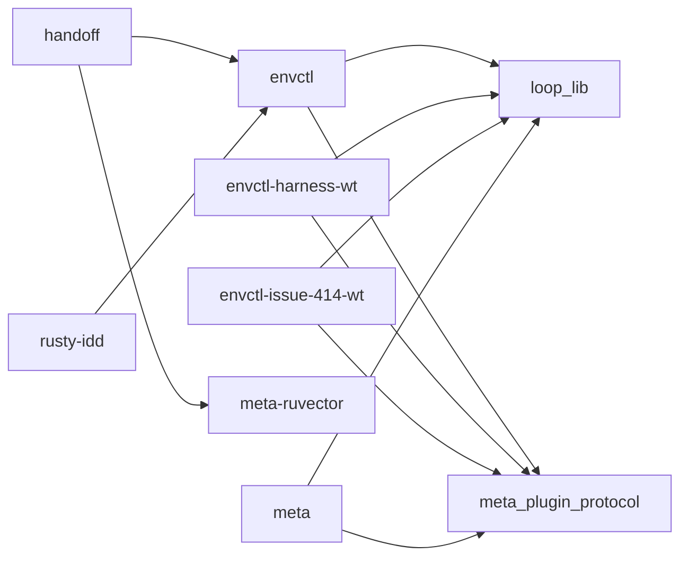

# LifeOS Cross-Repo Dependency Graph (generated)

> Generated 2026-07-08T03:05:15Z. Edges = a Cargo.toml `path = "../<repo>/..."` dependency crossing a repo boundary.

```mermaid
graph LR
  envctl --> loop_lib
  envctl --> meta_plugin_protocol
  envctl-harness-wt --> loop_lib
  envctl-harness-wt --> meta_plugin_protocol
  envctl-issue-414-wt --> loop_lib
  envctl-issue-414-wt --> meta_plugin_protocol
  handoff --> envctl
  handoff --> meta-ruvector
  meta --> loop_lib
  meta --> meta_plugin_protocol
  rusty-idd --> envctl
```
