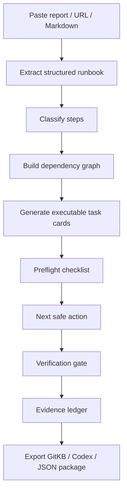

## Best app idea: **Runbook Compiler + Execution Cockpit**

Do **not** turn the report into a nicer page. Turn it into a **state machine**.

The app should ingest a report/runbook, extract every actionable item, convert it into structured tasks, then guide an agent or human through **preflight → execute → verify → evidence → rollback / close**. GitKB is a good fit because its model already thinks in typed documents like `task`, `spec`, `incident`, `note`, and `context`, with YAML frontmatter, statuses, priorities, parents, tags, and queryable JSON output. ([GitKB][1])

## Why this fits GitKB

GitKB is already more than documentation. It supports:

* **Task/document lifecycle:** `draft → backlog → active → blocked → completed`. ([GitKB][1])
* **Relationships:** `depends_on`, `blocks`, `implements`, `resolves`, `references_code`, and `references_commit`. ([GitKB][2])
* **Agent workflow:** load context, check board, claim work, update docs, commit progress. ([GitKB][3])
* **Deterministic task selection:** `git-kb ready --json`, `--context`, and smart-code context for orchestration. ([GitKB][3])
* **MCP tools:** read/write KB docs, update metadata, assign tasks, commit, search, graph, inspect code, stream events, and more. ([GitKB][4])

So the app should not be “GitKB explainer.” It should be **GitKB Runbook Pilot**.

---

# App concept

## **GitKB Runbook Pilot**

A mini app that turns any report/runbook into a controlled automation package.

### Core flow



## The important shift

A normal report says:

> “Here is what to do.”

The app says:

> “Here is the next safe action, why it is safe, what it depends on, how to verify it, and what evidence must be captured before moving forward.”

That is the difference between a webpage and an automation app.

---

# What the mini app should contain

## 1. **Report Ingest Panel**

Inputs:

* URL
* pasted Markdown
* uploaded report
* GitKB docs URL
* optional repo path
* optional agent target: Gemini, Codex, Claude, Cursor, generic MCP

Gemini can support this kind of build because AI Studio Build Mode now creates full-stack web apps through natural language prompting, with React as the default frontend and a Node.js backend for secure API calls, packages, and server-side logic. ([Google AI for Developers][5])

## 2. **Runbook Compiler**

Gemini extracts the report into a strict schema:

```json
{
  "runbook_title": "",
  "objective": "",
  "assumptions": [],
  "preflight_checks": [],
  "tasks": [
    {
      "id": "",
      "title": "",
      "type": "task|spec|context|incident|verification|rollback",
      "status": "draft",
      "priority": "critical|high|medium|low",
      "depends_on": [],
      "blocks": [],
      "commands": [],
      "files_touched": [],
      "verification": [],
      "evidence_required": [],
      "rollback": [],
      "human_approval_required": false
    }
  ],
  "risks": [],
  "unknowns": [],
  "export_targets": ["gitkb", "codex", "json", "markdown"]
}
```

Gemini structured outputs are the right fit here because they can constrain output to JSON with a schema instead of loose prose. ([Google AI for Developers][6])

## 3. **Execution Cockpit**

Each task becomes a card with:

* **Goal**
* **Inputs**
* **Dependencies**
* **Allowed actions**
* **Blocked-by reason**
* **Commands**
* **Verification gate**
* **Evidence required**
* **Rollback**
* **Export / commit status**

The key UI is not a dashboard. It is a **“Next Safe Step” button**.

Not “run everything.” That is how agents drift.

The app should say:

> “The next unblocked task is X. Before execution, these 3 preflight checks must pass. After execution, these 2 evidence items must be captured.”

## 4. **GitKB Exporter**

The app should export:

```text
.kb/
  workspace/
    context/immutable/project-runbook.md
    context/extensible/gitkb-adoption-model.md
    context/overridable/current-progress.md
    specs/runbook-compiler-spec.md
    tasks/gitkb-001-install.md
    tasks/gitkb-002-init-kb.md
    tasks/gitkb-003-init-codex.md
    tasks/gitkb-004-index-code.md
    tasks/gitkb-005-verify-board.md
  AGENTS.md
runbook.execution.json
codex.prompt.md
```

This maps cleanly to GitKB’s document model, frontmatter, graph relationships, task status, and workspace commit flow. ([GitKB][1])

## 5. **Agent Adapter**

For the first version, do **not** let the app blindly execute shell commands.

Use three modes:

| Mode                          | What it does                                    | Risk   |
| ----------------------------- | ----------------------------------------------- | ------ |
| **Static HTML mode**          | Parses report, builds task graph, exports files | Low    |
| **Full-stack AI Studio mode** | Adds backend, secrets, API calls, GitHub export | Medium |
| **Local runner mode**         | Talks to `git-kb`, Codex, shell, repo files     | High   |

AI Studio can export generated projects to ZIP/GitHub and deploy to Cloud Run, so the practical route is: build the UI in AI Studio, export to GitHub, then wire the local runner separately. ([Google AI for Developers][5])

---

# The real MVP

Build this first:

## **Single-screen Runbook-to-TaskGraph App**

### Left side

* Paste report
* Paste target docs URL
* Select target: `GitKB / Codex / Claude / Generic`
* Button: **Compile Runbook**

### Middle

* Task graph
* Blockers
* Parallel-safe tasks
* Sequential tasks
* Verification gates

### Right side

* Next safe action
* Prompt for agent
* GitKB Markdown export
* JSON execution package
* Evidence checklist

### Bottom

* Export buttons:

  * `Download runbook.execution.json`
  * `Download gitkb-task-pack.zip`
  * `Copy Codex prompt`
  * `Copy Gemini prompt`
  * `Copy AGENTS.md`

That is usable immediately, even before shell integration.

---

# Paste this into Gemini / Google AI Studio Build Mode

Build a full-stack web app called “GitKB Runbook Pilot.”

Purpose:
Turn a technical report, documentation page, or runbook into an actionable automation cockpit. This must not be a normal webpage, infographic, or static summary. It must compile the input into a structured execution package with tasks, dependencies, verification gates, rollback steps, and exportable artifacts.

Primary input:

* A text area for pasted Markdown/report content.
* A URL input for documentation, such as [https://gitkb.com/docs/](https://gitkb.com/docs/).
* Optional fields for project name, repo path, target agent, and execution mode.

Execution modes:

1. Static planning mode:

   * No shell execution.
   * Compile the report into structured tasks.
   * Export JSON, Markdown, and prompt files.

2. GitKB package mode:

   * Generate GitKB-compatible Markdown files using YAML frontmatter.
   * Generate context documents, specs, tasks, incidents if needed, and views.
   * Preserve relationships such as parent, depends_on, blocks, implements, resolves, references_code, and references_commit.
   * Generate an AGENTS.md policy file for agent execution discipline.

3. Local runner mode placeholder:

   * Show the intended API contract for a future local backend that can call git-kb CLI commands.
   * Do not fake shell execution.
   * Do not claim commands were run.
   * Clearly mark this mode as “requires local runner adapter.”

App requirements:

* Use a clean React UI with a Node.js backend.
* Store state locally in the browser unless the user enables persistence.
* Include a “Compile Runbook” button.
* Include a “Next Safe Action” panel.
* Include a task graph view.
* Include a blocker/dependency view.
* Include a preflight checklist.
* Include a verification gate checklist.
* Include an evidence ledger.
* Include rollback instructions per task.
* Include export buttons:

  * Download runbook.execution.json
  * Download gitkb-task-pack.zip
  * Copy Codex prompt
  * Copy Gemini prompt
  * Copy AGENTS.md
  * Copy shell-safe command plan

Strict schema:
Each generated task must include:

* id
* slug
* title
* type
* status
* priority
* parent
* depends_on
* blocks
* implements
* resolves
* tags
* objective
* inputs
* allowed_actions
* forbidden_actions
* commands
* files_touched
* verification
* evidence_required
* rollback
* human_approval_required
* agent_notes

Safety and truth rules:

* Never present generated tasks as executed.
* Never invent execution evidence.
* Never mark a task complete unless the user manually checks required evidence.
* Any shell command must be shown as proposed, not executed.
* If input content is ambiguous, put ambiguity into an “Unknowns / Clarifications” section instead of guessing.
* The app must separate facts extracted from the report from recommendations inferred by the app.

UI design:

* Left panel: input and compile controls.
* Center panel: task cards and graph.
* Right panel: selected task, next safe action, verification, evidence, rollback.
* Bottom panel: exports and generated prompts.

Default target:
GitKB documentation and agent workflow conversion.

Initial seed behavior:
When the user enters [https://gitkb.com/docs/](https://gitkb.com/docs/) or pasted GitKB docs, compile the content into:

* GitKB setup tasks
* Codex integration tasks
* MCP setup tasks
* code intelligence verification tasks
* agent workflow enforcement tasks
* evidence capture tasks
* rollback/recovery tasks

Deliver a working app with real generated files and real export buttons. Do not provide a mockup only.

---

# My blunt recommendation

Use **Gemini AI Studio Build Mode** for the first pass, but do **not** ask for “an HTML app.” Ask for a **full-stack runbook compiler**.

A single-file HTML app is fine for a lightweight artifact viewer, but it will hit a wall the moment you need:

* secure API keys,
* URL ingestion,
* file export ZIPs,
* GitHub export,
* Google Drive/Workspace access,
* future local command execution,
* or a proper backend adapter.

Google’s current AI Studio Build Mode supports full-stack web apps, server-side Node runtime, npm packages, secrets, Firebase, Workspace integrations, GitHub export, and Cloud Run deployment, which is much closer to what you need than a static infographic-style HTML artifact. ([Google AI for Developers][5])

The north-star version is:

> **Report in → executable task graph out → agent follows gates → evidence proves completion.**

[1]: https://gitkb.com/docs/core-concepts/documents/ "Documents — GitKB Docs"
[2]: https://gitkb.com/docs/core-concepts/knowledge-graph/ "Knowledge Graph — GitKB Docs"
[3]: https://gitkb.com/docs/guides/agent-workflows/ "Agent Workflows — GitKB Docs"
[4]: https://gitkb.com/docs/getting-started/mcp-setup/ "MCP Setup — GitKB Docs"
[5]: https://ai.google.dev/gemini-api/docs/aistudio-build-mode "Build apps in Google AI Studio  |  Gemini API  |  Google AI for Developers"
[6]: https://ai.google.dev/gemini-api/docs/structured-output "Structured outputs  |  Gemini API  |  Google AI for Developers"

